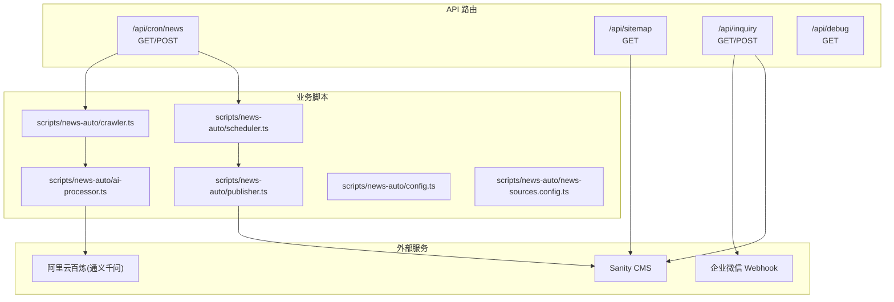
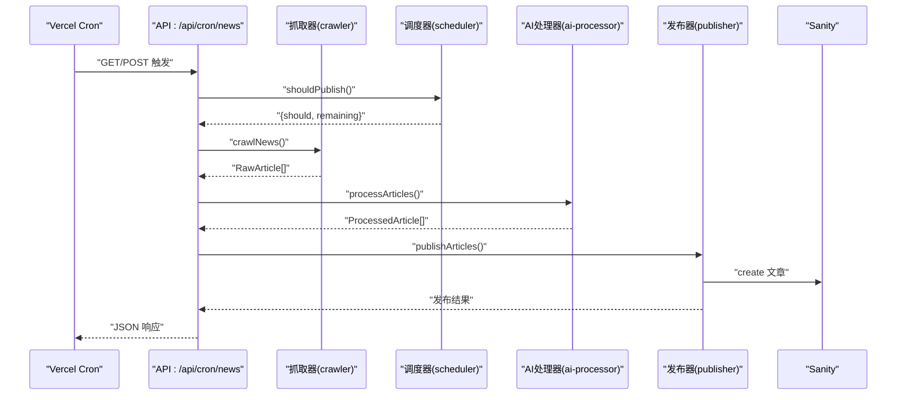
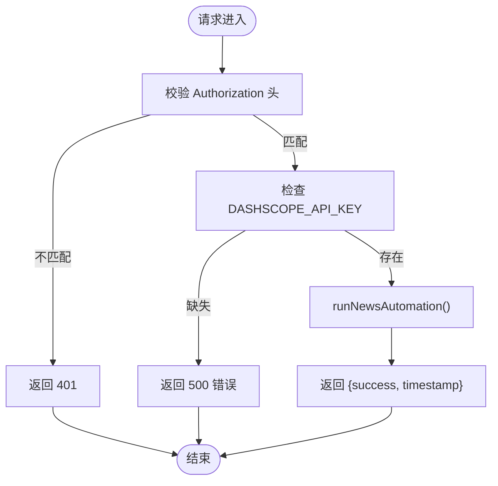
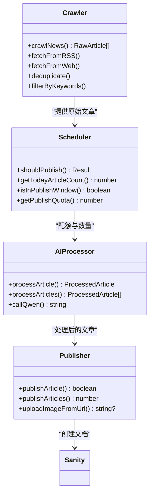
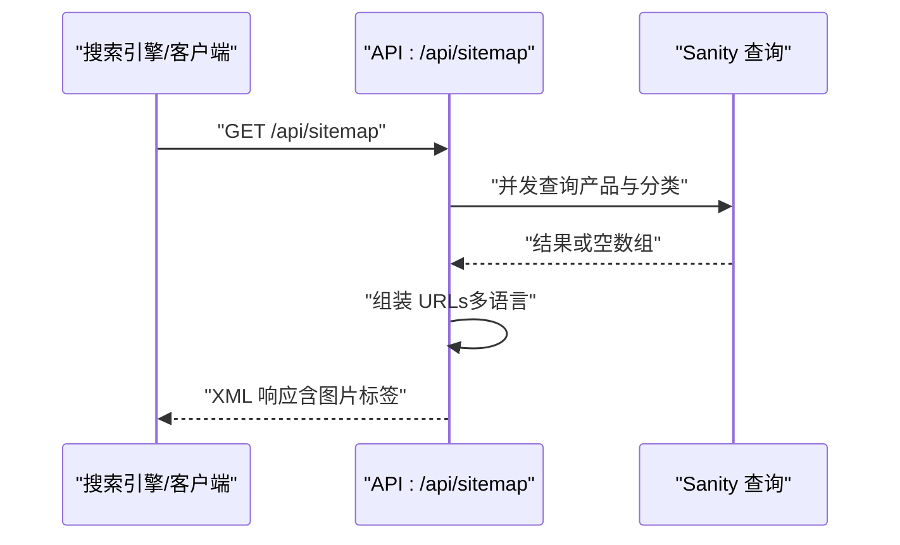
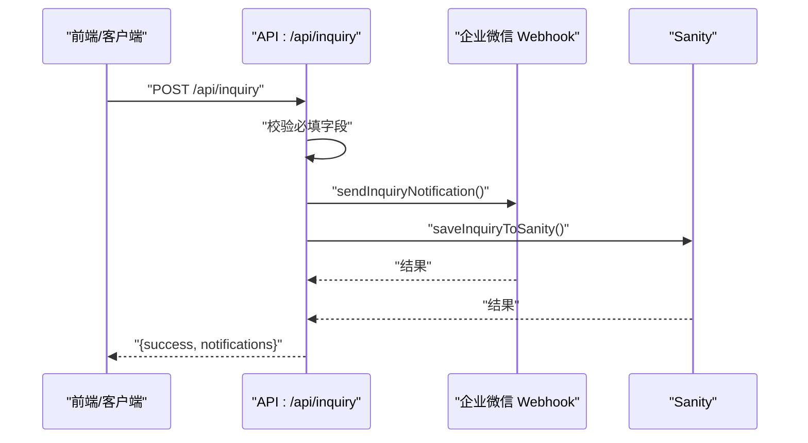
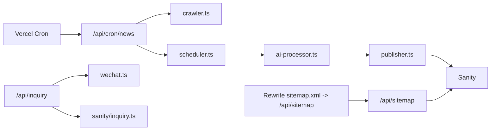

# API系统

<cite>
**本文引用的文件**
- [app/api/cron/news/route.ts](file://app/api/cron/news/route.ts)
- [app/api/sitemap/route.ts](file://app/api/sitemap/route.ts)
- [app/api/inquiry/route.tsx](file://app/api/inquiry/route.tsx)
- [app/api/debug/route.ts](file://app/api/debug/route.ts)
- [scripts/news-auto/crawler.ts](file://scripts/news-auto/crawler.ts)
- [scripts/news-auto/config.ts](file://scripts/news-auto/config.ts)
- [scripts/news-auto/news-sources.config.ts](file://scripts/news-auto/news-sources.config.ts)
- [scripts/news-auto/scheduler.ts](file://scripts/news-auto/scheduler.ts)
- [scripts/news-auto/publisher.ts](file://scripts/news-auto/publisher.ts)
- [scripts/news-auto/ai-processor.ts](file://scripts/news-auto/ai-processor.ts)
- [lib/notification/wechat.ts](file://lib/notification/wechat.ts)
- [lib/sanity/inquiry.ts](file://lib/sanity/inquiry.ts)
- [lib/sanity/queries.ts](file://lib/sanity/queries.ts)
- [vercel.json](file://vercel.json)
- [package.json](file://package.json)
</cite>

## 目录
1. [简介](#简介)
2. [项目结构](#项目结构)
3. [核心组件](#核心组件)
4. [架构总览](#架构总览)
5. [详细组件分析](#详细组件分析)
6. [依赖关系分析](#依赖关系分析)
7. [性能考量](#性能考量)
8. [故障排查指南](#故障排查指南)
9. [结论](#结论)
10. [附录](#附录)

## 简介
本文件为 GoPro Trade 网站的 API 系统文档，聚焦于 Next.js App Router 中的 API 路由组织、路由参数处理、HTTP 方法支持，以及四大核心 API 的实现与集成：新闻自动抓取与发布、动态站点地图生成、询盘提交与通知、调试工具。文档还涵盖定时任务配置、数据抓取与清洗、SEO 优化、安全配置（CORS、请求限制、数据校验）、以及使用示例与集成指南。

## 项目结构
API 路由位于 app/api 下，采用 App Router 的约定式路由：
- /api/cron/news：定时任务入口，对接 Vercel Cron
- /api/sitemap：动态生成站点地图
- /api/inquiry：询盘提交与通知
- /api/debug：开发调试工具

图表来源
- [app/api/cron/news/route.ts:1-52](file://app/api/cron/news/route.ts#L1-L52)
- [app/api/sitemap/route.ts:1-100](file://app/api/sitemap/route.ts#L1-L100)
- [app/api/inquiry/route.tsx:1-103](file://app/api/inquiry/route.tsx#L1-L103)
- [app/api/debug/route.ts:1-16](file://app/api/debug/route.ts#L1-L16)
- [scripts/news-auto/crawler.ts:1-197](file://scripts/news-auto/crawler.ts#L1-L197)
- [scripts/news-auto/scheduler.ts:1-104](file://scripts/news-auto/scheduler.ts#L1-L104)
- [scripts/news-auto/publisher.ts:1-240](file://scripts/news-auto/publisher.ts#L1-L240)
- [scripts/news-auto/ai-processor.ts:1-232](file://scripts/news-auto/ai-processor.ts#L1-L232)
- [scripts/news-auto/config.ts:1-45](file://scripts/news-auto/config.ts#L1-L45)
- [scripts/news-auto/news-sources.config.ts:1-155](file://scripts/news-auto/news-sources.config.ts#L1-L155)

章节来源
- [app/api/cron/news/route.ts:1-52](file://app/api/cron/news/route.ts#L1-L52)
- [app/api/sitemap/route.ts:1-100](file://app/api/sitemap/route.ts#L1-L100)
- [app/api/inquiry/route.tsx:1-103](file://app/api/inquiry/route.tsx#L1-L103)
- [app/api/debug/route.ts:1-16](file://app/api/debug/route.ts#L1-L16)

## 核心组件
- 新闻自动化 API：接收定时任务触发，执行抓取、AI 改写与翻译、去重与关键词过滤、分时段配额控制，并将文章发布至 Sanity。
- 站点地图 API：动态生成包含静态页、分类页、产品详情页的 XML 站点地图，支持多语言与图片标签。
- 询盘处理 API：接收表单数据，进行字段校验与本地化映射，异步发送企业微信通知与保存至 Sanity。
- 调试 API：返回请求头、URL、路径等信息，便于开发与联调。

章节来源
- [app/api/cron/news/route.ts:1-52](file://app/api/cron/news/route.ts#L1-L52)
- [app/api/sitemap/route.ts:1-100](file://app/api/sitemap/route.ts#L1-L100)
- [app/api/inquiry/route.tsx:1-103](file://app/api/inquiry/route.tsx#L1-L103)
- [app/api/debug/route.ts:1-16](file://app/api/debug/route.ts#L1-L16)

## 架构总览
API 路由通过 Next.js App Router 组织，结合 Vercel Cron、Sanity、企业微信与通义千问等外部服务，形成完整的数据采集、处理与发布链路。

图表来源
- [app/api/cron/news/route.ts:1-52](file://app/api/cron/news/route.ts#L1-L52)
- [scripts/news-auto/crawler.ts:155-197](file://scripts/news-auto/crawler.ts#L155-L197)
- [scripts/news-auto/scheduler.ts:67-94](file://scripts/news-auto/scheduler.ts#L67-L94)
- [scripts/news-auto/ai-processor.ts:215-232](file://scripts/news-auto/ai-processor.ts#L215-L232)
- [scripts/news-auto/publisher.ts:215-240](file://scripts/news-auto/publisher.ts#L215-L240)

## 详细组件分析

### 新闻自动化 API（/api/cron/news）
- 功能概述
  - 接收 Vercel Cron 触发，校验 Bearer Token（CRON_SECRET），执行新闻自动化流程。
  - 校验 DASHSCOPE_API_KEY，确保 AI 改写与翻译可用。
  - 返回 JSON 结果，包含成功标志与时间戳；异常时返回 500 与错误信息。
- 安全与鉴权
  - Authorization 头需匹配 Bearer CRON_SECRET。
  - 未配置 API Key 时直接拒绝。
- 并发与稳定性
  - 捕获异常并记录日志，避免中断。
- HTTP 方法
  - GET/POST 均走相同逻辑，便于手动触发。

图表来源
- [app/api/cron/news/route.ts:5-51](file://app/api/cron/news/route.ts#L5-L51)

章节来源
- [app/api/cron/news/route.ts:1-52](file://app/api/cron/news/route.ts#L1-L52)

### 新闻抓取与处理（scripts/news-auto）
- 抓取器（crawler）
  - 支持 RSS 与网页两种抓取方式，自动提取标题、链接、摘要、内容、图片与发布日期。
  - 基于 news-sources.config.ts 的独立配置，支持自定义 headers、选择器与优先级。
  - 去重（基于链接）与关键词过滤（必选/排除）。
- 调度器（scheduler）
  - 判断北京时间（UTC+8）是否处于设定的发布窗口（±90 分钟容差）。
  - 依据每日配额计算剩余可发布数，避免超限。
- AI 处理器（ai-processor）
  - 调用通义千问 API，完成中文改写、标题与摘要生成、多语言翻译、关键词抽取与 SEO 信息生成。
- 发布器（publisher）
  - 去重检查、分类 ID 解析、图片下载与上传、构建 Sanity 文档并创建。
  - 发布后延时以规避限流。

图表来源
- [scripts/news-auto/crawler.ts:155-197](file://scripts/news-auto/crawler.ts#L155-L197)
- [scripts/news-auto/scheduler.ts:67-104](file://scripts/news-auto/scheduler.ts#L67-L104)
- [scripts/news-auto/ai-processor.ts:153-232](file://scripts/news-auto/ai-processor.ts#L153-L232)
- [scripts/news-auto/publisher.ts:58-240](file://scripts/news-auto/publisher.ts#L58-L240)

章节来源
- [scripts/news-auto/crawler.ts:1-197](file://scripts/news-auto/crawler.ts#L1-L197)
- [scripts/news-auto/scheduler.ts:1-104](file://scripts/news-auto/scheduler.ts#L1-L104)
- [scripts/news-auto/ai-processor.ts:1-232](file://scripts/news-auto/ai-processor.ts#L1-L232)
- [scripts/news-auto/publisher.ts:1-240](file://scripts/news-auto/publisher.ts#L1-L240)
- [scripts/news-auto/config.ts:1-45](file://scripts/news-auto/config.ts#L1-L45)
- [scripts/news-auto/news-sources.config.ts:1-155](file://scripts/news-auto/news-sources.config.ts#L1-L155)

### 站点地图 API（/api/sitemap）
- 动态生成
  - force-dynamic 禁用构建期缓存，保证数据实时性。
  - 从 Sanity 并行查询产品 slug 与分类，失败时回退为空数组。
- 多语言覆盖
  - 遍历 locales，生成静态页、分类页、产品详情页的 URL。
- XML 输出
  - 生成带图片标签的 XML，设置 Content-Type 与缓存头。
- 性能优化
  - 使用 Promise.all 并行获取数据，合理缓存策略。

图表来源
- [app/api/sitemap/route.ts:16-99](file://app/api/sitemap/route.ts#L16-L99)
- [lib/sanity/queries.ts:91-94](file://lib/sanity/queries.ts#L91-L94)

章节来源
- [app/api/sitemap/route.ts:1-100](file://app/api/sitemap/route.ts#L1-L100)
- [lib/sanity/queries.ts:1-120](file://lib/sanity/queries.ts#L1-L120)

### 询盘处理 API（/api/inquiry）
- GET 测试接口
  - 返回 API 工作状态与时间戳。
- POST 询盘提交
  - 必填字段校验（公司名、联系人、邮箱、电话、国家）。
  - 产品与国家名称按 locale 映射本地化。
  - 并行发送企业微信通知与保存至 Sanity，即使通知失败也返回成功（数据已落库）。
- 通知与存储
  - 企业微信：Markdown 格式，包含关键信息与提交时间。
  - Sanity：创建 inquiry 文档，包含状态、提交时间、语言等。

图表来源
- [app/api/inquiry/route.tsx:21-102](file://app/api/inquiry/route.tsx#L21-L102)
- [lib/notification/wechat.ts:21-96](file://lib/notification/wechat.ts#L21-L96)
- [lib/sanity/inquiry.ts:32-73](file://lib/sanity/inquiry.ts#L32-L73)

章节来源
- [app/api/inquiry/route.tsx:1-103](file://app/api/inquiry/route.tsx#L1-L103)
- [lib/notification/wechat.ts:1-96](file://lib/notification/wechat.ts#L1-L96)
- [lib/sanity/inquiry.ts:1-73](file://lib/sanity/inquiry.ts#L1-L73)

### 调试 API（/api/debug）
- 功能
  - 返回请求头、URL、路径与时间戳，便于开发调试与问题定位。
- 使用场景
  - 验证请求头传递、确认路由命中、排查跨域与代理问题。

章节来源
- [app/api/debug/route.ts:1-16](file://app/api/debug/route.ts#L1-L16)

## 依赖关系分析
- 外部依赖
  - axios、rss-parser、cheerio：抓取与解析。
  - @sanity/client：与 Sanity 交互。
  - 通义千问 API：AI 改写与翻译。
  - 企业微信 Webhook：通知推送。
- 平台集成
  - Vercel Cron：定时触发新闻自动化。
  - Rewrites：将 /sitemap.xml 重写到 /api/sitemap。

图表来源
- [vercel.json:27-42](file://vercel.json#L27-L42)
- [app/api/cron/news/route.ts:1-52](file://app/api/cron/news/route.ts#L1-L52)
- [app/api/sitemap/route.ts:1-100](file://app/api/sitemap/route.ts#L1-L100)
- [app/api/inquiry/route.tsx:1-103](file://app/api/inquiry/route.tsx#L1-L103)
- [scripts/news-auto/crawler.ts:1-197](file://scripts/news-auto/crawler.ts#L1-L197)
- [scripts/news-auto/scheduler.ts:1-104](file://scripts/news-auto/scheduler.ts#L1-L104)
- [scripts/news-auto/ai-processor.ts:1-232](file://scripts/news-auto/ai-processor.ts#L1-L232)
- [scripts/news-auto/publisher.ts:1-240](file://scripts/news-auto/publisher.ts#L1-L240)
- [lib/notification/wechat.ts:1-96](file://lib/notification/wechat.ts#L1-L96)
- [lib/sanity/inquiry.ts:1-73](file://lib/sanity/inquiry.ts#L1-L73)

章节来源
- [vercel.json:1-44](file://vercel.json#L1-L44)
- [package.json:12-28](file://package.json#L12-L28)

## 性能考量
- 并行查询与处理
  - 站点地图：Promise.all 并行获取产品与分类。
  - 询盘：并行发送企业微信通知与保存 Sanity。
  - 新闻：AI 与发布阶段设置延时，避免外部 API 限流。
- 缓存与重建
  - 站点地图设置缓存头，降低频繁请求压力。
  - Sanity 查询设置 revalidate，平衡新鲜度与性能。
- 时间窗口与配额
  - 调度器在发布窗口与每日配额之间做约束，避免超负荷。

章节来源
- [app/api/sitemap/route.ts:24-31](file://app/api/sitemap/route.ts#L24-L31)
- [app/api/inquiry/route.tsx:77-80](file://app/api/inquiry/route.tsx#L77-L80)
- [scripts/news-auto/ai-processor.ts:224-224](file://scripts/news-auto/ai-processor.ts#L224-L224)
- [scripts/news-auto/publisher.ts:235-235](file://scripts/news-auto/publisher.ts#L235-L235)
- [lib/sanity/queries.ts:12-12](file://lib/sanity/queries.ts#L12-L12)

## 故障排查指南
- 新闻自动化失败
  - 检查 CRON_SECRET 是否正确配置与传递。
  - 确认 DASHSCOPE_API_KEY 是否存在。
  - 查看日志中的错误堆栈与具体失败步骤。
- 站点地图为空
  - 确认 Sanity 数据库连接与查询权限。
  - 检查 locales 配置与 baseUrl 设置。
- 询盘通知失败
  - 检查 WECHAT_WEBHOOK_URL 是否配置。
  - 确认网络连通与企业微信回调状态码。
- Sanity 保存失败
  - 检查 SANITY_API_TOKEN 与项目/数据集配置。
- 调试请求
  - 使用 /api/debug 查看请求头与路径，辅助定位问题。

章节来源
- [app/api/cron/news/route.ts:36-45](file://app/api/cron/news/route.ts#L36-L45)
- [app/api/sitemap/route.ts:28-31](file://app/api/sitemap/route.ts#L28-L31)
- [lib/notification/wechat.ts:22-27](file://lib/notification/wechat.ts#L22-L27)
- [lib/sanity/inquiry.ts:33-36](file://lib/sanity/inquiry.ts#L33-L36)
- [app/api/debug/route.ts:3-15](file://app/api/debug/route.ts#L3-L15)

## 结论
本 API 系统围绕“定时抓取—AI 处理—发布入库—多语言站点地图—询盘通知”形成闭环，具备良好的扩展性与可维护性。通过独立配置文件管理新闻源、严格的鉴权与限流策略、并行处理与缓存优化，满足生产环境对稳定性与性能的要求。

## 附录

### API 使用示例与集成指南
- 新闻自动化（定时触发）
  - 在 Vercel 控制台配置 Cron，触发路径为 /api/cron/news。
  - 确保环境变量：CRON_SECRET、DASHSCOPE_API_KEY。
- 站点地图
  - 访问 /sitemap.xml（由 vercel.json 重写到 /api/sitemap）。
  - 可在搜索引擎平台提交 sitemap.xml。
- 询盘提交
  - POST /api/inquiry，请求体包含公司名、联系人、邮箱、电话、国家、产品、数量、留言、locale。
  - 成功即返回 {success, notifications}，通知失败不影响数据落库。
- 调试
  - GET /api/debug，查看请求上下文信息。

章节来源
- [vercel.json:33-42](file://vercel.json#L33-L42)
- [app/api/inquiry/route.tsx:21-34](file://app/api/inquiry/route.tsx#L21-L34)
- [app/api/debug/route.ts:3-15](file://app/api/debug/route.ts#L3-L15)

### 安全配置要点
- CORS 与头部防护
  - 通过 vercel.json 注入安全响应头（X-Content-Type-Options、X-Frame-Options、X-XSS-Protection）。
- 请求鉴权
  - 新闻自动化使用 Bearer Token（CRON_SECRET）鉴权。
- 数据校验
  - 询盘接口对必填字段进行校验，避免脏数据进入系统。
- 速率限制
  - 通过调度器的时间窗口与配额控制，配合发布阶段延时，避免外部 API 限流。

章节来源
- [vercel.json:8-26](file://vercel.json#L8-L26)
- [app/api/cron/news/route.ts:7-15](file://app/api/cron/news/route.ts#L7-L15)
- [app/api/inquiry/route.tsx:36-42](file://app/api/inquiry/route.tsx#L36-L42)