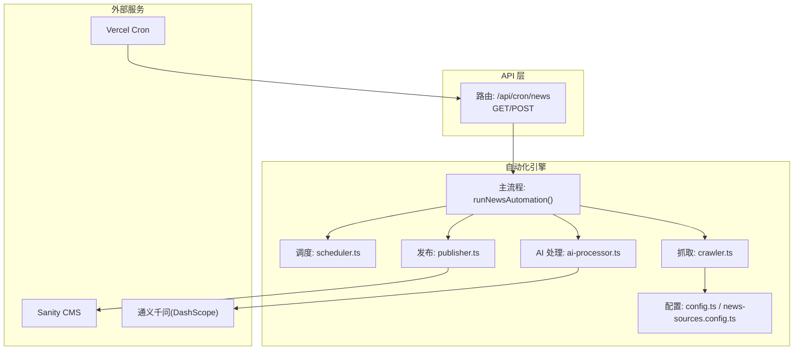
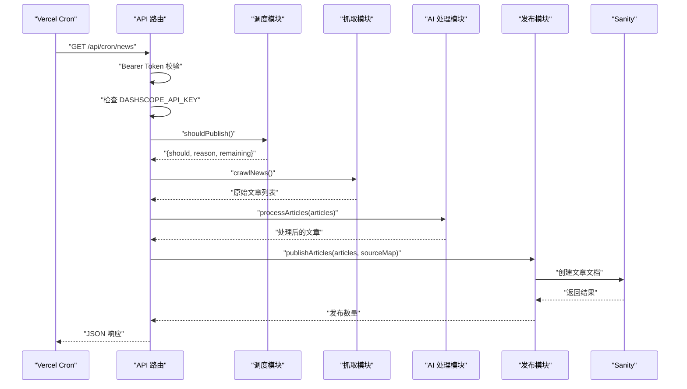
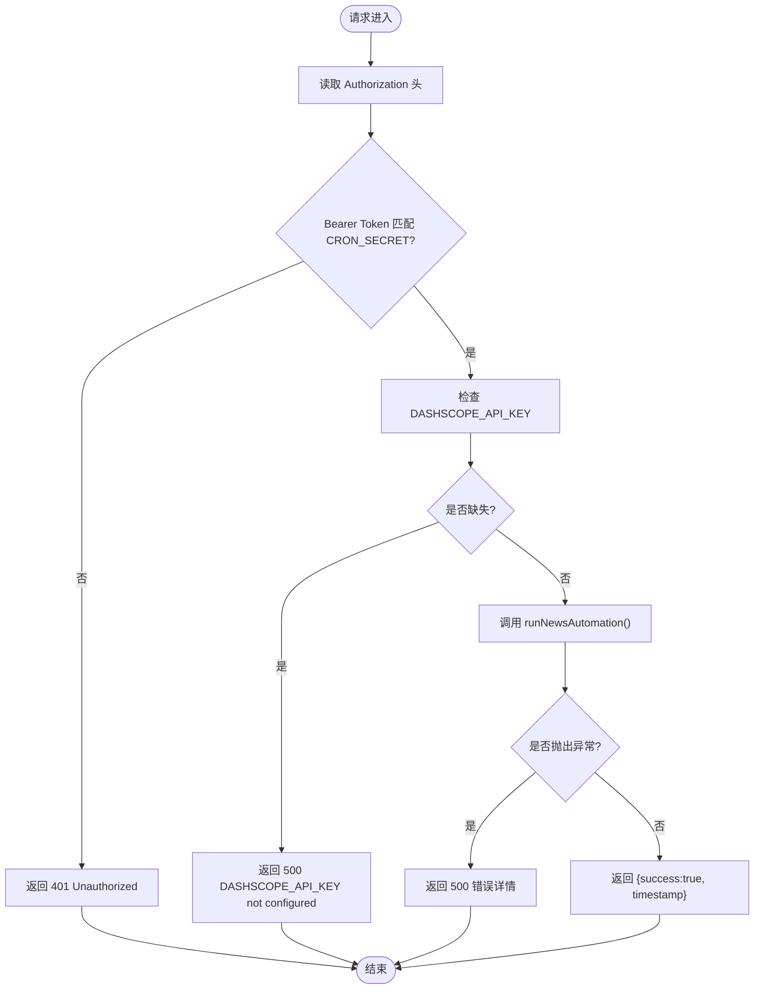
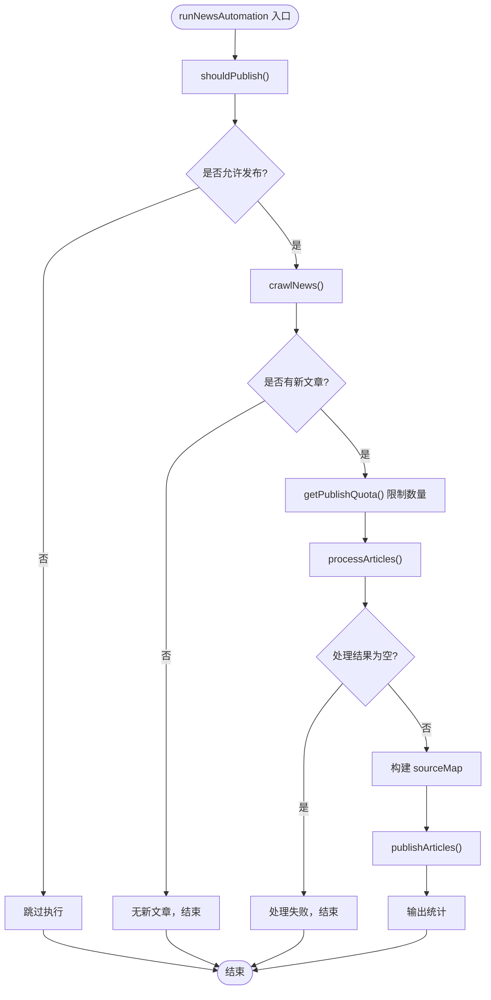
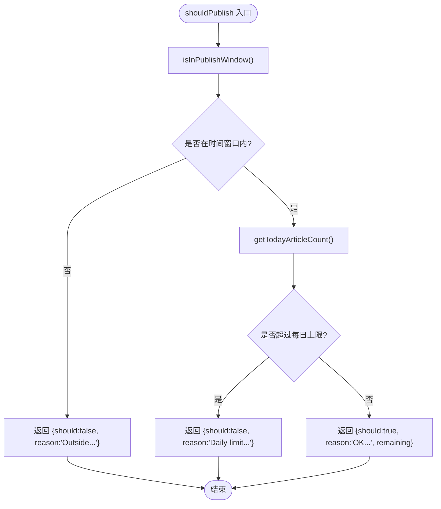
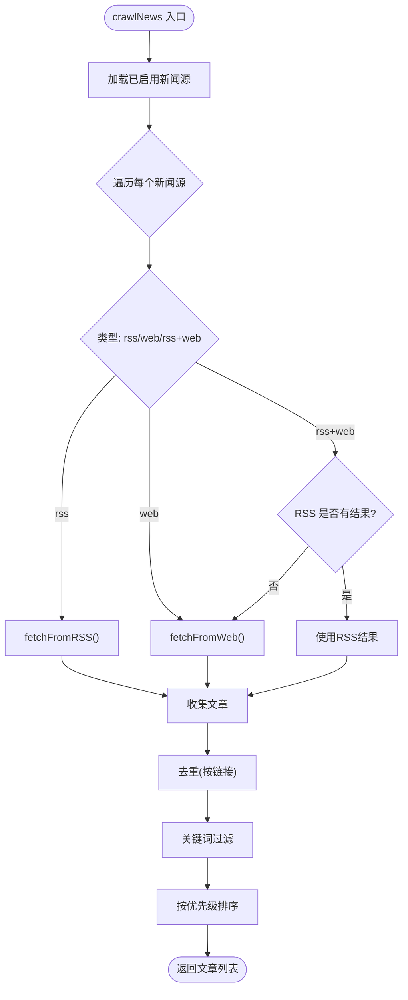
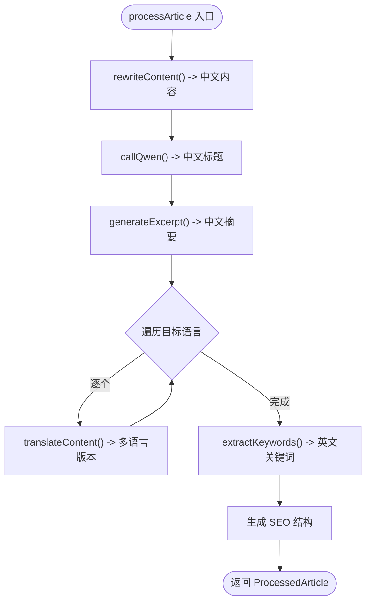
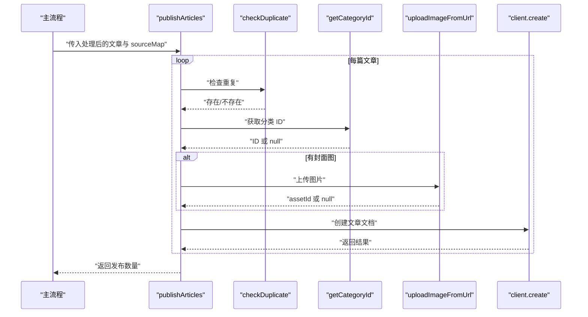
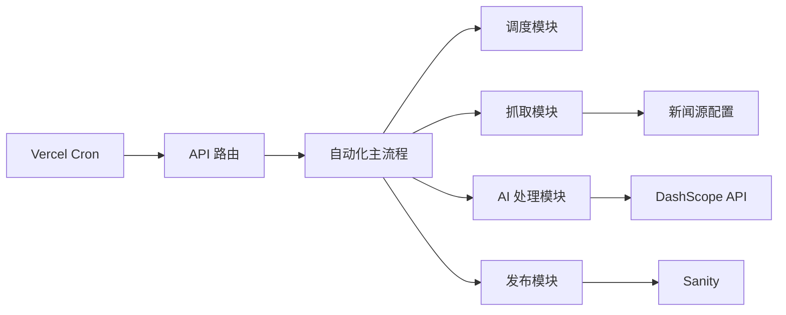

# 新闻爬取API

<cite>
**本文引用的文件**
- [app/api/cron/news/route.ts](file://app/api/cron/news/route.ts)
- [scripts/news-auto/index.ts](file://scripts/news-auto/index.ts)
- [scripts/news-auto/scheduler.ts](file://scripts/news-auto/scheduler.ts)
- [scripts/news-auto/crawler.ts](file://scripts/news-auto/crawler.ts)
- [scripts/news-auto/ai-processor.ts](file://scripts/news-auto/ai-processor.ts)
- [scripts/news-auto/publisher.ts](file://scripts/news-auto/publisher.ts)
- [scripts/news-auto/config.ts](file://scripts/news-auto/config.ts)
- [scripts/news-auto/news-sources.config.ts](file://scripts/news-auto/news-sources.config.ts)
- [vercel.json](file://vercel.json)
- [package.json](file://package.json)
</cite>

## 目录
1. [简介](#简介)
2. [项目结构](#项目结构)
3. [核心组件](#核心组件)
4. [架构总览](#架构总览)
5. [详细组件分析](#详细组件分析)
6. [依赖关系分析](#依赖关系分析)
7. [性能考量](#性能考量)
8. [故障排查指南](#故障排查指南)
9. [结论](#结论)
10. [附录](#附录)

## 简介
本项目提供一个基于 Next.js App Router 的新闻自动化爬取与发布 API，支持通过 Vercel Cron 定时触发以及手动 POST 触发。系统包含完整的数据抓取、内容清洗与关键词过滤、AI 内容改写与多语言翻译、以及最终发布到 Sanity CMS 的全流程。API 在 Vercel Cron 调用时采用 Bearer Token 授权校验，并在运行前检查必要的环境变量（如 DASHSCOPE_API_KEY），确保安全与稳定性。

## 项目结构
- API 层：位于 app/api/cron/news/route.ts，暴露 /api/cron/news 路径，支持 GET 和 POST 方法，内部调用自动化主流程。
- 自动化引擎：位于 scripts/news-auto/，包含抓取、AI 处理、发布、调度与配置模块。
- 部署配置：vercel.json 定义 Vercel Cron 调度规则与安全头；package.json 描述依赖与构建命令。

图表来源
- [app/api/cron/news/route.ts:1-52](file://app/api/cron/news/route.ts#L1-L52)
- [scripts/news-auto/index.ts:1-83](file://scripts/news-auto/index.ts#L1-L83)
- [scripts/news-auto/scheduler.ts:1-104](file://scripts/news-auto/scheduler.ts#L1-L104)
- [scripts/news-auto/crawler.ts:1-197](file://scripts/news-auto/crawler.ts#L1-L197)
- [scripts/news-auto/ai-processor.ts:1-232](file://scripts/news-auto/ai-processor.ts#L1-L232)
- [scripts/news-auto/publisher.ts:1-240](file://scripts/news-auto/publisher.ts#L1-L240)
- [scripts/news-auto/config.ts:1-45](file://scripts/news-auto/config.ts#L1-L45)
- [scripts/news-auto/news-sources.config.ts:1-155](file://scripts/news-auto/news-sources.config.ts#L1-L155)
- [vercel.json:33-42](file://vercel.json#L33-L42)

章节来源
- [app/api/cron/news/route.ts:1-52](file://app/api/cron/news/route.ts#L1-L52)
- [vercel.json:1-44](file://vercel.json#L1-L44)

## 核心组件
- API 路由：负责接收 Vercel Cron 的 GET 请求与手动触发的 POST 请求，执行授权校验与环境变量检查，随后调用自动化主流程并返回 JSON 响应。
- 自动化主流程：封装抓取、AI 处理、发布与统计输出，统一异常捕获与日志记录。
- 调度模块：判断是否在发布时间段、是否超过每日配额，决定是否执行自动化流程。
- 抓取模块：支持 RSS 与网页两种抓取方式，具备去重、关键词过滤与优先级排序。
- AI 处理模块：调用 DashScope 通义千问模型进行内容改写、标题生成、摘要生成、多语言翻译与关键词抽取。
- 发布模块：上传封面图、构建 Sanity 文档、去重检查、批量发布并返回成功数量。
- 配置模块：集中管理发布策略、关键词过滤、AI 参数、分类映射与目标语言。

章节来源
- [scripts/news-auto/index.ts:1-83](file://scripts/news-auto/index.ts#L1-L83)
- [scripts/news-auto/scheduler.ts:1-104](file://scripts/news-auto/scheduler.ts#L1-L104)
- [scripts/news-auto/crawler.ts:1-197](file://scripts/news-auto/crawler.ts#L1-L197)
- [scripts/news-auto/ai-processor.ts:1-232](file://scripts/news-auto/ai-processor.ts#L1-L232)
- [scripts/news-auto/publisher.ts:1-240](file://scripts/news-auto/publisher.ts#L1-L240)
- [scripts/news-auto/config.ts:1-45](file://scripts/news-auto/config.ts#L1-L45)
- [scripts/news-auto/news-sources.config.ts:1-155](file://scripts/news-auto/news-sources.config.ts#L1-L155)

## 架构总览
下图展示了从 Vercel Cron 触发到最终发布到 Sanity 的端到端流程，以及各模块之间的依赖关系。

图表来源
- [app/api/cron/news/route.ts:5-51](file://app/api/cron/news/route.ts#L5-L51)
- [scripts/news-auto/index.ts:9-69](file://scripts/news-auto/index.ts#L9-L69)
- [scripts/news-auto/scheduler.ts:67-94](file://scripts/news-auto/scheduler.ts#L67-L94)
- [scripts/news-auto/crawler.ts:155-196](file://scripts/news-auto/crawler.ts#L155-L196)
- [scripts/news-auto/ai-processor.ts:215-231](file://scripts/news-auto/ai-processor.ts#L215-L231)
- [scripts/news-auto/publisher.ts:215-239](file://scripts/news-auto/publisher.ts#L215-L239)

## 详细组件分析

### API 路由与授权机制
- 方法支持：GET（Vercel Cron 触发）与 POST（手动触发）。
- 授权校验：从 Authorization 头提取 Bearer Token，与环境变量 CRON_SECRET 比较，不匹配则返回 401。
- 环境变量检查：若未配置 DASHSCOPE_API_KEY，则返回 500。
- 异常处理：捕获运行期错误，返回包含错误信息的 JSON，并设置 500 状态码。
- 成功响应：返回 { success: true, timestamp: ISO 字符串 }。

图表来源
- [app/api/cron/news/route.ts:5-51](file://app/api/cron/news/route.ts#L5-L51)

章节来源
- [app/api/cron/news/route.ts:1-52](file://app/api/cron/news/route.ts#L1-L52)

### 自动化主流程
- 流程步骤：发布检查 → 抓取 → 限额裁剪 → AI 处理 → 构建 sourceMap → 发布 → 统计输出。
- 日志输出：包含启动时间、剩余配额、抓取/处理/发布数量等。
- 异常处理：捕获并抛出错误，便于上层统一处理。

图表来源
- [scripts/news-auto/index.ts:9-69](file://scripts/news-auto/index.ts#L9-L69)
- [scripts/news-auto/scheduler.ts:67-103](file://scripts/news-auto/scheduler.ts#L67-L103)
- [scripts/news-auto/crawler.ts:155-196](file://scripts/news-auto/crawler.ts#L155-L196)
- [scripts/news-auto/ai-processor.ts:215-231](file://scripts/news-auto/ai-processor.ts#L215-L231)
- [scripts/news-auto/publisher.ts:215-239](file://scripts/news-auto/publisher.ts#L215-L239)

章节来源
- [scripts/news-auto/index.ts:1-83](file://scripts/news-auto/index.ts#L1-L83)

### 调度模块（时间窗口与配额）
- 时间窗口：将 UTC 时间转换为北京时间（UTC+8），在 ±90 分钟窗口内允许发布；可通过环境变量绕过时间检查用于测试。
- 配额检查：查询当天自动发布文章数量，不超过每日上限才允许发布。
- 返回结构：{ should, reason, remaining }，remaining 用于限制处理数量。

图表来源
- [scripts/news-auto/scheduler.ts:67-94](file://scripts/news-auto/scheduler.ts#L67-L94)
- [scripts/news-auto/scheduler.ts:29-60](file://scripts/news-auto/scheduler.ts#L29-L60)
- [scripts/news-auto/scheduler.ts:7-20](file://scripts/news-auto/scheduler.ts#L7-L20)

章节来源
- [scripts/news-auto/scheduler.ts:1-104](file://scripts/news-auto/scheduler.ts#L1-L104)

### 抓取模块（RSS 与网页）
- RSS 抓取：支持自定义 headers，提取标题、链接、内容、摘要、发布时间、图片等字段。
- 网页抓取：合并默认 UA 与自定义 headers，使用 cheerio 解析，支持相对路径图片与链接补全。
- 过滤与去重：基于关键词集合进行过滤，按链接去重，按新闻源优先级排序。
- 新闻源配置：独立文件维护，支持启用/停用、优先级、类型（rss/web/rss+web）与自定义 headers。

图表来源
- [scripts/news-auto/crawler.ts:155-196](file://scripts/news-auto/crawler.ts#L155-L196)
- [scripts/news-auto/crawler.ts:22-121](file://scripts/news-auto/crawler.ts#L22-L121)
- [scripts/news-auto/news-sources.config.ts:136-140](file://scripts/news-auto/news-sources.config.ts#L136-L140)

章节来源
- [scripts/news-auto/crawler.ts:1-197](file://scripts/news-auto/crawler.ts#L1-L197)
- [scripts/news-auto/news-sources.config.ts:1-155](file://scripts/news-auto/news-sources.config.ts#L1-L155)

### AI 处理模块（DashScope 通义千问）
- 模型调用：使用 qwen-turbo，支持温度与最大 token 配置，超时 60 秒。
- 功能清单：中文内容改写、标题生成、摘要生成、多语言翻译（zh/en/id/th/vi/ar）、关键词抽取。
- 错误处理：单篇文章处理失败不影响整体流程，使用降级策略（回退到英文或中文）。
- 性能控制：为避免 API 限流，处理间隔约 2 秒。

图表来源
- [scripts/news-auto/ai-processor.ts:153-211](file://scripts/news-auto/ai-processor.ts#L153-L211)
- [scripts/news-auto/ai-processor.ts:19-58](file://scripts/news-auto/ai-processor.ts#L19-L58)

章节来源
- [scripts/news-auto/ai-processor.ts:1-232](file://scripts/news-auto/ai-processor.ts#L1-L232)
- [scripts/news-auto/config.ts:21-34](file://scripts/news-auto/config.ts#L21-L34)

### 发布模块（Sanity）
- 去重检查：按中文标题查询是否存在相同文章。
- 分类映射：根据分类 slug 获取 Sanity 分类 ID。
- 图片上传：下载远程图片并上传至 Sanity Assets，支持相对路径补全。
- 文档构建：按多语言结构构建内容块，设置作者、来源（自动）、SEO 等字段。
- 批量发布：逐条发布并延时避免限流，返回成功数量。

图表来源
- [scripts/news-auto/publisher.ts:58-212](file://scripts/news-auto/publisher.ts#L58-L212)
- [scripts/news-auto/publisher.ts:215-239](file://scripts/news-auto/publisher.ts#L215-L239)

章节来源
- [scripts/news-auto/publisher.ts:1-240](file://scripts/news-auto/publisher.ts#L1-L240)

### 配置与调度
- 发布配置：每日最大文章数、发布时间点、是否自动发布。
- 关键词过滤：必需词、可选词、排除词集合。
- AI 参数：模型名、最大 token、温度。
- 目标语言：zh/en/id/th/vi/ar。
- 新闻源配置：独立文件维护，支持按分类/语言筛选与优先级排序。

章节来源
- [scripts/news-auto/config.ts:1-45](file://scripts/news-auto/config.ts#L1-L45)
- [scripts/news-auto/news-sources.config.ts:1-155](file://scripts/news-auto/news-sources.config.ts#L1-L155)

## 依赖关系分析
- API 路由依赖自动化主流程；主流程依赖调度、抓取、AI 处理与发布模块。
- 抓取模块依赖新闻源配置；AI 处理模块依赖 DashScope API；发布模块依赖 Sanity 客户端。
- Vercel Cron 通过 vercel.json 中的 cron 配置触发 API 路由。

图表来源
- [app/api/cron/news/route.ts:1-52](file://app/api/cron/news/route.ts#L1-L52)
- [scripts/news-auto/index.ts:1-83](file://scripts/news-auto/index.ts#L1-L83)
- [scripts/news-auto/crawler.ts:1-197](file://scripts/news-auto/crawler.ts#L1-L197)
- [scripts/news-auto/ai-processor.ts:1-232](file://scripts/news-auto/ai-processor.ts#L1-L232)
- [scripts/news-auto/publisher.ts:1-240](file://scripts/news-auto/publisher.ts#L1-L240)
- [vercel.json:33-42](file://vercel.json#L33-L42)

章节来源
- [package.json:12-29](file://package.json#L12-L29)
- [vercel.json:1-44](file://vercel.json#L1-L44)

## 性能考量
- API 限流防护：AI 处理与发布阶段分别设置延迟，避免第三方服务限流。
- 抓取并发：按新闻源顺序抓取，减少被反爬虫拦截的风险。
- 缓存与去重：发布前检查重复，避免冗余写入。
- 资源占用：RSS 与网页抓取均设置超时，防止长时间阻塞。

## 故障排查指南
- 401 未授权：确认 Authorization 头为 Bearer + CRON_SECRET，且 CRON_SECRET 已正确配置。
- 500 DASHSCOPE_API_KEY 未配置：检查环境变量 DASHSCOPE_API_KEY 是否存在。
- 无新文章：检查新闻源配置与关键词过滤规则，确认 RSS/网页抓取可用性。
- 发布失败：查看 Sanity 返回错误与图片上传失败日志，确认分类存在与网络连通性。
- 时间窗口问题：如需测试，可在本地设置绕过时间检查的环境变量；生产环境注意 Hobby 套餐 Cron 的 ±1 小时浮动。

章节来源
- [app/api/cron/news/route.ts:10-15](file://app/api/cron/news/route.ts#L10-L15)
- [app/api/cron/news/route.ts:21-26](file://app/api/cron/news/route.ts#L21-L26)
- [scripts/news-auto/scheduler.ts:30-34](file://scripts/news-auto/scheduler.ts#L30-L34)
- [scripts/news-auto/publisher.ts:72-77](file://scripts/news-auto/publisher.ts#L72-L77)

## 结论
该新闻爬取 API 以模块化设计实现了从数据抓取、AI 内容改写到多语言发布的一体化自动化流程。通过 Vercel Cron 的安全授权与严格的配额/时间窗口控制，系统能够在保证稳定性的同时高效产出多语言内容。建议在生产环境中持续监控 DashScope 与 Sanity 的可用性，并定期评估新闻源的有效性与关键词过滤策略。

## 附录

### API 定义
- 路径：/api/cron/news
- 方法：GET、POST
- 授权：Bearer Token（Token 来源于 CRON_SECRET）
- 请求头：
  - Authorization: Bearer <CRON_SECRET>
- 成功响应：
  - 状态码：200
  - 示例：{"success": true, "timestamp": "YYYY-MM-DDTHH:mm:ssZ"}
- 错误响应：
  - 401 未授权：{"error": "Unauthorized"}
  - 500 环境变量缺失：{"error": "DASHSCOPE_API_KEY not configured"}
  - 500 运行异常：{"error": "Automation failed", "message": "<错误信息>"}

章节来源
- [app/api/cron/news/route.ts:5-51](file://app/api/cron/news/route.ts#L5-L51)

### 使用方式
- 定时触发（推荐）：Vercel Cron 按 vercel.json 中的计划任务自动调用 GET /api/cron/news。
- 手动触发：向 POST /api/cron/news 发送请求，Authorization 头使用相同的 Bearer Token。

章节来源
- [vercel.json:33-42](file://vercel.json#L33-L42)
- [app/api/cron/news/route.ts:48-51](file://app/api/cron/news/route.ts#L48-L51)

### 环境变量
- CRON_SECRET：用于生成 Authorization Bearer Token 的密钥。
- DASHSCOPE_API_KEY：通义千问 API 的访问密钥。
- NEWS_BYPASS_TIME_CHECK（可选）：本地测试时绕过时间窗口检查。

章节来源
- [app/api/cron/news/route.ts:7-8](file://app/api/cron/news/route.ts#L7-L8)
- [scripts/news-auto/ai-processor.ts:20](file://scripts/news-auto/ai-processor.ts#L20)
- [scripts/news-auto/scheduler.ts:30-34](file://scripts/news-auto/scheduler.ts#L30-L34)

### 部署注意事项
- 构建与框架：Next.js，vercel.json 指定框架与安装命令。
- 安全头：全局设置 X-Content-Type-Options、X-Frame-Options、X-XSS-Protection。
- Cron 调度：两个 UTC 时间点触发（例如 01:00 与 07:00），对应北京时间 09:00 与 15:00。
- 依赖：axios、rss-parser、cheerio、@sanity/client 等。

章节来源
- [vercel.json:1-44](file://vercel.json#L1-L44)
- [package.json:12-29](file://package.json#L12-L29)