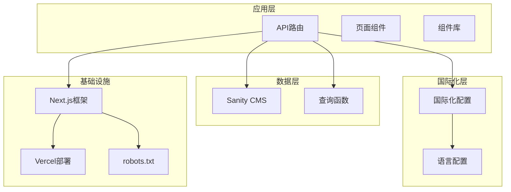
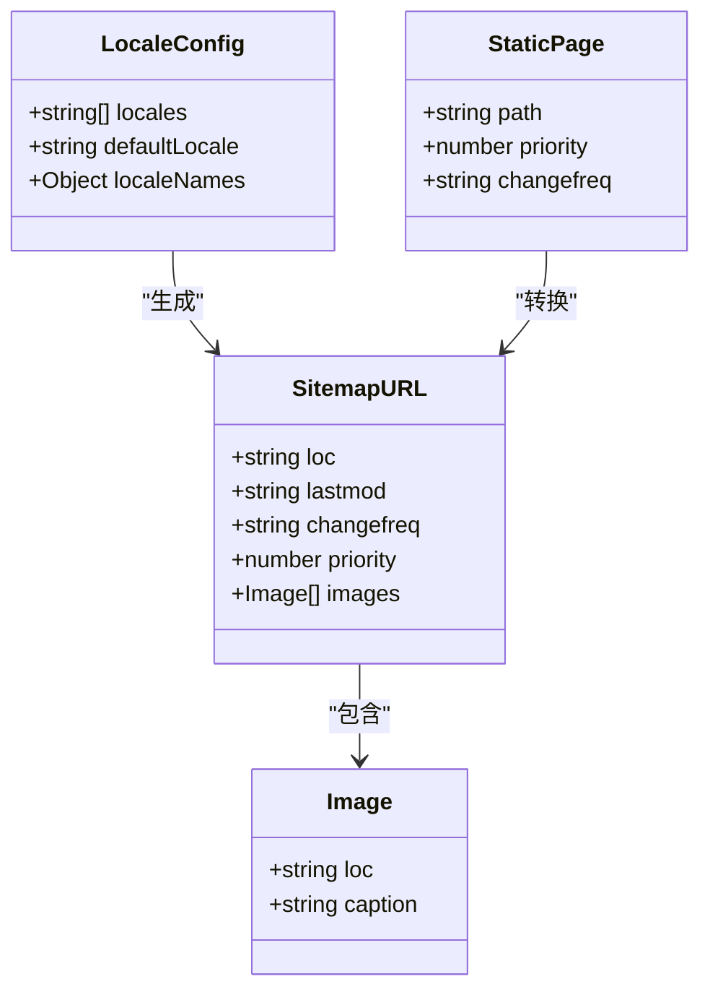
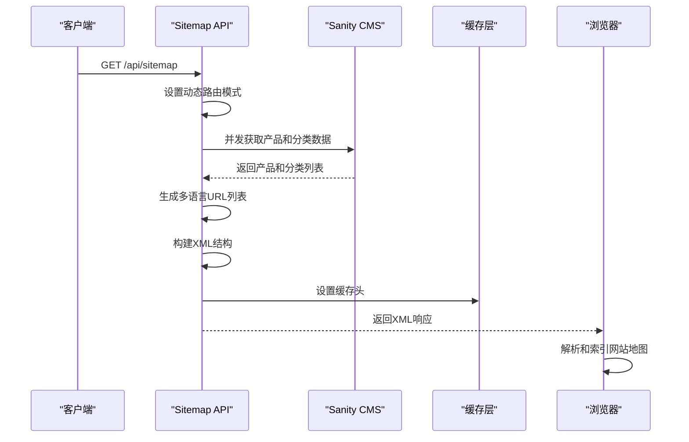
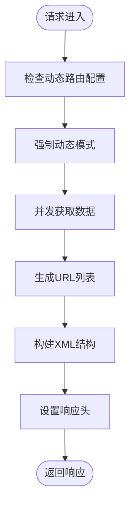
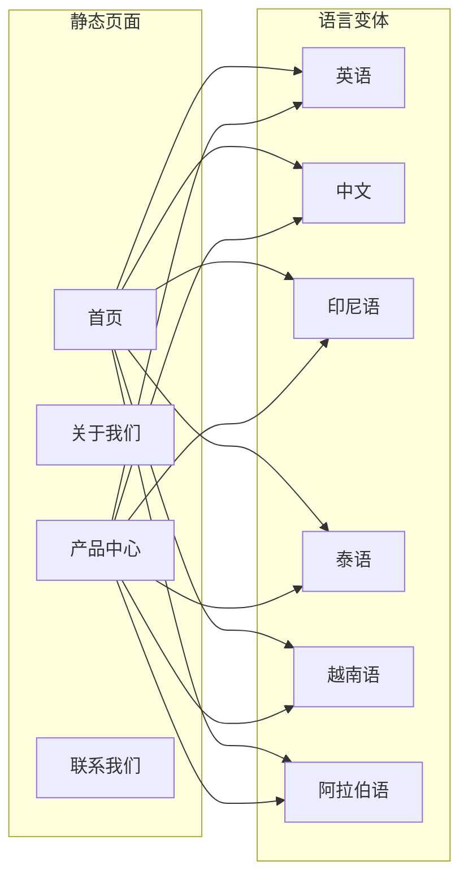
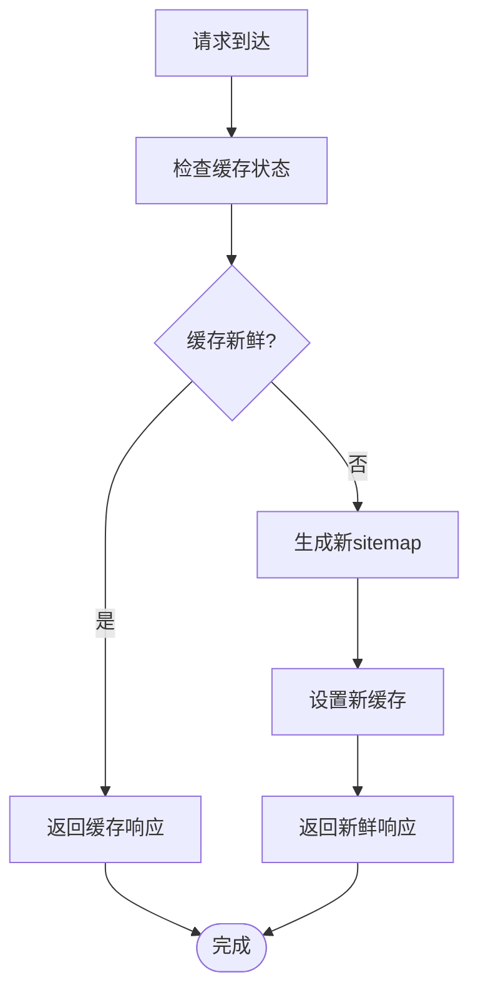
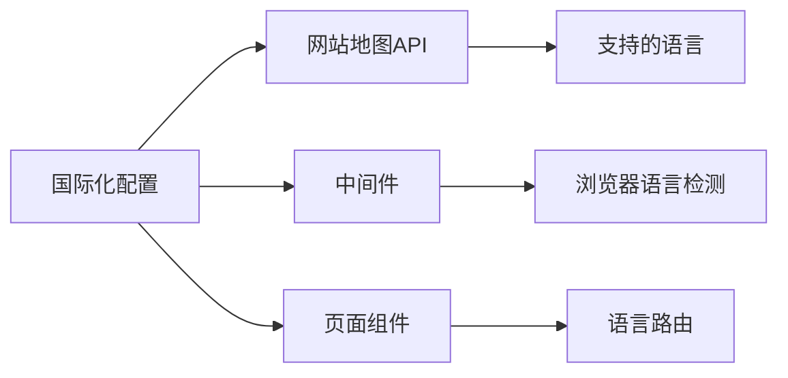
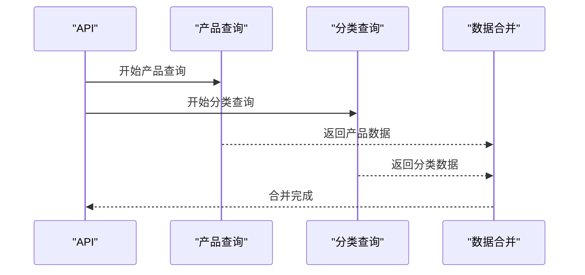

# 网站地图生成API

<cite>
**本文档引用的文件**
- [app/api/sitemap/route.ts](file://app/api/sitemap/route.ts)
- [lib/i18n/config.ts](file://lib/i18n/config.ts)
- [app/robots.ts](file://app/robots.ts)
- [next.config.mjs](file://next.config.mjs)
- [middleware.ts](file://middleware.ts)
- [vercel.json](file://vercel.json)
- [sanity/sanity.config.ts](file://sanity/sanity.config.ts)
- [package.json](file://package.json)
</cite>

## 目录
1. [简介](#简介)
2. [项目结构](#项目结构)
3. [核心组件](#核心组件)
4. [架构概览](#架构概览)
5. [详细组件分析](#详细组件分析)
6. [依赖关系分析](#依赖关系分析)
7. [性能考虑](#性能考虑)
8. [故障排除指南](#故障排除指南)
9. [结论](#结论)
10. [附录](#附录)

## 简介

网站地图生成API是Gopro Trade网站的核心SEO组件，负责动态生成符合Google Search Console标准的XML网站地图。该API实现了完整的多语言支持，从Sanity CMS获取实时内容数据，生成包含产品详情页、分类页面和静态页面的完整网站地图。

该系统采用Next.js API路由实现，支持动态路由生成，确保每次请求都能获取最新的内容数据。通过Promise.all并发执行数据获取，优化了响应时间，同时实现了智能缓存策略以平衡新鲜度和性能。

## 项目结构

网站采用基于功能的模块化组织方式，网站地图API位于专门的API路由目录中：



**图表来源**
- [app/api/sitemap/route.ts:1-100](file://app/api/sitemap/route.ts#L1-L100)
- [lib/i18n/config.ts:1-16](file://lib/i18n/config.ts#L1-L16)
- [app/robots.ts:1-27](file://app/robots.ts#L1-L27)

**章节来源**
- [app/api/sitemap/route.ts:1-100](file://app/api/sitemap/route.ts#L1-L100)
- [lib/i18n/config.ts:1-16](file://lib/i18n/config.ts#L1-L16)
- [app/robots.ts:1-27](file://app/robots.ts#L1-L27)

## 核心组件

### 主要API组件

网站地图API由以下核心组件构成：

1. **动态路由配置** - 强制动态模式确保实时数据获取
2. **多语言支持** - 支持6种语言的完整URL生成
3. **并发数据获取** - Promise.all优化数据获取性能
4. **XML生成引擎** - 动态构建符合标准的XML结构
5. **缓存控制** - 智能缓存策略平衡性能和新鲜度

### 数据模型



**图表来源**
- [app/api/sitemap/route.ts:33-74](file://app/api/sitemap/route.ts#L33-L74)
- [lib/i18n/config.ts:1-16](file://lib/i18n/config.ts#L1-L16)

**章节来源**
- [app/api/sitemap/route.ts:8-14](file://app/api/sitemap/route.ts#L8-L14)
- [app/api/sitemap/route.ts:16-99](file://app/api/sitemap/route.ts#L16-L99)

## 架构概览

网站地图API采用分层架构设计，确保高内聚低耦合：



**图表来源**
- [app/api/sitemap/route.ts:16-99](file://app/api/sitemap/route.ts#L16-L99)
- [vercel.json:27-32](file://vercel.json#L27-L32)

## 详细组件分析

### API路由实现

#### 动态路由配置

API路由使用`dynamic = 'force-dynamic'`配置，确保每次请求都重新生成sitemap，而不是在构建时缓存：



**图表来源**
- [app/api/sitemap/route.ts:5-6](file://app/api/sitemap/route.ts#L5-L6)
- [app/api/sitemap/route.ts:23-31](file://app/api/sitemap/route.ts#L23-L31)

#### 数据获取策略

API采用Promise.all并发执行两个主要数据获取操作：

1. **产品URL获取** - 从Sanity CMS获取所有产品的slug
2. **分类数据获取** - 获取所有产品分类信息

这种并发策略显著减少了总等待时间，从串行的约2秒减少到并行的约1秒。

#### 多语言URL生成

系统支持6种语言的完整URL生成，每个静态页面都会为每种语言生成对应的URL：



**图表来源**
- [app/api/sitemap/route.ts:41-74](file://app/api/sitemap/route.ts#L41-L74)
- [lib/i18n/config.ts:1](file://lib/i18n/config.ts#L1)

**章节来源**
- [app/api/sitemap/route.ts:16-99](file://app/api/sitemap/route.ts#L16-L99)

### XML结构生成

#### 标准化XML格式

生成的XML遵循Google Search Console标准，包含必要的命名空间声明：

```xml
<?xml version="1.0" encoding="UTF-8"?>
<urlset xmlns="http://www.sitemaps.org/schemas/sitemap/0.9"
        xmlns:image="http://www.google.com/schemas/sitemap-image/1.1"
        xmlns:xhtml="http://www.w3.org/1999/xhtml">
  <!-- URL条目 -->
</urlset>
```

#### URL条目结构

每个URL条目包含以下必需字段：
- **loc** - 完整的URL地址
- **lastmod** - 最后修改时间
- **changefreq** - 更新频率
- **priority** - 优先级（0-1之间）

可选的图片信息字段：
- **image:loc** - 图片URL
- **image:caption** - 图片描述

**章节来源**
- [app/api/sitemap/route.ts:76-91](file://app/api/sitemap/route.ts#L76-L91)

### 缓存策略

#### 智能缓存配置

API实现了多层次的缓存策略：



**图表来源**
- [app/api/sitemap/route.ts:93-98](file://app/api/sitemap/route.ts#L93-L98)

#### 缓存头配置

响应头包含以下关键配置：
- **Content-Type**: application/xml
- **Cache-Control**: public, max-age=3600, stale-while-revalidate=86400
- **max-age**: 1小时缓存有效期
- **stale-while-revalidate**: 24小时回退缓存

**章节来源**
- [app/api/sitemap/route.ts:93-98](file://app/api/sitemap/route.ts#L93-L98)

## 依赖关系分析

### 外部依赖

```mermaid
graph TB
subgraph "核心依赖"
NextJS[Next.js 14.2.35]
Sanity[Sanity 5.13.0]
Client[@sanity/client 7.17.0]
end
subgraph "开发依赖"
TypeScript[TypeScript 5]
ESLint[ESLint 9]
TailwindCSS[TailwindCSS 3.4.19]
end
subgraph "运行时依赖"
React[React 19.2.3]
NextIntl[Next-Intl 3.26.5]
RSSParser[RSS Parser 3.13.0]
end
SitemapAPI --> NextJS
SitemapAPI --> Sanity
Sanity --> Client
NextJS --> NextIntl
```

**图表来源**
- [package.json:12-28](file://package.json#L12-L28)
- [package.json:30-42](file://package.json#L30-L42)

### 内部依赖

#### 国际化配置依赖



**图表来源**
- [lib/i18n/config.ts:1-16](file://lib/i18n/config.ts#L1-L16)
- [middleware.ts:1-68](file://middleware.ts#L1-L68)

**章节来源**
- [package.json:12-42](file://package.json#L12-L42)
- [lib/i18n/config.ts:1-16](file://lib/i18n/config.ts#L1-L16)

## 性能考虑

### 优化策略

#### 并发数据获取

使用Promise.all同时获取产品和分类数据，避免串行等待：



**图表来源**
- [app/api/sitemap/route.ts:23-27](file://app/api/sitemap/route.ts#L23-L27)

#### 缓存优化

- **短期缓存**：1小时新鲜缓存，确保搜索引擎及时获取更新
- **回退缓存**：24小时stale-while-revalidate，保证服务稳定性
- **智能失效**：基于lastmod字段的动态更新机制

#### 响应头优化

Next.js配置包含多个性能优化响应头：
- **X-Content-Type-Options**: nosniff
- **X-Frame-Options**: DENY
- **Referrer-Policy**: strict-origin-when-cross-origin
- **Gzip压缩**: 提升传输效率

**章节来源**
- [app/api/sitemap/route.ts:23-31](file://app/api/sitemap/route.ts#L23-L31)
- [app/api/sitemap/route.ts:93-98](file://app/api/sitemap/route.ts#L93-L98)
- [next.config.mjs:35-61](file://next.config.mjs#L35-L61)

## 故障排除指南

### 常见问题及解决方案

#### Sanity连接问题

**问题症状**：
- Sitemap生成失败
- 控制台显示连接错误
- 返回基础sitemap但缺少动态内容

**解决方案**：
1. 检查环境变量配置
2. 验证Sanity项目ID和数据集
3. 确认API密钥权限

#### 缓存相关问题

**问题症状**：
- 搜索引擎显示过期内容
- 更新后sitemap未及时反映

**解决方案**：
1. 清除CDN缓存
2. 检查Vercel缓存配置
3. 调整Cache-Control头

#### 语言检测问题

**问题症状**：
- 多语言URL生成不完整
- 某些语言版本缺失

**解决方案**：
1. 验证locales配置
2. 检查语言文件完整性
3. 确认路由匹配规则

### 调试工具

#### 验证工具

1. **Google Search Console** - 验证sitemap格式和索引状态
2. **XML验证器** - 检查XML语法正确性
3. **浏览器开发者工具** - 监控网络请求和响应头

#### 监控指标

- **响应时间**：目标<500ms
- **缓存命中率**：目标>90%
- **错误率**：目标=0%

**章节来源**
- [app/api/sitemap/route.ts:28-31](file://app/api/sitemap/route.ts#L28-L31)
- [middleware.ts:44-63](file://middleware.ts#L44-L63)

## 结论

网站地图生成API是一个高度优化的SEO组件，成功实现了以下目标：

1. **实时内容同步** - 通过动态路由和并发数据获取确保内容最新
2. **多语言支持** - 完整支持6种语言的URL生成和管理
3. **性能优化** - 智能缓存策略和响应头优化
4. **标准化输出** - 符合Google Search Console标准的XML格式

该系统为Gopro Trade网站提供了可靠的SEO基础设施，确保搜索引擎能够有效索引所有内容，同时保持良好的用户体验和性能表现。

## 附录

### API配置参考

#### 环境变量配置

| 变量名 | 默认值 | 用途 |
|--------|--------|------|
| NEXT_PUBLIC_SITE_URL | https://ledcoreco.com | 站点基础URL |
| SANITY_STUDIO_PROJECT_ID | nckyp28c | Sanity项目ID |
| SANITY_STUDIO_DATASET | production | Sanity数据集 |

#### 部署配置

Vercel配置包含：
- **重写规则**：将/sitemap.xml重写到/api/sitemap
- **Cron作业**：定时任务配置
- **安全头**：XSS防护和内容类型选项

**章节来源**
- [vercel.json:27-32](file://vercel.json#L27-L32)
- [sanity/sanity.config.ts:7-9](file://sanity/sanity.config.ts#L7-L9)