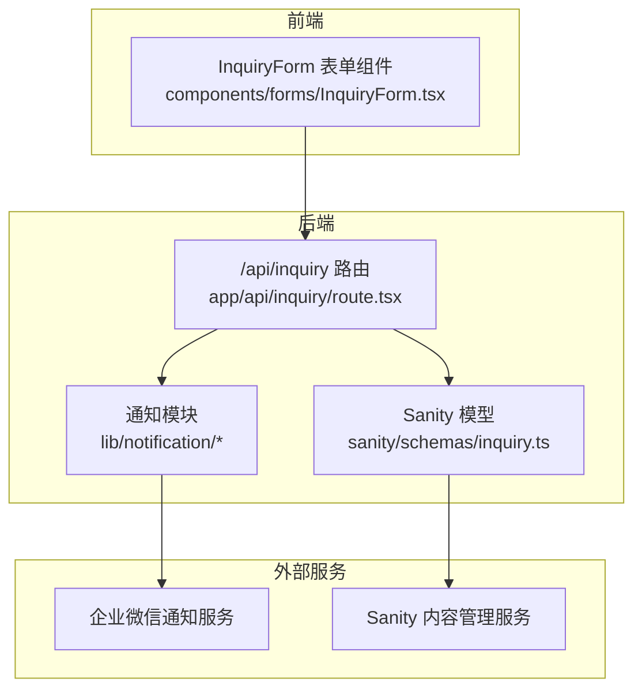
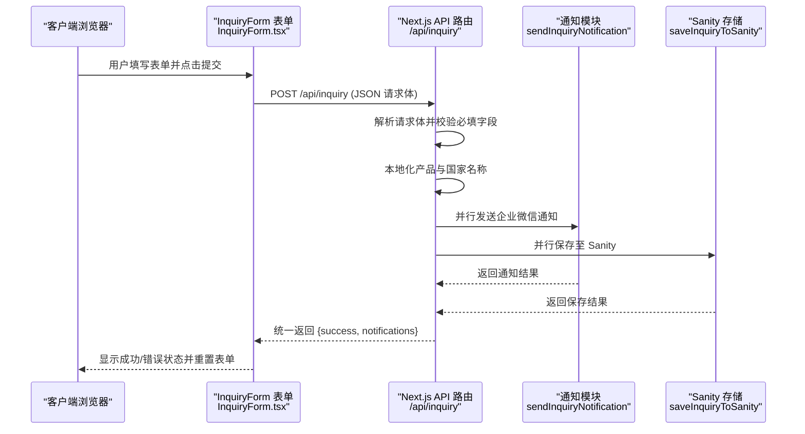
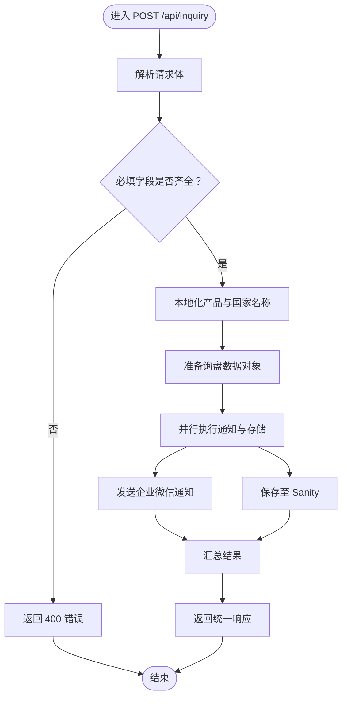
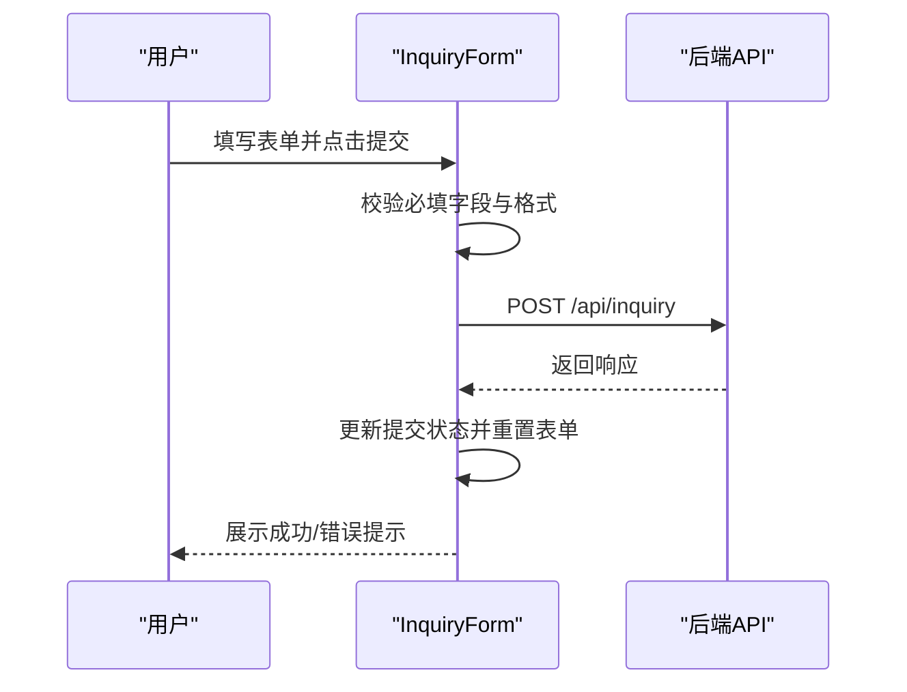
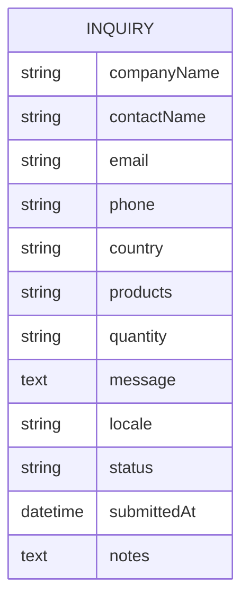
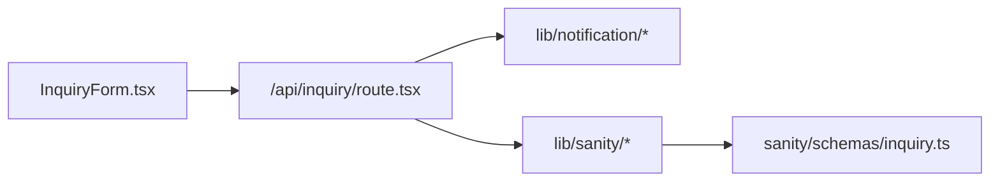

# 询盘处理API

<cite>
**本文档引用的文件**
- [app/api/inquiry/route.tsx](file://app/api/inquiry/route.tsx)
- [components/forms/InquiryForm.tsx](file://components/forms/InquiryForm.tsx)
- [sanity/schemas/inquiry.ts](file://sanity/schemas/inquiry.ts)
- [sanity/schemas/index.ts](file://sanity/schemas/index.ts)
</cite>

## 目录
1. [简介](#简介)
2. [项目结构](#项目结构)
3. [核心组件](#核心组件)
4. [架构概览](#架构概览)
5. [详细组件分析](#详细组件分析)
6. [依赖关系分析](#依赖关系分析)
7. [性能考量](#性能考量)
8. [故障排除指南](#故障排除指南)
9. [结论](#结论)
10. [附录](#附录)

## 简介
本文件为询盘处理API的完整技术文档，涵盖从前端表单到后端处理、数据存储与通知通道的全流程设计。该API支持多语言环境下的询盘提交，具备基础字段校验、并行通知与数据持久化能力，并通过Sanity CMS进行数据管理。文档同时提供请求/响应规范、错误处理策略、安全与隐私保护建议，以及前端表单集成示例。

## 项目结构
与询盘处理API直接相关的项目结构如下：
- 前端表单组件：负责收集用户输入并调用后端API
- 后端API路由：接收请求、执行校验、触发通知与存储
- 数据模型：定义在Sanity中的询盘文档结构
- 集成点：企业微信通知（通过notification模块）、Sanity内容存储（通过sanity模块）

图表来源
- [app/api/inquiry/route.tsx:1-103](file://app/api/inquiry/route.tsx#L1-L103)
- [components/forms/InquiryForm.tsx:1-298](file://components/forms/InquiryForm.tsx#L1-L298)
- [sanity/schemas/inquiry.ts:1-134](file://sanity/schemas/inquiry.ts#L1-L134)

章节来源
- [app/api/inquiry/route.tsx:1-103](file://app/api/inquiry/route.tsx#L1-L103)
- [components/forms/InquiryForm.tsx:1-298](file://components/forms/InquiryForm.tsx#L1-L298)
- [sanity/schemas/inquiry.ts:1-134](file://sanity/schemas/inquiry.ts#L1-L134)

## 核心组件
- 前端表单组件：提供多语言文案、必填字段提示、产品兴趣选择、数量区间选择、消息文本域，并在提交成功后触发GA4转化事件与表单重置。
- 后端API路由：解析请求体、执行基础字段校验、本地化产品与国家名称、并行触发通知与数据持久化，最终统一返回结果。
- Sanity模型：定义询盘文档的字段、验证规则、可选状态与排序方式，便于后台管理与追踪。

章节来源
- [components/forms/InquiryForm.tsx:45-117](file://components/forms/InquiryForm.tsx#L45-L117)
- [app/api/inquiry/route.tsx:21-102](file://app/api/inquiry/route.tsx#L21-L102)
- [sanity/schemas/inquiry.ts:8-99](file://sanity/schemas/inquiry.ts#L8-L99)

## 架构概览
下图展示从前端表单到后端处理、通知与存储的整体流程：

图表来源
- [components/forms/InquiryForm.tsx:73-117](file://components/forms/InquiryForm.tsx#L73-L117)
- [app/api/inquiry/route.tsx:21-102](file://app/api/inquiry/route.tsx#L21-L102)

## 详细组件分析

### API 路由：/api/inquiry
- 支持方法
  - GET：健康检查，返回API状态与时间戳
  - POST：处理询盘提交，执行校验、本地化、并行通知与存储
- 请求体字段
  - companyName: 字符串，必填
  - contactName: 字符串，必填
  - email: 字符串，必填（邮箱格式）
  - phone: 字符串，必填
  - country: 字符串，必填；取值范围见“国家映射”
  - products: 字符串数组；取值为产品键，将被本地化为当前语言显示名
  - quantity: 字符串；可选
  - message: 字符串；可选
  - locale: 字符串，默认为"zh"；支持语言见“语言选项”
- 校验规则
  - 必填字段缺失时返回400错误
  - 产品与国家名称将根据locale进行本地化映射
- 处理逻辑
  - 将产品键数组映射为对应语言的显示名称并拼接
  - 将国家键映射为对应语言的国家名
  - 并行执行通知与存储，即使某一项失败也不影响另一项的结果
- 响应结构
  - 成功：返回success标志与notifications对象（包含通知与存储结果）
  - 错误：返回错误信息，HTTP状态码400或500

图表来源
- [app/api/inquiry/route.tsx:21-102](file://app/api/inquiry/route.tsx#L21-L102)

章节来源
- [app/api/inquiry/route.tsx:14-19](file://app/api/inquiry/route.tsx#L14-L19)
- [app/api/inquiry/route.tsx:21-102](file://app/api/inquiry/route.tsx#L21-L102)

### 前端表单：InquiryForm
- 功能特性
  - 多语言文案与占位符
  - 必填字段高亮与验证
  - 产品兴趣多选框（支持多语言显示名）
  - 数量区间下拉选择
  - 提交状态反馈与表单重置
  - 成功后触发GA4转化事件
- 提交流程
  - 阻止默认提交，构造JSON请求体并调用后端API
  - 根据响应状态更新提交状态并重置表单
- 错误处理
  - 异常捕获与错误状态设置
  - 友好提示与按钮禁用

图表来源
- [components/forms/InquiryForm.tsx:45-117](file://components/forms/InquiryForm.tsx#L45-L117)

章节来源
- [components/forms/InquiryForm.tsx:45-117](file://components/forms/InquiryForm.tsx#L45-L117)

### Sanity 询盘模型
- 文档类型：inquiry
- 关键字段
  - companyName: 必填字符串
  - contactName: 必填字符串
  - email: 必填字符串
  - phone: 必填字符串
  - country: 必填字符串
  - products: 字符串（逗号分隔的产品显示名）
  - quantity: 字符串（数量区间）
  - message: 文本（详细需求）
  - locale: 字符串（语言选项）
  - status: 字符串（状态枚举，默认new）
  - submittedAt: 日期时间（只读）
  - notes: 文本（跟进备注）
- 语言选项
  - zh、en、id、th、vi、ar
- 状态枚举
  - new（新询单）、contacted（已联系）、quoted（已报价）、won（已成交）、closed（已关闭）
- 排序
  - 按提交时间降序/升序排列

图表来源
- [sanity/schemas/inquiry.ts:8-99](file://sanity/schemas/inquiry.ts#L8-L99)

章节来源
- [sanity/schemas/inquiry.ts:8-99](file://sanity/schemas/inquiry.ts#L8-L99)

### 通知与存储集成点
- 通知模块
  - 调用路径：lib/notification/wechat（具体实现位于该模块）
  - 触发时机：POST请求中并行执行
- Sanity 存储
  - 调用路径：lib/sanity/inquiry（具体实现位于该模块）
  - 触发时机：POST请求中并行执行
- 集成关系
  - 两者均在API路由中通过Promise.all并行调用，确保吞吐与一致性

章节来源
- [app/api/inquiry/route.tsx:21-102](file://app/api/inquiry/route.tsx#L21-L102)

## 依赖关系分析
- 前端对后端
  - 表单组件通过fetch调用/api/inquiry
- 后端对通知与存储
  - API路由依赖通知模块与Sanity模块
- 数据模型对内容管理
  - Sanity模型定义了询盘文档结构与验证规则

图表来源
- [components/forms/InquiryForm.tsx:79-86](file://components/forms/InquiryForm.tsx#L79-L86)
- [app/api/inquiry/route.tsx:21-102](file://app/api/inquiry/route.tsx#L21-L102)
- [sanity/schemas/inquiry.ts:6-8](file://sanity/schemas/inquiry.ts#L6-L8)

章节来源
- [components/forms/InquiryForm.tsx:79-86](file://components/forms/InquiryForm.tsx#L79-L86)
- [app/api/inquiry/route.tsx:21-102](file://app/api/inquiry/route.tsx#L21-L102)
- [sanity/schemas/index.ts:6](file://sanity/schemas/index.ts#L6)

## 性能考量
- 并行处理：通知与存储采用Promise.all并行执行，减少总延迟
- 本地化开销：产品与国家名称映射为O(n)遍历，n为产品数量，通常较小
- 响应策略：即使通知失败也返回成功（数据已存入Sanity），提升用户体验
- 建议优化
  - 对频繁使用的映射表进行缓存
  - 在通知模块增加超时与重试机制
  - 对大文本字段（如message）进行长度限制与清理

## 故障排除指南
- 常见错误与排查
  - 400 错误：必填字段缺失或格式不正确
    - 检查前端表单必填项与邮箱格式
    - 参考：[app/api/inquiry/route.tsx:36-42](file://app/api/inquiry/route.tsx#L36-L42)
  - 500 错误：服务器内部异常
    - 查看后端日志与通知/存储模块异常
    - 参考：[app/api/inquiry/route.tsx:95-101](file://app/api/inquiry/route.tsx#L95-L101)
  - 通知失败但存储成功
    - API会返回成功，但控制台会记录通知结果
    - 参考：[app/api/inquiry/route.tsx:76-85](file://app/api/inquiry/route.tsx#L76-L85)
- 前端状态
  - 提交中：按钮禁用，避免重复提交
  - 成功：显示成功提示并重置表单
  - 失败：显示错误提示并允许重新提交
  - 参考：[components/forms/InquiryForm.tsx:46-117](file://components/forms/InquiryForm.tsx#L46-L117)

章节来源
- [app/api/inquiry/route.tsx:36-42](file://app/api/inquiry/route.tsx#L36-L42)
- [app/api/inquiry/route.tsx:95-101](file://app/api/inquiry/route.tsx#L95-L101)
- [app/api/inquiry/route.tsx:76-85](file://app/api/inquiry/route.tsx#L76-L85)
- [components/forms/InquiryForm.tsx:46-117](file://components/forms/InquiryForm.tsx#L46-L117)

## 结论
本API以简洁的请求/响应模型实现了从表单到通知与存储的完整闭环，具备良好的扩展性与可维护性。通过并行处理与本地化支持，满足多语言市场的需求。建议后续完善通知模块的稳定性与监控告警，并在前端增强实时反馈与错误引导。

## 附录

### 请求与响应规范
- 请求
  - 方法：POST
  - 路径：/api/inquiry
  - Content-Type：application/json
  - 示例字段（仅列字段名与类型）
    - companyName: string
    - contactName: string
    - email: string
    - phone: string
    - country: string
    - products: string[]
    - quantity: string
    - message: string
    - locale: string
- 响应
  - 成功：{ success: true, notifications: { wechat, sanity } }
  - 失败：{ error: string }（HTTP 400 或 500）

章节来源
- [app/api/inquiry/route.tsx:21-102](file://app/api/inquiry/route.tsx#L21-L102)

### 字段验证规则
- 必填字段：companyName、contactName、email、phone、country
- 邮箱格式：由前端HTML5验证与后端字符串非空共同保证
- 产品与国家：必须为预定义键值，否则使用回退显示名

章节来源
- [app/api/inquiry/route.tsx:36-42](file://app/api/inquiry/route.tsx#L36-L42)
- [app/api/inquiry/route.tsx:44-61](file://app/api/inquiry/route.tsx#L44-L61)

### 语言与本地化
- 支持语言：zh、en、id、th、vi、ar
- 本地化来源：产品标签与国家名称映射表
- 优先级：按locale选择，不存在则回退到en

章节来源
- [app/api/inquiry/route.tsx:6-11](file://app/api/inquiry/route.tsx#L6-L11)
- [app/api/inquiry/route.tsx:50-61](file://app/api/inquiry/route.tsx#L50-L61)

### 安全与隐私保护
- 最小化原则：仅收集必要字段
- 数据保留：Sanity模型包含状态与提交时间，便于追踪与合规
- 建议措施
  - 对敏感字段进行脱敏与加密传输
  - 实施访问控制与审计日志
  - 遵循GDPR/CCPA等法规要求

章节来源
- [sanity/schemas/inquiry.ts:74-87](file://sanity/schemas/inquiry.ts#L74-L87)

### 前端表单集成示例
- 调用方式
  - 使用fetch向/api/inquiry发送POST请求
  - 请求体包含表单数据与locale
- 参考路径
  - [components/forms/InquiryForm.tsx:79-86](file://components/forms/InquiryForm.tsx#L79-L86)

章节来源
- [components/forms/InquiryForm.tsx:79-86](file://components/forms/InquiryForm.tsx#L79-L86)