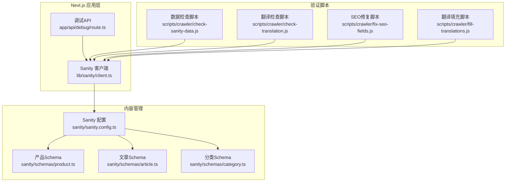
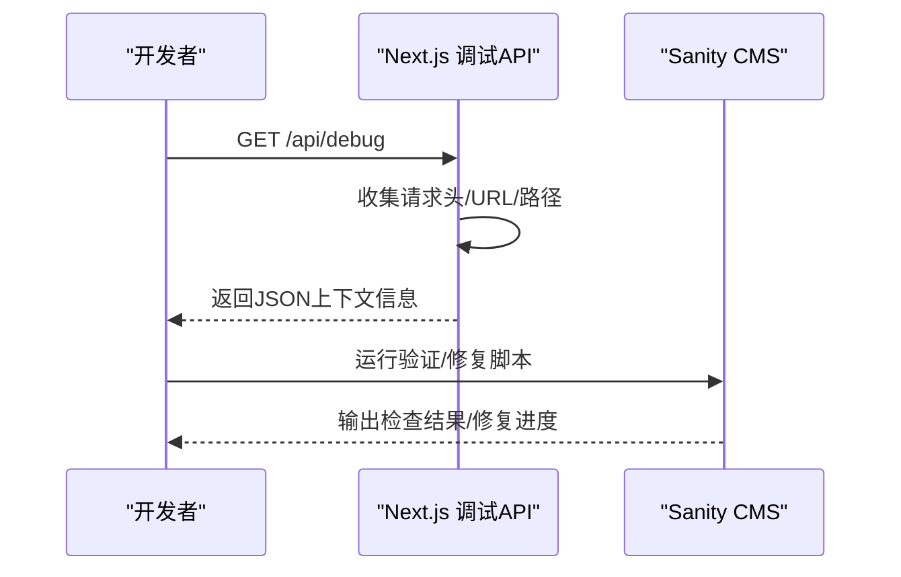
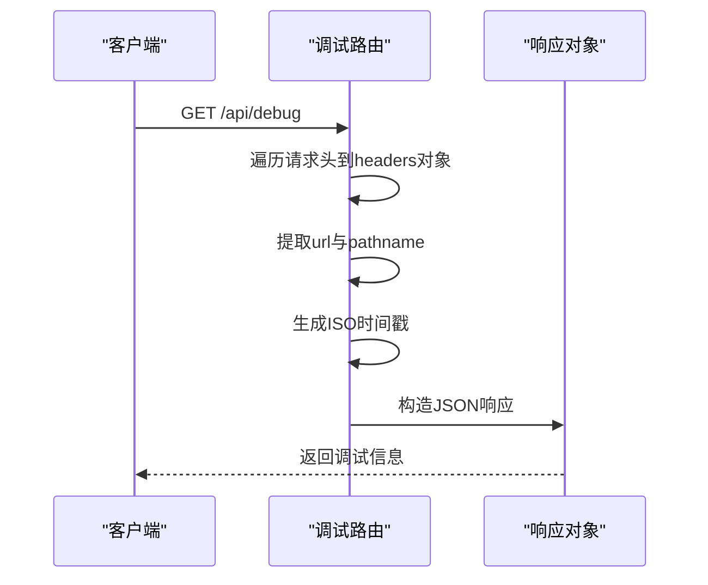
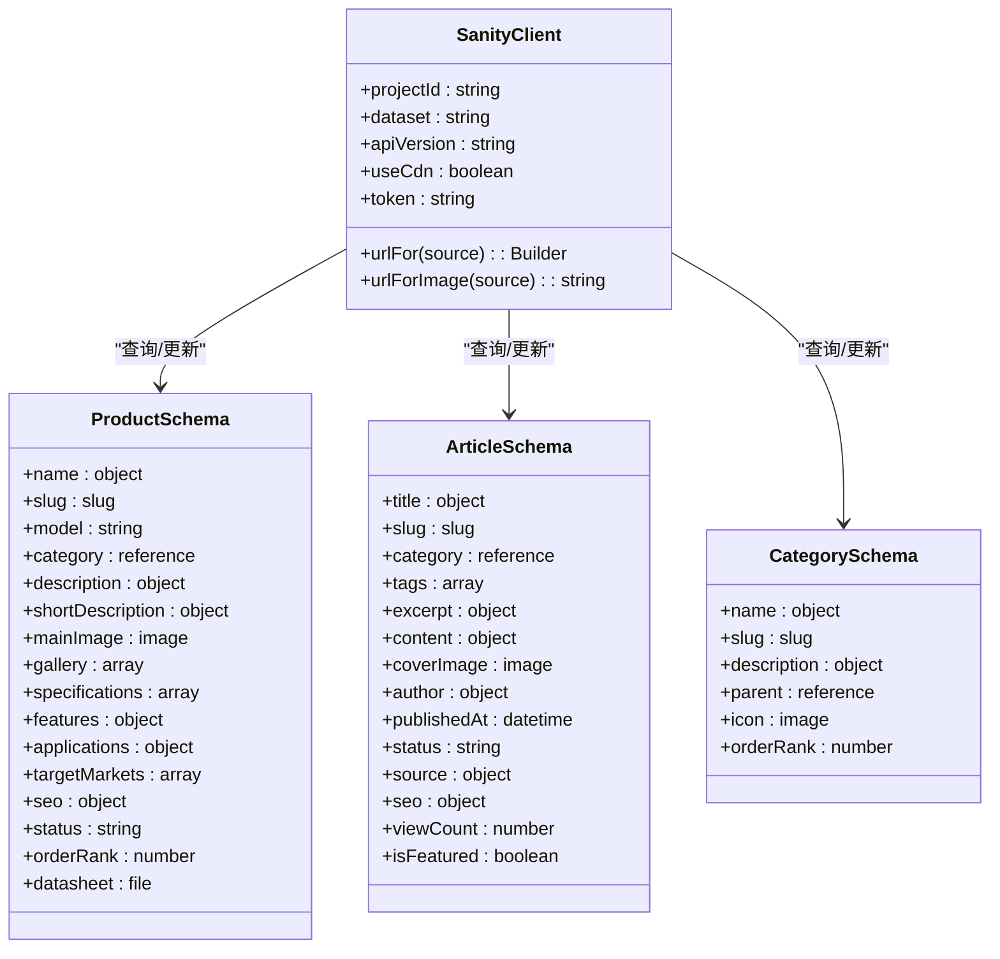
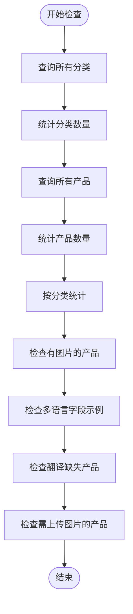
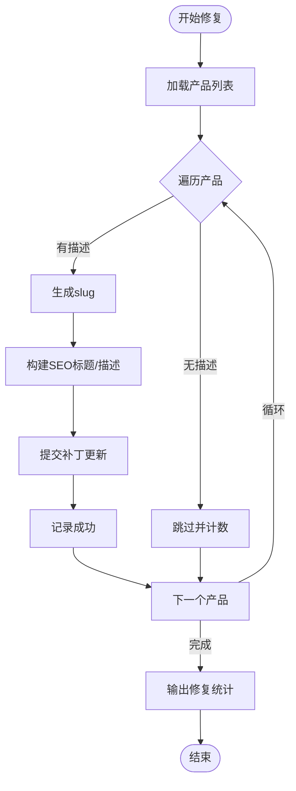
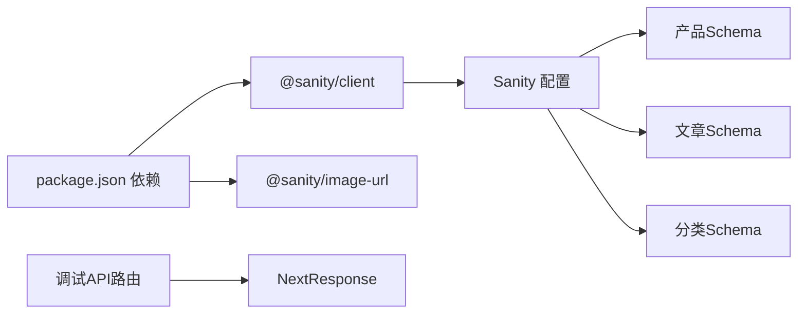

# 调试工具API

<cite>
**本文档引用的文件**
- [app/api/debug/route.ts](file://app/api/debug/route.ts)
- [scripts/crawler/check-sanity-data.js](file://scripts/crawler/check-sanity-data.js)
- [scripts/crawler/check-translation.js](file://scripts/crawler/check-translation.js)
- [scripts/crawler/fix-seo-fields.js](file://scripts/crawler/fix-seo-fields.js)
- [scripts/crawler/fill-translations.js](file://scripts/crawler/fill-translations.js)
- [sanity/sanity.config.ts](file://sanity/sanity.config.ts)
- [sanity/schemas/product.ts](file://sanity/schemas/product.ts)
- [sanity/schemas/article.ts](file://sanity/schemas/article.ts)
- [sanity/schemas/category.ts](file://sanity/schemas/category.ts)
- [lib/sanity/client.ts](file://lib/sanity/client.ts)
- [package.json](file://package.json)
</cite>

## 目录
1. [简介](#简介)
2. [项目结构](#项目结构)
3. [核心组件](#核心组件)
4. [架构概览](#架构概览)
5. [详细组件分析](#详细组件分析)
6. [依赖关系分析](#依赖关系分析)
7. [性能考虑](#性能考虑)
8. [故障排除指南](#故障排除指南)
9. [结论](#结论)
10. [附录](#附录)

## 简介
本文件为调试工具API的详细技术文档，面向开发与运维工程师，涵盖以下能力：
- 开发环境调试工具：提供请求上下文信息输出，便于快速验证路由、中间件与环境变量配置
- 数据验证与完整性检查：针对Sanity内容管理系统的数据完整性进行批量验证
- 错误追踪与日志策略：统一的日志格式与错误处理机制，便于定位问题
- 性能监控与优化建议：基于现有实现的性能特征分析与改进建议
- SEO数据验证与结构化数据检查：自动化检查产品与文章的SEO字段完整性
- 安全考虑与最佳实践：生产环境调试的安全边界与访问控制建议

## 项目结构
调试工具API位于Next.js应用的API路由中，配合Sanity内容管理系统的Schema与客户端库，形成完整的调试与验证体系。

**图表来源**
- [app/api/debug/route.ts:1-16](file://app/api/debug/route.ts#L1-L16)
- [lib/sanity/client.ts:1-30](file://lib/sanity/client.ts#L1-L30)
- [sanity/sanity.config.ts:1-33](file://sanity/sanity.config.ts#L1-L33)
- [sanity/schemas/product.ts:1-233](file://sanity/schemas/product.ts#L1-L233)
- [sanity/schemas/article.ts:1-265](file://sanity/schemas/article.ts#L1-L265)
- [sanity/schemas/category.ts:1-74](file://sanity/schemas/category.ts#L1-L74)
- [scripts/crawler/check-sanity-data.js:1-70](file://scripts/crawler/check-sanity-data.js#L1-L70)
- [scripts/crawler/check-translation.js:1-60](file://scripts/crawler/check-translation.js#L1-L60)
- [scripts/crawler/fix-seo-fields.js:1-304](file://scripts/crawler/fix-seo-fields.js#L1-L304)
- [scripts/crawler/fill-translations.js:1-331](file://scripts/crawler/fill-translations.js#L1-L331)

**章节来源**
- [app/api/debug/route.ts:1-16](file://app/api/debug/route.ts#L1-L16)
- [sanity/sanity.config.ts:1-33](file://sanity/sanity.config.ts#L1-L33)
- [lib/sanity/client.ts:1-30](file://lib/sanity/client.ts#L1-L30)

## 核心组件
- 调试API路由：返回请求头、URL、路径与时间戳，用于快速验证开发环境配置
- Sanity客户端：封装Sanity连接参数与图像URL生成工具
- 内容Schema：定义产品、文章、分类的字段结构与验证规则
- 验证与修复脚本：批量检查数据完整性、翻译状态与SEO字段，并提供修复方案

**章节来源**
- [app/api/debug/route.ts:3-14](file://app/api/debug/route.ts#L3-L14)
- [lib/sanity/client.ts:9-29](file://lib/sanity/client.ts#L9-L29)
- [sanity/schemas/product.ts:14-32](file://sanity/schemas/product.ts#L14-L32)
- [sanity/schemas/article.ts:15-32](file://sanity/schemas/article.ts#L15-L32)
- [sanity/schemas/category.ts:14-31](file://sanity/schemas/category.ts#L14-L31)

## 架构概览
调试工具API通过Next.js API路由暴露一个轻量接口，返回当前请求的上下文信息；同时，独立的Node.js脚本通过Sanity客户端连接CMS，执行数据完整性与SEO字段的批量检查与修复。

**图表来源**
- [app/api/debug/route.ts:3-14](file://app/api/debug/route.ts#L3-L14)
- [lib/sanity/client.ts:9-15](file://lib/sanity/client.ts#L9-L15)

## 详细组件分析

### 调试API路由（/api/debug）
- 功能概述：收集并返回请求头、完整URL、路径与当前时间戳，便于快速验证路由、中间件与环境变量
- 请求方式：GET
- 响应格式：JSON对象，包含headers、url、pathname、timestamp键值
- 使用场景：本地开发环境快速确认路由可达性、中间件链路与请求头传递

**图表来源**
- [app/api/debug/route.ts:3-14](file://app/api/debug/route.ts#L3-L14)

**章节来源**
- [app/api/debug/route.ts:3-14](file://app/api/debug/route.ts#L3-L14)

### Sanity客户端与Schema
- 客户端配置：硬编码项目ID与数据集，支持通过环境变量注入令牌以启用写入操作
- Schema定义：产品、文章、分类均采用多语言对象结构，字段包含必填项与验证规则
- 图像URL工具：提供便捷的图像URL生成函数，支持空值安全处理

**图表来源**
- [lib/sanity/client.ts:9-29](file://lib/sanity/client.ts#L9-L29)
- [sanity/schemas/product.ts:14-32](file://sanity/schemas/product.ts#L14-L32)
- [sanity/schemas/article.ts:15-32](file://sanity/schemas/article.ts#L15-L32)
- [sanity/schemas/category.ts:14-31](file://sanity/schemas/category.ts#L14-L31)

**章节来源**
- [lib/sanity/client.ts:9-29](file://lib/sanity/client.ts#L9-L29)
- [sanity/schemas/product.ts:14-32](file://sanity/schemas/product.ts#L14-L32)
- [sanity/schemas/article.ts:15-32](file://sanity/schemas/article.ts#L15-L32)
- [sanity/schemas/category.ts:14-31](file://sanity/schemas/category.ts#L14-L31)

### 数据验证脚本（check-sanity-data.js）
- 功能概述：检查分类数量、产品数量、按分类统计、图片存在性、多语言字段示例、翻译缺失情况与图片URL上传状态
- 输出格式：控制台日志，包含统计数据与示例字段内容
- 适用场景：批量验证CMS数据完整性，识别缺失字段与异常数据

**图表来源**
- [scripts/crawler/check-sanity-data.js:15-69](file://scripts/crawler/check-sanity-data.js#L15-L69)

**章节来源**
- [scripts/crawler/check-sanity-data.js:15-69](file://scripts/crawler/check-sanity-data.js#L15-L69)

### 翻译检查脚本（check-translation.js）
- 功能概述：检查分类与产品的多语言字段完整性，输出统计信息
- 输出格式：控制台日志，包含各语言字段的完成状态与统计汇总
- 适用场景：评估翻译覆盖率与缺失情况

**章节来源**
- [scripts/crawler/check-translation.js:11-59](file://scripts/crawler/check-translation.js#L11-L59)

### SEO字段修复脚本（fix-seo-fields.js）
- 功能概述：根据产品中文名称生成URL友好slug，批量修复产品SEO标题与描述
- 关键流程：遍历产品、查找描述映射、生成slug、构建SEO标题与描述、提交更新
- 输出格式：控制台日志，包含成功/跳过/失败计数与进度提示

**图表来源**
- [scripts/crawler/fix-seo-fields.js:247-303](file://scripts/crawler/fix-seo-fields.js#L247-L303)

**章节来源**
- [scripts/crawler/fix-seo-fields.js:247-303](file://scripts/crawler/fix-seo-fields.js#L247-L303)

### 翻译填充脚本（fill-translations.js）
- 功能概述：批量填充产品与分类的多语言翻译，支持精确映射与逐条更新
- 关键流程：先更新分类翻译，再更新产品翻译，记录成功/跳过/失败数量
- 输出格式：控制台日志，包含每步操作的进度与最终统计

**章节来源**
- [scripts/crawler/fill-translations.js:264-330](file://scripts/crawler/fill-translations.js#L264-L330)

## 依赖关系分析
- Next.js应用依赖@sanity/client与@sanity/image-url，用于内容查询与图像URL生成
- 调试API路由不直接依赖Sanity，仅返回请求上下文信息
- 验证与修复脚本通过Sanity客户端连接CMS，执行查询与补丁更新

**图表来源**
- [package.json:12-28](file://package.json#L12-L28)
- [app/api/debug/route.ts:1-1](file://app/api/debug/route.ts#L1-L1)
- [lib/sanity/client.ts:1-2](file://lib/sanity/client.ts#L1-L2)
- [sanity/sanity.config.ts:1-33](file://sanity/sanity.config.ts#L1-L33)

**章节来源**
- [package.json:12-28](file://package.json#L12-L28)
- [app/api/debug/route.ts:1-1](file://app/api/debug/route.ts#L1-L1)
- [lib/sanity/client.ts:1-2](file://lib/sanity/client.ts#L1-L2)
- [sanity/sanity.config.ts:1-33](file://sanity/sanity.config.ts#L1-L33)

## 性能考虑
- 调试API：仅返回请求上下文信息，开销极低，适合频繁调用
- 数据检查脚本：使用一次性查询与遍历，复杂度近似O(n)，其中n为产品数量；建议在低频时段运行
- SEO修复脚本：逐条提交补丁更新，存在网络往返开销；建议分批处理并增加重试机制
- 翻译填充脚本：同样逐条更新，建议结合断点续跑与错误日志持久化

[本节为通用性能讨论，无需特定文件来源]

## 故障排除指南
- 调试API无法访问
  - 检查路由文件是否存在且导出GET函数
  - 确认Next.js开发服务器正常运行
  - 参考：[app/api/debug/route.ts:3-14](file://app/api/debug/route.ts#L3-L14)
- Sanity连接失败
  - 确认环境变量SANITY_API_TOKEN已正确设置
  - 检查项目ID与数据集配置
  - 参考：[lib/sanity/client.ts:7-15](file://lib/sanity/client.ts#L7-L15)，[sanity/sanity.config.ts:7-10](file://sanity/sanity.config.ts#L7-L10)
- 数据检查脚本报错
  - 检查网络连通性与API版本兼容性
  - 确认查询语法符合Sanity GROQ规范
  - 参考：[scripts/crawler/check-sanity-data.js:15-69](file://scripts/crawler/check-sanity-data.js#L15-L69)
- SEO修复失败
  - 查看单条更新错误日志，确认产品ID与字段存在性
  - 增加重试逻辑与错误归档
  - 参考：[scripts/crawler/fix-seo-fields.js:287-295](file://scripts/crawler/fix-seo-fields.js#L287-L295)
- 翻译填充中断
  - 记录失败产品ID，分批次重试
  - 参考：[scripts/crawler/fill-translations.js:311-320](file://scripts/crawler/fill-translations.js#L311-L320)

**章节来源**
- [app/api/debug/route.ts:3-14](file://app/api/debug/route.ts#L3-L14)
- [lib/sanity/client.ts:7-15](file://lib/sanity/client.ts#L7-L15)
- [sanity/sanity.config.ts:7-10](file://sanity/sanity.config.ts#L7-L10)
- [scripts/crawler/check-sanity-data.js:15-69](file://scripts/crawler/check-sanity-data.js#L15-L69)
- [scripts/crawler/fix-seo-fields.js:287-295](file://scripts/crawler/fix-seo-fields.js#L287-L295)
- [scripts/crawler/fill-translations.js:311-320](file://scripts/crawler/fill-translations.js#L311-L320)

## 结论
调试工具API提供了开发环境的快速验证入口，配合Sanity Schema与验证/修复脚本，能够系统性地保障内容数据的完整性与SEO质量。建议在CI/CD流程中集成这些脚本，定期执行数据健康检查，并在生产环境中谨慎启用调试接口，确保安全边界与访问控制。

[本节为总结性内容，无需特定文件来源]

## 附录

### API定义
- 端点：GET /api/debug
- 请求参数：无
- 响应字段：
  - headers：请求头键值对
  - url：完整请求URL
  - pathname：请求路径
  - timestamp：ISO时间戳

**章节来源**
- [app/api/debug/route.ts:9-14](file://app/api/debug/route.ts#L9-L14)

### 日志记录策略
- 控制台日志：所有验证与修复脚本均使用console输出，便于本地查看与CI捕获
- 建议：在生产环境使用结构化日志（如JSON格式）并集成日志聚合系统

**章节来源**
- [scripts/crawler/check-sanity-data.js:16-69](file://scripts/crawler/check-sanity-data.js#L16-L69)
- [scripts/crawler/check-translation.js:12-59](file://scripts/crawler/check-translation.js#L12-L59)
- [scripts/crawler/fix-seo-fields.js:248-303](file://scripts/crawler/fix-seo-fields.js#L248-L303)
- [scripts/crawler/fill-translations.js:265-330](file://scripts/crawler/fill-translations.js#L265-L330)

### 开发工具集成方法
- VS Code Tasks：为每个脚本创建任务，一键执行检查与修复
- GitHub Actions：在PR与主分支推送时自动运行数据完整性检查
- Next.js中间件：在开发环境启用调试API，在生产环境禁用

**章节来源**
- [package.json:5-10](file://package.json#L5-L10)
- [sanity/sanity.config.ts:18-21](file://sanity/sanity.config.ts#L18-L21)

### 生产环境调试的安全考虑与最佳实践
- 限制访问：仅在内网或受控网络中开放调试接口
- 认证与授权：为调试端点添加认证中间件或IP白名单
- 最小权限：Sanity令牌仅授予必要权限，避免写入操作
- 审计日志：记录调试访问与关键操作，便于追溯
- 输出脱敏：避免在响应中泄露敏感信息（如令牌）

[本节为通用安全建议，无需特定文件来源]