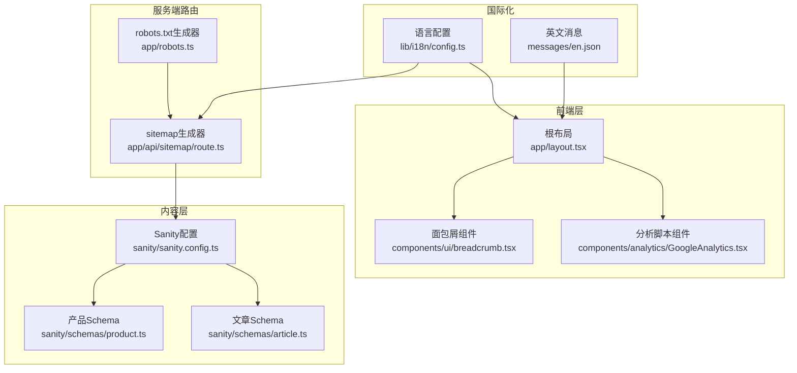
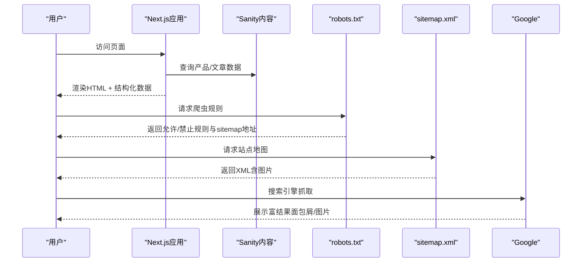
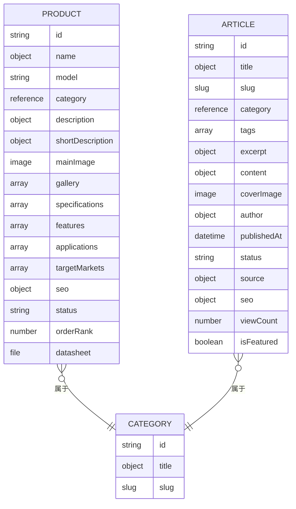
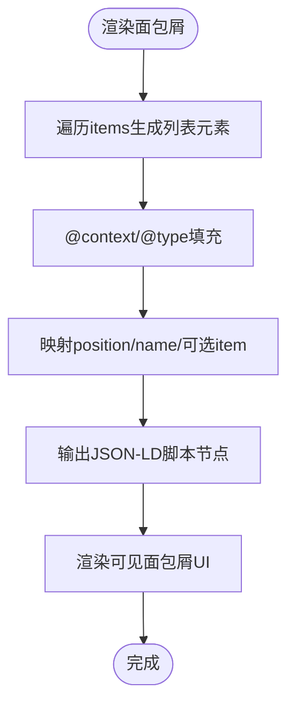
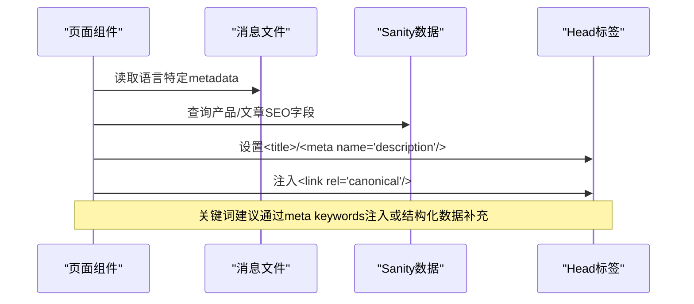
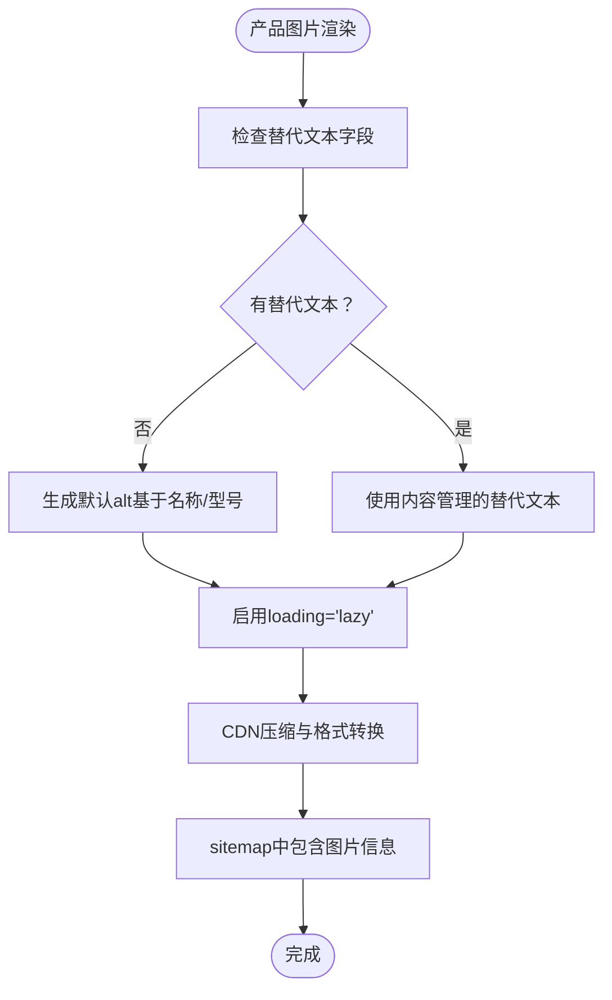
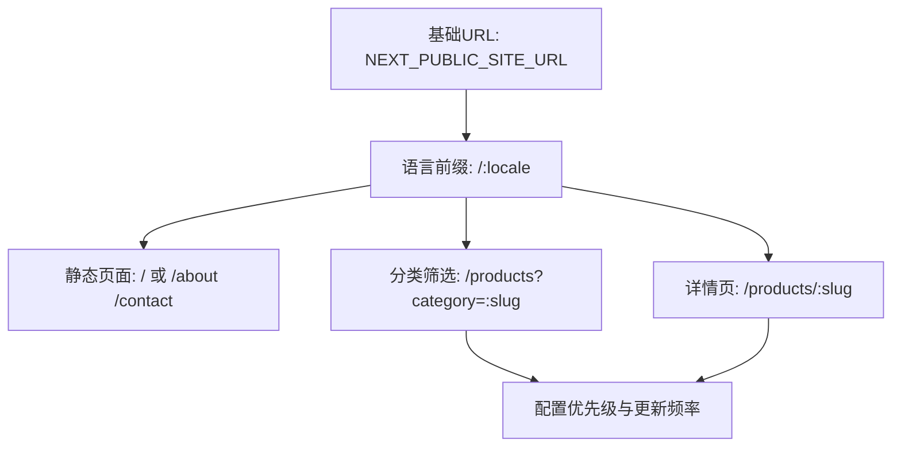
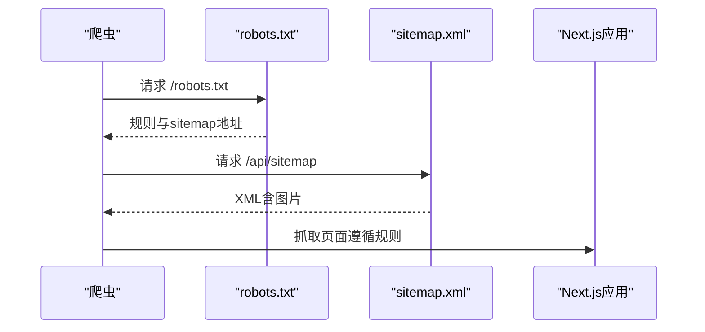
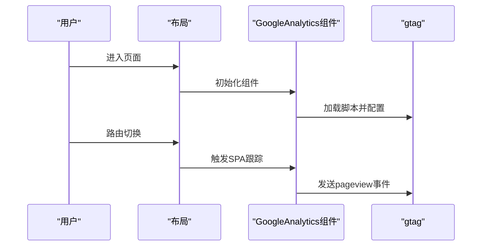
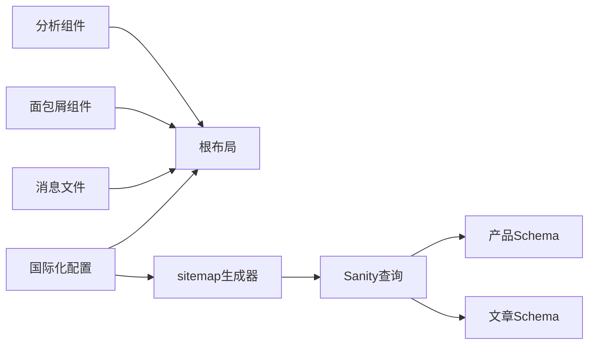

# SEO优化系统

<cite>
**本文档引用的文件**
- [app/layout.tsx](file://app/layout.tsx)
- [app/robots.ts](file://app/robots.ts)
- [components/ui/breadcrumb.tsx](file://components/ui/breadcrumb.tsx)
- [app/api/sitemap/route.ts](file://app/api/sitemap/route.ts)
- [components/analytics/GoogleAnalytics.tsx](file://components/analytics/GoogleAnalytics.tsx)
- [lib/i18n/config.ts](file://lib/i18n/config.ts)
- [messages/en.json](file://messages/en.json)
- [sanity/sanity.config.ts](file://sanity/sanity.config.ts)
- [sanity/schemas/product.ts](file://sanity/schemas/product.ts)
- [sanity/schemas/article.ts](file://sanity/schemas/article.ts)
</cite>

## 目录
1. [简介](#简介)
2. [项目结构](#项目结构)
3. [核心组件](#核心组件)
4. [架构总览](#架构总览)
5. [详细组件分析](#详细组件分析)
6. [依赖关系分析](#依赖关系分析)
7. [性能考虑](#性能考虑)
8. [故障排除指南](#故障排除指南)
9. [结论](#结论)
10. [附录](#附录)

## 简介
本文件面向GoPro Trade网站的SEO优化系统，系统性梳理结构化数据生成（产品Schema、网站结构、面包屑导航）、元数据管理（标题、描述、关键词）、图片SEO优化（压缩、格式、alt标签、懒加载）、URL结构优化（多语言、产品详情页、分类URL）、搜索引擎索引策略（robots.txt、sitemap.xml、Google Search Console集成），以及SEO性能监控与分析工具的使用指南，并总结最佳实践与常见问题的解决方案。

## 项目结构
该Next.js应用采用多语言路由与内容管理驱动的结构化组织：
- 多语言路由：`app/[locale]/...`，通过`lib/i18n/config.ts`定义语言集合与默认语言
- 内容管理：Sanity CMS定义产品与文章的Schema，支持6语言字段与SEO字段
- SEO基础设施：根布局元数据、robots.txt、动态sitemap、面包屑结构化数据、分析脚本
- 国际化消息：`messages/*.json`提供页面文案与元数据键值

**图表来源**
- [app/layout.tsx:1-19](file://app/layout.tsx#L1-L19)
- [components/ui/breadcrumb.tsx:1-87](file://components/ui/breadcrumb.tsx#L1-L87)
- [components/analytics/GoogleAnalytics.tsx:1-93](file://components/analytics/GoogleAnalytics.tsx#L1-L93)
- [app/robots.ts:1-27](file://app/robots.ts#L1-L27)
- [app/api/sitemap/route.ts:1-100](file://app/api/sitemap/route.ts#L1-L100)
- [lib/i18n/config.ts:1-16](file://lib/i18n/config.ts#L1-L16)
- [messages/en.json:1-200](file://messages/en.json#L1-L200)
- [sanity/sanity.config.ts:1-33](file://sanity/sanity.config.ts#L1-L33)
- [sanity/schemas/product.ts:1-233](file://sanity/schemas/product.ts#L1-L233)
- [sanity/schemas/article.ts:1-265](file://sanity/schemas/article.ts#L1-L265)

**章节来源**
- [app/layout.tsx:1-19](file://app/layout.tsx#L1-L19)
- [lib/i18n/config.ts:1-16](file://lib/i18n/config.ts#L1-L16)
- [sanity/sanity.config.ts:1-33](file://sanity/sanity.config.ts#L1-L33)

## 核心组件
- 根布局元数据：集中定义站点标题与描述，作为默认SEO基线
- 面包屑导航：自动生成JSON-LD BreadcrumbList结构化数据，提升搜索结果丰富性
- 动态sitemap：按语言与页面类型生成XML sitemap，包含图片信息
- robots.txt：控制爬虫访问范围与sitemap地址
- 分析脚本：集成GA4，支持SPA路由追踪与事件上报
- 国际化配置：统一语言集合、默认语言与RTL支持
- Sanity Schema：产品与文章的多语言字段与SEO字段，支撑动态元数据

**章节来源**
- [app/layout.tsx:1-19](file://app/layout.tsx#L1-L19)
- [components/ui/breadcrumb.tsx:15-42](file://components/ui/breadcrumb.tsx#L15-L42)
- [app/api/sitemap/route.ts:8-14](file://app/api/sitemap/route.ts#L8-L14)
- [app/robots.ts:3-26](file://app/robots.ts#L3-L26)
- [components/analytics/GoogleAnalytics.tsx:37-68](file://components/analytics/GoogleAnalytics.tsx#L37-L68)
- [lib/i18n/config.ts:1-16](file://lib/i18n/config.ts#L1-L16)
- [sanity/schemas/product.ts:148-187](file://sanity/schemas/product.ts#L148-L187)
- [sanity/schemas/article.ts:188-228](file://sanity/schemas/article.ts#L188-L228)

## 架构总览
SEO系统围绕“内容—结构化数据—索引—分析”的闭环工作流：

**图表来源**
- [app/robots.ts:3-26](file://app/robots.ts#L3-L26)
- [app/api/sitemap/route.ts:16-99](file://app/api/sitemap/route.ts#L16-L99)
- [components/ui/breadcrumb.tsx:24-42](file://components/ui/breadcrumb.tsx#L24-L42)

## 详细组件分析

### 结构化数据：产品Schema与网站结构
- 产品Schema要点
  - 基础信息：名称（多语言）、型号、分类、主图、图集
  - 技术规格与特性、应用场景（多语言）
  - SEO字段：多语言metaTitle、metaDescription、关键词
  - 状态与排序权重、数据手册（PDF）
- 网站结构
  - 静态页面：首页、关于、产品、联系等
  - 动态页面：产品详情页、分类筛选页、新闻详情页
  - 多语言：每个语言独立路径前缀

**图表来源**
- [sanity/schemas/product.ts:4-233](file://sanity/schemas/product.ts#L4-L233)
- [sanity/schemas/article.ts:4-265](file://sanity/schemas/article.ts#L4-L265)

**章节来源**
- [sanity/schemas/product.ts:8-233](file://sanity/schemas/product.ts#L8-L233)
- [sanity/schemas/article.ts:8-265](file://sanity/schemas/article.ts#L8-L265)

### 面包屑导航与Schema优化
- 组件职责
  - 生成UI可见的面包屑导航
  - 自动注入JSON-LD BreadcrumbList结构化数据
  - 支持RTL布局与最后项无链接
- Schema生成逻辑
  - 基于items数组构造列表项，包含position、name
  - 若存在href，则添加item字段为完整URL
  - 使用站点基础URL拼接相对路径

**图表来源**
- [components/ui/breadcrumb.tsx:21-42](file://components/ui/breadcrumb.tsx#L21-L42)

**章节来源**
- [components/ui/breadcrumb.tsx:15-42](file://components/ui/breadcrumb.tsx#L15-L42)

### 元数据管理：标题、描述、关键词
- 根布局默认元数据
  - 提供全局标题与描述作为默认值
- 多语言消息
  - 英文消息文件包含metadata键值，可用于动态生成页面级元数据
- Sanity SEO字段
  - 产品与文章均提供多语言metaTitle、metaDescription、keywords
  - 建议在页面级动态读取对应语言字段覆盖默认值

**图表来源**
- [messages/en.json:2-5](file://messages/en.json#L2-L5)
- [sanity/schemas/product.ts:148-187](file://sanity/schemas/product.ts#L148-L187)
- [sanity/schemas/article.ts:188-228](file://sanity/schemas/article.ts#L188-L228)

**章节来源**
- [app/layout.tsx:3-6](file://app/layout.tsx#L3-L6)
- [messages/en.json:2-5](file://messages/en.json#L2-L5)
- [sanity/schemas/product.ts:148-187](file://sanity/schemas/product.ts#L148-L187)
- [sanity/schemas/article.ts:188-228](file://sanity/schemas/article.ts#L188-L228)

### 图片SEO优化
- 图片字段
  - 产品主图与图集均为image类型，支持hotspot编辑
- 优化策略
  - 压缩：在上传流程或CDN层面进行压缩与WebP转换
  - 格式：优先WebP/JPEG 2000，保留高质量JPEG用于回退
  - Alt标签：建议从Sanity image字段的替代文本字段生成alt属性
  - 懒加载：使用原生loading="lazy"与占位图
  - 结构化数据：sitemap中包含图片信息，提升图片索引机会
- 当前实现提示
  - 页面渲染中未见显式的alt生成逻辑；建议在产品详情页读取主图/图集的替代文本字段并注入到

**图表来源**
- [sanity/schemas/product.ts:75-90](file://sanity/schemas/product.ts#L75-L90)
- [app/api/sitemap/route.ts:76-91](file://app/api/sitemap/route.ts#L76-L91)

**章节来源**
- [sanity/schemas/product.ts:75-90](file://sanity/schemas/product.ts#L75-L90)
- [app/api/sitemap/route.ts:76-91](file://app/api/sitemap/route.ts#L76-L91)

### URL结构优化
- 多语言URL模式
  - 语言前缀：/en、/zh、/id、/th、/vi、/ar
  - 默认语言：en
  - RTL支持：阿拉伯语
- 产品详情页URL
  - /:locale/products/:slug
- 分类URL优化
  - /:locale/products?category=:slug
- 静态页面
  - /、/about、/products、/contact等，按优先级与更新频率配置

**图表来源**
- [lib/i18n/config.ts:1-16](file://lib/i18n/config.ts#L1-L16)
- [app/api/sitemap/route.ts:9-14](file://app/api/sitemap/route.ts#L9-L14)
- [app/api/sitemap/route.ts:52-74](file://app/api/sitemap/route.ts#L52-L74)

**章节来源**
- [lib/i18n/config.ts:1-16](file://lib/i18n/config.ts#L1-L16)
- [app/api/sitemap/route.ts:9-14](file://app/api/sitemap/route.ts#L9-L14)
- [app/api/sitemap/route.ts:52-74](file://app/api/sitemap/route.ts#L52-L74)

### 搜索引擎索引策略
- robots.txt
  - 允许所有爬虫访问根路径，限制/api/、/studio/、/_next/
  - Googlebot与Googlebot-Image分别配置
  - 指向sitemap地址与host
- sitemap.xml
  - 动态生成，包含静态页面、分类、产品详情页
  - 支持图片子域，包含图片loc与caption
  - 缓存控制：public, max-age=3600, stale-while-revalidate=86400

**图表来源**
- [app/robots.ts:3-26](file://app/robots.ts#L3-L26)
- [app/api/sitemap/route.ts:16-99](file://app/api/sitemap/route.ts#L16-L99)

**章节来源**
- [app/robots.ts:3-26](file://app/robots.ts#L3-L26)
- [app/api/sitemap/route.ts:16-99](file://app/api/sitemap/route.ts#L16-L99)

### SEO性能监控与分析
- GA4集成
  - 仅在配置NEXT_PUBLIC_GA_ID时加载，避免本地开发干扰
  - 使用afterInteractive策略，不影响首屏性能
  - SPA路由切换时自动发送pageview事件
  - 提供trackEvent工具函数用于关键转化事件（如询盘提交）
- 使用建议
  - 在布局中引入分析组件
  - 在表单提交、下载资料等关键动作调用trackEvent
  - 在Google Search Console中验证结构化数据与sitemap

**图表来源**
- [components/analytics/GoogleAnalytics.tsx:37-68](file://components/analytics/GoogleAnalytics.tsx#L37-L68)

**章节来源**
- [components/analytics/GoogleAnalytics.tsx:37-68](file://components/analytics/GoogleAnalytics.tsx#L37-L68)

## 依赖关系分析
- 组件耦合
  - 根布局依赖国际化配置与消息文件
  - 面包屑组件依赖站点基础URL与国际化配置
  - sitemap依赖国际化配置与Sanity查询
  - 分析组件依赖环境变量
- 外部依赖
  - Sanity：内容模型与多语言字段
  - Google Search Console：结构化数据验证与索引监控
  - CDN：图片压缩与格式优化

**图表来源**
- [lib/i18n/config.ts:1-16](file://lib/i18n/config.ts#L1-L16)
- [app/layout.tsx:1-19](file://app/layout.tsx#L1-L19)
- [components/ui/breadcrumb.tsx:21-22](file://components/ui/breadcrumb.tsx#L21-L22)
- [app/api/sitemap/route.ts:2-3](file://app/api/sitemap/route.ts#L2-L3)
- [sanity/schemas/product.ts:1-2](file://sanity/schemas/product.ts#L1-L2)
- [sanity/schemas/article.ts:1-2](file://sanity/schemas/article.ts#L1-L2)

**章节来源**
- [lib/i18n/config.ts:1-16](file://lib/i18n/config.ts#L1-L16)
- [app/layout.tsx:1-19](file://app/layout.tsx#L1-L19)
- [components/ui/breadcrumb.tsx:21-22](file://components/ui/breadcrumb.tsx#L21-L22)
- [app/api/sitemap/route.ts:2-3](file://app/api/sitemap/route.ts#L2-L3)
- [sanity/schemas/product.ts:1-2](file://sanity/schemas/product.ts#L1-L2)
- [sanity/schemas/article.ts:1-2](file://sanity/schemas/article.ts#L1-L2)

## 性能考虑
- sitemap缓存：设置合理的max-age与stale-while-revalidate，减少重复生成开销
- 图片优化：在上传或CDN层做压缩与格式转换，避免运行时处理
- 分析脚本：使用afterInteractive策略，确保不阻塞首屏渲染
- 面包屑：仅在需要的页面渲染，避免不必要的结构化数据输出

## 故障排除指南
- sitemap为空或错误
  - 检查NEXT_PUBLIC_SITE_URL环境变量
  - 确认Sanity连接正常，getAllProductSlugs与getCategories查询可用
  - 查看日志中的错误信息并确认缓存头设置
- robots.txt规则不生效
  - 确认host与sitemap地址正确
  - 验证Googlebot与Googlebot-Image规则
- 面包屑结构化数据缺失
  - 确认items参数传入正确
  - 检查基础URL拼接逻辑
- GA4无法追踪
  - 确认NEXT_PUBLIC_GA_ID已配置
  - 检查gtag可用性与SPA路由跟踪是否包裹在Suspense中

**章节来源**
- [app/api/sitemap/route.ts:16-31](file://app/api/sitemap/route.ts#L16-L31)
- [app/robots.ts:3-26](file://app/robots.ts#L3-L26)
- [components/ui/breadcrumb.tsx:21-42](file://components/ui/breadcrumb.tsx#L21-L42)
- [components/analytics/GoogleAnalytics.tsx:37-68](file://components/analytics/GoogleAnalytics.tsx#L37-L68)

## 结论
本SEO优化系统以多语言内容管理为核心，结合结构化数据、动态sitemap与分析脚本，形成从内容到索引再到监控的完整链路。建议在现有基础上完善图片alt标签生成、页面级关键词注入与Google Search Console的持续监控，以进一步提升搜索可见性与用户体验。

## 附录
- 最佳实践清单
  - 为每张产品图生成并注入alt标签
  - 在页面级动态覆盖默认metaTitle与metaDescription
  - 定期验证结构化数据与sitemap有效性
  - 使用GA4事件追踪关键转化路径
- 常见问题
  - 语言前缀与静态资源路径不一致导致404
  - sitemap未包含最新产品或分类
  - robots.txt误屏蔽重要页面或图片资源