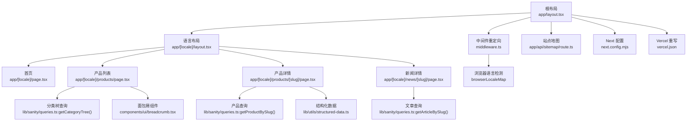
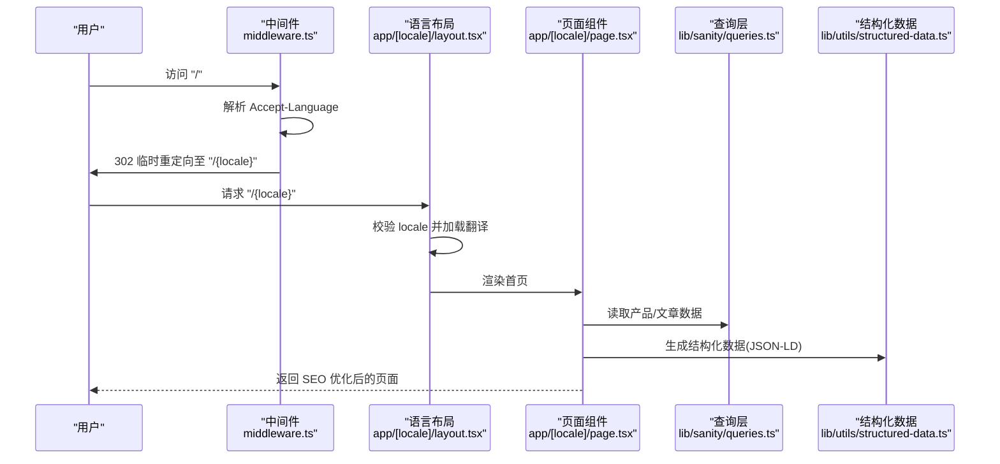
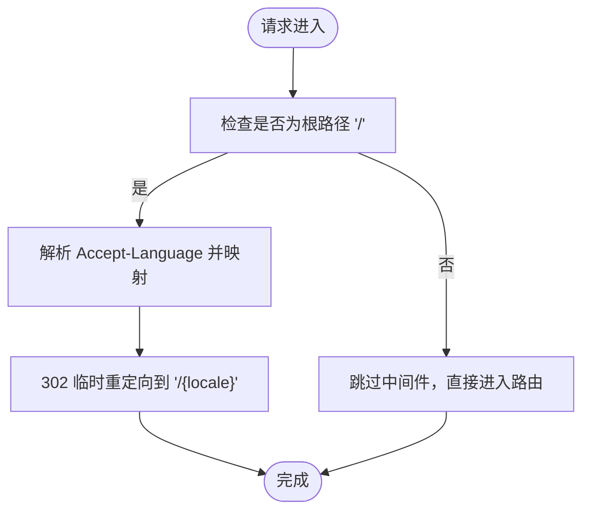
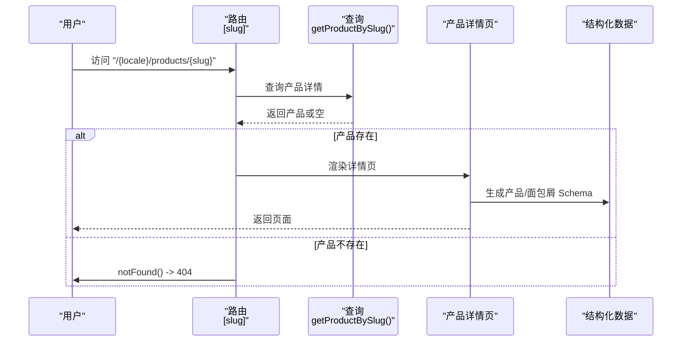
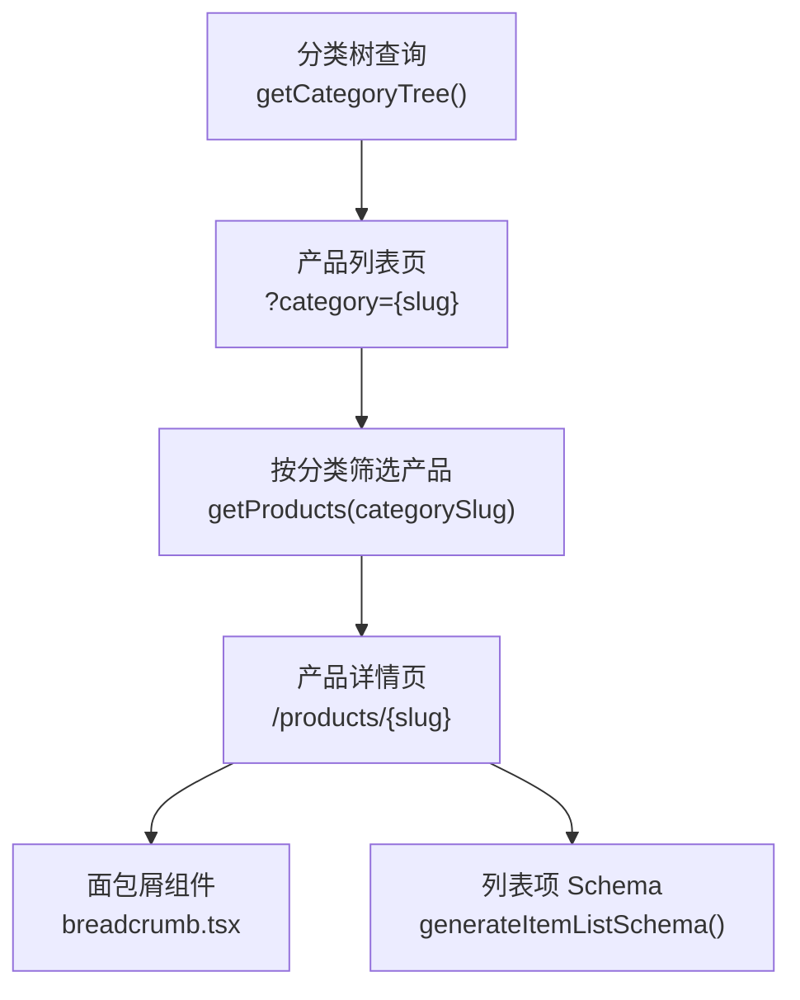
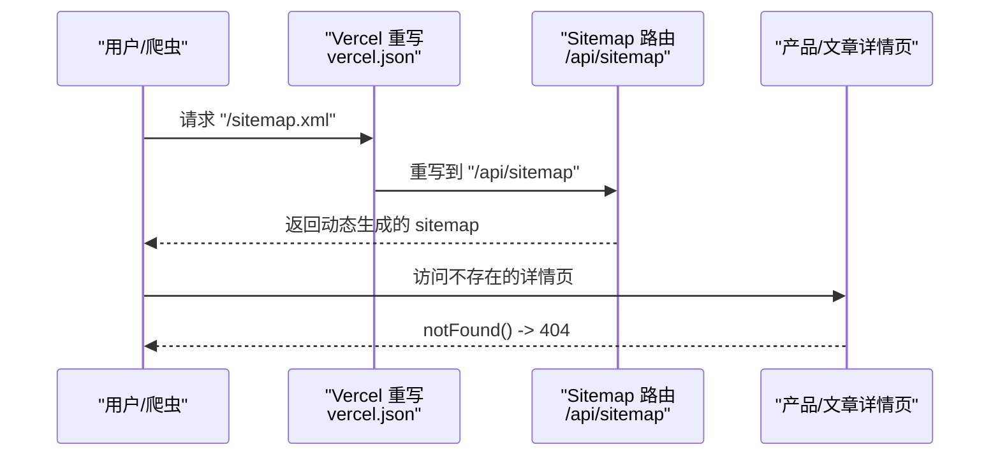
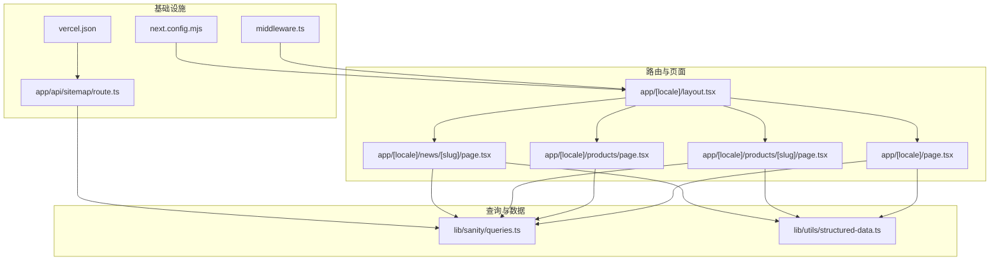
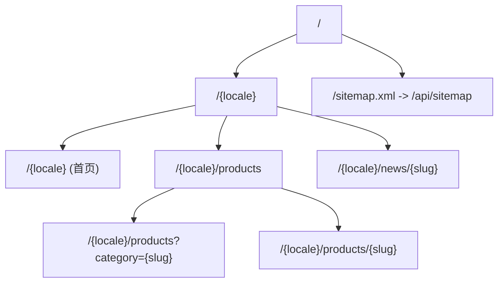

# URL结构优化

<cite>
**本文档引用的文件**
- [app/[locale]/layout.tsx](file://app/[locale]/layout.tsx)
- [app/[locale]/page.tsx](file://app/[locale]/page.tsx)
- [app/[locale]/products/[slug]/page.tsx](file://app/[locale]/products/[slug]/page.tsx)
- [app/[locale]/products/page.tsx](file://app/[locale]/products/page.tsx)
- [app/[locale]/news/[slug]/page.tsx](file://app/[locale]/news/[slug]/page.tsx)
- [middleware.ts](file://middleware.ts)
- [lib/i18n/config.ts](file://lib/i18n/config.ts)
- [lib/sanity/queries.ts](file://lib/sanity/queries.ts)
- [lib/utils/structured-data.ts](file://lib/utils/structured-data.ts)
- [components/ui/breadcrumb.tsx](file://components/ui/breadcrumb.tsx)
- [app/api/sitemap/route.ts](file://app/api/sitemap/route.ts)
- [next.config.mjs](file://next.config.mjs)
- [vercel.json](file://vercel.json)
</cite>

## 目录
1. [简介](#简介)
2. [项目结构](#项目结构)
3. [核心组件](#核心组件)
4. [架构总览](#架构总览)
5. [详细组件分析](#详细组件分析)
6. [依赖关系分析](#依赖关系分析)
7. [性能考量](#性能考量)
8. [故障排查指南](#故障排查指南)
9. [结论](#结论)
10. [附录](#附录)

## 简介
本文件系统化梳理 GoPro Trade 网站的 URL 结构优化方案，重点覆盖：
- 多语言 URL 模式与 locale 参数处理
- 产品详情页 URL 设计与 slug 生成规则
- 分类 URL 优化策略与面包屑导航
- URL 重写与重定向、404 处理与 SEO 友好重定向
- URL 可读性与搜索引擎友好最佳实践
- 路由配置示例与 URL 结构图

## 项目结构
该网站采用 Next.js App Router 的多语言目录结构，以 locale 作为一级路径段，配合动态路由与静态生成参数，形成清晰的 URL 层级与 SEO 友好结构。

**图表来源**
- [app/[locale]/layout.tsx:1-71](file://app/[locale]/layout.tsx#L1-L71)
- [app/[locale]/page.tsx:1-334](file://app/[locale]/page.tsx#L1-L334)
- [app/[locale]/products/[slug]/page.tsx:1-443](file://app/[locale]/products/[slug]/page.tsx#L1-L443)
- [app/[locale]/products/page.tsx:1-295](file://app/[locale]/products/page.tsx#L1-L295)
- [app/[locale]/news/[slug]/page.tsx:1-372](file://app/[locale]/news/[slug]/page.tsx#L1-L372)
- [middleware.ts:1-68](file://middleware.ts#L1-L68)
- [lib/sanity/queries.ts:1-120](file://lib/sanity/queries.ts#L1-L120)
- [lib/utils/structured-data.ts:1-383](file://lib/utils/structured-data.ts#L1-L383)
- [components/ui/breadcrumb.tsx:1-87](file://components/ui/breadcrumb.tsx#L1-L87)
- [app/api/sitemap/route.ts:1-100](file://app/api/sitemap/route.ts#L1-L100)
- [next.config.mjs:1-65](file://next.config.mjs#L1-L65)
- [vercel.json:1-44](file://vercel.json#L1-L44)

**章节来源**
- [app/[locale]/layout.tsx:1-71](file://app/[locale]/layout.tsx#L1-L71)
- [app/[locale]/page.tsx:1-334](file://app/[locale]/page.tsx#L1-L334)
- [app/[locale]/products/[slug]/page.tsx:1-443](file://app/[locale]/products/[slug]/page.tsx#L1-L443)
- [app/[locale]/products/page.tsx:1-295](file://app/[locale]/products/page.tsx#L1-L295)
- [app/[locale]/news/[slug]/page.tsx:1-372](file://app/[locale]/news/[slug]/page.tsx#L1-L372)
- [middleware.ts:1-68](file://middleware.ts#L1-L68)
- [lib/sanity/queries.ts:1-120](file://lib/sanity/queries.ts#L1-L120)
- [lib/utils/structured-data.ts:1-383](file://lib/utils/structured-data.ts#L1-L383)
- [components/ui/breadcrumb.tsx:1-87](file://components/ui/breadcrumb.tsx#L1-L87)
- [app/api/sitemap/route.ts:1-100](file://app/api/sitemap/route.ts#L1-L100)
- [next.config.mjs:1-65](file://next.config.mjs#L1-L65)
- [vercel.json:1-44](file://vercel.json#L1-L44)

## 核心组件
- 多语言布局与元数据生成：app/[locale]/layout.tsx 与 app/[locale]/page.tsx 提供 locale 参数解析、hreflang 与 canonical 链接生成，确保每种语言版本的 SEO 完整性。
- 产品详情页：app/[locale]/products/[slug]/page.tsx 通过 generateStaticParams 预渲染常见 slug，结合 notFound() 实现 404。
- 产品列表与分类：app/[locale]/products/page.tsx 通过查询分类树与产品集合，支持按分类筛选与面包屑导航。
- 新闻详情页：app/[locale]/news/[slug]/page.tsx 支持多语言文章与结构化数据。
- 中间件重定向：middleware.ts 对根路径进行浏览器语言检测与临时重定向，避免硬编码重定向冲突。
- 站点地图：app/api/sitemap/route.ts 动态生成包含产品、分类、静态页的 sitemap，支持多语言。
- 配置与部署：next.config.mjs 与 vercel.json 提供性能与重写配置。

**章节来源**
- [app/[locale]/layout.tsx:11-31](file://app/[locale]/layout.tsx#L11-L31)
- [app/[locale]/page.tsx:22-77](file://app/[locale]/page.tsx#L22-L77)
- [app/[locale]/products/[slug]/page.tsx:26-56](file://app/[locale]/products/[slug]/page.tsx#L26-L56)
- [app/[locale]/products/page.tsx:29-31](file://app/[locale]/products/page.tsx#L29-L31)
- [app/[locale]/news/[slug]/page.tsx:50-64](file://app/[locale]/news/[slug]/page.tsx#L50-L64)
- [middleware.ts:44-63](file://middleware.ts#L44-L63)
- [app/api/sitemap/route.ts:16-99](file://app/api/sitemap/route.ts#L16-L99)
- [next.config.mjs:19-20](file://next.config.mjs#L19-L20)
- [vercel.json:27-32](file://vercel.json#L27-L32)

## 架构总览
下图展示多语言 URL 的生成与访问流程，包括中间件重定向、静态参数生成、路由解析与 SEO 元数据注入。

**图表来源**
- [middleware.ts:21-63](file://middleware.ts#L21-L63)
- [app/[locale]/layout.tsx:42-70](file://app/[locale]/layout.tsx#L42-L70)
- [app/[locale]/page.tsx:22-77](file://app/[locale]/page.tsx#L22-L77)
- [lib/sanity/queries.ts:1-120](file://lib/sanity/queries.ts#L1-L120)
- [lib/utils/structured-data.ts:165-192](file://lib/utils/structured-data.ts#L165-L192)

## 详细组件分析

### 多语言 URL 模式与 locale 参数处理
- 语言检测与重定向
  - 根路径 "/" 仅在中间件中处理，依据浏览器 Accept-Language 映射到 locales，执行 302 临时重定向。
  - 通过 headers 设置 no-store 等缓存控制，避免缓存导致的语言错配。
- 语言布局与静态参数
  - 语言布局通过 generateStaticParams 生成所有 locale 的静态参数，确保每个语言版本独立预渲染。
  - generateMetadata 动态生成 canonical 与 hreflang，保证多语言 SEO 完整性。
- 语言配置
  - locales、defaultLocale、rtlLocales 在 i18n 配置中集中定义，便于统一管理。

**图表来源**
- [middleware.ts:44-63](file://middleware.ts#L44-L63)
- [app/[locale]/layout.tsx:11-13](file://app/[locale]/layout.tsx#L11-L13)
- [app/[locale]/layout.tsx:16-31](file://app/[locale]/layout.tsx#L16-L31)

**章节来源**
- [middleware.ts:1-68](file://middleware.ts#L1-L68)
- [app/[locale]/layout.tsx:11-31](file://app/[locale]/layout.tsx#L11-L31)
- [lib/i18n/config.ts:1-16](file://lib/i18n/config.ts#L1-L16)

### 产品详情页 URL 结构设计
- URL 结构
  - 通用格式：/{locale}/products/{slug}
  - 通过 generateStaticParams 预渲染常见 slug，减少运行时查询压力。
- slug 生成规则
  - 产品 slug 来源于 Sanity 的 slug.current，确保与后台一致。
  - 产品详情页使用 notFound() 处理不存在的 slug，返回 404。
- SEO 与结构化数据
  - generateMetadata 生成多语言 alternate 与 canonical。
  - 生成产品 Schema 与面包屑 Schema，提升搜索可见性。
- 面包屑导航
  - 组件自动输出 JSON-LD，UI 展示“首页/产品/分类/名称”的层级。

**图表来源**
- [app/[locale]/products/[slug]/page.tsx:26-56](file://app/[locale]/products/[slug]/page.tsx#L26-L56)
- [app/[locale]/products/[slug]/page.tsx:60-141](file://app/[locale]/products/[slug]/page.tsx#L60-L141)
- [lib/sanity/queries.ts:68-88](file://lib/sanity/queries.ts#L68-L88)
- [lib/utils/structured-data.ts:25-99](file://lib/utils/structured-data.ts#L25-L99)
- [components/ui/breadcrumb.tsx:24-42](file://components/ui/breadcrumb.tsx#L24-L42)

**章节来源**
- [app/[locale]/products/[slug]/page.tsx:1-443](file://app/[locale]/products/[slug]/page.tsx#L1-L443)
- [lib/sanity/queries.ts:68-88](file://lib/sanity/queries.ts#L68-L88)
- [lib/utils/structured-data.ts:197-208](file://lib/utils/structured-data.ts#L197-L208)
- [components/ui/breadcrumb.tsx:1-87](file://components/ui/breadcrumb.tsx#L1-L87)

### 分类 URL 优化策略与面包屑
- 分类 URL 设计
  - 列表页：/{locale}/products?category={slug}
  - 详情页：/{locale}/products/{slug}
  - 分类树查询支持父子分类联动，筛选时包含子分类产品。
- 面包屑导航
  - 统一使用 Breadcrumb 组件，自动生成 JSON-LD，UI 展示层级。
  - 产品详情页面包屑包含“首页/产品/分类/产品名”。
- 结构化数据
  - generateItemListSchema 与 generateBreadcrumbSchema 用于分类与详情页的 SEO 增强。

**图表来源**
- [app/[locale]/products/page.tsx:93-96](file://app/[locale]/products/page.tsx#L93-L96)
- [lib/sanity/queries.ts:15-28](file://lib/sanity/queries.ts#L15-L28)
- [lib/sanity/queries.ts:30-66](file://lib/sanity/queries.ts#L30-L66)
- [lib/utils/structured-data.ts:231-241](file://lib/utils/structured-data.ts#L231-L241)
- [components/ui/breadcrumb.tsx:24-42](file://components/ui/breadcrumb.tsx#L24-L42)

**章节来源**
- [app/[locale]/products/page.tsx:1-295](file://app/[locale]/products/page.tsx#L1-L295)
- [lib/sanity/queries.ts:15-66](file://lib/sanity/queries.ts#L15-L66)
- [lib/utils/structured-data.ts:197-208](file://lib/utils/structured-data.ts#L197-L208)
- [components/ui/breadcrumb.tsx:1-87](file://components/ui/breadcrumb.tsx#L1-L87)

### URL 重写与重定向、404 处理与 SEO 友好重定向
- 根路径重定向
  - 中间件仅对 "/" 进行浏览器语言检测与 302 重定向，避免与动态路由冲突。
- Vercel 重写
  - sitemap.xml 到 /api/sitemap 的重写，保持静态资源访问语义清晰。
- 404 处理
  - 产品与文章详情页在未命中时调用 notFound()，确保搜索引擎正确识别。
- SEO 友好重定向
  - canonical 与 hreflang 在各语言页面生成，避免重复内容问题。

**图表来源**
- [vercel.json:27-32](file://vercel.json#L27-L32)
- [app/api/sitemap/route.ts:16-99](file://app/api/sitemap/route.ts#L16-L99)
- [app/[locale]/products/[slug]/page.tsx:152-154](file://app/[locale]/products/[slug]/page.tsx#L152-L154)
- [app/[locale]/news/[slug]/page.tsx:132-134](file://app/[locale]/news/[slug]/page.tsx#L132-L134)

**章节来源**
- [middleware.ts:44-63](file://middleware.ts#L44-L63)
- [vercel.json:27-32](file://vercel.json#L27-L32)
- [app/api/sitemap/route.ts:16-99](file://app/api/sitemap/route.ts#L16-L99)
- [app/[locale]/products/[slug]/page.tsx:152-154](file://app/[locale]/products/[slug]/page.tsx#L152-L154)
- [app/[locale]/news/[slug]/page.tsx:132-134](file://app/[locale]/news/[slug]/page.tsx#L132-L134)

### URL 可读性与搜索引擎友好最佳实践
- URL 设计
  - 使用短横线分隔单词，避免下划线与大写字母，提升可读性与兼容性。
  - 采用语义化路径段：/{locale}/{section}/{resource}。
- 结构化数据
  - 产品、网站、面包屑、FAQ、本地业务等 Schema 增强搜索表现。
- 元数据与 hreflang
  - 每个语言版本设置 canonical 与 hreflang，避免重复内容惩罚。
- 站点地图
  - 动态生成包含产品、分类、静态页的 sitemap，提高索引覆盖率。

**章节来源**
- [lib/utils/structured-data.ts:25-99](file://lib/utils/structured-data.ts#L25-L99)
- [lib/utils/structured-data.ts:165-192](file://lib/utils/structured-data.ts#L165-L192)
- [lib/utils/structured-data.ts:197-208](file://lib/utils/structured-data.ts#L197-L208)
- [app/[locale]/layout.tsx:16-31](file://app/[locale]/layout.tsx#L16-L31)
- [app/[locale]/page.tsx:30-43](file://app/[locale]/page.tsx#L30-L43)
- [app/api/sitemap/route.ts:16-99](file://app/api/sitemap/route.ts#L16-L99)

## 依赖关系分析

**图表来源**
- [app/[locale]/layout.tsx:1-71](file://app/[locale]/layout.tsx#L1-L71)
- [app/[locale]/page.tsx:1-334](file://app/[locale]/page.tsx#L1-L334)
- [app/[locale]/products/page.tsx:1-295](file://app/[locale]/products/page.tsx#L1-L295)
- [app/[locale]/products/[slug]/page.tsx:1-443](file://app/[locale]/products/[slug]/page.tsx#L1-L443)
- [app/[locale]/news/[slug]/page.tsx:1-372](file://app/[locale]/news/[slug]/page.tsx#L1-L372)
- [lib/sanity/queries.ts:1-120](file://lib/sanity/queries.ts#L1-L120)
- [lib/utils/structured-data.ts:1-383](file://lib/utils/structured-data.ts#L1-L383)
- [middleware.ts:1-68](file://middleware.ts#L1-L68)
- [app/api/sitemap/route.ts:1-100](file://app/api/sitemap/route.ts#L1-L100)
- [next.config.mjs:1-65](file://next.config.mjs#L1-L65)
- [vercel.json:1-44](file://vercel.json#L1-L44)

**章节来源**
- [lib/sanity/queries.ts:1-120](file://lib/sanity/queries.ts#L1-L120)
- [lib/utils/structured-data.ts:1-383](file://lib/utils/structured-data.ts#L1-L383)
- [middleware.ts:1-68](file://middleware.ts#L1-L68)
- [app/api/sitemap/route.ts:1-100](file://app/api/sitemap/route.ts#L1-L100)
- [next.config.mjs:1-65](file://next.config.mjs#L1-L65)
- [vercel.json:1-44](file://vercel.json#L1-L44)

## 性能考量
- 预渲染与静态参数
  - 产品详情页通过 generateStaticParams 预渲染常见 slug，降低冷启动成本。
- ISR 与缓存
  - 各页面设置 revalidate，结合 CDN 缓存提升性能。
- 图片优化
  - next.config.mjs 启用现代图片格式与懒加载，提升 LCP 指标。
- 响应头安全与缓存
  - headers 中设置安全与缓存策略，避免敏感信息泄露。
- 重写与构建
  - vercel.json 的重写与构建命令确保部署一致性。

**章节来源**
- [app/[locale]/products/[slug]/page.tsx:24](file://app/[locale]/products/[slug]/page.tsx#L24)
- [app/[locale]/page.tsx:149-150](file://app/[locale]/page.tsx#L149-L150)
- [next.config.mjs:4-17](file://next.config.mjs#L4-L17)
- [next.config.mjs:35-61](file://next.config.mjs#L35-L61)
- [vercel.json:3-7](file://vercel.json#L3-L7)

## 故障排查指南
- 404 页面
  - 产品与文章详情页未命中时触发 notFound()，确认 slug 是否存在于 Sanity。
- 语言重定向异常
  - 检查 Accept-Language 是否在 browserLocaleMap 中映射，确认中间件 matcher 仅匹配根路径。
- canonical 与 hreflang 错误
  - 确认 generateMetadata 中 baseUrl 与 locale 拼接正确，alternate 语言列表完整。
- 站点地图缺失
  - 确认 vercel.json 重写生效，/sitemap.xml 指向 /api/sitemap，且路由返回 XML。
- 面包屑不显示
  - 检查 Breadcrumb 组件传入的 items 与 getLocalizedHref 生成的链接。

**章节来源**
- [app/[locale]/products/[slug]/page.tsx:152-154](file://app/[locale]/products/[slug]/page.tsx#L152-L154)
- [app/[locale]/news/[slug]/page.tsx:132-134](file://app/[locale]/news/[slug]/page.tsx#L132-L134)
- [middleware.ts:6-19](file://middleware.ts#L6-L19)
- [middleware.ts:44-63](file://middleware.ts#L44-L63)
- [app/[locale]/layout.tsx:16-31](file://app/[locale]/layout.tsx#L16-L31)
- [vercel.json:27-32](file://vercel.json#L27-L32)
- [components/ui/breadcrumb.tsx:24-42](file://components/ui/breadcrumb.tsx#L24-L42)

## 结论
本系统通过明确的多语言 URL 模式、合理的静态参数与 ISR 策略、完善的结构化数据与面包屑导航，实现了高可读性与搜索引擎友好的 URL 结构。中间件与重写机制确保了语言检测与部署的一致性，站点地图与元数据配置进一步提升了 SEO 表现。建议持续维护 slug 与分类树，定期校验 sitemap 与重定向链路，以保障用户体验与搜索可见性。

## 附录
- 路由配置示例（概念性）
  - 根路径重定向：仅对 "/" 生效，避免与动态路由冲突。
  - 产品详情：/{locale}/products/{slug}，预渲染常见 slug。
  - 分类筛选：/{locale}/products?category={slug}。
  - 新闻详情：/{locale}/news/{slug}。
  - 站点地图：/sitemap.xml -> /api/sitemap。
- URL 结构图（概念性）

