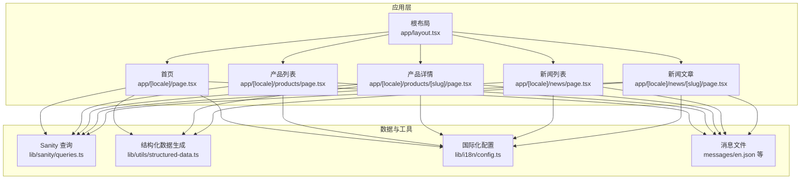
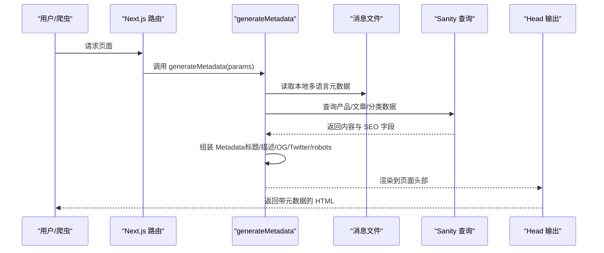
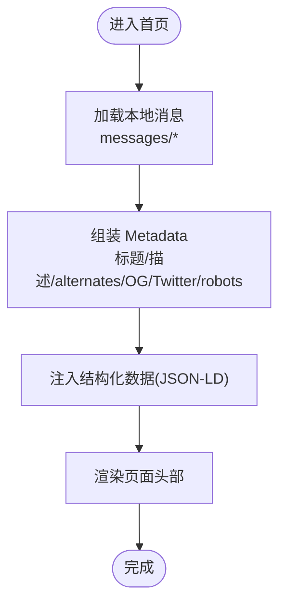
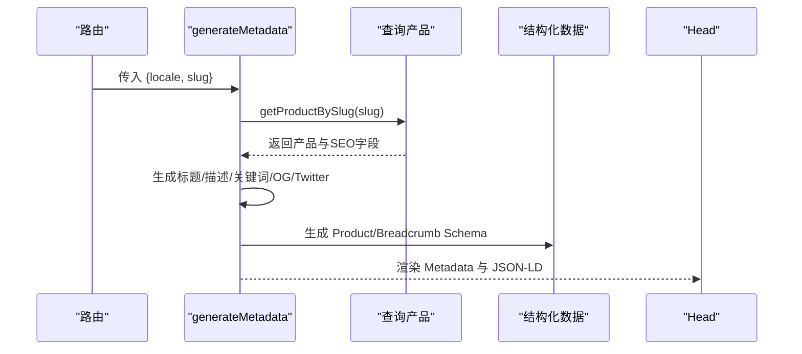
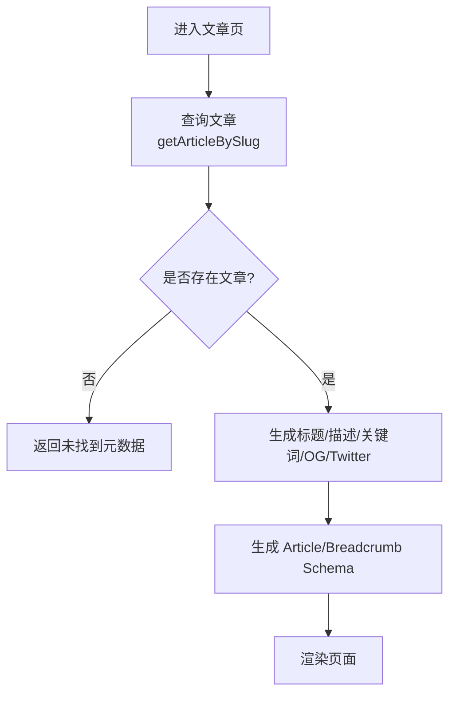
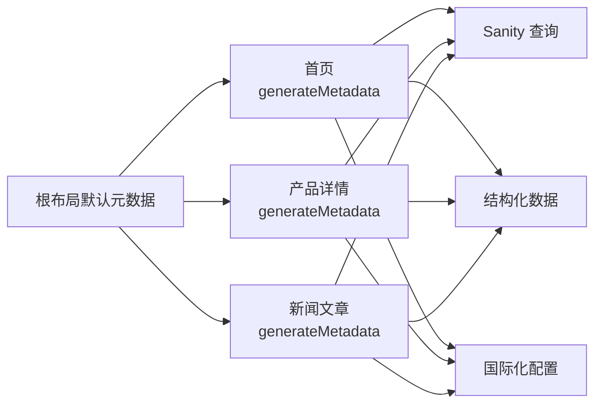

# 元数据管理

<cite>
**本文引用的文件**
- [app/layout.tsx](file://app/layout.tsx)
- [app/[locale]/page.tsx](file://app/[locale]/page.tsx)
- [app/[locale]/products/[slug]/page.tsx](file://app/[locale]/products/[slug]/page.tsx)
- [app/[locale]/news/[slug]/page.tsx](file://app/[locale]/news/[slug]/page.tsx)
- [app/[locale]/news/page.tsx](file://app/[locale]/news/page.tsx)
- [app/[locale]/products/page.tsx](file://app/[locale]/products/page.tsx)
- [lib/utils/structured-data.ts](file://lib/utils/structured-data.ts)
- [lib/sanity/queries.ts](file://lib/sanity/queries.ts)
- [lib/i18n/config.ts](file://lib/i18n/config.ts)
- [messages/en.json](file://messages/en.json)
</cite>

## 目录
1. [简介](#简介)
2. [项目结构](#项目结构)
3. [核心组件](#核心组件)
4. [架构总览](#架构总览)
5. [详细组件分析](#详细组件分析)
6. [依赖关系分析](#依赖关系分析)
7. [性能考量](#性能考量)
8. [故障排查指南](#故障排查指南)
9. [结论](#结论)
10. [附录](#附录)

## 简介
本文件系统性阐述 GoPro Trade 网站的元数据管理系统，涵盖页面标题、描述、关键词的动态生成机制，从 Sanity CMS 获取内容与本地化处理，Next.js Head 组件的最佳实践，以及针对首页、产品详情页、新闻文章页、分类页等不同页面类型的差异化元数据策略。同时说明 Open Graph 和 Twitter Card 的集成实现，提供元数据优化技巧（长度控制、字符编码、特殊字符处理等），并给出实际代码示例路径与 SEO 效果对比建议。

## 项目结构
该网站采用 Next.js App Router，多语言通过路由段 [locale] 实现，页面元数据在各页面的 generateMetadata 函数中动态生成，结构化数据通过专用工具模块统一生成，内容来源主要来自 Sanity CMS 与本地国际化消息文件。

图表来源
- [app/layout.tsx:1-19](file://app/layout.tsx#L1-L19)
- [app/[locale]/page.tsx:23-77](file://app/[locale]/page.tsx#L23-L77)
- [app/[locale]/products/page.tsx:35-78](file://app/[locale]/products/page.tsx#L35-L78)
- [app/[locale]/products/[slug]/page.tsx:60-141](file://app/[locale]/products/[slug]/page.tsx#L60-L141)
- [app/[locale]/news/page.tsx:54-68](file://app/[locale]/news/page.tsx#L54-L68)
- [app/[locale]/news/[slug]/page.tsx:66-105](file://app/[locale]/news/[slug]/page.tsx#L66-L105)
- [lib/sanity/queries.ts:1-120](file://lib/sanity/queries.ts#L1-L120)
- [lib/utils/structured-data.ts:1-383](file://lib/utils/structured-data.ts#L1-L383)
- [lib/i18n/config.ts:1-16](file://lib/i18n/config.ts#L1-L16)
- [messages/en.json:1-200](file://messages/en.json#L1-L200)

章节来源
- [app/layout.tsx:1-19](file://app/layout.tsx#L1-L19)
- [lib/i18n/config.ts:1-16](file://lib/i18n/config.ts#L1-L16)

## 核心组件
- 动态元数据生成器：各页面通过 generateMetadata(params) 返回 Metadata 对象，实现标题、描述、关键词、Open Graph、Twitter Card、robots 等字段的动态填充。
- 国际化与本地化：结合 messages/* 与路由 [locale]，从本地消息文件与 Sanity 字段中提取多语言内容。
- 结构化数据：通过 generateProductSchema、generateArticleSchema、generateWebsiteSchema 等函数生成 JSON-LD，提升 AI 搜索与富媒体摘要表现。
- 内容来源：Sanity 查询模块负责从 CMS 获取产品、文章、分类等数据，确保元数据与内容一致。

章节来源
- [app/[locale]/page.tsx:23-77](file://app/[locale]/page.tsx#L23-L77)
- [app/[locale]/products/[slug]/page.tsx:60-141](file://app/[locale]/products/[slug]/page.tsx#L60-L141)
- [app/[locale]/news/[slug]/page.tsx:66-105](file://app/[locale]/news/[slug]/page.tsx#L66-L105)
- [lib/utils/structured-data.ts:25-99](file://lib/utils/structured-data.ts#L25-L99)
- [lib/utils/structured-data.ts:347-382](file://lib/utils/structured-data.ts#L347-L382)
- [lib/sanity/queries.ts:68-119](file://lib/sanity/queries.ts#L68-L119)

## 架构总览
下图展示了元数据生成的关键流程：页面路由触发 generateMetadata，读取本地消息与 Sanity 数据，构建 Metadata 并渲染到页面头部；同时注入结构化数据脚本以增强 SEO 与社交分享体验。

图表来源
- [app/[locale]/page.tsx:23-77](file://app/[locale]/page.tsx#L23-L77)
- [app/[locale]/products/[slug]/page.tsx:60-141](file://app/[locale]/products/[slug]/page.tsx#L60-L141)
- [app/[locale]/news/[slug]/page.tsx:66-105](file://app/[locale]/news/[slug]/page.tsx#L66-L105)
- [lib/sanity/queries.ts:68-119](file://lib/sanity/queries.ts#L68-L119)
- [messages/en.json:1-200](file://messages/en.json#L1-L200)

## 详细组件分析

### 首页元数据策略
- 标题与描述：优先使用本地消息中的 metadata.title/description，作为默认值兜底。
- 多语言链接：为每种语言生成 alternates.languages 与 canonical，确保搜索引擎识别多语言版本。
- Open Graph 与 Twitter Card：设置统一的 siteName、locale、images，保证社交分享一致性。
- robots：允许索引与跟随，放宽预览尺寸，提升内容抓取与展示质量。
- 结构化数据：注入 Organization、Website、FAQ 等，增强 AI 搜索与知识图谱表现。

图表来源
- [app/[locale]/page.tsx:23-77](file://app/[locale]/page.tsx#L23-L77)
- [lib/utils/structured-data.ts:104-160](file://lib/utils/structured-data.ts#L104-L160)
- [lib/utils/structured-data.ts:165-192](file://lib/utils/structured-data.ts#L165-L192)
- [lib/utils/structured-data.ts:213-226](file://lib/utils/structured-data.ts#L213-L226)

章节来源
- [app/[locale]/page.tsx:23-77](file://app/[locale]/page.tsx#L23-L77)
- [messages/en.json:2-5](file://messages/en.json#L2-L5)

### 产品详情页元数据策略
- 标题与描述：优先使用产品 SEO 字段（metaTitle/metaDescription），否则回退到名称与短描述。
- 多语言链接：为每种语言生成 canonical 与 alternates.languages，保持语言一致性。
- Open Graph 与 Twitter Card：使用主图或默认图，siteName 依据语言切换，type 设为 article。
- 关键词：基于产品名称、型号、品类、品牌词等组合，提升搜索覆盖面。
- robots：允许索引与跟随，放宽预览尺寸，利于内容抓取。
- 结构化数据：注入 Product 与 Breadcrumb，增强富媒体摘要与 AI 搜索表现。

图表来源
- [app/[locale]/products/[slug]/page.tsx:60-141](file://app/[locale]/products/[slug]/page.tsx#L60-L141)
- [lib/sanity/queries.ts:68-88](file://lib/sanity/queries.ts#L68-L88)
- [lib/utils/structured-data.ts:25-99](file://lib/utils/structured-data.ts#L25-L99)
- [lib/utils/structured-data.ts:197-208](file://lib/utils/structured-data.ts#L197-L208)

章节来源
- [app/[locale]/products/[slug]/page.tsx:60-141](file://app/[locale]/products/[slug]/page.tsx#L60-L141)
- [lib/sanity/queries.ts:68-88](file://lib/sanity/queries.ts#L68-L88)

### 新闻文章页元数据策略
- 标题与描述：优先使用文章 SEO 字段，其次使用标题与摘要，最后回退至默认值。
- 关键词：优先使用 SEO 关键词，否则回退到标签集合。
- 多语言链接：为每种语言生成 alternates.languages 与 canonical。
- Open Graph 与 Twitter Card：使用封面图（若存在），设置 publishedTime、authors 等丰富属性。
- 结构化数据：注入 Article 与 Breadcrumb，提升资讯类内容的搜索与分享体验。

图表来源
- [app/[locale]/news/[slug]/page.tsx:66-105](file://app/[locale]/news/[slug]/page.tsx#L66-L105)
- [lib/utils/structured-data.ts:347-382](file://lib/utils/structured-data.ts#L347-L382)

章节来源
- [app/[locale]/news/[slug]/page.tsx:66-105](file://app/[locale]/news/[slug]/page.tsx#L66-L105)

### 新闻列表页元数据策略
- 标题与描述：使用本地消息中的 news.title/description 作为默认值。
- 多语言链接：为每种语言生成 alternates.languages 与 canonical。
- 无需 keywords/OG/Twitter：列表页以导航为主，重点在于多语言链接与 canonical。

章节来源
- [app/[locale]/news/page.tsx:54-68](file://app/[locale]/news/page.tsx#L54-L68)

### 产品列表页元数据策略
- 标题与描述：使用本地消息中的 navigation.products 与 metadata.description。
- 多语言链接：为每种语言生成 alternates.languages 与 canonical。
- Open Graph 与 Twitter Card：使用默认图，siteName 依据语言切换，type 为 website。

章节来源
- [app/[locale]/products/page.tsx:35-78](file://app/[locale]/products/page.tsx#L35-L78)

### 结构化数据与 SEO 增强
- 产品详情：生成 Product Schema，包含品牌、制造商、规格属性、应用场景、报价信息等，提升 AI 搜索与富媒体摘要。
- 网站与组织：生成 WebSite、Organization Schema，强化站点身份与企业信息。
- 文章：生成 Article Schema，包含发布时间、作者、关键词、分类等，提升资讯类内容表现。
- 面包屑：生成 Breadcrumb Schema，改善导航与结构化展示。

章节来源
- [lib/utils/structured-data.ts:25-99](file://lib/utils/structured-data.ts#L25-L99)
- [lib/utils/structured-data.ts:104-160](file://lib/utils/structured-data.ts#L104-L160)
- [lib/utils/structured-data.ts:165-192](file://lib/utils/structured-data.ts#L165-L192)
- [lib/utils/structured-data.ts:197-208](file://lib/utils/structured-data.ts#L197-L208)
- [lib/utils/structured-data.ts:347-382](file://lib/utils/structured-data.ts#L347-L382)

## 依赖关系分析
- 页面到数据层：各页面 generateMetadata 依赖 lib/sanity/queries.ts 提供的产品/文章/分类数据。
- 页面到工具层：结构化数据统一由 lib/utils/structured-data.ts 生成，避免重复逻辑。
- 页面到国际化：lib/i18n/config.ts 定义可用语言与 RTL 语言，页面根据 locale 选择消息文件与链接。
- 默认布局：app/layout.tsx 提供全局默认标题与描述，作为兜底。

图表来源
- [app/[locale]/page.tsx:23-77](file://app/[locale]/page.tsx#L23-L77)
- [app/[locale]/products/[slug]/page.tsx:60-141](file://app/[locale]/products/[slug]/page.tsx#L60-L141)
- [app/[locale]/news/[slug]/page.tsx:66-105](file://app/[locale]/news/[slug]/page.tsx#L66-L105)
- [lib/sanity/queries.ts:68-119](file://lib/sanity/queries.ts#L68-L119)
- [lib/utils/structured-data.ts:1-383](file://lib/utils/structured-data.ts#L1-L383)
- [lib/i18n/config.ts:1-16](file://lib/i18n/config.ts#L1-L16)
- [app/layout.tsx:1-19](file://app/layout.tsx#L1-L19)

章节来源
- [lib/sanity/queries.ts:1-120](file://lib/sanity/queries.ts#L1-L120)
- [lib/utils/structured-data.ts:1-383](file://lib/utils/structured-data.ts#L1-L383)
- [lib/i18n/config.ts:1-16](file://lib/i18n/config.ts#L1-L16)
- [app/layout.tsx:1-19](file://app/layout.tsx#L1-L19)

## 性能考量
- ISR 与 revalidate：首页与产品详情页设置 revalidate=3600，减少频繁请求；新闻文章页设置 revalidate=300，保证时效性。
- 图片与预加载：首页与详情页对首屏图片使用 priority 与 sizes，提升 LCP 与加载体验。
- 结构化数据内联：通过 dangerouslySetInnerHTML 注入 JSON-LD，避免额外请求，降低延迟。
- 多语言链接：仅生成必要语言的 alternates，避免冗余链接影响性能。

章节来源
- [app/[locale]/page.tsx:149-150](file://app/[locale]/page.tsx#L149-L150)
- [app/[locale]/products/[slug]/page.tsx:23-24](file://app/[locale]/products/[slug]/page.tsx#L23-L24)
- [app/[locale]/news/[slug]/page.tsx:48](file://app/[locale]/news/[slug]/page.tsx#L48)

## 故障排查指南
- 元数据为空或错误
  - 检查 generateMetadata 是否正确读取本地消息与 Sanity 字段。
  - 确认 slug 或 locale 参数是否正确传递。
- 产品/文章不存在
  - 产品详情页在未找到时返回“Product Not Found”标题；文章页返回“Article Not Found”。
- 多语言链接缺失
  - 确认 locales 数组与 alternates.languages 生成逻辑一致。
- 结构化数据未生效
  - 检查 JSON-LD 注入位置与格式，确保类型与字段完整。
- 图片未显示
  - 确认 urlForImage 生成的 URL 正确，且图片资源可访问。

章节来源
- [app/[locale]/products/[slug]/page.tsx:68-70](file://app/[locale]/products/[slug]/page.tsx#L68-L70)
- [app/[locale]/news/[slug]/page.tsx:70-74](file://app/[locale]/news/[slug]/page.tsx#L70-L74)
- [lib/i18n/config.ts:1-16](file://lib/i18n/config.ts#L1-L16)
- [lib/utils/structured-data.ts:1-383](file://lib/utils/structured-data.ts#L1-L383)

## 结论
本元数据管理体系通过 generateMetadata 与结构化数据工具，实现了从 Sanity CMS 与本地消息源的动态内容整合，配合多语言链接与社交平台协议，显著提升了 SEO 表现与社交分享质量。建议持续维护 Sanity 中的 metaTitle、metaDescription、keywords 等字段，定期校验结构化数据有效性，并根据流量与排名反馈迭代元数据策略。

## 附录

### Next.js Head 组件最佳实践
- 使用 generateMetadata 返回 Metadata，自动渲染到页面头部。
- 避免在组件中直接使用 Head 组件手动拼装，统一由 generateMetadata 管理。
- 对于结构化数据，使用 JSON-LD 并通过 dangerouslySetInnerHTML 注入，确保类型与字段正确。

章节来源
- [app/[locale]/page.tsx:23-77](file://app/[locale]/page.tsx#L23-L77)
- [app/[locale]/products/[slug]/page.tsx:60-141](file://app/[locale]/products/[slug]/page.tsx#L60-L141)
- [app/[locale]/news/[slug]/page.tsx:66-105](file://app/[locale]/news/[slug]/page.tsx#L66-L105)

### 不同页面类型的元数据策略清单
- 首页：标题/描述来自本地消息，多语言链接与 canonical，OG/Twitter 使用默认图，robots 允许索引。
- 产品详情：标题/描述优先 SEO 字段，关键词基于产品信息，OG/Twitter 使用主图，注入 Product/Breadcrumb Schema。
- 新闻文章：标题/描述优先 SEO 字段，关键词优先 SEO，OG/Twitter 使用封面图，注入 Article/Breadcrumb Schema。
- 新闻列表：标题/描述来自本地消息，多语言链接与 canonical。
- 产品列表：标题/描述来自本地消息，多语言链接与 canonical，OG/Twitter 使用默认图。

章节来源
- [app/[locale]/page.tsx:23-77](file://app/[locale]/page.tsx#L23-L77)
- [app/[locale]/products/[slug]/page.tsx:60-141](file://app/[locale]/products/[slug]/page.tsx#L60-L141)
- [app/[locale]/news/[slug]/page.tsx:66-105](file://app/[locale]/news/[slug]/page.tsx#L66-L105)
- [app/[locale]/news/page.tsx:54-68](file://app/[locale]/news/page.tsx#L54-L68)
- [app/[locale]/products/page.tsx:35-78](file://app/[locale]/products/page.tsx#L35-L78)

### Open Graph 与 Twitter Card 集成要点
- 统一使用 images 数组，提供 width/height/alt，确保社交平台正确渲染。
- OG 的 siteName 与 locale 根据语言切换，Twitter card 保持一致风格。
- 文章页补充 publishedTime、authors、articleSection 等丰富属性。

章节来源
- [app/[locale]/page.tsx:43-64](file://app/[locale]/page.tsx#L43-L64)
- [app/[locale]/products/[slug]/page.tsx:94-117](file://app/[locale]/products/[slug]/page.tsx#L94-L117)
- [app/[locale]/news/[slug]/page.tsx:90-103](file://app/[locale]/news/[slug]/page.tsx#L90-L103)

### 元数据优化技巧
- 长度控制：标题建议不超过 60 个字符，描述不超过 160 个字符，关键词控制在 5-10 个以内。
- 字符编码：确保 UTF-8 编码，避免特殊字符导致解析异常。
- 特殊字符处理：对引号、连字符、换行符进行转义或清理，避免破坏 HTML 属性。
- 多语言一致性：alternates.languages 与 canonical 必须与路由 locale 严格对应。
- 结构化数据完整性：JSON-LD 类型与字段需与实际内容一致，避免误导搜索引擎。

[本节为通用指导，无需列出章节来源]