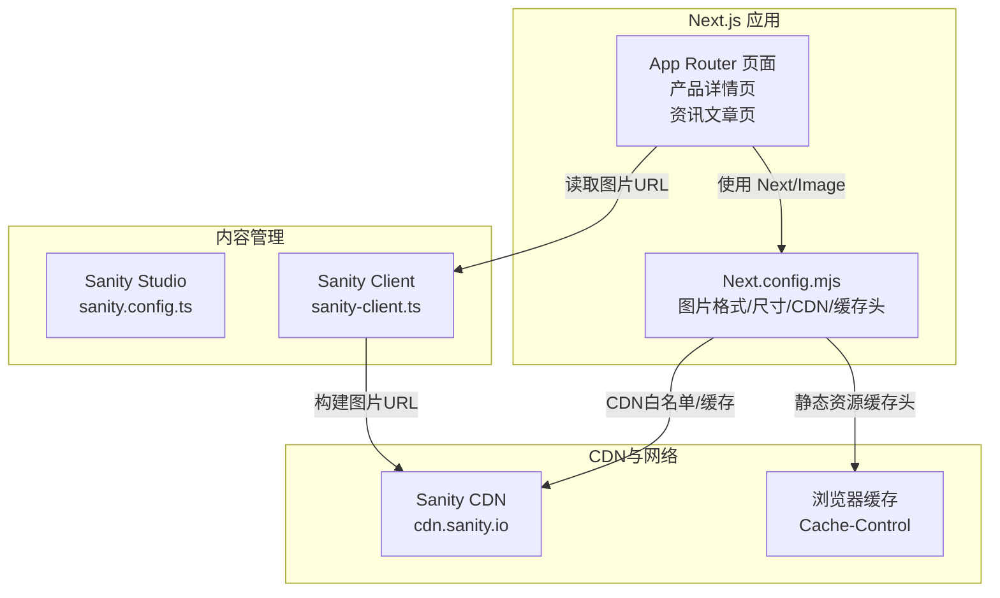
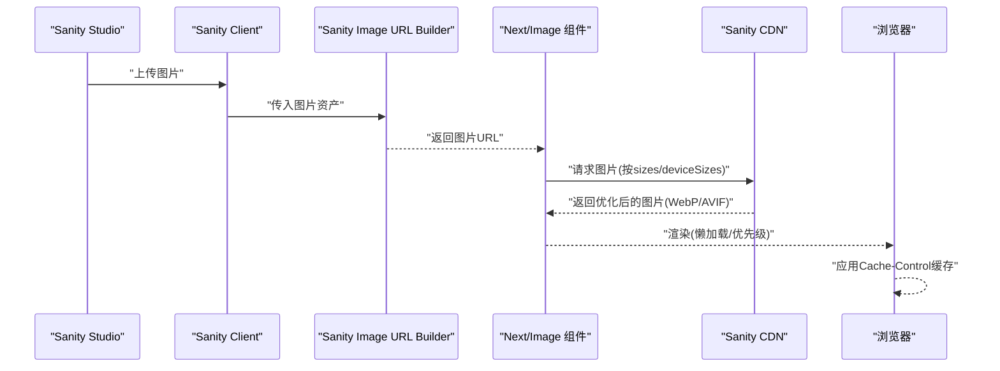
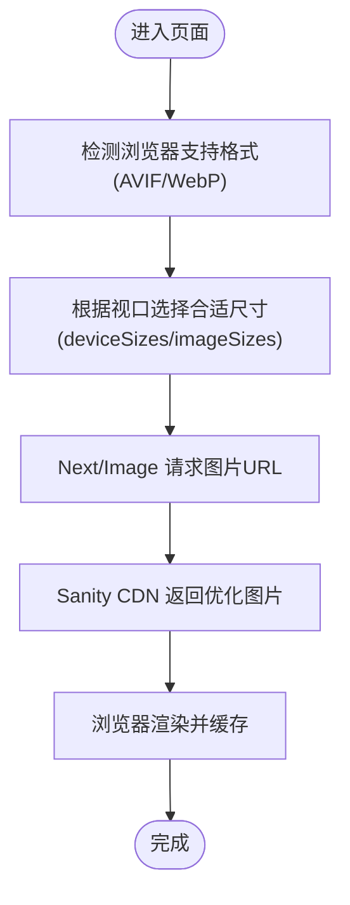
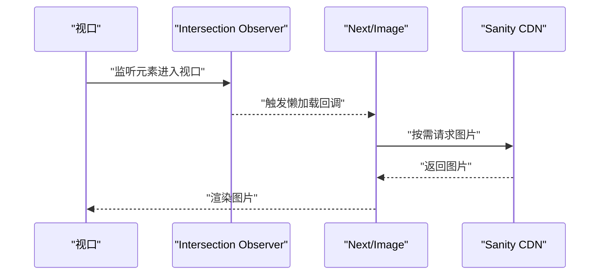
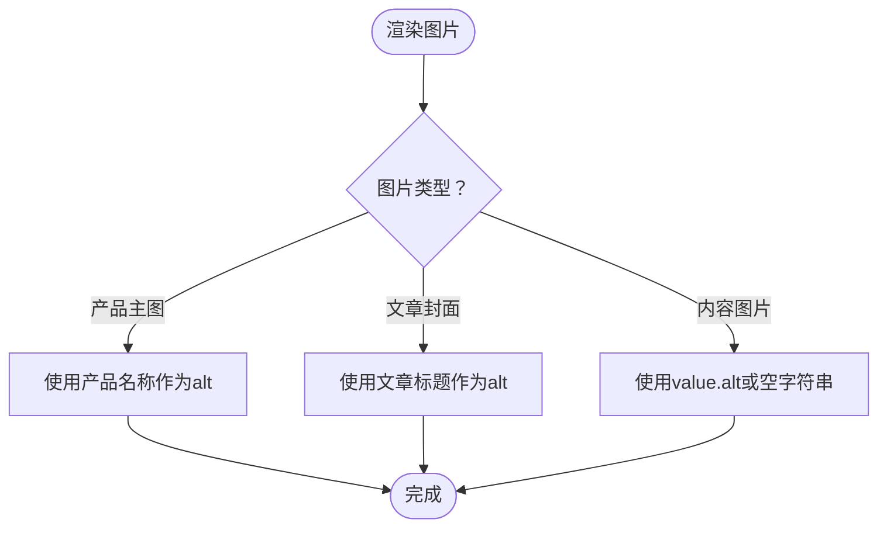
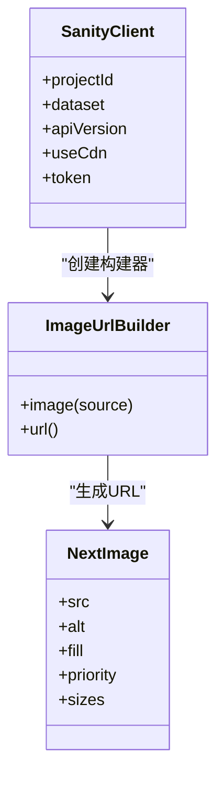
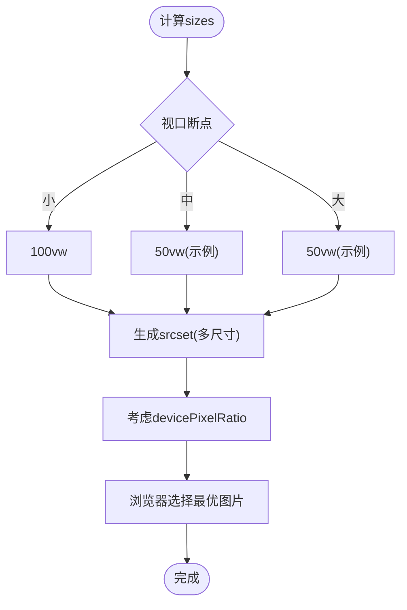
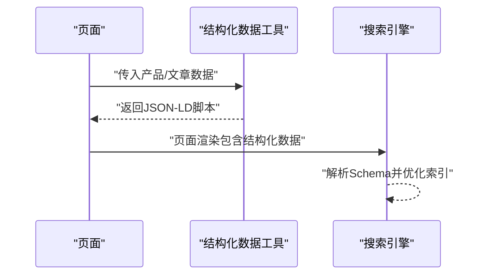
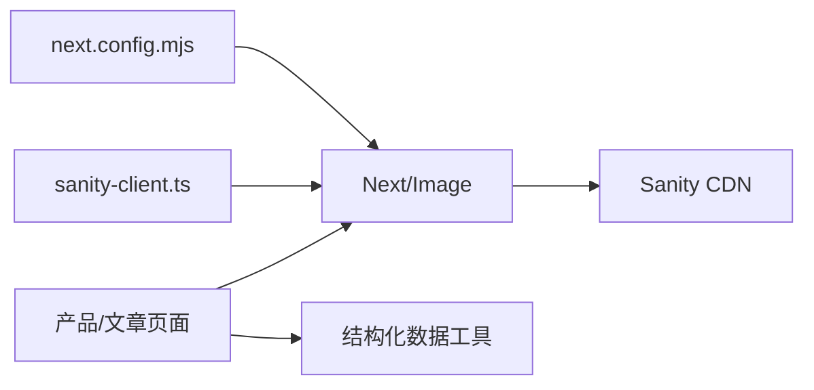

# 图片SEO优化

<cite>
**本文引用的文件**
- [next.config.mjs](file://next.config.mjs)
- [sanity.config.ts](file://sanity\sanity.config.ts)
- [layout.tsx](file://app\[locale]\layout.tsx)
- [product-detail-page.tsx](file://app\[locale]\products\[slug]\page.tsx)
- [news-article-page.tsx](file://app\[locale]\news\[slug]\page.tsx)
- [sanity-client.ts](file://lib\sanity\client.ts)
- [structured-data.ts](file://lib\utils\structured-data.ts)
</cite>

## 目录
1. [简介](#简介)
2. [项目结构](#项目结构)
3. [核心组件](#核心组件)
4. [架构总览](#架构总览)
5. [详细组件分析](#详细组件分析)
6. [依赖关系分析](#依赖关系分析)
7. [性能考量](#性能考量)
8. [故障排查指南](#故障排查指南)
9. [结论](#结论)
10. [附录](#附录)

## 简介
本文件面向GoPro Trade网站的图片SEO优化系统，聚焦以下目标：
- 图片压缩与现代格式支持：WebP、AVIF
- 图片懒加载与缓存策略
- Alt标签的生成与本地化处理
- Sanity CDN集成与图片优化配置
- 响应式图片与多密度适配
- 图片加载性能优化（预加载、缓存、CDN）
- 提供可追溯的实现路径与性能建议

## 项目结构
该网站采用Next.js App Router架构，图片优化主要集中在：
- Next.js配置层：现代图片格式、设备尺寸集、CDN白名单、缓存头
- 页面层：使用Next/Image组件进行响应式与懒加载渲染
- 内容层：Sanity CMS提供图片源，通过Sanity Image URL Builder生成URL
- 结构化数据：为产品与文章页生成Schema.org标记，增强SEO

图表来源
- [next.config.mjs:1-65](file://next.config.mjs#L1-L65)
- [sanity.config.ts:1-33](file://sanity\sanity.config.ts#L1-L33)
- [sanity-client.ts:1-30](file://lib\sanity\client.ts#L1-L30)
- [product-detail-page.tsx:1-443](file://app\[locale]\products\[slug]\page.tsx#L1-L443)
- [news-article-page.tsx:1-372](file://app\[locale]\news\[slug]\page.tsx#L1-L372)

章节来源
- [next.config.mjs:1-65](file://next.config.mjs#L1-L65)
- [sanity.config.ts:1-33](file://sanity\sanity.config.ts#L1-L33)
- [sanity-client.ts:1-30](file://lib\sanity\client.ts#L1-L30)
- [product-detail-page.tsx:1-443](file://app\[locale]\products\[slug]\page.tsx#L1-L443)
- [news-article-page.tsx:1-372](file://app\[locale]\news\[slug]\page.tsx#L1-L372)

## 核心组件
- 现代图片格式与尺寸配置：在Next.js中启用AVIF/WebP，并定义deviceSizes与imageSizes，确保响应式与多密度适配。
- 图片懒加载与优先级：通过Next/Image的lazy属性与priority属性控制首屏与非首屏图片的加载时机。
- Alt标签策略：产品详情页使用产品名称作为alt；文章页使用标题；Portable Text中的图片类型使用value.alt或空字符串。
- Sanity CDN集成：通过Sanity Image URL Builder生成URL，并在Next配置中允许cdn.sanity.io作为远程图片源。
- 缓存与安全头：为图片与字体设置长期缓存头；隐藏Powered-By；统一安全头。

章节来源
- [next.config.mjs:4-17](file://next.config.mjs#L4-L17)
- [next.config.mjs:35-61](file://next.config.mjs#L35-L61)
- [product-detail-page.tsx:268-275](file://app\[locale]\products\[slug]\page.tsx#L268-L275)
- [news-article-page.tsx:250-256](file://app\[locale]\news\[slug]\page.tsx#L250-L256)
- [news-article-page.tsx:276-281](file://app\[locale]\news\[slug]\page.tsx#L276-L281)
- [sanity-client.ts:20-30](file://lib\sanity\client.ts#L20-L30)
- [layout.tsx:15-31](file://app\[locale]\layout.tsx#L15-L31)

## 架构总览
下图展示图片从Sanity到浏览器的关键流程：Sanity Studio上传图片 → Sanity Image URL Builder生成URL → Next.js Image组件按响应式与懒加载策略渲染 → CDN分发与浏览器缓存。

图表来源
- [sanity-client.ts:20-30](file://lib\sanity\client.ts#L20-L30)
- [next.config.mjs:4-17](file://next.config.mjs#L4-L17)
- [product-detail-page.tsx:268-275](file://app\[locale]\products\[slug]\page.tsx#L268-L275)
- [news-article-page.tsx:250-256](file://app\[locale]\news\[slug]\page.tsx#L250-L256)

## 详细组件分析

### 现代图片格式与尺寸策略
- 启用格式：AVIF与WebP，提升Core Web Vitals指标（如LCP）。
- 设备尺寸集：deviceSizes与imageSizes定义了不同视口宽度下的图片尺寸，配合Next/Image的自动srcset生成。
- CDN白名单：仅允许cdn.sanity.io作为远程图片源，确保安全性与可控性。
- 长期缓存：静态图片与字体设置immutable缓存，降低带宽与延迟。

图表来源
- [next.config.mjs:4-17](file://next.config.mjs#L4-L17)
- [next.config.mjs:35-61](file://next.config.mjs#L35-L61)

章节来源
- [next.config.mjs:4-17](file://next.config.mjs#L4-L17)
- [next.config.mjs:35-61](file://next.config.mjs#L35-L61)

### 图片懒加载与优先级
- 首屏图片：通过priority标记，确保关键图片优先加载，改善LCP。
- 非首屏图片：默认懒加载，减少初始渲染压力。
- Intersection Observer：Next/Image内部基于Intersection Observer实现懒加载，无需手动实现。

图表来源
- [product-detail-page.tsx:273-275](file://app\[locale]\products\[slug]\page.tsx#L273-L275)
- [news-article-page.tsx:255](file://app\[locale]\news\[slug]\page.tsx#L255)

章节来源
- [product-detail-page.tsx:268-275](file://app\[locale]\products\[slug]\page.tsx#L268-L275)
- [news-article-page.tsx:250-256](file://app\[locale]\news\[slug]\page.tsx#L250-L256)

### Alt标签生成与本地化
- 产品详情页：使用产品名称作为alt，确保语义清晰且可本地化。
- 文章页：封面图使用文章标题作为alt；文章内容中的图片类型使用value.alt或空字符串。
- 本地化：Alt文本随页面语言切换，保证多语言SEO一致性。

图表来源
- [product-detail-page.tsx:270](file://app\[locale]\products\[slug]\page.tsx#L270)
- [news-article-page.tsx:252](file://app\[locale]\news\[slug]\page.tsx#L252)
- [news-article-page.tsx:278](file://app\[locale]\news\[slug]\page.tsx#L278)

章节来源
- [product-detail-page.tsx:270](file://app\[locale]\products\[slug]\page.tsx#L270)
- [news-article-page.tsx:252](file://app\[locale]\news\[slug]\page.tsx#L252)
- [news-article-page.tsx:278](file://app\[locale]\news\[slug]\page.tsx#L278)

### Sanity CDN集成与图片优化
- 客户端：通过@sanity/client与createImageUrlBuilder生成图片URL。
- 配置：在Next配置中允许cdn.sanity.io作为remotePattern，确保图片可被Next/Image加载。
- 优化：Sanity CDN负责图片裁剪、缩放与格式转换，Next.js负责响应式srcset与懒加载。

图表来源
- [sanity-client.ts:9-29](file://lib\sanity\client.ts#L9-L29)
- [next.config.mjs:11-16](file://next.config.mjs#L11-L16)

章节来源
- [sanity-client.ts:9-29](file://lib\sanity\client.ts#L9-L29)
- [sanity.config.ts:1-33](file://sanity\sanity.config.ts#L1-L33)
- [next.config.mjs:11-16](file://next.config.mjs#L11-L16)

### 响应式图片与多密度适配
- sizes属性：根据视口宽度与布局列数设置，指导浏览器选择合适尺寸。
- 自动srcset：Next/Image基于deviceSizes与imageSizes自动生成srcset，适配高密度屏幕。
- 对象填充：使用object-contain或object-cover确保图片在容器内正确显示。

图表来源
- [product-detail-page.tsx:274](file://app\[locale]\products\[slug]\page.tsx#L274)
- [next.config.mjs:7-8](file://next.config.mjs#L7-L8)

章节来源
- [product-detail-page.tsx:274](file://app\[locale]\products\[slug]\page.tsx#L274)
- [next.config.mjs:7-8](file://next.config.mjs#L7-L8)

### 结构化数据与图片SEO
- 产品页：生成Product与Breadcrumb Schema，提升AI搜索可见性。
- 文章页：生成Article Schema，包含封面图URL，增强社交分享与索引。
- 多语言：结构化数据中的URL与语言字段与页面语言保持一致。

图表来源
- [structured-data.ts:25-99](file://lib\utils\structured-data.ts#L25-L99)
- [structured-data.ts:347-382](file://lib\utils\structured-data.ts#L347-L382)

章节来源
- [structured-data.ts:25-99](file://lib\utils\structured-data.ts#L25-L99)
- [structured-data.ts:347-382](file://lib\utils\structured-data.ts#L347-L382)

## 依赖关系分析
- Next.js配置依赖于Sanity CDN域名白名单，确保图片可被Next/Image加载。
- 页面层依赖Next/Image组件与Sanity Image URL Builder，实现响应式与懒加载。
- 结构化数据工具依赖页面数据，输出JSON-LD以增强SEO。

图表来源
- [next.config.mjs:4-17](file://next.config.mjs#L4-L17)
- [sanity-client.ts:20-30](file://lib\sanity\client.ts#L20-L30)
- [product-detail-page.tsx:268-275](file://app\[locale]\products\[slug]\page.tsx#L268-L275)
- [news-article-page.tsx:250-256](file://app\[locale]\news\[slug]\page.tsx#L250-L256)
- [structured-data.ts:25-99](file://lib\utils\structured-data.ts#L25-L99)

章节来源
- [next.config.mjs:4-17](file://next.config.mjs#L4-L17)
- [sanity-client.ts:20-30](file://lib\sanity\client.ts#L20-L30)
- [product-detail-page.tsx:268-275](file://app\[locale]\products\[slug]\page.tsx#L268-L275)
- [news-article-page.tsx:250-256](file://app\[locale]\news\[slug]\page.tsx#L250-L256)
- [structured-data.ts:25-99](file://lib\utils\structured-data.ts#L25-L99)

## 性能考量
- 现代格式优先：AVIF/WebP在同等质量下体积更小，显著降低首屏加载时间。
- 响应式与多密度：合理设置deviceSizes与imageSizes，避免过大图片导致内存与带宽浪费。
- 懒加载与优先级：首屏使用priority，非首屏懒加载，减少初始渲染负担。
- 长期缓存：静态图片与字体设置immutable缓存，减少重复请求。
- CDN就近分发：Sanity CDN与Next配置共同保障图片分发效率。
- 安全与隐私：隐藏Powered-By，设置X-Content-Type-Options等安全头，提升安全性。

## 故障排查指南
- 图片无法加载
  - 检查Next配置中的remotePatterns是否包含cdn.sanity.io
  - 确认Sanity API Token配置正确（若需要写入权限）
- Alt标签缺失或不正确
  - 产品详情页确认使用产品名称；文章页确认封面图与内容图片的alt来源
- 响应式图片不生效
  - 检查sizes属性与布局断点是否匹配；确认deviceSizes与imageSizes设置合理
- 缓存问题
  - 确认headers中对/images与字体的Cache-Control配置是否生效
  - 如需强制更新，可清理浏览器缓存或调整缓存策略

章节来源
- [next.config.mjs:11-16](file://next.config.mjs#L11-L16)
- [sanity-client.ts:9-15](file://lib\sanity\client.ts#L9-L15)
- [product-detail-page.tsx:270](file://app\[locale]\products\[slug]\page.tsx#L270)
- [news-article-page.tsx:252](file://app\[locale]\news\[slug]\page.tsx#L252)
- [next.config.mjs:35-61](file://next.config.mjs#L35-L61)

## 结论
本项目通过Next.js与Sanity的协同，实现了现代图片格式、响应式与懒加载、Alt标签本地化以及CDN缓存等全方位的图片SEO优化。结合结构化数据与安全头配置，整体提升了页面性能与搜索引擎可见性。后续可在实际部署中持续监控LCP、CLS、TTFB等指标，并根据业务增长迭代图片尺寸集与缓存策略。

## 附录
- 实现路径参考
  - 现代图片格式与尺寸：[next.config.mjs:4-17](file://next.config.mjs#L4-L17)
  - 图片懒加载与优先级：[product-detail-page.tsx:268-275](file://app\[locale]\products\[slug]\page.tsx#L268-L275)、[news-article-page.tsx:250-256](file://app\[locale]\news\[slug]\page.tsx#L250-L256)
  - Alt标签策略：[product-detail-page.tsx:270](file://app\[locale]\products\[slug]\page.tsx#L270)、[news-article-page.tsx:252](file://app\[locale]\news\[slug]\page.tsx#L252)、[news-article-page.tsx:278](file://app\[locale]\news\[slug]\page.tsx#L278)
  - Sanity CDN集成：[sanity-client.ts:20-30](file://lib\sanity\client.ts#L20-L30)、[next.config.mjs:11-16](file://next.config.mjs#L11-L16)
  - 结构化数据：[structured-data.ts:25-99](file://lib\utils\structured-data.ts#L25-L99)、[structured-data.ts:347-382](file://lib\utils\structured-data.ts#L347-L382)