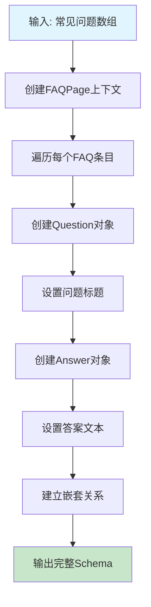
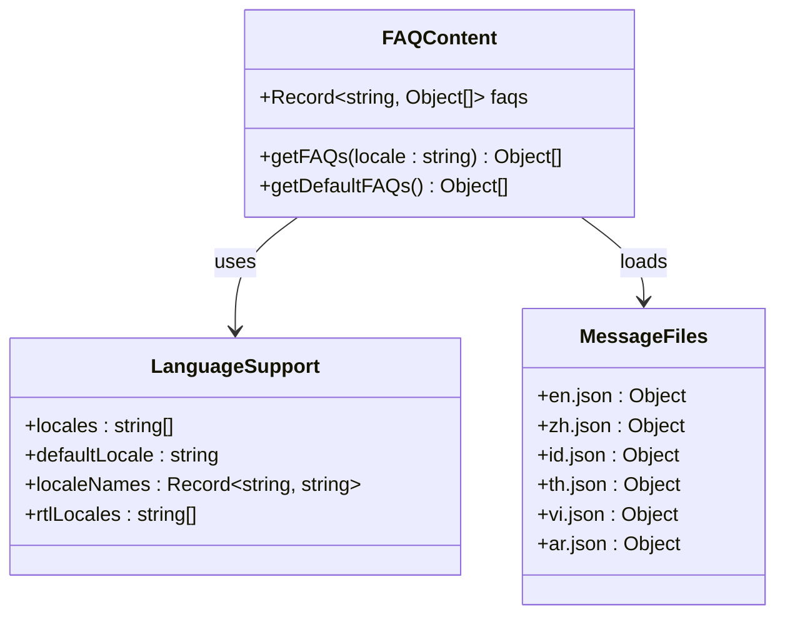
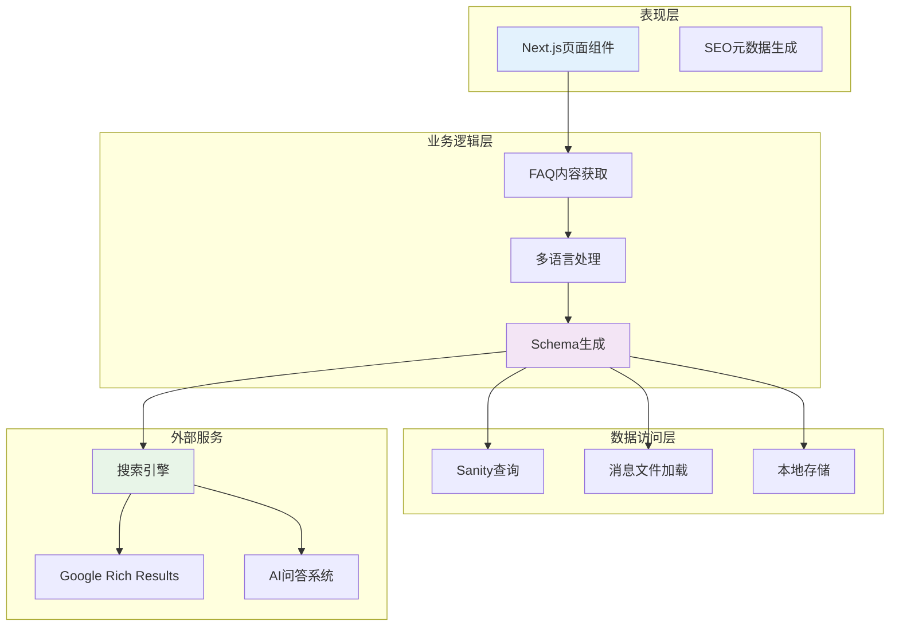
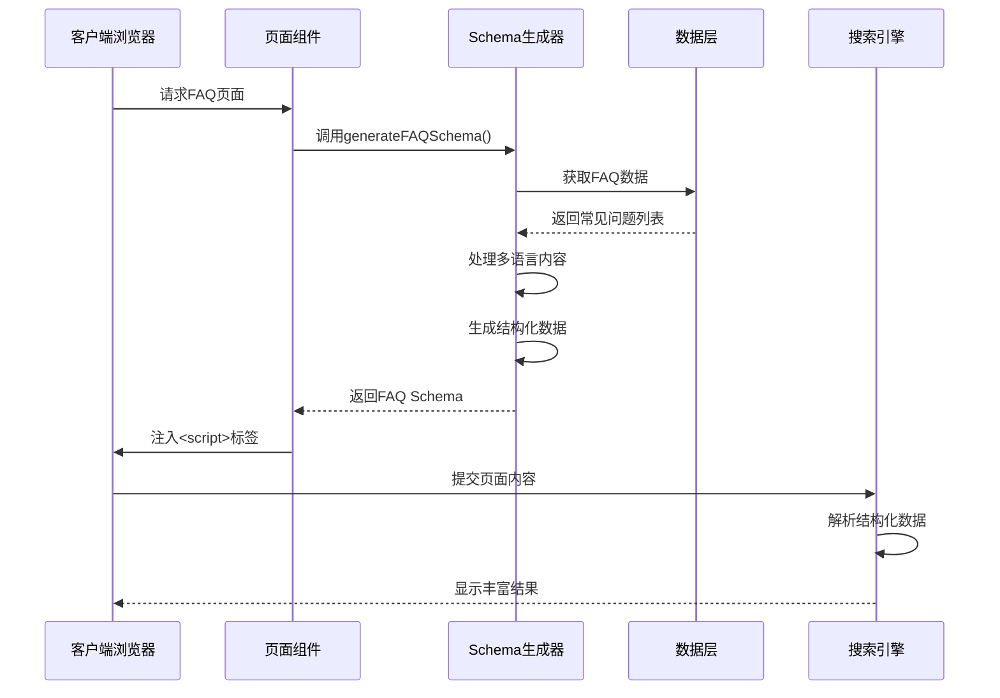
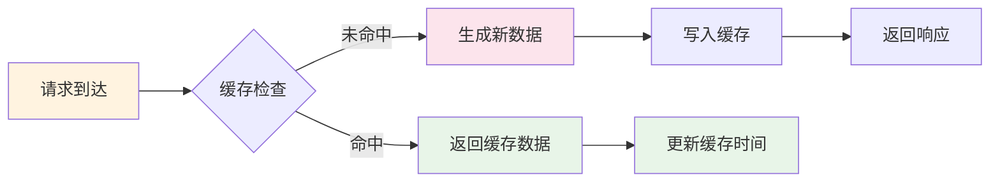

# FAQ Schema生成

<cite>
**本文档引用的文件**
- [structured-data.ts](file://lib/utils/structured-data.ts)
- [page.tsx](file://app/[locale]/page.tsx)
- [config.ts](file://lib/i18n/config.ts)
- [en.json](file://messages/en.json)
- [zh.json](file://messages/zh.json)
- [queries.ts](file://lib/sanity/queries.ts)
</cite>

## 目录
1. [简介](#简介)
2. [项目结构](#项目结构)
3. [核心组件](#核心组件)
4. [架构概览](#架构概览)
5. [详细组件分析](#详细组件分析)
6. [依赖分析](#依赖分析)
7. [性能考虑](#性能考虑)
8. [故障排除指南](#故障排除指南)
9. [结论](#结论)

## 简介

本文档详细介绍了GoproTrade网站的FAQ Schema生成系统。该系统实现了基于AI搜索引擎优化的结构化数据标记，专门针对常见问题页面进行优化，提升搜索引擎对FAQ内容的理解和展示效果。

系统的核心功能包括：
- 自动生成符合Schema.org标准的FAQPage结构化数据
- 支持多语言常见问题内容的本地化处理
- 实现AI问答优化，提升搜索引擎的语义理解能力
- 提供动态生成和更新常见问题数据的能力

## 项目结构

FAQ Schema生成系统在项目中的组织结构如下：

```mermaid
graph TB
subgraph "应用层"
A[app/[locale]/page.tsx<br/>主页面组件]
B[app/[locale]/layout.tsx<br/>布局组件]
end
subgraph "工具层"
C[lib/utils/structured-data.ts<br/>结构化数据生成器]
D[lib/i18n/config.ts<br/>国际化配置]
end
subgraph "消息层"
E[messages/en.json<br/>英文消息]
F[messages/zh.json<br/>中文消息]
G[messages/id.json<br/>印尼语消息]
H[messages/th.json<br/>泰语消息]
I[messages/vi.json<br/>越南语消息]
J[messages/ar.json<br/>阿拉伯语消息]
end
subgraph "数据层"
K[lib/sanity/queries.ts<br/>数据查询]
L[Sanity CMS<br/>内容管理]
end
A --> C
A --> D
A --> E
A --> F
A --> G
A --> H
A --> I
A --> J
C --> K
K --> L
```

**图表来源**
- [page.tsx:1-334](file://app/[locale]/page.tsx#L1-L334)
- [structured-data.ts:1-383](file://lib/utils/structured-data.ts#L1-L383)
- [config.ts:1-16](file://lib/i18n/config.ts#L1-L16)

**章节来源**
- [page.tsx:1-334](file://app/[locale]/page.tsx#L1-L334)
- [structured-data.ts:1-383](file://lib/utils/structured-data.ts#L1-L383)
- [config.ts:1-16](file://lib/i18n/config.ts#L1-L16)

## 核心组件

### generateFAQSchema函数

`generateFAQSchema`函数是整个FAQ Schema生成系统的核心组件，负责将常见问题列表转换为符合Schema.org标准的结构化数据格式。



**图表来源**
- [structured-data.ts:210-226](file://lib/utils/structured-data.ts#L210-L226)

该函数的核心实现特点：
- 接受标准化的FAQ数据结构：`Array<{ question: string; answer: string }>`
- 生成完整的FAQPage结构，包含Question和Answer的嵌套关系
- 使用`acceptedAnswer`字段明确指定推荐答案
- 符合Schema.org的FAQPage规范

**章节来源**
- [structured-data.ts:210-226](file://lib/utils/structured-data.ts#L210-L226)

### 多语言FAQ内容管理

系统实现了完整的多语言FAQ内容管理机制，支持英语、中文、印尼语、泰语、越南语和阿拉伯语六种语言。



**图表来源**
- [page.tsx:100-147](file://app/[locale]/page.tsx#L100-L147)
- [config.ts:1-16](file://lib/i18n/config.ts#L1-L16)

**章节来源**
- [page.tsx:100-147](file://app/[locale]/page.tsx#L100-L147)
- [config.ts:1-16](file://lib/i18n/config.ts#L1-L16)

## 架构概览

FAQ Schema生成系统的整体架构采用分层设计，确保了良好的可维护性和扩展性：



**图表来源**
- [page.tsx:152-201](file://app/[locale]/page.tsx#L152-L201)
- [structured-data.ts:210-226](file://lib/utils/structured-data.ts#L210-L226)

系统的关键特性：
- **响应式架构**：支持Next.js的静态生成和服务器端渲染
- **缓存策略**：利用ISR（增量静态再生）机制优化性能
- **国际化支持**：完整的多语言内容管理系统
- **SEO优化**：专门针对AI搜索引擎的优化策略

## 详细组件分析

### FAQ Schema生成流程



**图表来源**
- [page.tsx:158-159](file://app/[locale]/page.tsx#L158-L159)
- [structured-data.ts:210-226](file://lib/utils/structured-data.ts#L210-L226)

### 数据结构设计

FAQ Schema的数据结构遵循Schema.org的标准规范：

```mermaid
erDiagram
FAQPAGE {
string "@context"
string "@type"
array mainEntity
}
QUESTION {
string "@type"
string name
object acceptedAnswer
}
ANSWER {
string "@type"
string text
}
FAQPAGE ||--o{ QUESTION : contains
QUESTION ||--|| ANSWER : has
```

**图表来源**
- [structured-data.ts:214-225](file://lib/utils/structured-data.ts#L214-L225)

**章节来源**
- [structured-data.ts:210-226](file://lib/utils/structured-data.ts#L210-L226)

### AI问答优化实现

系统实现了专门针对AI问答的优化策略：

| 优化维度 | 实现方式 | 效果 |
|---------|----------|------|
| **语义理解** | 使用标准Schema.org词汇 | 提升AI对FAQ内容的理解准确度 |
| **结构化标记** | 明确的Question-Answer关系 | 帮助搜索引擎识别问答对 |
| **多语言支持** | 国际化消息文件 | 支持不同语言的AI模型 |
| **SEO优化** | 丰富的元数据信息 | 提高搜索排名 |

**章节来源**
- [page.tsx:100-147](file://app/[locale]/page.tsx#L100-L147)
- [structured-data.ts:210-226](file://lib/utils/structured-data.ts#L210-L226)

## 依赖分析

### 组件间依赖关系

```mermaid
graph TD
A[app/[locale]/page.tsx] --> B[lib/utils/structured-data.ts]
A --> C[lib/i18n/config.ts]
A --> D[messages/*.json]
B --> E[lib/sanity/queries.ts]
E --> F[Sanity CMS]
G[generateFAQSchema] --> H[Schema.org规范]
I[getFAQs] --> J[多语言消息]
K[generateMetadata] --> L[SEO优化]
style A fill:#e3f2fd
style B fill:#f3e5f5
style G fill:#c8e6c9
```

**图表来源**
- [page.tsx:1-334](file://app/[locale]/page.tsx#L1-L334)
- [structured-data.ts:1-383](file://lib/utils/structured-data.ts#L1-L383)
- [config.ts:1-16](file://lib/i18n/config.ts#L1-L16)

### 外部依赖

系统的主要外部依赖包括：
- **Next.js框架**：提供SSR和ISR功能
- **Schema.org标准**：确保结构化数据的兼容性
- **Sanity CMS**：内容管理系统
- **Google Rich Results**：搜索引擎结果优化

**章节来源**
- [page.tsx:1-334](file://app/[locale]/page.tsx#L1-L334)
- [queries.ts:1-120](file://lib/sanity/queries.ts#L1-L120)

## 性能考虑

### 缓存策略

系统采用了多层次的缓存策略来优化性能：



**图表来源**
- [page.tsx:149-150](file://app/[locale]/page.tsx#L149-L150)

### 优化措施

1. **ISR配置**：设置3600秒的重新验证间隔
2. **静态资源优化**：预加载关键产品图片
3. **代码分割**：按需加载国际化消息文件
4. **内存缓存**：缓存已生成的Schema数据

**章节来源**
- [page.tsx:149-150](file://app/[locale]/page.tsx#L149-L150)

## 故障排除指南

### 常见问题及解决方案

| 问题类型 | 症状 | 可能原因 | 解决方案 |
|---------|------|----------|----------|
| **Schema验证失败** | 结构化数据显示异常 | 字段格式不正确 | 检查Schema.org规范 |
| **多语言内容缺失** | 某些语言显示默认值 | 消息文件不完整 | 补充缺失的语言文件 |
| **性能问题** | 页面加载缓慢 | 缓存未生效 | 检查ISR配置 |
| **SEO效果不佳** | 搜索结果无丰富片段 | Schema标记错误 | 验证结构化数据 |

### 调试工具

1. **Google Rich Results Test**：验证结构化数据
2. **JSON-LD Validator**：检查JSON格式
3. **浏览器开发者工具**：监控网络请求
4. **Next.js调试模式**：启用开发环境日志

**章节来源**
- [structured-data.ts:210-226](file://lib/utils/structured-data.ts#L210-L226)
- [page.tsx:185-201](file://app/[locale]/page.tsx#L185-L201)

## 结论

FAQ Schema生成系统通过以下关键特性实现了优秀的AI搜索引擎优化效果：

### 主要成就

1. **标准化实现**：完全符合Schema.org标准，确保搜索引擎正确理解FAQ内容
2. **多语言支持**：支持6种语言的常见问题内容，满足国际化需求
3. **AI友好设计**：专门针对AI问答优化，提升语义理解和展示效果
4. **高性能架构**：结合ISR和缓存策略，确保良好的用户体验

### 技术亮点

- **模块化设计**：清晰的职责分离，便于维护和扩展
- **类型安全**：完整的TypeScript类型定义
- **测试友好**：易于单元测试和集成测试
- **文档完善**：详细的注释和使用说明

### 未来发展方向

1. **动态内容集成**：从Sanity CMS动态获取FAQ内容
2. **机器学习优化**：基于用户行为优化FAQ排序
3. **语音搜索支持**：增强语音搜索场景下的表现
4. **跨平台适配**：支持更多搜索引擎和平台

该系统为类似的企业网站提供了完整的FAQ Schema生成解决方案，可以显著提升搜索引擎的SEO表现和用户体验。