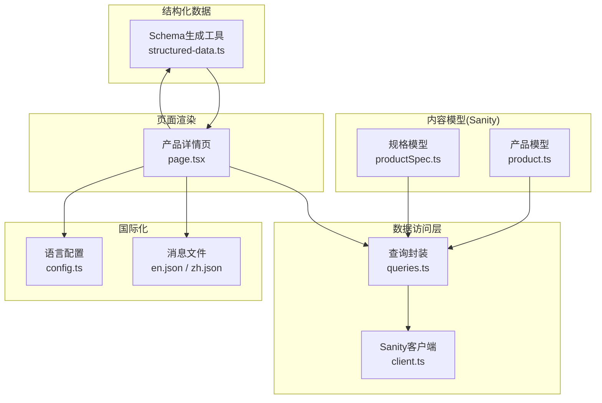
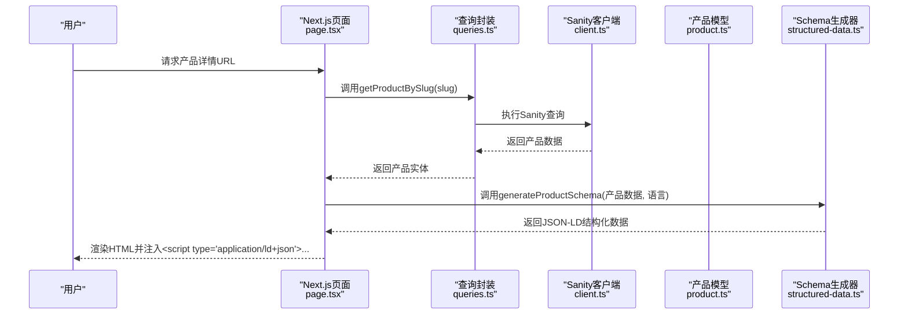
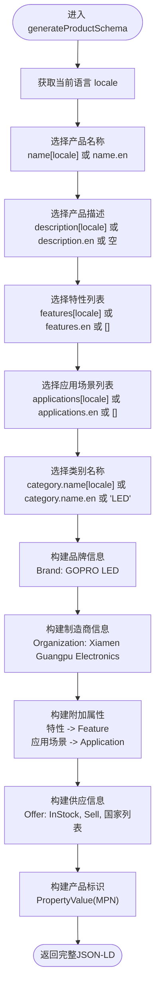
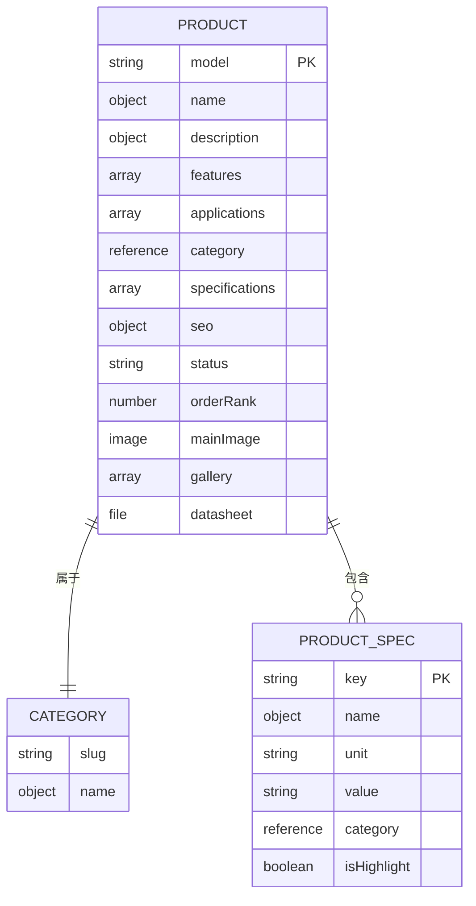
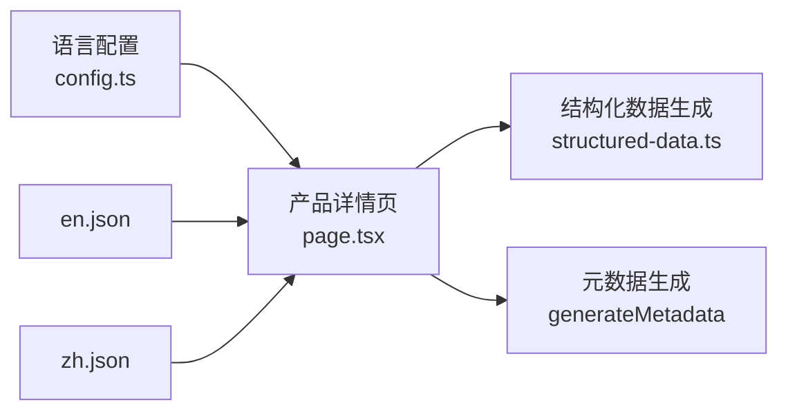
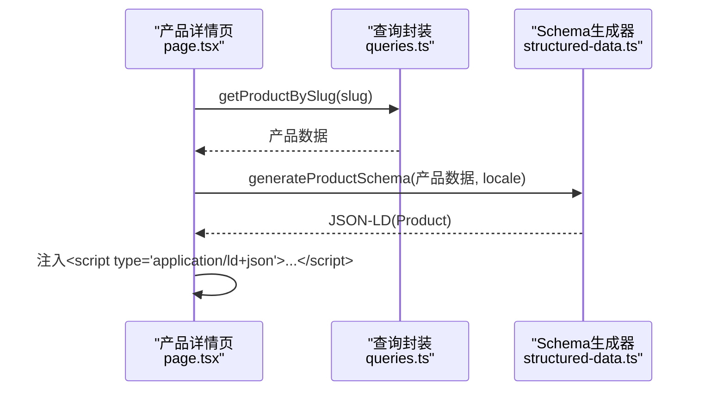
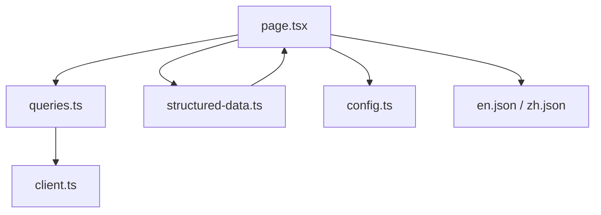

# 产品Schema生成

<cite>
**本文档引用的文件**
- [product.ts](file://sanity/schemas/product.ts)
- [productSpec.ts](file://sanity/schemas/productSpec.ts)
- [structured-data.ts](file://lib/utils/structured-data.ts)
- [queries.ts](file://lib/sanity/queries.ts)
- [client.ts](file://lib/sanity/client.ts)
- [page.tsx](file://app/[locale]/products/[slug]/page.tsx)
- [config.ts](file://lib/i18n/config.ts)
- [en.json](file://messages/en.json)
- [zh.json](file://messages/zh.json)
</cite>

## 目录
1. [简介](#简介)
2. [项目结构](#项目结构)
3. [核心组件](#核心组件)
4. [架构总览](#架构总览)
5. [详细组件分析](#详细组件分析)
6. [依赖关系分析](#依赖关系分析)
7. [性能考虑](#性能考虑)
8. [故障排除指南](#故障排除指南)
9. [结论](#结论)
10. [附录](#附录)

## 简介
本文件面向产品Schema生成系统，深入解析generateProductSchema函数的实现逻辑与数据流，涵盖产品数据结构、品牌与制造商信息、产品规格属性、应用场景标记、供应信息与产品标识生成策略。文档还阐述了AI搜索引擎优化的关键要素（如PropertyValue额外属性、Feature与Application标注、B2B供应信息配置），并说明多语言支持的实现方式（本地化产品名称、描述与特性）。最后提供在产品页面中集成Schema标记的实际示例路径与动态产品数据处理建议。

## 项目结构
该系统由以下关键部分组成：
- 内容模型定义：Sanity内容管理中的产品与规格模型
- 数据查询层：基于Sanity的GraphQL-互补查询封装
- 结构化数据生成：针对Schema.org与AI搜索优化的JSON-LD生成器
- 国际化配置：支持多语言的消息与路由
- 页面渲染：Next.js动态路由页面，注入结构化数据

**图表来源**
- [product.ts:1-233](file://sanity/schemas/product.ts#L1-L233)
- [productSpec.ts:1-58](file://sanity/schemas/productSpec.ts#L1-L58)
- [queries.ts:1-120](file://lib/sanity/queries.ts#L1-L120)
- [client.ts:1-30](file://lib/sanity/client.ts#L1-L30)
- [structured-data.ts:1-383](file://lib/utils/structured-data.ts#L1-L383)
- [config.ts:1-16](file://lib/i18n/config.ts#L1-L16)
- [en.json:1-200](file://messages/en.json#L1-L200)
- [zh.json:1-200](file://messages/zh.json#L1-L200)
- [page.tsx:1-443](file://app/[locale]/products/[slug]/page.tsx#L1-L443)

**章节来源**
- [product.ts:1-233](file://sanity/schemas/product.ts#L1-L233)
- [productSpec.ts:1-58](file://sanity/schemas/productSpec.ts#L1-L58)
- [queries.ts:1-120](file://lib/sanity/queries.ts#L1-L120)
- [client.ts:1-30](file://lib/sanity/client.ts#L1-L30)
- [structured-data.ts:1-383](file://lib/utils/structured-data.ts#L1-L383)
- [config.ts:1-16](file://lib/i18n/config.ts#L1-L16)
- [en.json:1-200](file://messages/en.json#L1-L200)
- [zh.json:1-200](file://messages/zh.json#L1-L200)
- [page.tsx:1-443](file://app/[locale]/products/[slug]/page.tsx#L1-L443)

## 核心组件
- 产品模型（Sanity）：定义产品名称、描述、特性、应用场景、规格、目标市场、SEO设置等字段，均支持多语言对象结构。
- 规格模型（Sanity）：定义规格参数名称、键名、单位、取值及是否高亮等。
- 查询封装（Sanity）：提供获取产品列表、详情、相关产品等查询方法，支持按分类筛选与父子分类继承。
- 结构化数据生成器：提供generateProductSchema等函数，输出符合Schema.org规范的JSON-LD，重点增强AI搜索与B2B供应信息。
- 国际化配置：定义可用语言、默认语言、语言名称映射与RTL语言列表。
- 产品详情页：在Next.js页面中调用查询与Schema生成器，注入结构化数据到页面头部。

**章节来源**
- [product.ts:1-233](file://sanity/schemas/product.ts#L1-L233)
- [productSpec.ts:1-58](file://sanity/schemas/productSpec.ts#L1-L58)
- [queries.ts:1-120](file://lib/sanity/queries.ts#L1-L120)
- [structured-data.ts:1-383](file://lib/utils/structured-data.ts#L1-L383)
- [config.ts:1-16](file://lib/i18n/config.ts#L1-L16)
- [page.tsx:1-443](file://app/[locale]/products/[slug]/page.tsx#L1-L443)

## 架构总览
下图展示了从内容模型到页面渲染与结构化数据注入的整体流程：

**图表来源**
- [page.tsx:60-141](file://app/[locale]/products/[slug]/page.tsx#L60-L141)
- [queries.ts:68-88](file://lib/sanity/queries.ts#L68-L88)
- [client.ts:1-30](file://lib/sanity/client.ts#L1-L30)
- [product.ts:1-233](file://sanity/schemas/product.ts#L1-L233)
- [structured-data.ts:25-99](file://lib/utils/structured-data.ts#L25-L99)

## 详细组件分析

### generateProductSchema函数实现详解
该函数接收标准化的产品数据结构，根据当前语言选择本地化字段，生成符合Schema.org的Product类型JSON-LD。关键要点如下：

- 产品标识与基础信息
  - 名称与SKU：使用产品名称与型号作为name与sku；型号也作为identifier的value（MPN）。
  - 描述：优先使用本地化描述，否则回退至英文或空字符串。
  - 类别：从产品分类名称中选择本地化或英文名称，默认值为“LED”。

- 品牌与制造商信息
  - 品牌：固定为“GOPRO LED”，包含品牌URL。
  - 制造商：组织类型，包含公司全名、成立日期、地址（街道、城市、省份、国家）、公司URL。

- 产品规格属性与应用场景标记
  - 使用additionalProperty数组，将特性与应用场景分别标记为“Feature”和“Application”的PropertyValue，便于AI搜索引擎理解产品能力与适用场景。

- B2B供应信息配置
  - offers：包含可用性（InStock）、业务功能（Sell）、可服务国家列表（东南亚与中东主要国家）、销售方组织信息。
  - 该设计有利于提升在B2B平台与搜索引擎中的可见性与信任度。

- 产品标识
  - identifier：使用PropertyValue，propertyID为“MPN”，value为产品型号，符合行业标准标识实践。

**图表来源**
- [structured-data.ts:25-99](file://lib/utils/structured-data.ts#L25-L99)

**章节来源**
- [structured-data.ts:25-99](file://lib/utils/structured-data.ts#L25-L99)

### 产品数据结构与字段映射
- 产品文档字段（Sanity）
  - 名称与描述：多语言对象，包含中文、英语、印尼语、泰语、越南语、阿拉伯语。
  - 特性与应用场景：多语言数组，用于AI搜索优化与内容展示。
  - 规格：数组引用规格文档，包含参数键名、单位、取值与是否高亮。
  - SEO设置：多语言Meta标题与描述，关键词数组。
  - 目标市场：国家列表枚举，用于B2B区域配置。
  - 状态与排序权重：控制产品状态与前端排序。
  - 图片与文件：主图、图集、数据手册PDF。

- 规格文档字段（Sanity）
  - 参数名称（多语言）、键名（唯一标识）、单位、取值、所属分类、是否高亮。

**图表来源**
- [product.ts:1-233](file://sanity/schemas/product.ts#L1-L233)
- [productSpec.ts:1-58](file://sanity/schemas/productSpec.ts#L1-L58)

**章节来源**
- [product.ts:1-233](file://sanity/schemas/product.ts#L1-L233)
- [productSpec.ts:1-58](file://sanity/schemas/productSpec.ts#L1-L58)

### 多语言支持实现
- 语言配置：定义可用语言数组、默认语言与语言名称映射，支持阿拉伯语等RTL语言。
- 消息文件：各语言的UI文本与SEO文案，用于页面渲染与元数据生成。
- 页面渲染：在产品详情页中按当前语言选择产品名称、描述、类别与应用等字段，确保结构化数据与页面内容一致。
- 多语言SEO：在generateMetadata中生成alternate语言链接，提升搜索引擎对多语言内容的理解。

**图表来源**
- [config.ts:1-16](file://lib/i18n/config.ts#L1-L16)
- [en.json:1-200](file://messages/en.json#L1-L200)
- [zh.json:1-200](file://messages/zh.json#L1-L200)
- [page.tsx:60-141](file://app/[locale]/products/[slug]/page.tsx#L60-L141)
- [structured-data.ts:165-192](file://lib/utils/structured-data.ts#L165-L192)

**章节来源**
- [config.ts:1-16](file://lib/i18n/config.ts#L1-L16)
- [en.json:1-200](file://messages/en.json#L1-L200)
- [zh.json:1-200](file://messages/zh.json#L1-L200)
- [page.tsx:60-141](file://app/[locale]/products/[slug]/page.tsx#L60-L141)
- [structured-data.ts:165-192](file://lib/utils/structured-data.ts#L165-L192)

### 在产品页面中集成Schema标记
- 注入位置：在产品详情页的头部通过<script type="application/ld+json">注入结构化数据。
- 数据来源：先从Sanity查询获取产品详情，再调用generateProductSchema生成JSON-LD。
- 面包屑Schema：同时生成面包屑导航的JSON-LD，提升导航与索引体验。

**图表来源**
- [page.tsx:143-442](file://app/[locale]/products/[slug]/page.tsx#L143-L442)
- [queries.ts:68-88](file://lib/sanity/queries.ts#L68-L88)
- [structured-data.ts:25-99](file://lib/utils/structured-data.ts#L25-L99)

**章节来源**
- [page.tsx:143-442](file://app/[locale]/products/[slug]/page.tsx#L143-L442)
- [queries.ts:68-88](file://lib/sanity/queries.ts#L68-L88)
- [structured-data.ts:25-99](file://lib/utils/structured-data.ts#L25-L99)

### 动态产品数据处理建议
- 预取与缓存：使用Next.js的generateStaticParams与revalidate配置，结合Sanity查询的revalidation策略，平衡新鲜度与性能。
- HTML清理：在渲染前对富文本进行清理，移除无效标签与脚本，提升可读性与SEO质量。
- 多语言回退：在字段缺失时采用en或zh回退策略，确保Schema完整性。
- 规格与特性：优先使用Sanity中的规范数据；若存在数据质量问题，可临时禁用相关展示，待数据修复后再启用。

**章节来源**
- [page.tsx:23-56](file://app/[locale]/products/[slug]/page.tsx#L23-L56)
- [page.tsx:168-192](file://app/[locale]/products/[slug]/page.tsx#L168-L192)
- [page.tsx:209-214](file://app/[locale]/products/[slug]/page.tsx#L209-L214)

## 依赖关系分析
- 组件耦合
  - 产品详情页依赖查询封装与结构化数据生成器，耦合度适中，职责清晰。
  - 结构化数据生成器独立于UI，仅依赖输入的产品数据结构，便于测试与复用。
- 外部依赖
  - Sanity客户端负责与内容源交互，查询封装提供稳定的API接口。
  - 国际化配置与消息文件为多语言提供支撑。

**图表来源**
- [page.tsx:1-443](file://app/[locale]/products/[slug]/page.tsx#L1-L443)
- [queries.ts:1-120](file://lib/sanity/queries.ts#L1-L120)
- [client.ts:1-30](file://lib/sanity/client.ts#L1-L30)
- [structured-data.ts:1-383](file://lib/utils/structured-data.ts#L1-L383)
- [config.ts:1-16](file://lib/i18n/config.ts#L1-L16)
- [en.json:1-200](file://messages/en.json#L1-L200)
- [zh.json:1-200](file://messages/zh.json#L1-L200)

**章节来源**
- [page.tsx:1-443](file://app/[locale]/products/[slug]/page.tsx#L1-L443)
- [queries.ts:1-120](file://lib/sanity/queries.ts#L1-L120)
- [client.ts:1-30](file://lib/sanity/client.ts#L1-L30)
- [structured-data.ts:1-383](file://lib/utils/structured-data.ts#L1-L383)
- [config.ts:1-16](file://lib/i18n/config.ts#L1-L16)
- [en.json:1-200](file://messages/en.json#L1-L200)
- [zh.json:1-200](file://messages/zh.json#L1-L200)

## 性能考虑
- 查询缓存与增量更新：Sanity查询使用next.revalidate配置，合理设置缓存周期以平衡性能与内容新鲜度。
- ISR与静态参数：通过generateStaticParams预渲染高频产品页面，减少运行时查询压力。
- HTML清理：在服务端清理富文本，避免客户端重复处理与渲染抖动。
- 结构化数据生成：保持函数纯函数特性，避免不必要的外部IO，确保在SSR/ISR场景下的稳定性能。

## 故障排除指南
- 产品未找到：当getProductBySlug返回空时，页面返回404，需检查slug与Sanity数据一致性。
- 字段缺失：若本地化字段为空，应按en或zh回退；若仍为空，需在内容管理中补齐。
- Schema生成异常：确认传入的产品数据结构与generateProductSchema期望一致，特别是name、description、features、applications、category、model等字段。
- 多语言链接：检查generateMetadata中alternate语言链接生成逻辑，确保每个语言都有对应URL。

**章节来源**
- [page.tsx:68-70](file://app/[locale]/products/[slug]/page.tsx#L68-L70)
- [queries.ts:68-88](file://lib/sanity/queries.ts#L68-L88)
- [structured-data.ts:25-99](file://lib/utils/structured-data.ts#L25-L99)

## 结论
本系统通过Sanity内容模型与查询封装提供稳定的产品数据源，借助结构化数据生成器输出符合Schema.org与AI搜索优化的JSON-LD，结合多语言配置与页面渲染，实现了高质量的产品Schema生成与集成。generateProductSchema函数在品牌、制造商、规格属性、应用场景、供应信息与产品标识方面提供了全面的标记策略，有助于提升搜索引擎可见性与B2B转化效果。建议持续完善内容质量与数据治理，确保Schema标记的准确性与一致性。

## 附录
- 代码示例路径
  - 产品详情页注入Schema标记：[page.tsx:238-239](file://app/[locale]/products/[slug]/page.tsx#L238-L239)
  - 生成产品Schema调用：[page.tsx:219](file://app/[locale]/products/[slug]/page.tsx#L219)
  - 生成面包屑Schema调用：[page.tsx:220-227](file://app/[locale]/products/[slug]/page.tsx#L220-L227)
  - 产品数据查询：[queries.ts:68-88](file://lib/sanity/queries.ts#L68-L88)
  - 结构化数据生成器：[structured-data.ts:25-99](file://lib/utils/structured-data.ts#L25-L99)