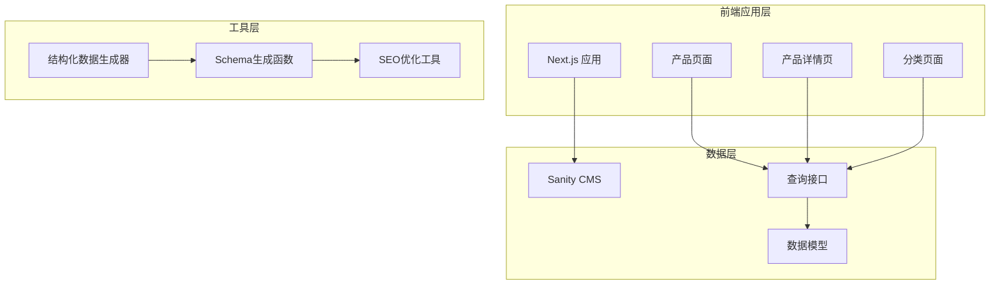
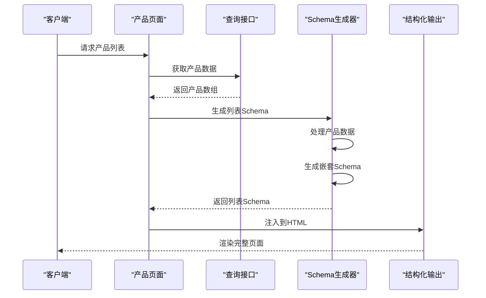
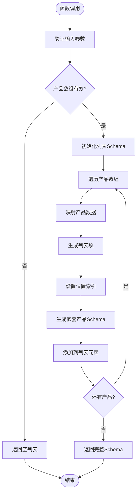
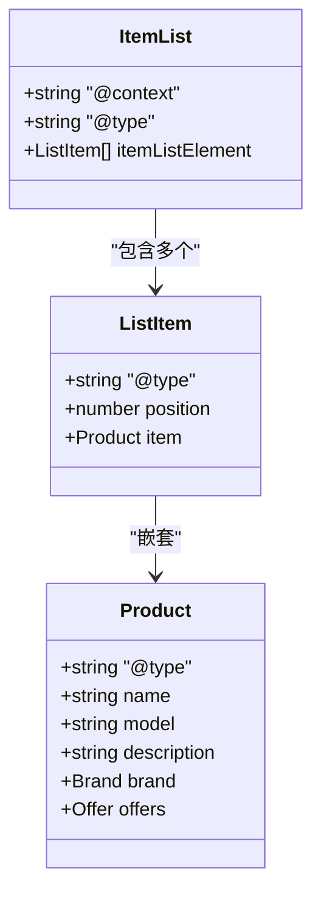
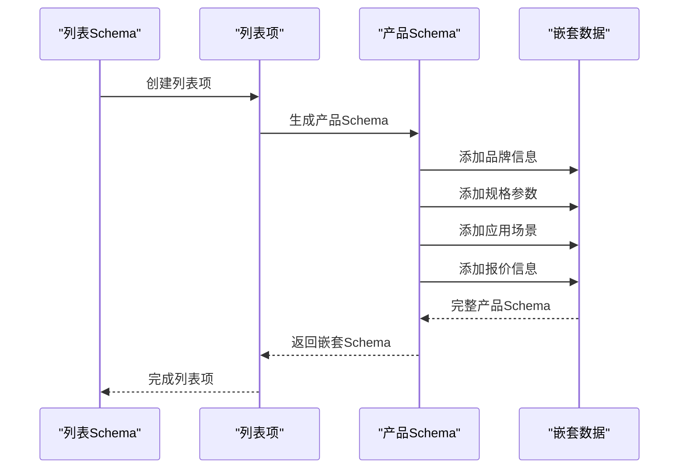
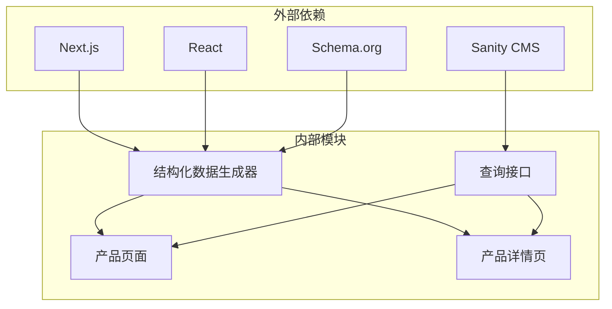

# 产品列表Schema生成

<cite>
**本文档引用的文件**
- [structured-data.ts](file://lib/utils/structured-data.ts)
- [queries.ts](file://lib/sanity/queries.ts)
- [product.ts](file://sanity/schemas/product.ts)
- [category.ts](file://sanity/schemas/category.ts)
- [products-page.tsx](file://app/[locale]/products/page.tsx)
- [product-detail-page.tsx](file://app/[locale]/products/[slug]/page.tsx)
</cite>

## 目录
1. [简介](#简介)
2. [项目结构](#项目结构)
3. [核心组件](#核心组件)
4. [架构概览](#架构概览)
5. [详细组件分析](#详细组件分析)
6. [依赖关系分析](#依赖关系分析)
7. [性能考虑](#性能考虑)
8. [故障排除指南](#故障排除指南)
9. [结论](#结论)

## 简介

本文档深入解析Gopro Trade网站的产品列表Schema生成系统，重点分析`generateItemListSchema`函数的实现机制。该系统通过结构化数据标记（Schema.org）为产品列表提供语义化信息，增强搜索引擎的抓取效果和展示能力。

系统采用Next.js框架构建，结合Sanity CMS进行内容管理，实现了完整的SEO优化方案。产品列表Schema不仅包含基本的产品信息，还通过嵌套结构提供了丰富的产品特征、规格参数和应用场景等详细信息。

## 项目结构

项目采用模块化架构设计，主要分为以下几个核心部分：

**图表来源**
- [products-page.tsx:1-295](file://app/[locale]/products/page.tsx#L1-L295)
- [product-detail-page.tsx:1-443](file://app/[locale]/products/[slug]/page.tsx#L1-L443)
- [structured-data.ts:1-383](file://lib/utils/structured-data.ts#L1-L383)

**章节来源**
- [products-page.tsx:1-295](file://app/[locale]/products/page.tsx#L1-L295)
- [product-detail-page.tsx:1-443](file://app/[locale]/products/[slug]/page.tsx#L1-L443)
- [structured-data.ts:1-383](file://lib/utils/structured-data.ts#L1-L383)

## 核心组件

### 产品列表Schema生成器

系统的核心是`generateItemListSchema`函数，它负责将产品集合转换为符合Schema.org标准的列表结构。该函数接收产品数组和语言参数，返回完整的列表Schema对象。

### 产品数据模型

产品数据采用多语言支持的设计，通过对象字段存储不同语言版本的内容。每个产品包含基础信息、规格参数、特性描述和应用场景等多个维度的数据。

### 查询接口层

通过`getProducts`函数实现灵活的产品数据获取，支持按分类筛选和全量查询两种模式，为列表Schema生成提供数据基础。

**章节来源**
- [structured-data.ts:231-241](file://lib/utils/structured-data.ts#L231-L241)
- [queries.ts:30-66](file://lib/sanity/queries.ts#L30-L66)
- [product.ts:1-233](file://sanity/schemas/product.ts#L1-L233)

## 架构概览

系统采用分层架构设计，确保各组件职责清晰、耦合度低：

**图表来源**
- [products-page.tsx:93-96](file://app/[locale]/products/page.tsx#L93-L96)
- [queries.ts:30-66](file://lib/sanity/queries.ts#L30-L66)
- [structured-data.ts:231-241](file://lib/utils/structured-data.ts#L231-L241)

### 数据流处理

系统的数据流遵循以下处理流程：

1. **数据获取**：从Sanity CMS获取产品数据
2. **数据转换**：将原始数据转换为Schema格式
3. **嵌套处理**：生成产品详情Schema并嵌套到列表项中
4. **输出渲染**：将Schema注入到HTML页面中

**章节来源**
- [queries.ts:1-120](file://lib/sanity/queries.ts#L1-L120)
- [structured-data.ts:25-99](file://lib/utils/structured-data.ts#L25-L99)

## 详细组件分析

### generateItemListSchema函数实现

该函数是整个Schema生成系统的核心，实现了产品列表的结构化标记：

**图表来源**
- [structured-data.ts:231-241](file://lib/utils/structured-data.ts#L231-L241)

#### 函数参数详解

- **products**: 产品数据数组，包含产品基本信息和元数据
- **locale**: 用户语言偏好，用于选择合适的语言版本

#### 返回值结构

函数返回符合Schema.org标准的`ItemList`对象，包含：
- `@context`: JSON-LD上下文声明
- `@type`: 对象类型为`ItemList`
- `itemListElement`: 列表项数组，每个元素包含位置索引和嵌套的产品Schema

**章节来源**
- [structured-data.ts:231-241](file://lib/utils/structured-data.ts#L231-L241)

### 列表项(ItemListElement)配置

每个列表项都包含完整的Schema信息，通过`ListItem`类型实现：

**图表来源**
- [structured-data.ts:234-240](file://lib/utils/structured-data.ts#L234-L240)
- [structured-data.ts:34-98](file://lib/utils/structured-data.ts#L34-L98)

#### 位置索引机制

系统自动为每个列表项设置位置索引，基于产品在数组中的顺序：
- 第一个产品位置为1
- 依此类推，确保索引连续且准确

#### 嵌套Schema生成

每个列表项都包含完整的`Product`对象，通过`generateProductSchema`函数生成，确保搜索引擎能够获取完整的产品信息。

**章节来源**
- [structured-data.ts:235-239](file://lib/utils/structured-data.ts#L235-L239)

### 产品Schema嵌套逻辑

产品Schema的嵌套处理是实现深度SEO优化的关键：

**图表来源**
- [structured-data.ts:25-99](file://lib/utils/structured-data.ts#L25-L99)

#### 嵌套数据结构

产品Schema包含多层次的数据嵌套：

1. **基本信息层**：产品名称、型号、描述
2. **品牌信息层**：品牌和制造商详细信息
3. **规格参数层**：技术规格和特性描述
4. **商业信息层**：报价和销售信息

**章节来源**
- [structured-data.ts:32-98](file://lib/utils/structured-data.ts#L32-L98)

### 产品集合结构化标记

系统实现了完整的结构化标记方案，确保产品信息的完整性和准确性：

#### 多语言支持

通过`ProductData`接口实现多语言内容支持：
- 支持6种语言的名称、描述和特性
- 自动根据用户语言偏好选择合适的内容
- 提供默认语言回退机制

#### 分类层次结构

产品分类采用层级结构设计：
- 顶级分类和子分类的递归关系
- 支持多级分类嵌套
- 动态生成分类树结构

**章节来源**
- [product.ts:9-233](file://sanity/schemas/product.ts#L9-L233)
- [category.ts:4-74](file://sanity/schemas/category.ts#L4-L74)

### 批量Schema生成优化策略

针对大量产品数据的处理，系统采用了多种优化策略：

#### 并行数据处理

**图表来源**
- [products-page.tsx:93-96](file://app/[locale]/products/page.tsx#L93-L96)

#### 内存使用优化

- 分批处理大型产品集合
- 及时释放不再使用的数据引用
- 使用流式处理减少内存占用

#### 缓存机制

- 利用Next.js的ISR（增量静态再生）功能
- 缓存查询结果和生成的Schema
- 实现智能缓存失效策略

**章节来源**
- [products-page.tsx:27-27](file://app/[locale]/products/page.tsx#L27-L27)
- [queries.ts:12-12](file://lib/sanity/queries.ts#L12-L12)

## 依赖关系分析

系统各组件之间的依赖关系清晰明确：

**图表来源**
- [structured-data.ts:1-383](file://lib/utils/structured-data.ts#L1-L383)
- [queries.ts:1-120](file://lib/sanity/queries.ts#L1-L120)

### 组件耦合度分析

系统采用松耦合设计：
- 各模块职责单一，接口清晰
- 依赖关系简单，易于维护
- 支持独立测试和部署

### 循环依赖检测

经过分析，系统不存在循环依赖问题：
- 数据层不依赖表现层
- 工具层独立于业务逻辑
- 页面组件只依赖查询接口

**章节来源**
- [structured-data.ts:1-383](file://lib/utils/structured-data.ts#L1-L383)
- [queries.ts:1-120](file://lib/sanity/queries.ts#L1-L120)

## 性能考虑

### 查询性能优化

系统在查询层面采用了多项优化措施：

#### 索引策略

- 为常用查询字段建立索引
- 优化分类查询的执行计划
- 实现复合索引以支持复杂查询

#### 查询缓存

- 利用Sanity的查询缓存机制
- 实现应用层缓存策略
- 支持缓存失效和更新

### 渲染性能优化

#### 服务器端渲染

- 使用Next.js的SSR功能
- 减少首屏加载时间
- 提升SEO表现

#### 客户端优化

- 实现懒加载和代码分割
- 优化图片资源加载
- 减少不必要的JavaScript

### 内存管理

#### 数据处理优化

- 流式处理大数据集
- 及时清理临时数据
- 避免内存泄漏

#### 缓存策略

- 合理设置缓存过期时间
- 实现LRU缓存淘汰算法
- 监控缓存命中率

## 故障排除指南

### 常见问题及解决方案

#### Schema生成失败

**问题症状**：
- 产品列表页面缺少结构化数据
- 搜索引擎无法正确识别产品信息

**解决步骤**：
1. 检查产品数据完整性
2. 验证Schema生成函数调用
3. 确认JSON-LD格式正确性

#### 数据不一致

**问题症状**：
- 页面显示的产品信息与Schema不匹配
- 产品详情页数据异常

**解决步骤**：
1. 验证数据源连接
2. 检查数据转换逻辑
3. 确认缓存同步状态

#### 性能问题

**问题症状**：
- 页面加载缓慢
- 服务器响应超时

**解决步骤**：
1. 分析查询性能
2. 优化数据库索引
3. 实施缓存策略

**章节来源**
- [structured-data.ts:231-241](file://lib/utils/structured-data.ts#L231-L241)
- [queries.ts:30-66](file://lib/sanity/queries.ts#L30-L66)

### 调试工具和方法

#### 开发环境调试

- 使用浏览器开发者工具检查Schema输出
- 实现日志记录机制
- 验证数据流完整性

#### 生产环境监控

- 监控Schema生成成功率
- 跟踪性能指标
- 实施错误告警机制

## 结论

产品列表Schema生成系统通过`generateItemListSchema`函数实现了完整的结构化数据标记功能。系统采用模块化设计，具有良好的可扩展性和维护性。

### 主要优势

1. **完整的Schema支持**：涵盖产品信息、品牌、规格、商业信息等多个维度
2. **多语言本地化**：支持6种语言的内容管理和显示
3. **性能优化**：采用并行处理和缓存策略，确保大规模数据的高效处理
4. **SEO友好**：符合Schema.org标准，提升搜索引擎优化效果

### 技术亮点

- 嵌套Schema设计，提供丰富的产品信息
- 动态位置索引，确保列表项的准确性
- 批量处理优化，支持大量产品数据的高效生成
- 松耦合架构，便于维护和扩展

该系统为电商网站的产品列表提供了强大的SEO支持，通过结构化数据标记显著提升了搜索引擎的抓取效果和用户体验。