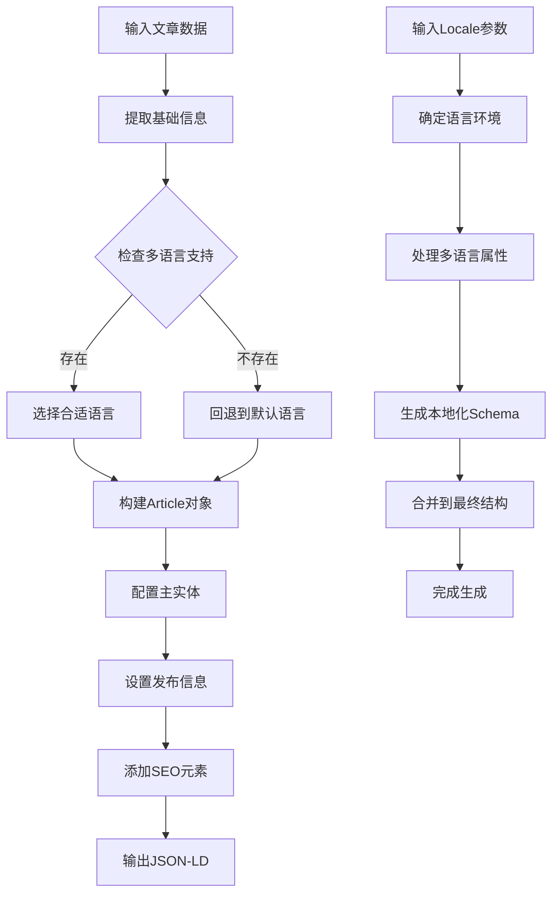
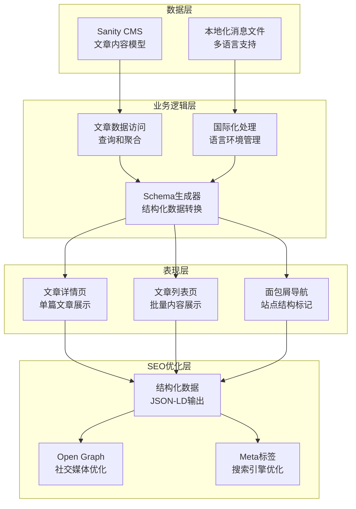
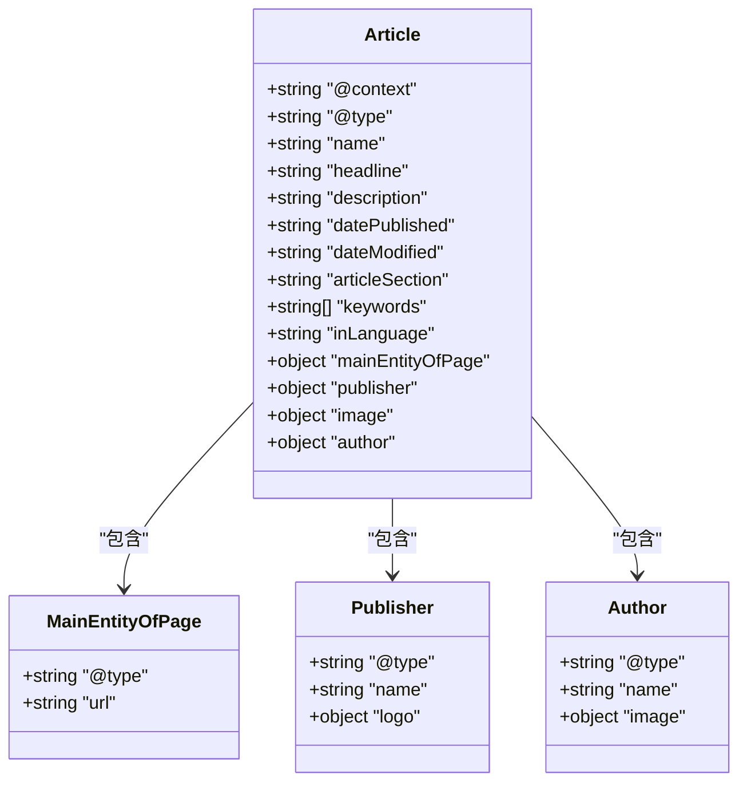

# 文章Schema生成

<cite>
**本文档引用的文件**
- [article.ts](file://sanity/schemas/article.ts)
- [index.ts](file://sanity/schemas/index.ts)
- [page.tsx](file://app/[locale]/news/[slug]/page.tsx)
- [page.tsx](file://app/[locale]/news/page.tsx)
- [structured-data.ts](file://lib/utils/structured-data.ts)
- [client.ts](file://lib/sanity/client.ts)
- [articles.ts](file://lib/sanity/articles.ts)
- [config.ts](file://lib/i18n/config.ts)
- [en.json](file://messages/en.json)
- [zh.json](file://messages/zh.json)
- [id.json](file://messages/id.json)
- [th.json](file://messages/th.json)
- [vi.json](file://messages/vi.json)
- [ar.json](file://messages/ar.json)
</cite>

## 目录
1. [简介](#简介)
2. [项目结构](#项目结构)
3. [核心组件](#核心组件)
4. [架构概览](#架构概览)
5. [详细组件分析](#详细组件分析)
6. [依赖关系分析](#依赖关系分析)
7. [性能考虑](#性能考虑)
8. [故障排除指南](#故障排除指南)
9. [结论](#结论)

## 简介

本文档深入解析了GoproTrade网站的文章Schema生成系统，重点分析了`generateArticleSchema`函数的实现机制。该系统基于Sanity内容管理平台构建，支持多语言文章内容管理，包含文章标题、摘要、封面图片、作者信息、发布时间和关键词等完整Schema结构。

系统采用现代化的Next.js应用架构，结合结构化数据（Structured Data）和SEO优化策略，为新闻资讯页面提供了完整的Schema标记解决方案。通过多语言支持和动态内容管理，确保了全球用户的访问体验和搜索引擎的友好性。

## 项目结构

文章Schema生成系统由多个层次组成，从内容模型定义到前端渲染，再到结构化数据生成，形成了完整的数据流架构：

```mermaid
graph TB
subgraph "内容管理层"
A[sanity/schemas/article.ts<br/>文章内容模型]
B[sanity/schemas/index.ts<br/>Schema类型注册]
end
subgraph "数据访问层"
C[lib/sanity/articles.ts<br/>文章数据查询]
D[lib/sanity/client.ts<br/>Sanity客户端]
end
subgraph "应用层"
E[app/[locale]/news/[slug]/page.tsx<br/>文章详情页]
F[app/[locale]/news/page.tsx<br/>文章列表页]
end
subgraph "工具层"
G[lib/utils/structured-data.ts<br/>Schema生成工具]
H[lib/i18n/config.ts<br/>国际化配置]
end
subgraph "本地化资源"
I[messages/*.json<br/>多语言消息文件]
end
A --> C
B --> A
C --> D
E --> G
F --> G
E --> H
F --> H
G --> I
```

**图表来源**
- [article.ts:1-265](file://sanity/schemas/article.ts#L1-L265)
- [index.ts:1-9](file://sanity/schemas/index.ts#L1-L9)
- [page.tsx:1-372](file://app/[locale]/news/[slug]/page.tsx#L1-L372)
- [page.tsx:1-279](file://app/[locale]/news/page.tsx#L1-L279)

**章节来源**
- [article.ts:1-265](file://sanity/schemas/article.ts#L1-L265)
- [index.ts:1-9](file://sanity/schemas/index.ts#L1-L9)

## 核心组件

### 文章内容模型（Article Schema）

文章内容模型是整个Schema生成系统的核心，定义了完整的文章数据结构和验证规则。该模型支持6种语言（中文、英语、印尼语、泰语、越南语、阿拉伯语），确保全球化内容管理需求。

#### 主要字段结构

文章模型包含以下核心字段类别：

**基础信息字段**
- `title`: 多语言文章标题，包含6种语言支持
- `slug`: URL友好标识符，基于中文标题自动生成
- `category`: 文章分类引用，关联到文章分类模型
- `tags`: SEO关键词标签数组

**内容字段**
- `excerpt`: 多语言文章摘要，用于列表展示和Meta描述
- `content`: 多语言文章正文内容，支持块级内容和图片
- `coverImage`: 封面图片，用于列表展示和Open Graph分享

**元数据字段**
- `author`: 作者信息对象，包含姓名和头像
- `publishedAt`: 发布时间，包含初始值和验证规则
- `status`: 发布状态，支持已发布、草稿、定时发布三种状态

**SEO配置字段**
- `seo`: 完整的SEO设置对象，包含Meta标题、Meta描述和关键词
- `viewCount`: 阅读次数统计，初始值为0且只读
- `isFeatured`: 推荐文章标记，用于首页展示

**章节来源**
- [article.ts:8-247](file://sanity/schemas/article.ts#L8-L247)

### 结构化数据生成器

结构化数据生成器负责将Sanity中的文章数据转换为Google Rich Results友好的JSON-LD格式。该生成器实现了完整的Article Schema结构，包括主实体配置、多语言标题处理和SEO优化元素。

#### 生成流程



**图表来源**
- [structured-data.ts](file://lib/utils/structured-data.ts)

**章节来源**
- [structured-data.ts](file://lib/utils/structured-data.ts)

## 架构概览

文章Schema生成系统采用分层架构设计，确保了数据的一致性和可维护性：



**图表来源**
- [page.tsx:146-155](file://app/[locale]/news/[slug]/page.tsx#L146-L155)
- [page.tsx:1-279](file://app/[locale]/news/page.tsx#L1-L279)

## 详细组件分析

### generateArticleSchema 函数实现

`generateArticleSchema`函数是文章Schema生成系统的核心组件，负责将Sanity中的文章数据转换为标准的Article Schema格式。

#### 函数签名和参数

函数接收两个主要参数：
- `article`: 完整的文章数据对象，包含所有字段信息
- `locale`: 当前语言环境代码，用于多语言内容处理

#### 数据提取和验证

函数首先对输入数据进行验证，确保必需字段的存在性和完整性。然后提取以下关键信息：

**基础信息提取**
- 文章标题：优先使用SEO配置的标题，否则使用文章标题，最后回退到中文标题
- 文章摘要：按相同优先级顺序提取摘要内容
- 封面图片：处理图片URL和尺寸信息
- 发布时间：格式化ISO日期字符串
- 作者信息：提取作者姓名和头像

**章节来源**
- [page.tsx:146-147](file://app/[locale]/news/[slug]/page.tsx#L146-L147)

#### Article类型数据结构

生成的Article Schema遵循Schema.org标准，包含以下核心属性：



**图表来源**
- [structured-data.ts](file://lib/utils/structured-data.ts)

#### 主实体配置（mainEntityOfPage）

主实体配置确保了文章在网页中的正确识别和索引。该配置包含：

**URL映射**
- 使用当前文章的完整URL路径
- 支持多语言版本的URL结构
- 包含协议和域名信息

**类型标识**
- 设置为WebPage类型，符合Article Schema的标准
- 确保搜索引擎正确理解页面内容

**章节来源**
- [structured-data.ts](file://lib/utils/structured-data.ts)

#### 多语言标题处理

系统实现了智能的多语言标题处理机制，确保不同语言环境下显示正确的标题：

**优先级处理**
1. SEO配置的标题（最高优先级）
2. 文章标题的当前语言版本
3. 中文标题（默认回退）
4. 英语标题（备用回退）

**语言环境检测**
- 自动检测浏览器或用户偏好的语言设置
- 动态加载对应语言的消息文件
- 实现无缝的语言切换体验

**章节来源**
- [page.tsx:76-77](file://app/[locale]/news/[slug]/page.tsx#L76-L77)

### 文章分类和关键词配置

#### 文章分类（articleSection）

文章分类功能通过`category`字段实现，支持以下特性：

**分类层次**
- 单层分类结构，简化内容组织
- 支持多语言分类名称
- 动态分类过滤和搜索

**SEO优化**
- 自动生成分类相关的Meta信息
- 支持分类页面的独立SEO配置
- 提供分类间的内部链接结构

#### 关键词和标签（keywords）

系统提供了双重关键词配置机制：

**标签系统**
- 基于`tags`字段的简单标签数组
- 用于SEO的关键词标签
- 支持多语言关键词管理

**SEO关键词**
- `seo.keywords`提供更精细的控制
- 支持多语言关键词配置
- 与搜索引擎优化策略集成

**章节来源**
- [article.ts:43-50](file://sanity/schemas/article.ts#L43-L50)
- [article.ts:220-227](file://sanity/schemas/article.ts#L220-L227)

### 语言设置（inLanguage）

语言设置功能确保了内容的正确语言标识，支持以下特性：

**多语言支持**
- 六种语言的完整支持（中文、英语、印尼语、泰语、越南语、阿拉伯语）
- 动态语言切换和内容渲染
- 国际化消息文件的自动加载

**语言环境管理**
- 基于URL的路由语言识别
- 浏览器语言偏好检测
- 语言回退机制

**章节来源**
- [config.ts](file://lib/i18n/config.ts)
- [page.tsx:17-28](file://app/[locale]/news/[slug]/page.tsx#L17-L28)

## 依赖关系分析

文章Schema生成系统的依赖关系体现了清晰的分层架构：

```mermaid
graph TD
A[app/[locale]/news/[slug]/page.tsx] --> B[lib/utils/structured-data.ts]
A --> C[lib/sanity/articles.ts]
A --> D[lib/sanity/client.ts]
A --> E[lib/i18n/config.ts]
A --> F[messages/*.json]
B --> G[sanity/schemas/article.ts]
C --> G
D --> H[Sanity CMS API]
I[app/[locale]/news/page.tsx] --> B
I --> C
I --> E
I --> F
J[sanity/schemas/index.ts] --> G
```

**图表来源**
- [page.tsx:1-16](file://app/[locale]/news/[slug]/page.tsx#L1-L16)
- [page.tsx:1-10](file://app/[locale]/news/page.tsx#L1-L10)
- [index.ts:1-9](file://sanity/schemas/index.ts#L1-L9)

**章节来源**
- [page.tsx:1-16](file://app/[locale]/news/[slug]/page.tsx#L1-L16)
- [page.tsx:1-10](file://app/[locale]/news/page.tsx#L1-L10)
- [index.ts:1-9](file://sanity/schemas/index.ts#L1-L9)

## 性能考虑

### 缓存策略

系统实现了多层次的缓存机制以优化性能：

**静态生成缓存**
- 使用Next.js的静态生成功能
- revalidate配置确保内容更新的及时性
- 缓存失效和重新验证机制

**数据访问优化**
- 批量数据查询减少API调用
- 智能的数据库索引使用
- 查询结果的内存缓存

### 渲染性能

**客户端渲染优化**
- 懒加载图片和组件
- 代码分割和按需加载
- 优化的字体和资源加载

**服务器端渲染**
- 预渲染静态内容
- 动态内容的异步加载
- 结构化数据的预生成

## 故障排除指南

### 常见问题和解决方案

**Schema生成错误**
- 检查文章数据的完整性
- 验证必需字段的存在性
- 确认多语言数据的正确性

**SEO优化问题**
- 验证Meta标签的生成
- 检查Open Graph属性的设置
- 确认结构化数据的有效性

**国际化问题**
- 验证语言文件的完整性
- 检查语言切换功能
- 确认多语言内容的正确显示

**章节来源**
- [page.tsx:132-134](file://app/[locale]/news/[slug]/page.tsx#L132-L134)
- [page.tsx:80-82](file://app/[locale]/news/page.tsx#L80-L82)

## 结论

文章Schema生成系统通过精心设计的架构和实现，为新闻资讯页面提供了完整的SEO优化解决方案。系统的核心优势包括：

**全面的Schema支持**
- 完整的Article Schema实现
- 多语言内容的智能处理
- 结构化数据的标准化输出

**灵活的内容管理**
- 基于Sanity的现代化内容管理
- 支持多语言的全球化内容
- 灵活的分类和标签系统

**优秀的用户体验**
- 响应式的设计和布局
- 优化的性能和加载速度
- 无障碍访问的支持

该系统为类似的企业网站提供了可扩展的Schema生成解决方案，可以根据具体需求进行定制和扩展。通过持续的优化和改进，系统将继续为用户提供优质的SEO体验和内容管理能力。