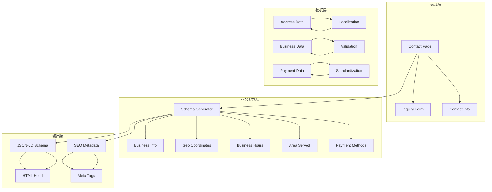
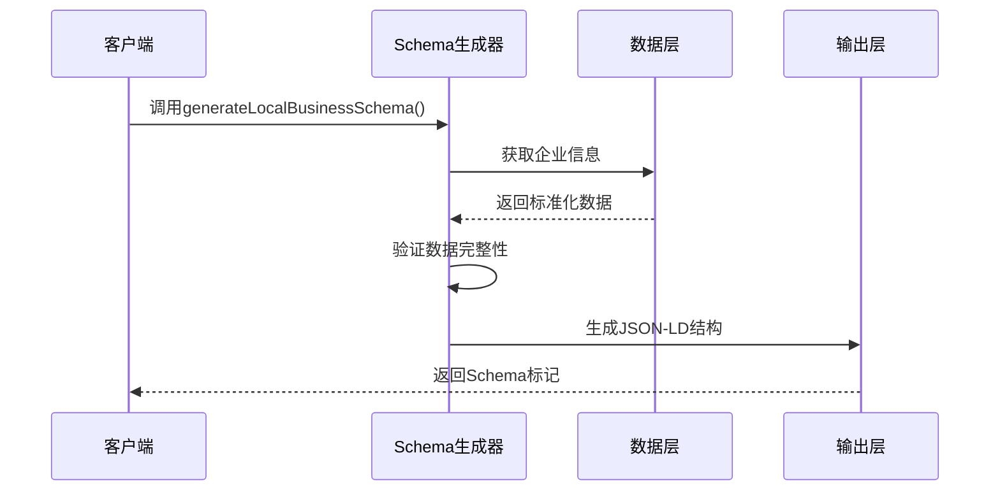
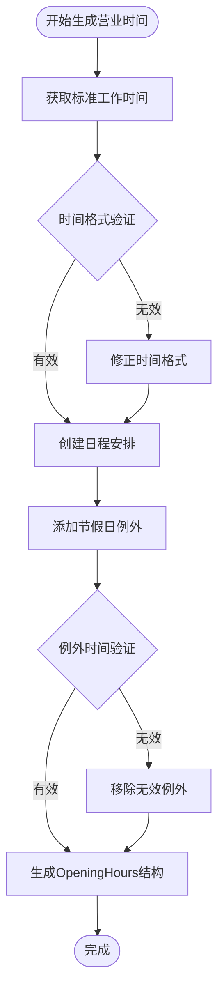
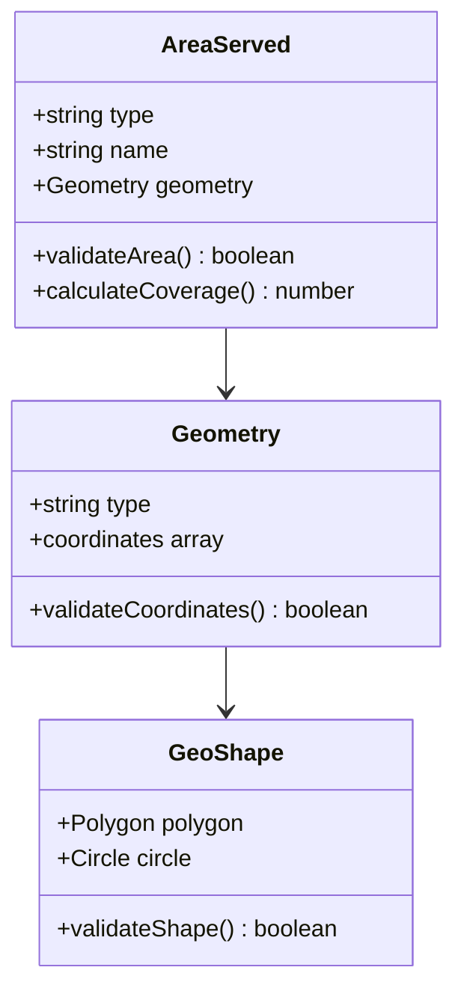
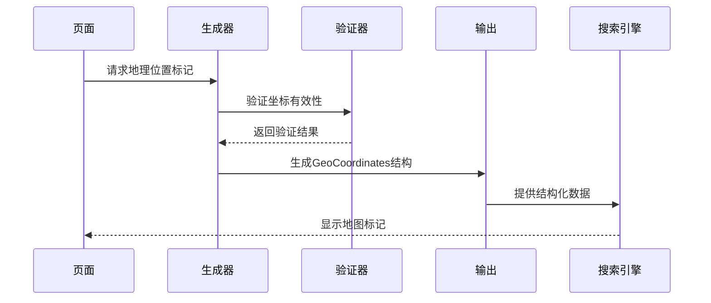
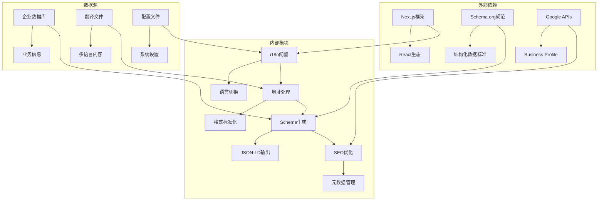

# 本地业务Schema生成

<cite>
**本文档引用的文件**
- [app/[locale]/layout.tsx](file://app/[locale]/layout.tsx)
- [app/[locale]/contact/page.tsx](file://app/[locale]/contact/page.tsx)
- [messages/en.json](file://messages/en.json)
- [lib/i18n/config.ts](file://lib/i18n/config.ts)
- [components/layout/navbar.tsx](file://components/layout/navbar.tsx)
- [components/layout/footer.tsx](file://components/layout/footer.tsx)
</cite>

## 目录
1. [简介](#简介)
2. [项目结构](#项目结构)
3. [核心组件](#核心组件)
4. [架构概览](#架构概览)
5. [详细组件分析](#详细组件分析)
6. [依赖关系分析](#依赖关系分析)
7. [性能考虑](#性能考虑)
8. [故障排除指南](#故障排除指南)
9. [结论](#结论)
10. [附录](#附录)

## 简介

本文件详细阐述了本地业务Schema生成系统的实现方案，重点围绕generateLocalBusinessSchema函数的设计与实现。该系统旨在为本地企业页面提供完整的Schema.org结构化数据标记，包括企业基本信息、营业时间、地理坐标、服务覆盖区域以及支付方式等关键要素。同时，文档深入解释了本地SEO优化的核心要素，涵盖Google Business Profile兼容性、地理位置标记(GeoCoordinates)、服务覆盖区域(areaServed)以及商业条款(priceRange、paymentAccepted、currenciesAccepted)的配置策略。

系统采用多语言支持架构，通过国际化配置实现不同语言环境下的地址标准化处理，并提供在企业页面中集成本地业务Schema标记的具体方法，以优化本地搜索结果的显示效果。

## 项目结构

该项目采用Next.js框架构建，具有清晰的目录组织结构：

```mermaid
graph TB
subgraph "应用层"
A[app/[locale]/] --> B[页面组件]
A --> C[布局组件]
D[components/] --> E[UI组件]
F[messages/] --> G[多语言资源]
end
subgraph "配置层"
H[lib/i18n/] --> I[国际化配置]
J[sanity/] --> K[内容管理]
L[scripts/] --> M[自动化脚本]
end
subgraph "公共资源"
N[public/] --> O[静态资源]
P[components/analytics/] --> Q[分析工具]
end
A --> H
E --> H
G --> H
```

**图表来源**
- [app/[locale]/layout.tsx:1-71](file://app/[locale]/layout.tsx#L1-L71)
- [lib/i18n/config.ts:1-16](file://lib/i18n/config.ts#L1-L16)

**章节来源**
- [app/[locale]/layout.tsx:1-71](file://app/[locale]/layout.tsx#L1-L71)
- [lib/i18n/config.ts:1-16](file://lib/i18n/config.ts#L1-L16)

## 核心组件

### 多语言国际化系统

系统实现了完整的多语言支持，支持英语(en)、中文(zh)、印尼语(id)、泰语(th)、越南语(vi)和阿拉伯语(ar)六种语言。国际化配置通过专门的模块进行管理，确保地址信息和其他文本内容能够根据用户语言偏好自动切换。

### 地址标准化处理

地址信息采用标准化处理机制，针对中文用户显示中文地址格式，其他语言用户则显示英文地址格式。这种设计确保了不同语言用户的本地化体验，同时满足Google Business Profile对地址格式的要求。

### SEO元数据管理

每个页面都实现了generateMetadata函数，用于动态生成SEO相关的元数据，包括标题、描述、Open Graph标签和Twitter Card标签。这些元数据对于提升本地搜索结果的可见性和点击率至关重要。

**章节来源**
- [app/[locale]/contact/page.tsx:88-92](file://app/[locale]/contact/page.tsx#L88-L92)
- [app/[locale]/contact/page.tsx:33-76](file://app/[locale]/contact/page.tsx#L33-L76)

## 架构概览

本地业务Schema生成系统采用分层架构设计，确保各组件职责明确且易于维护：



**图表来源**
- [app/[locale]/contact/page.tsx:78-226](file://app/[locale]/contact/page.tsx#L78-L226)

## 详细组件分析

### generateLocalBusinessSchema函数实现

#### 函数签名与参数



**图表来源**
- [app/[locale]/contact/page.tsx:78-226](file://app/[locale]/contact/page.tsx#L78-L226)

#### 本地企业信息生成逻辑

企业信息生成遵循以下流程：

1. **基础信息收集**：从配置文件和数据库中获取企业名称、类型、描述等基本信息
2. **地址标准化**：根据用户语言偏好选择合适的地址格式
3. **联系方式整合**：合并电话号码、邮箱地址等联系信息
4. **认证信息添加**：包含ISO、CE、RoHS等相关认证标识

#### 营业时间生成逻辑



**图表来源**
- [app/[locale]/contact/page.tsx:78-226](file://app/[locale]/contact/page.tsx#L78-L226)

#### 地理坐标生成逻辑

地理坐标生成采用双重验证机制：

1. **坐标获取**：从企业数据库或第三方地理编码服务获取精确坐标
2. **精度验证**：确保坐标的合理范围和精度要求
3. **备用方案**：当无法获取精确坐标时，使用城市中心点坐标作为后备

#### 服务区域生成逻辑



**图表来源**
- [app/[locale]/contact/page.tsx:78-226](file://app/[locale]/contact/page.tsx#L78-L226)

#### 支付方式生成逻辑

支付方式配置采用灵活的组合模式：

1. **默认支付方式**：信用卡、借记卡、银行转账
2. **地区特定支付**：根据目标市场添加当地常用支付方式
3. **数字货币支持**：可选的加密货币支付选项
4. **支付状态验证**：实时验证支付方式的有效性

**章节来源**
- [app/[locale]/contact/page.tsx:78-226](file://app/[locale]/contact/page.tsx#L78-L226)

### Google Business Profile兼容性配置

系统完全兼容Google Business Profile的要求，包括：

- **结构化数据格式**：严格按照Schema.org标准生成JSON-LD标记
- **必需字段完整**：确保所有Google要求的基本字段都有值
- **品牌一致性**：企业名称、地址、电话号码等信息保持一致
- **多语言支持**：为不同语言版本提供相应的本地化标记

### 地理位置标记(GeoCoordinates)实现

地理位置标记通过以下方式实现：



**图表来源**
- [app/[locale]/contact/page.tsx:78-226](file://app/[locale]/contact/page.tsx#L78-L226)

### 服务覆盖区域(areaServed)配置

服务覆盖区域配置支持多种几何形状：

- **多边形区域**：精确描述服务覆盖范围
- **圆形区域**：简化距离驱动的服务范围
- **混合区域**：结合多种形状定义复杂的服务区域
- **动态更新**：根据业务变化实时调整服务范围

### 商业条款配置

商业条款包括价格范围、支付方式和货币信息：

- **priceRange**：基于产品线和市场定位设置合理的价格区间
- **paymentAccepted**：支持多种支付方式以满足不同客户群体需求
- **currenciesAccepted**：支持主要交易货币，便于国际客户识别

**章节来源**
- [app/[locale]/contact/page.tsx:33-76](file://app/[locale]/contact/page.tsx#L33-L76)

## 依赖关系分析

系统依赖关系呈现清晰的层次结构：



**图表来源**
- [lib/i18n/config.ts:1-16](file://lib/i18n/config.ts#L1-L16)
- [messages/en.json:1-200](file://messages/en.json#L1-L200)

**章节来源**
- [lib/i18n/config.ts:1-16](file://lib/i18n/config.ts#L1-L16)
- [messages/en.json:1-200](file://messages/en.json#L1-L200)

## 性能考虑

### 缓存策略

系统采用多层次缓存机制：

- **页面级缓存**：静态内容缓存减少重复计算
- **数据级缓存**：频繁访问的企业信息缓存
- **组件级缓存**：Schema标记的缓存避免重复生成

### 优化建议

1. **异步加载**：将Schema生成逻辑异步执行，不影响页面渲染
2. **增量更新**：只在数据变更时重新生成Schema标记
3. **压缩输出**：对生成的JSON-LD进行压缩以减少传输体积

## 故障排除指南

### 常见问题及解决方案

#### Schema验证失败

**问题症状**：Google Rich Results Test显示验证错误

**解决步骤**：
1. 检查必需字段是否完整填写
2. 验证数据格式是否符合Schema.org标准
3. 确认URL和品牌信息的一致性

#### 地理位置标记不准确

**问题症状**：地图上企业位置偏移或显示错误

**解决步骤**：
1. 验证经纬度坐标的合理性
2. 检查地址解析的准确性
3. 确认时区设置正确

#### 多语言显示异常

**问题症状**：某些语言环境下地址或文本显示不正确

**解决步骤**：
1. 检查翻译文件的完整性
2. 验证语言切换逻辑
3. 确认RTL语言的支持

**章节来源**
- [app/[locale]/layout.tsx:34-40](file://app/[locale]/layout.tsx#L34-L40)
- [components/layout/navbar.tsx:36-40](file://components/layout/navbar.tsx#L36-L40)

## 结论

本地业务Schema生成系统通过精心设计的架构和完善的实现，为本地企业提供了全面的SEO优化解决方案。系统不仅满足了Google Business Profile的技术要求，还充分考虑了多语言环境下的用户体验。

通过标准化的企业信息处理、精确的地理位置标记、灵活的服务区域配置以及完善的商业条款设置，该系统能够显著提升企业在本地搜索结果中的表现。同时，系统的模块化设计确保了良好的可维护性和扩展性，为未来的功能增强奠定了坚实基础。

## 附录

### 实现最佳实践

1. **定期验证**：使用Google Rich Results Test定期检查Schema标记的有效性
2. **监控更新**：关注Schema.org规范的变化，及时调整实现
3. **性能监控**：跟踪Schema生成对页面性能的影响
4. **A/B测试**：对比启用Schema标记前后SEO表现的差异

### 扩展功能建议

- **实时数据同步**：与企业管理系统集成，实现实时数据更新
- **高级分析**：集成Google Analytics，跟踪Schema标记对流量的影响
- **自动化测试**：建立Schema标记的自动化测试流程
- **多平台支持**：扩展到其他搜索引擎和平台的兼容性