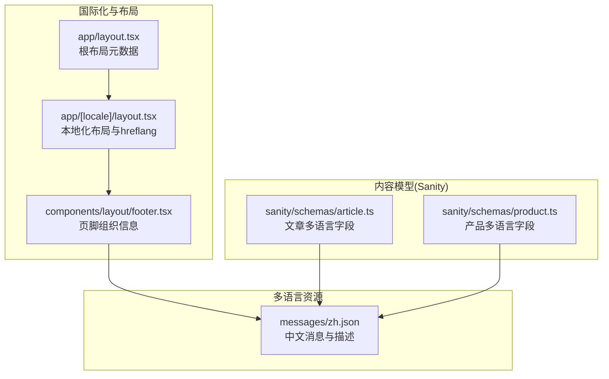
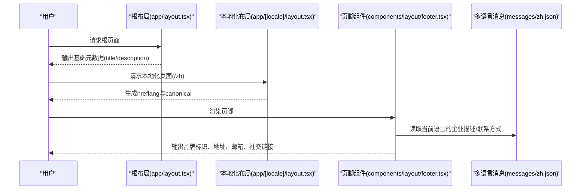
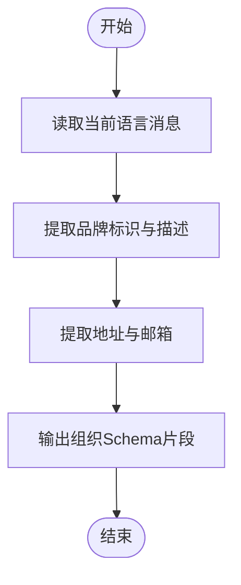
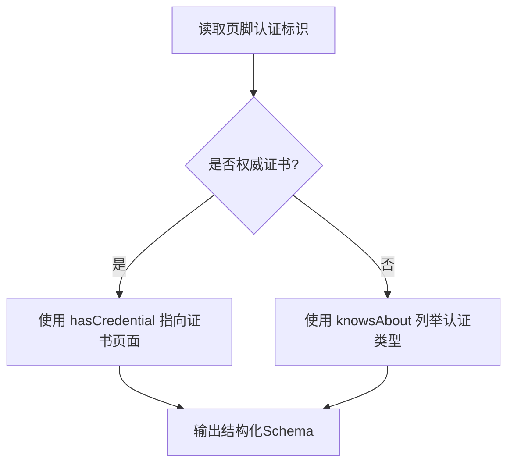
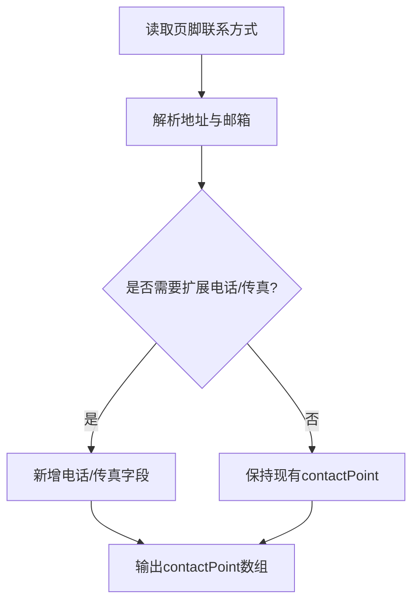
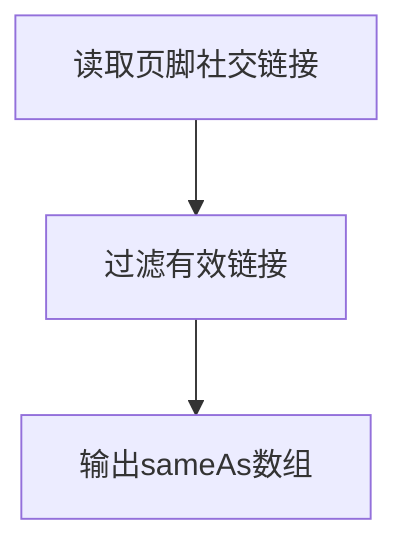
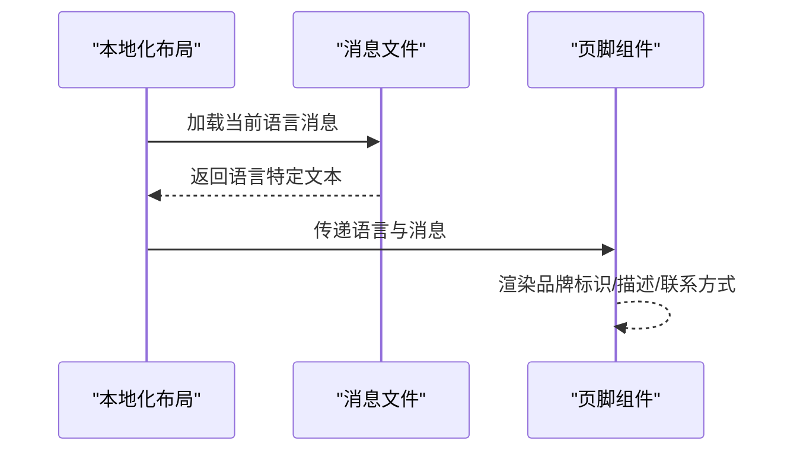
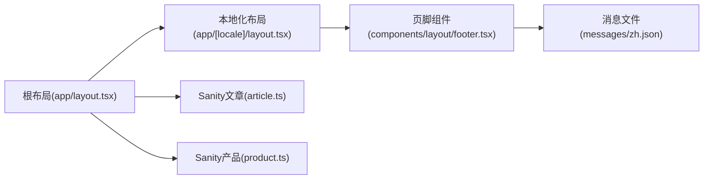

# 组织Schema生成

<cite>
**本文引用的文件**
- [app/[locale]/layout.tsx](file://app/[locale]/layout.tsx)
- [app/layout.tsx](file://app/layout.tsx)
- [components/layout/footer.tsx](file://components/layout/footer.tsx)
- [messages/zh.json](file://messages/zh.json)
- [sanity/schemas/article.ts](file://sanity/schemas/article.ts)
- [sanity/schemas/product.ts](file://sanity/schemas/product.ts)
</cite>

## 目录
1. [简介](#简介)
2. [项目结构](#项目结构)
3. [核心组件](#核心组件)
4. [架构总览](#架构总览)
5. [详细组件分析](#详细组件分析)
6. [依赖分析](#依赖分析)
7. [性能考虑](#性能考虑)
8. [故障排查指南](#故障排查指南)
9. [结论](#结论)
10. [附录](#附录)

## 简介
本文件面向“组织Schema生成系统”的设计与实现，重点围绕企业基本信息、品牌标识、企业资质认证、联系方式与多语言支持的生成逻辑进行系统化说明。文档同时提供在公司介绍页面或全局布局中集成组织Schema标记的实践建议，并给出维护企业信息准确性的最佳实践。

## 项目结构
该仓库采用 Next.js App Router 结构，国际化通过多语言目录与消息文件实现；组织信息主要来源于全局布局与页脚组件，部分元数据由根布局统一注入；Sanity CMS 提供多语言内容模型支撑（文章与产品），可作为组织Schema数据的补充来源。

图表来源
- [app/layout.tsx:1-19](file://app/layout.tsx#L1-L19)
- [app/[locale]/layout.tsx:15-31](file://app/[locale]/layout.tsx#L15-L31)
- [components/layout/footer.tsx:36-168](file://components/layout/footer.tsx#L36-L168)
- [messages/zh.json:1-200](file://messages/zh.json#L1-L200)
- [sanity/schemas/article.ts:10-228](file://sanity/schemas/article.ts#L10-L228)
- [sanity/schemas/product.ts:10-233](file://sanity/schemas/product.ts#L10-L233)

章节来源
- [app/[locale]/layout.tsx:1-71](file://app/[locale]/layout.tsx#L1-L71)
- [app/layout.tsx:1-19](file://app/layout.tsx#L1-L19)
- [components/layout/footer.tsx:1-170](file://components/layout/footer.tsx#L1-L170)
- [messages/zh.json:1-200](file://messages/zh.json#L1-L200)
- [sanity/schemas/article.ts:1-265](file://sanity/schemas/article.ts#L1-L265)
- [sanity/schemas/product.ts:1-233](file://sanity/schemas/product.ts#L1-L233)

## 核心组件
- 全局布局元数据：根布局定义站点标题与描述，为组织Schema提供基础元信息。
- 本地化布局与hreflang：为每种语言生成canonical与alternate链接，便于搜索引擎识别多语言版本。
- 页脚组件：集中呈现公司地址、邮箱、社会链接与认证标识，是组织Schema中联系方式与品牌标识的主要来源。
- 多语言消息：中文消息文件包含企业描述、联系方式等文本，用于国际化展示与Schema生成。
- Sanity内容模型：文章与产品模型均采用多语言对象字段，可作为组织描述、产品能力与应用场景的补充数据源。

章节来源
- [app/layout.tsx:3-6](file://app/layout.tsx#L3-L6)
- [app/[locale]/layout.tsx:16-31](file://app/[locale]/layout.tsx#L16-L31)
- [components/layout/footer.tsx:36-168](file://components/layout/footer.tsx#L36-L168)
- [messages/zh.json:85-99](file://messages/zh.json#L85-L99)
- [sanity/schemas/article.ts:10-228](file://sanity/schemas/article.ts#L10-L228)
- [sanity/schemas/product.ts:10-233](file://sanity/schemas/product.ts#L10-L233)

## 架构总览
组织Schema生成涉及以下关键流程：
- 数据来源整合：根布局元数据、页脚联系方式与品牌标识、多语言消息中的企业描述。
- 多语言适配：根据当前语言环境选择对应文本，确保Schema与界面一致。
- 结构化输出：将组织信息按Schema.org结构化格式输出至HTML head或JSON-LD。

图表来源
- [app/layout.tsx:3-6](file://app/layout.tsx#L3-L6)
- [app/[locale]/layout.tsx:16-31](file://app/[locale]/layout.tsx#L16-L31)
- [components/layout/footer.tsx:36-168](file://components/layout/footer.tsx#L36-L168)
- [messages/zh.json:85-99](file://messages/zh.json#L85-L99)

## 详细组件分析

### 企业基本信息与品牌标识
- 品牌标识：页脚组件包含公司Logo与品牌名称，可作为Schema.org Organization 的 logo 与 legalName 的来源。
- 企业描述：页脚包含“公司描述”字段，可映射到 Organization 的 description 或 sameAs 指向的介绍页面。
- 地址与邮箱：页脚提供地址与邮箱，可映射到 Organization 的 address 与 contactPoints。

图表来源
- [components/layout/footer.tsx:36-168](file://components/layout/footer.tsx#L36-L168)
- [messages/zh.json:85-99](file://messages/zh.json#L85-L99)

章节来源
- [components/layout/footer.tsx:36-168](file://components/layout/footer.tsx#L36-L168)
- [messages/zh.json:85-99](file://messages/zh.json#L85-L99)

### 企业资质认证(knowsAbout 与 hasCredential)
- 当前实现：页脚组件展示认证标识（如 ISO 9001、ISO 14001、RoHS、CE、UL），可作为 Organization 的 knowsAbout 或 hasCredential 的候选值。
- 建议实践：
  - 使用 knowsAbout 表达“企业具备的认证类型”，适合以数组形式列出认证类别。
  - 使用 hasCredential 指向权威认证机构的证明文件或证书页面，适合结构化引用。
  - 若来自Sanity内容模型，可在查询时将认证标识映射为结构化数组。

图表来源
- [components/layout/footer.tsx:137-147](file://components/layout/footer.tsx#L137-L147)

章节来源
- [components/layout/footer.tsx:137-147](file://components/layout/footer.tsx#L137-L147)

### 联系方式(contactPoint)
- 当前实现：页脚提供“地址”和“邮箱”两项联系方式，可直接映射到 Organization 的 contactPoints。
- 建议实践：
  - contactPoint 支持多种联系方式（电话、传真、邮箱、网址），可扩展为更完整的联系清单。
  - 对于多语言页面，联系方式应与当前语言保持一致，避免跨语言混杂。

图表来源
- [components/layout/footer.tsx:117-135](file://components/layout/footer.tsx#L117-L135)

章节来源
- [components/layout/footer.tsx:117-135](file://components/layout/footer.tsx#L117-L135)

### 社交媒体链接(sameAs)
- 当前实现：页脚提供社交图标链接占位符，可作为 Organization 的 sameAs 列表来源。
- 建议实践：
  - sameAs 应指向企业官方社交媒体主页（如LinkedIn、Facebook、YouTube等）。
  - 与多语言环境保持一致，确保各语言版本指向对应的官方主页。

图表来源
- [components/layout/footer.tsx:62-82](file://components/layout/footer.tsx#L62-L82)

章节来源
- [components/layout/footer.tsx:62-82](file://components/layout/footer.tsx#L62-L82)

### 多语言支持
- 国际化布局：本地化布局生成每种语言的 alternate 语言链接与 canonical，有助于搜索引擎理解多语言组织信息。
- 消息文件：中文消息包含企业描述、联系方式等文本，用于页脚渲染与Schema生成。
- 内容模型：Sanity 文章与产品模型采用多语言对象字段，可作为组织描述与能力的补充数据源。

图表来源
- [app/[locale]/layout.tsx:16-31](file://app/[locale]/layout.tsx#L16-L31)
- [messages/zh.json:85-99](file://messages/zh.json#L85-L99)
- [components/layout/footer.tsx:36-168](file://components/layout/footer.tsx#L36-L168)

章节来源
- [app/[locale]/layout.tsx:16-31](file://app/[locale]/layout.tsx#L16-L31)
- [messages/zh.json:85-99](file://messages/zh.json#L85-L99)
- [sanity/schemas/article.ts:10-228](file://sanity/schemas/article.ts#L10-L228)
- [sanity/schemas/product.ts:10-233](file://sanity/schemas/product.ts#L10-L233)

## 依赖分析
- 组件耦合关系：
  - 根布局与本地化布局共同决定站点元数据与hreflang策略。
  - 页脚组件依赖消息文件的语言文本，负责输出品牌标识、联系方式与认证信息。
  - Sanity内容模型为组织描述与能力提供多语言数据支撑。
- 外部依赖：
  - Next.js Metadata API 用于生成canonical与alternate链接。
  - 浏览器端国际化通过Cookie与路由参数控制，影响页脚渲染与Schema输出。

图表来源
- [app/layout.tsx:1-19](file://app/layout.tsx#L1-L19)
- [app/[locale]/layout.tsx:1-71](file://app/[locale]/layout.tsx#L1-L71)
- [components/layout/footer.tsx:1-170](file://components/layout/footer.tsx#L1-L170)
- [messages/zh.json:1-200](file://messages/zh.json#L1-L200)
- [sanity/schemas/article.ts:1-265](file://sanity/schemas/article.ts#L1-L265)
- [sanity/schemas/product.ts:1-233](file://sanity/schemas/product.ts#L1-L233)

章节来源
- [app/layout.tsx:1-19](file://app/layout.tsx#L1-L19)
- [app/[locale]/layout.tsx:1-71](file://app/[locale]/layout.tsx#L1-L71)
- [components/layout/footer.tsx:1-170](file://components/layout/footer.tsx#L1-L170)
- [messages/zh.json:1-200](file://messages/zh.json#L1-L200)
- [sanity/schemas/article.ts:1-265](file://sanity/schemas/article.ts#L1-L265)
- [sanity/schemas/product.ts:1-233](file://sanity/schemas/product.ts#L1-L233)

## 性能考虑
- 动态生成Metadata与hreflang仅在必要时执行，避免重复计算。
- 页脚渲染依赖的消息文件按需加载，减少首屏负担。
- 多语言内容模型的数据访问应结合缓存策略，降低查询开销。
- JSON-LD结构化数据建议在SSR阶段生成并内嵌，减少客户端渲染成本。

## 故障排查指南
- canonical与hreflang异常
  - 检查本地化布局的生成逻辑，确认alternate语言映射与baseUrl配置正确。
  - 参考路径：[app/[locale]/layout.tsx:16-31](file://app/[locale]/layout.tsx#L16-L31)
- 多语言文本不一致
  - 确认当前语言的消息文件键值完整，页脚组件读取逻辑与语言切换一致。
  - 参考路径：[messages/zh.json:85-99](file://messages/zh.json#L85-L99)
- 联系方式缺失或错误
  - 检查页脚组件的地址与邮箱字段是否正确绑定消息文件。
  - 参考路径：[components/layout/footer.tsx:117-135](file://components/layout/footer.tsx#L117-L135)
- 认证标识未显示
  - 确认页脚认证区域的标识列表与实际数据一致。
  - 参考路径：[components/layout/footer.tsx:137-147](file://components/layout/footer.tsx#L137-L147)
- 社交链接无效
  - 检查页脚社交链接的占位符是否替换为真实URL。
  - 参考路径：[components/layout/footer.tsx:62-82](file://components/layout/footer.tsx#L62-L82)

章节来源
- [app/[locale]/layout.tsx:16-31](file://app/[locale]/layout.tsx#L16-L31)
- [messages/zh.json:85-99](file://messages/zh.json#L85-L99)
- [components/layout/footer.tsx:62-82](file://components/layout/footer.tsx#L62-L82)
- [components/layout/footer.tsx:117-135](file://components/layout/footer.tsx#L117-L135)
- [components/layout/footer.tsx:137-147](file://components/layout/footer.tsx#L137-L147)

## 结论
组织Schema生成系统以根布局与本地化布局为基础，结合页脚组件与多语言消息，形成稳定的企业信息输出链路。通过扩展页脚的联系方式、认证标识与社交链接，可进一步完善Schema的完整性与权威性。建议在生产环境中引入结构化数据校验工具，定期检查Schema的有效性与一致性。

## 附录
- 在公司介绍页面集成组织Schema的步骤
  - 在页面头部输出基础元数据（标题、描述）。
  - 生成canonical与alternate语言链接。
  - 渲染页脚的品牌标识、地址、邮箱与认证标识。
  - 输出sameAs与contactPoint等结构化数据。
- 维护企业信息准确性的最佳实践
  - 统一管理品牌标识与描述，确保多语言版本一致。
  - 定期更新认证标识与社交链接，避免过期。
  - 通过Sanity内容模型维护多语言描述与能力说明，保证数据新鲜度。