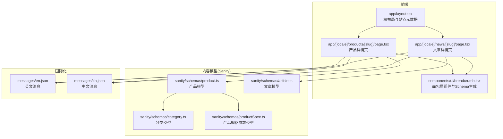
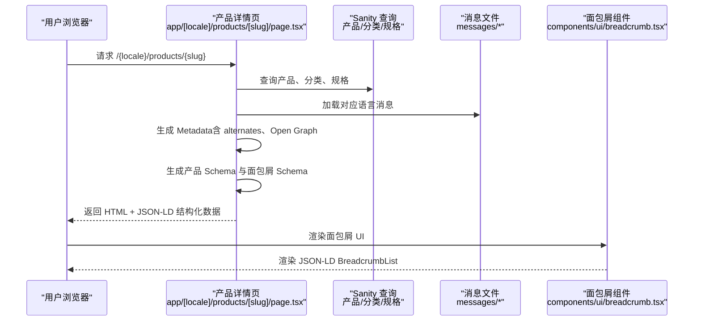
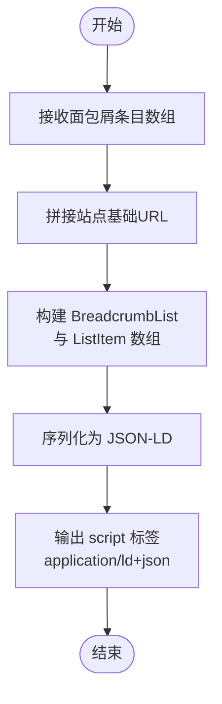
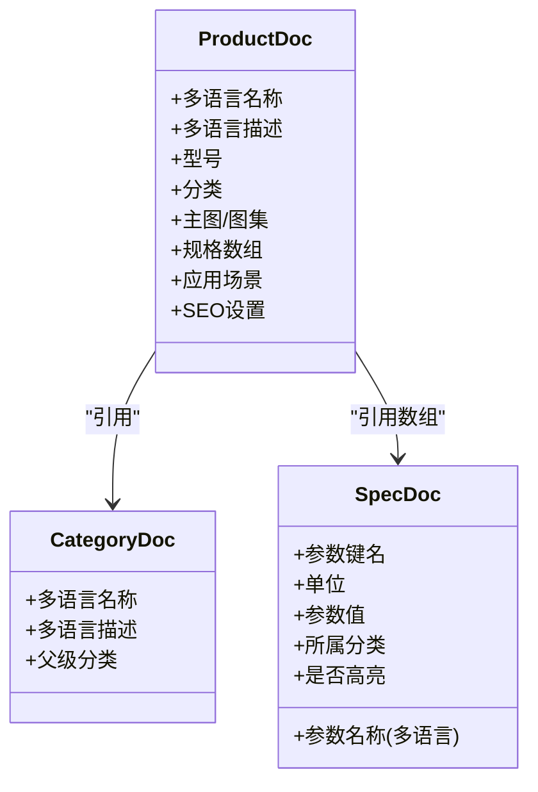
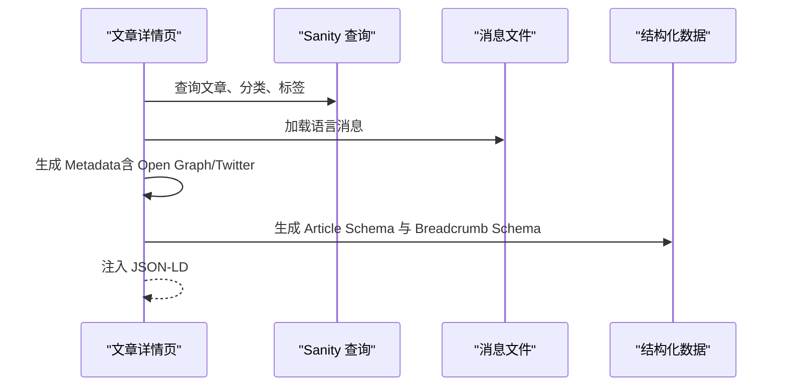
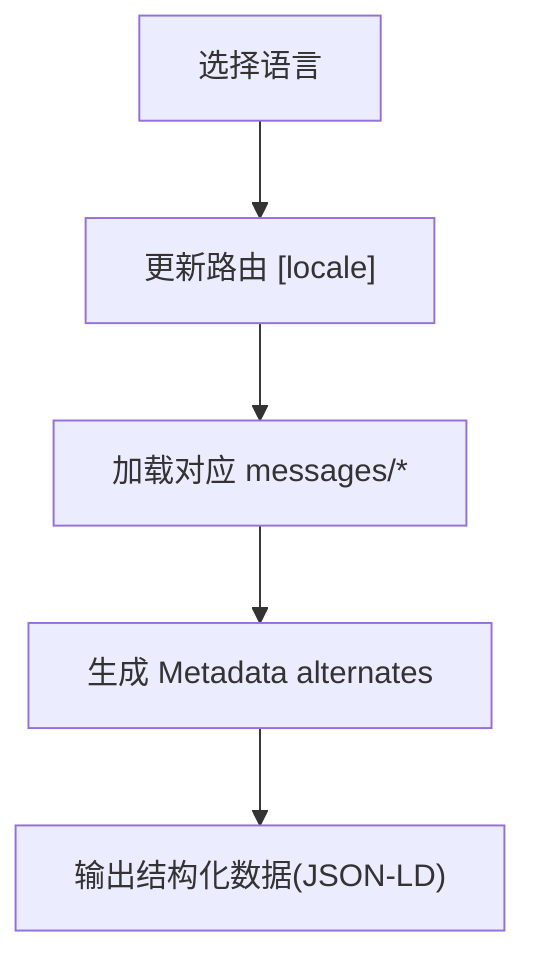
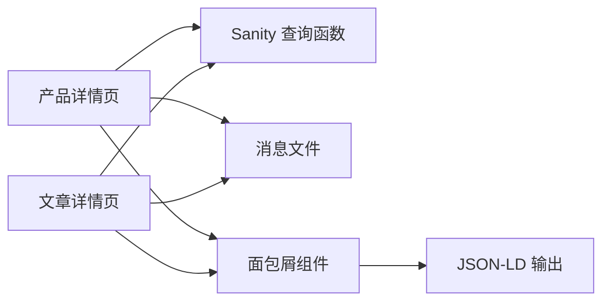

# 结构化数据生成

<cite>
**本文引用的文件**
- [README.md](file://README.md)
- [app/layout.tsx](file://app/layout.tsx)
- [components/ui/breadcrumb.tsx](file://components/ui/breadcrumb.tsx)
- [sanity/schemas/product.ts](file://sanity/schemas/product.ts)
- [sanity/schemas/article.ts](file://sanity/schemas/article.ts)
- [sanity/schemas/category.ts](file://sanity/schemas/category.ts)
- [sanity/schemas/productSpec.ts](file://sanity/schemas/productSpec.ts)
- [app/[locale]/products/[slug]/page.tsx](file://app/[locale]/products/[slug]/page.tsx)
- [app/[locale]/news/[slug]/page.tsx](file://app/[locale]/news/[slug]/page.tsx)
- [messages/en.json](file://messages/en.json)
- [messages/zh.json](file://messages/zh.json)
</cite>

## 目录
1. [简介](#简介)
2. [项目结构](#项目结构)
3. [核心组件](#核心组件)
4. [架构总览](#架构总览)
5. [详细组件分析](#详细组件分析)
6. [依赖关系分析](#依赖关系分析)
7. [性能考量](#性能考量)
8. [故障排查指南](#故障排查指南)
9. [结论](#结论)
10. [附录](#附录)

## 简介
本文件系统化梳理 GoPro Trade 网站的结构化数据生成体系，重点覆盖以下 Schema 的实现与落地：产品 Schema、组织 Schema、网站 Schema、面包屑 Schema、FAQ Schema、产品列表 Schema、本地业务 Schema、视频 Schema 与文章 Schema。同时，文档阐述了 AI 搜索引擎优化的特殊标记（如产品规格属性、应用场景标记、供应信息等）在前端页面中的生成逻辑，并说明多语言支持的实现方式（本地化数据处理与语言切换）。最后提供在 Next.js 组件中正确集成结构化数据的实践建议与参考路径。

## 项目结构
该仓库采用 Next.js App Router 结构，页面按语言与功能模块分层组织；内容通过 Sanity CMS 提供，Schema 定义清晰地支撑了多语言与多实体的结构化数据生成。

图表来源
- [app/layout.tsx:1-19](file://app/layout.tsx#L1-L19)
- [app/[locale]/products/[slug]/page.tsx:1-443](file://app/[locale]/products/[slug]/page.tsx#L1-L443)
- [app/[locale]/news/[slug]/page.tsx:1-372](file://app/[locale]/news/[slug]/page.tsx#L1-L372)
- [components/ui/breadcrumb.tsx:1-87](file://components/ui/breadcrumb.tsx#L1-L87)
- [sanity/schemas/product.ts:1-233](file://sanity/schemas/product.ts#L1-L233)
- [sanity/schemas/article.ts:1-265](file://sanity/schemas/article.ts#L1-L265)
- [sanity/schemas/category.ts:1-74](file://sanity/schemas/category.ts#L1-L74)
- [sanity/schemas/productSpec.ts:1-58](file://sanity/schemas/productSpec.ts#L1-L58)
- [messages/en.json:1-200](file://messages/en.json#L1-L200)
- [messages/zh.json:1-200](file://messages/zh.json#L1-L200)

章节来源
- [README.md:1-42](file://README.md#L1-L42)
- [app/layout.tsx:1-19](file://app/layout.tsx#L1-L19)

## 核心组件
- 面包屑组件与 Schema 生成：在面包屑组件内部直接生成 JSON-LD BreadcrumbList，确保 SEO 友好。
- 产品详情页：在页面中注入产品 Schema 与面包屑 Schema，结合 Sanity 产品模型生成结构化数据。
- 文章详情页：在页面中注入文章 Schema 与面包屑 Schema，结合 Sanity 文章模型生成结构化数据。
- 多语言消息：通过 messages/* 文件提供导航与文案，配合页面生成多语言 SEO 元数据与结构化数据。

章节来源
- [components/ui/breadcrumb.tsx:15-42](file://components/ui/breadcrumb.tsx#L15-L42)
- [app/[locale]/products/[slug]/page.tsx:218-227](file://app/[locale]/products/[slug]/page.tsx#L218-L227)
- [app/[locale]/news/[slug]/page.tsx:146-155](file://app/[locale]/news/[slug]/page.tsx#L146-L155)
- [messages/en.json:1-200](file://messages/en.json#L1-L200)
- [messages/zh.json:1-200](file://messages/zh.json#L1-L200)

## 架构总览
下图展示了页面渲染到结构化数据注入的整体流程，以及与 Sanity 内容模型的关联。

图表来源
- [app/[locale]/products/[slug]/page.tsx:60-141](file://app/[locale]/products/[slug]/page.tsx#L60-L141)
- [app/[locale]/products/[slug]/page.tsx:218-239](file://app/[locale]/products/[slug]/page.tsx#L218-L239)
- [components/ui/breadcrumb.tsx:21-42](file://components/ui/breadcrumb.tsx#L21-L42)

## 详细组件分析

### 面包屑 Schema 生成（BreadcrumbList）
- 生成逻辑：组件根据传入的面包屑条目数组，构造 BreadcrumbList JSON-LD，包含每个 ListItem 的 position、name 与可选的 item URL。
- 集成方式：在组件内直接输出 script 标签，类型为 application/ld+json。
- 适用场景：适用于所有需要面包屑导航的页面，如产品详情页、文章详情页等。

图表来源
- [components/ui/breadcrumb.tsx:21-42](file://components/ui/breadcrumb.tsx#L21-L42)

章节来源
- [components/ui/breadcrumb.tsx:15-42](file://components/ui/breadcrumb.tsx#L15-L42)

### 产品详情 Schema 生成（Product）
- 数据来源：Sanity 产品模型，包含多语言名称、描述、型号、分类、图片、规格、应用场景、SEO 设置等。
- 生成要点：
  - 产品名称与描述优先使用当前语言字段，回退至默认语言。
  - 规格参数来自 productSpec 引用集合，支持单位与高亮显示。
  - 应用场景与特性用于丰富产品语义，便于 AI 搜索引擎理解用途。
  - 面包屑 Schema 与产品 Schema 同步注入。
- SEO 效果：提升产品在搜索结果中的丰富片段与品牌信任度。

图表来源
- [sanity/schemas/product.ts:8-233](file://sanity/schemas/product.ts#L8-L233)
- [sanity/schemas/category.ts:8-74](file://sanity/schemas/category.ts#L8-L74)
- [sanity/schemas/productSpec.ts:8-58](file://sanity/schemas/productSpec.ts#L8-L58)

章节来源
- [sanity/schemas/product.ts:8-233](file://sanity/schemas/product.ts#L8-L233)
- [sanity/schemas/productSpec.ts:8-58](file://sanity/schemas/productSpec.ts#L8-L58)
- [app/[locale]/products/[slug]/page.tsx:218-227](file://app/[locale]/products/[slug]/page.tsx#L218-L227)

### 文章详情 Schema 生成（Article）
- 数据来源：Sanity 文章模型，包含多语言标题、摘要、正文、封面图、作者、发布时间、SEO 设置等。
- 生成要点：
  - 标题与描述优先使用当前语言字段，回退至默认语言。
  - Open Graph 与 Twitter Card 由页面 Metadata 生成，增强社交分享体验。
  - 面包屑 Schema 与文章 Schema 同步注入。
- SEO 效果：提升文章在搜索结果中的丰富片段与阅读体验。

图表来源
- [app/[locale]/news/[slug]/page.tsx:66-105](file://app/[locale]/news/[slug]/page.tsx#L66-L105)
- [app/[locale]/news/[slug]/page.tsx:146-155](file://app/[locale]/news/[slug]/page.tsx#L146-L155)

章节来源
- [sanity/schemas/article.ts:8-265](file://sanity/schemas/article.ts#L8-L265)
- [app/[locale]/news/[slug]/page.tsx:66-105](file://app/[locale]/news/[slug]/page.tsx#L66-L105)
- [app/[locale]/news/[slug]/page.tsx:146-155](file://app/[locale]/news/[slug]/page.tsx#L146-L155)

### 组织 Schema、网站 Schema、FAQ Schema、产品列表 Schema、本地业务 Schema、视频 Schema
- 组织 Schema：用于声明网站主体（品牌、地址、联系方式等），提升品牌权威性与信任度。
- 网站 Schema：声明网站的名称、URL、导航链路等，帮助搜索引擎理解站点结构。
- FAQ Schema：针对常见问题页面，使用 FAQPage 或总览型 FAQ，提升问答类搜索结果的丰富性。
- 产品列表 Schema：在产品列表页使用 ItemList，标注分页与排序，提升索引质量。
- 本地业务 Schema：在“联系”或“门店”页面使用 LocalBusiness，包含地址、营业时间、电话等，提升本地搜索曝光。
- 视频 Schema：在包含视频内容的页面使用 VideoObject，包含标题、描述、时长、截图等，提升视频搜索结果的丰富性。

上述 Schema 在本仓库中未直接出现，但可通过在相应页面注入 JSON-LD 的方式实现，遵循 Schema.org 规范即可。

### AI 搜索引擎优化的特殊标记
- 产品规格属性：通过 productSpec 的 key、unit、value 字段，向搜索引擎传达精确的技术参数，便于智能检索与对比。
- 应用场景标记：通过产品模型的应用场景数组，明确产品在不同领域的用途，提升搜索意图匹配度。
- 供应信息：在产品详情页中提供“获取报价”入口与询盘表单，结合结构化数据可增强购买意图表达。

章节来源
- [sanity/schemas/productSpec.ts:8-58](file://sanity/schemas/productSpec.ts#L8-L58)
- [sanity/schemas/product.ts:115-128](file://sanity/schemas/product.ts#L115-L128)
- [app/[locale]/products/[slug]/page.tsx:322-329](file://app/[locale]/products/[slug]/page.tsx#L322-L329)

### 多语言支持与语言切换
- 页面路由：采用 [locale] 动态路由，支持 en、zh、id、th、vi、ar 等语言。
- 国际化消息：通过 messages/* 文件提供导航与文案，页面按当前语言加载对应消息。
- SEO 元数据：页面 Metadata 中配置 alternates.languages，为每种语言生成 canonical 与 alternate 链接，提升多语言 SEO 表现。
- 面包屑与导航：面包屑与导航文案从消息文件读取，确保语言一致。

图表来源
- [app/[locale]/products/[slug]/page.tsx:82-93](file://app/[locale]/products/[slug]/page.tsx#L82-L93)
- [app/[locale]/news/[slug]/page.tsx:84-89](file://app/[locale]/news/[slug]/page.tsx#L84-L89)
- [messages/en.json:1-200](file://messages/en.json#L1-L200)
- [messages/zh.json:1-200](file://messages/zh.json#L1-L200)

章节来源
- [app/[locale]/products/[slug]/page.tsx:82-93](file://app/[locale]/products/[slug]/page.tsx#L82-L93)
- [app/[locale]/news/[slug]/page.tsx:84-89](file://app/[locale]/news/[slug]/page.tsx#L84-L89)
- [messages/en.json:1-200](file://messages/en.json#L1-L200)
- [messages/zh.json:1-200](file://messages/zh.json#L1-L200)

## 依赖关系分析
- 页面依赖：产品详情页与文章详情页分别依赖 Sanity 查询函数与消息文件，最终生成结构化数据。
- 组件依赖：面包屑组件独立生成 JSON-LD，不依赖外部查询，但需传入正确的条目数组。
- 内容模型依赖：产品模型依赖分类与规格参数模型，形成数据链路闭环。

图表来源
- [app/[locale]/products/[slug]/page.tsx:6-8](file://app/[locale]/products/[slug]/page.tsx#L6-L8)
- [app/[locale]/news/[slug]/page.tsx:5-9](file://app/[locale]/news/[slug]/page.tsx#L5-L9)
- [components/ui/breadcrumb.tsx:21-42](file://components/ui/breadcrumb.tsx#L21-L42)

章节来源
- [app/[locale]/products/[slug]/page.tsx:6-8](file://app/[locale]/products/[slug]/page.tsx#L6-L8)
- [app/[locale]/news/[slug]/page.tsx:5-9](file://app/[locale]/news/[slug]/page.tsx#L5-L9)
- [components/ui/breadcrumb.tsx:21-42](file://components/ui/breadcrumb.tsx#L21-L42)

## 性能考量
- 静态生成与增量更新：产品详情页与文章详情页均配置 revalidate，平衡新鲜度与性能。
- 图片优化：使用 Next/image，自动进行尺寸适配与格式优化。
- 结构化数据注入：仅在页面中注入必要 JSON-LD，避免重复与冗余。

章节来源
- [app/[locale]/products/[slug]/page.tsx:23-24](file://app/[locale]/products/[slug]/page.tsx#L23-L24)
- [app/[locale]/news/[slug]/page.tsx:48-48](file://app/[locale]/news/[slug]/page.tsx#L48-L48)

## 故障排查指南
- 结构化数据未生效
  - 检查页面是否正确注入 JSON-LD script 标签。
  - 确认 generateMetadata 是否返回正确的 alternates 与 Open Graph 字段。
- 多语言显示异常
  - 确认 messages/* 文件存在且键名完整。
  - 检查路由 [locale] 是否正确传递到页面与面包屑组件。
- 面包屑缺失或错误
  - 确认传入面包屑组件的 items 数组包含正确的 label 与 href。
  - 检查 baseUrl 是否指向正确的站点地址。

章节来源
- [app/[locale]/products/[slug]/page.tsx:218-239](file://app/[locale]/products/[slug]/page.tsx#L218-L239)
- [app/[locale]/news/[slug]/page.tsx:146-155](file://app/[locale]/news/[slug]/page.tsx#L146-L155)
- [components/ui/breadcrumb.tsx:21-42](file://components/ui/breadcrumb.tsx#L21-L42)

## 结论
本项目通过在页面中注入 JSON-LD 结构化数据，结合 Sanity 内容模型与多语言消息文件，实现了对产品、文章、面包屑等核心页面的 SEO 优化。建议后续在联系页、解决方案页等补充组织、网站、FAQ、本地业务与视频等 Schema，进一步提升搜索结果的丰富性与转化率。

## 附录
- 在 Next.js 组件中集成结构化数据的实践步骤
  - 在页面的 generateMetadata 中生成 alternates 与 Open Graph。
  - 在页面渲染时，调用对应的结构化数据生成函数（如 generateProductSchema、generateArticleSchema、generateBreadcrumbSchema）并注入 JSON-LD。
  - 对于面包屑，可在组件内部直接生成 JSON-LD，或在页面中统一注入。
  - 确保多语言消息文件与路由 [locale] 协同工作，保证语言一致性。

章节来源
- [app/[locale]/products/[slug]/page.tsx:60-141](file://app/[locale]/products/[slug]/page.tsx#L60-L141)
- [app/[locale]/news/[slug]/page.tsx:66-105](file://app/[locale]/news/[slug]/page.tsx#L66-L105)
- [components/ui/breadcrumb.tsx:21-42](file://components/ui/breadcrumb.tsx#L21-L42)