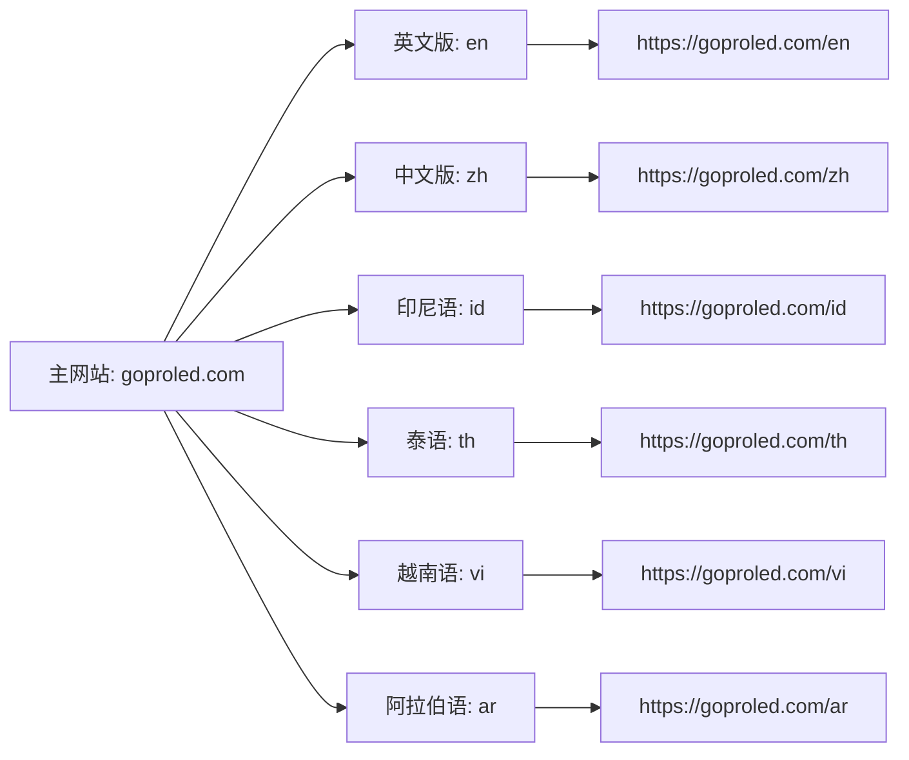
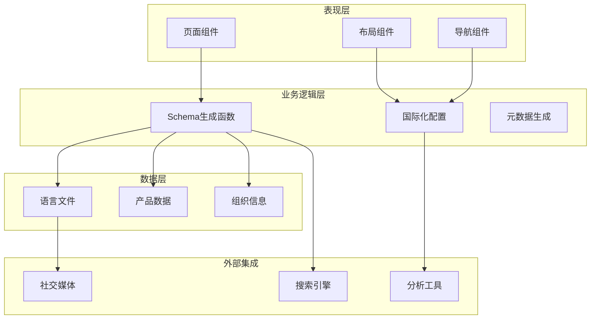
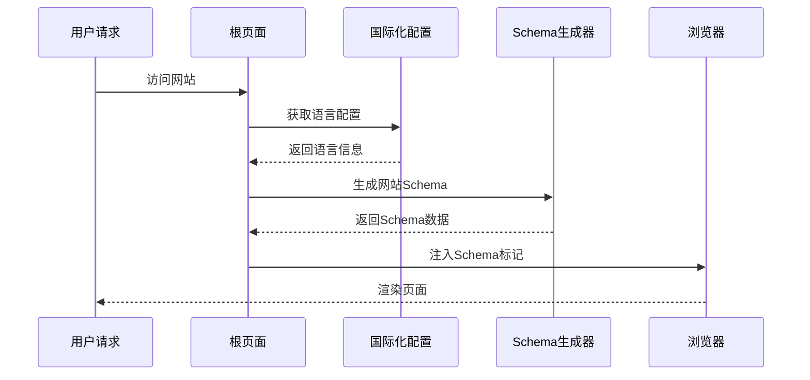
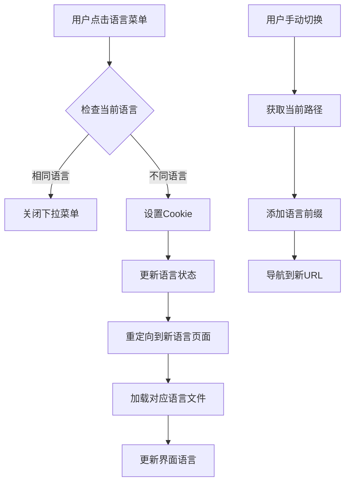
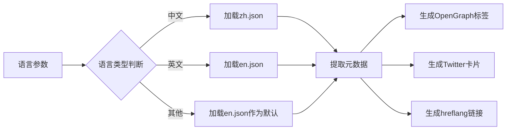

# 网站Schema生成

<cite>
**本文档引用的文件**
- [structured-data.ts](file://lib/utils/structured-data.ts)
- [config.ts](file://lib/i18n/config.ts)
- [layout.tsx](file://app/[locale]/layout.tsx)
- [page.tsx](file://app/[locale]/page.tsx)
- [navbar.tsx](file://components/layout/navbar.tsx)
- [en.json](file://messages/en.json)
- [zh.json](file://messages/zh.json)
</cite>

## 目录
1. [简介](#简介)
2. [项目结构](#项目结构)
3. [核心组件](#核心组件)
4. [架构概览](#架构概览)
5. [详细组件分析](#详细组件分析)
6. [依赖关系分析](#依赖关系分析)
7. [性能考量](#性能考量)
8. [故障排除指南](#故障排除指南)
9. [结论](#结论)

## 简介

本文档深入解析了Gopro Trade网站的Schema生成系统，重点分析`generateWebsiteSchema`函数的实现机制。该系统采用Next.js国际化架构，支持英语(en)、中文(zh)、印尼语(id)、泰语(th)、越南语(vi)和阿拉伯语(ar)六种语言，通过结构化数据标记提升搜索引擎优化效果。

系统的核心功能包括：
- 网站基本信息生成（名称、URL、描述、语言）
- 多语言支持（hreflang标签和translationOfWork）
- 站内搜索功能（SearchAction配置）
- 组织信息和产品信息的结构化标记

## 项目结构

网站采用基于区域的国际化架构，每个语言版本都有独立的路由结构：

```mermaid
graph TB
subgraph "国际化架构"
A[app/[locale]/] --> B[根页面 page.tsx]
A --> C[布局文件 layout.tsx]
A --> D[各功能页面]
E[messages/] --> F[语言文件 en.json]
E --> G[zh.json]
E --> H[id.json]
E --> I[th.json]
E --> J[vi.json]
E --> K[ar.json]
end
subgraph "工具模块"
L[lib/utils/structured-data.ts] --> M[Schema生成函数]
N[lib/i18n/config.ts] --> O[语言配置]
end
subgraph "组件层"
P[components/layout/navbar.tsx] --> Q[语言切换]
R[components/layout/footer.tsx] --> S[页脚组件]
end
```

**图表来源**
- [layout.tsx:1-71](file://app/[locale]/layout.tsx#L1-L71)
- [config.ts:1-16](file://lib/i18n/config.ts#L1-L16)

**章节来源**
- [layout.tsx:1-71](file://app/[locale]/layout.tsx#L1-L71)
- [config.ts:1-16](file://lib/i18n/config.ts#L1-L16)

## 核心组件

### generateWebsiteSchema函数详解

`generateWebsiteSchema`函数是网站Schema生成的核心组件，负责创建WebSite类型的结构化数据标记。

#### 函数签名与参数
```typescript
export function generateWebsiteSchema(locale: string = 'en')
```

#### 返回的数据结构
函数返回包含以下关键字段的对象：
- `@context`: `https://schema.org`
- `@type`: `WebSite`
- `@id`: 基于URL和语言的唯一标识符
- `name`: 网站名称（根据语言自动切换）
- `url`: 网站主URL
- `description`: 网站描述
- `inLanguage`: 网站语言
- `potentialAction`: 搜索操作配置
- `translationOfWork`: 多语言版本链接

#### 网站基本信息生成逻辑

网站名称根据语言自动选择：
- 中文环境：`光莆LED - 专业LED制造商`
- 英文环境：`GOPRO LED - Professional LED Manufacturer`

URL生成遵循统一格式：`https://goproled.com/{locale}`

#### 搜索操作(SearchAction)配置

搜索功能通过`potentialAction`字段实现，包含完整的搜索配置：

```mermaid
flowchart TD
A[SearchAction配置] --> B[搜索类型: SearchAction]
B --> C[目标入口点]
C --> D[URL模板: https://goproled.com/{locale}/products?q={search_term_string}]
C --> E[查询参数: search_term_string]
D --> F[搜索目标URL]
E --> G[查询输入定义]
```

**图表来源**
- [structured-data.ts:177-184](file://lib/utils/structured-data.ts#L177-L184)

#### 多语言支持(translationOfWork)

系统通过`translationOfWork`字段提供完整的多语言版本支持：



**图表来源**
- [structured-data.ts:186-190](file://lib/utils/structured-data.ts#L186-L190)

**章节来源**
- [structured-data.ts:165-192](file://lib/utils/structured-data.ts#L165-L192)

### 国际化配置系统

系统采用集中式语言配置管理：

#### 支持的语言列表
```typescript
export const locales = ['en', 'zh', 'id', 'th', 'vi', 'ar'] as const;
```

#### 语言名称映射
- en: English
- zh: 中文
- id: Bahasa Indonesia
- th: ไทย
- vi: Tiếng Việt
- ar: العربية

#### RTL语言支持
系统特别支持阿拉伯语等从右到左书写的语言。

**章节来源**
- [config.ts:1-16](file://lib/i18n/config.ts#L1-L16)

## 架构概览

网站Schema生成系统采用分层架构设计，确保代码的可维护性和扩展性：



**图表来源**
- [page.tsx:1-334](file://app/[locale]/page.tsx#L1-L334)
- [layout.tsx:1-71](file://app/[locale]/layout.tsx#L1-L71)

## 详细组件分析

### 页面级Schema集成

在根页面中，系统通过`generateMetadata`函数实现Schema标记的动态生成：

#### 元数据生成流程



**图表来源**
- [page.tsx:23-77](file://app/[locale]/page.tsx#L23-L77)

#### Schema标记注入过程

系统在页面渲染时动态注入多个Schema标记：

1. **组织信息标记** (`generateOrganizationSchema`)
2. **网站信息标记** (`generateWebsiteSchema`)
3. **FAQ信息标记** (`generateFAQSchema`)
4. **本地业务标记** (`generateLocalBusinessSchema`)

**章节来源**
- [page.tsx:152-201](file://app/[locale]/page.tsx#L152-L201)

### 导航栏语言切换集成

导航栏组件集成了完整的语言切换功能：

#### 语言切换流程



**图表来源**
- [navbar.tsx:36-40](file://components/layout/navbar.tsx#L36-L40)

**章节来源**
- [navbar.tsx:28-215](file://components/layout/navbar.tsx#L28-L215)

### 多语言元数据生成

系统为每个语言版本生成独立的元数据：

#### 元数据生成逻辑



**图表来源**
- [page.tsx:79-86](file://app/[locale]/page.tsx#L79-L86)

**章节来源**
- [page.tsx:23-77](file://app/[locale]/page.tsx#L23-L77)

## 依赖关系分析

系统采用模块化设计，各组件间依赖关系清晰：

```mermaid
graph TB
subgraph "核心依赖"
A[lib/utils/structured-data.ts] --> B[lib/i18n/config.ts]
C[app/[locale]/page.tsx] --> A
C --> B
D[app/[locale]/layout.tsx] --> B
E[components/layout/navbar.tsx] --> B
end
subgraph "语言文件"
F[messages/en.json] --> C
G[messages/zh.json] --> C
H[messages/id.json] --> C
I[messages/th.json] --> C
J[messages/vi.json] --> C
K[messages/ar.json] --> C
end
subgraph "外部依赖"
L[Next.js框架]
M[React]
N[Schema.org规范]
end
A --> N
B --> L
C --> L
D --> L
E --> M
```

**图表来源**
- [structured-data.ts:1-383](file://lib/utils/structured-data.ts#L1-L383)
- [config.ts:1-16](file://lib/i18n/config.ts#L1-L16)

**章节来源**
- [structured-data.ts:1-383](file://lib/utils/structured-data.ts#L1-L383)
- [config.ts:1-16](file://lib/i18n/config.ts#L1-L16)

## 性能考量

系统在设计时充分考虑了性能优化：

### 缓存策略
- ISR配置：每小时重新验证一次（`revalidate = 3600`）
- 图片懒加载：非首屏图片采用懒加载策略
- 语言文件按需加载：仅加载当前语言的翻译文件

### SEO优化
- 结构化数据标记：提供丰富的语义信息给搜索引擎
- 多语言链接：完整的hreflang配置
- OpenGraph和Twitter卡片：优化社交分享体验

## 故障排除指南

### 常见问题及解决方案

#### Schema标记不生效
1. **检查JSON-LD格式**：确保Schema数据格式正确
2. **验证上下文声明**：确认`@context`字段设置为`https://schema.org`
3. **检查类型匹配**：确保`@type`字段与数据结构匹配

#### 多语言链接错误
1. **验证语言配置**：检查`locales`数组是否包含正确的语言代码
2. **检查URL生成**：确认语言前缀URL生成逻辑正确
3. **测试hreflang标签**：验证`alternates.languages`配置

#### 搜索功能异常
1. **检查SearchAction配置**：验证`target.urlTemplate`格式
2. **验证查询参数**：确认`query-input`参数名正确
3. **测试搜索URL**：验证最终生成的搜索URL格式

**章节来源**
- [structured-data.ts:165-192](file://lib/utils/structured-data.ts#L165-L192)
- [layout.tsx:16-31](file://app/[locale]/layout.tsx#L16-L31)

## 结论

Gopro Trade网站的Schema生成系统展现了现代Web开发的最佳实践。通过模块化的架构设计、完善的国际化支持和精心优化的性能策略，系统不仅提供了优秀的用户体验，还显著提升了搜索引擎的可见性和索引质量。

系统的核心优势包括：
- **完整的多语言支持**：支持6种语言的完整配置
- **灵活的Schema生成**：可扩展的结构化数据生成机制
- **高性能设计**：合理的缓存策略和资源加载优化
- **易于维护**：清晰的代码结构和模块化设计

该系统为类似的企业网站提供了优秀的参考模板，展示了如何在保持代码整洁的同时实现复杂的国际化和SEO优化需求。