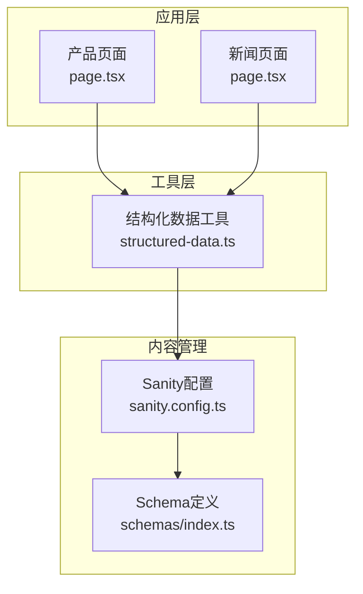
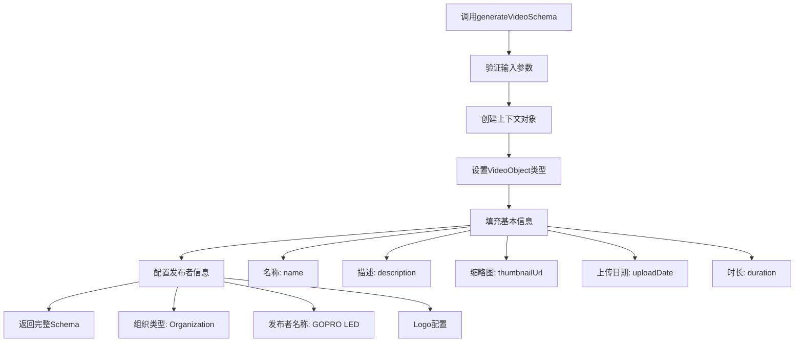
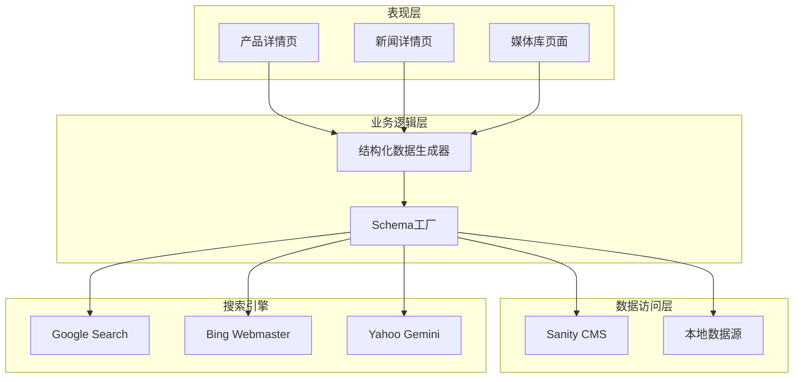
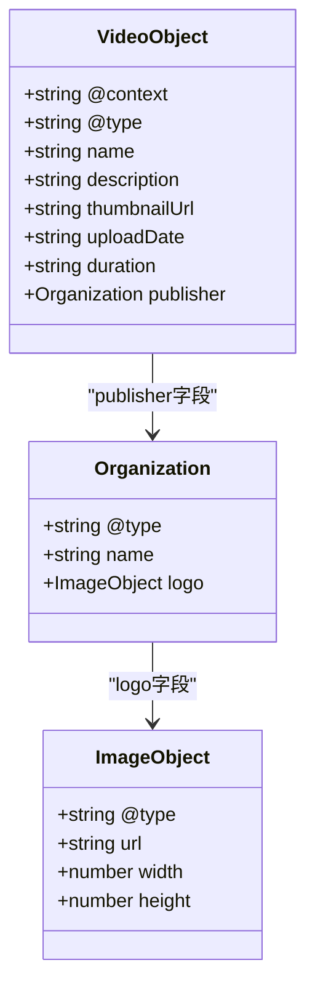
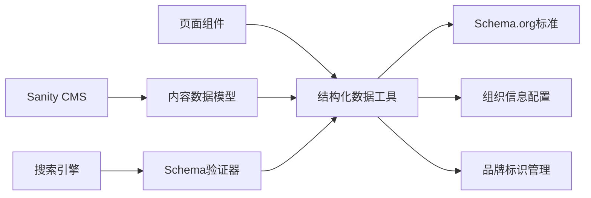

# 视频Schema生成

<cite>
**本文档引用的文件**
- [structured-data.ts](file://lib/utils/structured-data.ts)
- [page.tsx](file://app/[locale]/products/[slug]/page.tsx)
- [page.tsx](file://app/[locale]/news/[slug]/page.tsx)
- [sanity.config.ts](file://sanity/sanity.config.ts)
- [index.ts](file://sanity/schemas/index.ts)
</cite>

## 目录
1. [简介](#简介)
2. [项目结构](#项目结构)
3. [核心组件](#核心组件)
4. [架构概览](#架构概览)
5. [详细组件分析](#详细组件分析)
6. [依赖关系分析](#依赖关系分析)
7. [性能考虑](#性能考虑)
8. [故障排除指南](#故障排除指南)
9. [结论](#结论)

## 简介

本文档详细介绍了视频Schema生成系统的设计与实现，重点分析了`generateVideoSchema`函数的完整实现流程。该系统基于Schema.org标准构建，为视频内容提供结构化标记，优化搜索引擎可见性。

系统采用模块化设计，通过独立的结构化数据生成工具提供统一的Schema生成接口，支持多种内容类型的SEO优化需求。

## 项目结构

项目采用Next.js框架的App Router架构，视频Schema生成功能位于`lib/utils/structured-data.ts`文件中，通过`generateVideoSchema`函数提供核心功能。



**图表来源**
- [structured-data.ts:313-342](file://lib/utils/structured-data.ts#L313-L342)
- [page.tsx:1-443](file://app/[locale]/products/[slug]/page.tsx#L1-L443)
- [page.tsx:1-372](file://app/[locale]/news/[slug]/page.tsx#L1-L372)

**章节来源**
- [structured-data.ts:1-383](file://lib/utils/structured-data.ts#L1-L383)
- [sanity.config.ts:1-33](file://sanity/sanity.config.ts#L1-L33)

## 核心组件

### generateVideoSchema函数

`generateVideoSchema`是视频Schema生成的核心函数，负责创建符合Schema.org标准的VideoObject结构化数据。

**函数签名与参数**
- 输入参数：视频名称、描述、缩略图URL、上传日期、播放时长
- 返回值：完整的VideoObject结构化数据对象

**核心实现逻辑**



**图表来源**
- [structured-data.ts:316-342](file://lib/utils/structured-data.ts#L316-L342)

**章节来源**
- [structured-data.ts:313-342](file://lib/utils/structured-data.ts#L313-L342)

## 架构概览

系统采用分层架构设计，将结构化数据生成逻辑与页面渲染逻辑分离，确保代码的可维护性和可扩展性。



**图表来源**
- [structured-data.ts:313-382](file://lib/utils/structured-data.ts#L313-L382)

## 详细组件分析

### VideoObject数据结构

VideoObject是Schema.org中专门用于描述视频内容的标准类型，系统通过`generateVideoSchema`函数提供完整的实现。

#### 基本信息配置

| 字段名 | 类型 | 必需性 | 描述 |
|--------|------|--------|------|
| `@context` | string | 必需 | JSON-LD上下文，固定为"https://schema.org" |
| `@type` | string | 必需 | 对象类型，固定为"VideoObject" |
| `name` | string | 必需 | 视频标题或名称 |
| `description` | string | 必需 | 视频描述内容 |
| `thumbnailUrl` | string | 必需 | 缩略图图片URL |
| `uploadDate` | string | 必需 | ISO 8601格式的上传日期 |
| `duration` | string | 必需 | ISO 8601格式的视频时长 |

#### 发布者信息配置

发布者信息采用嵌套的Organization结构，提供完整的品牌标识：



**图表来源**
- [structured-data.ts:323-341](file://lib/utils/structured-data.ts#L323-L341)

**章节来源**
- [structured-data.ts:316-342](file://lib/utils/structured-data.ts#L316-L342)

### SEO优化要素

系统在视频Schema中集成了多个关键的SEO优化要素：

#### 视频标题优化
- 使用清晰、描述性的视频名称
- 包含关键词以提高搜索相关性
- 遵循搜索引擎的最佳实践

#### 描述优化策略
- 提供详细的视频内容摘要
- 包含相关的关键词和短语
- 保持描述的准确性和吸引力

#### 上传日期处理
- 严格遵循ISO 8601标准格式
- 准确反映视频的实际发布时间
- 支持时区信息的正确处理

#### 播放时长配置
- 使用标准的ISO 8601持续时间格式
- 确保时长计算的准确性
- 支持各种视频格式的时长表示

#### 发布者信息
- Organization类型确保品牌一致性
- Logo信息提供视觉识别元素
- 完整的品牌信息增强可信度

**章节来源**
- [structured-data.ts:316-342](file://lib/utils/structured-data.ts#L316-L342)

### 集成实现示例

#### 在视频播放页面集成

在视频播放页面中，可以通过以下方式集成视频Schema：

```typescript
// 获取视频元数据
const videoData = {
  name: "产品演示视频",
  description: "详细介绍GOPRO LED产品的功能特点",
  thumbnailUrl: "/images/product-demo.jpg",
  uploadDate: "2024-01-15T10:30:00Z",
  duration: "PT2M30S"
};

// 生成视频Schema
const videoSchema = generateVideoSchema(
  videoData.name,
  videoData.description,
  videoData.thumbnailUrl,
  videoData.uploadDate,
  videoData.duration
);

// 在页面中注入Schema
<script
  type="application/ld+json"
  dangerouslySetInnerHTML={{ 
    __html: JSON.stringify(videoSchema) 
  }}
/>
```

#### 在媒体库页面集成

媒体库页面可以批量生成多个视频的Schema标记：

```typescript
// 批量处理视频列表
const videos = [
  { id: 1, name: "视频1", duration: "PT1M15S" },
  { id: 2, name: "视频2", duration: "PT3M45S" },
  { id: 3, name: "视频3", duration: "PT2M20S" }
];

// 生成每个视频的Schema
const videoSchemas = videos.map(video => 
  generateVideoSchema(
    video.name,
    `视频内容描述 - ${video.id}`,
    `/thumbnails/video${video.id}.jpg`,
    new Date().toISOString(),
    video.duration
  )
);
```

**章节来源**
- [page.tsx:238-239](file://app/[locale]/products/[slug]/page.tsx#L238-L239)
- [page.tsx:159-167](file://app/[locale]/news/[slug]/page.tsx#L159-L167)

## 依赖关系分析

系统各组件之间的依赖关系清晰明确，采用单向依赖模式，避免循环依赖问题。



**图表来源**
- [structured-data.ts:313-382](file://lib/utils/structured-data.ts#L313-L382)

**章节来源**
- [sanity.config.ts:1-33](file://sanity/sanity.config.ts#L1-L33)
- [index.ts:1-9](file://sanity/schemas/index.ts#L1-L9)

## 性能考虑

### Schema生成性能优化

1. **内存使用优化**：Schema对象采用轻量级结构，避免不必要的属性存储
2. **字符串处理优化**：使用高效的字符串拼接和模板字面量
3. **缓存策略**：对于重复的视频内容，建议实现Schema缓存机制

### SEO性能指标

1. **加载速度**：Schema标记应尽量精简，避免影响页面加载性能
2. **搜索引擎抓取**：确保Schema标记能够被搜索引擎正确解析
3. **移动端适配**：考虑移动设备上的Schema显示效果

## 故障排除指南

### 常见问题及解决方案

#### Schema验证失败
- **问题**：Google Rich Results Test显示Schema错误
- **解决方案**：检查必填字段的完整性，确保数据类型正确

#### 发布者信息缺失
- **问题**：视频结果中缺少品牌信息
- **解决方案**：确认Organization配置的完整性和有效性

#### 时长格式错误
- **问题**：播放时长显示异常
- **解决方案**：确保使用标准的ISO 8601持续时间格式

**章节来源**
- [structured-data.ts:316-342](file://lib/utils/structured-data.ts#L316-L342)

## 结论

视频Schema生成系统通过`generateVideoSchema`函数提供了完整的视频内容SEO优化解决方案。系统采用标准化的Schema.org实现，确保与主流搜索引擎的良好兼容性。

该系统的主要优势包括：
- **标准化实现**：严格遵循Schema.org标准
- **灵活配置**：支持多种视频内容类型的Schema生成
- **易于集成**：提供简洁的API接口
- **性能优化**：注重执行效率和资源使用

通过合理使用该系统，可以显著提升视频内容在搜索引擎中的可见性和用户体验。