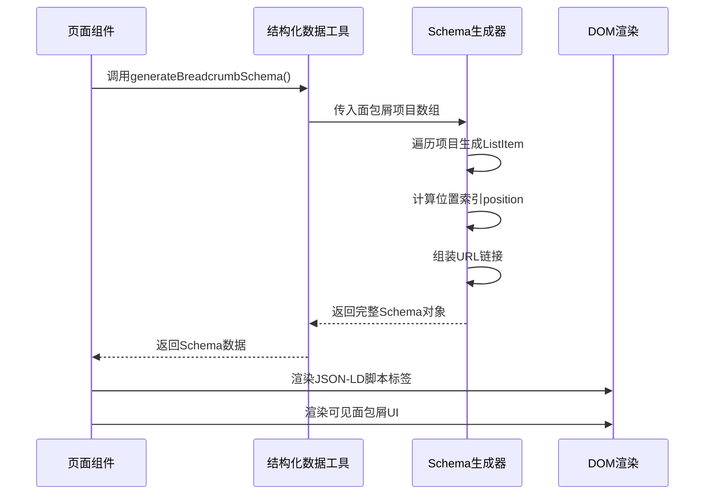
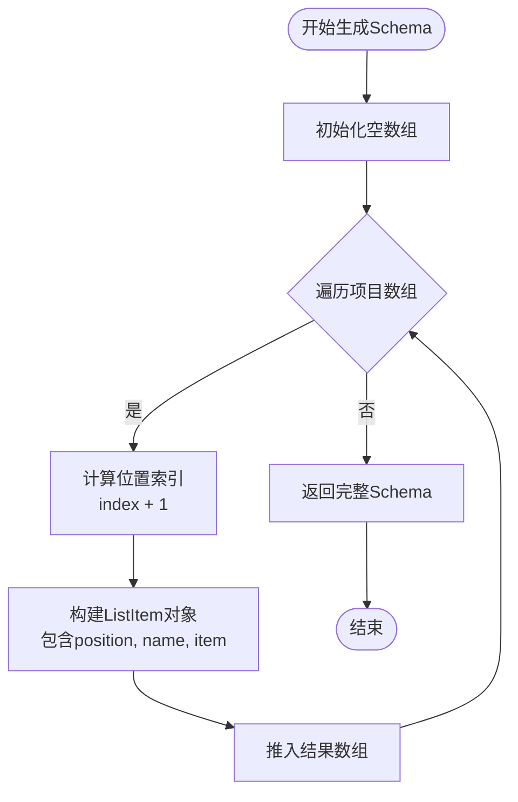
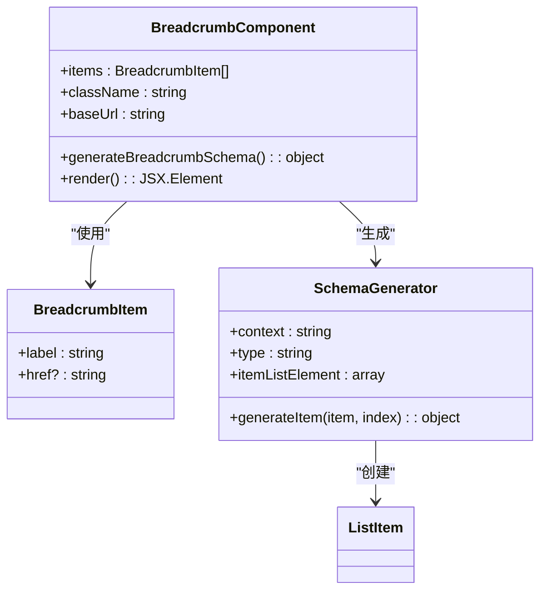
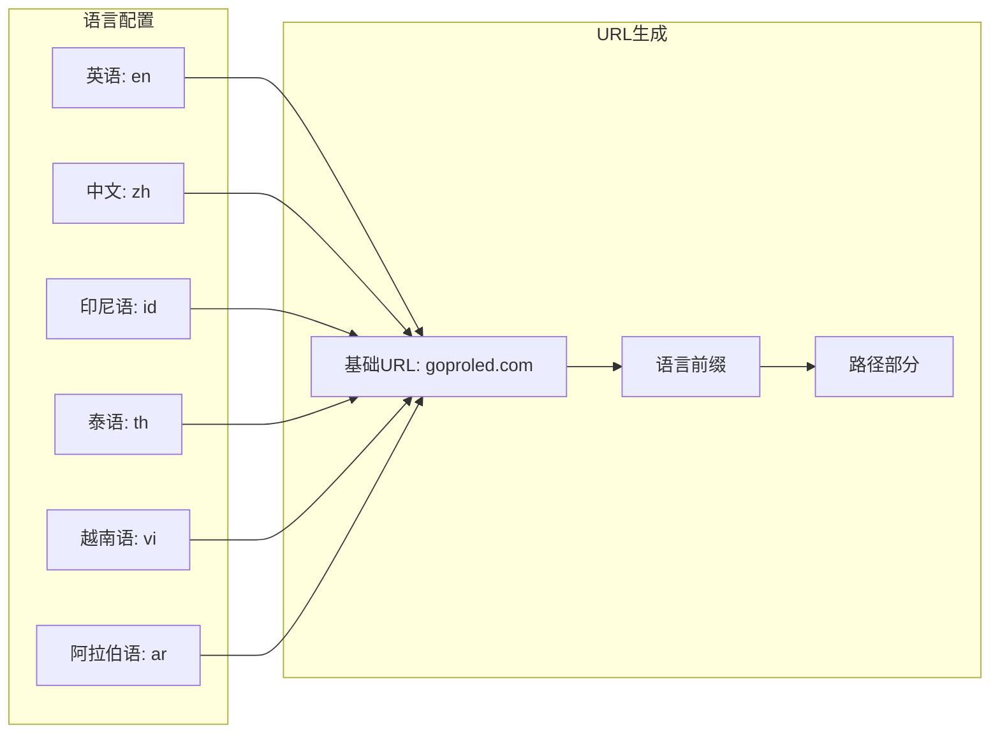
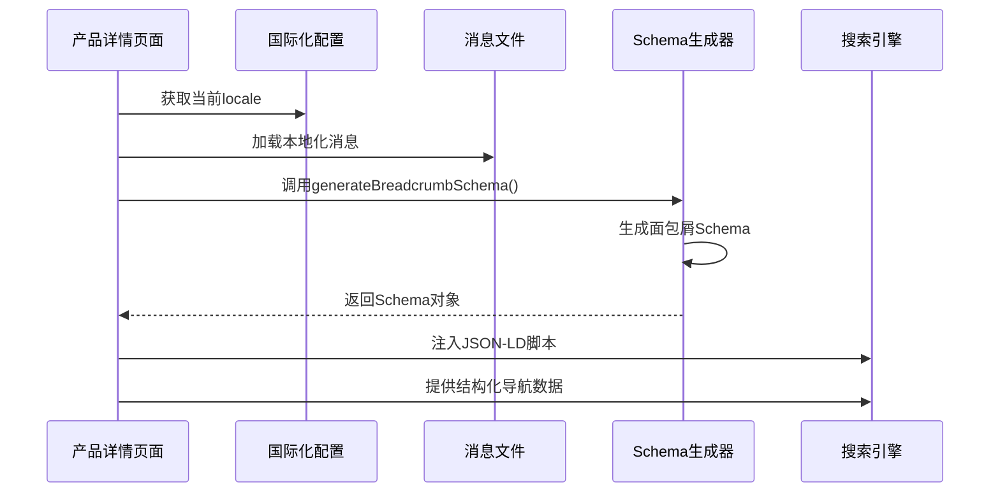
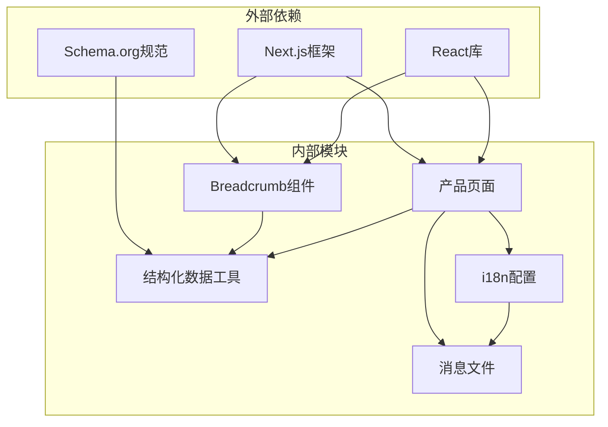

# 面包屑Schema生成

<cite>
**本文档引用的文件**
- [components/ui/breadcrumb.tsx](file://components/ui/breadcrumb.tsx)
- [lib/utils/structured-data.ts](file://lib/utils/structured-data.ts)
- [app/[locale]/products/[slug]/page.tsx](file://app/[locale]/products/[slug]/page.tsx)
- [app/[locale]/products/page.tsx](file://app/[locale]/products/page.tsx)
- [app/[locale]/layout.tsx](file://app/[locale]/layout.tsx)
- [lib/i18n/config.ts](file://lib/i18n/config.ts)
- [messages/en.json](file://messages/en.json)
- [components/layout/navbar.tsx](file://components/layout/navbar.tsx)
</cite>

## 目录
1. [简介](#简介)
2. [项目结构](#项目结构)
3. [核心组件](#核心组件)
4. [架构概览](#架构概览)
5. [详细组件分析](#详细组件分析)
6. [依赖分析](#依赖分析)
7. [性能考虑](#性能考虑)
8. [故障排除指南](#故障排除指南)
9. [结论](#结论)

## 简介
本文档深入解析了Gopro Trade网站的面包屑Schema生成系统，重点分析了`generateBreadcrumbSchema`函数的实现机制。该系统通过结构化数据标记为搜索引擎提供清晰的导航层次信息，支持多语言环境下的URL处理和本地化名称显示。系统采用Next.js路由系统集成，实现了自动化的面包屑生成流程。

## 项目结构
项目采用基于功能的模块化组织方式，面包屑Schema生成系统分布在多个关键文件中：

```mermaid
graph TB
subgraph "UI层"
Breadcrumb[面包屑组件<br/>components/ui/breadcrumb.tsx]
Navbar[导航栏组件<br/>components/layout/navbar.tsx]
end
subgraph "工具层"
StructuredData[结构化数据工具<br/>lib/utils/structured-data.ts]
I18nConfig[i18n配置<br/>lib/i18n/config.ts]
end
subgraph "页面层"
ProductPage[产品页面<br/>app/[locale]/products/page.tsx]
ProductDetailPage[产品详情页面<br/>app/[locale]/products/[slug]/page.tsx]
LocaleLayout[本地化布局<br/>app/[locale]/layout.tsx]
end
subgraph "国际化"
Messages[消息文件<br/>messages/*.json]
end
Breadcrumb --> StructuredData
ProductPage --> StructuredData
ProductDetailPage --> StructuredData
Navbar --> I18nConfig
ProductPage --> Messages
ProductDetailPage --> Messages
```

**图表来源**
- [components/ui/breadcrumb.tsx:1-87](file://components/ui/breadcrumb.tsx#L1-L87)
- [lib/utils/structured-data.ts:194-208](file://lib/utils/structured-data.ts#L194-L208)
- [app/[locale]/products/[slug]/page.tsx:1-443](file://app/[locale]/products/[slug]/page.tsx#L1-L443)

**章节来源**
- [components/ui/breadcrumb.tsx:1-87](file://components/ui/breadcrumb.tsx#L1-L87)
- [lib/utils/structured-data.ts:194-208](file://lib/utils/structured-data.ts#L194-L208)
- [app/[locale]/products/[slug]/page.tsx:1-443](file://app/[locale]/products/[slug]/page.tsx#L1-L443)

## 核心组件
面包屑Schema生成系统由三个核心组件构成：

### 1. 面包屑组件 (Breadcrumb Component)
负责渲染可见的面包屑导航UI并生成JSON-LD结构化数据。

### 2. 结构化数据工具 (Structured Data Utils)
提供专门的Schema生成函数，包括`generateBreadcrumbSchema`。

### 3. 页面集成 (Page Integration)
在具体页面中调用Schema生成函数，实现自动化的面包屑生成。

**章节来源**
- [components/ui/breadcrumb.tsx:15-34](file://components/ui/breadcrumb.tsx#L15-L34)
- [lib/utils/structured-data.ts:194-208](file://lib/utils/structured-data.ts#L194-L208)

## 架构概览
系统采用分层架构设计，实现了UI渲染与SEO优化的分离：



**图表来源**
- [lib/utils/structured-data.ts:197-207](file://lib/utils/structured-data.ts#L197-L207)
- [components/ui/breadcrumb.tsx:25-34](file://components/ui/breadcrumb.tsx#L25-L34)

## 详细组件分析

### generateBreadcrumbSchema函数实现

#### 函数签名与参数
```typescript
export function generateBreadcrumbSchema(
  items: Array<{ name: string; url: string }>, 
  locale: string
): BreadcrumbListSchema
```

#### 核心实现逻辑

**1. 参数验证与预处理**
- 接收面包屑项目数组，每个项目包含`name`和`url`属性
- 接收`locale`参数用于多语言URL处理

**2. Schema结构构建**
- 创建标准的Schema.org BreadcrumbList结构
- 为每个项目生成对应的ListItem条目

**3. 位置索引计算**


**图表来源**
- [lib/utils/structured-data.ts:201-206](file://lib/utils/structured-data.ts#L201-L206)

**4. URL链接配置逻辑**
- 使用`https://goproled.com/${locale}${item.url}`格式
- 自动添加语言前缀确保多语言环境正确性
- 支持相对路径转换为完整URL

**章节来源**
- [lib/utils/structured-data.ts:197-208](file://lib/utils/structured-data.ts#L197-L208)

### 面包屑组件内部实现

#### JSON-LD结构化数据生成
组件内部同样实现了类似的Schema生成逻辑：



**图表来源**
- [components/ui/breadcrumb.tsx:5-13](file://components/ui/breadcrumb.tsx#L5-L13)
- [components/ui/breadcrumb.tsx:25-34](file://components/ui/breadcrumb.tsx#L25-L34)

#### ListItem嵌套关系处理
组件内部的Schema生成展示了标准的嵌套关系：

| 属性名 | 类型 | 描述 | 示例值 |
|--------|------|------|--------|
| @context | string | Schema.org上下文 | https://schema.org |
| @type | string | 结构类型 | BreadcrumbList |
| itemListElement | array | ListItem数组 | [ListItem, ListItem, ...] |
| position | number | 位置索引 | 1, 2, 3, ... |
| name | string | 项目名称 | "首页", "产品", "具体产品" |
| item | string | 完整URL链接 | "https://goproled.com/zh/products/xxx" |

**章节来源**
- [components/ui/breadcrumb.tsx:25-34](file://components/ui/breadcrumb.tsx#L25-L34)

### 多语言环境下的面包屑生成

#### 语言特定的URL处理
系统支持6种语言：英语(en)、中文(zh)、印尼语(id)、泰语(th)、越南语(vi)、阿拉伯语(ar)。



**图表来源**
- [lib/i18n/config.ts:1-16](file://lib/i18n/config.ts#L1-L16)
- [lib/utils/structured-data.ts:165-191](file://lib/utils/structured-data.ts#L165-L191)

#### 本地化名称显示
通过消息文件实现多语言名称本地化：

| 语言 | 导航项 | 英文名称 |
|------|--------|----------|
| 中文 | 首页 | Home |
| 中文 | 产品 | Products |
| 中文 | 解决方案 | Solutions |
| 英语 | 首页 | Home |
| 英语 | 产品 | Products |
| 英语 | 新闻中心 | News Center |

**章节来源**
- [lib/i18n/config.ts:6-13](file://lib/i18n/config.ts#L6-L13)
- [messages/en.json:6-16](file://messages/en.json#L6-L16)

### 页面组件中的动态生成

#### 产品详情页面集成
在产品详情页面中，`generateBreadcrumbSchema`被动态调用：



**图表来源**
- [app/[locale]/products/[slug]/page.tsx:219-227](file://app/[locale]/products/[slug]/page.tsx#L219-L227)

#### 面包屑列表项生成
页面中定义的面包屑项目结构：

| 项目 | 名称来源 | URL来源 | 链接状态 |
|------|----------|---------|----------|
| 首页 | messages.navigation.home | '/' | 可点击链接 |
| 产品 | messages.navigation.products | '/products' | 可点击链接 |
| 具体产品 | 动态产品名称 | `/products/${slug}` | 当前页，不可点击 |

**章节来源**
- [app/[locale]/products/[slug]/page.tsx:220-225](file://app/[locale]/products/[slug]/page.tsx#L220-L225)

## 依赖分析

### 组件间依赖关系



**图表来源**
- [components/ui/breadcrumb.tsx:3](file://components/ui/breadcrumb.tsx#L3)
- [lib/utils/structured-data.ts:197-208](file://lib/utils/structured-data.ts#L197-L208)

### 关键依赖关系

1. **Next.js路由系统集成**
   - 使用`usePathname`和`useRouter`获取当前路由信息
   - 通过`generateStaticParams`实现静态生成

2. **国际化支持**
   - `lib/i18n/config.ts`管理语言配置
   - `messages/*.json`提供多语言文本

3. **结构化数据标准**
   - 遵循Schema.org BreadcrumbList规范
   - 确保搜索引擎正确解析导航层次

**章节来源**
- [components/layout/navbar.tsx:31-32](file://components/layout/navbar.tsx#L31-L32)
- [lib/i18n/config.ts:1-16](file://lib/i18n/config.ts#L1-L16)

## 性能考虑
系统在性能方面采用了多项优化策略：

### 1. 懒加载与按需渲染
- 面包屑组件仅在需要时渲染
- 结构化数据通过脚本标签注入，不影响首屏渲染

### 2. 缓存策略
- 使用Next.js的ISR（增量静态再生）缓存
- 产品页面设置3600秒缓存周期

### 3. 代码分割
- 国际化消息文件按需加载
- 避免不必要的JavaScript包大小

### 4. SEO优化
- 结构化数据直接注入HTML，提升搜索引擎抓取效率
- 多语言URL标准化，避免重复内容

## 故障排除指南

### 常见问题及解决方案

#### 1. 面包屑Schema生成失败
**症状**: 控制台出现TypeError或undefined错误
**原因**: 传入的items参数格式不正确
**解决**: 确保每个项目都包含`name`和`url`属性

#### 2. 多语言URL错误
**症状**: 链接指向错误的语言版本
**原因**: locale参数传递错误
**解决**: 在调用`generateBreadcrumbSchema`时正确传递当前语言

#### 3. 位置索引不正确
**症状**: Schema中标记的位置顺序错误
**原因**: 数组索引计算错误
**解决**: 确保传入的items数组顺序与导航顺序一致

#### 4. SEO测试工具报错
**症状**: Google Rich Results Test显示Schema错误
**原因**: Schema.org规范不符合要求
**解决**: 检查`@context`、`@type`等必需字段是否正确设置

**章节来源**
- [lib/utils/structured-data.ts:197-208](file://lib/utils/structured-data.ts#L197-L208)
- [components/ui/breadcrumb.tsx:25-34](file://components/ui/breadcrumb.tsx#L25-L34)

## 结论
Gopro Trade的面包屑Schema生成系统展现了现代Next.js应用的最佳实践。通过将UI渲染与SEO优化分离，系统实现了高度的模块化和可维护性。`generateBreadcrumbSchema`函数提供了简洁而强大的API，支持多语言环境下的自动化面包屑生成。

系统的关键优势包括：
- **标准化**: 严格遵循Schema.org规范
- **多语言支持**: 完善的国际化处理
- **自动化**: 与Next.js路由系统无缝集成
- **可扩展**: 易于添加新的面包屑项目
- **性能优化**: 采用多种优化策略确保最佳性能

该系统为其他Next.js项目提供了优秀的参考模板，特别是在SEO优化和国际化方面的实现方式值得借鉴。