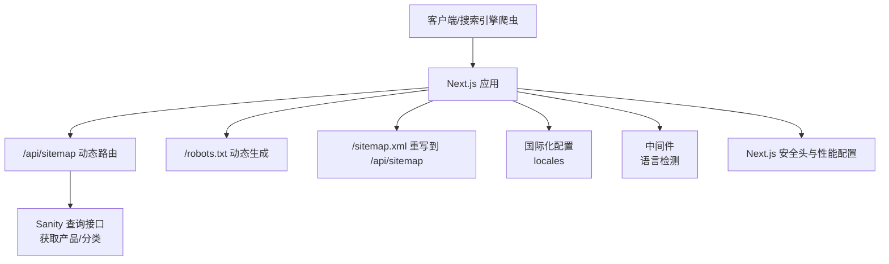
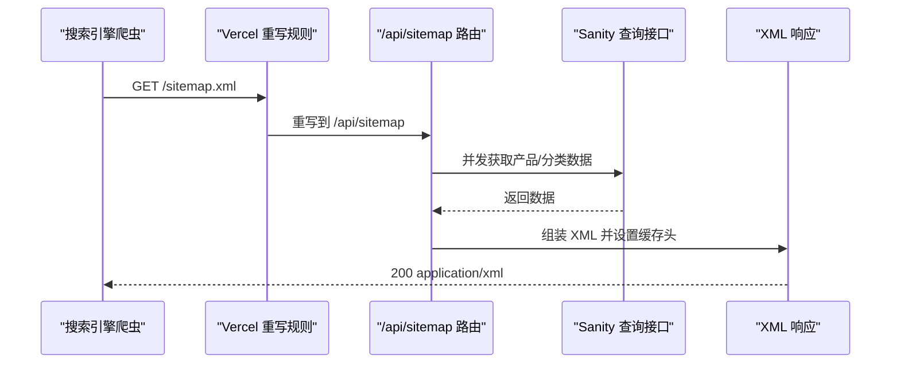
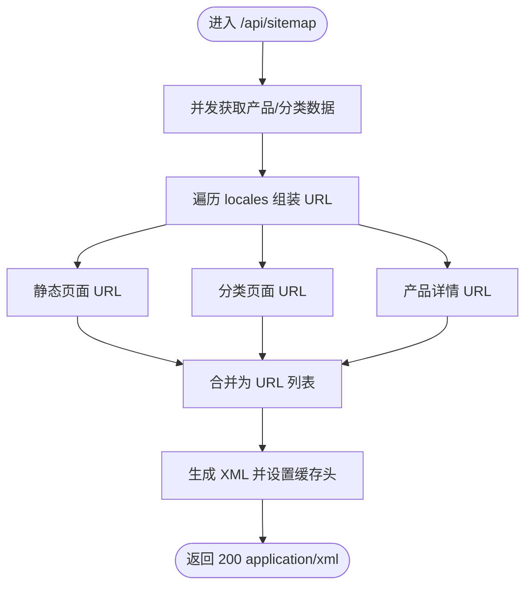
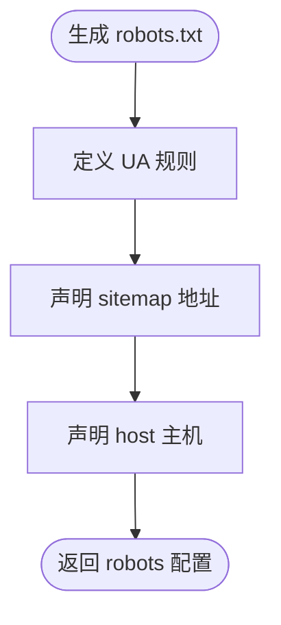
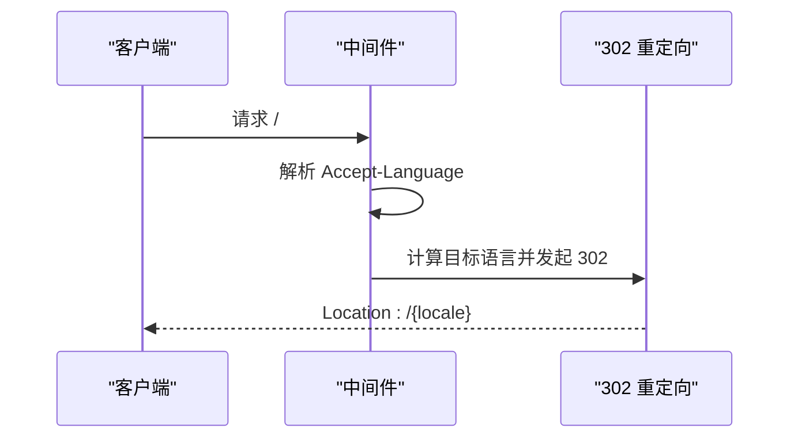
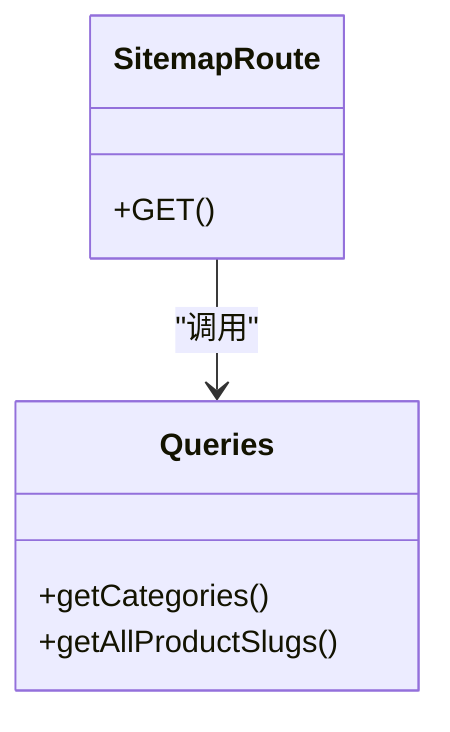
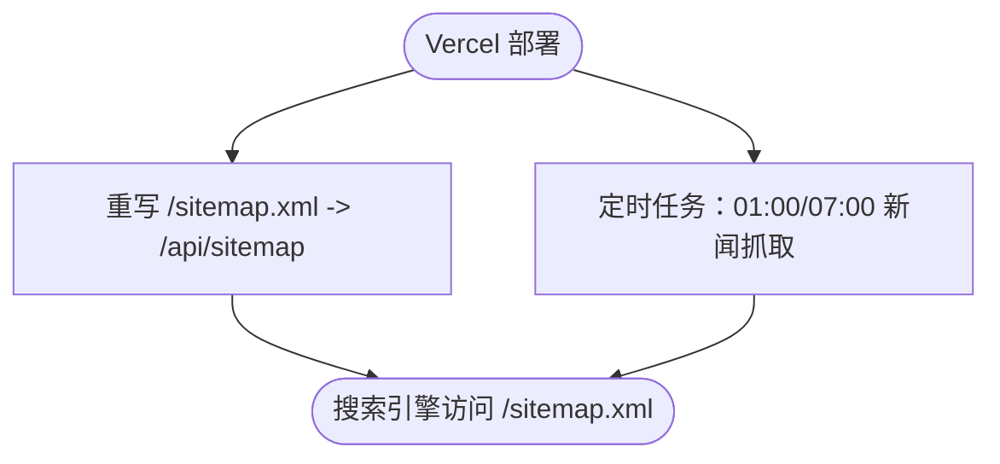
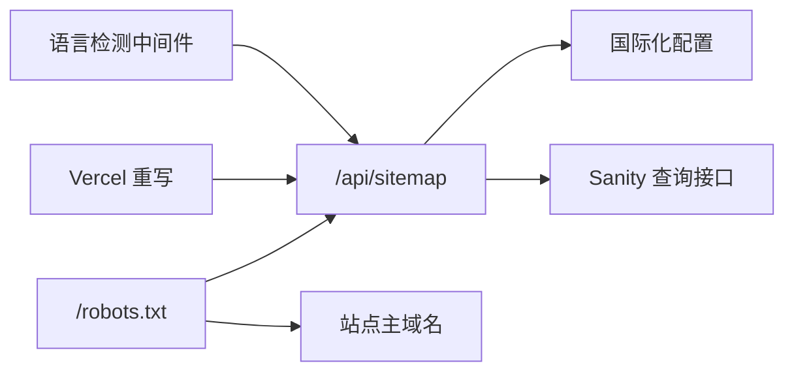

# 网站地图和索引

<cite>
**本文引用的文件**
- [app/api/sitemap/route.ts](file://app/api/sitemap/route.ts)
- [app/robots.ts](file://app/robots.ts)
- [lib/i18n/config.ts](file://lib/i18n/config.ts)
- [lib/sanity/queries.ts](file://lib/sanity/queries.ts)
- [vercel.json](file://vercel.json)
- [next.config.mjs](file://next.config.mjs)
- [middleware.ts](file://middleware.ts)
- [app/layout.tsx](file://app/layout.tsx)
- [sanity/sanity.config.ts](file://sanity/sanity.config.ts)
</cite>

## 目录
1. [简介](#简介)
2. [项目结构](#项目结构)
3. [核心组件](#核心组件)
4. [架构总览](#架构总览)
5. [详细组件分析](#详细组件分析)
6. [依赖关系分析](#依赖关系分析)
7. [性能考量](#性能考量)
8. [故障排查指南](#故障排查指南)
9. [结论](#结论)
10. [附录](#附录)

## 简介
本文件面向 GoPro Trade 网站的“网站地图与搜索引擎索引”主题，系统化梳理动态网站地图生成、robots.txt 配置与管理、Google Search Console 集成与监控、爬虫抓取策略与频率控制、sitemap 优化技巧以及验证与常见问题排查。文档以仓库现有实现为基础，结合 Next.js App Router、Vercel 平台与 Sanity CMS 的实际配置，给出可操作的实践建议。

## 项目结构
围绕“网站地图与索引”的关键目录与文件如下：
- 动态 sitemap 路由：app/api/sitemap/route.ts
- robots.txt 生成：app/robots.ts
- 国际化配置：lib/i18n/config.ts
- Sanity 查询接口：lib/sanity/queries.ts
- Vercel 重写与定时任务：vercel.json
- Next.js 配置与安全头：next.config.mjs
- 语言检测中间件：middleware.ts
- 站点元数据：app/layout.tsx
- Sanity Studio 配置：sanity/sanity.config.ts

图表来源
- [app/api/sitemap/route.ts:16-99](file://app/api/sitemap/route.ts#L16-L99)
- [app/robots.ts:3-26](file://app/robots.ts#L3-L26)
- [vercel.json:27-32](file://vercel.json#L27-L32)
- [lib/i18n/config.ts:1-16](file://lib/i18n/config.ts#L1-L16)
- [lib/sanity/queries.ts:4-13](file://lib/sanity/queries.ts#L4-L13)
- [middleware.ts:44-63](file://middleware.ts#L44-L63)
- [next.config.mjs:35-61](file://next.config.mjs#L35-L61)

章节来源
- [app/api/sitemap/route.ts:16-99](file://app/api/sitemap/route.ts#L16-L99)
- [app/robots.ts:3-26](file://app/robots.ts#L3-L26)
- [vercel.json:27-32](file://vercel.json#L27-L32)
- [lib/i18n/config.ts:1-16](file://lib/i18n/config.ts#L1-L16)
- [lib/sanity/queries.ts:4-13](file://lib/sanity/queries.ts#L4-L13)
- [middleware.ts:44-63](file://middleware.ts#L44-L63)
- [next.config.mjs:35-61](file://next.config.mjs#L35-L61)

## 核心组件
- 动态 sitemap 生成器：负责聚合静态页面、产品详情页、分类页等 URL，输出带图片扩展的 XML sitemap，并设置缓存头。
- robots.txt 生成器：定义各 UA 的允许/禁止路径，声明 sitemap 地址与主机。
- 国际化与语言检测：提供 locales 列表，中间件根据浏览器语言进行根路径重定向。
- Sanity 查询层：提供分类与产品 slug 的查询能力，供 sitemap 动态组装 URL。
- Vercel 重写与定时任务：将 /sitemap.xml 重写到 /api/sitemap；配置定时任务抓取新闻。
- Next.js 配置：统一安全头、图片优化、压缩与打包优化。

章节来源
- [app/api/sitemap/route.ts:8-14](file://app/api/sitemap/route.ts#L8-L14)
- [app/robots.ts:6-25](file://app/robots.ts#L6-L25)
- [lib/i18n/config.ts:1-16](file://lib/i18n/config.ts#L1-L16)
- [lib/sanity/queries.ts:91-94](file://lib/sanity/queries.ts#L91-L94)
- [vercel.json:27-42](file://vercel.json#L27-L42)
- [next.config.mjs:35-61](file://next.config.mjs#L35-L61)

## 架构总览
下图展示了从请求到响应的关键链路：客户端或搜索引擎爬虫访问 /sitemap.xml，Vercel 将其重写到 /api/sitemap；该路由动态读取 Sanity 数据，拼装 URL 并返回 XML；robots.txt 动态声明 sitemap 地址与主机。

图表来源
- [vercel.json:27-32](file://vercel.json#L27-L32)
- [app/api/sitemap/route.ts:23-31](file://app/api/sitemap/route.ts#L23-L31)
- [lib/sanity/queries.ts:24-27](file://lib/sanity/queries.ts#L24-L27)

## 详细组件分析

### 动态网站地图生成器
- 功能要点
  - 动态路由标记：强制运行时获取数据，确保 sitemap 最新。
  - URL 组装：遍历 locales，拼接静态页面、分类页、产品详情页的完整 URL。
  - 数据来源：并发调用 getAllProductSlugs 与 getCategories，失败时降级为空数组。
  - 输出格式：标准 sitemap XML，包含 lastmod、changefreq、priority；支持图片扩展字段。
  - 缓存策略：设置合理的 Cache-Control，平衡新鲜度与性能。
- 关键实现位置
  - 动态标记与并发数据获取：[app/api/sitemap/route.ts:6](file://app/api/sitemap/route.ts#L6)、[app/api/sitemap/route.ts:23-31](file://app/api/sitemap/route.ts#L23-L31)
  - URL 组装与 XML 输出：[app/api/sitemap/route.ts:41-91](file://app/api/sitemap/route.ts#L41-L91)
  - 缓存头设置：[app/api/sitemap/route.ts:93-98](file://app/api/sitemap/route.ts#L93-L98)

图表来源
- [app/api/sitemap/route.ts:16-99](file://app/api/sitemap/route.ts#L16-L99)

章节来源
- [app/api/sitemap/route.ts:6-14](file://app/api/sitemap/route.ts#L6-L14)
- [app/api/sitemap/route.ts:16-99](file://app/api/sitemap/route.ts#L16-L99)
- [lib/sanity/queries.ts:91-94](file://lib/sanity/queries.ts#L91-L94)

### robots.txt 生成与管理
- 规则设计
  - 通用规则：允许根路径，禁止 /api/、/studio/、/_next/ 等内部路径。
  - Googlebot：允许所有路径，但禁止 /api/。
  - Googlebot-Image：允许所有路径，便于图片索引。
- 声明与主机
  - sitemap：指向 /api/sitemap。
  - host：指向站点主域名。
- 关键实现位置
  - 机器人规则与 sitemap 声明：[app/robots.ts:6-25](file://app/robots.ts#L6-L25)

图表来源
- [app/robots.ts:3-26](file://app/robots.ts#L3-L26)

章节来源
- [app/robots.ts:3-26](file://app/robots.ts#L3-L26)

### 国际化与语言检测
- locales 列表：en、zh、id、th、vi、ar。
- 语言检测中间件：根据 Accept-Language 选择目标语言，根路径 302 临时重定向并禁用缓存。
- 关键实现位置
  - 国际化配置：[lib/i18n/config.ts:1-16](file://lib/i18n/config.ts#L1-L16)
  - 语言检测与重定向：[middleware.ts:21-63](file://middleware.ts#L21-L63)

图表来源
- [lib/i18n/config.ts:1-16](file://lib/i18n/config.ts#L1-L16)
- [middleware.ts:44-63](file://middleware.ts#L44-L63)

章节来源
- [lib/i18n/config.ts:1-16](file://lib/i18n/config.ts#L1-L16)
- [middleware.ts:21-63](file://middleware.ts#L21-L63)

### Sanity 数据查询与 URL 动态获取
- 分类查询：返回分类列表，供 sitemap 生成分类页 URL。
- 产品 slug 查询：返回所有产品 slug，供 sitemap 生成产品详情页 URL。
- 查询缓存：revalidate 设置为 3600 秒，平衡新鲜度与性能。
- 关键实现位置
  - 分类查询：[lib/sanity/queries.ts:4-13](file://lib/sanity/queries.ts#L4-L13)
  - 产品 slug 查询：[lib/sanity/queries.ts:91-94](file://lib/sanity/queries.ts#L91-L94)

图表来源
- [lib/sanity/queries.ts:4-13](file://lib/sanity/queries.ts#L4-L13)
- [lib/sanity/queries.ts:91-94](file://lib/sanity/queries.ts#L91-L94)
- [app/api/sitemap/route.ts:23-31](file://app/api/sitemap/route.ts#L23-L31)

章节来源
- [lib/sanity/queries.ts:4-13](file://lib/sanity/queries.ts#L4-L13)
- [lib/sanity/queries.ts:91-94](file://lib/sanity/queries.ts#L91-L94)
- [app/api/sitemap/route.ts:23-31](file://app/api/sitemap/route.ts#L23-L31)

### Vercel 集成与定时任务
- /sitemap.xml 到 /api/sitemap 的重写，确保搜索引擎访问 /sitemap.xml 时得到正确响应。
- 定时任务：每日 01:00 与 07:00 抓取新闻，保障内容新鲜度。
- 关键实现位置
  - 重写规则：[vercel.json:27-32](file://vercel.json#L27-L32)
  - 定时任务：[vercel.json:33-42](file://vercel.json#L33-L42)

图表来源
- [vercel.json:27-42](file://vercel.json#L27-L42)

章节来源
- [vercel.json:27-42](file://vercel.json#L27-L42)

### Next.js 配置与安全头
- 图片优化：启用现代格式与设备尺寸配置，提升 LCP 指标。
- 压缩与安全头：全局设置 X-Content-Type-Options、X-Frame-Options、Referrer-Policy 等。
- 关键实现位置
  - 图片与压缩配置：[next.config.mjs:4-26](file://next.config.mjs#L4-L26)
  - 自定义安全头：[next.config.mjs:35-61](file://next.config.mjs#L35-L61)

章节来源
- [next.config.mjs:4-26](file://next.config.mjs#L4-L26)
- [next.config.mjs:35-61](file://next.config.mjs#L35-L61)

### 站点元数据与 Sanity Studio
- 站点元数据：title 与 description，有助于搜索引擎理解站点主题。
- Sanity Studio：支持中英文界面，便于维护内容与 SEO 字段。
- 关键实现位置
  - 站点元数据：[app/layout.tsx:3-6](file://app/layout.tsx#L3-L6)
  - Sanity Studio 多语言：[sanity/sanity.config.ts:28-31](file://sanity/sanity.config.ts#L28-L31)

章节来源
- [app/layout.tsx:3-6](file://app/layout.tsx#L3-L6)
- [sanity/sanity.config.ts:28-31](file://sanity/sanity.config.ts#L28-L31)

## 依赖关系分析
- 组件耦合
  - /api/sitemap 依赖国际化配置与 Sanity 查询接口。
  - robots.txt 依赖站点主域名与 sitemap 路径。
  - Vercel 重写将 /sitemap.xml 映射到 /api/sitemap。
  - 中间件影响根路径行为，间接影响爬虫的起始抓取路径。
- 外部依赖
  - Sanity CMS 提供产品与分类数据。
  - Vercel 提供重写与定时任务能力。

图表来源
- [app/api/sitemap/route.ts:2-3](file://app/api/sitemap/route.ts#L2-L3)
- [lib/i18n/config.ts:1-16](file://lib/i18n/config.ts#L1-L16)
- [lib/sanity/queries.ts:1-1](file://lib/sanity/queries.ts#L1-L1)
- [app/robots.ts:4](file://app/robots.ts#L4)
- [vercel.json:27-32](file://vercel.json#L27-L32)
- [middleware.ts:44-63](file://middleware.ts#L44-L63)

章节来源
- [app/api/sitemap/route.ts:2-3](file://app/api/sitemap/route.ts#L2-L3)
- [lib/i18n/config.ts:1-16](file://lib/i18n/config.ts#L1-L16)
- [lib/sanity/queries.ts:1-1](file://lib/sanity/queries.ts#L1-L1)
- [app/robots.ts:4](file://app/robots.ts#L4)
- [vercel.json:27-32](file://vercel.json#L27-L32)
- [middleware.ts:44-63](file://middleware.ts#L44-L63)

## 性能考量
- 缓存策略
  - sitemap 路由设置 Cache-Control，兼顾新鲜度与性能。
  - Sanity 查询设置 revalidate，降低数据库压力。
- 压缩与安全头
  - 启用 gzip 压缩与安全头，提升传输效率与安全性。
- 图片优化
  - 启用现代图片格式与设备尺寸配置，改善 Core Web Vitals 指标。
- 重写与定时任务
  - 通过 /sitemap.xml 重写简化搜索引擎访问路径。
  - 定时任务保持新闻内容更新，间接提升索引质量。

章节来源
- [app/api/sitemap/route.ts:93-98](file://app/api/sitemap/route.ts#L93-L98)
- [lib/sanity/queries.ts:12](file://lib/sanity/queries.ts#L12)
- [next.config.mjs:22-26](file://next.config.mjs#L22-L26)
- [next.config.mjs:35-61](file://next.config.mjs#L35-L61)
- [vercel.json:27-42](file://vercel.json#L27-L42)

## 故障排查指南
- sitemap 无法访问
  - 检查 /sitemap.xml 是否被正确重写到 /api/sitemap。
  - 确认 /api/sitemap 路由是否返回 200 且 Content-Type 为 application/xml。
  - 关注并发数据获取异常时的降级逻辑。
- robots.txt 不生效
  - 确认 robots() 返回的 sitemap 地址与 host 正确。
  - 检查 UA 规则是否过于严格导致爬虫被拒。
- 爬虫抓取频率过高
  - 在 sitemap 中合理设置 changefreq 与 priority。
  - 结合 robots.txt 的 Allow/Disallow 控制抓取范围。
- 数据未更新
  - 检查 Sanity 查询的 revalidate 是否过短或过长。
  - 确认 Vercel 重写与定时任务配置是否正确。
- 语言重定向影响抓取
  - 根路径重定向可能影响搜索引擎对首页的抓取，需关注 UA 行为差异。

章节来源
- [vercel.json:27-32](file://vercel.json#L27-L32)
- [app/api/sitemap/route.ts:23-31](file://app/api/sitemap/route.ts#L23-L31)
- [app/robots.ts:6-25](file://app/robots.ts#L6-L25)
- [lib/sanity/queries.ts:12](file://lib/sanity/queries.ts#L12)
- [middleware.ts:44-63](file://middleware.ts#L44-L63)

## 结论
本项目通过“动态 sitemap + robots.txt + Vercel 重写 + 定时任务 + 国际化中间件 + Next.js 安全与性能配置”的组合，实现了可维护、可扩展、可监控的搜索引擎索引体系。建议持续关注数据源稳定性、缓存策略与爬虫行为，配合 Google Search Console 进行监控与优化。

## 附录
- Google Search Console 集成与监控
  - 在 Search Console 中提交站点并验证所有权。
  - 添加 /api/sitemap 作为 sitemap 地址，定期检查索引状态与覆盖率。
  - 关注“爬取错误”、“索引问题”等报告，结合 robots.txt 与 sitemap 内容进行修复。
- 爬虫抓取策略与频率控制
  - 使用 robots.txt 对敏感路径进行限制。
  - 在 sitemap 中为不同类型的页面设置合理的 changefreq 与 priority。
  - 通过缓存头与 revalidate 控制更新频率。
- sitemap 优化技巧
  - 更新频率：首页/产品列表可设为 daily，详情页 weekly，静态页 monthly。
  - 优先级：首页最高，产品详情次之，静态页较低。
  - 最后修改时间：使用服务器当前时间，确保搜索引擎及时发现更新。
- sitemap 验证工具与常见问题
  - 使用在线 XML 验证工具检查 sitemap 格式。
  - 若出现“无法解析 sitemap”错误，检查 Content-Type 与编码。
  - 若部分页面未被索引，检查 robots.txt 规则与 sitemap URL 是否正确。