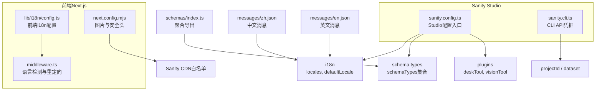
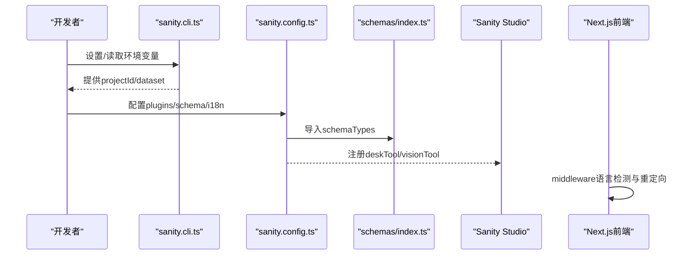
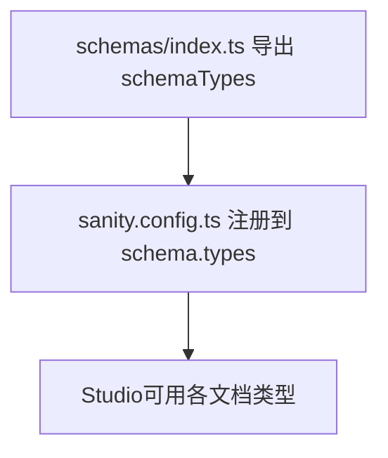
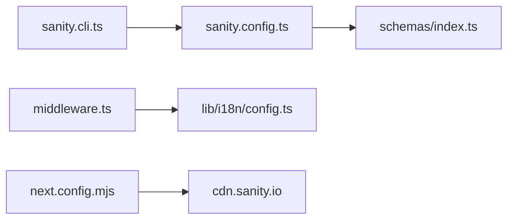

# Sanity配置管理

<cite>
**本文引用的文件**
- [sanity.config.ts](file://sanity/sanity.config.ts)
- [sanity.cli.ts](file://sanity/sanity.cli.ts)
- [package.json](file://sanity/package.json)
- [schemas/index.ts](file://sanity/schemas/index.ts)
- [schemas/article.ts](file://sanity/schemas/article.ts)
- [schemas/product.ts](file://sanity/schemas/product.ts)
- [schemas/category.ts](file://sanity/schemas/category.ts)
- [schemas/inquiry.ts](file://sanity/schemas/inquiry.ts)
- [next.config.mjs](file://next.config.mjs)
- [middleware.ts](file://middleware.ts)
- [lib/i18n/config.ts](file://lib/i18n/config.ts)
- [messages/zh.json](file://messages/zh.json)
- [messages/en.json](file://messages/en.json)
</cite>

## 目录
1. [简介](#简介)
2. [项目结构](#项目结构)
3. [核心组件](#核心组件)
4. [架构总览](#架构总览)
5. [详细组件分析](#详细组件分析)
6. [依赖关系分析](#依赖关系分析)
7. [性能考量](#性能考量)
8. [故障排查指南](#故障排查指南)
9. [结论](#结论)
10. [附录](#附录)

## 简介
本文件系统化梳理并文档化了该项目的Sanity配置管理，重点覆盖以下方面：
- sanity.config.ts中的配置项：项目ID、数据集、插件（deskTool、visionTool）、schemaTypes导入与注册、国际化（i18n）设置。
- 环境变量使用：SANITY_STUDIO_PROJECT_ID与SANITY_STUDIO_DATASET的优先级与回退策略。
- 国际化设置：Studio界面的中英文支持与多语言字段设计。
- schemaTypes的导入与注册机制：如何集中导出并注入到配置。
- 生产与开发环境的最佳实践差异。
- 常见配置问题的排查与解决。

## 项目结构
Sanity配置位于独立的sanity目录中，采用模块化的Schema组织方式，CLI与Studio共享API凭据配置，前端Next.js通过中间件与i18n配置实现语言检测与重定向。

图表来源
- [sanity.config.ts:11-32](file://sanity/sanity.config.ts#L11-L32)
- [sanity.cli.ts:3-8](file://sanity/sanity.cli.ts#L3-L8)
- [schemas/index.ts:1-9](file://sanity/schemas/index.ts#L1-L9)
- [messages/zh.json:1-200](file://messages/zh.json#L1-L200)
- [messages/en.json:1-200](file://messages/en.json#L1-L200)
- [lib/i18n/config.ts:1-16](file://lib/i18n/config.ts#L1-L16)
- [middleware.ts:44-63](file://middleware.ts#L44-L63)
- [next.config.mjs:11-16](file://next.config.mjs#L11-L16)

章节来源
- [sanity.config.ts:1-33](file://sanity/sanity.config.ts#L1-L33)
- [sanity.cli.ts:1-9](file://sanity/sanity.cli.ts#L1-L9)
- [schemas/index.ts:1-9](file://sanity/schemas/index.ts#L1-L9)
- [messages/zh.json:1-200](file://messages/zh.json#L1-L200)
- [messages/en.json:1-200](file://messages/en.json#L1-L200)
- [lib/i18n/config.ts:1-16](file://lib/i18n/config.ts#L1-L16)
- [middleware.ts:1-68](file://middleware.ts#L1-L68)
- [next.config.mjs:1-65](file://next.config.mjs#L1-L65)

## 核心组件
- Studio配置入口：定义项目名称、标题、项目ID、数据集、插件、schemaTypes以及国际化。
- CLI配置：统一提供API凭据（项目ID与数据集），便于部署与构建。
- Schema聚合：将多个文档类型集中导出，供Studio配置注册。
- 国际化：Studio界面支持中英文；Schema层支持多语言字段（含6种语言）。
- 前端语言检测：基于浏览器语言与映射表进行根路径重定向。

章节来源
- [sanity.config.ts:11-32](file://sanity/sanity.config.ts#L11-L32)
- [sanity.cli.ts:3-8](file://sanity/sanity.cli.ts#L3-L8)
- [schemas/index.ts:1-9](file://sanity/schemas/index.ts#L1-L9)
- [lib/i18n/config.ts:1-16](file://lib/i18n/config.ts#L1-L16)
- [middleware.ts:44-63](file://middleware.ts#L44-L63)

## 架构总览
下图展示了Studio配置、Schema、CLI与前端i18n之间的交互关系。

图表来源
- [sanity.cli.ts:3-8](file://sanity/sanity.cli.ts#L3-L8)
- [sanity.config.ts:11-32](file://sanity/sanity.config.ts#L11-L32)
- [schemas/index.ts:1-9](file://sanity/schemas/index.ts#L1-L9)
- [middleware.ts:44-63](file://middleware.ts#L44-L63)

## 详细组件分析

### Studio配置（sanity.config.ts）
- 项目ID与数据集
  - 优先级：环境变量SANITY_STUDIO_PROJECT_ID > NEXT_PUBLIC_SANITY_PROJECT_ID > 默认值。
  - 数据集同理：SANITY_STUDIO_DATASET/NEXT_PUBLIC_SANITY_DATASET > 默认值。
- 插件
  - deskTool：可视化内容编辑与树形导航。
  - visionTool：内置查询与可视化工具。
- Schema注册
  - 通过schemaTypes集中导入并注册到types数组。
- 国际化（Studio界面）
  - locales包含['zh','en']，默认语言为'zh'。

章节来源
- [sanity.config.ts:7-16](file://sanity/sanity.config.ts#L7-L16)
- [sanity.config.ts:18-21](file://sanity/sanity.config.ts#L18-L21)
- [sanity.config.ts:23-25](file://sanity/sanity.config.ts#L23-L25)
- [sanity.config.ts:28-31](file://sanity/sanity.config.ts#L28-L31)

### CLI配置（sanity.cli.ts）
- 作用：为sanity dev/build/deploy提供API凭据。
- 与Studio配置一致的环境变量解析策略，确保两端一致性。

章节来源
- [sanity.cli.ts:3-8](file://sanity/sanity.cli.ts#L3-L8)

### Schema聚合与注册（schemas/index.ts）
- 聚合导出：将product、category、productSpec、article、articleCategory、inquiry六个文档类型集中导出为schemaTypes。
- 注册机制：在sanity.config.ts中通过schema.types: { types: schemaTypes }完成注册。

图表来源
- [schemas/index.ts:1-9](file://sanity/schemas/index.ts#L1-L9)
- [sanity.config.ts:23-25](file://sanity/sanity.config.ts#L23-L25)

章节来源
- [schemas/index.ts:1-9](file://sanity/schemas/index.ts#L1-L9)
- [sanity.config.ts:23-25](file://sanity/sanity.config.ts#L23-L25)

### 文档类型示例（Article/产品/分类/询单）
- Article（资讯文章）
  - 多语言字段：标题、摘要、正文、SEO元信息等均支持6种语言。
  - 关键字段：slug、category、tags、coverImage、author、publishedAt、status、source、seo、viewCount、isFeatured。
  - 预览与排序：preview.select与orderings按发布时间降序。
- Product（产品）
  - 多语言字段：名称、描述、简短描述、特性、应用场景等支持6种语言。
  - 关键字段：slug、model、category、mainImage、gallery、specifications、targetMarkets、seo、status、orderRank、datasheet。
  - 预览：选择名称、型号与主图。
- Category（产品分类）
  - 多语言字段：名称、描述支持6种语言。
  - 关键字段：slug、parent（父子分类）、icon、orderRank。
- Inquiry（询单）
  - 关键字段：公司名、联系人、邮箱、电话、国家/地区、产品意向、数量、需求详情、语言、状态、提交时间、跟进备注。
  - 预览与排序：按提交时间升序/降序排列。

章节来源
- [schemas/article.ts:4-265](file://sanity/schemas/article.ts#L4-L265)
- [schemas/product.ts:4-233](file://sanity/schemas/product.ts#L4-L233)
- [schemas/category.ts:4-74](file://sanity/schemas/category.ts#L4-L74)
- [schemas/inquiry.ts:8-134](file://sanity/schemas/inquiry.ts#L8-L134)

### 国际化设置（Studio界面与Schema层）
- Studio界面国际化
  - 在sanity.config.ts中通过i18n配置locales与defaultLocale，实现中英文界面切换。
- Schema层多语言字段
  - 文章与产品等文档类型的标题、描述、SEO元信息等均采用object类型，包含zh与en字段，并扩展至6种语言。
  - 这些字段在Studio中可分别输入不同语言版本，满足多语言内容管理需求。

章节来源
- [sanity.config.ts:28-31](file://sanity/sanity.config.ts#L28-L31)
- [schemas/article.ts:9-28](file://sanity/schemas/article.ts#L9-L28)
- [schemas/article.ts:52-66](file://sanity/schemas/article.ts#L52-L66)
- [schemas/article.ts:68-129](file://sanity/schemas/article.ts#L68-L129)
- [schemas/product.ts:9-22](file://sanity/schemas/product.ts#L9-L22)
- [schemas/product.ts:47-73](file://sanity/schemas/product.ts#L47-L73)
- [schemas/product.ts:100-128](file://sanity/schemas/product.ts#L100-L128)

### 前端语言检测与重定向（middleware.ts 与 lib/i18n/config.ts）
- 语言检测
  - middleware.ts根据Accept-Language请求头解析浏览器首选语言，映射到受支持的语言集合。
  - 映射规则：如zh、zh-cn、zh-tw、zh-hk统一映射为zh；en系列映射为en；其他如id、ms映射为id；th为th；vi为vi；ar为ar。
- 重定向策略
  - 对根路径'/'进行302临时重定向至检测到的语言路径，同时设置禁止缓存的响应头。
- 默认语言
  - lib/i18n/config.ts定义默认语言为'en'，与Studio默认语言'zh'不同，需注意前后端一致性。

章节来源
- [middleware.ts:21-42](file://middleware.ts#L21-L42)
- [middleware.ts:44-63](file://middleware.ts#L44-L63)
- [lib/i18n/config.ts:4](file://lib/i18n/config.ts#L4)

### 环境变量使用与最佳实践
- 环境变量
  - 项目ID：SANITY_STUDIO_PROJECT_ID 或 NEXT_PUBLIC_SANITY_PROJECT_ID（Studio与CLI均使用相同解析逻辑）。
  - 数据集：SANITY_STUDIO_DATASET 或 NEXT_PUBLIC_SANITY_DATASET（Studio与CLI均使用相同解析逻辑）。
- 开发环境
  - 使用本地或测试数据集，避免误操作生产数据。
  - 可在本地设置NEXT_PUBLIC_*变量以便在某些场景下读取（注意仅在客户端可见的变量命名前缀）。
- 生产环境
  - 严格区分SANITY_STUDIO_PROJECT_ID与SANITY_STUDIO_DATASET，确保与部署平台的密钥管理一致。
  - CLI与Studio使用同一套凭据，避免配置漂移导致部署失败。

章节来源
- [sanity.config.ts:7-9](file://sanity/sanity.config.ts#L7-L9)
- [sanity.cli.ts:5-6](file://sanity/sanity.cli.ts#L5-L6)

## 依赖关系分析
- 组件耦合
  - sanity.config.ts依赖schemas/index.ts提供的schemaTypes。
  - sanity.cli.ts与sanity.config.ts共享相同的API凭据解析策略，降低配置不一致风险。
  - 前端middleware.ts与lib/i18n/config.ts共同决定语言检测与默认语言，与Studio的i18n配置形成互补。
- 外部依赖
  - @sanity/vision与sanity为Studio运行时依赖。
  - Next.js通过next.config.mjs配置图片与安全响应头，其中remotePatterns包含cdn.sanity.io，便于在前端渲染Sanity媒体资源。

图表来源
- [sanity.config.ts:23-25](file://sanity/sanity.config.ts#L23-L25)
- [schemas/index.ts:1-9](file://sanity/schemas/index.ts#L1-L9)
- [sanity.cli.ts:3-8](file://sanity/sanity.cli.ts#L3-L8)
- [middleware.ts:44-63](file://middleware.ts#L44-L63)
- [lib/i18n/config.ts:1-16](file://lib/i18n/config.ts#L1-L16)
- [next.config.mjs:11-16](file://next.config.mjs#L11-L16)

章节来源
- [package.json:10-14](file://sanity/package.json#L10-L14)
- [next.config.mjs:11-16](file://next.config.mjs#L11-L16)

## 性能考量
- 图片优化：Next.js配置支持现代图片格式（AVIF/WebP），并设置远程图片域名白名单（cdn.sanity.io），有助于提升LCP等指标。
- 安全响应头：统一设置X-Content-Type-Options、X-Frame-Options、Referrer-Policy等，增强安全性。
- 缓存策略：静态资源与字体文件设置长期缓存；根路径重定向响应头设置禁止缓存，避免语言检测被缓存。

章节来源
- [next.config.mjs:4-17](file://next.config.mjs#L4-L17)
- [next.config.mjs:35-61](file://next.config.mjs#L35-L61)

## 故障排查指南
- 无法连接到Sanity
  - 检查环境变量是否正确设置：SANITY_STUDIO_PROJECT_ID与SANITY_STUDIO_DATASET。
  - 确认CLI与Studio使用同一套凭据，避免因配置不一致导致连接失败。
- Studio界面语言异常
  - 确认sanity.config.ts中的i18n配置locales与defaultLocale与预期一致。
  - 若前端语言检测与Studio界面语言不一致，需协调前端默认语言与Studio默认语言。
- Schema字段缺失或显示异常
  - 确认schemas/index.ts已正确导出所需文档类型，并已在sanity.config.ts中注册。
  - 检查多语言字段的object结构是否完整，确保包含zh与en等必要语言键。
- 前端根路径未按预期重定向
  - 检查middleware.ts中的语言映射表与Accept-Language请求头解析逻辑。
  - 确保仅对'/'路径进行重定向，且设置了禁止缓存的响应头。

章节来源
- [sanity.config.ts:7-16](file://sanity/sanity.config.ts#L7-L16)
- [sanity.cli.ts:5-6](file://sanity/sanity.cli.ts#L5-L6)
- [schemas/index.ts:1-9](file://sanity/schemas/index.ts#L1-L9)
- [middleware.ts:44-63](file://middleware.ts#L44-L63)

## 结论
本项目通过清晰的配置分层（Studio配置、CLI配置、Schema聚合、前端i18n）实现了稳定、可维护的Sanity配置管理。建议在团队内统一环境变量命名规范与默认值策略，确保开发与生产环境的一致性；同时在Schema层面持续完善多语言字段覆盖，提升内容管理的灵活性与可扩展性。

## 附录
- 环境变量清单
  - SANITY_STUDIO_PROJECT_ID：Studio项目ID（优先）
  - NEXT_PUBLIC_SANITY_PROJECT_ID：备用项目ID
  - SANITY_STUDIO_DATASET：Studio数据集（优先）
  - NEXT_PUBLIC_SANITY_DATASET：备用数据集
- 前端语言映射参考
  - zh/zh-cn/zh-tw/zh-hk → zh
  - en/en-us/en-gb → en
  - id/ms → id
  - th → th
  - vi → vi
  - ar → ar