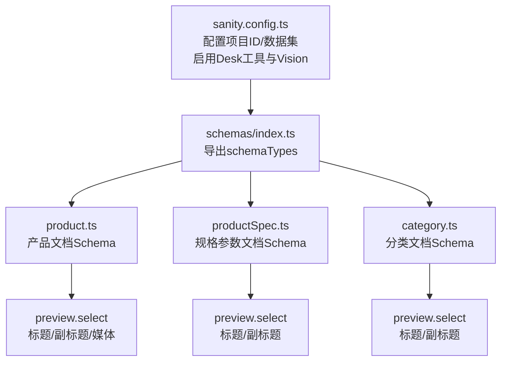
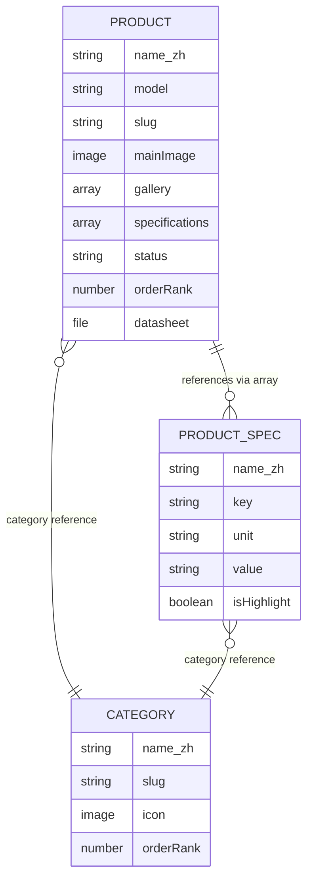
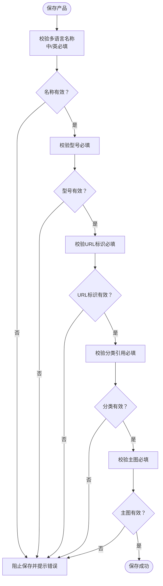
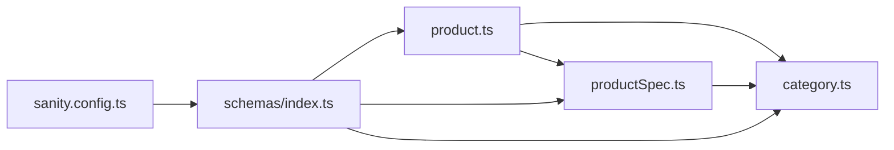

# 产品模型

<cite>
**本文引用的文件**
- [product.ts](file://sanity/schemas/product.ts)
- [productSpec.ts](file://sanity/schemas/productSpec.ts)
- [category.ts](file://sanity/schemas/category.ts)
- [index.ts](file://sanity/schemas/index.ts)
- [sanity.config.ts](file://sanity/sanity.config.ts)
</cite>

## 目录
1. [简介](#简介)
2. [项目结构](#项目结构)
3. [核心组件](#核心组件)
4. [架构总览](#架构总览)
5. [详细组件分析](#详细组件分析)
6. [依赖分析](#依赖分析)
7. [性能考虑](#性能考虑)
8. [故障排查指南](#故障排查指南)
9. [结论](#结论)
10. [附录](#附录)

## 简介
本文件系统性地文档化产品模型（Product Schema）与规格模型（ProductSpec）的设计与实现，覆盖以下关键主题：
- 完整字段定义：产品基本信息（名称、描述、型号、分类等）、图片资源管理、SEO 字段配置
- 规格模型设计：技术参数、单位、取值、分类关联、高亮标记
- 关联关系：产品与分类的引用关系、产品规格的嵌套结构（数组 + 引用）
- 富文本与多语言：多语言对象结构、富文本字段的配置与使用建议
- 字段验证与约束：必填项、数据类型、枚举值、初始值
- 前端展示与最佳实践：如何在 Next.js 页面中消费产品数据、SEO 渲染与图片优化

## 项目结构
产品模型位于 Sanity 的 schemas 目录中，采用模块化组织方式，分别定义了产品、规格与分类三类文档类型，并通过入口文件统一导出注册到 Sanity Studio。

**图表来源**
- [sanity.config.ts:11-32](file://sanity/sanity.config.ts#L11-L32)
- [index.ts:1-9](file://sanity/schemas/index.ts#L1-L9)

**章节来源**
- [sanity.config.ts:1-33](file://sanity/sanity.config.ts#L1-L33)
- [index.ts:1-9](file://sanity/schemas/index.ts#L1-L9)

## 核心组件
本节聚焦产品模型（Product）与规格模型（ProductSpec）的字段定义、验证规则与使用约束。

- 产品模型（Product）
  - 多语言基础信息：名称（必填）、型号（必填）、URL 标识（必填）
  - 分类引用：必填，指向分类文档
  - 多语言描述与简短描述：用于详情页与列表页展示
  - 图片资源：主图（必填）、图集（数组图像）
  - 规格引用：数组，元素为规格文档的引用
  - 多语言特性与应用场景：数组字符串
  - 目标市场：枚举列表（马来西亚、印尼、泰国、越南、中东、全球）
  - SEO 设置：多语言 Meta 标题、多语言 Meta 描述、关键词数组
  - 状态：枚举（在售、新品、停产、即将上市），默认“在售”
  - 排序权重：数字，默认 0
  - 数据手册：文件上传（PDF）

- 规格模型（ProductSpec）
  - 多语言参数名称（必填）
  - 参数键名（必填，程序识别用唯一标识）
  - 单位（可选）
  - 参数值（字符串，支持范围）
  - 所属分类：引用到分类
  - 是否高亮：布尔，默认否

**章节来源**
- [product.ts:8-232](file://sanity/schemas/product.ts#L8-L232)
- [productSpec.ts:8-57](file://sanity/schemas/productSpec.ts#L8-L57)

## 架构总览
产品模型与规格模型通过引用建立松耦合的关联关系，产品文档中以数组形式存储对规格文档的引用；规格文档再与分类建立引用，形成“产品 → 规格（数组引用） → 分类”的链式结构。

**图表来源**
- [product.ts:40-98](file://sanity/schemas/product.ts#L40-L98)
- [productSpec.ts:38-42](file://sanity/schemas/productSpec.ts#L38-L42)
- [category.ts:46-65](file://sanity/schemas/category.ts#L46-L65)

## 详细组件分析

### 产品模型（Product）字段详解
- 基础信息
  - 名称（多语言，必填）：包含中文、英文等六种语言字段，其中中文与英文为必填
  - 型号（必填）：产品唯一型号标识
  - URL 标识（必填）：基于英文名称生成，限制长度
  - 分类（必填）：引用分类文档，用于导航与筛选
- 描述与摘要
  - 产品描述（多语言，富文本）：用于详情页展示
  - 简短描述（多语言，字符串）：用于列表页摘要
- 资源与媒体
  - 主图（必填，图像，带热点）：详情页主视觉
  - 图集（数组图像，带热点）：多角度/多场景展示
- 规格与特性
  - 技术规格：数组，元素为规格文档的引用
  - 产品特性（多语言，数组字符串）：卖点/优势列表
  - 应用场景（多语言，数组字符串）：使用场景说明
- 市场与状态
  - 目标市场：枚举列表（多地区）
  - 产品状态：枚举（在售/新品/停产/即将上市），默认“在售”
  - 排序权重：数字，越小越靠前
- SEO
  - 多语言 Meta 标题、多语言 Meta 描述、关键词数组
- 其他
  - 数据手册：文件上传（PDF）

字段验证与默认值要点
- 必填字段：名称（中/英）、型号、URL 标识、分类、规格参数名称（中/英）、参数键名
- 初始值：状态默认“在售”，排序权重默认 0，高亮默认否
- 数据类型与约束：字符串、数字、布尔、数组、引用、文件、图像、富文本对象

**章节来源**
- [product.ts:10-232](file://sanity/schemas/product.ts#L10-L232)

### 规格模型（ProductSpec）字段详解
- 参数名称（多语言，必填）：规格条目的中文与英文名称
- 参数键名（必填）：程序识别用唯一标识（如波长、功率、电压）
- 单位（可选）：如 nm、mW、V、mA
- 参数值（字符串）：具体数值或范围（如 940、100-200、3.0-3.4）
- 所属分类：引用到分类，便于按分类聚合展示
- 是否高亮：布尔，重要参数可在列表页突出显示

**章节来源**
- [productSpec.ts:9-50](file://sanity/schemas/productSpec.ts#L9-L50)

### 分类模型（Category）与产品关联
- 分类名称（多语言，必填）、URL 标识（必填）、描述（多语言）
- 父级分类：自引用，支持层级结构
- 图标：图像资源
- 排序权重：数字，控制分类顺序
- 产品与分类的关联：产品文档通过分类字段引用分类；规格文档也可引用分类，便于按分类维度筛选规格

**章节来源**
- [category.ts:9-65](file://sanity/schemas/category.ts#L9-L65)

### 富文本字段与多语言配置
- 富文本字段：产品描述与简短描述均采用对象结构，包含多语言版本
- 使用建议：
  - 在详情页渲染富文本时，优先使用对应语言版本
  - 列表页摘要使用简短描述，避免加载完整富文本
  - SEO 描述建议控制在合理字符数内，提升搜索引擎表现

**章节来源**
- [product.ts:48-73](file://sanity/schemas/product.ts#L48-L73)

### 字段验证流程（概念示意）

[此图为概念流程图，不直接映射具体源码文件，故无图表来源]

## 依赖分析
- 模块导入与注册
  - 入口文件统一导出产品、分类、规格等类型，供 Sanity 配置使用
  - Sanity 配置启用 Desk 工具与 Vision 工具，提供可视化编辑与查询能力
- 文档间依赖
  - 产品 → 分类：单向引用
  - 产品 → 规格：数组引用（多对多解耦）
  - 规格 → 分类：单向引用

**图表来源**
- [index.ts:1-9](file://sanity/schemas/index.ts#L1-L9)
- [sanity.config.ts:23-25](file://sanity/sanity.config.ts#L23-L25)

**章节来源**
- [index.ts:1-9](file://sanity/schemas/index.ts#L1-L9)
- [sanity.config.ts:23-25](file://sanity/sanity.config.ts#L23-L25)

## 性能考虑
- 图片优化
  - 启用热点裁剪（hotspot）便于在不同布局下精准缩放
  - 建议在前端使用现代格式（WebP）与合适的尺寸策略
- 查询优化
  - 将高频字段（如排序权重、状态）用于索引与过滤
  - 规格引用采用数组引用，避免大对象内嵌导致查询复杂度上升
- SEO 与内容体积
  - 富文本字段在列表页尽量使用简短描述，减少渲染负担
  - 关键词与元描述保持简洁明确，提升搜索点击率

[本节为通用指导，无需章节来源]

## 故障排查指南
- 常见问题与处理
  - 保存失败：检查必填字段（名称中/英、型号、URL 标识、分类、主图、规格参数名称中/英、参数键名）
  - 图片缺失：确认主图已上传且热点配置正确
  - 规格不显示：确认规格文档存在且产品规格数组中包含有效引用
  - SEO 异常：检查多语言字段是否完整，关键词与描述是否符合预期
- 调试工具
  - 使用 Sanity Vision 进行查询调试
  - 使用 Desk 工具查看文档结构与关联关系

**章节来源**
- [product.ts:15-37](file://sanity/schemas/product.ts#L15-L37)
- [productSpec.ts:14-24](file://sanity/schemas/productSpec.ts#L14-L24)
- [sanity.config.ts:18-21](file://sanity/sanity.config.ts#L18-L21)

## 结论
产品模型通过清晰的字段分层、严谨的验证规则与灵活的多语言/富文本配置，满足国际化电商场景下的内容管理需求。规格模型以引用方式与产品解耦，既保证扩展性又便于维护。配合分类体系与 SEO 字段，可实现高效的内容组织与检索优化。

[本节为总结性内容，无需章节来源]

## 附录

### 字段清单与类型概览
- 产品（Product）
  - 基础信息：字符串（多语言名称、型号、URL 标识）、引用（分类）
  - 描述：富文本对象（多语言）
  - 资源：图像（主图、图集）
  - 规格：数组（规格引用）
  - 特性/应用：数组字符串（多语言）
  - 市场/状态/排序：枚举/字符串/数字
  - SEO：对象（多语言标题/描述）、数组（关键词）
  - 其他：文件（数据手册）

- 规格（ProductSpec）
  - 名称（多语言）、键名、单位、取值、分类引用、高亮布尔

- 分类（Category）
  - 名称（多语言）、URL 标识、描述（多语言）、父级引用、图标、排序权重

**章节来源**
- [product.ts:8-232](file://sanity/schemas/product.ts#L8-L232)
- [productSpec.ts:8-57](file://sanity/schemas/productSpec.ts#L8-L57)
- [category.ts:8-73](file://sanity/schemas/category.ts#L8-L73)