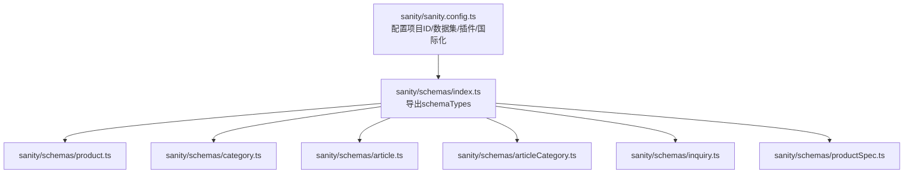
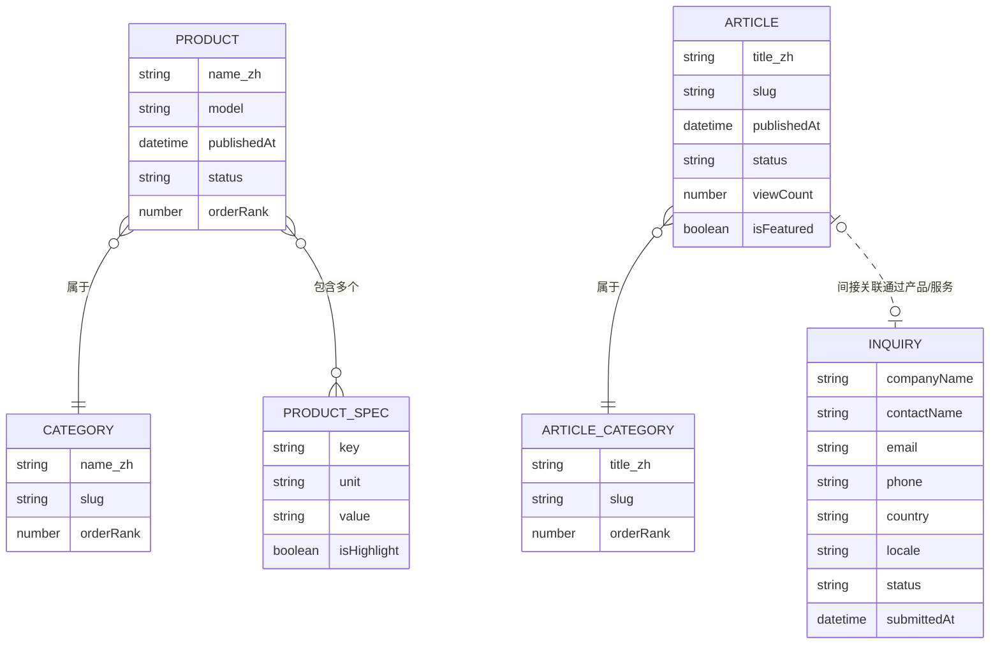
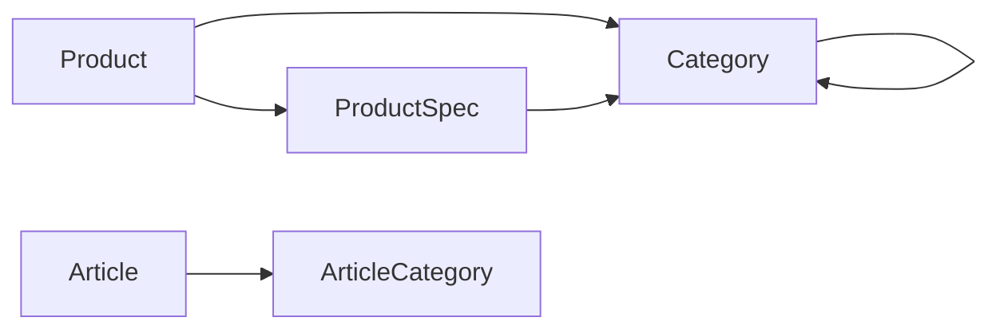

# 内容模型设计

<cite>
**本文引用的文件**
- [sanity/sanity.config.ts](file://sanity/sanity.config.ts)
- [sanity/schemas/index.ts](file://sanity/schemas/index.ts)
- [sanity/schemas/product.ts](file://sanity/schemas/product.ts)
- [sanity/schemas/category.ts](file://sanity/schemas/category.ts)
- [sanity/schemas/article.ts](file://sanity/schemas/article.ts)
- [sanity/schemas/articleCategory.ts](file://sanity/schemas/articleCategory.ts)
- [sanity/schemas/inquiry.ts](file://sanity/schemas/inquiry.ts)
- [sanity/schemas/productSpec.ts](file://sanity/schemas/productSpec.ts)
</cite>

## 目录
1. [简介](#简介)
2. [项目结构](#项目结构)
3. [核心组件](#核心组件)
4. [架构总览](#架构总览)
5. [详细组件分析](#详细组件分析)
6. [依赖分析](#依赖分析)
7. [性能考虑](#性能考虑)
8. [故障排查指南](#故障排查指南)
9. [结论](#结论)
10. [附录](#附录)

## 简介
本文件面向Sanity内容模型设计，系统性梳理并文档化以下核心Schema与设计理念：
- 产品模型（Product）：多语言名称、型号、分类、描述、特性、应用场景、图片图集、技术规格、SEO、状态与排序权重、数据手册等字段，体现B2B产品信息的完整性与可检索性。
- 分类模型（Category）：支持父子层级的树形分类，具备多语言名称、URL标识、描述、图标与排序权重。
- 文章模型（Article）：多语言标题、摘要、正文（含块级内容与图片）、分类、标签、作者、发布时间与状态、来源信息、SEO、阅读计数与推荐位等。
- 资讯分类模型（ArticleCategory）：文章分类的多语言标题、URL标识、描述与排序权重。
- 询盘模型（Inquiry）：客户公司、联系人、邮箱、电话、国家、意向产品、数量、需求详情、语言、状态、提交时间与跟进备注。
- 产品规格参数模型（ProductSpec）：参数键名、单位、取值、所属分类与高亮显示标记。

同时，文档涵盖模型间关系映射（一对多、多对多）、富文本编辑器（Portable Text）配置与限制、字段级权限与显示规则建议、以及模型扩展与自定义字段的最佳实践。

## 项目结构
Sanity配置通过集中导出schema类型，统一注册到Studio中；前端Next.js应用通过环境变量读取Sanity项目ID与数据集，实现内容驱动的站点渲染。

图表来源
- [sanity/sanity.config.ts:1-33](file://sanity/sanity.config.ts#L1-L33)
- [sanity/schemas/index.ts:1-9](file://sanity/schemas/index.ts#L1-L9)

章节来源
- [sanity/sanity.config.ts:1-33](file://sanity/sanity.config.ts#L1-L33)
- [sanity/schemas/index.ts:1-9](file://sanity/schemas/index.ts#L1-L9)

## 核心组件
本节概述各Schema的核心职责与关键字段类别，便于快速定位与理解。

- 产品模型（Product）
  - 多语言基础信息：名称、简短描述、SEO标题与描述
  - 关联信息：URL标识、型号、分类（引用）、技术规格（数组引用）
  - 展示素材：主图、图集（数组图像）
  - 业务属性：目标市场（枚举列表）、状态（枚举列表）、排序权重、数据手册（文件）
  - 预览选择：名称、型号、主图

- 分类模型（Category）
  - 多语言名称、描述
  - 关联信息：URL标识、父级分类（自引用）、图标
  - 排序权重

- 文章模型（Article）
  - 多语言标题、摘要、正文（块级内容+图片）
  - 关联信息：文章分类（引用）、标签（字符串数组）
  - 发布信息：作者、发布时间、状态（枚举）、来源信息（自动抓取）
  - SEO：多语言Meta标题与描述、关键词
  - 统计与推荐：阅读计数（只读）、推荐位

- 资讯分类模型（ArticleCategory）
  - 多语言标题、描述
  - 关联信息：URL标识
  - 排序权重

- 询盘模型（Inquiry）
  - 客户信息：公司名称、联系人、邮箱、电话、国家
  - 购买意向：感兴趣的产品、数量、需求详情
  - 系统信息：语言、状态（枚举）、提交时间（只读）、跟进备注
  - 预览与排序：按提交时间升/降序

- 产品规格参数模型（ProductSpec）
  - 参数键名（多语言）、唯一键、单位、取值
  - 关联信息：所属分类（引用）
  - 显示策略：高亮标记

章节来源
- [sanity/schemas/product.ts:1-233](file://sanity/schemas/product.ts#L1-L233)
- [sanity/schemas/category.ts:1-74](file://sanity/schemas/category.ts#L1-L74)
- [sanity/schemas/article.ts:1-265](file://sanity/schemas/article.ts#L1-L265)
- [sanity/schemas/articleCategory.ts:1-59](file://sanity/schemas/articleCategory.ts#L1-L59)
- [sanity/schemas/inquiry.ts:1-134](file://sanity/schemas/inquiry.ts#L1-L134)
- [sanity/schemas/productSpec.ts:1-58](file://sanity/schemas/productSpec.ts#L1-L58)

## 架构总览
下图展示内容模型之间的关系映射与典型查询路径，帮助理解“产品-分类”、“产品-规格参数”、“文章-资讯分类”、“文章-作者/来源”等关系。

图表来源
- [sanity/schemas/product.ts:40-45](file://sanity/schemas/product.ts#L40-L45)
- [sanity/schemas/product.ts:93-98](file://sanity/schemas/product.ts#L93-L98)
- [sanity/schemas/article.ts:35-41](file://sanity/schemas/article.ts#L35-L41)
- [sanity/schemas/articleCategory.ts:1-59](file://sanity/schemas/articleCategory.ts#L1-L59)
- [sanity/schemas/inquiry.ts:12-98](file://sanity/schemas/inquiry.ts#L12-L98)

## 详细组件分析

### 产品模型（Product）
- 设计理念
  - 多语言优先：名称、描述、简短描述、SEO均采用对象型字段，覆盖6种语言，确保国际化站点一致性。
  - 结构化规格：通过“技术规格”字段以数组引用“产品规格参数”模型，实现参数解耦与复用。
  - 展示与SEO：主图、图集、SEO元信息、关键词、状态与排序权重，满足前端渲染与SEO需求。
  - 文件附件：数据手册（PDF）作为独立文件资源，便于下载与归档。
- 字段与约束
  - 名称（多语言对象）：必填字段（中文、英文），其余语言非必填。
  - URL标识：基于英文名称生成，最大长度限制。
  - 型号：必填。
  - 分类：引用“分类”模型，必填。
  - 描述/简短描述：多语言文本，适合不同场景展示。
  - 主图/图集：图像字段，启用热点编辑；主图为必填。
  - 技术规格：数组引用“产品规格参数”，支持跨产品复用。
  - 特性/应用场景：多语言字符串数组，便于前端灵活展示。
  - 目标市场：枚举列表（马来西亚、印尼、泰国、越南、中东、全球）。
  - SEO：多语言Meta标题、描述与关键词。
  - 状态：枚举（在售、新品、停产、即将上市），默认“在售”。
  - 排序权重：数字，越小越靠前，默认0。
  - 数据手册：文件类型，限定PDF。
- 关系映射
  - 一对多：分类 → 多个产品
  - 多对多：产品 ←→ 产品规格参数（通过数组引用）
- 富文本与块级内容
  - 本模型未直接使用Portable Text字段；产品详情通常在文章模型中使用块级内容与图片组合。
- 字段级权限与显示规则
  - 建议：对“排序权重”“状态”“数据手册”等字段设置最小权限可见；对“只读”字段（如阅读计数）在编辑器中隐藏或禁用。
- 扩展与最佳实践
  - 可新增“品牌”“认证证书”“适用标准”等字段，保持多语言结构一致。
  - 规格参数建议统一键名与单位，便于前端聚合与筛选。

章节来源
- [sanity/schemas/product.ts:8-233](file://sanity/schemas/product.ts#L8-L233)

### 分类模型（Category）
- 设计理念
  - 支持树形层级：通过“父级分类”自引用，构建多级分类体系。
  - 多语言与SEO：名称、描述、URL标识与排序权重，兼顾后台管理与前端展示。
- 字段与约束
  - 名称（多语言对象）：必填字段（中文、英文）。
  - URL标识：基于英文名称生成。
  - 描述：多语言文本。
  - 父级分类：自引用，顶级分类留空。
  - 图标：图像字段，启用热点编辑。
  - 排序权重：数字，越小越靠前，默认0。
- 关系映射
  - 自引用：分类 → 子分类
  - 一对多：分类 → 多个产品
- 富文本与块级内容
  - 未使用Portable Text。
- 字段级权限与显示规则
  - 建议：对“父级分类”进行层级校验，避免循环引用；对“排序权重”设置最小权限可见。
- 扩展与最佳实践
  - 可增加“移动端图标”“Banner图”等展示资源，提升移动端体验。

章节来源
- [sanity/schemas/category.ts:8-74](file://sanity/schemas/category.ts#L8-L74)

### 文章模型（Article）
- 设计理念
  - 全站资讯中心：支持多语言标题、摘要、正文（块级内容+图片）、分类、标签、作者、发布时间与状态、来源信息、SEO与阅读统计。
  - 内容丰富度：块级内容允许段落、标题、强调、链接、图片等，满足技术类文章排版需求。
- 字段与约束
  - 标题（多语言对象）：必填字段（中文、英文）。
  - URL标识：基于中文标题生成。
  - 分类：引用“资讯分类”模型，必填。
  - 标签：字符串数组，用于SEO关键词。
  - 摘要（多语言对象）：文本，适合列表与Meta描述。
  - 正文（多语言对象）：数组类型，元素包含块级内容与图片。
  - 封面图：图像字段，启用热点编辑。
  - 作者：对象包含名称（默认值）与头像。
  - 发布设置：发布时间默认当前时间，状态枚举（已发布、草稿、定时发布），默认已发布。
  - 来源信息：对象包含URL、来源网站、是否AI生成。
  - SEO：多语言Meta标题、描述与关键词。
  - 阅读统计：只读数字，默认0。
  - 推荐位：布尔值，默认false。
- 关系映射
  - 一对多：资讯分类 → 多篇文章
  - 一对一：作者（对象）
- 富文本与块级内容
  - 使用“块级内容（block）+ 图片”组合，支持富文本编辑与媒体插入。
  - 建议：在编辑器侧限制块级内容类型与图片尺寸，保证渲染一致性。
- 字段级权限与显示规则
  - 建议：对“发布时间”“状态”“来源信息”设置最小权限可见；对“阅读统计”只读。
- 扩展与最佳实践
  - 可增加“目录”“相关文章”“字数统计”等辅助字段，提升SEO与可读性。

章节来源
- [sanity/schemas/article.ts:8-265](file://sanity/schemas/article.ts#L8-L265)

### 资讯分类模型（ArticleCategory）
- 设计理念
  - 文章分类的多语言标题、描述与排序权重，支撑内容分组与导航。
- 字段与约束
  - 标题（多语言对象）：必填字段（中文、英文）。
  - URL标识：基于中文标题生成。
  - 描述：多语言文本。
  - 排序权重：数字，越小越靠前，默认0。
- 关系映射
  - 一对多：资讯分类 → 多篇文章
- 富文本与块级内容
  - 未使用Portable Text。
- 字段级权限与显示规则
  - 建议：对“排序权重”设置最小权限可见。
- 扩展与最佳实践
  - 可增加“分类图标”“Banner图”“子分类”等字段，增强展示效果。

章节来源
- [sanity/schemas/articleCategory.ts:8-59](file://sanity/schemas/articleCategory.ts#L8-L59)

### 询盘模型（Inquiry）
- 设计理念
  - 客户线索管理：收集公司、联系人、联系方式、意向产品、数量、需求详情、语言、状态与跟进备注。
  - 流程化跟踪：状态枚举覆盖从“新询单”到“已成交/已关闭”的完整生命周期。
- 字段与约束
  - 公司名称、联系人、邮箱、电话、国家：必填。
  - 意向产品、数量、需求详情：可选文本。
  - 语言：枚举（中、英、印尼语、泰语、越南语、阿拉伯语）。
  - 状态：枚举（新询单、已联系、已报价、已成交、已关闭），默认“新询单”。
  - 提交时间：只读，记录首次提交时间。
  - 跟进备注：可选文本。
- 关系映射
  - 与产品/服务无直接引用，但可通过“感兴趣的产品”字段间接关联。
- 富文本与块级内容
  - 未使用Portable Text。
- 字段级权限与显示规则
  - 建议：对“提交时间”“状态”设置最小权限可见；对“跟进备注”开放编辑。
- 扩展与最佳实践
  - 可增加“跟进记录”“负责人”“转化率”等字段，完善销售流程追踪。

章节来源
- [sanity/schemas/inquiry.ts:12-134](file://sanity/schemas/inquiry.ts#L12-L134)

### 产品规格参数模型（ProductSpec）
- 设计理念
  - 参数标准化：统一参数键名、单位与取值，支持跨产品复用与高亮展示。
- 字段与约束
  - 参数名称（多语言对象）：必填字段（中文、英文）。
  - 参数键：唯一标识，必填。
  - 单位：字符串，如nm、mW、V、mA。
  - 取值：字符串，支持具体数值或范围。
  - 所属分类：引用“分类”模型，用于参数维度限定。
  - 高亮显示：布尔值，默认false。
- 关系映射
  - 一对多：分类 → 多个参数
  - 多对一：参数 → 多个产品（通过产品模型的“技术规格”数组引用）
- 富文本与块级内容
  - 未使用Portable Text。
- 字段级权限与显示规则
  - 建议：对“键名”设置唯一性校验；对“高亮显示”设置最小权限可见。
- 扩展与最佳实践
  - 可增加“参数分组”“排序权重”“单位换算”等字段，提升参数管理效率。

章节来源
- [sanity/schemas/productSpec.ts:8-58](file://sanity/schemas/productSpec.ts#L8-L58)

## 依赖分析
- 模型注册与加载
  - 通过[sanity/schemas/index.ts](file://sanity/schemas/index.ts#L8)导出schemaTypes，统一注册至Sanity Studio。
- 运行时配置
  - 项目ID与数据集通过环境变量注入，支持本地开发与生产部署切换。
  - 国际化支持中英文界面，便于多语言团队协作。
- 模型间依赖
  - 产品 → 分类（引用）
  - 产品 → 产品规格参数（数组引用）
  - 文章 → 资讯分类（引用）
  - 分类 → 自身（自引用）
  - 产品规格参数 → 分类（引用）

图表来源
- [sanity/schemas/index.ts:8](file://sanity/schemas/index.ts#L8)
- [sanity/sanity.config.ts:23-25](file://sanity/sanity.config.ts#L23-L25)
- [sanity/schemas/product.ts:40-45](file://sanity/schemas/product.ts#L40-L45)
- [sanity/schemas/product.ts:93-98](file://sanity/schemas/product.ts#L93-L98)
- [sanity/schemas/article.ts:35-41](file://sanity/schemas/article.ts#L35-L41)
- [sanity/schemas/category.ts:46-51](file://sanity/schemas/category.ts#L46-L51)
- [sanity/schemas/productSpec.ts:38-42](file://sanity/schemas/productSpec.ts#L38-L42)

章节来源
- [sanity/sanity.config.ts:23-31](file://sanity/sanity.config.ts#L23-L31)
- [sanity/schemas/index.ts:8](file://sanity/schemas/index.ts#L8)

## 性能考虑
- 查询与索引
  - 对常用过滤字段（如产品状态、文章状态、发布时间、分类slug）建立索引，提升查询性能。
- 媒体资源
  - 图像与文件采用Sanity托管，建议开启CDN缓存与合适的压缩策略。
- 富文本渲染
  - 块级内容与图片组合可能影响渲染性能，建议在前端做懒加载与骨架屏优化。
- 列表与排序
  - 使用“排序权重”与数据库排序减少客户端二次排序成本。
- 缓存策略
  - 前端静态生成（SSG）与增量静态再生（ISR）结合，降低冷启动与频繁拉取成本。

## 故障排查指南
- 字段必填与校验
  - 若出现保存失败，请检查多语言对象中的必填字段（如产品名称、文章标题、分类名称）是否完整填写。
- 引用关系错误
  - 若产品无法保存，请确认“分类”“资讯分类”“产品规格参数”等引用是否存在且有效。
- 富文本编辑异常
  - 若块级内容无法正常渲染，请检查Portable Text数组元素类型是否正确（应包含块级内容与图片）。
- 排序与权重
  - 若排序不符合预期，请检查“排序权重”字段是否设置合理，或确认查询逻辑是否按该字段排序。
- 文件上传限制
  - 若PDF上传失败，请确认文件类型与大小限制是否符合要求。

章节来源
- [sanity/schemas/product.ts:14-21](file://sanity/schemas/product.ts#L14-L21)
- [sanity/schemas/article.ts:15-22](file://sanity/schemas/article.ts#L15-L22)
- [sanity/schemas/category.ts:14-21](file://sanity/schemas/category.ts#L14-L21)
- [sanity/schemas/articleCategory.ts:14-21](file://sanity/schemas/articleCategory.ts#L14-L21)
- [sanity/schemas/product.ts:40-45](file://sanity/schemas/product.ts#L40-L45)
- [sanity/schemas/article.ts:35-41](file://sanity/schemas/article.ts#L35-L41)
- [sanity/schemas/productSpec.ts:38-42](file://sanity/schemas/productSpec.ts#L38-L42)

## 结论
本内容模型设计围绕B2B外贸场景，以“产品-分类-规格参数”为核心，辅以“文章-资讯分类”与“询盘”形成完整的内容与销售线索闭环。通过多语言对象、引用关系、枚举状态与排序权重，既满足后台管理的严谨性，又为前端渲染与SEO优化提供了清晰的数据结构。建议在后续迭代中持续完善字段级权限与显示规则、扩展富文本编辑器能力，并引入更细粒度的缓存与性能优化策略。

## 附录
- 富文本（Portable Text）语法与限制
  - 支持块级内容（段落、标题、强调、链接等）与内联媒体（图片）。建议在编辑器侧限制可用块级类型与图片尺寸，确保渲染一致性与性能。
- 字段级权限与显示规则配置
  - 建议：对只读字段（如阅读计数、提交时间）在编辑器中隐藏或禁用；对关键字段（如状态、排序权重、高亮标记）设置最小权限可见。
- 模型扩展与自定义字段最佳实践
  - 保持多语言结构一致性；为引用字段提供明确的反向查询索引；对枚举字段统一命名与值域；对文件字段设定类型与大小限制；对布尔字段提供默认值与文案映射。