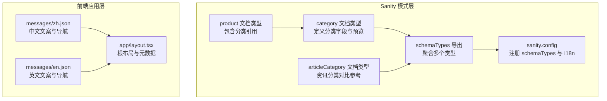
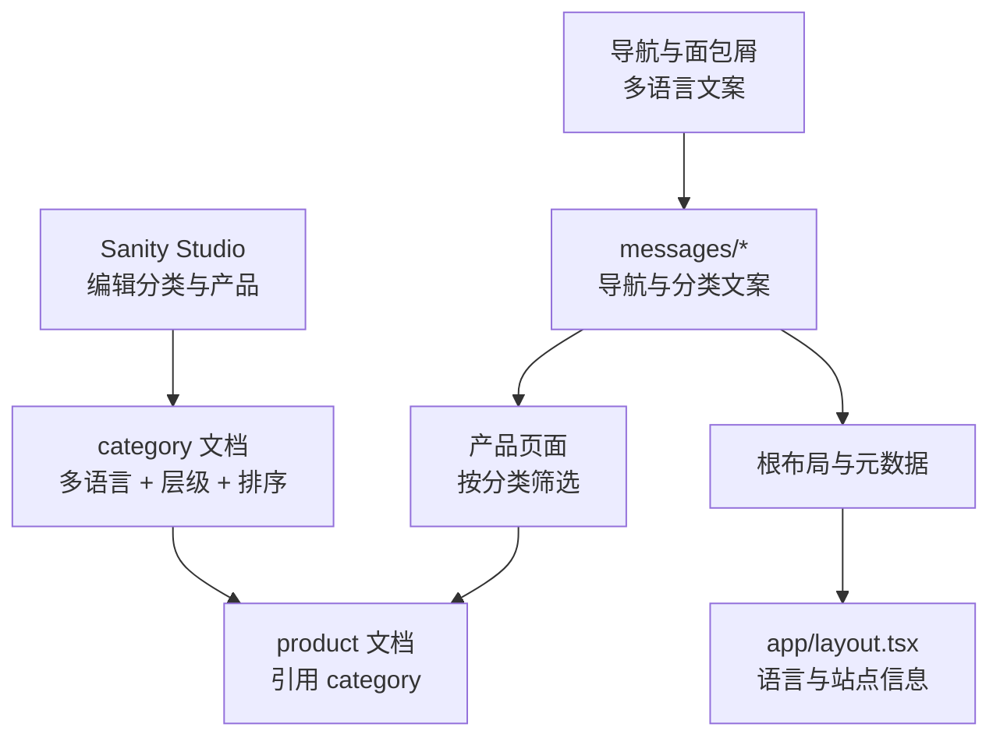
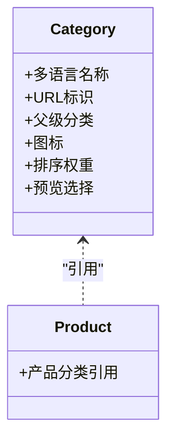
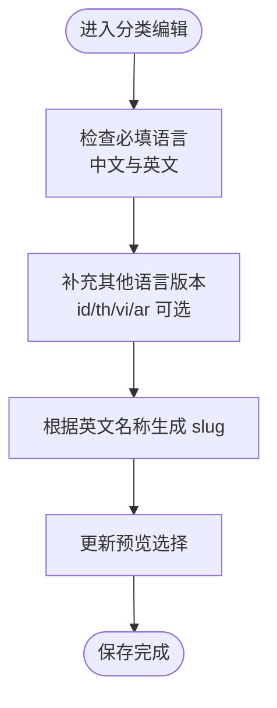
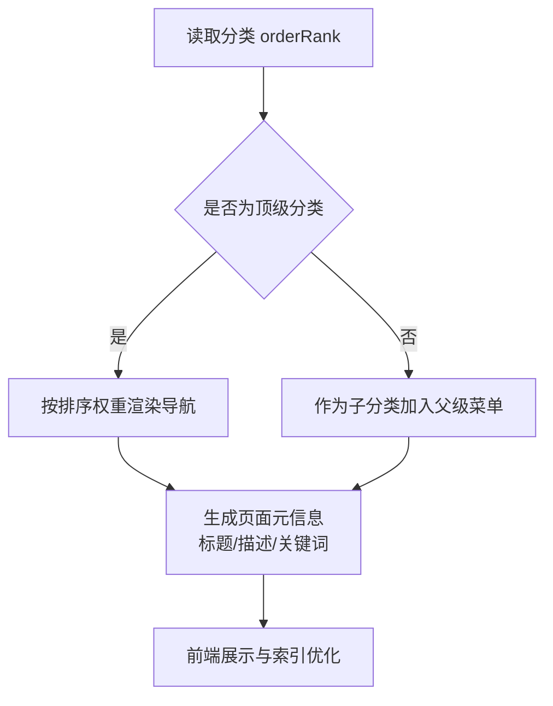
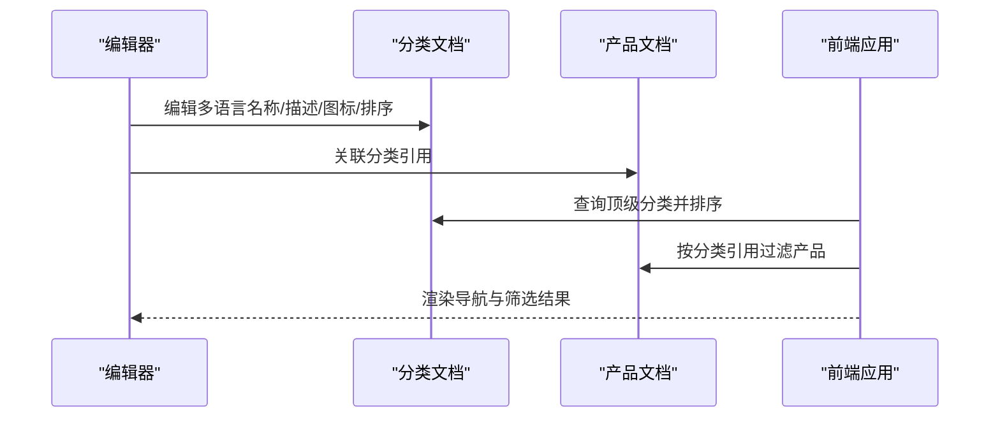
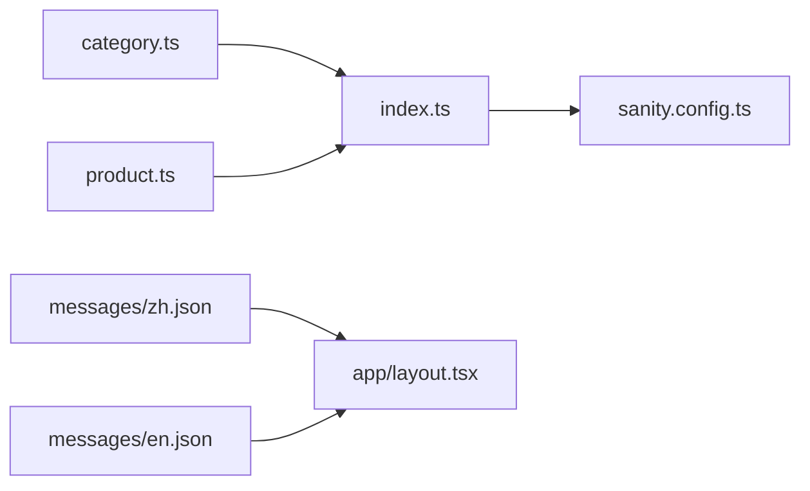

# 分类模型

<cite>
**本文引用的文件**
- [sanity/schemas/category.ts](file://sanity/schemas/category.ts)
- [sanity/schemas/index.ts](file://sanity/schemas/index.ts)
- [sanity/schemas/product.ts](file://sanity/schemas/product.ts)
- [sanity/schemas/articleCategory.ts](file://sanity/schemas/articleCategory.ts)
- [sanity/sanity.config.ts](file://sanity/sanity.config.ts)
- [scripts/seed-categories.ts](file://scripts/seed-categories.ts)
- [messages/zh.json](file://messages/zh.json)
- [messages/en.json](file://messages/en.json)
- [app/layout.tsx](file://app/layout.tsx)
</cite>

## 目录
1. [简介](#简介)
2. [项目结构](#项目结构)
3. [核心组件](#核心组件)
4. [架构总览](#架构总览)
5. [详细组件分析](#详细组件分析)
6. [依赖分析](#依赖分析)
7. [性能考虑](#性能考虑)
8. [故障排除指南](#故障排除指南)
9. [结论](#结论)
10. [附录](#附录)

## 简介
本文件系统性地阐述分类模型（Category Schema）的设计理念、层级结构与实现细节，并扩展到多语言支持、图标与图片资源管理、排序与显示控制、SEO 配置以及在产品筛选与导航中的应用场景。该分类模型基于 Sanity CMS 的文档类型定义，采用“对象型多语言字段 + 参考关系 + 排序权重”的组合，既满足多语言站点的本地化需求，又保证了父子层级的灵活组织与查询效率。

## 项目结构
分类模型位于 Sanity Schema 中，作为独立的文档类型被注册到全局 schemaTypes 列表中；产品模型通过参考关系关联到分类；前端通过消息文件与路由布局进行国际化与元数据配置。

**图表来源**
- [sanity/schemas/category.ts:1-74](file://sanity/schemas/category.ts#L1-L74)
- [sanity/schemas/product.ts:1-233](file://sanity/schemas/product.ts#L1-L233)
- [sanity/schemas/articleCategory.ts:1-59](file://sanity/schemas/articleCategory.ts#L1-L59)
- [sanity/schemas/index.ts:1-9](file://sanity/schemas/index.ts#L1-L9)
- [sanity/sanity.config.ts:1-33](file://sanity/sanity.config.ts#L1-L33)
- [messages/zh.json:1-200](file://messages/zh.json#L1-L200)
- [messages/en.json:1-200](file://messages/en.json#L1-L200)
- [app/layout.tsx:1-19](file://app/layout.tsx#L1-L19)

**章节来源**
- [sanity/schemas/category.ts:1-74](file://sanity/schemas/category.ts#L1-L74)
- [sanity/schemas/index.ts:1-9](file://sanity/schemas/index.ts#L1-L9)
- [sanity/sanity.config.ts:1-33](file://sanity/sanity.config.ts#L1-L33)
- [messages/zh.json:1-200](file://messages/zh.json#L1-L200)
- [messages/en.json:1-200](file://messages/en.json#L1-L200)
- [app/layout.tsx:1-19](file://app/layout.tsx#L1-L19)

## 核心组件
- 分类文档类型（category）
  - 多语言名称与描述：使用对象型字段，支持 zh、en、id、th、vi、ar 六种语言，其中中文与英文为必填。
  - URL 标识（slug）：基于英文名称自动生成，限制最大长度。
  - 父级分类（parent）：通过 reference 指向同类型文档，形成树形层级；顶级分类留空。
  - 图标（icon）：媒体资源，启用热点编辑。
  - 排序权重（orderRank）：数值越小越靠前，默认初始值为 0。
  - 预览选择：标题取自中文名称，副标题取自当前 slug。
- 产品文档类型（product）
  - 产品分类引用（category）：指向 category 类型，作为产品筛选与导航的关键纽带。
- 资讯分类文档类型（articleCategory）
  - 对比参考：同样采用对象型多语言字段与排序权重，便于理解分类字段设计的一致性。

**章节来源**
- [sanity/schemas/category.ts:8-73](file://sanity/schemas/category.ts#L8-L73)
- [sanity/schemas/product.ts:40-45](file://sanity/schemas/product.ts#L40-L45)
- [sanity/schemas/articleCategory.ts:8-58](file://sanity/schemas/articleCategory.ts#L8-L58)

## 架构总览
分类模型在系统中的角色与交互如下：

**图表来源**
- [sanity/schemas/category.ts:1-74](file://sanity/schemas/category.ts#L1-L74)
- [sanity/schemas/product.ts:1-233](file://sanity/schemas/product.ts#L1-L233)
- [messages/zh.json:1-200](file://messages/zh.json#L1-L200)
- [messages/en.json:1-200](file://messages/en.json#L1-L200)
- [app/layout.tsx:1-19](file://app/layout.tsx#L1-L19)

## 详细组件分析

### 分类 Schema 设计与层级结构
- 字段设计
  - 多语言名称与描述：通过对象型字段统一管理不同语言版本，便于前端按当前语言读取。
  - URL 标识：基于英文名称生成 slug，确保可读且稳定的访问路径。
  - 父级引用：使用 reference 指向 category，形成父子层级；顶级分类为空引用。
  - 图标：媒体字段，支持热点裁剪与缩放，适配不同尺寸展示。
  - 排序权重：数值型字段，用于控制分类在导航与筛选中的顺序。
- 层级实现
  - 顶级分类：parent 字段留空。
  - 子分类：parent 指向其父分类，可无限层级嵌套。
  - 查询建议：可通过 parent 与 orderRank 组合查询，实现树形结构渲染与排序。
- 预览与校验
  - 预览选择中文名称与 slug，便于编辑器识别。
  - 多语言字段中中文与英文为必填，其他语言非必填，降低录入门槛。

**图表来源**
- [sanity/schemas/category.ts:8-73](file://sanity/schemas/category.ts#L8-L73)
- [sanity/schemas/product.ts:40-45](file://sanity/schemas/product.ts#L40-L45)

**章节来源**
- [sanity/schemas/category.ts:8-73](file://sanity/schemas/category.ts#L8-L73)

### 多语言支持配置
- 分类层面
  - 名称与描述均为对象型字段，包含 zh、en、id、th、vi、ar 六个语言键位。
  - 中文与英文为必填，其他语言非必填，确保核心语言可用。
- 前端文案与导航
  - messages/zh.json 与 messages/en.json 提供导航与分类文案，前端按当前语言读取。
  - app/layout.tsx 定义根布局语言属性，影响默认语言与 SEO 元数据。
- 设计要点
  - 分类的多语言字段与前端文案相互独立但互补：前者存储内容，后者负责界面呈现。
  - 建议在编辑器中为每个分类补充至少中文与英文版本，以保障核心用户群体体验。

**图表来源**
- [sanity/schemas/category.ts:13-31](file://sanity/schemas/category.ts#L13-L31)
- [messages/zh.json:30-50](file://messages/zh.json#L30-L50)
- [messages/en.json:30-50](file://messages/en.json#L30-L50)
- [app/layout.tsx:14-16](file://app/layout.tsx#L14-L16)

**章节来源**
- [sanity/schemas/category.ts:13-44](file://sanity/schemas/category.ts#L13-L44)
- [messages/zh.json:30-50](file://messages/zh.json#L30-L50)
- [messages/en.json:30-50](file://messages/en.json#L30-L50)
- [app/layout.tsx:14-16](file://app/layout.tsx#L14-L16)

### 图标与图片资源管理
- 分类图标（icon）
  - 类型为 image，启用热点编辑，便于在不同尺寸下精准裁剪。
  - 建议提供正方形高清源图，以适配多种展示场景（导航、列表、详情页）。
- 产品图片（对比参考）
  - 产品模型包含主图与图集字段，体现媒体资源管理的最佳实践：主图用于列表与缩略，图集用于详情页放大查看。
- 建议
  - 使用 CDN 加速媒体资源，开启懒加载与响应式尺寸选择。
  - 在编辑器中为图标与产品图设置合理的尺寸上限与格式规范。

**章节来源**
- [sanity/schemas/category.ts:53-59](file://sanity/schemas/category.ts#L53-L59)
- [sanity/schemas/product.ts:76-90](file://sanity/schemas/product.ts#L76-L90)

### 排序、显示状态与 SEO 优化
- 排序
  - 分类：orderRank 数值越小越靠前；可用于导航菜单与筛选面板的稳定排序。
  - 产品：同样具备 orderRank 字段，便于在分类内进一步细分排序。
- 显示状态
  - 产品具备状态选项（在售、新品、停产、即将上市），可在前端按状态过滤与展示。
- SEO 优化
  - 产品模型包含 SEO 设置（多语言 Meta 标题、Meta 描述、关键词），可针对不同语言生成独立 SEO 元信息。
  - 分类未内置 SEO 字段，建议在前端路由与模板中结合分类名称与描述生成 SEO 元信息，或在分类中新增 SEO 对象字段以统一管理。

**图表来源**
- [sanity/schemas/category.ts:61-65](file://sanity/schemas/category.ts#L61-L65)
- [sanity/schemas/product.ts:149-187](file://sanity/schemas/product.ts#L149-L187)

**章节来源**
- [sanity/schemas/category.ts:61-65](file://sanity/schemas/category.ts#L61-L65)
- [sanity/schemas/product.ts:149-187](file://sanity/schemas/product.ts#L149-L187)

### 分类在产品筛选与导航中的应用
- 导航
  - 通过查询所有顶级分类（parent 为空）并按 orderRank 排序，渲染主导航菜单。
  - 子分类自动归入父级菜单，形成二级或多级导航。
- 产品筛选
  - 产品文档引用分类，前端可按分类 ID 过滤产品集合。
  - 结合产品状态与排序权重，实现“在售”优先、“新品”置顶等策略。
- 前端文案与路由
  - messages/* 提供导航与分类文案，app/layout.tsx 提供根语言与元数据，确保多语言一致性。

**图表来源**
- [sanity/schemas/category.ts:46-51](file://sanity/schemas/category.ts#L46-L51)
- [sanity/schemas/product.ts:40-45](file://sanity/schemas/product.ts#L40-L45)
- [messages/zh.json:30-50](file://messages/zh.json#L30-L50)
- [messages/en.json:30-50](file://messages/en.json#L30-L50)
- [app/layout.tsx:14-16](file://app/layout.tsx#L14-L16)

**章节来源**
- [sanity/schemas/category.ts:46-51](file://sanity/schemas/category.ts#L46-L51)
- [sanity/schemas/product.ts:40-45](file://sanity/schemas/product.ts#L40-L45)
- [messages/zh.json:30-50](file://messages/zh.json#L30-L50)
- [messages/en.json:30-50](file://messages/en.json#L30-L50)
- [app/layout.tsx:14-16](file://app/layout.tsx#L14-L16)

## 依赖分析
- 模块耦合
  - category 与 product 通过引用建立强耦合，产品必须属于一个分类。
  - schemaTypes 将 category 与 product 聚合注册至 Sanity，确保全局可用。
- 外部依赖
  - Sanity Studio 提供可视化编辑与预览。
  - 媒体资源依赖 CDN 与热点编辑能力。
  - 前端依赖 i18n 消息文件与 Next.js 布局语言设置。

**图表来源**
- [sanity/schemas/index.ts:1-9](file://sanity/schemas/index.ts#L1-L9)
- [sanity/sanity.config.ts:23-25](file://sanity/sanity.config.ts#L23-L25)
- [messages/zh.json:1-200](file://messages/zh.json#L1-L200)
- [messages/en.json:1-200](file://messages/en.json#L1-L200)
- [app/layout.tsx:1-19](file://app/layout.tsx#L1-L19)

**章节来源**
- [sanity/schemas/index.ts:1-9](file://sanity/schemas/index.ts#L1-L9)
- [sanity/sanity.config.ts:23-25](file://sanity/sanity.config.ts#L23-L25)

## 性能考虑
- 查询优化
  - 为 parent 与 orderRank 建立索引，提升树形查询与排序性能。
  - 在前端缓存分类树与产品分页结果，减少重复请求。
- 资源优化
  - 图片资源使用响应式尺寸与懒加载，避免阻塞首屏。
  - 媒体资源走 CDN，缩短加载时延。
- 编辑体验
  - 使用预览选择（标题/副标题）提升编辑器可读性。
  - 必填字段提示与校验，降低无效数据产生。

## 故障排除指南
- 分类层级异常
  - 症状：子分类未正确归入父级菜单。
  - 排查：确认 parent 引用是否指向正确的父分类 ID；检查 orderRank 是否一致。
- 多语言缺失
  - 症状：导航或页面显示空白或回退到默认语言。
  - 排查：确认 messages/* 中对应键位是否存在；确保分类对象型字段包含所需语言键。
- URL 冲突
  - 症状：slug 生成失败或冲突。
  - 排查：修改英文名称或手动调整 slug；确保唯一性。
- 媒体资源问题
  - 症状：图标或产品图不显示或加载缓慢。
  - 排查：检查媒体源文件尺寸与格式；确认 CDN 访问权限与缓存配置。

**章节来源**
- [sanity/schemas/category.ts:13-31](file://sanity/schemas/category.ts#L13-L31)
- [sanity/schemas/product.ts:76-90](file://sanity/schemas/product.ts#L76-L90)
- [messages/zh.json:30-50](file://messages/zh.json#L30-L50)
- [messages/en.json:30-50](file://messages/en.json#L30-L50)

## 结论
分类模型通过“对象型多语言 + 参考层级 + 排序权重”的设计，在 Sanity 中实现了清晰、可维护且易于扩展的分类体系。配合产品模型的引用关系与前端多语言文案，能够高效支撑导航、筛选与 SEO 等核心功能。建议在实际落地中完善媒体资源规范、建立索引与缓存策略，并持续优化编辑器体验与数据质量。

## 附录
- 初始化脚本
  - scripts/seed-categories.ts 提供分类数据的批量导入示例，便于快速搭建基础分类数据。
- 配置参考
  - sanity.config.ts 注册 schemaTypes 与 i18n，确保 Studio 与前端语言一致。

**章节来源**
- [scripts/seed-categories.ts:12-81](file://scripts/seed-categories.ts#L12-L81)
- [sanity/sanity.config.ts:23-31](file://sanity/sanity.config.ts#L23-L31)