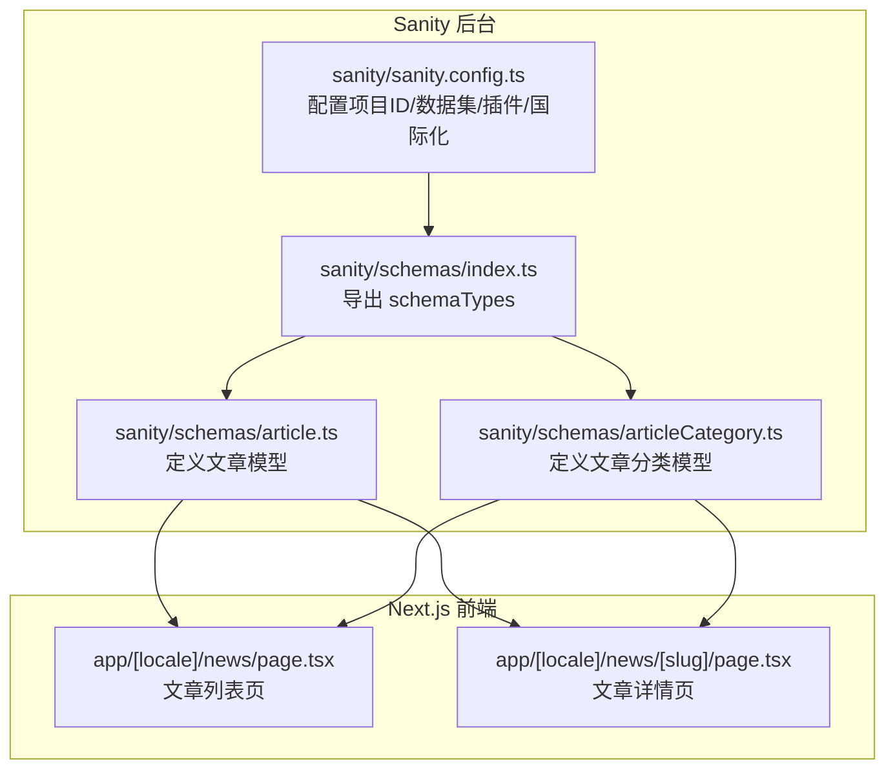
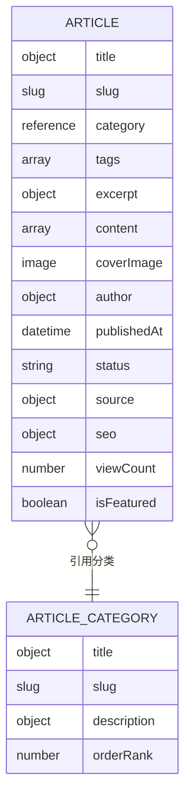
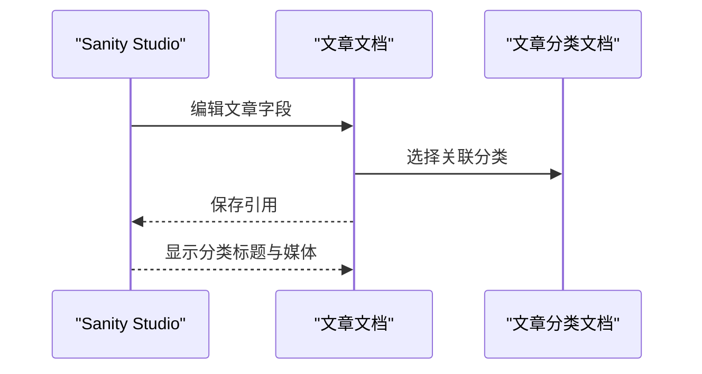
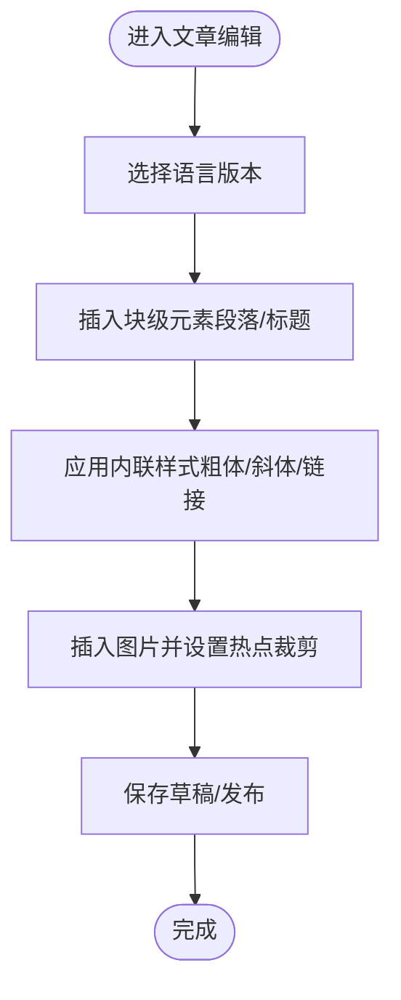
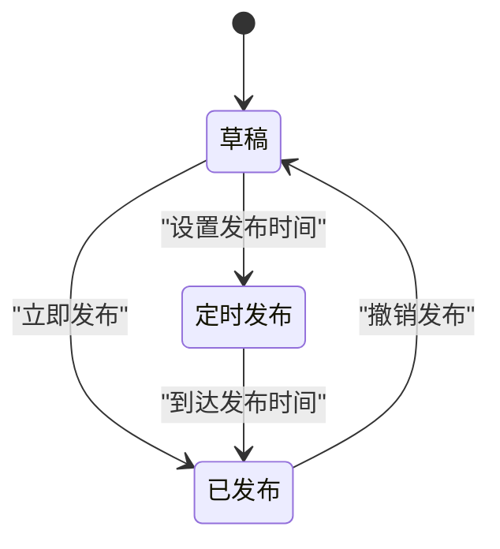
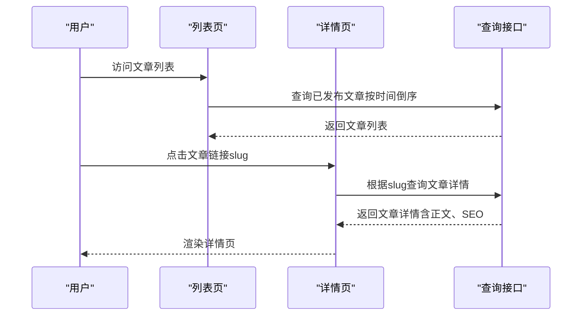
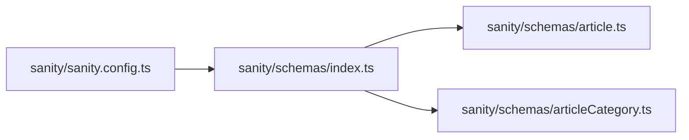

# 文章模型

<cite>
**本文引用的文件**
- [sanity/schemas/article.ts](file://sanity/schemas/article.ts)
- [sanity/schemas/articleCategory.ts](file://sanity/schemas/articleCategory.ts)
- [sanity/schemas/index.ts](file://sanity/schemas/index.ts)
- [sanity/sanity.config.ts](file://sanity/sanity.config.ts)
</cite>

## 目录
1. [简介](#简介)
2. [项目结构](#项目结构)
3. [核心组件](#核心组件)
4. [架构总览](#架构总览)
5. [详细组件分析](#详细组件分析)
6. [依赖分析](#依赖分析)
7. [性能考虑](#性能考虑)
8. [故障排除指南](#故障排除指南)
9. [结论](#结论)
10. [附录](#附录)

## 简介
本文件系统性地文档化“文章模型”的设计与实现，覆盖以下关键主题：
- Article Schema 的完整字段体系：标题、正文、摘要、发布时间、作者信息、标签、封面图、来源信息、SEO 字段、阅读统计、推荐位等
- 文章与 ArticleCategory 分类模型的关联关系
- 富文本编辑器配置（Portable Text）：块级元素与内联样式的使用
- SEO 优化字段：多语言 meta 标题、描述与关键词
- 文章状态管理：草稿、已发布、定时发布的实现
- 列表展示、详情页面渲染与相关文章推荐的实现思路

## 项目结构
该站点采用 Sanity 作为内容管理后台，文章模型定义于 Sanity Schema 中，并通过配置注册到 Studio。前端页面位于 Next.js 应用的 app 目录下，通过 lib/sanity 工具访问 Sanity 数据。

图表来源
- [sanity/sanity.config.ts:1-33](file://sanity/sanity.config.ts#L1-L33)
- [sanity/schemas/index.ts:1-9](file://sanity/schemas/index.ts#L1-L9)
- [sanity/schemas/article.ts:1-265](file://sanity/schemas/article.ts#L1-L265)
- [sanity/schemas/articleCategory.ts:1-59](file://sanity/schemas/articleCategory.ts#L1-L59)

章节来源
- [sanity/sanity.config.ts:1-33](file://sanity/sanity.config.ts#L1-L33)
- [sanity/schemas/index.ts:1-9](file://sanity/schemas/index.ts#L1-L9)

## 核心组件
- 文章模型（Article）
  - 多语言字段：标题、摘要、正文、SEO 元信息
  - 关联字段：分类（文章分类）、标签（SEO 关键词）
  - 内容字段：封面图、作者信息、发布时间、状态（草稿/已发布/定时发布）
  - 统计与推荐：阅读次数、推荐位
  - 来源信息：用于自动化抓取与 AI 生成标记
- 文章分类模型（ArticleCategory）
  - 多语言分类名称、URL 标识、描述、排序权重

章节来源
- [sanity/schemas/article.ts:1-265](file://sanity/schemas/article.ts#L1-L265)
- [sanity/schemas/articleCategory.ts:1-59](file://sanity/schemas/articleCategory.ts#L1-L59)

## 架构总览
文章模型在 Sanity 中以文档类型存在，字段采用对象型多语言结构，确保中英及多语种内容的统一管理。文章与分类之间通过引用建立关联；前端通过查询接口获取数据并渲染列表与详情页。

图表来源
- [sanity/schemas/article.ts:1-265](file://sanity/schemas/article.ts#L1-L265)
- [sanity/schemas/articleCategory.ts:1-59](file://sanity/schemas/articleCategory.ts#L1-L59)

## 详细组件分析

### 文章模型字段体系
- 基础信息与多语言支持
  - 标题：多语言对象，包含中文、英文及印尼语、泰语、越南语、阿拉伯语字段，中文与英文为必填
  - URL 标识：基于中文标题生成，限制最大长度
  - 摘要：多语言文本，用于列表展示与 Meta 描述
- 内容与富文本
  - 正文：多语言数组，支持块级元素与图片（含热点裁剪）
  - 富文本语法：Portable Text（块级元素 + 图片），内联样式由 Portable Text 定义
- 资源与元信息
  - 封面图：支持热点裁剪，用于列表与社交分享
  - 作者：包含作者名称与头像
  - 发布时间：默认当前时间，必填
  - 发布状态：枚举值（已发布、草稿、定时发布），默认已发布
  - 来源信息：原文链接、来源网站、是否 AI 生成
  - SEO 设置：多语言 meta 标题、多语言 meta 描述、关键词数组
  - 阅读统计：只读数字，默认 0
  - 推荐位：布尔值，默认否
- 关联与排序
  - 分类：引用文章分类模型，必填
  - 标签：字符串数组，用于 SEO 关键词
  - 预览选择：标题、分类、媒体
  - 默认排序：按发布时间倒序

章节来源
- [sanity/schemas/article.ts:8-247](file://sanity/schemas/article.ts#L8-L247)

### 文章与分类的关联关系
- 文章通过引用字段关联到文章分类
- 分类提供多语言标题、URL 标识、描述与排序权重
- 关联关系在文章预览中体现为“分类标题”字段

图表来源
- [sanity/schemas/article.ts:34-41](file://sanity/schemas/article.ts#L34-L41)
- [sanity/schemas/articleCategory.ts:9-31](file://sanity/schemas/articleCategory.ts#L9-L31)

章节来源
- [sanity/schemas/article.ts:34-41](file://sanity/schemas/article.ts#L34-L41)
- [sanity/schemas/articleCategory.ts:9-52](file://sanity/schemas/articleCategory.ts#L9-L52)

### 富文本编辑器配置（Portable Text）
- 正文字段采用多语言数组，元素类型包含：
  - 块级元素：用于段落、标题、引用等
  - 图片：支持热点裁剪，便于多尺寸适配
- 内联样式：由 Portable Text 定义，可在 Studio 中启用
- 使用建议：
  - 在 Studio 中为块级元素配置内联样式选项
  - 对图片进行热点裁剪，确保在不同布局下的最佳显示

图表来源
- [sanity/schemas/article.ts:68-129](file://sanity/schemas/article.ts#L68-L129)

章节来源
- [sanity/schemas/article.ts:68-129](file://sanity/schemas/article.ts#L68-L129)

### SEO 优化字段
- 多语言 meta 标题与 meta 描述：分别对应不同语言版本
- 关键词：字符串数组，用于页面关键词优化
- 使用建议：
  - 为每种语言维护独立的 meta 标题与描述
  - 关键词应与文章内容高度相关，避免堆砌

章节来源
- [sanity/schemas/article.ts:188-228](file://sanity/schemas/article.ts#L188-L228)

### 文章状态管理
- 状态字段提供三种值：已发布、草稿、定时发布
- 默认值为“已发布”，初始发布时间为当前时间
- 实现要点：
  - 在查询时按状态过滤，仅返回已发布或定时发布且到达时间的文章
  - 定时发布可通过后台任务或调度器在指定时间自动切换为已发布

图表来源
- [sanity/schemas/article.ts:161-173](file://sanity/schemas/article.ts#L161-L173)

章节来源
- [sanity/schemas/article.ts:161-173](file://sanity/schemas/article.ts#L161-L173)

### 列表展示、详情页面渲染与相关文章推荐
- 列表页（文章聚合）
  - 查询条件：按发布时间倒序、状态为已发布
  - 展示字段：标题、摘要、封面图、分类、发布时间
- 详情页（单篇文章）
  - 路由参数：使用文章 slug
  - 渲染内容：标题、正文（Portable Text）、作者、发布时间、分类、标签、SEO 元信息
- 相关文章推荐
  - 基于标签或分类的匹配策略
  - 可选：基于阅读次数或推荐位字段进行加权

图表来源
- [sanity/schemas/article.ts:249-264](file://sanity/schemas/article.ts#L249-L264)

章节来源
- [sanity/schemas/article.ts:249-264](file://sanity/schemas/article.ts#L249-L264)

## 依赖分析
- 文章模型依赖文章分类模型（引用关系）
- Sanity Studio 通过配置注册 schemaTypes 并启用多语言界面
- 前端页面通过 lib/sanity 工具访问 Sanity 数据，渲染列表与详情

图表来源
- [sanity/schemas/index.ts:1-9](file://sanity/schemas/index.ts#L1-L9)
- [sanity/sanity.config.ts:23-25](file://sanity/sanity.config.ts#L23-L25)

章节来源
- [sanity/schemas/index.ts:1-9](file://sanity/schemas/index.ts#L1-L9)
- [sanity/sanity.config.ts:23-25](file://sanity/sanity.config.ts#L23-L25)

## 性能考虑
- 查询优化
  - 为常用查询字段（如 publishedAt、status、category、tags）建立索引
  - 列表页分页加载，避免一次性返回大量数据
- 富文本渲染
  - 对图片进行懒加载与合适的尺寸裁剪，减少首屏负载
- 缓存策略
  - 对静态内容（如分类列表、热门文章）进行缓存
  - SEO 元信息可缓存至 CDN

## 故障排除指南
- 字段缺失或为空
  - 标题与摘要的中文、英文字段为必填，请在 Studio 中补齐
  - 发布时间必填，确保默认值逻辑正常
- 关联错误
  - 若文章无法显示分类标题，请确认分类文档存在且 slug 正确
- 富文本渲染异常
  - 检查块级元素与图片的组合是否符合 Portable Text 规范
  - 确认图片热点裁剪设置正确
- SEO 不生效
  - 确认多语言 meta 标题与描述已填写
  - 关键词数组应简洁明确，避免重复

章节来源
- [sanity/schemas/article.ts:14-32](file://sanity/schemas/article.ts#L14-L32)
- [sanity/schemas/article.ts:154-160](file://sanity/schemas/article.ts#L154-L160)
- [sanity/schemas/article.ts:34-41](file://sanity/schemas/article.ts#L34-L41)
- [sanity/schemas/article.ts:188-228](file://sanity/schemas/article.ts#L188-L228)

## 结论
文章模型通过多语言字段、富文本内容、分类关联与 SEO 字段，构建了完整的资讯内容管理体系。配合状态管理与推荐机制，能够高效支撑文章列表、详情页与相关推荐等功能。建议在前端实现中结合查询索引与缓存策略，进一步提升性能与用户体验。

## 附录
- 多语言字段清单
  - 标题、摘要、正文、SEO 元信息（meta 标题、meta 描述）
- 关键字与标签
  - tags 字段用于 SEO 关键词，建议与内容高度相关
- 富文本与图片
  - 使用 Portable Text 块级元素与图片，支持热点裁剪
- 状态与时间
  - publishedAt 与 status 控制文章可见性与时序