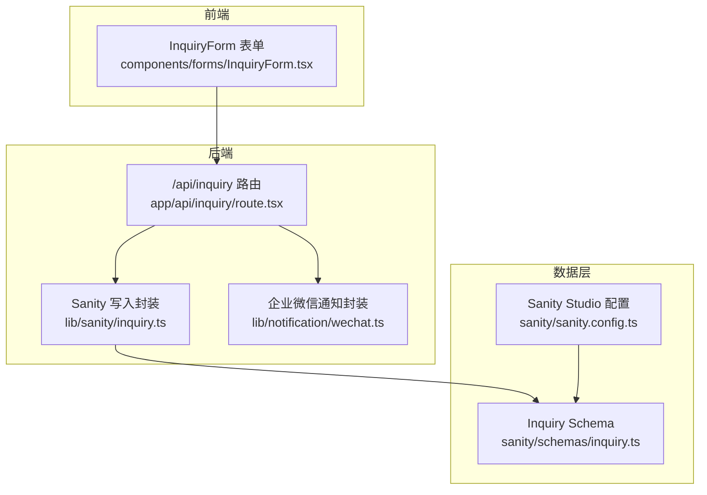
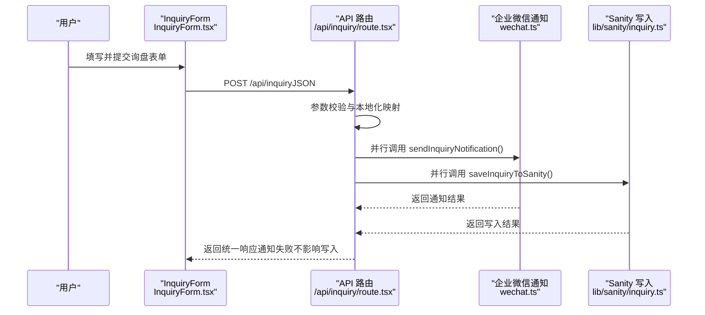
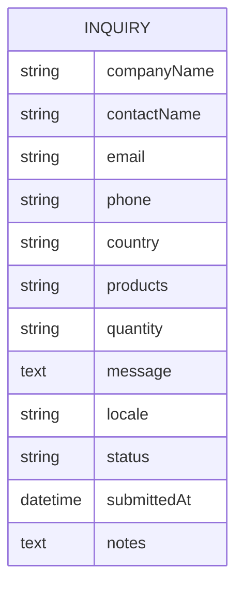
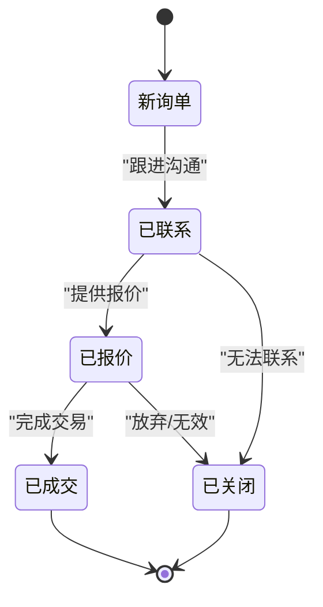
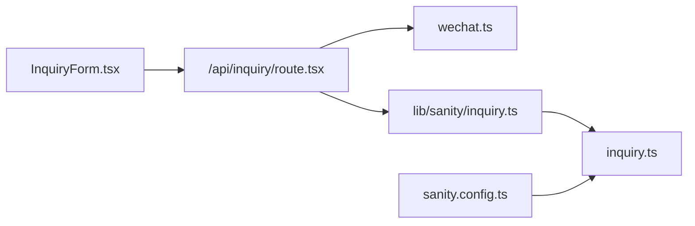

# 询盘模型

<cite>
**本文引用的文件**
- [sanity/schemas/inquiry.ts](file://sanity/schemas/inquiry.ts)
- [app/api/inquiry/route.tsx](file://app/api/inquiry/route.tsx)
- [components/forms/InquiryForm.tsx](file://components/forms/InquiryForm.tsx)
- [lib/sanity/inquiry.ts](file://lib/sanity/inquiry.ts)
- [lib/notification/wechat.ts](file://lib/notification/wechat.ts)
- [sanity/schemas/index.ts](file://sanity/schemas/index.ts)
- [sanity/sanity.config.ts](file://sanity/sanity.config.ts)
</cite>

## 目录
1. [简介](#简介)
2. [项目结构](#项目结构)
3. [核心组件](#核心组件)
4. [架构总览](#架构总览)
5. [详细组件分析](#详细组件分析)
6. [依赖分析](#依赖分析)
7. [性能考虑](#性能考虑)
8. [故障排除指南](#故障排除指南)
9. [结论](#结论)
10. [附录](#附录)

## 简介
本文件系统性地文档化“询盘模型”，涵盖以下方面：
- Inquiries（询盘）Schema 的字段设计与用途
- 询盘状态管理流程与状态转换
- 数据权限控制与访问限制
- 询盘与产品模型的关联关系
- 批量处理与导出能力现状与扩展建议
- 询盘邮件通知系统的集成配置与自动化处理流程
- 询盘数据分析与统计报表的实现方案

## 项目结构
本项目采用 Next.js 应用与 Sanity CMS 双栈架构：
- 前端表单组件负责收集用户输入并提交至 API
- Next.js API Route 接收请求，进行参数校验与国际化文案映射
- 通知模块通过企业微信 Webhook 实时推送
- Sanity SDK 将询盘数据持久化存储
- Sanity Studio 提供可视化管理界面

图表来源
- [app/api/inquiry/route.tsx:1-103](file://app/api/inquiry/route.tsx#L1-L103)
- [lib/sanity/inquiry.ts:1-73](file://lib/sanity/inquiry.ts#L1-L73)
- [lib/notification/wechat.ts:1-96](file://lib/notification/wechat.ts#L1-L96)
- [sanity/schemas/inquiry.ts:1-134](file://sanity/schemas/inquiry.ts#L1-L134)
- [sanity/sanity.config.ts:1-33](file://sanity/sanity.config.ts#L1-L33)

章节来源
- [sanity/sanity.config.ts:1-33](file://sanity/sanity.config.ts#L1-L33)
- [sanity/schemas/index.ts:1-9](file://sanity/schemas/index.ts#L1-L9)

## 核心组件
- Inquiry Schema（Sanity）
  - 字段覆盖：客户基本信息（公司名、联系人、邮箱、电话、国家/地区）、产品兴趣、数量、需求说明、语言、状态、提交时间、跟进备注
  - 初始状态为“新询单”，支持多语言枚举与排序
- API 路由（Next.js）
  - 校验必填字段，进行产品与国家名称的本地化映射，异步并行发送通知与写入 Sanity
- 通知模块（企业微信）
  - 通过 Webhook 推送 Markdown 格式的询盘提醒
- Sanity 写入封装
  - 使用 Sanity SDK 创建文档，填充默认字段与初始状态
- 前端表单组件
  - 收集客户信息、产品兴趣、数量与需求说明，提交后触发 GA4 转化事件

章节来源
- [sanity/schemas/inquiry.ts:12-99](file://sanity/schemas/inquiry.ts#L12-L99)
- [app/api/inquiry/route.tsx:21-102](file://app/api/inquiry/route.tsx#L21-L102)
- [lib/notification/wechat.ts:21-95](file://lib/notification/wechat.ts#L21-L95)
- [lib/sanity/inquiry.ts:32-72](file://lib/sanity/inquiry.ts#L32-L72)
- [components/forms/InquiryForm.tsx:45-117](file://components/forms/InquiryForm.tsx#L45-L117)

## 架构总览
下图展示从用户提交到数据入库与通知推送的整体流程：

图表来源
- [components/forms/InquiryForm.tsx:73-117](file://components/forms/InquiryForm.tsx#L73-L117)
- [app/api/inquiry/route.tsx:21-102](file://app/api/inquiry/route.tsx#L21-L102)
- [lib/notification/wechat.ts:21-95](file://lib/notification/wechat.ts#L21-L95)
- [lib/sanity/inquiry.ts:32-72](file://lib/sanity/inquiry.ts#L32-L72)

## 详细组件分析

### Inquiry Schema 字段设计
- 客户基本信息
  - 公司名称、联系人、邮箱、电话、国家/地区均为必填
- 产品询盘详情
  - 产品兴趣：字符串数组（对应产品 ID），最终以本地化名称拼接存储
  - 预计采购数量：字符串（如 1k-10k 等）
  - 详细需求：文本域
- 语言与状态
  - 语言：多语言枚举（中文、英文、印尼语、泰语、越南语、阿拉伯语）
  - 状态：枚举值（新询单、已联系、已报价、已成交、已关闭），初始值为“新询单”
- 时间与备注
  - 提交时间：只读，自动记录
  - 跟进备注：文本域，用于后续维护

图表来源
- [sanity/schemas/inquiry.ts:12-99](file://sanity/schemas/inquiry.ts#L12-L99)

章节来源
- [sanity/schemas/inquiry.ts:12-99](file://sanity/schemas/inquiry.ts#L12-L99)

### 询盘状态管理流程
- 状态枚举与初始值
  - 枚举：新询单、已联系、已报价、已成交、已关闭
  - 初始值：新询单
- 状态转换
  - 当前实现：API 路由与写入封装均将状态初始化为“新询单”
  - 扩展建议：在 Sanity Studio 中增加状态变更面板；在后端提供状态更新接口；在前端表单中暴露状态选择器

图表来源
- [sanity/schemas/inquiry.ts:74-87](file://sanity/schemas/inquiry.ts#L74-L87)
- [lib/sanity/inquiry.ts:61-61](file://lib/sanity/inquiry.ts#L61-L61)

章节来源
- [sanity/schemas/inquiry.ts:74-87](file://sanity/schemas/inquiry.ts#L74-L87)
- [lib/sanity/inquiry.ts:61-61](file://lib/sanity/inquiry.ts#L61-L61)

### 权限控制与访问限制
- 企业微信通知
  - 通过环境变量 WECHAT_WEBHOOK_URL 控制通知通道；未配置时仅记录警告，不阻断流程
- Sanity 写入
  - 通过环境变量 SANITY_API_TOKEN 进行鉴权；未配置时记录警告并返回失败
- API 访问
  - 当前 API 未启用额外鉴权中间件；建议在生产环境增加 CORS、速率限制与鉴权策略

章节来源
- [lib/notification/wechat.ts:22-27](file://lib/notification/wechat.ts#L22-L27)
- [lib/sanity/inquiry.ts:33-36](file://lib/sanity/inquiry.ts#L33-L36)
- [app/api/inquiry/route.tsx:14-19](file://app/api/inquiry/route.tsx#L14-L19)

### 询盘与产品模型的关联关系
- 当前实现
  - 产品兴趣以字符串数组形式存储，提交时根据语言映射为本地化名称字符串
  - 未建立与产品模型的强类型引用关系
- 关联建议
  - 在 Sanity Schema 中使用 typed reference 引用产品文档，便于查询与统计
  - 前端表单可直接绑定产品 ID，后端再进行名称映射与存储

章节来源
- [app/api/inquiry/route.tsx:44-47](file://app/api/inquiry/route.tsx#L44-L47)
- [lib/sanity/inquiry.ts:47-47](file://lib/sanity/inquiry.ts#L47-L47)

### 批量处理与导出功能
- 现状
  - 未提供批量导入/导出功能
- 实现建议
  - 导出：基于 Sanity 查询结果，按需生成 CSV/Excel 文件
  - 导入：提供 CSV 模板，后端解析并批量创建/更新文档
  - 批处理：结合 Next.js Cron 或外部调度工具定时执行

章节来源
- [sanity/schemas/inquiry.ts:121-132](file://sanity/schemas/inquiry.ts#L121-L132)

### 询盘邮件通知系统集成
- 当前集成
  - 企业微信 Webhook：通过 WECHAT_WEBHOOK_URL 推送 Markdown 通知
- 邮件集成建议
  - 使用 SMTP/第三方邮件服务（如 SendGrid、SES）发送邮件
  - 在 API 层新增邮件发送函数，并与通知模块并行执行
  - 配置模板引擎渲染动态内容

章节来源
- [lib/notification/wechat.ts:21-95](file://lib/notification/wechat.ts#L21-L95)
- [app/api/inquiry/route.tsx:76-80](file://app/api/inquiry/route.tsx#L76-L80)

### 数据分析与统计报表
- 现状
  - 未提供内置分析与报表功能
- 实现方案
  - 报表维度：按状态分布、按国家/地区分布、按产品兴趣分布、按提交时间趋势
  - 工具链：Sanity Vision 插件、自定义 Next.js 页面、BI 工具（如 Metabase、Superset）
  - 数据源：Sanity 查询 + Next.js API 暴露聚合数据

章节来源
- [sanity/sanity.config.ts:18-31](file://sanity/sanity.config.ts#L18-L31)

## 依赖分析
- 组件耦合
  - API 路由同时依赖通知与写入模块，采用并行执行提升吞吐
  - 表单组件与 API 路由通过 JSON 协议解耦
- 外部依赖
  - 企业微信 Webhook：网络可用性与鉴权
  - Sanity：项目 ID、数据集、令牌与 CDN 配置

图表来源
- [components/forms/InquiryForm.tsx:73-117](file://components/forms/InquiryForm.tsx#L73-L117)
- [app/api/inquiry/route.tsx:21-102](file://app/api/inquiry/route.tsx#L21-L102)
- [lib/notification/wechat.ts:21-95](file://lib/notification/wechat.ts#L21-L95)
- [lib/sanity/inquiry.ts:20-27](file://lib/sanity/inquiry.ts#L20-L27)
- [sanity/schemas/inquiry.ts:1-134](file://sanity/schemas/inquiry.ts#L1-L134)
- [sanity/sanity.config.ts:1-33](file://sanity/sanity.config.ts#L1-L33)

章节来源
- [sanity/schemas/index.ts:6-8](file://sanity/schemas/index.ts#L6-L8)

## 性能考虑
- 并行执行
  - API 层对通知与写入采用 Promise.all 并行处理，降低端到端延迟
- 网络与超时
  - 企业微信 Webhook 请求应设置合理超时与重试策略
- 数据库写入
  - Sanity 写入禁用 CDN，确保读写一致性；大批量写入建议分批与去重
- 前端体验
  - 表单提交状态反馈与 GA4 转化追踪，避免重复提交

章节来源
- [app/api/inquiry/route.tsx:76-80](file://app/api/inquiry/route.tsx#L76-L80)
- [lib/sanity/inquiry.ts:20-27](file://lib/sanity/inquiry.ts#L20-L27)
- [components/forms/InquiryForm.tsx:73-117](file://components/forms/InquiryForm.tsx#L73-L117)

## 故障排除指南
- 企业微信通知失败
  - 检查 WECHAT_WEBHOOK_URL 是否配置；查看返回的错误码与网络日志
- Sanity 写入失败
  - 检查 SANITY_API_TOKEN、项目 ID 与数据集配置；确认网络连通性
- API 返回 400
  - 必填字段缺失：公司名、联系人、邮箱、电话、国家
- API 返回 500
  - 后端异常或外部服务不可用；查看服务器日志

章节来源
- [lib/notification/wechat.ts:24-27](file://lib/notification/wechat.ts#L24-L27)
- [lib/sanity/inquiry.ts:33-36](file://lib/sanity/inquiry.ts#L33-L36)
- [app/api/inquiry/route.tsx:36-42](file://app/api/inquiry/route.tsx#L36-L42)
- [app/api/inquiry/route.tsx:95-101](file://app/api/inquiry/route.tsx#L95-L101)

## 结论
本询盘模型以简洁 Schema 与清晰流程为核心，实现了从前端表单到通知与数据存储的完整闭环。当前版本聚焦于基础功能与实时通知，建议后续在以下方面增强：
- 引入强类型产品关联与状态管理面板
- 增加权限控制与 API 鉴权
- 提供批量导入/导出与报表分析能力
- 扩展邮件通知与多渠道通知

## 附录

### 字段与流程速查
- 必填字段：公司名称、联系人、邮箱、电话、国家/地区
- 产品兴趣：字符串数组 → 本地化名称拼接存储
- 状态：新询单（初始）→ 后续可在后台或接口中变更
- 通知：企业微信 Webhook（可扩展为邮件）

章节来源
- [sanity/schemas/inquiry.ts:12-99](file://sanity/schemas/inquiry.ts#L12-L99)
- [app/api/inquiry/route.tsx:36-42](file://app/api/inquiry/route.tsx#L36-L42)
- [lib/notification/wechat.ts:21-95](file://lib/notification/wechat.ts#L21-L95)