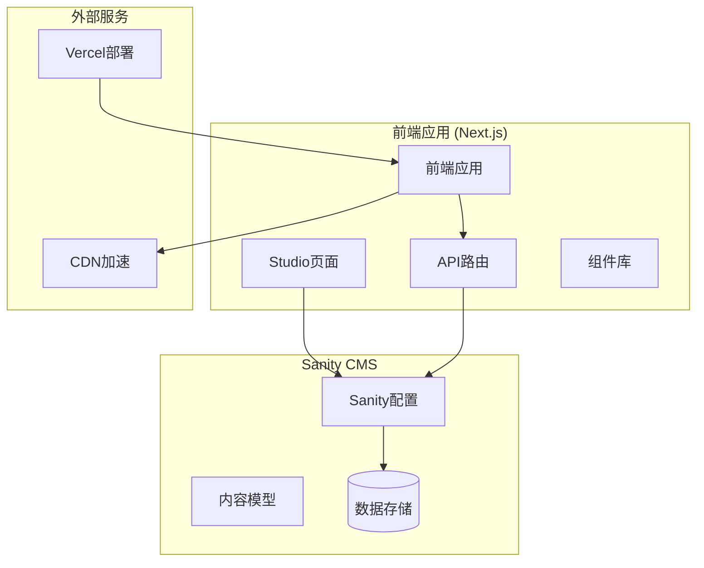
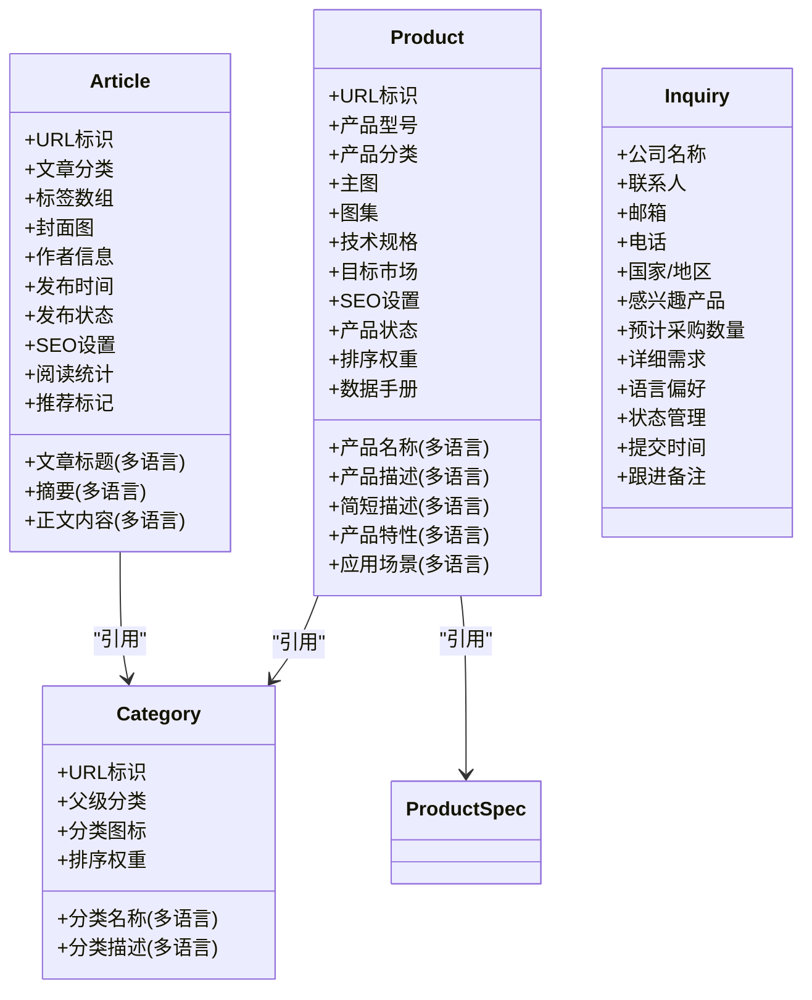
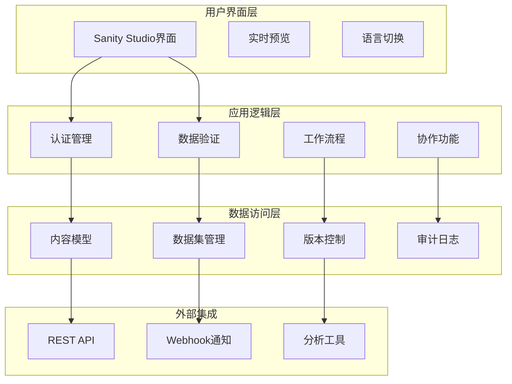
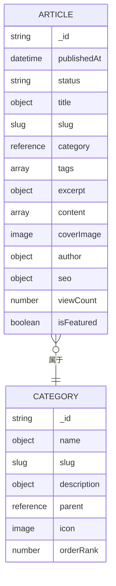
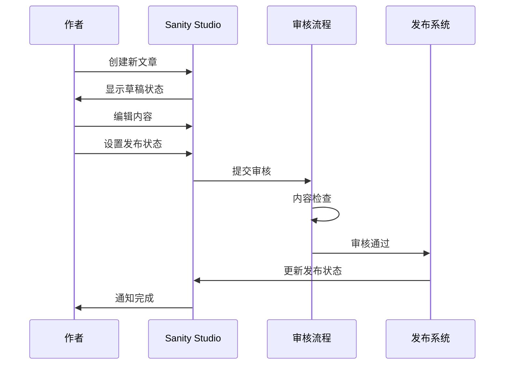
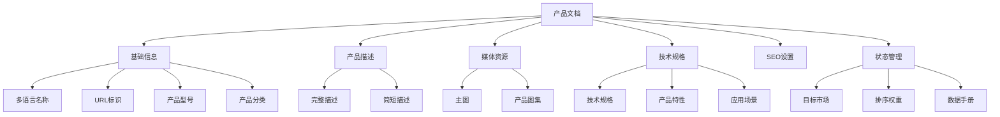
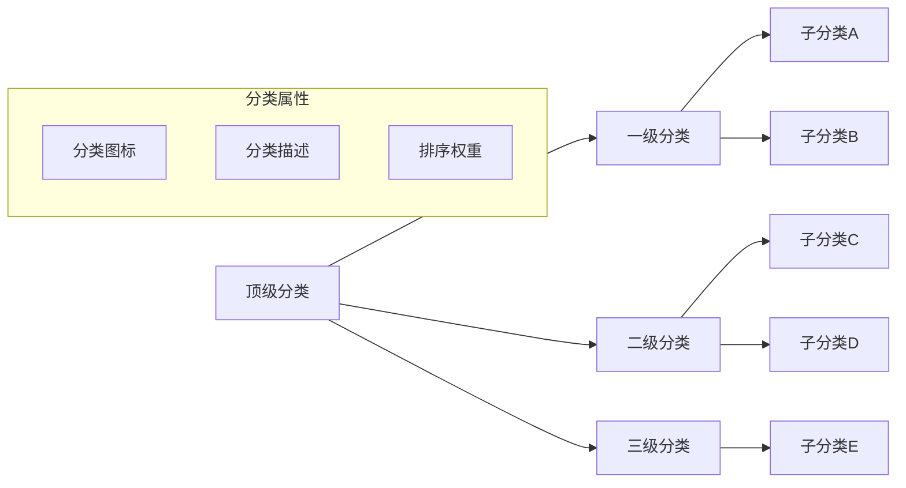
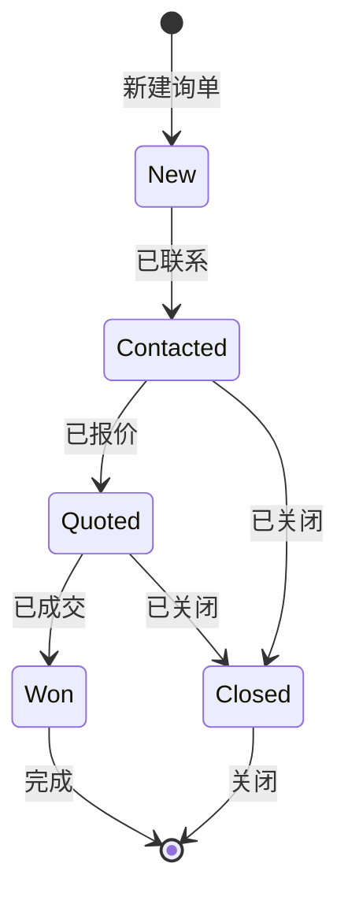
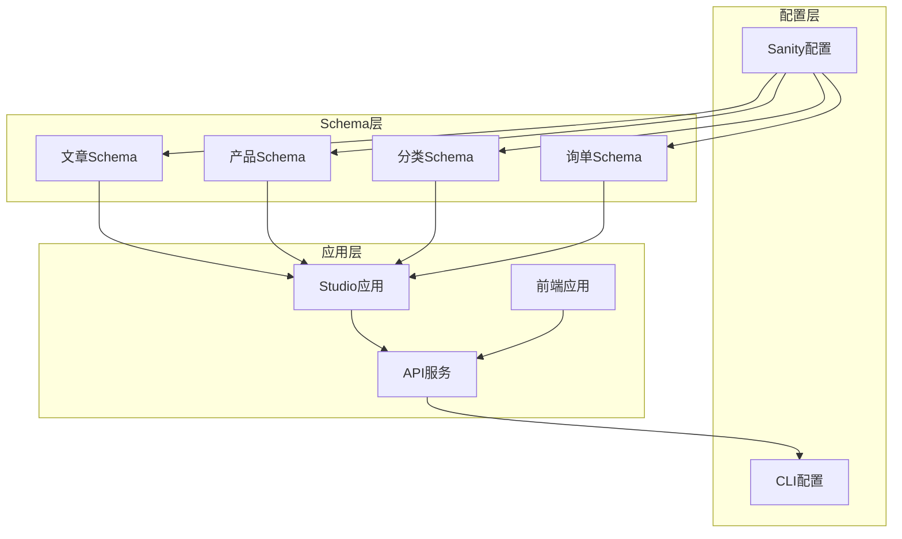

# 内容编辑工作流

<cite>
**本文档引用的文件**
- [sanity.config.ts](file://sanity/sanity.config.ts)
- [sanity.cli.ts](file://sanity/sanity.cli.ts)
- [schemas/index.ts](file://sanity/schemas/index.ts)
- [schemas/article.ts](file://sanity/schemas/article.ts)
- [schemas/product.ts](file://sanity/schemas/product.ts)
- [schemas/category.ts](file://sanity/schemas/category.ts)
- [schemas/inquiry.ts](file://sanity/schemas/inquiry.ts)
</cite>

## 目录
1. [简介](#简介)
2. [项目结构](#项目结构)
3. [核心组件](#核心组件)
4. [架构概览](#架构概览)
5. [详细组件分析](#详细组件分析)
6. [依赖关系分析](#依赖关系分析)
7. [性能考虑](#性能考虑)
8. [故障排除指南](#故障排除指南)
9. [结论](#结论)

## 简介

本项目是一个基于Next.js和Sanity CMS的企业官网解决方案，专注于LED技术和外贸业务。系统采用现代化的技术栈，结合了前端展示与内容管理的双重功能。

该项目的核心特色包括：
- 多语言内容管理（支持中文、英语、印尼语、泰语、越南语、阿拉伯语）
- 国际化界面支持（中英文切换）
- 完整的产品和资讯内容管理体系
- 专业的询单管理系统
- 高度可定制的内容模型架构

## 项目结构

项目采用前后端分离的架构设计，Sanity CMS独立部署，通过API与前端应用进行数据交互。

**图表来源**
- [sanity.config.ts:11-32](file://sanity/sanity.config.ts#L11-L32)
- [sanity/sanity.config.ts:1-33](file://sanity/sanity.config.ts#L1-L33)

**章节来源**
- [sanity.config.ts:1-33](file://sanity/sanity.config.ts#L1-L33)
- [sanity/sanity.cli.ts:1-9](file://sanity/sanity.cli.ts#L1-L9)

## 核心组件

### Sanity Studio配置

Sanity Studio作为内容管理的核心，提供了完整的编辑体验。配置文件定义了项目的基本信息、插件集成和国际化支持。

**主要配置项：**
- **项目标识**：gopro-trade-website
- **标题显示**：光莆外贸网站 CMS
- **插件集成**：Desk Tool（内容编辑）、Vision（数据可视化）
- **Schema绑定**：统一管理所有内容模型
- **国际化支持**：中英文界面切换

### 内容模型架构

系统采用模块化的Schema设计，每个内容类型都有明确的职责和字段定义：

**图表来源**
- [schemas/article.ts:4-265](file://sanity/schemas/article.ts#L4-L265)
- [schemas/product.ts:4-233](file://sanity/schemas/product.ts#L4-L233)
- [schemas/category.ts:4-74](file://sanity/schemas/category.ts#L4-L74)
- [schemas/inquiry.ts:8-134](file://sanity/schemas/inquiry.ts#L8-L134)

**章节来源**
- [schemas/index.ts:1-9](file://sanity/schemas/index.ts#L1-L9)
- [schemas/article.ts:1-265](file://sanity/schemas/article.ts#L1-L265)
- [schemas/product.ts:1-233](file://sanity/schemas/product.ts#L1-L233)

## 架构概览

系统采用分层架构设计，确保内容管理的灵活性和扩展性。

**图表来源**
- [sanity.config.ts:18-31](file://sanity/sanity.config.ts#L18-L31)
- [schemas/article.ts:154-173](file://sanity/schemas/article.ts#L154-L173)
- [schemas/product.ts:189-203](file://sanity/schemas/product.ts#L189-L203)

## 详细组件分析

### 文章管理系统

文章系统是内容管理的核心模块，支持多语言内容创作和发布。

#### 字段结构分析

**图表来源**
- [schemas/article.ts:8-41](file://sanity/schemas/article.ts#L8-L41)
- [schemas/article.ts:154-186](file://sanity/schemas/article.ts#L154-L186)

#### 发布工作流程

**图表来源**
- [schemas/article.ts:162-173](file://sanity/schemas/article.ts#L162-L173)
- [schemas/article.ts:249-255](file://sanity/schemas/article.ts#L249-L255)

**章节来源**
- [schemas/article.ts:1-265](file://sanity/schemas/article.ts#L1-L265)

### 产品管理系统

产品系统专门处理产品目录和相关信息管理。

#### 产品数据模型

**图表来源**
- [schemas/product.ts:8-98](file://sanity/schemas/product.ts#L8-L98)
- [schemas/product.ts:148-222](file://sanity/schemas/product.ts#L148-L222)

**章节来源**
- [schemas/product.ts:1-233](file://sanity/schemas/product.ts#L1-L233)

### 分类管理系统

分类系统支持多层次的产品分类结构。

#### 分类层次结构

**图表来源**
- [schemas/category.ts:46-51](file://sanity/schemas/category.ts#L46-L51)
- [schemas/category.ts:67-72](file://sanity/schemas/category.ts#L67-L72)

**章节来源**
- [schemas/category.ts:1-74](file://sanity/schemas/category.ts#L1-L74)

### 询单管理系统

询单系统专门处理客户询价和销售跟进。

#### 询单状态流转

**图表来源**
- [schemas/inquiry.ts:77-86](file://sanity/schemas/inquiry.ts#L77-L86)

**章节来源**
- [schemas/inquiry.ts:1-134](file://sanity/schemas/inquiry.ts#L1-L134)

## 依赖关系分析

系统各组件之间的依赖关系清晰明确，遵循单一职责原则。

**图表来源**
- [sanity.config.ts:23-25](file://sanity/sanity.config.ts#L23-L25)
- [schemas/index.ts:1-9](file://sanity/schemas/index.ts#L1-L9)

**章节来源**
- [sanity.config.ts:1-33](file://sanity/sanity.config.ts#L1-L33)
- [sanity/sanity.cli.ts:1-9](file://sanity/sanity.cli.ts#L1-L9)

## 性能考虑

### 数据加载优化

系统通过以下方式优化性能：
- **懒加载**：非关键资源按需加载
- **缓存策略**：合理利用浏览器缓存和CDN
- **数据压缩**：减少传输体积
- **并发处理**：多个请求并行执行

### 编辑器性能

- **增量渲染**：只更新变化的部分
- **虚拟滚动**：大量内容的高效展示
- **防抖处理**：输入事件的节流
- **内存管理**：及时清理未使用的资源

## 故障排除指南

### 常见问题及解决方案

#### 连接问题
- **症状**：无法连接到Sanity Studio
- **原因**：网络连接或配置错误
- **解决**：检查项目ID和数据集配置

#### 权限问题
- **症状**：无法编辑内容
- **原因**：用户权限不足
- **解决**：检查用户角色和权限设置

#### 数据同步问题
- **症状**：内容更新不生效
- **原因**：缓存或版本冲突
- **解决**：清除缓存并重新加载

**章节来源**
- [sanity/sanity.cli.ts:4-8](file://sanity/sanity.cli.ts#L4-L8)
- [sanity/sanity.config.ts:7-9](file://sanity/sanity.config.ts#L7-L9)

## 结论

本项目成功构建了一个功能完整、扩展性强的内容管理系统。通过模块化的Schema设计和清晰的架构分层，实现了多语言内容管理、产品目录管理和客户关系管理的有机结合。

系统的亮点包括：
- **多语言支持**：全面的语言本地化能力
- **灵活的工作流**：支持草稿、审核和发布的完整流程
- **强大的Schema系统**：高度可定制的内容模型
- **优秀的用户体验**：直观易用的编辑界面

未来可以考虑的功能增强：
- 更细粒度的权限控制
- 自动化的内容审核
- 更丰富的数据分析功能
- 集成更多的第三方服务