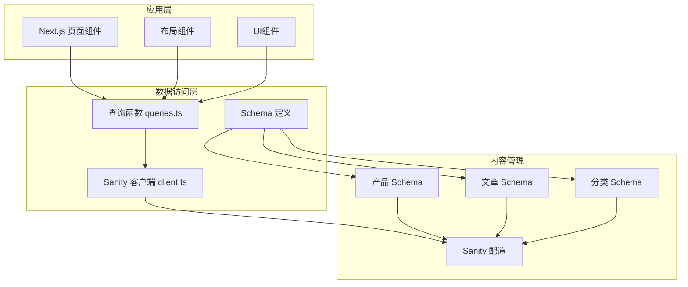
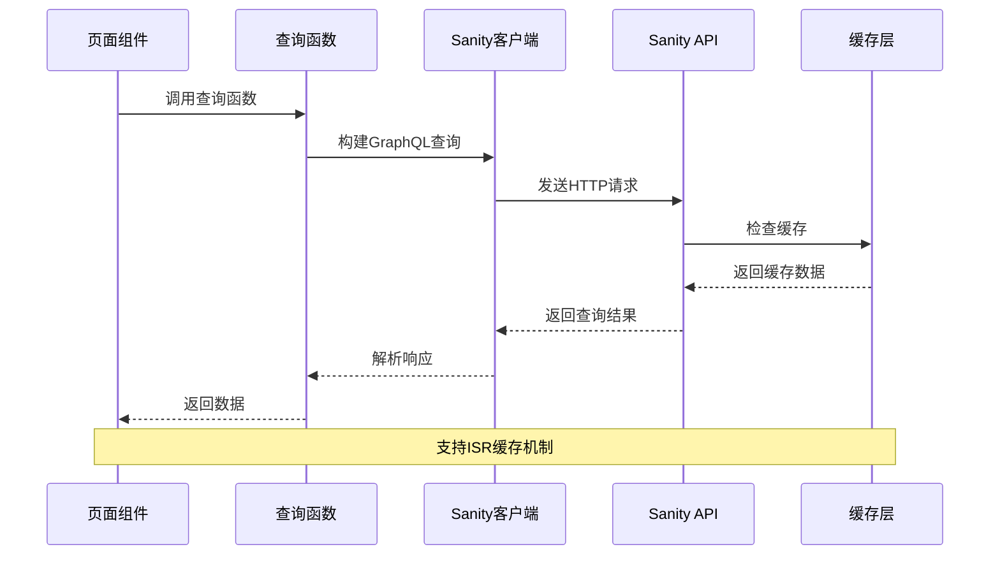
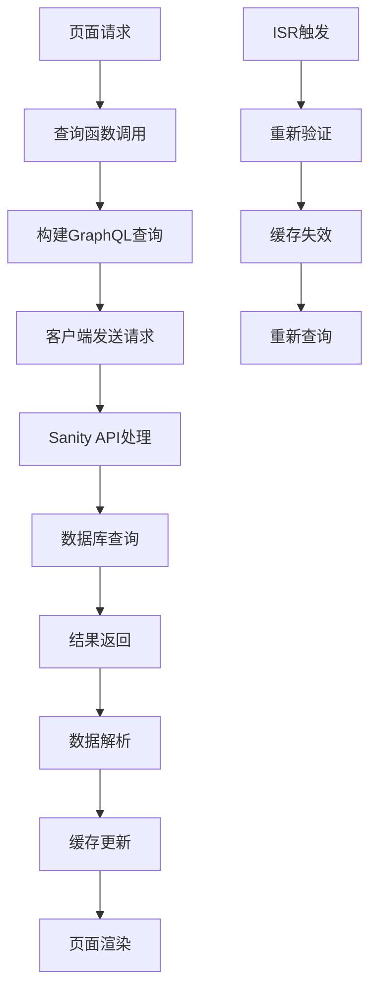
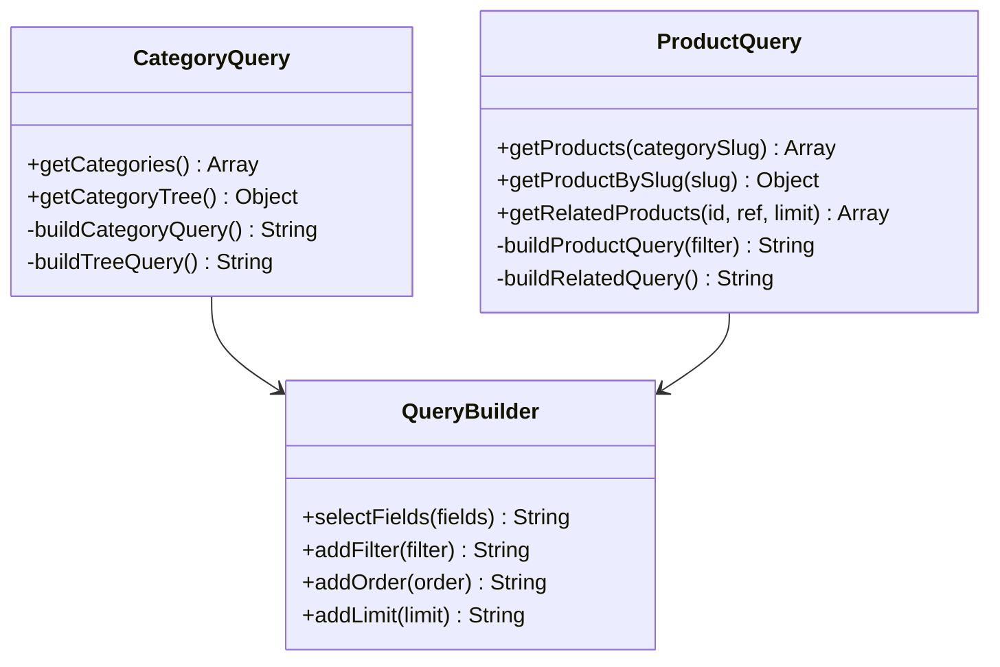
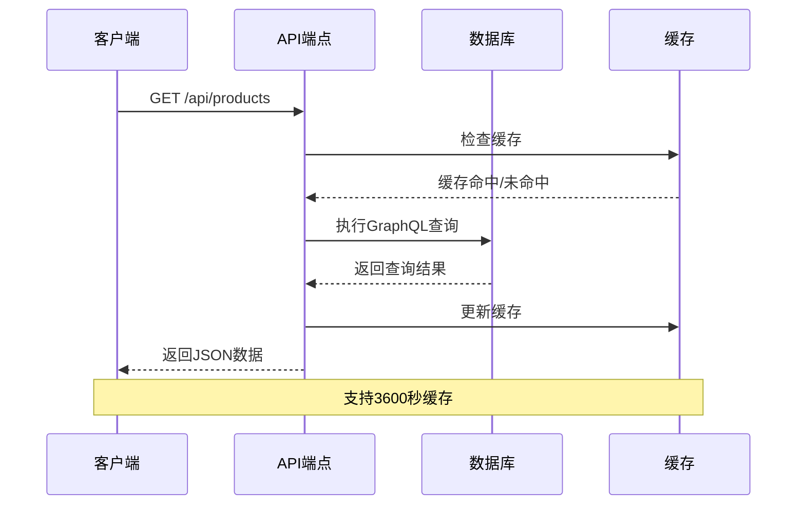
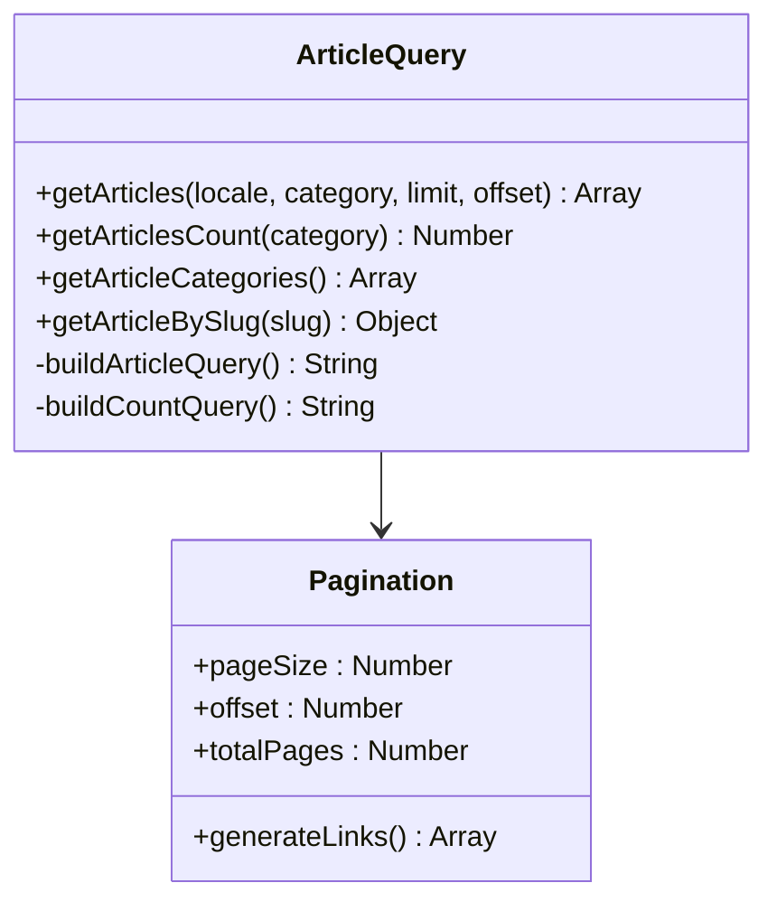
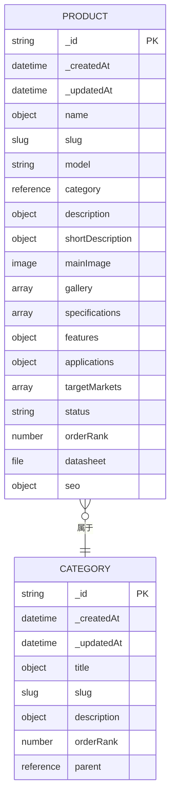
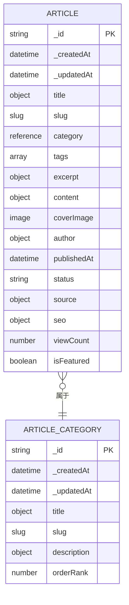
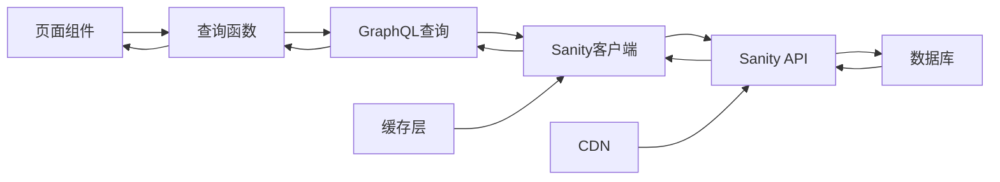

# 数据查询系统

<cite>
**本文档引用的文件**
- [queries.ts](file://lib/sanity/queries.ts)
- [client.ts](file://lib/sanity/client.ts)
- [sanity.config.ts](file://sanity/sanity.config.ts)
- [product.ts](file://sanity/schemas/product.ts)
- [article.ts](file://sanity/schemas/article.ts)
- [articleCategory.ts](file://sanity/schemas/articleCategory.ts)
- [index.ts](file://sanity/schemas/index.ts)
- [products/page.tsx](file://app/[locale]/products/page.tsx)
- [products/[slug]/page.tsx](file://app/[locale]/products/[slug]/page.tsx)
- [news/page.tsx](file://app/[locale]/news/page.tsx)
</cite>

## 目录
1. [简介](#简介)
2. [项目结构](#项目结构)
3. [核心组件](#核心组件)
4. [架构概览](#架构概览)
5. [详细组件分析](#详细组件分析)
6. [依赖关系分析](#依赖关系分析)
7. [性能考虑](#性能考虑)
8. [故障排除指南](#故障排除指南)
9. [结论](#结论)
10. [附录](#附录)

## 简介

本项目采用Next.js框架构建的国际化网站，集成了Sanity内容管理系统进行数据管理。数据查询系统是整个应用的核心，负责从Sanity数据库获取产品、文章等内容数据，并通过GraphQL查询语法实现复杂的数据检索需求。

系统采用现代化的查询模式，包括：
- **产品查询**：支持分类筛选、父子分类关联查询、相关产品推荐
- **文章查询**：支持分类筛选、分页查询、SEO优化
- **分类查询**：支持平铺分类和树形分类结构
- **国际化支持**：多语言字段查询和本地化处理

## 项目结构



**图表来源**
- [queries.ts:1-120](file://lib/sanity/queries.ts#L1-L120)
- [client.ts:1-30](file://lib/sanity/client.ts#L1-L30)
- [sanity.config.ts:1-33](file://sanity/sanity.config.ts#L1-L33)

**章节来源**
- [queries.ts:1-120](file://lib/sanity/queries.ts#L1-L120)
- [client.ts:1-30](file://lib/sanity/client.ts#L1-L30)
- [sanity.config.ts:1-33](file://sanity/sanity.config.ts#L1-L33)

## 核心组件

### 查询函数模块

查询函数模块位于`lib/sanity/queries.ts`，提供了完整的数据查询接口：

#### 产品查询函数
- `getCategories()`: 获取所有产品分类（平铺结构）
- `getCategoryTree()`: 获取分类树（顶级+子级结构）
- `getProducts(categorySlug?: string)`: 获取产品列表，支持分类筛选
- `getProductBySlug(slug: string)`: 获取单个产品详情
- `getAllProductSlugs()`: 获取所有产品slug
- `getProductsBySlugList(slugs: string[])`: 批量获取产品信息
- `getRelatedProducts(productId: string, categoryRef: string, limit: number)`: 获取相关产品

#### GraphQL查询语法特点
- 使用`*_type`进行类型筛选
- 通过`| order()`实现排序
- 使用`[0]`获取单个文档
- 通过`[start...end]`实现分页
- 使用`$variable`实现参数化查询

**章节来源**
- [queries.ts:1-120](file://lib/sanity/queries.ts#L1-L120)

### 客户端配置模块

客户端配置位于`lib/sanity/client.ts`，负责Sanity连接管理：

#### 连接配置
- **项目ID**: `nckyp28c`（硬编码配置）
- **数据集**: `production`
- **API版本**: `2024-03-10`
- **CDN**: 禁用（确保实时数据）

#### 认证机制
- 使用环境变量`SANITY_API_TOKEN`进行认证
- 仅用于写入操作（如自动化发布）

#### 图像处理
- 提供`urlFor()`和`urlForImage()`图像URL生成函数

**章节来源**
- [client.ts:1-30](file://lib/sanity/client.ts#L1-L30)

## 架构概览



**图表来源**
- [queries.ts:1-120](file://lib/sanity/queries.ts#L1-L120)
- [client.ts:1-30](file://lib/sanity/client.ts#L1-L30)

### 数据流架构



**图表来源**
- [queries.ts:1-120](file://lib/sanity/queries.ts#L1-L120)
- [products/page.tsx:93-96](file://app/[locale]/products/page.tsx#L93-L96)

## 详细组件分析

### 产品查询系统

#### 分类查询实现



**图表来源**
- [queries.ts:3-119](file://lib/sanity/queries.ts#L3-L119)

#### 产品查询流程



**图表来源**
- [queries.ts:30-66](file://lib/sanity/queries.ts#L30-L66)
- [products/page.tsx:93-96](file://app/[locale]/products/page.tsx#L93-L96)

**章节来源**
- [queries.ts:3-119](file://lib/sanity/queries.ts#L3-L119)
- [products/page.tsx:93-96](file://app/[locale]/products/page.tsx#L93-L96)

### 文章查询系统

#### 文章查询实现

文章查询系统位于独立的模块中，与产品查询系统并行工作：



**图表来源**
- [news/page.tsx:100-104](file://app/[locale]/news/page.tsx#L100-L104)

#### 分页查询实现

```mermaid
flowchart TD
A[用户请求第N页] --> B[计算偏移量]
B --> C[pageSize = 9]
C --> D[offset = (N-1) × pageSize]
D --> E[执行查询]
E --> F[获取数据]
F --> G[计算总页数]
G --> H[渲染页面]
I[分类筛选] --> J[添加分类过滤器]
J --> E
```

**图表来源**
- [news/page.tsx:94-106](file://app/[locale]/news/page.tsx#L94-L106)

**章节来源**
- [news/page.tsx:1-279](file://app/[locale]/news/page.tsx#L1-L279)

### 数据模型设计

#### 产品Schema结构



**图表来源**
- [product.ts:1-233](file://sanity/schemas/product.ts#L1-L233)
- [article.ts:1-265](file://sanity/schemas/article.ts#L1-L265)

#### 文章Schema结构



**图表来源**
- [article.ts:1-265](file://sanity/schemas/article.ts#L1-L265)
- [articleCategory.ts:1-59](file://sanity/schemas/articleCategory.ts#L1-L59)

**章节来源**
- [product.ts:1-233](file://sanity/schemas/product.ts#L1-L233)
- [article.ts:1-265](file://sanity/schemas/article.ts#L1-L265)
- [articleCategory.ts:1-59](file://sanity/schemas/articleCategory.ts#L1-L59)

## 依赖关系分析

### 组件依赖图

```mermaid
graph TB
subgraph "查询层"
A[queries.ts]
B[articles.ts]
end
subgraph "客户端层"
C[client.ts]
D[urlBuilder]
end
subgraph "页面层"
E[products/page.tsx]
F[products/[slug]/page.tsx]
G[news/page.tsx]
end
subgraph "Schema层"
H[product.ts]
I[article.ts]
J[articleCategory.ts]
K[index.ts]
end
A --> C
B --> C
E --> A
F --> A
G --> B
H --> K
I --> K
J --> K
C --> D
```

**图表来源**
- [queries.ts:1-2](file://lib/sanity/queries.ts#L1-L2)
- [client.ts:1-2](file://lib/sanity/client.ts#L1-L2)
- [products/page.tsx:5-6](file://app/[locale]/products/page.tsx#L5-L6)
- [news/page.tsx](file://app/[locale]/news/page.tsx#L5)

### 数据流依赖



**图表来源**
- [queries.ts:1-120](file://lib/sanity/queries.ts#L1-L120)
- [client.ts:9-15](file://lib/sanity/client.ts#L9-L15)

**章节来源**
- [queries.ts:1-120](file://lib/sanity/queries.ts#L1-L120)
- [client.ts:1-30](file://lib/sanity/client.ts#L1-L30)

## 性能考虑

### 缓存策略

#### ISR（增量静态重建）配置
- **产品页面**: 3600秒（1小时）重新验证
- **新闻页面**: 300秒（5分钟）重新验证
- **动态路由**: 支持静态参数生成

#### CDN配置
- 当前配置为禁用CDN（useCdn: false）
- 适用于需要实时数据的场景

### 查询优化

#### 预加载策略
- 使用`Promise.all()`并发执行多个查询
- 在产品页面中同时获取产品列表和分类树

#### 懒加载实现
- 图片组件使用`priority`属性优化首屏加载
- 使用`sizes`属性提供响应式图片尺寸建议

#### 分页优化
- 后端分页：通过`[start...end]`实现
- 前端分页：通过`offset`和`pageSize`控制

**章节来源**
- [products/page.tsx:27-27](file://app/[locale]/products/page.tsx#L27-L27)
- [news/page.tsx:48-48](file://app/[locale]/news/page.tsx#L48-L48)

## 故障排除指南

### 常见问题诊断

#### 查询失败排查
1. **检查API密钥配置**
   - 确认`SANITY_API_TOKEN`环境变量设置
   - 验证项目ID和数据集配置

2. **GraphQL语法检查**
   - 验证查询字符串格式
   - 检查字段选择器语法

3. **网络连接问题**
   - 确认网络连接正常
   - 检查防火墙设置

#### 性能问题排查
1. **缓存失效**
   - 检查`revalidate`配置
   - 验证缓存更新策略

2. **查询超时**
   - 优化查询语句
   - 减少不必要的字段选择

3. **内存泄漏**
   - 检查长生命周期组件
   - 验证事件监听器清理

### 调试工具使用

#### 开发者工具
- **浏览器开发者工具**: 监控网络请求和响应
- **React DevTools**: 检查组件状态和props
- **Next.js调试**: 使用`next dev --debug`启动

#### 日志记录
- 在查询函数中添加错误处理
- 记录查询时间和结果大小
- 监控API响应时间

**章节来源**
- [client.ts:7-7](file://lib/sanity/client.ts#L7-L7)
- [queries.ts:1-120](file://lib/sanity/queries.ts#L1-L120)

## 结论

本数据查询系统采用模块化设计，具有以下优势：

1. **清晰的职责分离**: 查询函数、客户端配置、Schema定义各司其职
2. **强大的查询能力**: 支持复杂的GraphQL查询语法
3. **优秀的性能表现**: 实现了缓存、预加载、分页等优化策略
4. **完善的错误处理**: 提供了全面的错误处理和调试机制

系统在产品和文章管理方面表现出色，能够满足国际化网站的复杂需求。通过合理的架构设计和优化策略，确保了良好的用户体验和开发效率。

## 附录

### GraphQL查询最佳实践

#### 字段选择优化
- 仅选择需要的字段
- 避免深度嵌套查询
- 使用别名简化响应结构

#### 参数化查询
- 使用$变量传递参数
- 避免字符串拼接
- 确保查询安全性

#### 错误处理模式
```typescript
try {
  const result = await sanityClient.fetch(query, params);
  return result;
} catch (error) {
  console.error('查询失败:', error);
  throw new Error(`数据查询错误: ${error.message}`);
}
```

### 配置参考

#### 环境变量配置
- `SANITY_API_TOKEN`: API访问令牌
- `NEXT_PUBLIC_SITE_URL`: 站点基础URL
- `NEXT_PUBLIC_SANITY_PROJECT_ID`: 项目ID
- `NEXT_PUBLIC_SANITY_DATASET`: 数据集名称

#### 缓存配置选项
- `revalidate`: 缓存重新验证时间（秒）
- `useCdn`: 是否使用CDN
- `apiVersion`: API版本号