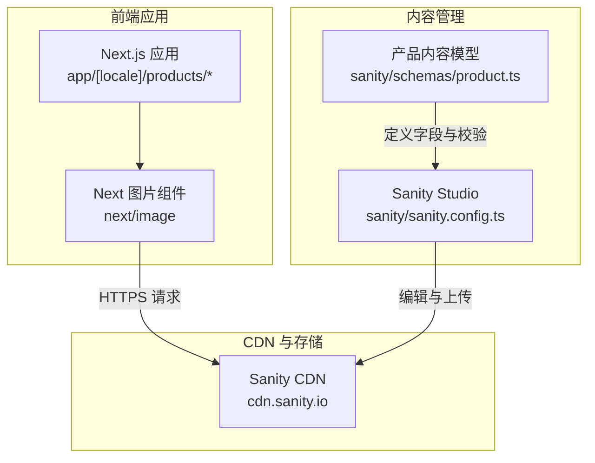
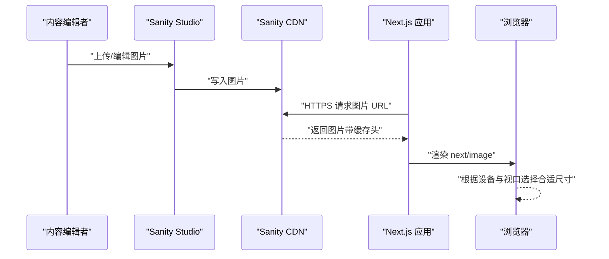
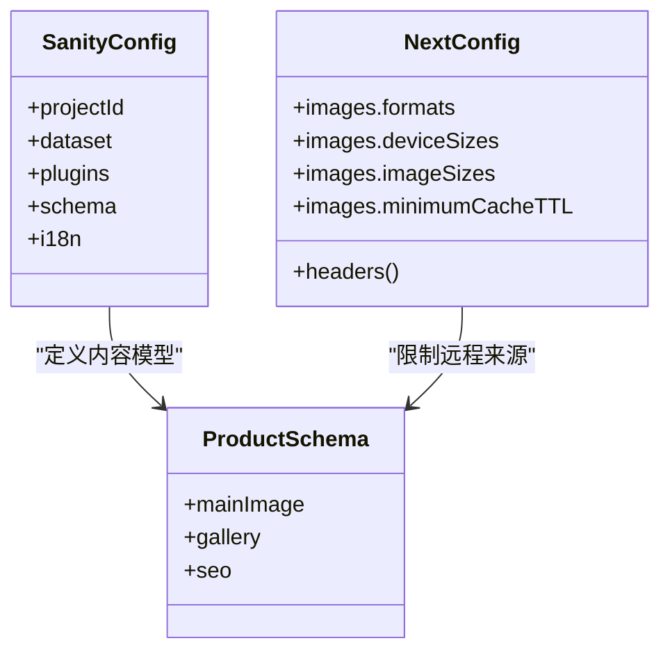
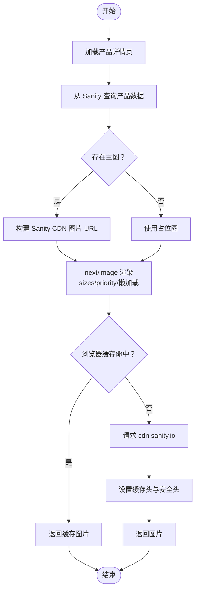
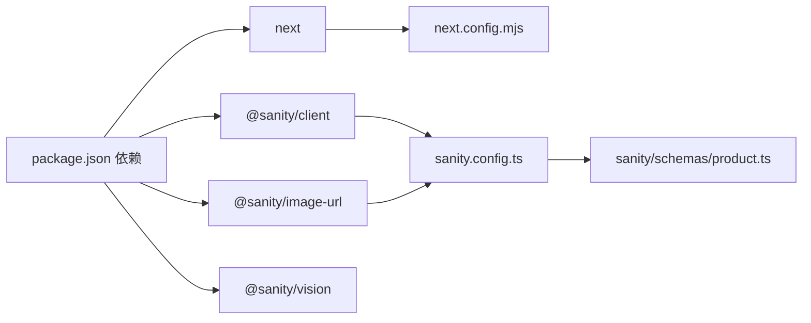

# 产品图片优化

<cite>
**本文引用的文件**
- [sanity.config.ts](file://sanity/sanity.config.ts)
- [product.ts](file://sanity/schemas/product.ts)
- [next.config.mjs](file://next.config.mjs)
- [package.json](file://package.json)
- [app/[locale]/products/[slug]/page.tsx](file://app/[locale]/products/[slug]/page.tsx)
- [app/[locale]/products/page.tsx](file://app/[locale]/products/page.tsx)
</cite>

## 目录
1. [简介](#简介)
2. [项目结构](#项目结构)
3. [核心组件](#核心组件)
4. [架构总览](#架构总览)
5. [详细组件分析](#详细组件分析)
6. [依赖关系分析](#依赖关系分析)
7. [性能考量](#性能考量)
8. [故障排查指南](#故障排查指南)
9. [结论](#结论)
10. [附录](#附录)

## 简介
本文件面向 GoPro Trade 产品图片优化系统，围绕 Sanity 内容管理与 Next.js 图片优化能力，系统化阐述以下主题：
- Sanity CDN 集成配置：图片上传、存储、CDN 分发与访问控制
- 响应式图片实现：多尺寸生成、srcset 与 sizes 配置、现代图片格式（AVIF/WebP）
- 图片懒加载与缓存策略：Intersection Observer 语义、缓存头与最小缓存时间
- SEO 优化：alt 标签、结构化数据、Open Graph、Twitter Card、关键词
- 缓存策略与 CDN 配置：缓存头、版本控制与失效处理
- 最佳实践与性能监控建议

## 项目结构
本项目采用 Next.js App Router 与 Sanity CMS 的组合：
- 前端渲染层：Next.js 应用位于 app/ 目录，使用 next/image 实现响应式与懒加载
- 内容层：Sanity Studio 提供图片上传与元数据编辑，图片托管于 cdn.sanity.io
- 构建与部署：Next.js 通过 next.config.mjs 配置图片格式、设备像素比、远程模式与缓存头

图表来源
- [sanity.config.ts:11-32](file://sanity/sanity.config.ts#L11-L32)
- [product.ts:75-90](file://sanity/schemas/product.ts#L75-L90)
- [next.config.mjs:4-17](file://next.config.mjs#L4-L17)

章节来源
- [sanity.config.ts:1-33](file://sanity/sanity.config.ts#L1-L33)
- [product.ts:1-233](file://sanity/schemas/product.ts#L1-L233)
- [next.config.mjs:1-65](file://next.config.mjs#L1-L65)

## 核心组件
- Sanity 配置与认证
  - 通过项目 ID 与数据集配置连接，支持中英文界面切换
- 产品内容模型
  - 定义主图与图集字段，支持多语言 SEO 元数据
- Next.js 图片优化
  - 启用 AVIF/WebP 现代格式、多尺寸与设备像素比、远程模式匹配 cdn.sanity.io
  - 设置最小缓存时间与全局缓存头，提升 LCP 与缓存命中率
- 产品详情页与列表页
  - 使用 next/image 渲染主图与缩略图，配置 sizes 与 priority，生成结构化数据与社交卡片

章节来源
- [sanity.config.ts:7-32](file://sanity/sanity.config.ts#L7-L32)
- [product.ts:75-187](file://sanity/schemas/product.ts#L75-L187)
- [next.config.mjs:4-17](file://next.config.mjs#L4-L17)
- [app/[locale]/products/[slug]/page.tsx:266-276](file://app/[locale]/products/[slug]/page.tsx#L266-L276)
- [app/[locale]/products/page.tsx:231-239](file://app/[locale]/products/page.tsx#L231-L239)

## 架构总览
下图展示了从内容编辑到前端渲染的完整链路，以及图片在 CDN 上的分发与缓存策略。

图表来源
- [sanity.config.ts:11-32](file://sanity/sanity.config.ts#L11-L32)
- [next.config.mjs:4-17](file://next.config.mjs#L4-L17)
- [app/[locale]/products/[slug]/page.tsx:266-276](file://app/[locale]/products/[slug]/page.tsx#L266-L276)

## 详细组件分析

### Sanity CDN 集成与配置
- 项目 ID 与数据集
  - 优先读取环境变量，未配置时使用默认值，确保本地与 CI 环境可运行
- Studio 插件与国际化
  - 启用 Desk Tool 与 Vision 工具，支持中英文界面
- 内容模型中的图片字段
  - 主图与图集均为 image 类型，支持热点编辑；SEO 字段包含多语言 metaTitle 与 metaDescription
- 远程模式与 CDN 访问
  - next.config.mjs 中 remotePatterns 仅允许 https://cdn.sanity.io，确保只从官方 CDN 加载图片

章节来源
- [sanity.config.ts:7-32](file://sanity/sanity.config.ts#L7-L32)
- [product.ts:75-187](file://sanity/schemas/product.ts#L75-L187)
- [next.config.mjs:11-16](file://next.config.mjs#L11-L16)

### 响应式图片实现（sizes 与现代格式）
- 现代图片格式
  - formats: ['image/avif', 'image/webp']，自动为支持的浏览器返回最优格式
- 设备像素比与尺寸
  - deviceSizes 与 imageSizes 定义了多尺寸输出，配合 next/image 的自动 srcset 生成
- sizes 配置
  - 详情页主图使用 "(max-width: 1024px) 100vw, 50vw"，适配移动端与桌面端布局
  - 列表页缩略图使用 "(max-width: 768px) 100vw, (max-width: 1280px) 50vw, 33vw"，兼顾网格密度
- 图片懒加载
  - 详情页主图设置 priority，确保首屏关键图片优先加载；其他图片默认懒加载

章节来源
- [next.config.mjs:5-8](file://next.config.mjs#L5-L8)
- [app/[locale]/products/[slug]/page.tsx:274](file://app/[locale]/products/[slug]/page.tsx#L274)
- [app/[locale]/products/page.tsx:237](file://app/[locale]/products/page.tsx#L237)

### 图片懒加载机制与缓存策略
- 懒加载语义
  - next/image 默认使用 Intersection Observer 实现懒加载，无需额外 JS 即可实现
- 缓存头与最小缓存时间
  - images.minimumCacheTTL 设置为 30 天，减少重复请求
  - 对 /images 静态资源设置 public, max-age=31536000, immutable，实现长期缓存
- 安全与性能响应头
  - 隐藏 X-Powered-By，统一设置 X-Content-Type-Options、X-Frame-Options、Referrer-Policy

章节来源
- [next.config.mjs:9-10](file://next.config.mjs#L9-L10)
- [next.config.mjs:35-61](file://next.config.mjs#L35-L61)

### 图片 SEO 优化策略
- 结构化数据
  - 详情页注入产品与面包屑结构化数据，提升搜索可见性
- Open Graph 与 Twitter Card
  - 详情页与列表页均生成社交卡片，指定图片尺寸与 alt
- 关键词与元信息
  - 动态生成 keywords，结合产品名称、型号、分类与品牌词
- alt 标签
  - 详情页与列表页均以产品名称作为 alt 文本，保证可访问性与 SEO

章节来源
- [app/[locale]/products/[slug]/page.tsx:218-239](file://app/[locale]/products/[slug]/page.tsx#L218-L239)
- [app/[locale]/products/[slug]/page.tsx:94-140](file://app/[locale]/products/[slug]/page.tsx#L94-L140)
- [app/[locale]/products/page.tsx:35-78](file://app/[locale]/products/page.tsx#L35-L78)

### 图片缓存策略与 CDN 配置
- CDN 白名单
  - remotePatterns 仅允许 cdn.sanity.io，避免跨域风险与非预期源
- 长期缓存
  - /images 路径设置 immutable，字体文件同样长期缓存
- 版本控制与失效
  - 通过 Sanity CDN 的 URL 版本能力与 Next.js 缓存 TTL 实现版本化与失效控制
- 安全加固
  - 统一的安全响应头减少攻击面

章节来源
- [next.config.mjs:11-16](file://next.config.mjs#L11-L16)
- [next.config.mjs:39-50](file://next.config.mjs#L39-L50)
- [next.config.mjs:25-26](file://next.config.mjs#L25-L26)

### 代码级组件关系（类图）

图表来源
- [sanity.config.ts:11-32](file://sanity/sanity.config.ts#L11-L32)
- [product.ts:75-187](file://sanity/schemas/product.ts#L75-L187)
- [next.config.mjs:4-17](file://next.config.mjs#L4-L17)

### 流程图：图片渲染与缓存

图表来源
- [app/[locale]/products/[slug]/page.tsx:266-276](file://app/[locale]/products/[slug]/page.tsx#L266-L276)
- [next.config.mjs:35-61](file://next.config.mjs#L35-L61)

## 依赖关系分析
- 依赖概览
  - Next.js 14：内置 next/image、App Router、构建优化
  - @sanity/client 与 @sanity/image-url：与 Sanity 交互与 URL 构建
  - @sanity/vision：可视化工具
- 关键耦合点
  - next.config.mjs 的 remotePatterns 与 Sanity CDN 强耦合
  - 产品模型的 mainImage/gallery 字段决定前端渲染逻辑

图表来源
- [package.json:12-28](file://package.json#L12-L28)
- [next.config.mjs:1-65](file://next.config.mjs#L1-L65)
- [sanity.config.ts:1-33](file://sanity/sanity.config.ts#L1-L33)
- [product.ts:1-233](file://sanity/schemas/product.ts#L1-L233)

章节来源
- [package.json:1-45](file://package.json#L1-L45)
- [next.config.mjs:1-65](file://next.config.mjs#L1-L65)
- [sanity.config.ts:1-33](file://sanity/sanity.config.ts#L1-L33)
- [product.ts:1-233](file://sanity/schemas/product.ts#L1-L233)

## 性能考量
- 图片格式与尺寸
  - 启用 AVIF/WebP，自动选择最优格式；合理配置 deviceSizes 与 imageSizes，避免过度生成
- 懒加载与首屏
  - 详情页主图设置 priority，确保 LCP；列表页缩略图默认懒加载，降低初始带宽
- 缓存策略
  - 长期缓存静态资源与字体；合理设置 minimumCacheTTL，减少重复请求
- 安全与头部
  - 隐藏敏感头，统一安全响应头，提升安全性与合规性

## 故障排查指南
- 图片无法显示
  - 检查 remotePatterns 是否包含 cdn.sanity.io
  - 确认产品数据中主图字段已填写
- 图片加载缓慢
  - 检查 sizes 配置是否与布局一致，避免不必要的大图
  - 确认浏览器缓存头生效，必要时清理缓存
- SEO 标签异常
  - 确认生成的 Open Graph 与结构化数据 JSON-LD 正确注入
  - 检查 metaTitle/metaDescription 与 alt 标签是否按语言填充

章节来源
- [next.config.mjs:11-16](file://next.config.mjs#L11-L16)
- [app/[locale]/products/[slug]/page.tsx:94-140](file://app/[locale]/products/[slug]/page.tsx#L94-L140)
- [app/[locale]/products/[slug]/page.tsx:218-239](file://app/[locale]/products/[slug]/page.tsx#L218-L239)

## 结论
本系统通过 Sanity 与 Next.js 的协同，实现了从内容编辑到前端渲染的完整图片优化闭环：Sanity 负责高质量图片的上传与托管，Next.js 负责响应式尺寸、现代格式与缓存策略，最终在保障 SEO 与性能的同时，提升了用户体验与搜索引擎可见性。

## 附录
- 最佳实践清单
  - 在 Sanity 中为每张图片补充 alt 与标题
  - 使用合理的 sizes 与 className 控制显示比例
  - 定期评估 deviceSizes 与 imageSizes，平衡质量与体积
  - 监控 CDN 命中率与图片加载指标，持续优化
- 性能监控建议
  - 使用 Web Vitals 工具跟踪 LCP、FID、CLS
  - 通过浏览器开发者工具检查网络面板与缓存命中
  - 关注图片格式占比与体积分布，调整压缩策略