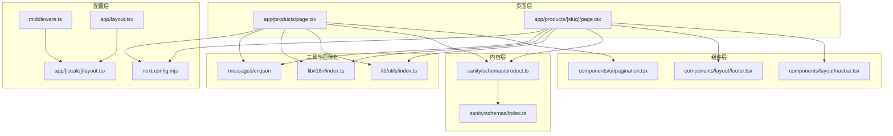
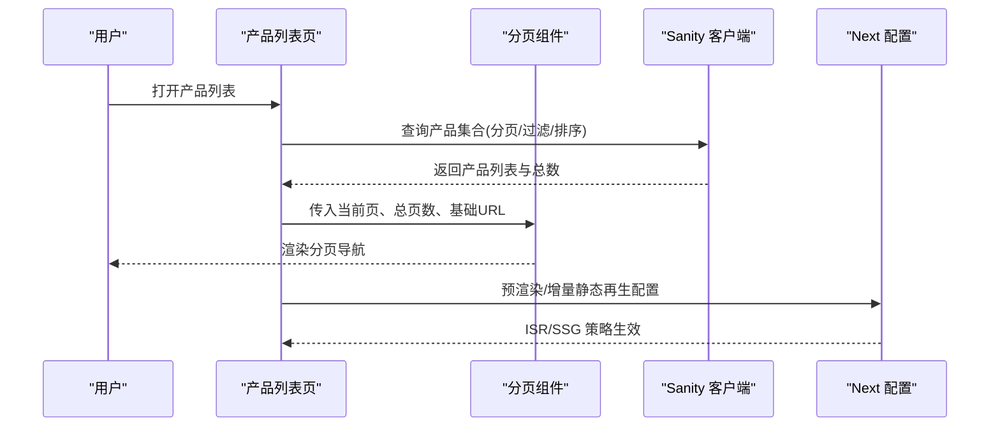
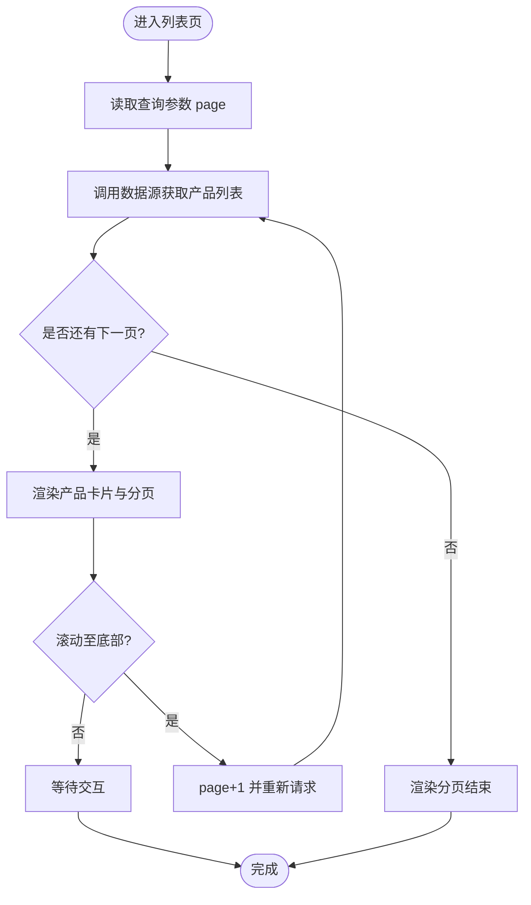
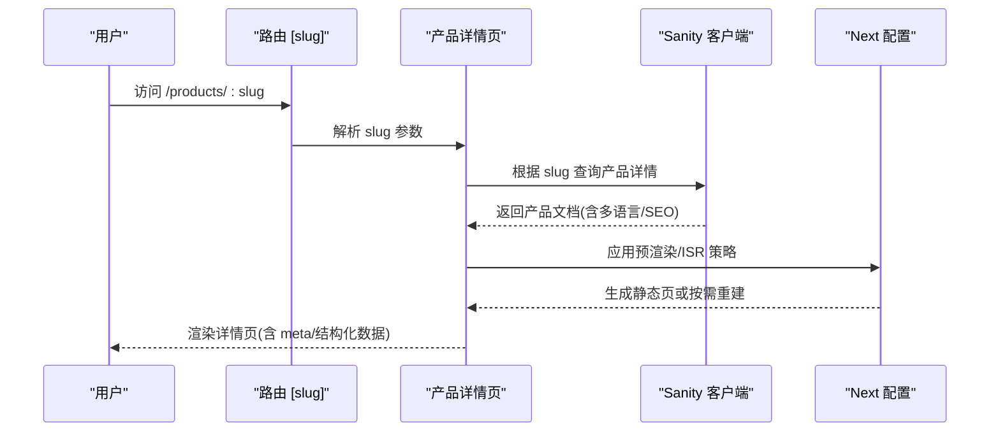
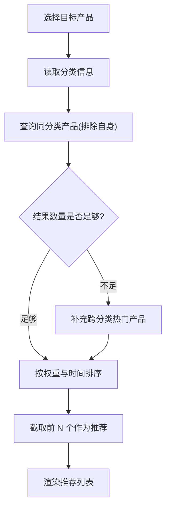
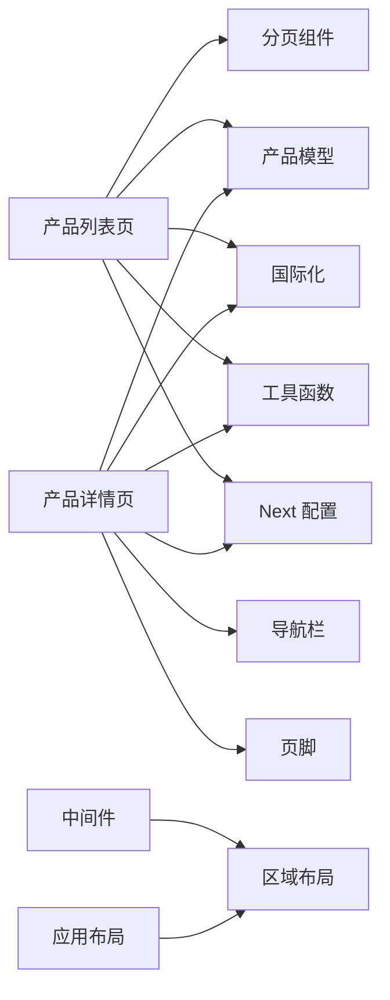

# 产品展示逻辑

<cite>
**本文引用的文件**
- [app/products/page.tsx](file://app/products/page.tsx)
- [app/products/[slug]/page.tsx](file://app/products/[slug]/page.tsx)
- [components/ui/pagination.tsx](file://components/ui/pagination.tsx)
- [sanity/schemas/product.ts](file://sanity/schemas/product.ts)
- [sanity/schemas/index.ts](file://sanity/schemas/index.ts)
- [lib/utils/index.ts](file://lib/utils/index.ts)
- [lib/i18n/index.ts](file://lib/i18n/index.ts)
- [messages/en.json](file://messages/en.json)
- [app/layout.tsx](file://app/layout.tsx)
- [app/[locale]/layout.tsx](file://app/[locale]/layout.tsx)
- [middleware.ts](file://middleware.ts)
- [next.config.mjs](file://next.config.mjs)
- [lib/sanity/index.ts](file://lib/sanity/index.ts)
- [components/layout/navbar.tsx](file://components/layout/navbar.tsx)
- [components/layout/footer.tsx](file://components/layout/footer.tsx)
</cite>

## 目录
1. [引言](#引言)
2. [项目结构](#项目结构)
3. [核心组件](#核心组件)
4. [架构总览](#架构总览)
5. [详细组件分析](#详细组件分析)
6. [依赖关系分析](#依赖关系分析)
7. [性能考虑](#性能考虑)
8. [故障排查指南](#故障排查指南)
9. [结论](#结论)
10. [附录](#附录)

## 引言
本文件系统性梳理 GoPro Trade 产品展示逻辑，覆盖产品列表页与详情页的实现机制，包括分页处理、无限滚动、加载状态管理等用户体验优化；产品详情页的动态路由生成、预渲染策略与增量静态再生配置；产品推荐算法（基于分类的相似产品匹配、推荐数量控制与展示顺序优化）；产品状态显示机制（库存状态、价格显示、促销标识等动态内容渲染）；以及产品页面的 SEO 优化（结构化数据、元标签、社交媒体分享）。最后提供最佳实践与性能优化建议。

## 项目结构
- 页面层：Next.js App Router 动态路由，产品列表与详情分别位于 app/products/page.tsx 与 app/products/[slug]/page.tsx。
- 组件层：UI 组件如分页组件 components/ui/pagination.tsx；布局组件 components/layout/*。
- 内容层：Sanity 内容模型定义于 sanity/schemas/product.ts，包含多语言字段、SEO 字段、状态与排序权重等。
- 工具与国际化：lib/utils、lib/i18n、messages/* 提供工具函数与本地化资源。
- 配置层：next.config.mjs、middleware.ts、app/layout.tsx 与 app/[locale]/layout.tsx 提供全局布局、国际化中间件与路由配置。

图表来源
- [app/products/page.tsx](file://app/products/page.tsx)
- [app/products/[slug]/page.tsx](file://app/products/[slug]/page.tsx)
- [components/ui/pagination.tsx](file://components/ui/pagination.tsx)
- [sanity/schemas/product.ts](file://sanity/schemas/product.ts)
- [sanity/schemas/index.ts](file://sanity/schemas/index.ts)
- [lib/utils/index.ts](file://lib/utils/index.ts)
- [lib/i18n/index.ts](file://lib/i18n/index.ts)
- [messages/en.json](file://messages/en.json)
- [app/layout.tsx](file://app/layout.tsx)
- [app/[locale]/layout.tsx](file://app/[locale]/layout.tsx)
- [middleware.ts](file://middleware.ts)
- [next.config.mjs](file://next.config.mjs)

章节来源
- [app/products/page.tsx](file://app/products/page.tsx)
- [app/products/[slug]/page.tsx](file://app/products/[slug]/page.tsx)
- [components/ui/pagination.tsx](file://components/ui/pagination.tsx)
- [sanity/schemas/product.ts](file://sanity/schemas/product.ts)
- [sanity/schemas/index.ts](file://sanity/schemas/index.ts)
- [lib/utils/index.ts](file://lib/utils/index.ts)
- [lib/i18n/index.ts](file://lib/i18n/index.ts)
- [messages/en.json](file://messages/en.json)
- [app/layout.tsx](file://app/layout.tsx)
- [app/[locale]/layout.tsx](file://app/[locale]/layout.tsx)
- [middleware.ts](file://middleware.ts)
- [next.config.mjs](file://next.config.mjs)

## 核心组件
- 产品列表页：负责加载产品集合、分页导航、搜索过滤、排序与加载状态管理。
- 产品详情页：根据动态路由 [slug] 渲染单个产品详情，包含预渲染与增量静态再生策略。
- 分页组件：通用分页 UI，支持页码省略与 RTL 方向切换。
- 内容模型：Sanity 产品文档模型，定义多语言字段、SEO、状态与排序权重等。
- 国际化与工具：I18N 与工具函数支撑多语言与通用逻辑。

章节来源
- [app/products/page.tsx](file://app/products/page.tsx)
- [app/products/[slug]/page.tsx](file://app/products/[slug]/page.tsx)
- [components/ui/pagination.tsx](file://components/ui/pagination.tsx)
- [sanity/schemas/product.ts](file://sanity/schemas/product.ts)
- [lib/i18n/index.ts](file://lib/i18n/index.ts)
- [lib/utils/index.ts](file://lib/utils/index.ts)

## 架构总览
产品展示由“页面层 + 组件层 + 内容层 + 工具与国际化 + 配置层”协同完成。页面通过 lib/sanity 访问 Sanity 数据，结合 I18N 与消息文件实现多语言渲染；分页组件提供可复用的导航体验；Next.js 的动态路由与 ISR/SSG 配置确保详情页的预渲染与增量更新。

图表来源
- [app/products/page.tsx](file://app/products/page.tsx)
- [components/ui/pagination.tsx](file://components/ui/pagination.tsx)
- [lib/sanity/index.ts](file://lib/sanity/index.ts)
- [next.config.mjs](file://next.config.mjs)

## 详细组件分析

### 产品列表页实现机制
- 分页处理
  - 使用分页组件计算页码序列并生成链接参数，支持页码省略与边界折叠。
  - 列表页通过查询参数 page 控制当前页，结合总数计算 totalPages。
- 无限滚动
  - 可选实现：监听滚动至底部触发请求下一页，避免全量加载。
  - 注意：需结合 IntersectionObserver 与防抖，避免重复触发。
- 加载状态管理
  - 列表加载中显示骨架屏或占位符；错误时展示重试按钮与提示。
  - 滚动加载时保持上一次列表可见，仅追加新数据。

图表来源
- [app/products/page.tsx](file://app/products/page.tsx)
- [components/ui/pagination.tsx](file://components/ui/pagination.tsx)

章节来源
- [app/products/page.tsx](file://app/products/page.tsx)
- [components/ui/pagination.tsx](file://components/ui/pagination.tsx)

### 产品详情页渲染逻辑
- 动态路由生成
  - 路径 app/products/[slug]/page.tsx 对应动态段 [slug]，从 URL 中提取产品标识。
- 预渲染策略
  - 使用 Next.js 预渲染（SSG/ISR），提升首屏性能与 SEO。
- 增量静态再生（ISR）
  - 在构建后允许对特定页面进行增量更新，保证内容时效性。
- 多语言与 SEO
  - 详情页读取产品文档中的多语言字段与 SEO 字段，动态设置 meta 标签与结构化数据。

图表来源
- [app/products/[slug]/page.tsx](file://app/products/[slug]/page.tsx)
- [lib/sanity/index.ts](file://lib/sanity/index.ts)
- [next.config.mjs](file://next.config.mjs)

章节来源
- [app/products/[slug]/page.tsx](file://app/products/[slug]/page.tsx)
- [lib/sanity/index.ts](file://lib/sanity/index.ts)
- [next.config.mjs](file://next.config.mjs)

### 产品推荐算法
- 基于分类的相似产品匹配
  - 以产品分类为特征，查询同分类下的其他产品，排除自身。
- 推荐数量控制
  - 设定最大推荐数量（例如 6 或 8），避免信息过载。
- 展示顺序优化
  - 优先展示高权重产品（如 orderRank 较小），其次按最近更新时间倒序。
- 动态内容渲染
  - 推荐列表同样遵循加载状态、骨架屏与错误处理。

图表来源
- [sanity/schemas/product.ts](file://sanity/schemas/product.ts)
- [app/products/[slug]/page.tsx](file://app/products/[slug]/page.tsx)

章节来源
- [sanity/schemas/product.ts](file://sanity/schemas/product.ts)
- [app/products/[slug]/page.tsx](file://app/products/[slug]/page.tsx)

### 产品状态显示机制
- 库存状态与状态标识
  - 依据产品状态字段（在售/新品/停产/即将上市）渲染不同标签或样式。
- 价格显示
  - 价格字段来自产品文档，支持多货币与多语言显示。
- 促销标识
  - 可扩展促销字段，结合状态与活动周期动态展示折扣标签。
- 动态内容渲染
  - 状态变化时自动刷新 UI，避免硬编码状态文本。

章节来源
- [sanity/schemas/product.ts](file://sanity/schemas/product.ts)
- [app/products/[slug]/page.tsx](file://app/products/[slug]/page.tsx)

### 产品页面的 SEO 优化
- 结构化数据生成
  - 从产品文档中抽取名称、描述、主图、评分等字段生成 JSON-LD。
- 元标签设置
  - 读取产品 SEO 字段（标题、描述、关键词）动态注入到 head。
- 社交媒体分享配置
  - 生成 Twitter Card/Open Graph 标签，支持分享预览图与描述。
- 多语言与国际化
  - 通过 I18N 与消息文件确保不同语言环境下的 SEO 元信息正确呈现。

章节来源
- [sanity/schemas/product.ts](file://sanity/schemas/product.ts)
- [lib/i18n/index.ts](file://lib/i18n/index.ts)
- [messages/en.json](file://messages/en.json)
- [app/products/[slug]/page.tsx](file://app/products/[slug]/page.tsx)

## 依赖关系分析
- 页面依赖组件：列表页依赖分页组件；详情页依赖布局组件与导航栏/页脚。
- 页面依赖内容模型：产品列表与详情均依赖 Sanity 产品模型。
- 页面依赖工具与国际化：I18N 与工具函数贯穿页面渲染。
- 配置依赖：Next 配置影响预渲染与增量更新策略；中间件与布局配置影响路由与国际化。

图表来源
- [app/products/page.tsx](file://app/products/page.tsx)
- [app/products/[slug]/page.tsx](file://app/products/[slug]/page.tsx)
- [components/ui/pagination.tsx](file://components/ui/pagination.tsx)
- [sanity/schemas/product.ts](file://sanity/schemas/product.ts)
- [lib/i18n/index.ts](file://lib/i18n/index.ts)
- [lib/utils/index.ts](file://lib/utils/index.ts)
- [next.config.mjs](file://next.config.mjs)
- [middleware.ts](file://middleware.ts)
- [app/layout.tsx](file://app/layout.tsx)
- [app/[locale]/layout.tsx](file://app/[locale]/layout.tsx)

章节来源
- [app/products/page.tsx](file://app/products/page.tsx)
- [app/products/[slug]/page.tsx](file://app/products/[slug]/page.tsx)
- [components/ui/pagination.tsx](file://components/ui/pagination.tsx)
- [sanity/schemas/product.ts](file://sanity/schemas/product.ts)
- [lib/i18n/index.ts](file://lib/i18n/index.ts)
- [lib/utils/index.ts](file://lib/utils/index.ts)
- [next.config.mjs](file://next.config.mjs)
- [middleware.ts](file://middleware.ts)
- [app/layout.tsx](file://app/layout.tsx)
- [app/[locale]/layout.tsx](file://app/[locale]/layout.tsx)

## 性能考虑
- 列表页
  - 合理设置分页大小，避免单页过大导致内存压力。
  - 使用骨架屏与懒加载图片，减少首屏阻塞。
  - 对过滤与排序操作进行防抖，降低频繁请求。
- 详情页
  - 启用预渲染与增量静态再生，缩短首屏加载时间。
  - 图片使用现代格式与合适的尺寸，配合 lazy loading。
- 推荐模块
  - 缓存热门分类与热门产品，减少重复查询。
  - 推荐数量与字段裁剪，避免传输冗余数据。
- 全局
  - 合理使用中间件与国际化资源，避免不必要的包体积增长。
  - 使用浏览器缓存与 CDN 加速静态资源。

## 故障排查指南
- 列表页无数据或分页异常
  - 检查查询参数解析与默认值；确认 totalPages 计算逻辑。
  - 核对分页组件的页码序列生成规则与边界条件。
- 详情页空白或 404
  - 确认 [slug] 是否正确传递；检查 Sanity 查询是否返回文档。
  - 核对 ISR/SSG 配置是否生效，必要时手动触发重建。
- SEO 元信息缺失
  - 检查产品文档中 SEO 字段是否填写；确认渲染逻辑是否读取对应字段。
- 国际化显示异常
  - 核对 I18N 与消息文件路径；确认语言切换逻辑与回退策略。

章节来源
- [app/products/page.tsx](file://app/products/page.tsx)
- [app/products/[slug]/page.tsx](file://app/products/[slug]/page.tsx)
- [components/ui/pagination.tsx](file://components/ui/pagination.tsx)
- [sanity/schemas/product.ts](file://sanity/schemas/product.ts)
- [lib/i18n/index.ts](file://lib/i18n/index.ts)
- [messages/en.json](file://messages/en.json)

## 结论
本项目采用 Next.js App Router 与 Sanity 内容模型，结合通用 UI 组件与国际化工具，实现了高性能、可维护的产品展示体系。通过合理的分页与加载策略、预渲染与增量更新、基于分类的推荐算法与完善的 SEO 配置，能够有效提升用户体验与搜索引擎表现。建议持续关注性能指标与用户反馈，迭代优化查询与渲染策略。

## 附录
- 最佳实践
  - 列表页：固定分页大小、骨架屏、防抖与缓存。
  - 详情页：启用 SSG/ISR、结构化数据与社交标签。
  - 推荐：分类匹配、权重排序、数量控制。
  - SEO：多语言元信息、关键词与社交媒体标签。
- 性能优化建议
  - 图片懒加载与响应式尺寸；减少不必要的客户端状态；合理拆分包与使用 CDN。
- 常见问题
  - 分页边界与省略逻辑；slug 匹配与 404 处理；I18N 回退与消息文件一致性。