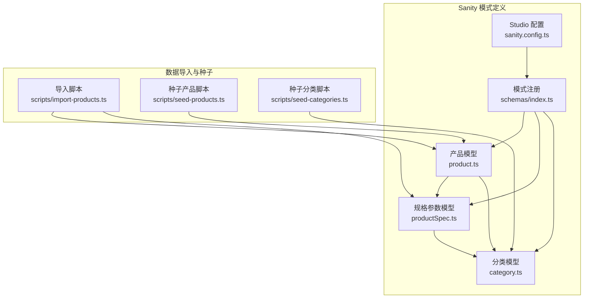
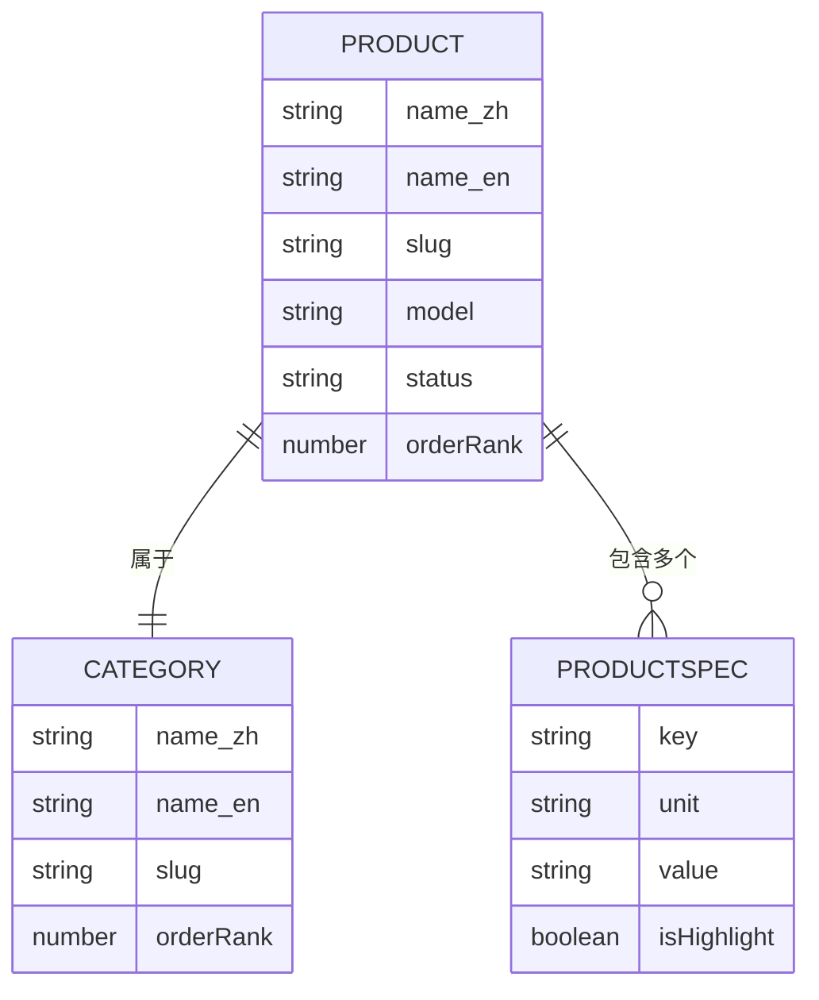
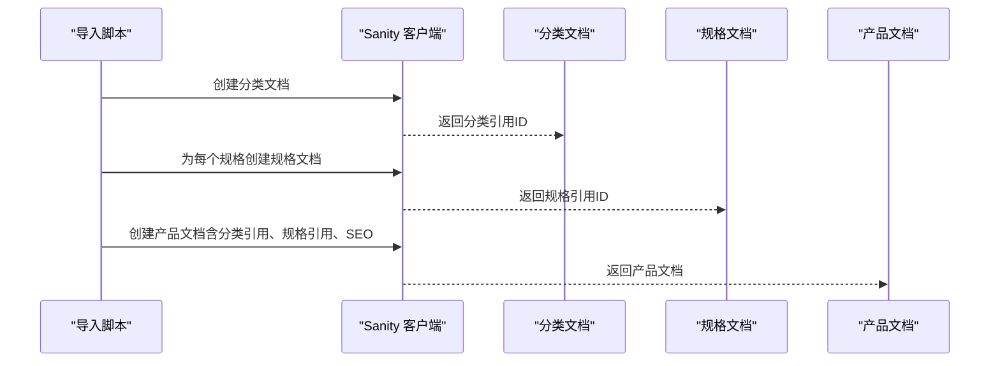
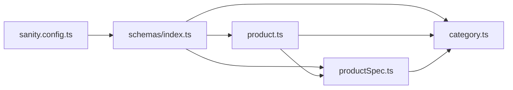

# 产品数据模型

<cite>
**本文档引用的文件**
- [sanity/schemas/product.ts](file://sanity/schemas/product.ts)
- [sanity/schemas/productSpec.ts](file://sanity/schemas/productSpec.ts)
- [sanity/schemas/category.ts](file://sanity/schemas/category.ts)
- [sanity/schemas/index.ts](file://sanity/schemas/index.ts)
- [sanity/sanity.config.ts](file://sanity/sanity.config.ts)
- [scripts/import-products.ts](file://scripts/import-products.ts)
- [scripts/seed-products.ts](file://scripts/seed-products.ts)
- [scripts/seed-categories.ts](file://scripts/seed-categories.ts)
</cite>

## 目录
1. [简介](#简介)
2. [项目结构](#项目结构)
3. [核心组件](#核心组件)
4. [架构总览](#架构总览)
5. [详细组件分析](#详细组件分析)
6. [依赖分析](#依赖分析)
7. [性能考虑](#性能考虑)
8. [故障排除指南](#故障排除指南)
9. [结论](#结论)
10. [附录](#附录)

## 简介
本文件系统化梳理 GoPro Trade 产品的数据模型，覆盖产品实体的核心字段、规格参数结构、图片资源管理、状态与生命周期、分类关联关系、验证规则与业务约束，并提供最佳实践与扩展建议。该模型基于 Sanity 内容模型进行定义，前端通过 Next.js 应用消费这些内容。

## 项目结构
产品数据模型主要由以下模块构成：
- 产品模型：定义产品基础信息、描述、图片、规格、特性、应用场景、目标市场、SEO、状态、排序权重、数据表等字段。
- 规格参数模型：定义参数名称、键名、单位、取值、所属分类、高亮标记等。
- 分类模型：定义分类名称、URL 标识、描述、父级分类、图标、排序权重等。
- 脚本：提供导入与种子数据脚本，演示如何将外部数据转换为 Sanity 文档并建立引用关系。

**图表来源**
- [sanity/schemas/product.ts:1-233](file://sanity/schemas/product.ts#L1-L233)
- [sanity/schemas/productSpec.ts:1-58](file://sanity/schemas/productSpec.ts#L1-L58)
- [sanity/schemas/category.ts:1-74](file://sanity/schemas/category.ts#L1-L74)
- [sanity/schemas/index.ts:1-9](file://sanity/schemas/index.ts#L1-L9)
- [sanity/sanity.config.ts:1-33](file://sanity/sanity.config.ts#L1-L33)
- [scripts/import-products.ts:1-161](file://scripts/import-products.ts#L1-L161)
- [scripts/seed-products.ts:1-522](file://scripts/seed-products.ts#L1-L522)
- [scripts/seed-categories.ts:1-110](file://scripts/seed-categories.ts#L1-L110)

**章节来源**
- [sanity/schemas/product.ts:1-233](file://sanity/schemas/product.ts#L1-L233)
- [sanity/schemas/productSpec.ts:1-58](file://sanity/schemas/productSpec.ts#L1-L58)
- [sanity/schemas/category.ts:1-74](file://sanity/schemas/category.ts#L1-L74)
- [sanity/schemas/index.ts:1-9](file://sanity/schemas/index.ts#L1-L9)
- [sanity/sanity.config.ts:1-33](file://sanity/sanity.config.ts#L1-L33)
- [scripts/import-products.ts:1-161](file://scripts/import-products.ts#L1-L161)
- [scripts/seed-products.ts:1-522](file://scripts/seed-products.ts#L1-L522)
- [scripts/seed-categories.ts:1-110](file://scripts/seed-categories.ts#L1-L110)

## 核心组件
本节聚焦产品实体的关键字段与结构，涵盖多语言支持、图片资源、规格参数、特性与应用场景、目标市场、SEO、状态与排序权重等。

- 基础信息与标识
  - 名称：对象类型，包含中/英/印尼/泰/越/阿拉伯语字段；中文与英文为必填。
  - URL 标识：基于英文名称生成，最大长度限制。
  - 型号：字符串，必填。
  - 分类：引用类型，指向分类文档，必填。

- 描述与摘要
  - 产品描述：对象类型，支持多语言文本。
  - 简短描述：对象类型，用于列表页展示，支持多语言字符串。

- 图片资源
  - 主图：图像类型，启用热点编辑，必填。
  - 产品图集：数组类型，元素为图像，启用热点编辑。

- 技术规格
  - 规格集合：数组类型，元素为规格参数文档的引用。

- 特性与应用场景
  - 产品特性：对象类型，多语言数组字符串。
  - 应用场景：对象类型，多语言数组字符串。

- 目标市场
  - 市场列表：字符串数组，预设选项包括马来西亚、印尼、泰国、越南、中东、全球。

- SEO 设置
  - Meta 标题：对象类型，多语言字符串。
  - Meta 描述：对象类型，多语言文本。
  - 关键词：字符串数组。

- 状态与排序
  - 产品状态：字符串枚举，支持在售、新品、停产、即将上市，默认在售。
  - 排序权重：数值类型，数字越小越靠前，默认 0。

- 数据表/文档
  - 数据手册：文件类型，限定 PDF。

**章节来源**
- [sanity/schemas/product.ts:9-232](file://sanity/schemas/product.ts#L9-L232)

## 架构总览
产品数据模型围绕“产品”“规格参数”“分类”三者构建，形成清晰的引用关系与继承结构。下图展示了文档类型之间的依赖与引用关系。

**图表来源**
- [sanity/schemas/product.ts:1-233](file://sanity/schemas/product.ts#L1-L233)
- [sanity/schemas/category.ts:1-74](file://sanity/schemas/category.ts#L1-L74)
- [sanity/schemas/productSpec.ts:1-58](file://sanity/schemas/productSpec.ts#L1-L58)

## 详细组件分析

### 产品模型（Product）
- 字段组织
  - 多语言字段：名称、描述、简短描述、特性、应用场景、SEO 标题与描述均采用对象类型，包含中/英/印尼/泰/越/阿拉伯语键。
  - 引用字段：分类与规格参数通过引用类型连接到对应文档。
  - 资源字段：主图与图集为图像类型，支持热点编辑；数据手册为文件类型。
  - 枚举字段：状态与目标市场采用预设列表，确保数据一致性。
  - 元数据：排序权重用于前端展示顺序控制。

- 数据验证与默认值
  - 必填字段：名称（中/英）、URL 标识、型号、分类。
  - 默认值：状态初始值为“在售”，排序权重初始值为 0。
  - 列表选项：目标市场与状态均为固定枚举值。

- 预览配置
  - 预览选择标题、副标题与媒体，便于在 Sanity 后台快速识别产品。

**章节来源**
- [sanity/schemas/product.ts:1-233](file://sanity/schemas/product.ts#L1-L233)

### 规格参数模型（ProductSpec）
- 字段组织
  - 参数名称：对象类型，包含中/英两语种，中文与英文为必填。
  - 键名：程序识别的唯一标识，如波长、功率、电压等。
  - 单位与取值：分别记录单位与具体数值或范围。
  - 所属分类：引用类型，指向分类文档。
  - 高亮标记：布尔值，用于在产品卡片上突出显示重要参数。

- 设计要点
  - 将参数拆分为独立文档，便于复用与跨产品引用。
  - 通过键名与单位统一参数表达，利于程序化展示与筛选。

**章节来源**
- [sanity/schemas/productSpec.ts:1-58](file://sanity/schemas/productSpec.ts#L1-L58)

### 分类模型（Category）
- 字段组织
  - 名称与描述：对象类型，支持多语言。
  - URL 标识：基于英文名称生成。
  - 父级分类：引用自身，实现父子分类继承机制；顶级分类留空。
  - 图标：图像类型，启用热点编辑。
  - 排序权重：用于分类层级展示顺序。

- 继承机制
  - 通过“父级分类”字段实现树形结构，支持多级分类组织。

**章节来源**
- [sanity/schemas/category.ts:1-74](file://sanity/schemas/category.ts#L1-L74)

### 数据导入与种子脚本
- 导入脚本（import-products.ts）
  - 导入分类：为每个分类创建文档并记录引用 ID。
  - 导入规格：为每个产品规格创建规格文档并收集引用。
  - 导入产品：组装产品文档，设置分类引用、规格引用、SEO 信息等。
  - 输出日志：记录导入过程与错误信息。

- 种子脚本（seed-products.ts 与 seed-categories.ts）
  - 种子分类：批量创建分类文档，避免重复。
  - 种子产品：按分类 slug 查询分类引用，检查产品是否存在，避免重复创建。

**图表来源**
- [scripts/import-products.ts:64-155](file://scripts/import-products.ts#L64-L155)

**章节来源**
- [scripts/import-products.ts:1-161](file://scripts/import-products.ts#L1-L161)
- [scripts/seed-products.ts:463-521](file://scripts/seed-products.ts#L463-L521)
- [scripts/seed-categories.ts:83-107](file://scripts/seed-categories.ts#L83-L107)

## 依赖分析
- 模式注册
  - schemas/index.ts 将产品、分类、规格参数等类型注册到 Sanity。
- Studio 配置
  - sanity.config.ts 指定项目 ID、数据集、插件与国际化设置。
- 类型依赖
  - 产品模型依赖分类与规格参数模型；规格参数模型可反向引用分类，形成闭环。

**图表来源**
- [sanity/schemas/index.ts:1-9](file://sanity/schemas/index.ts#L1-L9)
- [sanity/sanity.config.ts:1-33](file://sanity/sanity.config.ts#L1-L33)
- [sanity/schemas/product.ts:1-233](file://sanity/schemas/product.ts#L1-L233)
- [sanity/schemas/productSpec.ts:1-58](file://sanity/schemas/productSpec.ts#L1-L58)
- [sanity/schemas/category.ts:1-74](file://sanity/schemas/category.ts#L1-L74)

**章节来源**
- [sanity/schemas/index.ts:1-9](file://sanity/schemas/index.ts#L1-L9)
- [sanity/sanity.config.ts:1-33](file://sanity/sanity.config.ts#L1-L33)

## 性能考虑
- 引用查询
  - 产品与规格参数通过引用连接，建议在查询时使用投影减少传输字段，提升渲染性能。
- 图片优化
  - 使用 Sanity 的图像热点编辑与 CDN 加速，结合前端懒加载策略降低首屏压力。
- 列表排序
  - 使用排序权重字段控制展示顺序，避免在查询端进行二次排序。
- 数据导入
  - 批量导入时注意去重逻辑，避免重复创建文档导致的性能损耗。

## 故障排除指南
- 常见问题
  - 缺失必填字段：确保名称（中/英）、URL 标识、型号、分类均填写完整。
  - 图片缺失：主图必填，图集可为空；确认媒体上传与权限配置。
  - 规格引用无效：导入规格文档时需先创建规格文档再建立引用。
  - 分类引用错误：导入产品前需确保分类已存在且 slug 正确。
  - SEO 信息不生效：确认多语言字段与关键词数组格式正确。

- 排查步骤
  - 在 Sanity 后台检查字段校验提示与必填项。
  - 使用 GROQ 查询验证引用关系与数据完整性。
  - 查看导入脚本输出日志定位错误行。

**章节来源**
- [sanity/schemas/product.ts:15-31](file://sanity/schemas/product.ts#L15-L31)
- [sanity/schemas/product.ts:76-90](file://sanity/schemas/product.ts#L76-L90)
- [sanity/schemas/product.ts:93-98](file://sanity/schemas/product.ts#L93-L98)
- [sanity/schemas/product.ts:130-146](file://sanity/schemas/product.ts#L130-L146)
- [sanity/schemas/product.ts:148-187](file://sanity/schemas/product.ts#L148-L187)
- [sanity/schemas/product.ts:189-212](file://sanity/schemas/product.ts#L189-L212)
- [scripts/import-products.ts:64-155](file://scripts/import-products.ts#L64-L155)

## 结论
本产品数据模型以“产品—规格参数—分类”为核心，通过多语言对象、引用类型与枚举列表确保数据一致性与可维护性。配合导入与种子脚本，能够高效地完成数据迁移与初始化。建议在实际使用中遵循验证规则与最佳实践，持续优化查询与渲染性能。

## 附录

### 字段清单与类型概览
- 产品（Product）
  - 名称（对象，多语言，必填）
  - URL 标识（slug，必填）
  - 型号（字符串，必填）
  - 分类（引用，必填）
  - 产品描述（对象，多语言）
  - 简短描述（对象，多语言）
  - 主图（图像，必填）
  - 产品图集（数组，图像）
  - 规格（数组，规格参数引用）
  - 产品特性（对象，多语言数组）
  - 应用场景（对象，多语言数组）
  - 目标市场（数组，枚举）
  - SEO（对象，多语言标题/描述，关键词数组）
  - 状态（枚举，默认在售）
  - 排序权重（数值，默认 0）
  - 数据手册（文件，PDF）

- 规格参数（ProductSpec）
  - 参数名称（对象，多语言，必填）
  - 键名（字符串，必填）
  - 单位（字符串）
  - 取值（字符串）
  - 所属分类（引用）
  - 是否高亮（布尔，默认否）

- 分类（Category）
  - 名称（对象，多语言，必填）
  - URL 标识（slug，必填）
  - 描述（对象，多语言）
  - 父级分类（引用，可空）
  - 图标（图像）
  - 排序权重（数值，默认 0）

**章节来源**
- [sanity/schemas/product.ts:9-232](file://sanity/schemas/product.ts#L9-L232)
- [sanity/schemas/productSpec.ts:8-50](file://sanity/schemas/productSpec.ts#L8-L50)
- [sanity/schemas/category.ts:9-65](file://sanity/schemas/category.ts#L9-L65)

### 最佳实践与扩展指南
- 最佳实践
  - 多语言字段：保持所有语言键的同步更新，避免空缺。
  - 引用一致性：导入时先创建被引用文档，再建立引用关系。
  - SEO 优化：为每条产品维护独立的多语言 SEO 标题与描述。
  - 图片管理：主图与图集均启用热点编辑，确保裁剪与焦点一致。
  - 状态管理：通过状态枚举统一产品生命周期，避免自由文本。
  - 排序策略：使用排序权重控制展示顺序，避免动态计算。

- 扩展建议
  - 新增参数类别：可在规格参数模型中引入分组字段，便于前端分类展示。
  - 多级分类：通过父级分类实现多级继承，配合前端面包屑导航。
  - 数据导出：增加导出脚本，将产品数据导出为 CSV 或 JSON，便于第三方系统集成。
  - 自动化：结合定时任务与爬虫脚本，定期同步官网数据并更新产品状态与规格。

**章节来源**
- [sanity/schemas/product.ts:189-212](file://sanity/schemas/product.ts#L189-L212)
- [sanity/schemas/productSpec.ts:38-49](file://sanity/schemas/productSpec.ts#L38-L49)
- [sanity/schemas/category.ts:46-51](file://sanity/schemas/category.ts#L46-L51)
- [scripts/import-products.ts:64-155](file://scripts/import-products.ts#L64-L155)
- [scripts/seed-products.ts:463-521](file://scripts/seed-products.ts#L463-L521)
- [scripts/seed-categories.ts:83-107](file://scripts/seed-categories.ts#L83-L107)