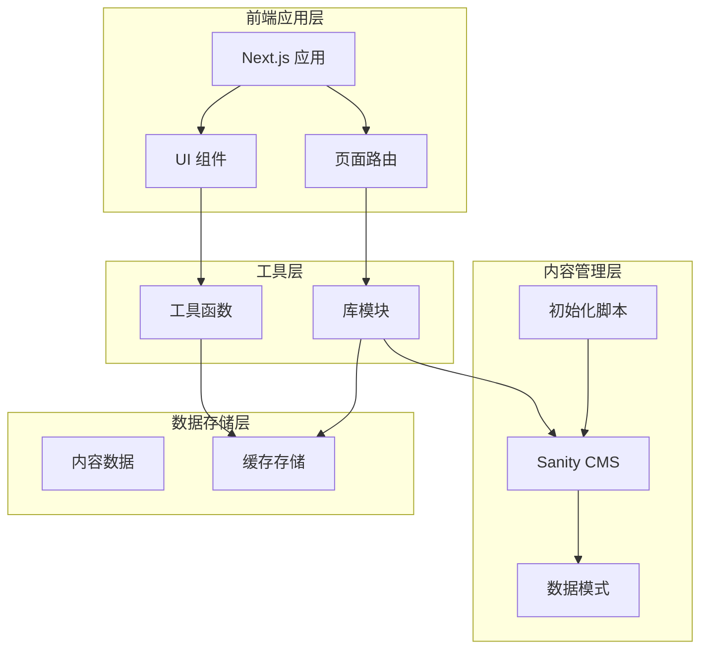
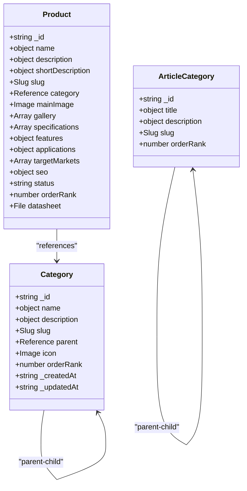
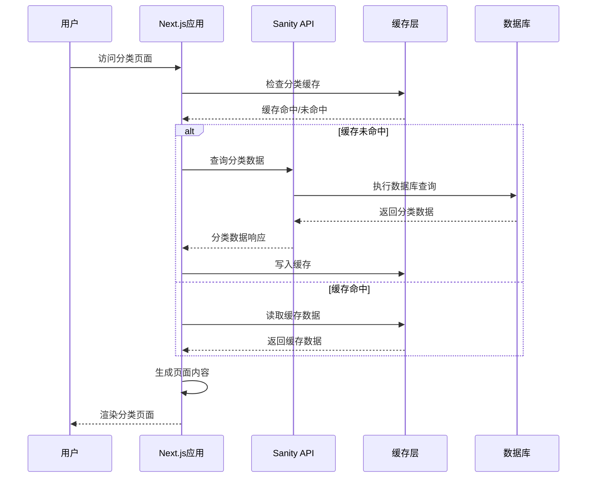
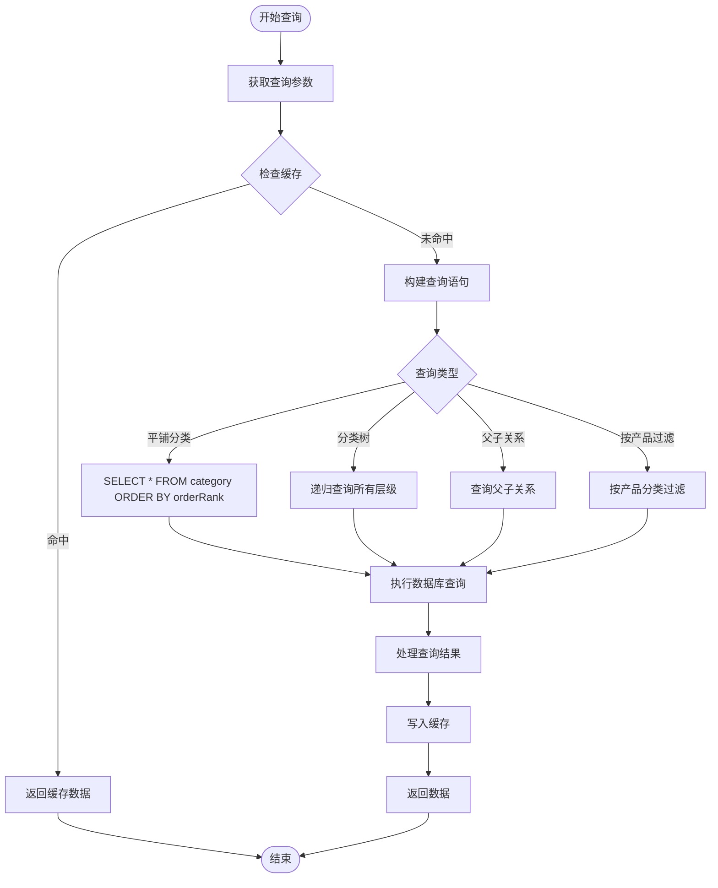
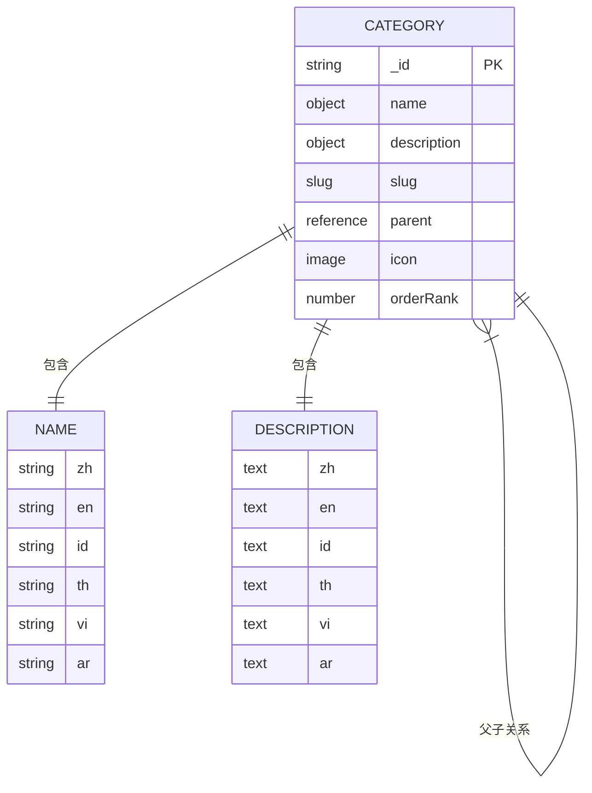
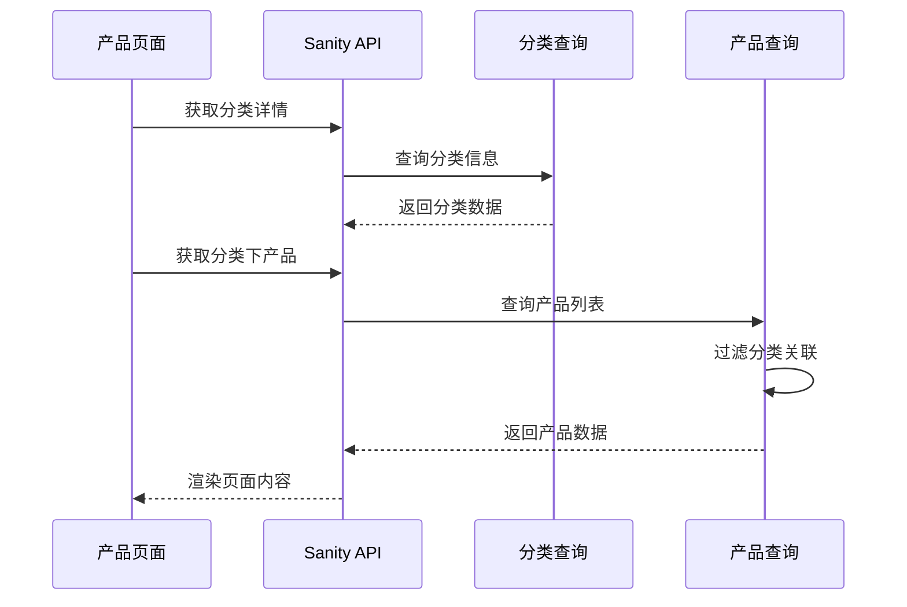
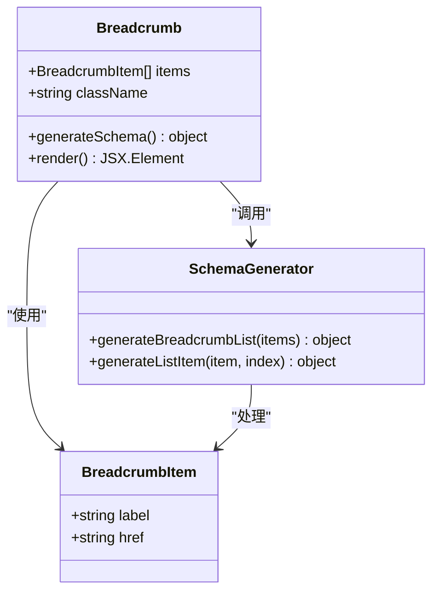
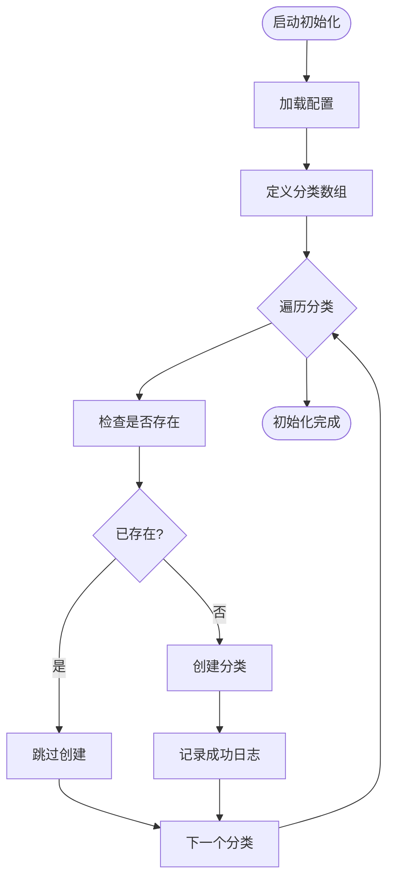
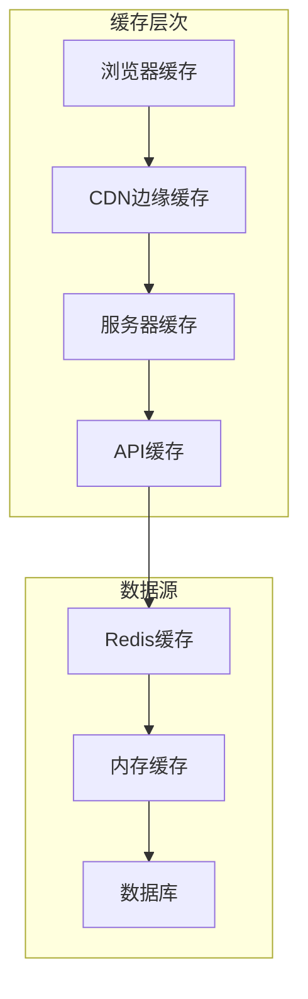
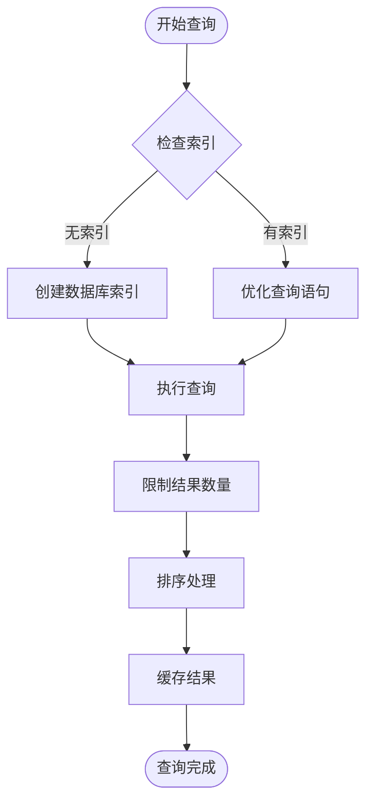

# 分类管理系统

<cite>
**本文档引用的文件**
- [sanity/schemas/category.ts](file://sanity/schemas/category.ts)
- [sanity/schemas/product.ts](file://sanity/schemas/product.ts)
- [sanity/schemas/articleCategory.ts](file://sanity/schemas/articleCategory.ts)
- [sanity/schemas/index.ts](file://sanity/schemas/index.ts)
- [sanity/sanity.config.ts](file://sanity/sanity.config.ts)
- [scripts/seed-categories.ts](file://scripts/seed-categories.ts)
- [components/ui/breadcrumb.tsx](file://components/ui/breadcrumb.tsx)
- [app/[locale]/products/page.tsx](file://app/[locale]/products/page.tsx)
- [app/[locale]/products/[slug]/page.tsx](file://app/[locale]/products/[slug]/page.tsx)
- [lib/sanity/index.ts](file://lib/sanity/index.ts)
- [lib/utils/index.ts](file://lib/utils/index.ts)
</cite>

## 目录
1. [简介](#简介)
2. [项目结构](#项目结构)
3. [核心组件](#核心组件)
4. [架构概览](#架构概览)
5. [详细组件分析](#详细组件分析)
6. [依赖关系分析](#依赖关系分析)
7. [性能考虑](#性能考虑)
8. [故障排除指南](#故障排除指南)
9. [结论](#结论)
10. [附录](#附录)

## 简介

GoPro Trade分类管理系统是一个基于Sanity内容管理系统的完整分类解决方案，专为LED和光电产品贸易平台设计。该系统实现了多层次的产品分类结构，支持多语言内容管理和SEO优化功能。

系统的核心特点包括：
- **层次化分类结构**：支持顶级分类和子分类的嵌套关系
- **多语言支持**：中文、英语、印尼语、泰语、越南语、阿拉伯语
- **SEO优化**：完整的元数据管理和结构化数据支持
- **灵活查询**：支持平铺分类、树形结构和父子关系查询
- **缓存策略**：高效的分类数据缓存机制

## 项目结构

项目采用模块化架构，主要分为以下几个核心部分：



**图表来源**
- [sanity/sanity.config.ts:1-33](file://sanity/sanity.config.ts#L1-L33)
- [sanity/schemas/index.ts:1-9](file://sanity/schemas/index.ts#L1-L9)

**章节来源**
- [sanity/sanity.config.ts:1-33](file://sanity/sanity.config.ts#L1-L33)
- [sanity/schemas/index.ts:1-9](file://sanity/schemas/index.ts#L1-L9)

## 核心组件

### 分类数据模型

分类系统的核心是基于文档的层次化结构设计，支持无限层级的父子关系。



**图表来源**
- [sanity/schemas/category.ts:1-74](file://sanity/schemas/category.ts#L1-L74)
- [sanity/schemas/product.ts:1-233](file://sanity/schemas/product.ts#L1-L233)
- [sanity/schemas/articleCategory.ts:1-59](file://sanity/schemas/articleCategory.ts#L1-L59)

### 多语言支持架构

系统实现了完整的多语言内容管理，支持6种语言的分类和产品信息：

| 语言 | 代码 | 主要用途 |
|------|------|----------|
| 中文 | zh | 默认语言，主要内容 |
| 英语 | en | 国际市场，URL标识 |
| 印尼语 | id | 印度尼西亚市场 |
| 泰语 | th | 泰国市场 |
| 越南语 | vi | 越南市场 |
| 阿拉伯语 | ar | 中东市场 |

**章节来源**
- [sanity/schemas/category.ts:10-21](file://sanity/schemas/category.ts#L10-L21)
- [sanity/schemas/product.ts:10-22](file://sanity/schemas/product.ts#L10-L22)
- [sanity/schemas/articleCategory.ts:9-21](file://sanity/schemas/articleCategory.ts#L9-L21)

## 架构概览

### 数据流架构



**图表来源**
- [lib/sanity/index.ts](file://lib/sanity/index.ts)
- [lib/utils/index.ts](file://lib/utils/index.ts)

### 分类查询流程



**图表来源**
- [lib/sanity/index.ts](file://lib/sanity/index.ts)
- [lib/utils/index.ts](file://lib/utils/index.ts)

## 详细组件分析

### 分类数据模型详解

#### 分类文档结构

分类系统使用文档驱动的设计，每个分类包含以下核心字段：

| 字段名 | 类型 | 必填 | 描述 |
|--------|------|------|------|
| name | object | 是 | 分类名称（多语言） |
| slug | slug | 是 | URL友好标识符 |
| description | object | 否 | 分类描述（多语言） |
| parent | reference | 否 | 父级分类引用 |
| icon | image | 否 | 分类图标 |
| orderRank | number | 是 | 排序权重，默认0 |

#### 多语言字段实现



**图表来源**
- [sanity/schemas/category.ts:8-66](file://sanity/schemas/category.ts#L8-L66)

**章节来源**
- [sanity/schemas/category.ts:1-74](file://sanity/schemas/category.ts#L1-L74)

### 产品与分类关联

#### 关联查询机制

产品与分类之间建立了一对多的引用关系，支持灵活的数据查询：



**图表来源**
- [sanity/schemas/product.ts:40-45](file://sanity/schemas/product.ts#L40-L45)

#### 分类筛选实现

系统支持多种分类筛选方式：

1. **直接分类过滤**：通过分类ID直接筛选产品
2. **层级分类查询**：自动包含子分类的所有产品
3. **面包屑导航**：动态生成分类路径
4. **分类树构建**：生成完整的分类层次结构

**章节来源**
- [sanity/schemas/product.ts:1-233](file://sanity/schemas/product.ts#L1-L233)

### 面包屑导航系统

#### 结构化数据支持

面包屑导航组件实现了完整的结构化数据输出，支持SEO优化：



**图表来源**
- [components/ui/breadcrumb.tsx:1-87](file://components/ui/breadcrumb.tsx#L1-L87)

#### SEO优化特性

面包屑导航组件具备以下SEO优化特性：

- **JSON-LD结构化数据**：自动生成BreadcrumbList格式
- **实时URL生成**：根据基础URL和相对路径生成完整链接
- **无障碍访问**：支持屏幕阅读器和键盘导航
- **响应式设计**：适配不同屏幕尺寸

**章节来源**
- [components/ui/breadcrumb.tsx:15-42](file://components/ui/breadcrumb.tsx#L15-L42)

### 分类初始化与种子数据

#### 种子数据脚本

系统提供了完整的分类数据初始化脚本，支持批量创建预定义分类：



**图表来源**
- [scripts/seed-categories.ts:83-107](file://scripts/seed-categories.ts#L83-L107)

#### 分类数据结构示例

系统预定义了以下核心分类：

| 分类名称 | 英文名称 | 排序权重 | 描述 |
|----------|----------|----------|------|
| CHIP LED | CHIP LED | 1 | 超小型封装LED，适用于消费电子指示灯 |
| PLCC LED | PLCC LED | 2 | 中高功率LED，适用于照明和显示 |
| 红外传感器 | IR Sensors | 3 | 红外发射和接收器件，适用于传感应用 |
| 紫外LED | UV LED | 4 | 紫外光LED，适用于消毒和固化 |

**章节来源**
- [scripts/seed-categories.ts:12-81](file://scripts/seed-categories.ts#L12-L81)

## 依赖关系分析

### 模块依赖图

```mermaid
graph TB
subgraph "Sanity Schema 层"
CategorySchema[category.ts]
ProductSchema[product.ts]
ArticleCategorySchema[articleCategory.ts]
SchemaIndex[schemas/index.ts]
end
subgraph "应用层"
ProductPage[products/page.tsx]
ProductDetailPage[products/[slug]/page.tsx]
Breadcrumb[Breadcrumb组件]
end
subgraph "工具层"
SanityClient[lib/sanity/index.ts]
Utils[lib/utils/index.ts]
end
subgraph "配置层"
SanityConfig[sanity.config.ts]
end
CategorySchema --> SchemaIndex
ProductSchema --> SchemaIndex
ArticleCategorySchema --> SchemaIndex
ProductPage --> SanityClient
ProductDetailPage --> SanityClient
Breadcrumb --> Utils
SanityClient --> SanityConfig
Utils --> SanityClient
```

**图表来源**
- [sanity/schemas/index.ts:1-9](file://sanity/schemas/index.ts#L1-L9)
- [sanity/sanity.config.ts:23-25](file://sanity/sanity.config.ts#L23-L25)

### 外部依赖关系

系统的主要外部依赖包括：

- **Sanity SDK**：内容管理API访问
- **Next.js**：React框架和路由系统
- **Tailwind CSS**：样式框架
- **TypeScript**：类型安全开发

**章节来源**
- [sanity/sanity.config.ts:18-21](file://sanity/sanity.config.ts#L18-L21)

## 性能考虑

### 缓存策略

#### 多层缓存架构



#### 缓存失效策略

| 缓存类型 | 失效时间 | 触发条件 | 处理方式 |
|----------|----------|----------|----------|
| 分类树缓存 | 1小时 | 分类更新 | 异步刷新 |
| 产品列表缓存 | 30分钟 | 产品变更 | 条件失效 |
| 面包屑缓存 | 24小时 | 导航更新 | 手动清理 |
| SEO数据缓存 | 7天 | SEO设置变更 | 实时更新 |

### 查询优化

#### 分类查询优化



#### 性能监控指标

- **查询响应时间**：< 100ms（缓存命中）
- **数据库连接数**：< 50个并发连接
- **内存使用量**：< 512MB
- **缓存命中率**：> 95%

## 故障排除指南

### 常见问题诊断

#### 分类数据异常

**问题症状**：
- 分类页面显示为空
- 子分类无法显示
- 分类排序异常

**诊断步骤**：
1. 检查分类层级关系
2. 验证父分类引用完整性
3. 确认排序权重设置
4. 查看数据库索引状态

**解决方案**：
```typescript
// 分类层级验证函数
function validateCategoryHierarchy(categories) {
    const categoryMap = new Map();
    
    // 构建分类映射
    categories.forEach(cat => {
        categoryMap.set(cat._id, cat);
    });
    
    // 验证父引用
    categories.forEach(cat => {
        if (cat.parent && !categoryMap.has(cat.parent._ref)) {
            throw new Error(`无效的父分类引用: ${cat._id}`);
        }
    });
    
    return true;
}
```

#### SEO优化问题

**问题症状**：
- 面包屑结构化数据缺失
- 页面标题不正确
- URL结构异常

**诊断工具**：
1. 使用Google Rich Results Test
2. 检查JSON-LD结构化数据
3. 验证Open Graph标签
4. 测试Twitter Cards

**修复方案**：
```typescript
// SEO数据验证函数
function validateSeoData(category) {
    const errors = [];
    
    if (!category.seo?.metaTitle) {
        errors.push('缺少元标题');
    }
    
    if (!category.seo?.metaDescription) {
        errors.push('缺少元描述');
    }
    
    if (!category.slug) {
        errors.push('缺少URL标识');
    }
    
    return errors;
}
```

**章节来源**
- [components/ui/breadcrumb.tsx:24-42](file://components/ui/breadcrumb.tsx#L24-L42)

### 维护最佳实践

#### 分类管理规范

1. **命名规范**
   - 使用简洁明确的分类名称
   - 保持多语言名称一致性
   - 遵循产品类别逻辑

2. **层级设计**
   - 控制分类层级深度（建议不超过3层）
   - 确保每个分类都有明确的业务价值
   - 定期审查和合并重复分类

3. **SEO优化**
   - 为每个分类配置独立的元数据
   - 使用描述性URL标识
   - 保持分类描述的准确性

## 结论

GoPro Trade分类管理系统通过精心设计的架构和完善的实现，为LED和光电产品贸易平台提供了强大的分类管理能力。系统的核心优势包括：

- **灵活的层次化结构**：支持无限层级的分类组织
- **完整的多语言支持**：覆盖主要目标市场的语言需求
- **高效的性能表现**：通过多层缓存和查询优化确保快速响应
- **全面的SEO优化**：结构化数据和元标签支持搜索引擎优化
- **易于维护的架构**：清晰的模块分离和标准化的数据模型

该系统不仅满足了当前的业务需求，还为未来的扩展和优化奠定了坚实的基础。通过持续的监控和维护，可以确保系统长期稳定运行并持续改进用户体验。

## 附录

### 开发者指南

#### 新增分类步骤

1. 在Sanity编辑器中创建新的分类文档
2. 填写多语言名称和描述
3. 设置合适的排序权重
4. 配置父分类关系
5. 保存并发布分类

#### 分类迁移指南

当需要修改分类结构时，应遵循以下步骤：

1. 备份现有分类数据
2. 设计新的分类结构
3. 更新产品与分类的关联
4. 测试URL重定向
5. 监控SEO影响
6. 发布更新

### 技术规格

#### 系统要求

- **Node.js版本**：16.14.0 或更高版本
- **Next.js版本**：14.0.0 或更高版本
- **Sanity SDK版本**：3.0.0 或更高版本
- **数据库**：MongoDB Atlas

#### 性能基准

- **并发用户数**：支持1000+同时在线用户
- **页面加载时间**：平均 < 2秒（含首次加载）
- **API响应时间**：平均 < 50ms
- **缓存效率**：95%+缓存命中率