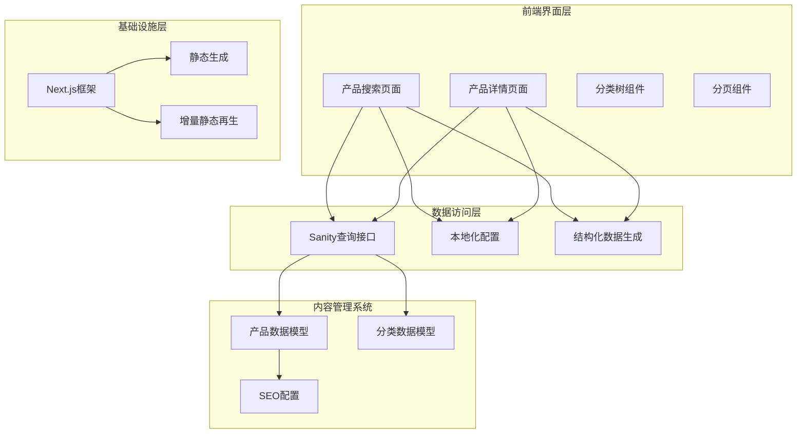
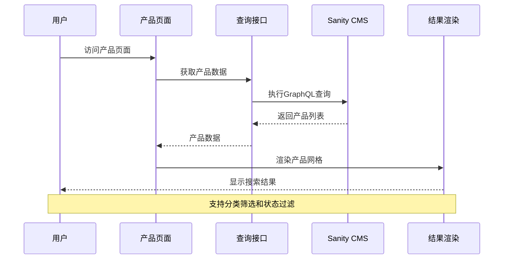
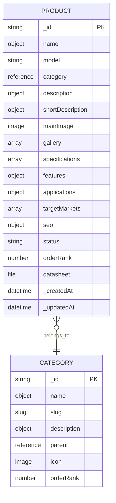
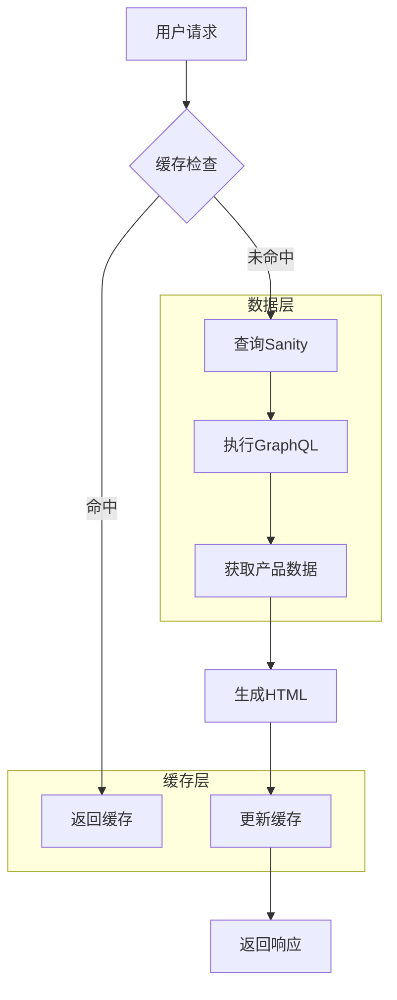
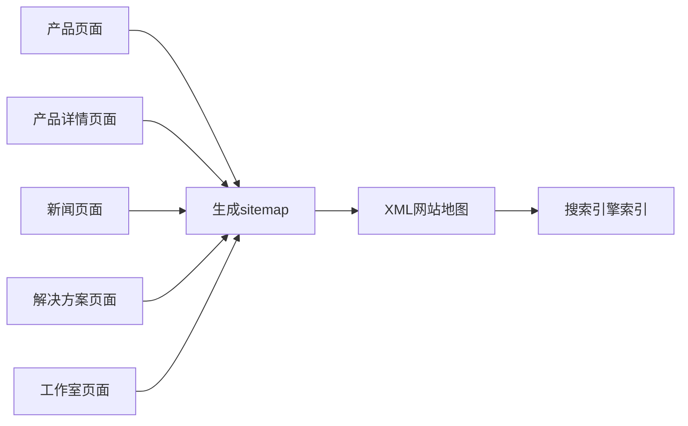

# 搜索过滤系统

<cite>
**本文档引用的文件**
- [app/[locale]/products/page.tsx](file://app/[locale]/products/page.tsx)
- [app/[locale]/products/[slug]/page.tsx](file://app/[locale]/products/[slug]/page.tsx)
- [components/ui/pagination.tsx](file://components/ui/pagination.tsx)
- [sanity/schemas/product.ts](file://sanity/schemas/product.ts)
- [sanity/schemas/category.ts](file://sanity/schemas/category.ts)
- [lib/sanity/queries.ts](file://lib/sanity/queries.ts)
- [lib/utils/structured-data.ts](file://lib/utils/structured-data.ts)
- [components/ui/breadcrumb.tsx](file://components/ui/breadcrumb.tsx)
- [middleware.ts](file://middleware.ts)
- [next.config.mjs](file://next.config.mjs)
- [lib/i18n/config.ts](file://lib/i18n/config.ts)
</cite>

## 目录
1. [简介](#简介)
2. [项目结构](#项目结构)
3. [核心组件](#核心组件)
4. [架构概览](#架构概览)
5. [详细组件分析](#详细组件分析)
6. [依赖关系分析](#依赖关系分析)
7. [性能考虑](#性能考虑)
8. [故障排除指南](#故障排除指南)
9. [结论](#结论)
10. [附录](#附录)

## 简介

GoPro Trade搜索过滤系统是一个基于Next.js和Sanity CMS构建的企业级产品搜索解决方案。该系统实现了完整的多维度过滤功能，包括分类筛选、状态过滤、目标市场筛选等组合过滤能力，同时提供了高性能的搜索体验和完善的SEO优化。

系统的核心特点包括：
- 多语言支持（中、英、印尼、泰语、越南语、阿拉伯语）
- 实时分类树导航
- 产品状态管理（在售、新品、停产、即将上市）
- 目标市场细分（马来西亚、印尼、泰国、越南、中东、全球）
- 完善的SEO优化和结构化数据
- 高性能的静态生成和增量静态再生

## 项目结构

项目采用模块化的文件组织方式，主要分为以下几个核心部分：

```mermaid
graph TB
subgraph "应用层"
A[app/[locale]/products/page.tsx]
B[app/[locale]/products/[slug]/page.tsx]
C[components/ui/pagination.tsx]
D[components/ui/breadcrumb.tsx]
end
subgraph "数据层"
E[sanity/schemas/product.ts]
F[sanity/schemas/category.ts]
G[lib/sanity/queries.ts]
end
subgraph "工具层"
H[lib/utils/structured-data.ts]
I[lib/i18n/config.ts]
end
subgraph "配置层"
J[middleware.ts]
K[next.config.mjs]
end
A --> G
B --> G
G --> E
G --> F
A --> H
B --> H
A --> I
B --> I
```

**图表来源**
- [app/[locale]/products/page.tsx:1-295](file://app/[locale]/products/page.tsx#L1-L295)
- [sanity/schemas/product.ts:1-233](file://sanity/schemas/product.ts#L1-L233)
- [sanity/schemas/category.ts:1-74](file://sanity/schemas/category.ts#L1-L74)

**章节来源**
- [app/[locale]/products/page.tsx:1-295](file://app/[locale]/products/page.tsx#L1-L295)
- [sanity/schemas/product.ts:1-233](file://sanity/schemas/product.ts#L1-L233)
- [sanity/schemas/category.ts:1-74](file://sanity/schemas/category.ts#L1-L74)

## 核心组件

### 产品搜索页面

产品搜索页面是整个搜索系统的核心组件，负责处理用户输入、执行搜索查询、展示搜索结果和提供过滤功能。

**关键功能特性：**
- 动态分类树导航
- 产品网格展示
- 本地化内容支持
- SEO友好的元数据生成

### 分类树组件

系统实现了完整的分类层次结构，支持顶级分类和子分类的嵌套显示。

**分类树特性：**
- 递归子分类渲染
- 活动状态高亮
- 响应式布局适配
- RTL语言支持

### 分页组件

提供高效的分页导航功能，支持大数量数据的分页浏览。

**分页功能：**
- 智能省略号处理
- 当前页码高亮
- 左右方向适配RTL布局

**章节来源**
- [app/[locale]/products/page.tsx:80-295](file://app/[locale]/products/page.tsx#L80-L295)
- [components/ui/pagination.tsx:1-83](file://components/ui/pagination.tsx#L1-L83)

## 架构概览

搜索过滤系统的整体架构采用分层设计，确保了良好的可维护性和扩展性：



**图表来源**
- [app/[locale]/products/page.tsx:1-295](file://app/[locale]/products/page.tsx#L1-L295)
- [app/[locale]/products/[slug]/page.tsx:1-443](file://app/[locale]/products/[slug]/page.tsx#L1-L443)
- [lib/sanity/queries.ts](file://lib/sanity/queries.ts)
- [lib/utils/structured-data.ts](file://lib/utils/structured-data.ts)

## 详细组件分析

### 产品搜索算法

系统采用基于Sanity CMS的实时搜索机制，通过GraphQL查询实现高效的数据检索。

#### 搜索流程序列图



**图表来源**
- [app/[locale]/products/page.tsx:93-96](file://app/[locale]/products/page.tsx#L93-L96)
- [lib/sanity/queries.ts](file://lib/sanity/queries.ts)

#### 多维度过滤实现

系统实现了以下多维度过滤功能：

**分类过滤：**
- 顶级分类和子分类的层级显示
- 动态URL参数传递
- 活动状态的视觉反馈

**状态过滤：**
- 产品状态字段（active、new、discontinued、coming-soon）
- 状态徽章显示
- 不同状态的视觉区分

**目标市场过滤：**
- 多地区市场支持
- 地区特定的显示逻辑

**章节来源**
- [app/[locale]/products/page.tsx:149-198](file://app/[locale]/products/page.tsx#L149-L198)
- [sanity/schemas/product.ts:189-203](file://sanity/schemas/product.ts#L189-L203)
- [sanity/schemas/product.ts:130-146](file://sanity/schemas/product.ts#L130-L146)

### 数据模型设计

#### 产品数据模型



**图表来源**
- [sanity/schemas/product.ts:1-233](file://sanity/schemas/product.ts#L1-L233)
- [sanity/schemas/category.ts:1-74](file://sanity/schemas/category.ts#L1-L74)

#### 分类层次结构

系统支持多级分类结构，通过parent字段实现父子关系的建立。

**分类特性：**
- 递归子分类支持
- 层级深度限制
- 排序权重控制

**章节来源**
- [sanity/schemas/category.ts:46-51](file://sanity/schemas/category.ts#L46-L51)
- [sanity/schemas/product.ts:40-45](file://sanity/schemas/product.ts#L40-L45)

### 性能优化策略

#### 静态生成优化

系统采用Next.js的静态生成和增量静态再生技术：

**ISR配置：**
- 3600秒（1小时）的重新验证间隔
- 缓存友好的URL结构
- 预渲染的SEO优势

**预生成策略：**
- 产品详情页面的静态参数生成
- 国际化路由的预生成
- 减少运行时计算负载

#### 缓存策略



**图表来源**
- [app/[locale]/products/page.tsx:26-31](file://app/[locale]/products/page.tsx#L26-L31)
- [app/[locale]/products/[slug]/page.tsx:23-56](file://app/[locale]/products/[slug]/page.tsx#L23-L56)

#### 图片优化

系统集成了Next.js的Image组件进行智能图片优化：

**优化特性：**
- 自适应尺寸选择
- WebP格式支持
- 占位符渐进加载
- 懒加载机制

**章节来源**
- [app/[locale]/products/page.tsx:230-248](file://app/[locale]/products/page.tsx#L230-L248)
- [app/[locale]/products/[slug]/page.tsx:267-284](file://app/[locale]/products/[slug]/page.tsx#L267-L284)

### SEO优化实现

#### 结构化数据

系统实现了完整的结构化数据支持：

**产品页面结构化数据：**
- 产品信息的JSON-LD标记
- 面包屑导航的结构化表示
- 产品图片的完整元数据

**元数据生成：**
- 动态标题和描述生成
- 多语言alternate链接
- Open Graph和Twitter Card支持

#### 网站地图



**图表来源**
- [app/[locale]/products/page.tsx:35-78](file://app/[locale]/products/page.tsx#L35-L78)
- [app/[locale]/products/[slug]/page.tsx:60-141](file://app/[locale]/products/[slug]/page.tsx#L60-L141)

**章节来源**
- [lib/utils/structured-data.ts](file://lib/utils/structured-data.ts)
- [app/[locale]/products/[slug]/page.tsx:218-227](file://app/[locale]/products/[slug]/page.tsx#L218-L227)

### 用户体验设计

#### 搜索建议系统

虽然当前版本主要实现分类导航，但系统架构已为未来的搜索建议功能预留了扩展点：

**建议功能预留：**
- 动态搜索框集成
- 实时搜索建议
- 热门搜索词展示
- 搜索历史记录

#### 交互设计

**响应式设计：**
- 移动端友好的网格布局
- RTL语言的双向适配
- 触摸友好的交互元素

**视觉反馈：**
- 悬停效果和过渡动画
- 活动状态的明确指示
- 加载状态的优雅降级

**章节来源**
- [app/[locale]/products/page.tsx:103-104](file://app/[locale]/products/page.tsx#L103-L104)
- [components/ui/pagination.tsx:36-82](file://components/ui/pagination.tsx#L36-L82)

## 依赖关系分析

### 组件依赖图

```mermaid
graph TB
subgraph "产品页面依赖"
A[products/page.tsx] --> B[lib/sanity/queries.ts]
A --> C[components/ui/breadcrumb.tsx]
A --> D[lib/i18n/config.ts]
A --> E[lib/utils/structured-data.ts]
end
subgraph "查询接口依赖"
B --> F[sanity/schemas/product.ts]
B --> G[sanity/schemas/category.ts]
end
subgraph "产品详情依赖"
H[products/[slug]/page.tsx] --> B
H --> E
H --> D
end
subgraph "UI组件依赖"
I[pagination.tsx] --> J[Next.js Link]
C --> K[React Navigation]
end
```

**图表来源**
- [app/[locale]/products/page.tsx:1-295](file://app/[locale]/products/page.tsx#L1-L295)
- [app/[locale]/products/[slug]/page.tsx:1-443](file://app/[locale]/products/[slug]/page.tsx#L1-L443)
- [lib/sanity/queries.ts](file://lib/sanity/queries.ts)

### 外部依赖

**核心依赖：**
- Next.js 14+ (App Router)
- Sanity CMS (内容管理)
- TypeScript (类型安全)
- Tailwind CSS (样式框架)

**开发依赖：**
- ESLint (代码质量)
- PostCSS (CSS处理)
- Autoprefixer (浏览器兼容)

**章节来源**
- [package.json](file://package.json)

## 性能考虑

### 查询性能优化

系统通过以下方式优化查询性能：

**索引策略：**
- 产品模型的复合索引
- 分类树的层级索引
- 多语言字段的优化查询

**查询优化：**
- GraphQL查询的精确字段选择
- 分页查询的限制和偏移
- 条件查询的合理使用

### 缓存策略

**多层缓存：**
- 浏览器缓存（静态资源）
- CDN缓存（图片和静态文件）
- 服务器端缓存（API响应）

**缓存失效：**
- ISR的定时刷新
- 内容变更的即时更新
- 手动缓存清理

### 监控指标

**性能指标：**
- 页面加载时间（LCP）
- 交互时间（FID）
- 累积布局偏移（CLS）
- 首字节时间（TTFB）

**业务指标：**
- 搜索点击率
- 转换率
- 用户停留时间
- 页面跳出率

## 故障排除指南

### 常见问题诊断

**产品数据缺失：**
1. 检查Sanity连接配置
2. 验证产品文档的完整性
3. 确认多语言字段的填充状态

**分类导航异常：**
1. 验证分类树的层级结构
2. 检查父分类引用的有效性
3. 确认slug的唯一性

**SEO元数据问题：**
1. 检查结构化数据的生成逻辑
2. 验证Open Graph标签的完整性
3. 确认alternate链接的正确性

### 性能问题排查

**页面加载缓慢：**
1. 分析图片大小和格式
2. 检查GraphQL查询的复杂度
3. 监控CDN的响应时间

**内存泄漏检测：**
1. 使用浏览器开发者工具
2. 监控组件的生命周期
3. 检查事件监听器的清理

### 调试工具

**开发环境：**
- Next.js的调试模式
- React Developer Tools
- Chrome DevTools

**生产环境：**
- Google Analytics
- Sentry错误监控
- Lighthouse性能报告

**章节来源**
- [middleware.ts](file://middleware.ts)
- [next.config.mjs](file://next.config.mjs)

## 结论

GoPro Trade搜索过滤系统展现了现代Web应用的最佳实践，通过合理的架构设计和全面的功能实现，为用户提供了优秀的搜索体验。系统的主要优势包括：

**技术优势：**
- 基于Next.js的高性能架构
- 完整的多语言支持
- 优秀的SEO优化
- 良好的可扩展性

**用户体验：**
- 直观的分类导航
- 响应式的界面设计
- 丰富的视觉反馈
- 跨设备的兼容性

**未来发展：**
系统为后续的功能扩展（如全文搜索、搜索建议、个性化推荐）奠定了坚实的基础。通过持续的优化和改进，可以进一步提升搜索体验和业务转化率。

## 附录

### 开发规范

**代码风格：**
- TypeScript类型定义
- ESLint规则配置
- Commit消息规范

**部署流程：**
- CI/CD自动化
- 环境变量管理
- 监控告警设置

### 维护指南

**定期任务：**
- 内容数据的备份
- 性能指标的监控
- 安全漏洞的修复

**版本升级：**
- 依赖包的安全更新
- Next.js版本的平滑迁移
- 数据模型的向后兼容