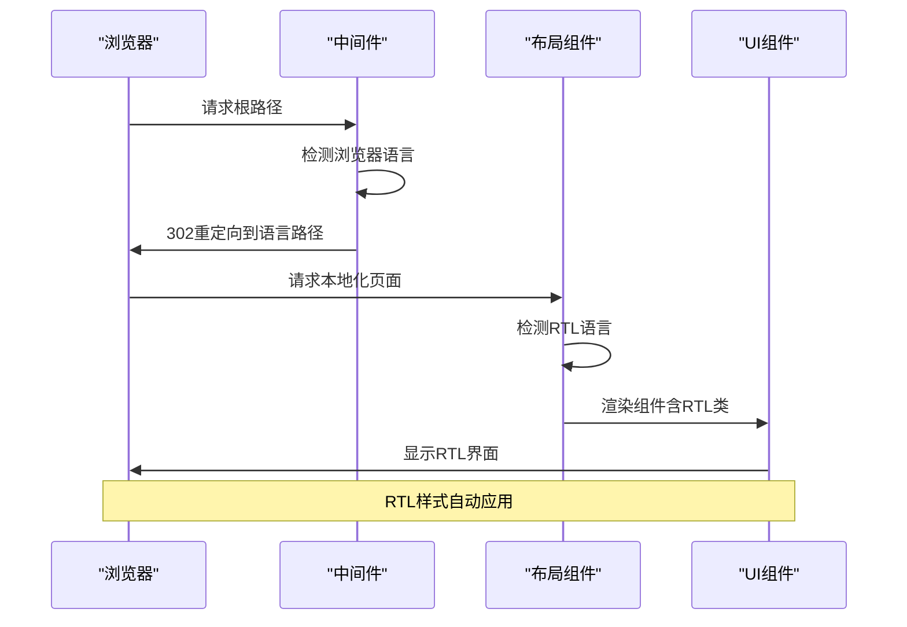
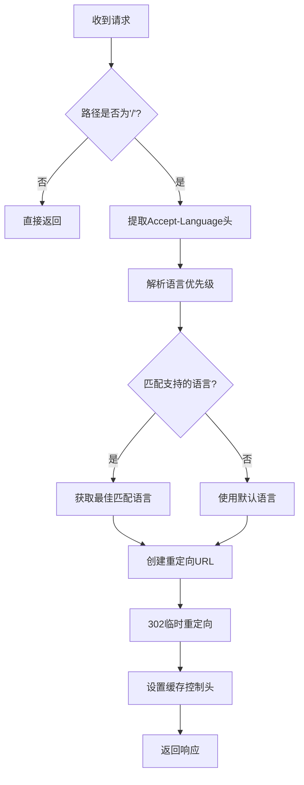

# RTL语言支持

<cite>
**本文档引用的文件**
- [app/[locale]/layout.tsx](file://app/[locale]/layout.tsx)
- [app/[locale]/globals.css](file://app/[locale]/globals.css)
- [middleware.ts](file://middleware.ts)
- [components/layout/navbar.tsx](file://components/layout/navbar.tsx)
- [components/layout/footer.tsx](file://components/layout/footer.tsx)
- [messages/ar.json](file://messages/ar.json)
- [messages/en.json](file://messages/en.json)
- [tailwind.config.js](file://tailwind.config.js)
</cite>

## 目录
1. [简介](#简介)
2. [项目结构](#项目结构)
3. [核心组件](#核心组件)
4. [架构概览](#架构概览)
5. [详细组件分析](#详细组件分析)
6. [依赖关系分析](#依赖关系分析)
7. [性能考虑](#性能考虑)
8. [故障排除指南](#故障排除指南)
9. [结论](#结论)

## 简介

本项目实现了完整的RTL（从右到左）语言支持，主要针对阿拉伯语等RTL语言进行优化。该实现采用Next.js的国际化框架，结合Tailwind CSS的实用类系统，提供了从语言检测、样式应用到组件适配的完整解决方案。

RTL支持的核心特性包括：
- 自动RTL语言检测和重定向
- CSS方向属性的动态设置
- 布局反转和文本对齐调整
- 导航菜单和表单的RTL适配
- 图标方向和间距的智能调整

## 项目结构

项目采用基于区域设置的文件组织方式，每个语言都有独立的路由和资源文件：

```mermaid
graph TB
subgraph "国际化目录结构"
A[app/[locale]/] --> B[页面组件]
A --> C[布局文件]
A --> D[样式文件]
E[messages/] --> F[语言文件]
F --> G[ar.json - 阿拉伯语]
F --> H[en.json - 英语]
I[lib/i18n/] --> J[i18n配置]
K[components/] --> L[RTL适配组件]
end
subgraph "中间件层"
M[middleware.ts] --> N[语言检测]
N --> O[自动重定向]
end
```

**图表来源**
- [app/[locale]/layout.tsx:1-71](file://app/[locale]/layout.tsx#L1-L71)
- [middleware.ts:1-68](file://middleware.ts#L1-L68)

**章节来源**
- [app/[locale]/layout.tsx:1-71](file://app/[locale]/layout.tsx#L1-L71)
- [middleware.ts:1-68](file://middleware.ts#L1-L68)

## 核心组件

### RTL语言检测与配置

项目通过`rtlLocales`数组定义支持RTL的语言列表，目前包含阿拉伯语（ar）。该配置在多个组件中被使用以确定是否应用RTL样式。

### 动态HTML方向设置

在根布局中，根据检测到的语言动态设置`dir`属性：
- `dir="rtl"`：应用于阿拉伯语等RTL语言
- `dir="ltr"`：应用于英语等LTR语言

### CSS方向类系统

项目实现了专门的RTL CSS类系统：
- `.rtl`类：设置`direction: rtl`
- `.ltr`类：设置`direction: ltr`
- 这些类被应用到body元素上

**章节来源**
- [app/[locale]/layout.tsx:55-59](file://app/[locale]/layout.tsx#L55-L59)
- [app/[locale]/globals.css:35-44](file://app/[locale]/globals.css#L35-L44)

## 架构概览

RTL支持的整体架构分为三个层次：



**图表来源**
- [middleware.ts:44-63](file://middleware.ts#L44-L63)
- [app/[locale]/layout.tsx:54-69](file://app/[locale]/layout.tsx#L54-L69)

## 详细组件分析

### 中间件语言检测

中间件负责检测用户的浏览器语言偏好并进行自动重定向：



**图表来源**
- [middleware.ts:21-42](file://middleware.ts#L21-L42)
- [middleware.ts:44-63](file://middleware.ts#L44-L63)

**章节来源**
- [middleware.ts:1-68](file://middleware.ts#L1-L68)

### 布局组件RTL适配

布局组件实现了完整的RTL支持机制：

#### HTML方向设置
- 在`<html>`标签上动态设置`dir`属性
- 根据`rtlLocales.includes(locale)`判断是否为RTL语言

#### 样式类应用
- 将`rtl`或`ltr`类名应用到body元素
- 这些类由Tailwind CSS定义，提供完整的RTL样式支持

#### 国际化消息加载
- 动态导入对应语言的消息文件
- 提供导航、页脚等组件所需的本地化内容

**章节来源**
- [app/[locale]/layout.tsx:42-70](file://app/[locale]/layout.tsx#L42-L70)

### 导航栏RTL适配

导航栏组件实现了以下RTL适配功能：

#### 条件样式应用
- 使用`isRTL`变量决定是否应用`rtl`类
- 在桌面和移动视图中都支持RTL布局

#### 语言切换器
- 支持RTL语言的显示名称
- 保持RTL语言切换的正确方向

#### 响应式设计
- 移动端菜单在RTL模式下正确显示
- 图标和按钮位置自动调整

**章节来源**
- [components/layout/navbar.tsx:28-215](file://components/layout/navbar.tsx#L28-L215)

### 页脚RTL适配

页脚组件采用了更精细的RTL适配策略：

#### 条件RTL检测
- 直接检查`locale === 'ar'`而不是使用`rtlLocales.includes()`
- 这种硬编码方式确保阿拉伯语的特殊需求得到满足

#### 内容组织
- 公司信息、快速链接、联系方式等模块的RTL布局
- 社交媒体链接和认证标志的正确排列

**章节来源**
- [components/layout/footer.tsx:36-170](file://components/layout/footer.tsx#L36-L170)

### 样式系统RTL支持

全局CSS文件提供了完整的RTL样式支持：

#### 基础样式扩展
- 定义了`.rtl`和`.ltr`类
- 设置`direction`属性控制文本方向

#### 字体支持
- 包含`Noto Sans Arabic`字体
- 确保阿拉伯语文本的正确显示

#### Tailwind集成
- 与Tailwind CSS的实用类系统无缝集成
- 支持所有Tailwind的布局和样式功能

**章节来源**
- [app/[locale]/globals.css:1-77](file://app/[locale]/globals.css#L1-L77)

## 依赖关系分析

RTL支持系统的依赖关系如下：

```mermaid
graph TB
subgraph "RTL支持依赖图"
A[middleware.ts] --> B[语言检测]
B --> C[自动重定向]
D[app/[locale]/layout.tsx] --> E[RTL检测]
E --> F[HTML方向设置]
F --> G[样式类应用]
H[components/*] --> I[条件样式]
I --> J[RTL/LTR类]
K[app/[locale]/globals.css] --> L[基础RTL样式]
L --> M[Tailwind集成]
N[messages/*] --> O[本地化内容]
O --> P[RTL语言支持]
end
```

**图表来源**
- [middleware.ts:1-68](file://middleware.ts#L1-L68)
- [app/[locale]/layout.tsx:1-71](file://app/[locale]/layout.tsx#L1-L71)

**章节来源**
- [tailwind.config.js:1-18](file://tailwind.config.js#L1-L18)

## 性能考虑

### 缓存策略
- 中间件设置了严格的缓存控制头
- 禁用浏览器缓存以确保语言检测的准确性

### 样式优化
- 使用Tailwind CSS的按需生成
- 避免不必要的CSS类重复定义

### 组件渲染
- RTL检测仅在服务端执行一次
- 客户端组件使用状态管理避免重复计算

## 故障排除指南

### 常见问题及解决方案

#### RTL样式不生效
1. 检查`rtlLocales`数组中是否包含目标语言
2. 确认`dir`属性是否正确设置
3. 验证CSS类是否正确应用到body元素

#### 文本方向错误
1. 检查字体是否支持阿拉伯文字符
2. 确认`direction: rtl`样式是否正确应用
3. 验证文本对齐属性是否设置为`right`

#### 导航栏布局问题
1. 检查导航项的顺序是否正确
2. 确认图标和文本的位置关系
3. 验证响应式断点的设置

**章节来源**
- [app/[locale]/layout.tsx:55-59](file://app/[locale]/layout.tsx#L55-L59)
- [app/[locale]/globals.css:37-43](file://app/[locale]/globals.css#L37-L43)

## 结论

该项目实现了全面而高效的RTL语言支持系统，具有以下特点：

### 技术优势
- **自动化程度高**：从语言检测到样式应用完全自动化
- **可扩展性强**：易于添加新的RTL语言支持
- **性能优化好**：采用多种优化策略确保最佳性能

### 实现特色
- **多层次适配**：从基础HTML方向设置到组件级别的精细调整
- **国际化集成**：与Next.js的国际化框架深度集成
- **用户体验优秀**：提供流畅的RTL浏览体验

### 改进建议
- 考虑添加更多RTL语言的支持
- 优化移动端的RTL布局
- 增强无障碍访问功能
- 完善RTL输入法支持

该RTL支持系统为阿拉伯语等RTL语言用户提供了专业、完整的本地化体验，是现代国际化Web应用的最佳实践案例。