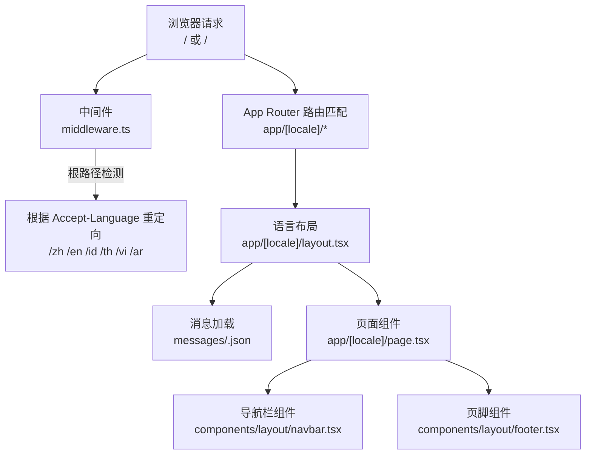
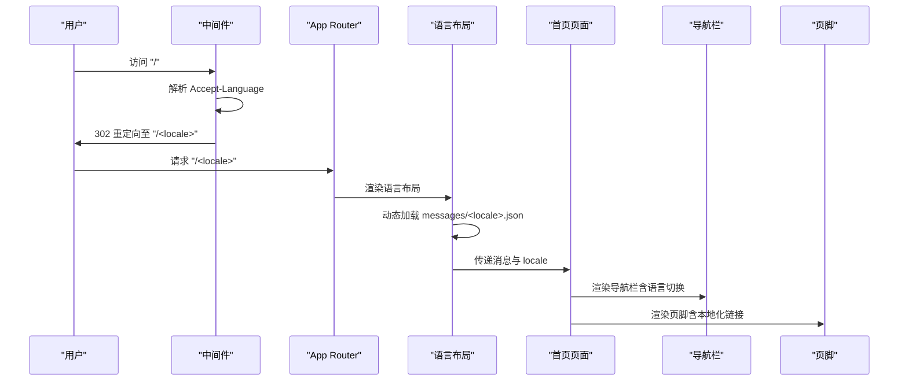
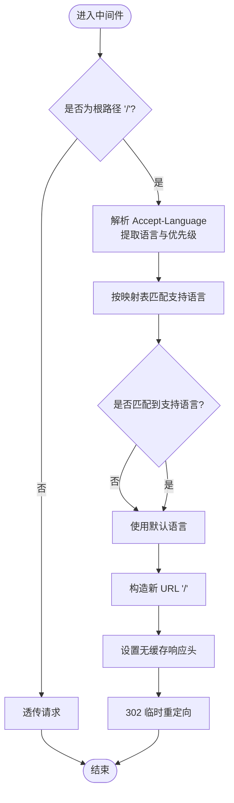
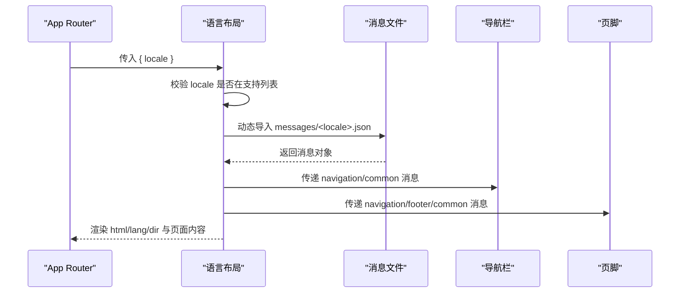
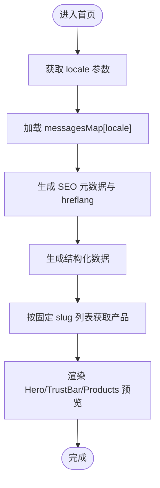
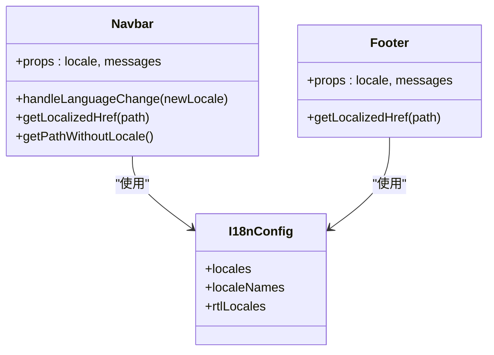
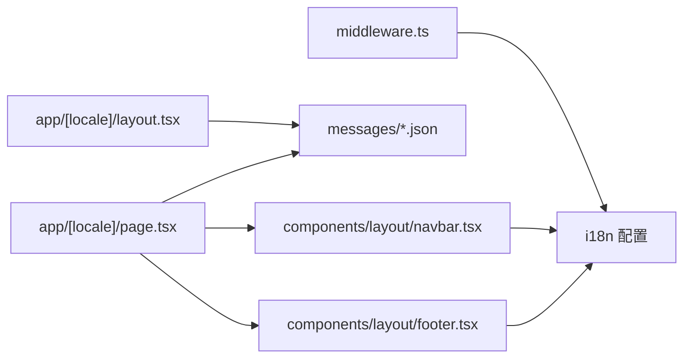

# 国际化系统

<cite>
**本文引用的文件**
- [messages/en.json](file://messages/en.json)
- [messages/zh.json](file://messages/zh.json)
- [messages/id.json](file://messages/id.json)
- [messages/th.json](file://messages/th.json)
- [messages/vi.json](file://messages/vi.json)
- [middleware.ts](file://middleware.ts)
- [next.config.mjs](file://next.config.mjs)
- [app/layout.tsx](file://app/layout.tsx)
- [app/[locale]/layout.tsx](file://app/[locale]/layout.tsx)
- [app/[locale]/page.tsx](file://app/[locale]/page.tsx)
- [components/layout/navbar.tsx](file://components/layout/navbar.tsx)
- [components/layout/footer.tsx](file://components/layout/footer.tsx)
</cite>

## 目录
1. [简介](#简介)
2. [项目结构](#项目结构)
3. [核心组件](#核心组件)
4. [架构总览](#架构总览)
5. [详细组件分析](#详细组件分析)
6. [依赖关系分析](#依赖关系分析)
7. [性能考量](#性能考量)
8. [故障排查指南](#故障排查指南)
9. [结论](#结论)
10. [附录](#附录)

## 简介
本文件系统化梳理 GoPro Trade 网站的国际化系统，基于 Next.js App Router 的路由与中间件能力，结合静态参数生成与动态消息加载，实现多语言内容渲染与语言切换。系统支持语言检测、URL 路由、RTL 语言适配、SEO 多语言链接、以及默认语言与回退策略。本文档面向开发者与产品/运营人员，既提供代码级实现解析，也给出新增语言与优化实践建议。

## 项目结构
国际化相关的关键目录与文件如下：
- 语言消息文件：messages/*.json（英文、中文、印尼语、泰语、越南语）
- 应用层路由与布局：app/[locale]/（按语言分段的页面与通用布局）
- 中间件：middleware.ts（根路径语言检测与重定向）
- 全局根布局：app/layout.tsx（默认 html lang）
- 组件：components/layout/navbar.tsx、footer.tsx（语言切换 UI 与本地化文案）
- 构建配置：next.config.mjs（性能与安全优化）

图表来源
- [middleware.ts:44-67](file://middleware.ts#L44-L67)
- [app/[locale]/layout.tsx:42-70](file://app/[locale]/layout.tsx#L42-L70)
- [app/[locale]/page.tsx:23-77](file://app/[locale]/page.tsx#L23-L77)
- [components/layout/navbar.tsx:28-214](file://components/layout/navbar.tsx#L28-L214)
- [components/layout/footer.tsx:36-169](file://components/layout/footer.tsx#L36-L169)

章节来源
- [middleware.ts:1-68](file://middleware.ts#L1-L68)
- [app/[locale]/layout.tsx:1-71](file://app/[locale]/layout.tsx#L1-L71)
- [app/[locale]/page.tsx:1-334](file://app/[locale]/page.tsx#L1-L334)
- [components/layout/navbar.tsx:1-215](file://components/layout/navbar.tsx#L1-L215)
- [components/layout/footer.tsx:1-170](file://components/layout/footer.tsx#L1-L170)
- [messages/en.json:1-200](file://messages/en.json#L1-L200)
- [messages/zh.json:1-200](file://messages/zh.json#L1-L200)
- [messages/id.json:1-200](file://messages/id.json#L1-L200)
- [messages/th.json:1-200](file://messages/th.json#L1-L200)
- [messages/vi.json:1-200](file://messages/vi.json#L1-L200)

## 核心组件
- 语言检测与重定向：middleware.ts 基于 Accept-Language 与预设映射表进行根路径重定向，并设置无缓存响应头。
- 语言布局与消息加载：app/[locale]/layout.tsx 动态加载对应语言消息，注入 html lang 与 dir（RTL 支持），生成 SEO hreflang。
- 首页与页面渲染：app/[locale]/page.tsx 动态读取消息键值，生成 SEO 元数据与结构化数据，按需加载产品数据。
- 导航与页脚：components/layout/navbar.tsx、footer.tsx 展示本地化文案，支持语言切换与本地化链接。
- 默认语言与全局根布局：app/layout.tsx 提供默认 html lang，next.config.mjs 提供性能与安全配置。

章节来源
- [middleware.ts:21-67](file://middleware.ts#L21-L67)
- [app/[locale]/layout.tsx:11-70](file://app/[locale]/layout.tsx#L11-L70)
- [app/[locale]/page.tsx:23-86](file://app/[locale]/page.tsx#L23-L86)
- [components/layout/navbar.tsx:28-214](file://components/layout/navbar.tsx#L28-L214)
- [components/layout/footer.tsx:36-169](file://components/layout/footer.tsx#L36-L169)
- [app/layout.tsx:1-19](file://app/layout.tsx#L1-L19)
- [next.config.mjs:1-65](file://next.config.mjs#L1-L65)

## 架构总览
系统采用“中间件 + App Router 路由 + 动态消息加载”的组合：
- 中间件负责根路径的语言检测与重定向，避免 SSR/CSR 冲突。
- App Router 通过动态段 [locale] 匹配语言，生成静态参数，保证每个语言版本独立。
- 语言布局统一加载对应消息文件，按需渲染页面与组件。
- 导航与页脚组件复用消息键值，实现一致的本地化体验。

图表来源
- [middleware.ts:44-67](file://middleware.ts#L44-L67)
- [app/[locale]/layout.tsx:34-55](file://app/[locale]/layout.tsx#L34-L55)
- [app/[locale]/page.tsx:23-77](file://app/[locale]/page.tsx#L23-L77)
- [components/layout/navbar.tsx:28-214](file://components/layout/navbar.tsx#L28-L214)
- [components/layout/footer.tsx:36-169](file://components/layout/footer.tsx#L36-L169)

## 详细组件分析

### 语言检测与重定向（middleware.ts）
- 接受浏览器请求头 Accept-Language，解析优先级，映射到已支持语言集合。
- 对根路径 "/" 进行 302 临时重定向，同时设置 no-store/no-cache/pragma/expire 响应头，避免代理缓存。
- 仅对根路径生效，其他路径透传。

图表来源
- [middleware.ts:21-67](file://middleware.ts#L21-L67)

章节来源
- [middleware.ts:1-68](file://middleware.ts#L1-L68)

### 语言布局与消息加载（app/[locale]/layout.tsx）
- generateStaticParams：为每个 locales 生成静态参数，确保语言版本可被预构建。
- generateMetadata：为每种语言生成 canonical 与 hreflang 列表，提升 SEO。
- getMessages：动态导入对应语言消息文件，异常时触发 404。
- 语言 HTML 标签与方向：根据 rtlLocales 注入 lang 与 dir（如 'rtl'）。
- 传递消息给 Navbar 与 Footer，实现导航与页脚的本地化。

图表来源
- [app/[locale]/layout.tsx:11-70](file://app/[locale]/layout.tsx#L11-L70)

章节来源
- [app/[locale]/layout.tsx:1-71](file://app/[locale]/layout.tsx#L1-L71)

### 首页与页面渲染（app/[locale]/page.tsx）
- generateMetadata：基于消息文件动态生成标题、描述、OpenGraph 与 Twitter 卡片，并输出 hreflang。
- 消息映射：messagesMap 将 locale 映射到对应消息模块，作为 t(key) 函数使用。
- SEO 结构化数据：生成组织、网站、FAQ、本地商业等 Schema。
- 产品预览：按固定 slug 列表获取代表性产品，优先加载首图以优化 LCP。
- revalidate：ISR 配置为 1 小时，平衡新鲜度与性能。

图表来源
- [app/[locale]/page.tsx:23-150](file://app/[locale]/page.tsx#L23-L150)

章节来源
- [app/[locale]/page.tsx:1-334](file://app/[locale]/page.tsx#L1-L334)

### 导航与页脚（components/layout/navbar.tsx、footer.tsx）
- 导航栏：展示本地化菜单项与语言切换按钮，点击设置 Cookie 保存语言偏好；移动端与桌面端分别渲染。
- 页脚：展示本地化版权、快速链接、联系方式与认证标识，支持 RTL 方向。
- 本地化链接：根据当前路径与 locale 生成带语言前缀的链接，保持用户所在页面的语言上下文。

图表来源
- [components/layout/navbar.tsx:28-214](file://components/layout/navbar.tsx#L28-L214)
- [components/layout/footer.tsx:36-169](file://components/layout/footer.tsx#L36-L169)

章节来源
- [components/layout/navbar.tsx:1-215](file://components/layout/navbar.tsx#L1-L215)
- [components/layout/footer.tsx:1-170](file://components/layout/footer.tsx#L1-L170)

### 语言文件组织与命名规范
- 文件命名：messages/<locale>.json，其中 <locale> 与 locales 配置一致。
- 键值结构：按功能域划分（如 navigation、hero、products、contact、footer、news、common），便于组件按需取用。
- 占位符与复数：消息文件中包含占位符与状态文案（如提交状态、数量区间），组件通过键路径读取。
- 示例键路径：navigation.home、products.categories.opticalSensor、common.loading 等。

章节来源
- [messages/en.json:1-200](file://messages/en.json#L1-L200)
- [messages/zh.json:1-200](file://messages/zh.json#L1-L200)
- [messages/id.json:1-200](file://messages/id.json#L1-L200)
- [messages/th.json:1-200](file://messages/th.json#L1-L200)
- [messages/vi.json:1-200](file://messages/vi.json#L1-L200)

### RTL 语言支持（阿拉伯语等）
- 检测与注入：语言布局根据 rtlLocales 判断是否为 RTL 语言，并在 html 上设置 dir="rtl"。
- 组件适配：导航栏与页脚在 RTL 场景下应用相应样式类，确保布局正确。
- 注意：当前代码中页脚对特定语言（如 'ar'）做了显式判断，建议统一使用 rtlLocales 以减少分支。

章节来源
- [app/[locale]/layout.tsx:55-69](file://app/[locale]/layout.tsx#L55-L69)
- [components/layout/footer.tsx:37-49](file://components/layout/footer.tsx#L37-L49)

### 语言回退与默认语言
- 默认语言：中间件与消息加载均以 defaultLocale 作为回退。
- 回退策略：当浏览器语言无法匹配或消息文件缺失时，系统回退到默认语言（通常为英语）。
- 建议：在新增语言时，先提供基础键值，再逐步完善翻译，确保回退路径稳定。

章节来源
- [middleware.ts:3, 21-42:3-42](file://middleware.ts#L3-L42)
- [app/[locale]/layout.tsx:34-40](file://app/[locale]/layout.tsx#L34-L40)

### URL 模式与 SEO
- URL 模式：/ 或 /<locale>，页面内链接统一使用带语言前缀的路径。
- hreflang：语言布局为每种语言生成 canonical 与 hreflang 列表，提升多语言 SEO。
- OpenGraph/Twitter：首页动态生成对应语言的元数据与卡片，增强分享效果。

章节来源
- [app/[locale]/layout.tsx:16-31](file://app/[locale]/layout.tsx#L16-L31)
- [app/[locale]/page.tsx:23-77](file://app/[locale]/page.tsx#L23-L77)

## 依赖关系分析
- 中间件依赖 locales 与 defaultLocale，控制根路径重定向。
- 语言布局依赖消息文件与 i18n 配置，生成元数据与渲染组件。
- 页面组件依赖消息映射与结构化数据工具，负责内容渲染与 SEO。
- 导航与页脚依赖 i18n 配置与消息，负责语言切换与本地化链接。

图表来源
- [middleware.ts:3](file://middleware.ts#L3)
- [app/[locale]/layout.tsx:3, 34-40](file://app/[locale]/layout.tsx#L3-L40)
- [app/[locale]/page.tsx:12-18](file://app/[locale]/page.tsx#L12-L18)
- [components/layout/navbar.tsx:6](file://components/layout/navbar.tsx#L6)
- [components/layout/footer.tsx:2](file://components/layout/footer.tsx#L2)

章节来源
- [middleware.ts:1-68](file://middleware.ts#L1-L68)
- [app/[locale]/layout.tsx:1-71](file://app/[locale]/layout.tsx#L1-L71)
- [app/[locale]/page.tsx:1-334](file://app/[locale]/page.tsx#L1-L334)
- [components/layout/navbar.tsx:1-215](file://components/layout/navbar.tsx#L1-L215)
- [components/layout/footer.tsx:1-170](file://components/layout/footer.tsx#L1-L170)

## 性能考量
- 图片优化：next.config.mjs 启用现代图片格式与懒加载缓存，提升 LCP 指标。
- 压缩与安全：启用 gzip 压缩，隐藏 X-Powered-By，设置安全响应头。
- ISR 与缓存：首页 revalidate=3600，减少频繁拉取数据；中间件设置无缓存，避免语言重定向被代理缓存。
- 消息加载：按语言动态导入消息文件，避免一次性加载全部语言包。

章节来源
- [next.config.mjs:4-61](file://next.config.mjs#L4-L61)
- [app/[locale]/page.tsx:149-150](file://app/[locale]/page.tsx#L149-L150)
- [middleware.ts:56-62](file://middleware.ts#L56-L62)

## 故障排查指南
- 404 语言页面：当 locale 不在支持列表或消息文件不存在时，语言布局触发 notFound。
- 语言切换无效：检查导航栏 handleLanguageChange 是否设置 Cookie，以及链接是否包含正确 locale 前缀。
- SEO 多语言链接缺失：确认语言布局 generateMetadata 是否正确生成 hreflang 与 canonical。
- RTL 布局异常：确认 rtlLocales 配置与 html dir 注入逻辑，避免硬编码特定语言判断。

章节来源
- [app/[locale]/layout.tsx:50-52](file://app/[locale]/layout.tsx#L50-L52)
- [components/layout/navbar.tsx:35-40](file://components/layout/navbar.tsx#L35-L40)
- [app/[locale]/layout.tsx:16-31](file://app/[locale]/layout.tsx#L16-L31)
- [components/layout/footer.tsx:37-49](file://components/layout/footer.tsx#L37-L49)

## 结论
该国际化系统通过中间件、App Router 动态段与动态消息加载实现了稳定的多语言支持，具备良好的 SEO 与性能表现。建议在新增语言时遵循现有文件与键值规范，确保消息文件完整性与 RTL 适配一致性，并持续优化 ISR 与缓存策略以提升用户体验。

## 附录

### 新增语言支持操作指南
- 创建消息文件：在 messages 目录新增 <new_locale>.json，复制现有语言结构，逐项翻译。
- 更新支持列表：在 i18n 配置中加入新语言代码与名称映射。
- 生成静态参数：确保语言布局 generateStaticParams 能生成新语言参数。
- 验证 SEO：在语言布局与页面组件中确认 hreflang 与元数据生成正常。
- RTL 适配：如为目标语言启用 RTL，确保 rtlLocales 包含该语言并在布局中注入 dir="rtl"。
- 测试：访问根路径与各语言页面，检查消息加载、语言切换与链接生成。

章节来源
- [messages/en.json:1-200](file://messages/en.json#L1-L200)
- [app/[locale]/layout.tsx:11-13](file://app/[locale]/layout.tsx#L11-L13)
- [app/[locale]/layout.tsx:16-31](file://app/[locale]/layout.tsx#L16-L31)
- [app/[locale]/layout.tsx:55-59](file://app/[locale]/layout.tsx#L55-L59)