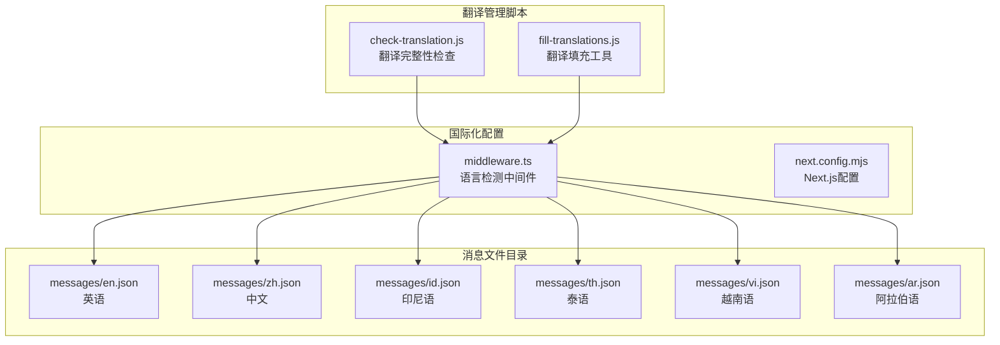
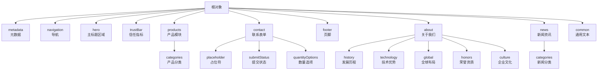
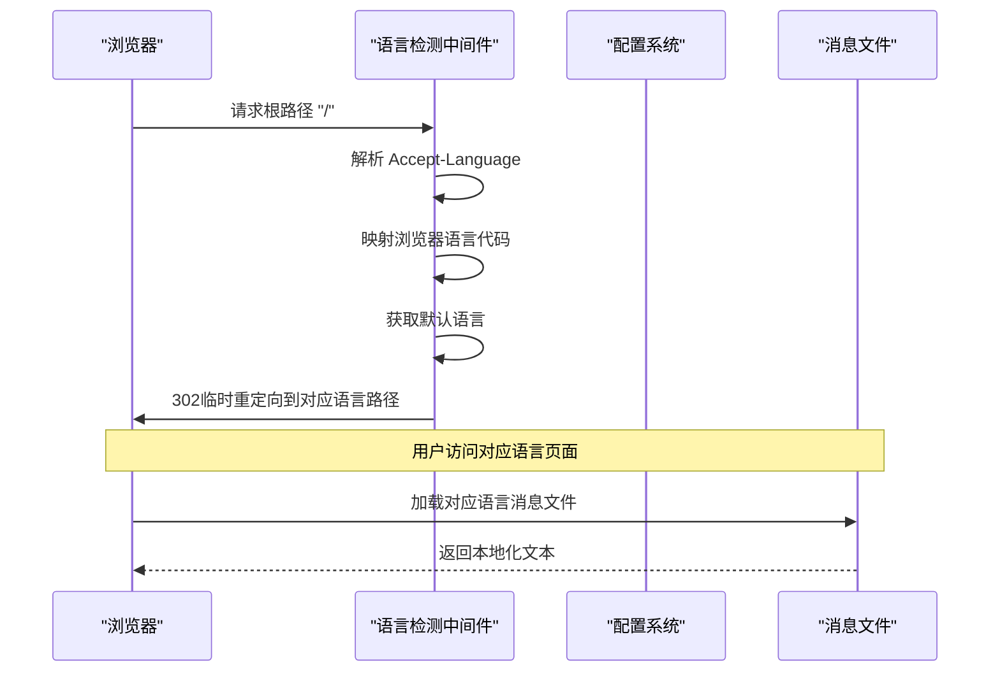
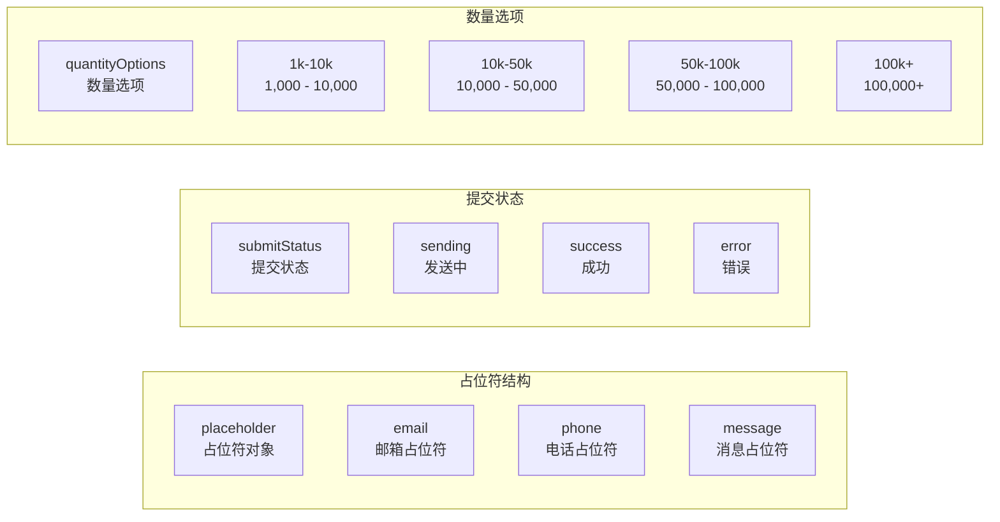
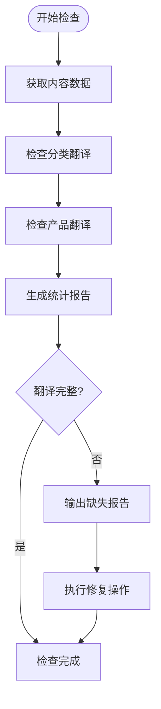
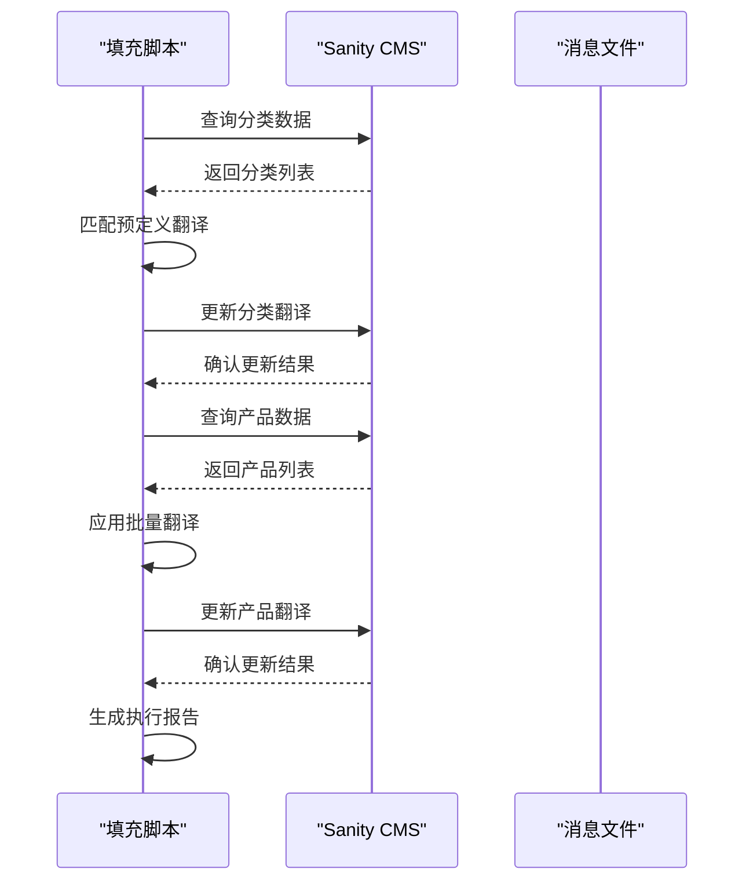
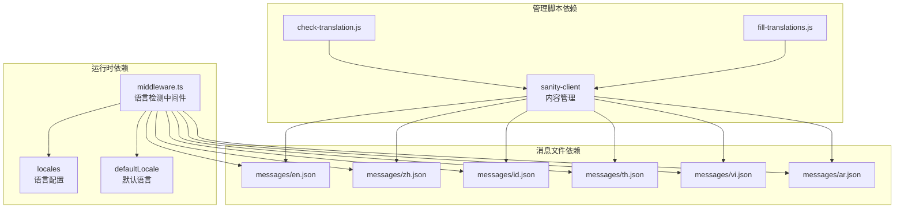

# 消息文件管理

<cite>
**本文档引用的文件**
- [messages/en.json](file://messages/en.json)
- [messages/zh.json](file://messages/zh.json)
- [messages/id.json](file://messages/id.json)
- [messages/th.json](file://messages/th.json)
- [messages/vi.json](file://messages/vi.json)
- [messages/ar.json](file://messages/ar.json)
- [scripts/crawler/check-translation.js](file://scripts/crawler/check-translation.js)
- [scripts/crawler/fill-translations.js](file://scripts/crawler/fill-translations.js)
- [middleware.ts](file://middleware.ts)
- [next.config.mjs](file://next.config.mjs)
</cite>

## 目录
1. [简介](#简介)
2. [项目结构](#项目结构)
3. [核心组件](#核心组件)
4. [架构概览](#架构概览)
5. [详细组件分析](#详细组件分析)
6. [依赖关系分析](#依赖关系分析)
7. [性能考虑](#性能考虑)
8. [故障排除指南](#故障排除指南)
9. [结论](#结论)
10. [附录](#附录)

## 简介

本文件系统性地文档化了该网站的消息文件管理系统，涵盖多语言消息文件的组织结构、命名规范、翻译键值管理策略、占位符与参数替换机制，以及版本管理和更新流程。通过对现有消息文件和相关脚本的深入分析，为新增翻译键值和维护工作提供最佳实践指导。

## 项目结构

该项目采用基于区域设置的文件组织方式，将不同语言的消息内容分别存储在独立的 JSON 文件中：

**图表来源**
- [messages/en.json:1-200](file://messages/en.json#L1-L200)
- [messages/zh.json:1-200](file://messages/zh.json#L1-L200)
- [middleware.ts:1-68](file://middleware.ts#L1-L68)

**章节来源**
- [messages/en.json:1-200](file://messages/en.json#L1-L200)
- [messages/zh.json:1-200](file://messages/zh.json#L1-L200)
- [messages/id.json:1-200](file://messages/id.json#L1-L200)
- [messages/th.json:1-200](file://messages/th.json#L1-L200)
- [messages/vi.json:1-200](file://messages/vi.json#L1-L200)
- [messages/ar.json:1-200](file://messages/ar.json#L1-L200)

## 核心组件

### 消息文件组织结构

消息文件采用分层嵌套结构，按照功能模块进行组织：

**图表来源**
- [messages/en.json:1-200](file://messages/en.json#L1-L200)

### 键值命名约定

消息文件遵循严格的命名约定：

1. **语义化命名**: 使用描述性英文单词组合，避免缩写
2. **层级结构**: 通过点号分隔表示嵌套层次
3. **一致性原则**: 同一功能域内的键值保持一致的命名风格
4. **复数处理**: 采用可数名词形式，必要时使用复数

**章节来源**
- [messages/en.json:6-198](file://messages/en.json#L6-L198)
- [messages/zh.json:6-198](file://messages/zh.json#L6-L198)

## 架构概览

国际化系统采用客户端语言检测和服务器端重定向相结合的方式：

**图表来源**
- [middleware.ts:21-63](file://middleware.ts#L21-L63)

**章节来源**
- [middleware.ts:1-68](file://middleware.ts#L1-L68)
- [next.config.mjs:1-65](file://next.config.mjs#L1-L65)

## 详细组件分析

### 消息文件格式规范

每个消息文件都遵循统一的 JSON 结构，包含以下主要部分：

#### 元数据模块 (metadata)
- **title**: 页面标题
- **description**: 页面描述

#### 导航模块 (navigation)
- **home**: 首页链接
- **products**: 产品中心
- **solutions**: 解决方案
- **about**: 关于我们
- **support**: 技术支持
- **contact**: 联系我们
- **inquiry**: 获取报价
- **language**: 语言选择
- **news**: 资讯中心

#### 产品模块 (products)
- **title**: 产品页面标题
- **categories**: 产品分类
- **viewDetails**: 查看详情
- **allProducts**: 全部产品
- **noProducts**: 无产品提示
- **targetMarkets**: 目标市场
- **specifications**: 技术规格
- **features**: 产品特性
- **applications**: 应用场景
- **downloadDatasheet**: 下载数据手册
- **productNotFound**: 产品未找到
- **backToProducts**: 返回产品列表
- **model**: 型号

#### 联系表单模块 (contact)
- **title**: 联系表单标题
- **subtitle**: 表单说明
- **companyName**: 公司名称
- **contactName**: 联系人姓名
- **email**: 邮箱
- **phone**: 电话号码
- **country**: 国家/地区
- **products**: 感兴趣的产品
- **quantity**: 预计数量
- **message**: 详细需求
- **submit**: 提交按钮
- **required**: 必填标识
- **contactInfo**: 联系信息
- **address**: 公司地址
- **selectCountry**: 选择国家/地区
- **selectQuantity**: 选择数量范围

**章节来源**
- [messages/en.json:1-200](file://messages/en.json#L1-L200)
- [messages/zh.json:1-200](file://messages/zh.json#L1-L200)

### 占位符和参数替换机制

消息文件中的占位符采用嵌套对象结构进行管理：

**图表来源**
- [messages/en.json:68-83](file://messages/en.json#L68-L83)

### 翻译键值管理策略

#### 键名一致性保证
- **标准化命名**: 所有语言文件使用相同的键名结构
- **层级对应**: 嵌套结构在各语言文件中保持一致
- **语义统一**: 相同功能的文本在不同语言中保持语义一致

#### 语义化命名实践
- **功能导向**: 键名反映文本的功能用途而非具体文字内容
- **上下文相关**: 在特定模块下使用描述性名称
- **避免缩写**: 优先使用完整单词而非缩写形式

#### 复数形式处理
- **可数名词**: 采用可数名词形式表达
- **范围表示**: 使用连字符连接数量范围
- **单位标注**: 在数量词后添加相应的单位标识

**章节来源**
- [messages/en.json:30-83](file://messages/en.json#L30-L83)
- [messages/zh.json:30-83](file://messages/zh.json#L30-L83)

### 版本管理和更新流程

#### 翻译完整性检查
脚本提供了完整的翻译完整性检查机制：

**图表来源**
- [scripts/crawler/check-translation.js:11-59](file://scripts/crawler/check-translation.js#L11-L59)

#### 缺失键值检测
检查脚本能够识别以下类型的缺失：
- 分类名称翻译缺失
- 产品名称翻译缺失
- 不同语言间的键值不匹配
- 数据库内容与消息文件的同步问题

**章节来源**
- [scripts/crawler/check-translation.js:1-60](file://scripts/crawler/check-translation.js#L1-L60)

### 翻译填充和管理工具

#### 自动翻译填充
填充脚本提供了批量翻译管理功能：

**图表来源**
- [scripts/crawler/fill-translations.js:264-331](file://scripts/crawler/fill-translations.js#L264-L331)

#### 翻译质量控制
- **预定义翻译库**: 重要术语使用固定翻译确保一致性
- **批量更新**: 支持一次性更新多个内容类型
- **进度跟踪**: 实时显示处理进度和结果统计
- **错误处理**: 完善的异常捕获和错误报告机制

**章节来源**
- [scripts/crawler/fill-translations.js:1-331](file://scripts/crawler/fill-translations.js#L1-L331)

## 依赖关系分析

国际化系统各组件之间的依赖关系：

**图表来源**
- [middleware.ts:1-68](file://middleware.ts#L1-L68)
- [scripts/crawler/check-translation.js:1-9](file://scripts/crawler/check-translation.js#L1-L9)
- [scripts/crawler/fill-translations.js:6-14](file://scripts/crawler/fill-translations.js#L6-L14)

**章节来源**
- [middleware.ts:1-68](file://middleware.ts#L1-L68)
- [scripts/crawler/check-translation.js:1-60](file://scripts/crawler/check-translation.js#L1-L60)
- [scripts/crawler/fill-translations.js:1-331](file://scripts/crawler/fill-translations.js#L1-L331)

## 性能考虑

### 缓存策略
- **静态资源缓存**: 图片和字体文件采用长期缓存策略
- **响应头优化**: 设置适当的缓存控制头
- **压缩启用**: 启用 gzip 压缩提升传输效率

### 语言检测性能
- **客户端优先**: 通过 Accept-Language 头快速判断用户语言偏好
- **降级处理**: 无法确定语言时使用默认语言
- **缓存控制**: 对重定向响应禁用缓存确保正确性

**章节来源**
- [next.config.mjs:35-61](file://next.config.mjs#L35-L61)
- [middleware.ts:21-42](file://middleware.ts#L21-L42)

## 故障排除指南

### 常见问题诊断

#### 翻译缺失问题
1. **检查键名一致性**: 确保所有语言文件使用相同的键名结构
2. **验证嵌套层级**: 检查对象嵌套是否在所有语言文件中保持一致
3. **确认数据源同步**: 验证 Sanity CMS 内容与消息文件的同步状态

#### 语言检测异常
1. **Accept-Language 头检查**: 确认浏览器发送的语言偏好设置
2. **中间件配置验证**: 检查语言映射表是否包含所需的浏览器语言代码
3. **重定向逻辑测试**: 验证 302 临时重定向的正确性

#### 批量更新失败
1. **API 权限检查**: 确认 Sanity API Token 有效且具有必要的权限
2. **网络连接测试**: 验证与 Sanity 服务的网络连接稳定性
3. **错误日志分析**: 查看详细的错误信息定位具体问题

**章节来源**
- [scripts/crawler/check-translation.js:1-60](file://scripts/crawler/check-translation.js#L1-L60)
- [scripts/crawler/fill-translations.js:282-319](file://scripts/crawler/fill-translations.js#L282-L319)

## 结论

该消息文件管理系统通过标准化的文件组织、严格的命名约定和完善的自动化工具，实现了多语言内容的有效管理。系统的关键优势包括：

1. **结构化组织**: 清晰的模块化设计便于维护和扩展
2. **一致性保障**: 标准化的命名约定确保跨语言的一致性
3. **自动化工具**: 完善的检查和填充脚本提升管理效率
4. **性能优化**: 合理的缓存策略和语言检测机制

建议在未来的发展中进一步完善自动化测试和持续集成流程，以确保翻译质量和系统稳定性。

## 附录

### 新增翻译键值最佳实践

#### 键名设计原则
- 使用语义化英文命名
- 保持层级结构清晰
- 避免使用缩写和特殊字符
- 确保键名在所有语言文件中一致

#### 翻译质量控制
- 建立翻译审查流程
- 使用术语库确保一致性
- 定期进行翻译完整性检查
- 建立错误报告和修复机制

#### 维护指南
- 制定变更通知流程
- 建立版本控制策略
- 定期备份消息文件
- 建立回滚机制