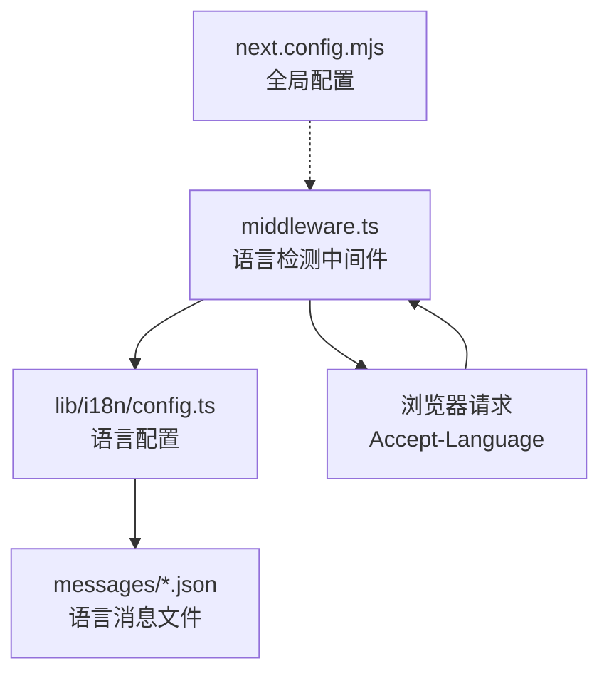
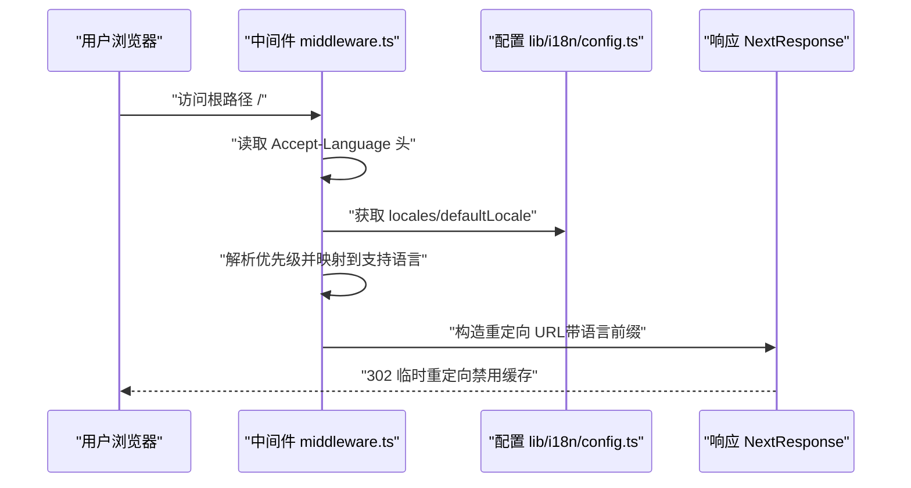
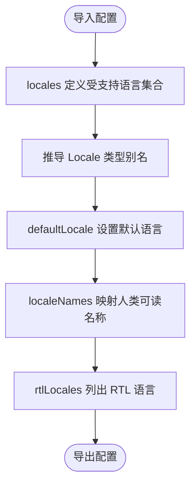
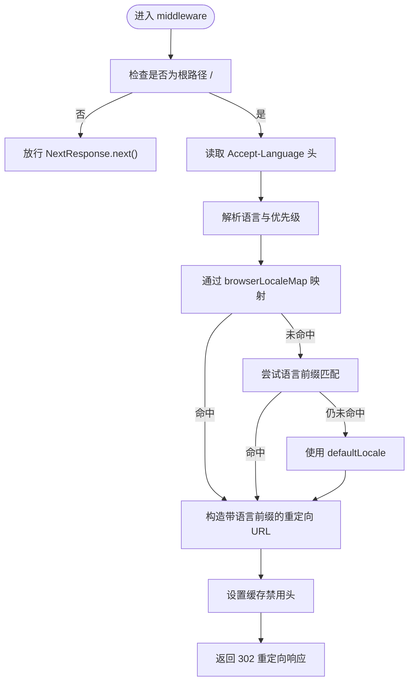

# 语言配置管理

<cite>
**本文引用的文件**
- [middleware.ts](file://middleware.ts)
- [lib/i18n/config.ts](file://lib/i18n/config.ts)
- [messages/en.json](file://messages/en.json)
- [messages/zh.json](file://messages/zh.json)
- [messages/id.json](file://messages/id.json)
- [messages/th.json](file://messages/th.json)
- [messages/vi.json](file://messages/vi.json)
- [next.config.mjs](file://next.config.mjs)
</cite>

## 目录
1. [简介](#简介)
2. [项目结构](#项目结构)
3. [核心组件](#核心组件)
4. [架构总览](#架构总览)
5. [详细组件分析](#详细组件分析)
6. [依赖关系分析](#依赖关系分析)
7. [性能考量](#性能考量)
8. [故障排查指南](#故障排查指南)
9. [结论](#结论)
10. [附录](#附录)

## 简介
本文件系统性地文档化本项目的语言配置管理方案，重点覆盖以下方面：
- locales 数组的配置方式：语言代码定义、类型安全实现、默认语言设置
- localeNames 对象的语言显示名称配置：每种语言的人类可读名称
- rtlLocales 数组的 RTL（从右到左）语言支持配置：从右到左语言的特殊处理机制
- middleware.ts 中的语言检测逻辑：浏览器语言偏好检测、URL 语言前缀解析、语言回退机制
- 语言配置的维护指南与最佳实践

## 项目结构
本项目采用多语言资源与中间件结合的方式实现语言检测与路由控制：
- 语言配置集中于 lib/i18n/config.ts，包含 locales、默认语言、显示名称与 RTL 列表
- 语言消息文件位于 messages/ 下，按语言代码命名
- 语言检测中间件 middleware.ts 负责根据浏览器语言偏好进行根路径重定向
- next.config.mjs 提供全局性能与安全响应头配置，避免与语言检测冲突

图表来源
- [middleware.ts:1-68](file://middleware.ts#L1-L68)
- [lib/i18n/config.ts:1-16](file://lib/i18n/config.ts#L1-L16)
- [next.config.mjs:1-65](file://next.config.mjs#L1-L65)

章节来源
- [middleware.ts:1-68](file://middleware.ts#L1-L68)
- [lib/i18n/config.ts:1-16](file://lib/i18n/config.ts#L1-L16)
- [next.config.mjs:1-65](file://next.config.mjs#L1-L65)

## 核心组件
- 语言代码与类型安全
  - locales 数组定义了受支持的语言集合，并通过只读字面量与类型别名确保类型安全
  - defaultLocale 指定默认语言，作为回退与非匹配场景的兜底
- 人类可读名称
  - localeNames 映射每种语言代码到其人类可读名称，用于界面展示与语言切换
- RTL 支持
  - rtlLocales 列出需要从右到左排版的语言集合，便于样式与布局适配
- 语言检测中间件
  - middleware.ts 解析 Accept-Language 头，将浏览器语言偏好映射到已支持语言，根路径下进行 302 临时重定向并禁用缓存

章节来源
- [lib/i18n/config.ts:1-16](file://lib/i18n/config.ts#L1-L16)
- [middleware.ts:1-68](file://middleware.ts#L1-L68)

## 架构总览
语言检测与路由控制的整体流程如下：

图表来源
- [middleware.ts:21-63](file://middleware.ts#L21-L63)
- [lib/i18n/config.ts:1-16](file://lib/i18n/config.ts#L1-L16)

## 详细组件分析

### 语言配置文件（lib/i18n/config.ts）
- 语言代码定义
  - locales 为只读字符串元组，确保仅允许预定义语言代码
  - 类型别名 Locale 由 locales 元素推导，保证类型安全
- 默认语言设置
  - defaultLocale 指定默认语言，作为浏览器语言不匹配时的回退
- 人类可读名称
  - localeNames 将语言代码映射到人类可读名称，便于在 UI 中展示
- RTL 语言支持
  - rtlLocales 仅包含阿拉伯语，用于后续样式与布局适配

图表来源
- [lib/i18n/config.ts:1-16](file://lib/i18n/config.ts#L1-L16)

章节来源
- [lib/i18n/config.ts:1-16](file://lib/i18n/config.ts#L1-L16)

### 语言检测中间件（middleware.ts）
- 浏览器语言偏好检测
  - 从请求头 Accept-Language 解析语言列表，计算优先级权重
  - 使用 browserLocaleMap 将浏览器语言代码映射到项目支持的语言代码
  - 若无匹配，回退至 defaultLocale
- URL 语言前缀解析
  - 仅对根路径 '/' 进行处理；其他路径直接放行
  - 将检测到的语言拼接为新的 URL 语言前缀
- 语言回退机制
  - 当浏览器语言无法精确匹配时，尝试提取语言前缀（如 zh-cn -> zh）
  - 仍无匹配则使用 defaultLocale
- 缓存策略
  - 返回 302 临时重定向，并设置严格的缓存禁用头，避免缓存重定向结果

图表来源
- [middleware.ts:21-63](file://middleware.ts#L21-L63)
- [lib/i18n/config.ts:4](file://lib/i18n/config.ts#L4)

章节来源
- [middleware.ts:1-68](file://middleware.ts#L1-L68)
- [lib/i18n/config.ts:1-16](file://lib/i18n/config.ts#L1-L16)

### 语言消息文件（messages/*.json）
- 文件组织
  - 每个语言对应一个 JSON 文件，键结构一致，值为该语言的翻译文本
- 示例覆盖
  - 英文、中文、印尼语、泰语、越南语的消息文件均存在，满足多语言展示需求
- 维护要点
  - 新增语言需同步新增 messages/<lang>.json，并在配置中更新 locales 与 localeNames
  - 保持键结构一致性，避免运行时报错

章节来源
- [messages/en.json:1-200](file://messages/en.json#L1-L200)
- [messages/zh.json:1-200](file://messages/zh.json#L1-L200)
- [messages/id.json:1-200](file://messages/id.json#L1-L200)
- [messages/th.json:1-200](file://messages/th.json#L1-L200)
- [messages/vi.json:1-200](file://messages/vi.json#L1-L200)

### 全局配置（next.config.mjs）
- 与语言检测的关系
  - 文档注释明确指出根路径语言检测重定向在页面层实现，避免在此处重复配置导致冲突
- 性能与安全
  - 启用压缩与安全响应头，提升整体性能与安全性

章节来源
- [next.config.mjs:19-21](file://next.config.mjs#L19-L21)
- [next.config.mjs:22-65](file://next.config.mjs#L22-L65)

## 依赖关系分析
- 中间件依赖配置
  - middleware.ts 依赖 lib/i18n/config.ts 导出的 locales、defaultLocale
- 配置被多处使用
  - 语言检测、UI 展示（localeNames）、RTL 样式（rtlLocales）
- 消息文件与配置解耦
  - 消息文件独立存放，通过语言代码与配置关联，便于维护与扩展

图表来源
- [middleware.ts:3](file://middleware.ts#L3)
- [lib/i18n/config.ts:1-16](file://lib/i18n/config.ts#L1-L16)
- [next.config.mjs:19-21](file://next.config.mjs#L19-L21)

章节来源
- [middleware.ts:1-68](file://middleware.ts#L1-L68)
- [lib/i18n/config.ts:1-16](file://lib/i18n/config.ts#L1-L16)
- [next.config.mjs:1-65](file://next.config.mjs#L1-L65)

## 性能考量
- 中间件执行成本低
  - 仅解析请求头与少量映射操作，开销极小
- 缓存禁用的必要性
  - 重定向为基于用户偏好的动态决策，需禁用缓存确保每次请求都重新判断
- 资源加载优化
  - next.config.mjs 已启用压缩与安全响应头，建议配合按需加载与静态资源缓存策略

## 故障排查指南
- 问题：访问根路径未发生语言重定向
  - 排查点：确认请求头中包含 Accept-Language；检查 middleware.ts 的根路径匹配与浏览器语言映射
  - 参考路径：[middleware.ts:44-63](file://middleware.ts#L44-L63)
- 问题：重定向后出现缓存导致语言不变
  - 排查点：确认响应头包含缓存禁用指令；检查浏览器缓存策略
  - 参考路径：[middleware.ts:56-60](file://middleware.ts#L56-L60)
- 问题：新增语言未生效
  - 排查点：确认 messages/<lang>.json 存在且键结构一致；在 lib/i18n/config.ts 中更新 locales、localeNames；rtlLocales 如需 RTL 支持也应更新
  - 参考路径：[lib/i18n/config.ts:1-16](file://lib/i18n/config.ts#L1-L16)
- 问题：浏览器语言前缀未正确映射
  - 排查点：检查 browserLocaleMap 是否包含对应前缀；必要时扩展映射规则
  - 参考路径：[middleware.ts:6-19](file://middleware.ts#L6-L19)

章节来源
- [middleware.ts:6-19](file://middleware.ts#L6-L19)
- [middleware.ts:44-63](file://middleware.ts#L44-L63)
- [middleware.ts:56-60](file://middleware.ts#L56-L60)
- [lib/i18n/config.ts:1-16](file://lib/i18n/config.ts#L1-L16)

## 结论
本项目通过“配置集中 + 中间件检测 + 消息文件分离”的方式实现了简洁而健壮的语言配置管理。借助类型安全的 locales 定义、人类可读名称映射与 RTL 支持，既保证了开发体验，也为国际化扩展提供了清晰路径。建议在新增语言或调整语言策略时，严格遵循本文档的维护流程与最佳实践。

## 附录

### 语言配置维护清单
- 在 lib/i18n/config.ts 中更新
  - locales：新增语言代码
  - defaultLocale：必要时调整默认语言
  - localeNames：新增语言的人类可读名称
  - rtlLocales：如需 RTL 支持，添加相应语言代码
- 在 messages/ 下新增
  - <lang>.json：完整翻译键值
- 在 middleware.ts 中评估
  - 如需支持更广泛的浏览器语言前缀，扩展 browserLocaleMap
- 在 next.config.mjs 中确认
  - 保持与语言检测的协调，避免重复重定向规则

章节来源
- [lib/i18n/config.ts:1-16](file://lib/i18n/config.ts#L1-L16)
- [messages/en.json:1-200](file://messages/en.json#L1-L200)
- [messages/zh.json:1-200](file://messages/zh.json#L1-L200)
- [messages/id.json:1-200](file://messages/id.json#L1-L200)
- [messages/th.json:1-200](file://messages/th.json#L1-L200)
- [messages/vi.json:1-200](file://messages/vi.json#L1-L200)
- [middleware.ts:6-19](file://middleware.ts#L6-L19)
- [next.config.mjs:19-21](file://next.config.mjs#L19-L21)