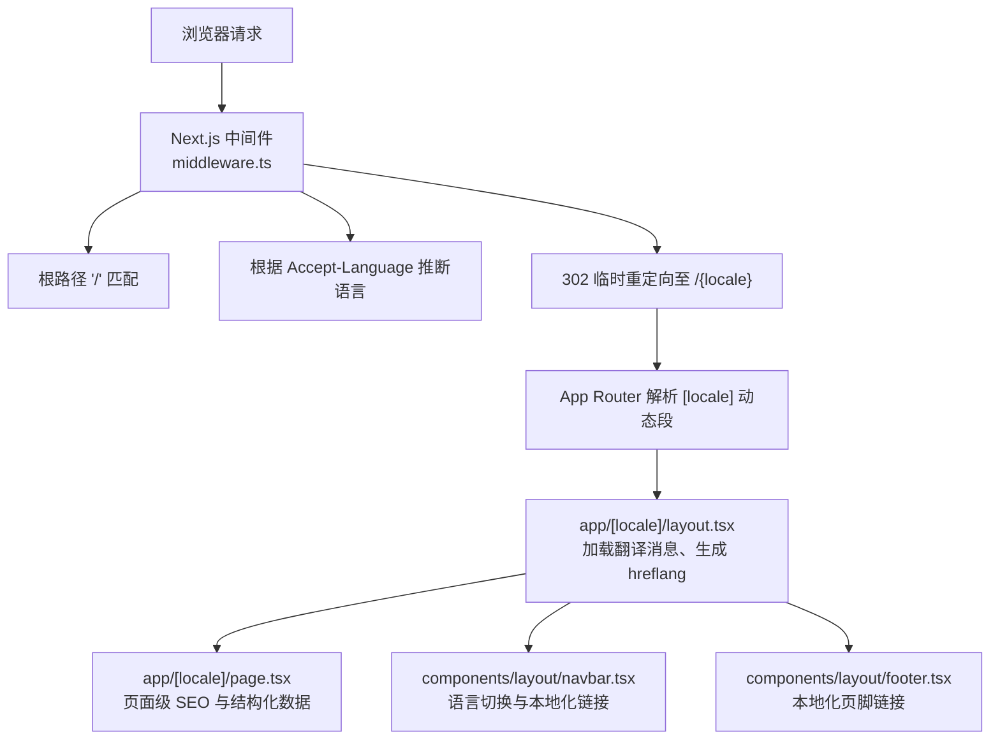
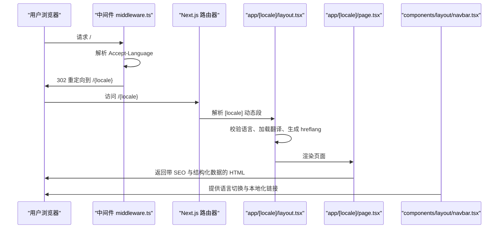
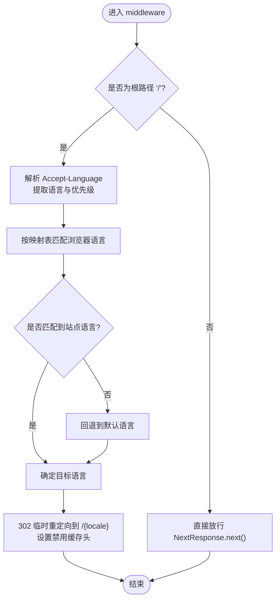
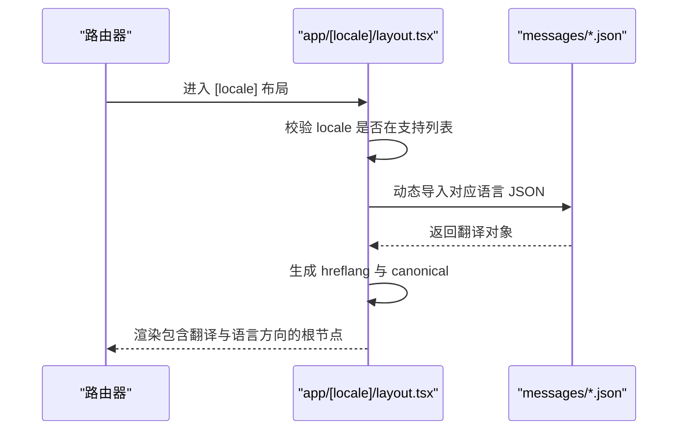
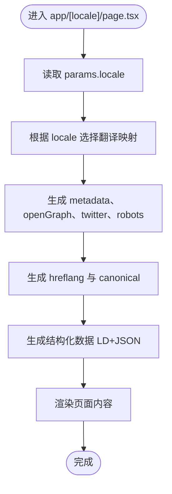
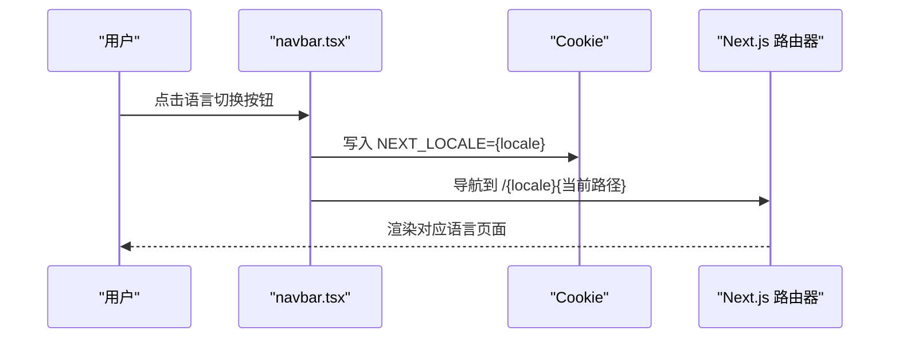
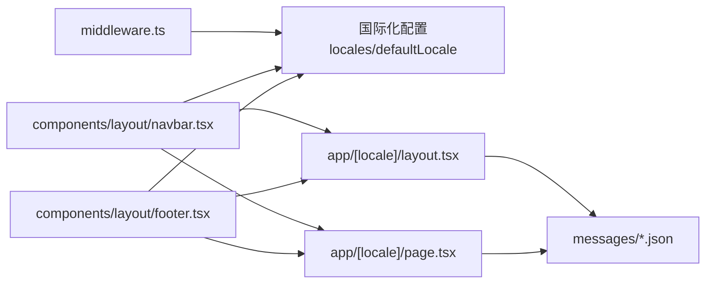

# 路由集成机制

<cite>
**本文档引用的文件**
- [middleware.ts](file://middleware.ts)
- [next.config.mjs](file://next.config.mjs)
- [app/layout.tsx](file://app/layout.tsx)
- [app/[locale]/layout.tsx](file://app/[locale]/layout.tsx)
- [app/[locale]/page.tsx](file://app/[locale]/page.tsx)
- [components/layout/navbar.tsx](file://components/layout/navbar.tsx)
- [components/layout/footer.tsx](file://components/layout/footer.tsx)
- [messages/en.json](file://messages/en.json)
- [messages/zh.json](file://messages/zh.json)
</cite>

## 目录
1. [简介](#简介)
2. [项目结构](#项目结构)
3. [核心组件](#核心组件)
4. [架构总览](#架构总览)
5. [详细组件分析](#详细组件分析)
6. [依赖关系分析](#依赖关系分析)
7. [性能考量](#性能考量)
8. [故障排除指南](#故障排除指南)
9. [结论](#结论)
10. [附录](#附录)

## 简介
本文件系统性阐述该 Next.js App Router 项目的路由集成机制，重点覆盖：
- 基于 URL 前缀的语言路由实现（动态路由参数处理、语言前缀解析、路由重写规则）
- middleware.ts 中的语言检测与重定向逻辑（浏览器语言偏好检测、URL 语言前缀验证、语言回退机制）
- Next.js App Router 与国际化系统的集成（动态路由配置、布局组件的国际化处理、页面组件的语言感知）
- 语言切换的路由处理（URL 更新、状态保持、SEO 优化）
- 路由配置的故障排除与性能优化建议

## 项目结构
该项目采用 App Router 的动态路由约定，通过 [locale] 动态段实现多语言前缀路由，配合中间件进行首屏语言检测与重定向，同时在布局层注入翻译消息与 SEO 元数据。

图表来源
- [middleware.ts:44-63](file://middleware.ts#L44-L63)
- [app/[locale]/layout.tsx:11-31](file://app/[locale]/layout.tsx#L11-L31)
- [app/[locale]/page.tsx:23-77](file://app/[locale]/page.tsx#L23-L77)
- [components/layout/navbar.tsx:28-59](file://components/layout/navbar.tsx#L28-L59)
- [components/layout/footer.tsx:36-42](file://components/layout/footer.tsx#L36-L42)

章节来源
- [middleware.ts:1-68](file://middleware.ts#L1-L68)
- [app/[locale]/layout.tsx:1-71](file://app/[locale]/layout.tsx#L1-L71)
- [app/[locale]/page.tsx:1-334](file://app/[locale]/page.tsx#L1-L334)
- [components/layout/navbar.tsx:1-215](file://components/layout/navbar.tsx#L1-L215)
- [components/layout/footer.tsx:1-170](file://components/layout/footer.tsx#L1-L170)

## 核心组件
- 中间件语言检测与重定向：基于 Accept-Language 头部解析浏览器语言偏好，匹配预设映射表，若命中则对根路径执行 302 临时重定向至对应语言前缀路径，并设置禁用缓存响应头。
- 动态语言布局：[locale] 动态段布局负责校验语言参数合法性、加载对应语言 JSON 翻译、生成 hreflang 与 canonical 链接、设置 html lang 与 dir 属性。
- 页面级国际化与 SEO：首页页面动态生成 metadata、openGraph、twitter 以及 robots 规则，并为不同语言生成 alternate 链接，同时注入结构化数据。
- 导航栏与页脚：导航组件根据当前路径生成带语言前缀的链接，语言切换时写入 cookie 以维持用户选择的语言偏好。

章节来源
- [middleware.ts:21-42](file://middleware.ts#L21-L42)
- [middleware.ts:44-63](file://middleware.ts#L44-L63)
- [app/[locale]/layout.tsx:11-31](file://app/[locale]/layout.tsx#L11-L31)
- [app/[locale]/layout.tsx:34-40](file://app/[locale]/layout.tsx#L34-L40)
- [app/[locale]/page.tsx:23-77](file://app/[locale]/page.tsx#L23-L77)
- [components/layout/navbar.tsx:28-59](file://components/layout/navbar.tsx#L28-L59)
- [components/layout/footer.tsx:36-42](file://components/layout/footer.tsx#L36-L42)

## 架构总览
下图展示了从请求进入、语言检测、动态路由解析到页面渲染与 SEO 注入的整体流程。

图表来源
- [middleware.ts:44-63](file://middleware.ts#L44-L63)
- [app/[locale]/layout.tsx:42-70](file://app/[locale]/layout.tsx#L42-L70)
- [app/[locale]/page.tsx:152-334](file://app/[locale]/page.tsx#L152-L334)
- [components/layout/navbar.tsx:28-59](file://components/layout/navbar.tsx#L28-L59)

## 详细组件分析

### 中间件：语言检测与重定向
- 语言偏好解析：从请求头 Accept-Language 中提取语言代码与优先级，按逗号分隔并排序，优先使用完整语言代码，其次使用主语言前缀。
- 映射策略：通过浏览器语言到站点语言的映射表进行归一化，例如 zh、zh-cn、zh-tw、zh-hk 统一映射到 zh。
- 重定向行为：仅对根路径 '/' 生效，命中后返回 302 临时重定向，并设置 no-store、no-cache、must-revalidate、proxy-revalidate 等响应头以避免缓存。
- 匹配器：通过 config.matcher 定义仅对根路径生效，减少不必要的中间件开销。

图表来源
- [middleware.ts:44-63](file://middleware.ts#L44-L63)
- [middleware.ts:21-42](file://middleware.ts#L21-L42)
- [middleware.ts:65-67](file://middleware.ts#L65-L67)

章节来源
- [middleware.ts:1-68](file://middleware.ts#L1-L68)
- [next.config.mjs:19-21](file://next.config.mjs#L19-L21)

### 动态语言布局：[locale] 布局
- 动态参数生成：generateStaticParams 为每个已支持语言生成静态参数，便于静态生成与预渲染。
- SEO 元数据：generateMetadata 动态生成 alternates.canonical 与 languages，确保每种语言都有对应的 hreflang 链接。
- 翻译加载：按 locale 动态导入对应语言 JSON 文件，若不存在则触发 404。
- 语言方向：根据 RTL 语言列表设置 html dir 属性，适配阿拉伯语等从右到左书写的语言。

图表来源
- [app/[locale]/layout.tsx:11-31](file://app/[locale]/layout.tsx#L11-L31)
- [app/[locale]/layout.tsx:34-40](file://app/[locale]/layout.tsx#L34-L40)
- [app/[locale]/layout.tsx:42-70](file://app/[locale]/layout.tsx#L42-L70)

章节来源
- [app/[locale]/layout.tsx:1-71](file://app/[locale]/layout.tsx#L1-L71)

### 页面组件：语言感知与 SEO
- 页面级 metadata：根据当前 locale 选择对应翻译，生成标题、描述、openGraph、twitter 等。
- hreflang 与 canonical：为每种语言生成 alternate 链接，canonical 指向当前语言版本。
- 结构化数据：注入组织、网站、FAQ、本地商业等结构化数据，提升 SEO 表现。
- revalidate：设置 ISR 重新验证时间为 3600 秒，平衡新鲜度与性能。

图表来源
- [app/[locale]/page.tsx:23-77](file://app/[locale]/page.tsx#L23-L77)
- [app/[locale]/page.tsx:79-86](file://app/[locale]/page.tsx#L79-L86)
- [app/[locale]/page.tsx:152-334](file://app/[locale]/page.tsx#L152-L334)

章节来源
- [app/[locale]/page.tsx:1-334](file://app/[locale]/page.tsx#L1-L334)
- [messages/en.json:1-200](file://messages/en.json#L1-L200)
- [messages/zh.json:1-200](file://messages/zh.json#L1-L200)

### 导航栏与页脚：语言切换与本地化链接
- 语言切换：点击语言菜单时写入 cookie 以持久化用户选择的语言偏好，随后跳转到对应语言的页面。
- 链接生成：导航栏与页脚均提供 getLocalizedHref 或类似逻辑，确保链接始终带有正确的语言前缀。
- 路径剥离：在生成链接时会剥离当前路径中的 locale 前缀，保证切换语言后仍定位到正确页面。

图表来源
- [components/layout/navbar.tsx:36-40](file://components/layout/navbar.tsx#L36-L40)
- [components/layout/navbar.tsx:54-59](file://components/layout/navbar.tsx#L54-L59)
- [components/layout/footer.tsx:39-42](file://components/layout/footer.tsx#L39-L42)

章节来源
- [components/layout/navbar.tsx:1-215](file://components/layout/navbar.tsx#L1-L215)
- [components/layout/footer.tsx:1-170](file://components/layout/footer.tsx#L1-L170)

### 根布局与全局元数据
- 根布局定义了站点基础元数据与 html lang，默认为英文。
- 顶层布局与 [locale] 布局共同作用，确保页面具备完整的语言与 SEO 上下文。

章节来源
- [app/layout.tsx:1-19](file://app/layout.tsx#L1-L19)
- [app/[locale]/layout.tsx:8-31](file://app/[locale]/layout.tsx#L8-L31)

## 依赖关系分析
- 中间件依赖：locales 与 defaultLocale 来自国际化配置，用于判断与回退。
- 动态布局依赖：messages/* 语言 JSON 文件，notFound 用于无效语言参数。
- 页面组件依赖：messages/* 语言 JSON 文件与结构化数据工具函数。
- 导航与页脚依赖：Locale 类型与 localeNames、rtlLocales 等配置。

图表来源
- [middleware.ts:3](file://middleware.ts#L3)
- [app/[locale]/layout.tsx:3](file://app/[locale]/layout.tsx#L3)
- [app/[locale]/page.tsx:13-18](file://app/[locale]/page.tsx#L13-L18)
- [components/layout/navbar.tsx:6](file://components/layout/navbar.tsx#L6)
- [components/layout/footer.tsx:2](file://components/layout/footer.tsx#L2)

章节来源
- [middleware.ts:1-68](file://middleware.ts#L1-L68)
- [app/[locale]/layout.tsx:1-71](file://app/[locale]/layout.tsx#L1-L71)
- [app/[locale]/page.tsx:1-334](file://app/[locale]/page.tsx#L1-L334)
- [components/layout/navbar.tsx:1-215](file://components/layout/navbar.tsx#L1-L215)
- [components/layout/footer.tsx:1-170](file://components/layout/footer.tsx#L1-L170)

## 性能考量
- 图片优化：Next.js 图像优化与现代图片格式（AVIF/WebP）支持，提升 LCP 指标。
- 缓存策略：静态资源与字体文件长期缓存，页面安全响应头增强安全性。
- 压缩与头部：启用 gzip 压缩，隐藏 X-Powered-By，降低指纹暴露风险。
- ISR 与 revalidate：首页设置 3600 秒重新验证，平衡新鲜度与服务器压力。
- 中间件匹配器：仅对根路径生效，减少中间件处理开销。

章节来源
- [next.config.mjs:4-17](file://next.config.mjs#L4-L17)
- [next.config.mjs:22-27](file://next.config.mjs#L22-L27)
- [next.config.mjs:29-32](file://next.config.mjs#L29-L32)
- [next.config.mjs:35-61](file://next.config.mjs#L35-L61)
- [app/[locale]/page.tsx:149-151](file://app/[locale]/page.tsx#L149-L151)
- [middleware.ts:65-67](file://middleware.ts#L65-L67)

## 故障排除指南
- 语言检测未生效
  - 确认浏览器请求头 Accept-Language 是否存在且格式正确。
  - 检查中间件 matcher 是否仅匹配根路径 '/'。
  - 章节来源
    - [middleware.ts:21-42](file://middleware.ts#L21-L42)
    - [middleware.ts:65-67](file://middleware.ts#L65-L67)
- 重定向循环或 404
  - 确保 [locale] 动态段布局中对非法 locale 调用 notFound。
  - 章节来源
    - [app/[locale]/layout.tsx:50-52](file://app/[locale]/layout.tsx#L50-L52)
- 语言切换后链接错误
  - 检查导航栏与页脚的链接生成逻辑，确保剥离旧 locale 并拼接新 locale。
  - 章节来源
    - [components/layout/navbar.tsx:43-49](file://components/layout/navbar.tsx#L43-L49)
    - [components/layout/navbar.tsx:54-59](file://components/layout/navbar.tsx#L54-L59)
    - [components/layout/footer.tsx:39-42](file://components/layout/footer.tsx#L39-L42)
- SEO 标签缺失
  - 确认页面级 generateMetadata 已为每种语言生成 alternate 与 canonical。
  - 章节来源
    - [app/[locale]/page.tsx:23-77](file://app/[locale]/page.tsx#L23-L77)
    - [app/[locale]/layout.tsx:16-31](file://app/[locale]/layout.tsx#L16-L31)
- 翻译缺失导致 404
  - 确认 messages/* 下存在对应语言 JSON 文件，否则布局会触发 notFound。
  - 章节来源
    - [app/[locale]/layout.tsx:34-40](file://app/[locale]/layout.tsx#L34-L40)

## 结论
该系统通过中间件对根路径进行语言检测与 302 重定向，结合 App Router 的 [locale] 动态路由与布局层的国际化处理，实现了从语言检测、URL 重写、页面渲染到 SEO 优化的完整链路。导航组件与页脚进一步保障了语言切换后的 URL 正确性与用户体验。整体设计兼顾性能与可维护性，适合多语言国际化场景。

## 附录
- 关键实现参考路径
  - 中间件语言检测与重定向：[middleware.ts:44-63](file://middleware.ts#L44-L63)
  - 动态语言布局与翻译加载：[app/[locale]/layout.tsx:42-70](file://app/[locale]/layout.tsx#L42-L70)
  - 页面级 SEO 与结构化数据：[app/[locale]/page.tsx:23-77](file://app/[locale]/page.tsx#L23-L77)
  - 语言切换与链接生成：[components/layout/navbar.tsx:36-59](file://components/layout/navbar.tsx#L36-L59)
  - 页脚本地化链接：[components/layout/footer.tsx:39-42](file://components/layout/footer.tsx#L39-L42)