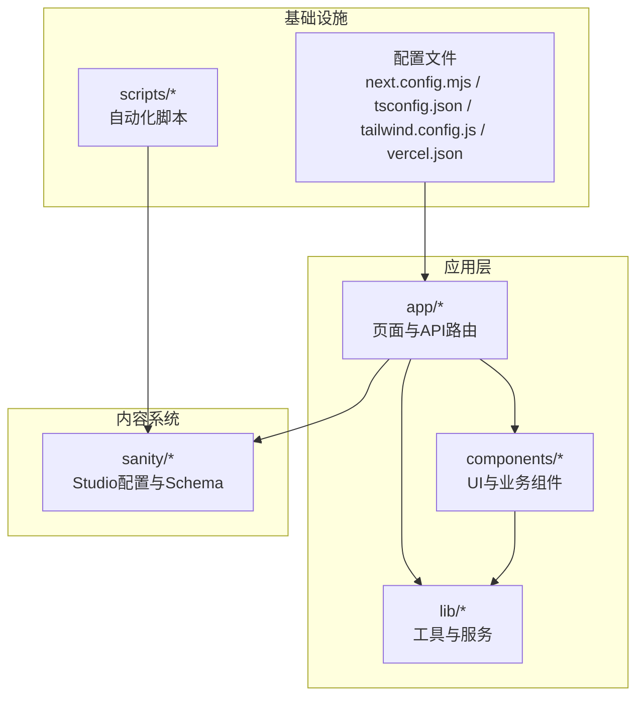
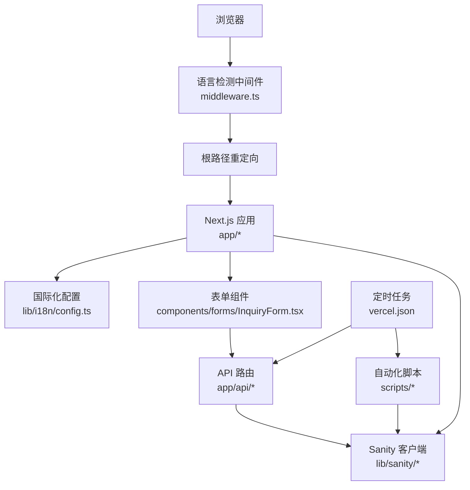
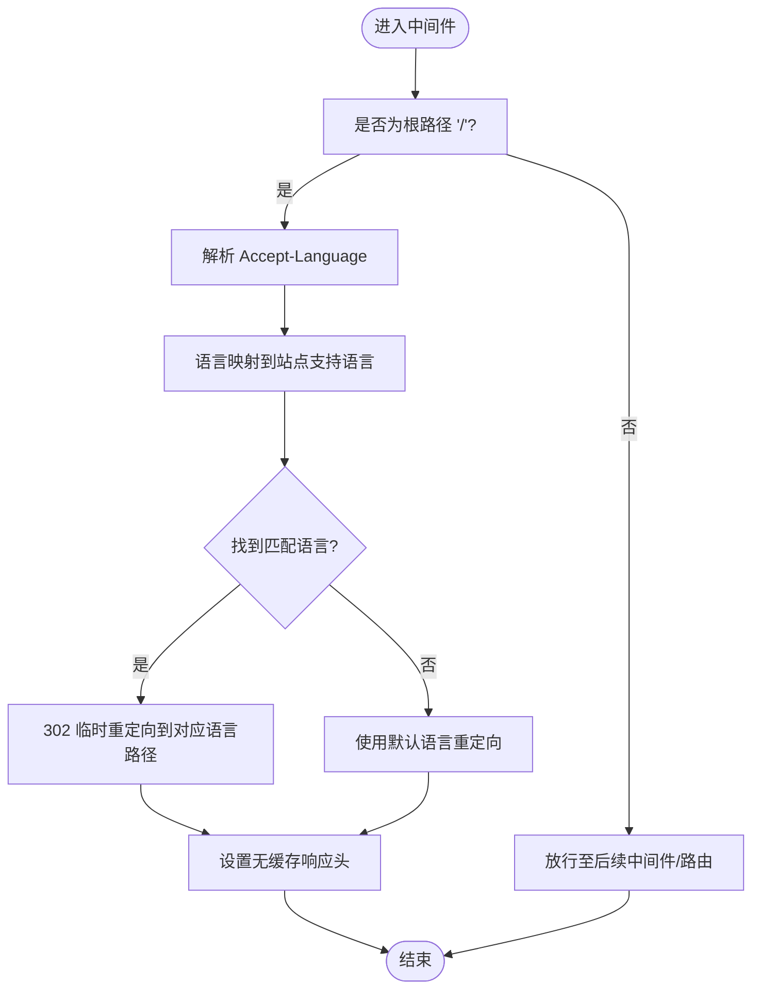
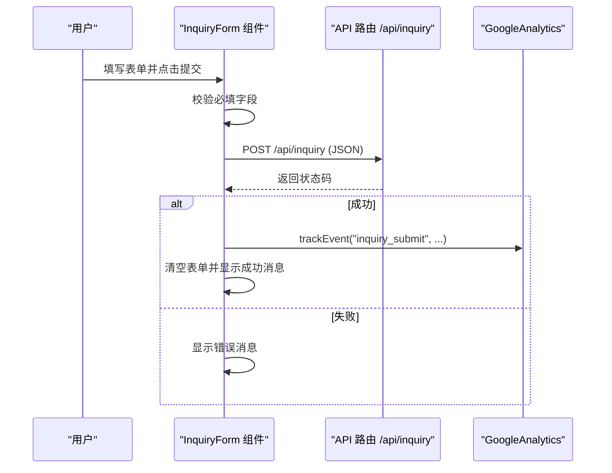
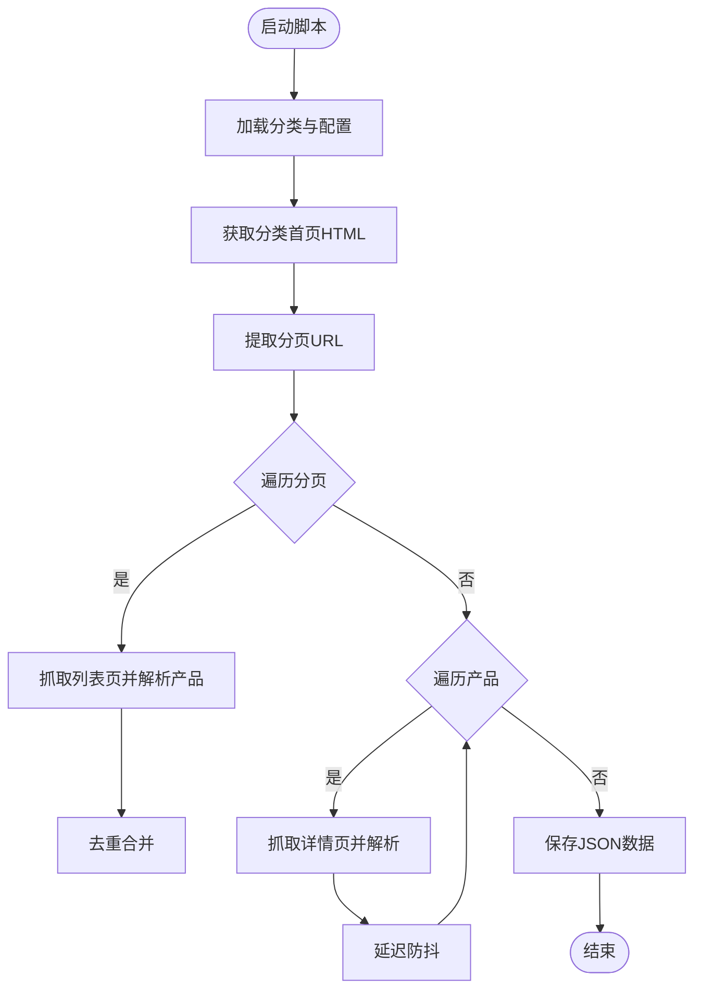
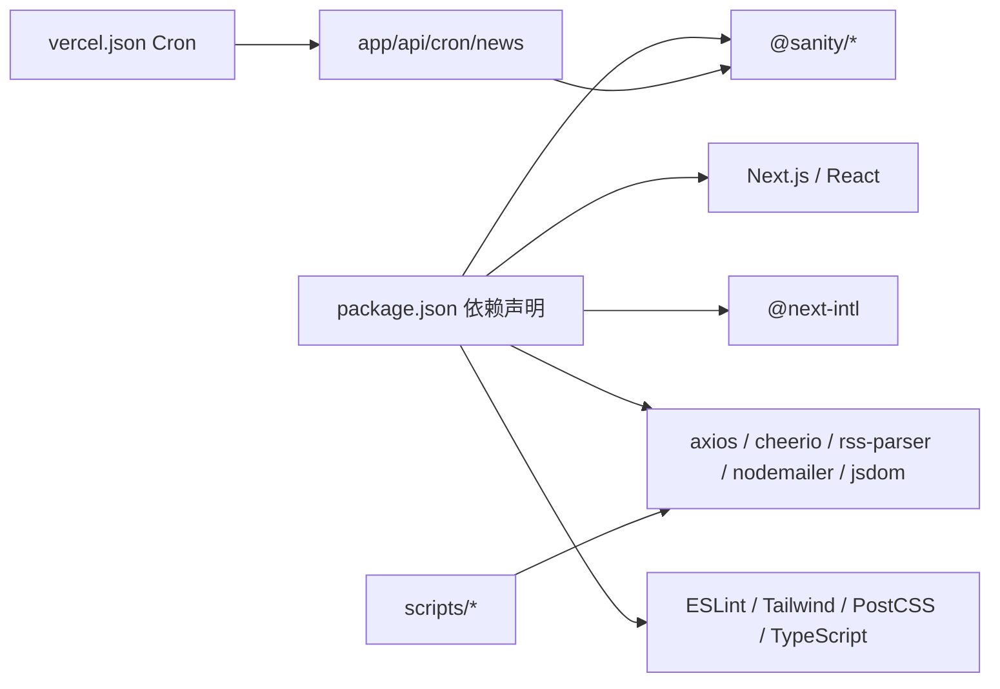

# 开发者指南

<cite>
**本文引用的文件**
- [package.json](file://package.json)
- [eslint.config.mjs](file://eslint.config.mjs)
- [next.config.mjs](file://next.config.mjs)
- [tsconfig.json](file://tsconfig.json)
- [tailwind.config.js](file://tailwind.config.js)
- [vercel.json](file://vercel.json)
- [README.md](file://README.md)
- [middleware.ts](file://middleware.ts)
- [app/layout.tsx](file://app/layout.tsx)
- [lib/i18n/config.ts](file://lib/i18n/config.ts)
- [components/forms/InquiryForm.tsx](file://components/forms/InquiryForm.tsx)
- [sanity/sanity.config.ts](file://sanity/sanity.config.ts)
- [sanity/sanity.cli.ts](file://sanity/sanity.cli.ts)
- [scripts/crawler/fetch-products.ts](file://scripts/crawler/fetch-products.ts)
</cite>

## 目录
1. [简介](#简介)
2. [项目结构](#项目结构)
3. [核心组件](#核心组件)
4. [架构总览](#架构总览)
5. [详细组件分析](#详细组件分析)
6. [依赖分析](#依赖分析)
7. [性能考虑](#性能考虑)
8. [故障排查指南](#故障排查指南)
9. [结论](#结论)
10. [附录](#附录)

## 简介
本指南面向GoPro Trade网站的开发者，目标是帮助团队建立统一的代码规范与最佳实践，明确开发流程、测试策略、依赖管理与版本控制、以及团队协作规范。项目采用Next.js 14 + TypeScript + Tailwind CSS技术栈，内容涵盖前端页面、国际化中间件、Sanity CMS集成、自动化脚本与定时任务等模块。

## 项目结构
项目采用按功能与层次混合的组织方式：
- app：Next.js App Router页面与路由定义，包含多语言页面与API路由
- components：可复用UI与业务组件（如表单、导航、面包屑）
- lib：通用工具与服务（国际化、邮件、通知、Sanity客户端封装等）
- sanity：Sanity Studio配置与Schema定义
- scripts：自动化脚本（爬虫、导入、新闻自动发布等）
- 根目录配置：包管理、构建、样式、部署与ESLint规则

图表来源
- [next.config.mjs:1-65](file://next.config.mjs#L1-L65)
- [tsconfig.json:1-44](file://tsconfig.json#L1-L44)
- [tailwind.config.js:1-18](file://tailwind.config.js#L1-L18)
- [vercel.json:1-44](file://vercel.json#L1-L44)

章节来源
- [package.json:1-45](file://package.json#L1-L45)
- [next.config.mjs:1-65](file://next.config.mjs#L1-L65)
- [tsconfig.json:1-44](file://tsconfig.json#L1-L44)
- [tailwind.config.js:1-18](file://tailwind.config.js#L1-L18)
- [vercel.json:1-44](file://vercel.json#L1-L44)

## 核心组件
- 国际化与语言检测中间件：基于浏览器语言偏好进行根路径重定向，确保用户访问对应语言页面
- 表单组件：询盘表单，包含多语言文案、国家选项、产品勾选、GA4转化追踪与后端API交互
- 构建与运行配置：Next.js性能优化、安全响应头、图片优化、实验性特性启用
- 内容管理：Sanity Studio配置与Schema类型定义，支持中英文界面与可视化编辑
- 自动化脚本：产品数据爬取与导入、新闻自动发布、定时任务调度

章节来源
- [middleware.ts:1-68](file://middleware.ts#L1-L68)
- [components/forms/InquiryForm.tsx:1-298](file://components/forms/InquiryForm.tsx#L1-L298)
- [next.config.mjs:1-65](file://next.config.mjs#L1-L65)
- [sanity/sanity.config.ts:1-33](file://sanity/sanity.config.ts#L1-L33)
- [scripts/crawler/fetch-products.ts:1-320](file://scripts/crawler/fetch-products.ts#L1-L320)

## 架构总览
整体架构由前端Next.js应用、国际化中间件、表单与API、Sanity内容系统、自动化脚本与定时任务组成。下图展示从浏览器请求到内容渲染与数据处理的关键路径。

图表来源
- [middleware.ts:1-68](file://middleware.ts#L1-L68)
- [lib/i18n/config.ts:1-16](file://lib/i18n/config.ts#L1-L16)
- [components/forms/InquiryForm.tsx:1-298](file://components/forms/InquiryForm.tsx#L1-L298)
- [sanity/sanity.config.ts:1-33](file://sanity/sanity.config.ts#L1-L33)
- [vercel.json:1-44](file://vercel.json#L1-L44)

## 详细组件分析

### 组件一：国际化中间件与语言检测
- 功能概述：解析浏览器Accept-Language，映射到站点支持的语言集合，对根路径执行302临时重定向，并设置无缓存响应头
- 关键点：
  - 语言映射表覆盖zh/zh-cn/zh-tw/zh-hk等简繁中文变体
  - 默认语言为en；RTL语言列表包含ar
  - 匹配器仅作用于根路径“/”
- 错误处理：未检测到语言时回退默认语言

图表来源
- [middleware.ts:1-68](file://middleware.ts#L1-L68)
- [lib/i18n/config.ts:1-16](file://lib/i18n/config.ts#L1-L16)

章节来源
- [middleware.ts:1-68](file://middleware.ts#L1-L68)
- [lib/i18n/config.ts:1-16](file://lib/i18n/config.ts#L1-L16)

### 组件二：询盘表单组件
- 功能概述：收集公司名、联系人、邮箱、电话、国家、感兴趣产品、采购量、留言等信息，提交至后端API，成功后GA4事件追踪并清空表单
- 关键点：
  - 使用受控组件状态管理
  - 国家选项根据当前locale切换显示语言
  - 提交状态包含发送中、成功、错误三种状态
  - 通过fetch调用/app/api/inquiry路由
- 错误处理：网络异常或响应非OK时设置错误状态

图表来源
- [components/forms/InquiryForm.tsx:1-298](file://components/forms/InquiryForm.tsx#L1-L298)

章节来源
- [components/forms/InquiryForm.tsx:1-298](file://components/forms/InquiryForm.tsx#L1-L298)

### 组件三：Next.js构建与运行配置
- 图片优化：启用AVIF/WebP格式、设备尺寸与图片尺寸、远程图片模式为cdn.sanity.io、最小缓存期30天
- 性能与安全：开启gzip压缩、隐藏X-Powered-By、设置安全响应头、实验性优化导入
- 头部策略：静态资源与字体长期缓存、页面级安全头
- 与Vercel集成：框架声明、地区、自定义头部、重写sitemap、Cron计划任务

章节来源
- [next.config.mjs:1-65](file://next.config.mjs#L1-L65)
- [vercel.json:1-44](file://vercel.json#L1-L44)

### 组件四：Sanity内容管理
- Studio配置：deskTool与visionTool插件、Schema类型注册、中英文界面支持
- CLI配置：通过环境变量或公共变量读取projectId与dataset
- 与Next应用：通过@next-intl与@sanity/client进行内容获取与展示

章节来源
- [sanity/sanity.config.ts:1-33](file://sanity/sanity.config.ts#L1-L33)
- [sanity/sanity.cli.ts:1-9](file://sanity/sanity.cli.ts#L1-L9)

### 组件五：自动化脚本与定时任务
- 产品爬虫：遍历分类、分页抓取产品列表，解析详情，去重并保存为JSON
- 新闻自动发布：AI处理器、爬虫、发布器、调度器与配置
- 定时任务：Vercel Cron触发/app/api/cron/news

图表来源
- [scripts/crawler/fetch-products.ts:1-320](file://scripts/crawler/fetch-products.ts#L1-L320)

章节来源
- [scripts/crawler/fetch-products.ts:1-320](file://scripts/crawler/fetch-products.ts#L1-L320)
- [vercel.json:33-42](file://vercel.json#L33-L42)

## 依赖分析
- 运行时依赖：Next.js、React、@next-intl、@sanity/*、axios、cheerio、rss-parser、node-cron、nodemailer等
- 开发依赖：ESLint 9、Tailwind CSS、PostCSS、TypeScript等
- 依赖关系：前端应用依赖国际化与Sanity客户端；爬虫脚本依赖jsdom与cheerio；定时任务依赖node-cron与Vercel Cron

图表来源
- [package.json:1-45](file://package.json#L1-L45)
- [vercel.json:33-42](file://vercel.json#L33-L42)

章节来源
- [package.json:1-45](file://package.json#L1-L45)
- [vercel.json:1-44](file://vercel.json#L1-L44)

## 性能考虑
- 图片优化：启用现代格式（AVIF/WebP）、合理设备尺寸与图片尺寸、远程图片缓存
- 构建优化：实验性优化导入、gzip压缩、安全响应头
- 缓存策略：静态资源与字体长期缓存、页面安全头
- 代码质量：ESLint规则继承Next核心Web Vitals与TypeScript配置，减少潜在性能隐患

章节来源
- [next.config.mjs:1-65](file://next.config.mjs#L1-L65)
- [eslint.config.mjs:1-19](file://eslint.config.mjs#L1-L19)

## 故障排查指南
- 语言重定向异常
  - 检查浏览器Accept-Language请求头与中间件映射逻辑
  - 确认匹配器仅作用于根路径且设置了无缓存响应头
- 表单提交失败
  - 查看网络面板与API返回状态，确认后端路由可达
  - 检查GA4事件是否正确触发与表单状态更新
- 图片加载问题
  - 确认remotePatterns包含cdn.sanity.io
  - 检查图片URL与缓存策略
- Sanity连接问题
  - 校验环境变量与CLI配置中的projectId/dataset
  - 确认Studio端口与本地开发配置一致
- 定时任务未触发
  - 检查Vercel Cron计划与API路由路径
  - 查看日志与错误处理输出

章节来源
- [middleware.ts:1-68](file://middleware.ts#L1-L68)
- [components/forms/InquiryForm.tsx:1-298](file://components/forms/InquiryForm.tsx#L1-L298)
- [next.config.mjs:1-65](file://next.config.mjs#L1-L65)
- [sanity/sanity.cli.ts:1-9](file://sanity/sanity.cli.ts#L1-L9)
- [vercel.json:33-42](file://vercel.json#L33-L42)

## 结论
本指南提供了GoPro Trade网站的开发规范、流程与架构要点，建议团队在日常开发中严格遵循ESLint与TypeScript配置、保持组件与目录结构的一致性、完善测试与自动化脚本、并结合Vercel的Cron与安全头策略保障线上稳定运行。

## 附录

### A. 代码规范与最佳实践
- TypeScript编码标准
  - 严格模式、不输出JS、模块解析使用bundler、路径别名@/*
  - 推荐使用接口描述props与状态，避免any
- ESLint配置
  - 继承Next.js核心Web Vitals与TypeScript规则
  - 自定义忽略规则需谨慎评估
- 代码格式化
  - 使用Prettier配合ESLint统一格式
  - 在CI中强制执行格式检查

章节来源
- [tsconfig.json:1-44](file://tsconfig.json#L1-L44)
- [eslint.config.mjs:1-19](file://eslint.config.mjs#L1-L19)

### B. 开发工作流程
- 分支管理
  - 主分支保护，功能开发在feature/*分支，修复hotfix/*分支
- 代码审查
  - PR必须包含变更说明与测试截图/日志
- 测试策略
  - 单元测试：组件与工具函数
  - 集成测试：API路由与Sanity客户端
  - E2E测试：关键流程（表单提交、语言重定向）
- 版本发布
  - 语义化版本，变更日志记录重大改动
  - Vercel自动部署，生产前预检

### C. 项目结构与约定
- 文件命名
  - 页面文件使用page.tsx，API路由route.ts/route.tsx
  - 组件文件使用驼峰命名，如InquiryForm.tsx
- 目录组织
  - app按功能划分，components复用UI，lib集中工具
  - sanity独立目录，scripts按功能拆分
- 模块化设计
  - 路径别名@/*简化导入
  - 国际化配置集中管理

章节来源
- [app/layout.tsx:1-19](file://app/layout.tsx#L1-L19)
- [lib/i18n/config.ts:1-16](file://lib/i18n/config.ts#L1-L16)
- [tsconfig.json:25-29](file://tsconfig.json#L25-L29)

### D. 调试与测试方法
- 本地调试
  - 使用next dev启动，结合浏览器开发者工具与网络面板
  - 设置断点验证中间件与表单提交流程
- 单元测试
  - 对纯函数与工具方法进行断言
- 集成测试
  - 模拟API路由行为，验证表单提交与响应
- E2E测试
  - 使用Playwright/Cypress覆盖关键用户路径

### E. 依赖管理与版本控制
- 包管理
  - 使用npm，锁定版本，定期同步依赖
- 依赖更新
  - 使用npm outdated与交互式升级
- 安全扫描
  - 使用npm audit或Snyk定期扫描高危漏洞

### F. 团队协作指南
- Git工作流
  - Feature分支 -> Pull Request -> 代码审查 -> 合并主分支
- 文档编写
  - 变更记录在README或CHANGELOG中同步更新
- 知识分享
  - 定期站会与技术分享，沉淀最佳实践

### G. 常见问题与经验总结
- 表单提交失败
  - 检查后端路由与跨域配置，确认请求体结构
- 语言重定向循环
  - 确保中间件仅匹配根路径，避免重复重定向
- 图片不显示
  - 校验remotePatterns与URL协议
- Sanity数据不同步
  - 校验环境变量与CLI配置，确认数据集一致性