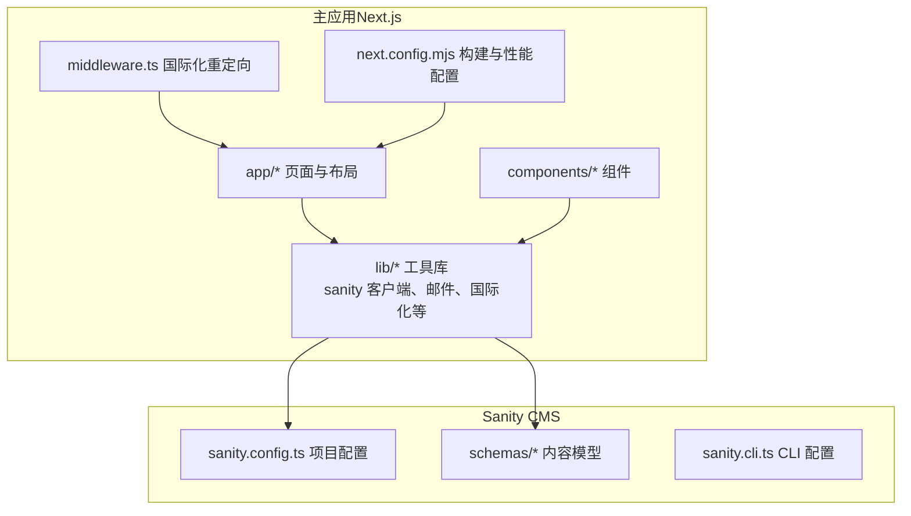
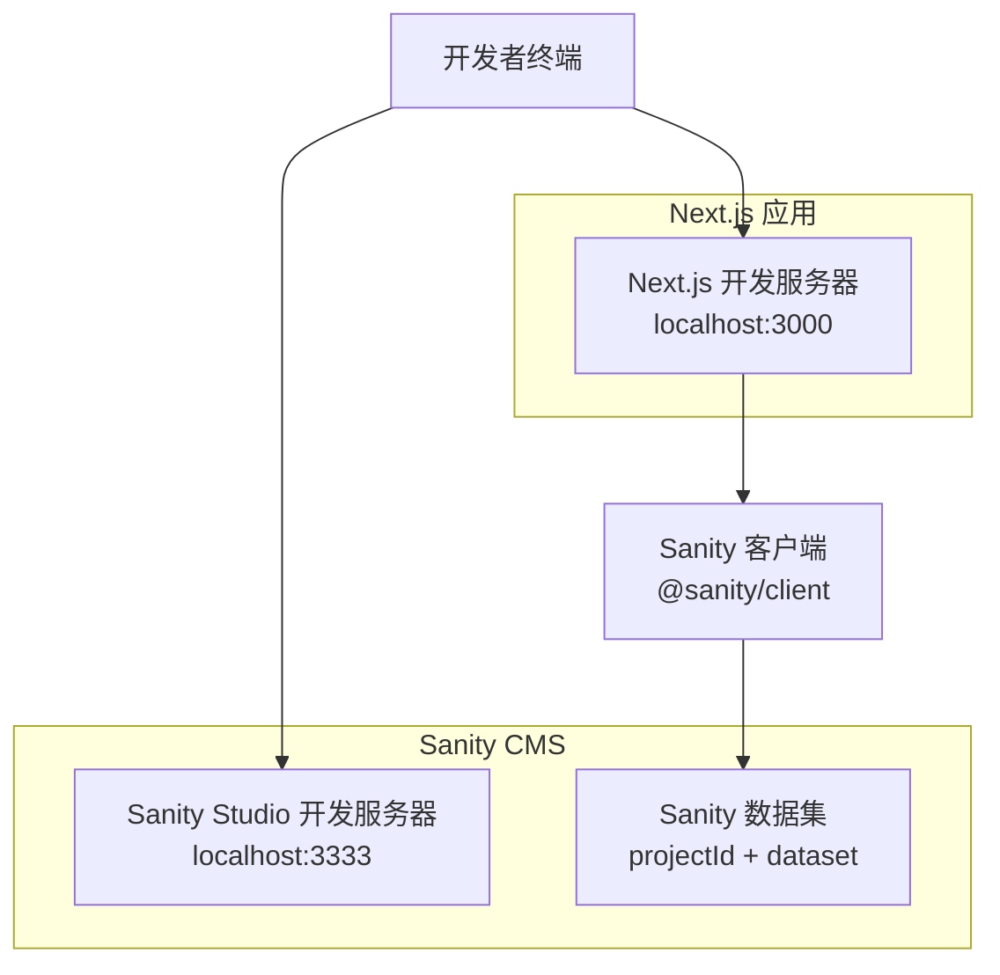
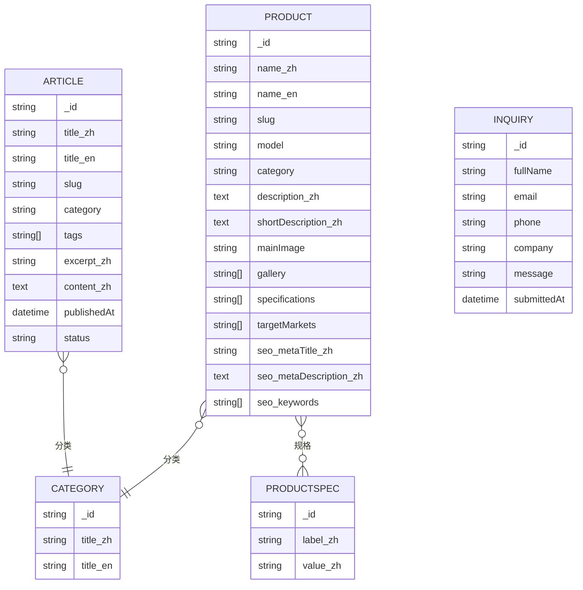
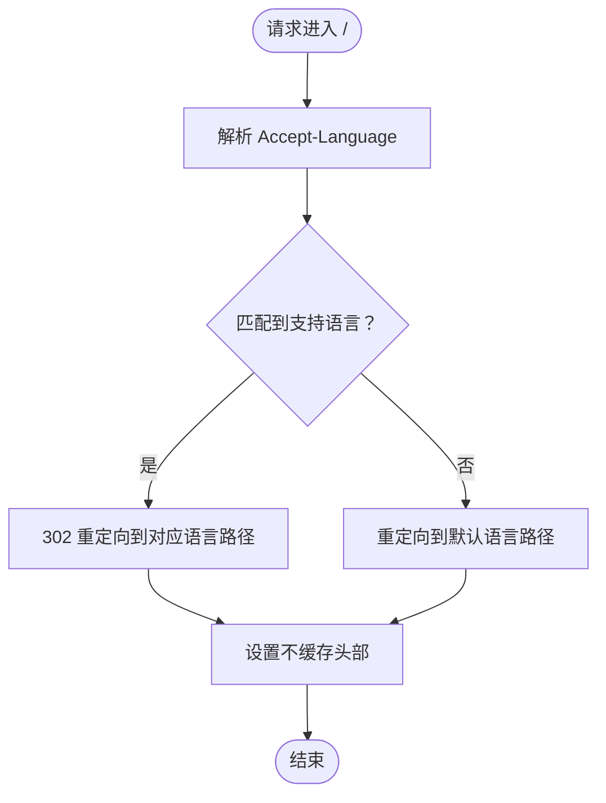
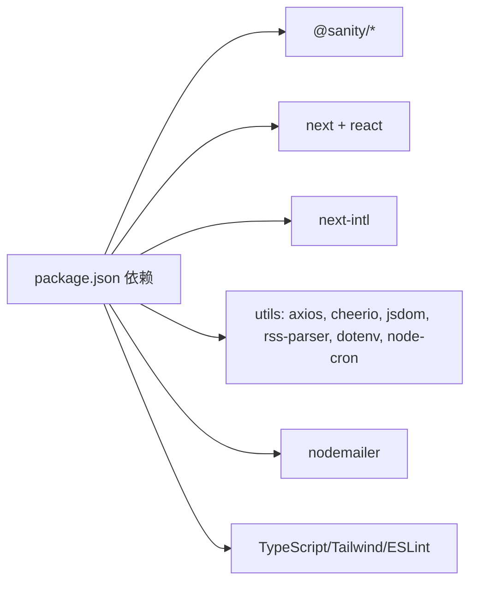

# 快速开始

<cite>
**本文引用的文件**
- [package.json](file://package.json)
- [sanity/package.json](file://sanity/package.json)
- [README.md](file://README.md)
- [sanity/sanity.config.ts](file://sanity/sanity.config.ts)
- [sanity/sanity.cli.ts](file://sanity/sanity.cli.ts)
- [lib/sanity/client.ts](file://lib/sanity/client.ts)
- [next.config.mjs](file://next.config.mjs)
- [middleware.ts](file://middleware.ts)
- [lib/i18n/config.ts](file://lib/i18n/config.ts)
- [sanity/schemas/index.ts](file://sanity/schemas/index.ts)
- [sanity/schemas/article.ts](file://sanity/schemas/article.ts)
- [sanity/schemas/product.ts](file://sanity/schemas/product.ts)
- [sanity/schemas/category.ts](file://sanity/schemas/category.ts)
- [sanity/schemas/productSpec.ts](file://sanity/schemas/productSpec.ts)
- [sanity/schemas/inquiry.ts](file://sanity/schemas/inquiry.ts)
- [sanity/schemas/articleCategory.ts](file://sanity/schemas/articleCategory.ts)
- [scripts/news-auto/config.ts](file://scripts/news-auto/config.ts)
</cite>

## 目录
1. [简介](#简介)
2. [项目结构](#项目结构)
3. [核心组件](#核心组件)
4. [架构总览](#架构总览)
5. [详细组件分析](#详细组件分析)
6. [依赖分析](#依赖分析)
7. [性能考虑](#性能考虑)
8. [故障排除指南](#故障排除指南)
9. [结论](#结论)
10. [附录](#附录)

## 简介
本指南面向新加入的开发者，帮助你在约30分钟内完成 GoPro Trade 网站的本地环境搭建与运行。你将获得：
- 环境要求与前置条件（Node.js、包管理器）
- 主应用与 Sanity CMS 的依赖安装步骤
- 环境变量配置说明（Sanity 项目 ID、数据集、API Token、邮件配置等）
- 开发服务器启动命令与访问方式
- 常见安装问题的解决方案与故障排除建议

## 项目结构
该项目采用 Next.js 应用与 Sanity CMS 分离的双仓库结构：
- 主应用位于根目录，使用 Next.js 14 与 TypeScript 构建前端页面、API 路由与国际化逻辑。
- Sanity CMS 位于 sanity 子目录，包含内容模型（schemas）、CLI 配置与可视化工具。

图表来源
- [package.json:1-45](file://package.json#L1-L45)
- [sanity/package.json:1-16](file://sanity/package.json#L1-L16)
- [sanity/sanity.config.ts:1-33](file://sanity/sanity.config.ts#L1-L33)
- [sanity/schemas/index.ts:1-9](file://sanity/schemas/index.ts#L1-L9)
- [lib/sanity/client.ts:1-30](file://lib/sanity/client.ts#L1-L30)
- [middleware.ts:1-68](file://middleware.ts#L1-L68)
- [next.config.mjs:1-65](file://next.config.mjs#L1-L65)

章节来源
- [package.json:1-45](file://package.json#L1-L45)
- [sanity/package.json:1-16](file://sanity/package.json#L1-L16)
- [sanity/sanity.config.ts:1-33](file://sanity/sanity.config.ts#L1-L33)
- [sanity/schemas/index.ts:1-9](file://sanity/schemas/index.ts#L1-L9)
- [lib/sanity/client.ts:1-30](file://lib/sanity/client.ts#L1-L30)
- [middleware.ts:1-68](file://middleware.ts#L1-L68)
- [next.config.mjs:1-65](file://next.config.mjs#L1-L65)

## 核心组件
- Next.js 应用：负责页面渲染、API 路由、国际化与性能优化。
- Sanity 客户端：通过 @sanity/client 连接 Sanity，读取内容并生成图片 URL。
- 国际化中间件：根据浏览器语言进行根路径重定向。
- 构建与安全配置：Next.js 头部安全策略、图片优化与压缩。

章节来源
- [lib/sanity/client.ts:1-30](file://lib/sanity/client.ts#L1-L30)
- [middleware.ts:1-68](file://middleware.ts#L1-L68)
- [next.config.mjs:1-65](file://next.config.mjs#L1-L65)

## 架构总览
下图展示了主应用与 Sanity 的交互关系，以及开发时的启动流程。

图表来源
- [package.json:5-10](file://package.json#L5-L10)
- [sanity/package.json:5-9](file://sanity/package.json#L5-L9)
- [lib/sanity/client.ts:5-15](file://lib/sanity/client.ts#L5-L15)
- [sanity/sanity.config.ts:8-16](file://sanity/sanity.config.ts#L8-L16)

## 详细组件分析

### 环境要求与前置条件
- Node.js 版本：项目使用 Next.js 14，建议使用 LTS 版本（如 18 或 20）。具体版本兼容可参考依赖中的 Node 类型定义与构建配置。
- 包管理器：支持 npm、yarn、pnpm、bun。推荐使用与团队一致的包管理器以避免 lock 文件差异。
- Git：用于克隆与版本控制。

章节来源
- [package.json:30-42](file://package.json#L30-L42)
- [README.md:1-42](file://README.md#L1-L42)

### 依赖安装步骤
- 安装主应用依赖
  - 在项目根目录执行安装命令（任选其一）：
    - npm install
    - yarn install
    - pnpm install
    - bun install
- 安装 Sanity CMS 依赖
  - 切换到 sanity 子目录后执行安装：
    - cd sanity && npm install 或 yarn 或 pnpm
- 启动 Sanity Studio（可选）
  - 在根目录执行：npm run sanity 或 yarn sanity 或 pnpm sanity
  - Studio 默认监听端口 3333

章节来源
- [package.json:5-10](file://package.json#L5-L10)
- [sanity/package.json:5-9](file://sanity/package.json#L5-L9)

### 环境变量配置
- Sanity 项目配置（优先级从高到低）
  - SANITY_STUDIO_PROJECT_ID / NEXT_PUBLIC_SANITY_PROJECT_ID：Sanity 项目 ID
  - SANITY_STUDIO_DATASET / NEXT_PUBLIC_SANITY_DATASET：数据集名称（默认 production）
  - SANITY_API_TOKEN：API Token（用于写入操作）
- 邮件配置（示例用途）
  - 项目中包含 nodemailer 依赖，可用于发送询盘邮件。实际 SMTP 参数需在运行环境中配置（例如通过平台的环境变量面板或 Docker 环境变量）。
- 其他建议
  - 若需要在构建时注入公共变量，可在 Next.js 中通过 NEXT_PUBLIC_ 前缀暴露给客户端（当前代码未使用公共变量，但可按需扩展）。

章节来源
- [sanity/sanity.config.ts:8-9](file://sanity/sanity.config.ts#L8-L9)
- [sanity/sanity.cli.ts:4-7](file://sanity/sanity.cli.ts#L4-L7)
- [lib/sanity/client.ts:7](file://lib/sanity/client.ts#L7)
- [package.json:24](file://package.json#L24)

### 开发服务器启动命令与访问方式
- 启动主应用开发服务器
  - 在项目根目录执行：npm run dev 或 yarn dev 或 pnpm dev 或 bun dev
  - 访问地址：http://localhost:3000
- 启动 Sanity Studio
  - 在根目录执行：npm run sanity 或 yarn sanity 或 pnpm sanity
  - 访问地址：http://localhost:3333

章节来源
- [README.md:6-18](file://README.md#L6-L18)
- [package.json:5-10](file://package.json#L5-L10)
- [sanity/package.json:5-9](file://sanity/package.json#L5-L9)

### 内容模型与数据流
- 内容模型概览
  - 文章（article）：支持多语言标题、摘要、正文、分类、标签、SEO 等字段。
  - 产品（product）：支持多语言名称、描述、规格、图集、应用场景、SEO 等字段。
  - 分类（category / articleCategory）：产品与文章的分类体系。
  - 规格（productSpec）：产品的技术规格条目。
  - 询盘（inquiry）：用户提交的询盘信息。
- 数据流
  - 主应用通过 @sanity/client 读取 Sanity 数据，生成图片 URL 并渲染页面。
  - 国际化中间件根据浏览器语言对根路径进行 302 重定向至对应语言路径。

图表来源
- [sanity/schemas/article.ts:1-265](file://sanity/schemas/article.ts#L1-L265)
- [sanity/schemas/product.ts:1-233](file://sanity/schemas/product.ts#L1-L233)
- [sanity/schemas/category.ts](file://sanity/schemas/category.ts)
- [sanity/schemas/productSpec.ts](file://sanity/schemas/productSpec.ts)
- [sanity/schemas/inquiry.ts](file://sanity/schemas/inquiry.ts)
- [sanity/schemas/articleCategory.ts](file://sanity/schemas/articleCategory.ts)

章节来源
- [sanity/schemas/index.ts:1-9](file://sanity/schemas/index.ts#L1-L9)
- [sanity/schemas/article.ts:1-265](file://sanity/schemas/article.ts#L1-L265)
- [sanity/schemas/product.ts:1-233](file://sanity/schemas/product.ts#L1-L233)

### 国际化与语言检测
- 支持语言：英语（en）、中文（zh）、印尼语（id）、泰语（th）、越南语（vi）、阿拉伯语（ar）
- 默认语言：英语（en）
- 根路径语言检测：当访问根路径“/”时，中间件根据浏览器 Accept-Language 进行匹配与重定向，同时设置不缓存头部。

图表来源
- [middleware.ts:21-42](file://middleware.ts#L21-L42)
- [middleware.ts:44-63](file://middleware.ts#L44-L63)
- [lib/i18n/config.ts:1-16](file://lib/i18n/config.ts#L1-L16)

章节来源
- [middleware.ts:1-68](file://middleware.ts#L1-L68)
- [lib/i18n/config.ts:1-16](file://lib/i18n/config.ts#L1-L16)

### 构建与性能配置
- 图片优化：启用现代图片格式（AVIF/WebP），配置设备像素比与远程图片模式（cdn.sanity.io）。
- 压缩：启用 gzip 压缩。
- 安全响应头：隐藏 X-Powered-By，设置 X-Content-Type-Options、X-Frame-Options、Referrer-Policy。
- 实验性优化：优化包导入（lucide-react、@sanity/client）。

章节来源
- [next.config.mjs:4-17](file://next.config.mjs#L4-L17)
- [next.config.mjs:22-23](file://next.config.mjs#L22-L23)
- [next.config.mjs:25-27](file://next.config.mjs#L25-L27)
- [next.config.mjs:29-32](file://next.config.mjs#L29-L32)
- [next.config.mjs:34-61](file://next.config.mjs#L34-L61)

### 自动化新闻生成（可选）
- 配置项：每日最大发布数、发布时间、关键词过滤、AI 改写模型与阈值、目标语言等。
- 该功能位于 scripts/news-auto 目录，可按需启用与维护。

章节来源
- [scripts/news-auto/config.ts:1-45](file://scripts/news-auto/config.ts#L1-L45)

## 依赖分析
- 主应用依赖
  - @sanity/client、@sanity/image-url、next-sanity：连接与渲染 Sanity 内容。
  - next、react、react-dom：框架与运行时。
  - next-intl：国际化。
  - axios、cheerio、jsdom：爬虫与 HTML 解析。
  - rss-parser：RSS 解析。
  - nodemailer：邮件发送。
  - dotenv：环境变量加载。
  - node-cron：定时任务。
- 开发依赖
  - TypeScript、TailwindCSS、ESLint、PostCSS 等。

图表来源
- [package.json:12-28](file://package.json#L12-L28)
- [package.json:30-42](file://package.json#L30-L42)

章节来源
- [package.json:12-42](file://package.json#L12-L42)

## 性能考虑
- 图片优化：启用 AVIF/WebP、合理配置设备像素比与缓存 TTL。
- 压缩：开启 gzip 提升传输效率。
- 安全头：减少指纹暴露，增强安全性。
- 实验性优化：优化包导入，减少打包体积与冷启动时间。

章节来源
- [next.config.mjs:4-17](file://next.config.mjs#L4-L17)
- [next.config.mjs:22-23](file://next.config.mjs#L22-L23)
- [next.config.mjs:25-27](file://next.config.mjs#L25-L27)
- [next.config.mjs:29-32](file://next.config.mjs#L29-L32)
- [next.config.mjs:34-61](file://next.config.mjs#L34-L61)

## 故障排除指南
- 无法启动主应用或报端口占用
  - 确认端口 3000 未被占用；若被占用，修改 Next.js 端口或释放端口。
- 无法启动 Sanity Studio 或端口冲突
  - 确认端口 3333 未被占用；可在 sanity/package.json 中调整端口后重启。
- 无法连接 Sanity 内容
  - 检查环境变量 SANITY_STUDIO_PROJECT_ID、SANITY_STUDIO_DATASET、SANITY_API_TOKEN 是否正确设置。
  - 确认 Sanity Studio 已启动且可访问 localhost:3333。
- 国际化重定向异常
  - 检查浏览器 Accept-Language 请求头；确认根路径重定向逻辑与语言映射表正常。
- 图片无法加载或跨域错误
  - 确认 Next.js 图片远程模式已允许 cdn.sanity.io；检查 Sanity 数据集中是否存在有效图片。
- ESLint 或 TypeScript 报错
  - 清理 node_modules 并重新安装依赖；确保 Node.js 版本满足类型定义要求。

章节来源
- [sanity/package.json:5-9](file://sanity/package.json#L5-L9)
- [sanity/sanity.config.ts:8-9](file://sanity/sanity.config.ts#L8-L9)
- [sanity/sanity.cli.ts:4-7](file://sanity/sanity.cli.ts#L4-L7)
- [lib/sanity/client.ts:5-15](file://lib/sanity/client.ts#L5-L15)
- [middleware.ts:21-42](file://middleware.ts#L21-L42)
- [next.config.mjs:11-16](file://next.config.mjs#L11-L16)

## 结论
按照本指南，你可以在 30 分钟内完成环境准备、依赖安装、环境变量配置与开发服务器启动。随后即可在浏览器中访问主应用与 Sanity Studio，开始内容创作与页面开发工作。遇到问题时，可依据故障排除指南逐项排查。

## 附录
- 常用命令速查
  - 安装主应用依赖：npm install 或 yarn install 或 pnpm install
  - 安装 Sanity 依赖：cd sanity && npm install
  - 启动主应用：npm run dev
  - 启动 Sanity Studio：npm run sanity
- 重要文件清单
  - 主应用：package.json、next.config.mjs、middleware.ts、lib/sanity/client.ts
  - Sanity：sanity/package.json、sanity/sanity.config.ts、sanity/sanity.cli.ts、sanity/schemas/*