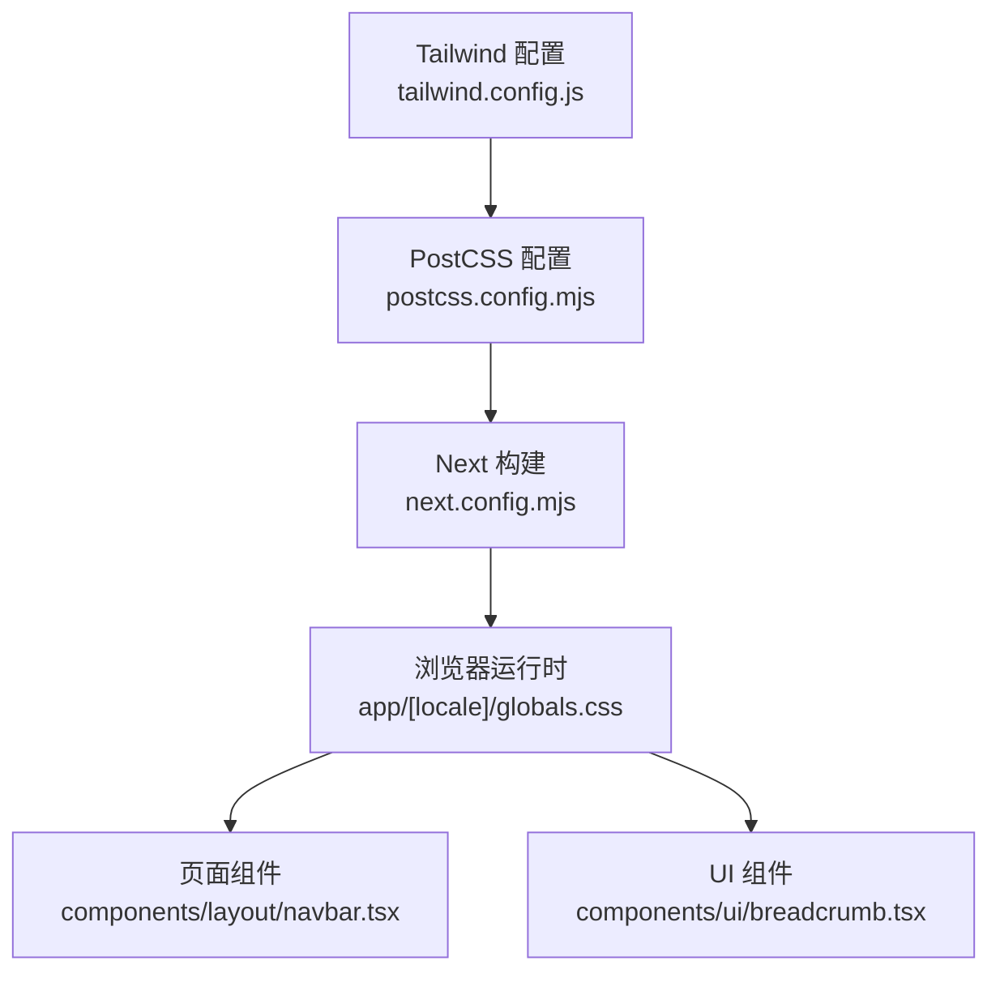
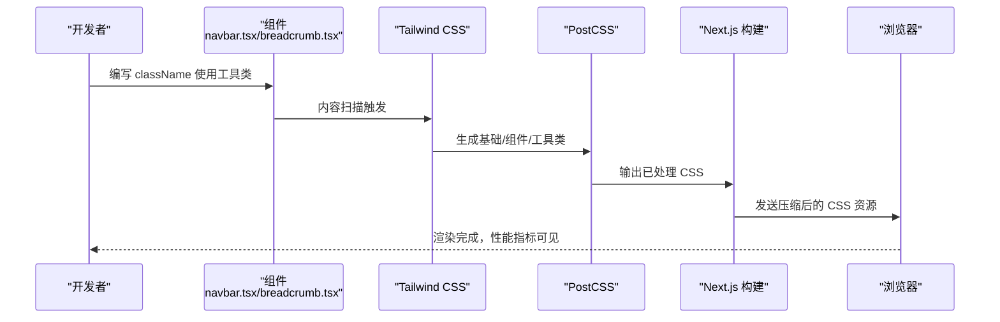
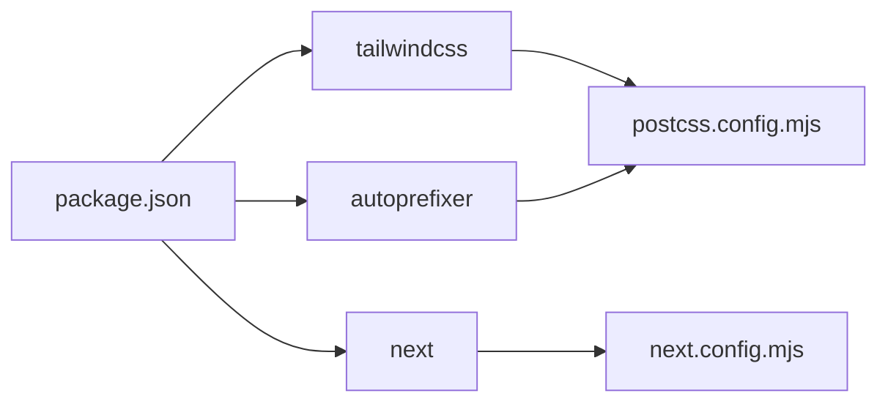

# CSS性能优化

<cite>
**本文引用的文件**
- [tailwind.config.js](file://tailwind.config.js)
- [postcss.config.mjs](file://postcss.config.mjs)
- [next.config.mjs](file://next.config.mjs)
- [package.json](file://package.json)
- [app/[locale]/globals.css](file://app/[locale]/globals.css)
- [components/layout/navbar.tsx](file://components/layout/navbar.tsx)
- [components/ui/breadcrumb.tsx](file://components/ui/breadcrumb.tsx)
- [vercel.json](file://vercel.json)
</cite>

## 目录
1. [引言](#引言)
2. [项目结构](#项目结构)
3. [核心组件](#核心组件)
4. [架构总览](#架构总览)
5. [详细组件分析](#详细组件分析)
6. [依赖分析](#依赖分析)
7. [性能考量](#性能考量)
8. [故障排查指南](#故障排查指南)
9. [结论](#结论)
10. [附录](#附录)

## 引言
本文件面向 GoPro Trade 网站的 CSS 性能优化，聚焦于 Tailwind CSS 配置与按需生成、PostCSS 插件链路、CSS 压缩与最小化、关键 CSS 提取与内联、样式模块化与作用域、渲染性能优化以及监控与分析工具的使用建议。文档基于仓库现有配置与源码进行梳理，旨在帮助开发者在不破坏现有功能的前提下，系统性地提升 CSS 的体积、加载与渲染效率。

## 项目结构
该 Next.js 项目采用 App Router 架构，CSS 由 Tailwind CSS 生成并经 PostCSS 处理，全局样式通过应用入口的全局样式文件统一注入。Tailwind 的内容扫描范围覆盖 app 与 components、lib 目录，确保仅生成实际使用的工具类；PostCSS 链路包含 Tailwind 与 Autoprefixer；Next.js 在构建阶段启用 gzip 压缩，并通过响应头策略对静态资源与字体进行长期缓存。

图表来源
- [tailwind.config.js:1-18](file://tailwind.config.js#L1-L18)
- [postcss.config.mjs:1-9](file://postcss.config.mjs#L1-L9)
- [next.config.mjs:1-65](file://next.config.mjs#L1-L65)
- [app/[locale]/globals.css:1-77](file://app/[locale]/globals.css#L1-L77)
- [components/layout/navbar.tsx:1-215](file://components/layout/navbar.tsx#L1-L215)
- [components/ui/breadcrumb.tsx:1-87](file://components/ui/breadcrumb.tsx#L1-L87)

章节来源
- [tailwind.config.js:1-18](file://tailwind.config.js#L1-L18)
- [postcss.config.mjs:1-9](file://postcss.config.mjs#L1-L9)
- [next.config.mjs:1-65](file://next.config.mjs#L1-L65)
- [app/[locale]/globals.css:1-77](file://app/[locale]/globals.css#L1-L77)

## 核心组件
- Tailwind CSS 配置：限定内容扫描范围、扩展品牌色板，避免生成冗余工具类，降低产物体积。
- PostCSS 链路：Tailwind 生成基础/组件/工具类，Autoprefixer 自动补全浏览器前缀，形成最终 CSS。
- 全局样式：集中声明 @layer base/components/utilities，注入品牌配色变量与性能优化规则（如滚动行为、字体栈、懒加载占位）。
- Next.js 构建与缓存：启用 gzip 压缩与长期缓存头，提升传输与复用效率。
- 组件层样式：通过 className 使用 Tailwind 工具类，结合 RTL/LTR 类名实现方向适配。

章节来源
- [tailwind.config.js:1-18](file://tailwind.config.js#L1-L18)
- [postcss.config.mjs:1-9](file://postcss.config.mjs#L1-L9)
- [app/[locale]/globals.css:1-77](file://app/[locale]/globals.css#L1-L77)
- [next.config.mjs:1-65](file://next.config.mjs#L1-L65)
- [components/layout/navbar.tsx:1-215](file://components/layout/navbar.tsx#L1-L215)
- [components/ui/breadcrumb.tsx:1-87](file://components/ui/breadcrumb.tsx#L1-L87)

## 架构总览
下图展示从源到产物的关键流程：组件使用 Tailwind 工具类 → Tailwind 解析内容扫描 → 生成 CSS → PostCSS 处理 → Next 构建与压缩 → 浏览器加载与渲染。

图表来源
- [components/layout/navbar.tsx:1-215](file://components/layout/navbar.tsx#L1-L215)
- [components/ui/breadcrumb.tsx:1-87](file://components/ui/breadcrumb.tsx#L1-L87)
- [tailwind.config.js:1-18](file://tailwind.config.js#L1-L18)
- [postcss.config.mjs:1-9](file://postcss.config.mjs#L1-L9)
- [next.config.mjs:1-65](file://next.config.mjs#L1-L65)

## 详细组件分析

### Tailwind CSS 配置优化
- 内容扫描范围：限定在 app、components、lib 目录，避免扫描 node_modules，显著减少分析与生成成本。
- 主题扩展：新增品牌色板，统一设计语言，减少重复自定义样式。
- 插件：当前未启用额外插件，保持默认生成路径，便于控制产物规模。

优化建议（概念性说明）
- 按需生成：继续沿用当前内容扫描策略，避免引入未使用的第三方库或模板导致扫描扩大。
- 工具类剔除：通过严格的内容扫描与命名规范，减少未命中工具类的产生。
- 自定义配置：在主题层面集中管理颜色、间距、字体等，避免在组件中散落重复定义。

章节来源
- [tailwind.config.js:1-18](file://tailwind.config.js#L1-L18)

### PostCSS 插件链与 CSS 最小化
- 插件链：Tailwind 与 Autoprefixer 组成核心链路，负责生成与兼容性处理。
- 最小化：Next.js 构建阶段自动压缩输出，配合 gzip 响应头进一步减小传输体积。
- 重复样式合并：由 Tailwind 与 PostCSS 合并重复选择器与规则，减少冗余。

优化建议（概念性说明）
- 生产环境最小化：确保在生产构建中开启 CSS 压缩与去重，避免开发模式的调试样式进入产物。
- 前缀策略：保持 Autoprefixer 默认策略，按需添加目标浏览器列表，避免过度前缀。

章节来源
- [postcss.config.mjs:1-9](file://postcss.config.mjs#L1-L9)
- [next.config.mjs:1-65](file://next.config.mjs#L1-L65)

### 关键 CSS 提取与内联策略
现状
- 全局样式在应用入口集中注入，所有基础/组件/工具类随页面加载。
- 未见专用关键 CSS 生成与内联逻辑。

优化建议（概念性说明）
- 首屏 CSS：识别首屏关键选择器，生成并内联关键 CSS，其余样式异步加载。
- 生成工具：可考虑使用自动化工具扫描首屏渲染所需规则，生成关键 CSS 片段。
- 异步加载：对非关键 CSS 使用<link rel="preload">或<link rel="modulepreload">提示优先级，或在首屏渲染后再加载。

章节来源
- [app/[locale]/globals.css:1-77](file://app/[locale]/globals.css#L1-L77)

### CSS 模块化与组件化优化
- 样式隔离：组件内部通过 className 使用 Tailwind 工具类，避免全局污染。
- 作用域 CSS：Tailwind 默认无 CSS Modules，但可通过命名约定与内容扫描范围实现“作用域”效果。
- 缓存策略：Next.js 对静态资源与字体设置长期缓存头，提升复用率。

章节来源
- [components/layout/navbar.tsx:1-215](file://components/layout/navbar.tsx#L1-L215)
- [components/ui/breadcrumb.tsx:1-87](file://components/ui/breadcrumb.tsx#L1-L87)
- [next.config.mjs:1-65](file://next.config.mjs#L1-L65)

### CSS 渲染性能优化
- 重排重绘优化：使用 transform、opacity 等属性触发布局与绘制分离，减少强制同步布局。
- GPU 加速：对高频动画元素启用硬件加速（如 translateZ(0) 或 will-change），降低主线程压力。
- 动画性能：使用 CSS 动画替代 JavaScript 动画，利用合成线程执行，保证帧率稳定。

章节来源
- [app/[locale]/globals.css:1-77](file://app/[locale]/globals.css#L1-L77)

### CSS 性能监控与分析
- 工具推荐：使用 Lighthouse、WebPageTest、Pagespeed Insights、Chrome DevTools Performance/Network 面板进行性能分析。
- 指标关注：关注 CSS 体积、解析时间、首次内容绘制（FCP）、累积布局偏移（CLS）等。
- 持续集成：在 CI 中加入性能回归检测，确保变更不会引入性能退化。

## 依赖分析
- Tailwind CSS：版本与 PostCSS 集成良好，确保与项目构建链路一致。
- Autoprefixer：保障跨浏览器兼容性，避免手动维护前缀。
- Next.js：内置压缩与缓存头配置，减少外部依赖。

图表来源
- [package.json:1-45](file://package.json#L1-L45)
- [postcss.config.mjs:1-9](file://postcss.config.mjs#L1-L9)
- [next.config.mjs:1-65](file://next.config.mjs#L1-L65)

章节来源
- [package.json:1-45](file://package.json#L1-L45)
- [postcss.config.mjs:1-9](file://postcss.config.mjs#L1-L9)
- [next.config.mjs:1-65](file://next.config.mjs#L1-L65)

## 性能考量
- 构建与传输
  - 启用 gzip 压缩，减少传输体积。
  - 对图片与字体设置长期缓存头，提升复用率。
- 运行时体验
  - 使用现代图片格式（AVIF/WebP）与懒加载策略，改善 LCP。
  - 通过字体栈与字体缓存头，降低字体加载阻塞。
- 样式体积
  - 严格的内容扫描范围与品牌色板集中管理，避免生成冗余工具类。
  - 利用 @layer 组织基础/组件/工具类，便于后续裁剪与优化。

章节来源
- [next.config.mjs:1-65](file://next.config.mjs#L1-L65)
- [app/[locale]/globals.css:1-77](file://app/[locale]/globals.css#L1-L77)
- [tailwind.config.js:1-18](file://tailwind.config.js#L1-L18)

## 故障排查指南
- Tailwind 未生成预期工具类
  - 检查内容扫描路径是否覆盖到对应组件与页面。
  - 确认工具类命名符合扫描规则，避免动态拼接导致未命中。
- CSS 体积异常增大
  - 排查是否引入了未使用的第三方库或模板。
  - 检查是否在组件中重复定义了相同样式。
- 浏览器兼容问题
  - 确认 Autoprefixer 配置与目标浏览器列表一致。
  - 使用 DevTools 检查缺失的前缀或属性。
- 首屏渲染缓慢
  - 使用 Lighthouse 分析关键渲染路径，评估是否需要关键 CSS 内联与异步加载策略。

章节来源
- [tailwind.config.js:1-18](file://tailwind.config.js#L1-L18)
- [postcss.config.mjs:1-9](file://postcss.config.mjs#L1-L9)
- [next.config.mjs:1-65](file://next.config.mjs#L1-L65)

## 结论
当前项目已具备良好的 CSS 性能基础：Tailwind 内容扫描范围明确、PostCSS 链路简洁、Next.js 构建与缓存策略完善。建议在现有基础上推进关键 CSS 内联与异步加载、持续监控性能指标，并在 CI 中引入回归检测，以获得更稳健的 CSS 性能表现。

## 附录
- 部署与安全头
  - Vercel 侧也设置了安全响应头，与 Next.js 侧形成互补，提升整体安全性与性能可观测性。

章节来源
- [vercel.json:1-44](file://vercel.json#L1-L44)