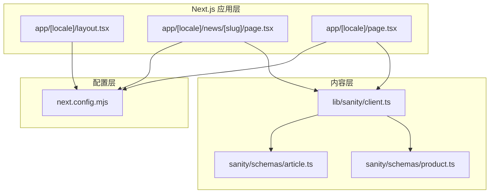
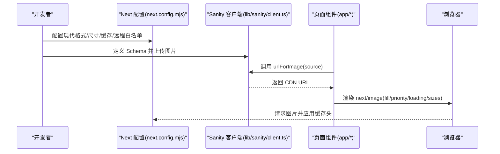
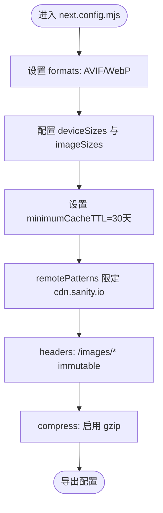
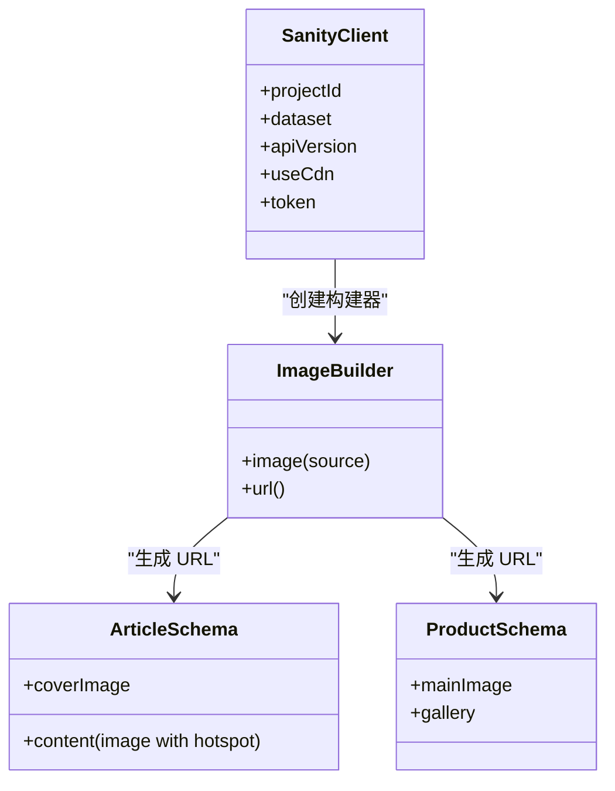
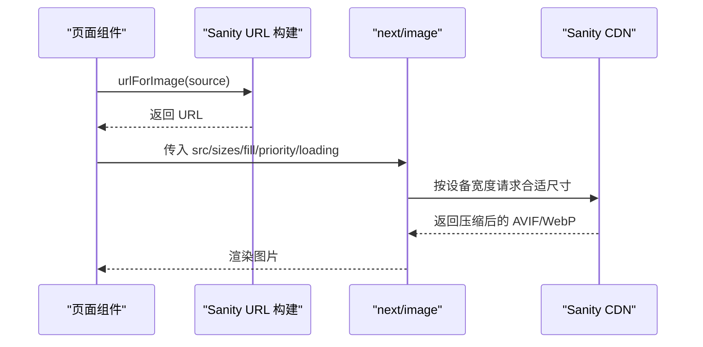
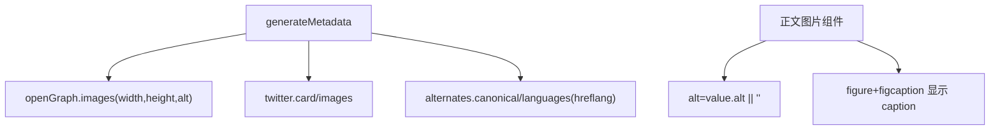
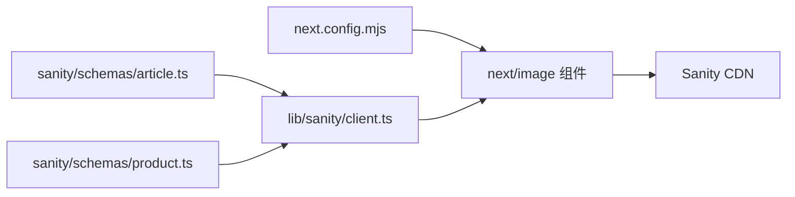

# 图片优化

<cite>
**本文引用的文件**
- [next.config.mjs](file://next.config.mjs)
- [app/[locale]/layout.tsx](file://app/[locale]/layout.tsx)
- [lib/sanity/client.ts](file://lib/sanity/client.ts)
- [app/[locale]/news/[slug]/page.tsx](file://app/[locale]/news/[slug]/page.tsx)
- [app/[locale]/page.tsx](file://app/[locale]/page.tsx)
- [sanity/schemas/article.ts](file://sanity/schemas/article.ts)
- [sanity/schemas/product.ts](file://sanity/schemas/product.ts)
</cite>

## 目录
1. [简介](#简介)
2. [项目结构](#项目结构)
3. [核心组件](#核心组件)
4. [架构总览](#架构总览)
5. [详细组件分析](#详细组件分析)
6. [依赖关系分析](#依赖关系分析)
7. [性能考量](#性能考量)
8. [故障排查指南](#故障排查指南)
9. [结论](#结论)
10. [附录](#附录)

## 简介
本文件系统化梳理 GoPro Trade 网站的图片优化方案，围绕以下目标展开：
- Next.js 图片优化配置：现代图片格式（AVIF/WebP）、设备尺寸适配、懒加载与缓存策略
- Sanity CDN 集成：远程图片模式、缓存控制、图片质量优化
- 响应式图片生成机制：不同分辨率图片的自动生成与选择逻辑
- 图片 SEO 优化：alt 标签生成、尺寸标注、加载性能优化
- 图片性能监控与最佳实践：加载时间与带宽优化的实施方案

## 项目结构
与图片优化相关的关键目录与文件：
- next.config.mjs：Next.js 图片优化与缓存头配置
- app/[locale]/layout.tsx：站点布局与元数据生成（包含 hreflang）
- lib/sanity/client.ts：Sanity 客户端与图片 URL 构建工具
- app/[locale]/news/[slug]/page.tsx：文章详情页使用 next/image 的示例
- app/[locale]/page.tsx：首页产品卡片使用 next/image 的示例
- sanity/schemas/article.ts：文章 Schema，定义封面图、正文图片字段
- sanity/schemas/product.ts：产品 Schema，定义主图、图集字段

图表来源
- [next.config.mjs:1-65](file://next.config.mjs#L1-L65)
- [app/[locale]/layout.tsx:1-71](file://app/[locale]/layout.tsx#L1-L71)
- [app/[locale]/news/[slug]/page.tsx:210-372](file://app/[locale]/news/[slug]/page.tsx#L210-L372)
- [app/[locale]/page.tsx:290-334](file://app/[locale]/page.tsx#L290-L334)
- [lib/sanity/client.ts:1-30](file://lib/sanity/client.ts#L1-L30)
- [sanity/schemas/article.ts:1-265](file://sanity/schemas/article.ts#L1-L265)
- [sanity/schemas/product.ts:1-233](file://sanity/schemas/product.ts#L1-L233)

章节来源
- [next.config.mjs:1-65](file://next.config.mjs#L1-L65)
- [app/[locale]/layout.tsx:1-71](file://app/[locale]/layout.tsx#L1-L71)
- [lib/sanity/client.ts:1-30](file://lib/sanity/client.ts#L1-L30)
- [app/[locale]/news/[slug]/page.tsx:210-372](file://app/[locale]/news/[slug]/page.tsx#L210-L372)
- [app/[locale]/page.tsx:290-334](file://app/[locale]/page.tsx#L290-L334)
- [sanity/schemas/article.ts:1-265](file://sanity/schemas/article.ts#L1-L265)
- [sanity/schemas/product.ts:1-233](file://sanity/schemas/product.ts#L1-L233)

## 核心组件
- Next.js 图片优化配置
  - 现代图片格式：AVIF、WebP
  - 设备尺寸集：移动端到桌面端的多档位
  - 图片尺寸集：小图标与内联图的多档位
  - 最小缓存时长：30 天
  - 远程图片白名单：仅允许 cdn.sanity.io
  - 静态图片长期缓存头：immutable
  - 启用 gzip 压缩
- Sanity 图片 URL 构建
  - 使用 @sanity/image-url 构造图片 URL
  - 通过 urlForImage(source) 输出最终 URL
  - 写入操作可选使用 token（生产环境注意权限）
- 页面级图片使用
  - 文章详情页：封面图使用 fill + priority；正文图片按需 alt
  - 首页产品卡片：首屏关键图片 priority + eager，其余 lazy

章节来源
- [next.config.mjs:4-17](file://next.config.mjs#L4-L17)
- [next.config.mjs:35-61](file://next.config.mjs#L35-L61)
- [lib/sanity/client.ts:20-30](file://lib/sanity/client.ts#L20-L30)
- [app/[locale]/news/[slug]/page.tsx:249-256](file://app/[locale]/news/[slug]/page.tsx#L249-L256)
- [app/[locale]/news/[slug]/page.tsx:276-281](file://app/[locale]/news/[slug]/page.tsx#L276-L281)
- [app/[locale]/page.tsx:296-305](file://app/[locale]/page.tsx#L296-L305)

## 架构总览
下图展示了“配置 → 内容 → 组件 → 浏览器”的图片优化链路。

图表来源
- [next.config.mjs:4-17](file://next.config.mjs#L4-L17)
- [next.config.mjs:35-61](file://next.config.mjs#L35-L61)
- [lib/sanity/client.ts:20-30](file://lib/sanity/client.ts#L20-L30)
- [app/[locale]/news/[slug]/page.tsx:249-256](file://app/[locale]/news/[slug]/page.tsx#L249-L256)
- [app/[locale]/page.tsx:296-305](file://app/[locale]/page.tsx#L296-L305)

## 详细组件分析

### Next.js 图片优化配置
- 现代图片格式
  - formats: ['image/avif', 'image/webp']，优先选择 AVIF，回退至 WebP
- 设备尺寸与图片尺寸
  - deviceSizes: 面向响应式与 srcset 的设备宽度集合
  - imageSizes: 面向小图标与内联图的固定尺寸集合
- 缓存策略
  - minimumCacheTTL: 30 天，降低重复请求
  - headers: 对 /images/* 设置 immutable 长期缓存
- 远程图片
  - remotePatterns: 仅允许 cdn.sanity.io，确保安全与可控
- 其他优化
  - compress: 启用 gzip 压缩
  - poweredByHeader: 隐藏 X-Powered-By，减少指纹暴露

图表来源
- [next.config.mjs:4-17](file://next.config.mjs#L4-L17)
- [next.config.mjs:35-61](file://next.config.mjs#L35-L61)

章节来源
- [next.config.mjs:4-17](file://next.config.mjs#L4-L17)
- [next.config.mjs:35-61](file://next.config.mjs#L35-L61)

### Sanity CDN 集成与图片 URL 生成
- 客户端初始化
  - createClient(projectId, dataset, apiVersion, useCdn=false)
  - useCdn=false 用于读取最新数据（写入可选 token）
- URL 构建
  - createImageUrlBuilder + urlFor(urlForImage) 生成最终 URL
- Schema 字段
  - 文章：coverImage、content 中的 image 类型（hotspot）
  - 产品：mainImage、gallery（hotspot）

图表来源
- [lib/sanity/client.ts:9-29](file://lib/sanity/client.ts#L9-L29)
- [sanity/schemas/article.ts:131-140](file://sanity/schemas/article.ts#L131-L140)
- [sanity/schemas/article.ts:68-129](file://sanity/schemas/article.ts#L68-L129)
- [sanity/schemas/product.ts:75-90](file://sanity/schemas/product.ts#L75-L90)

章节来源
- [lib/sanity/client.ts:1-30](file://lib/sanity/client.ts#L1-L30)
- [sanity/schemas/article.ts:1-265](file://sanity/schemas/article.ts#L1-L265)
- [sanity/schemas/product.ts:1-233](file://sanity/schemas/product.ts#L1-L233)

### 响应式图片生成与选择逻辑
- srcset 与 sizes
  - 首页产品卡片：sizes="(max-width: 768px) 100vw, (max-width: 1200px) 50vw, 25vw"
  - next/image 基于 deviceSizes 与 imageSizes 生成多尺寸资源
- 填充与裁剪
  - fill: 自动计算宽高比，配合 object-fit（如 object-cover）
  - hotspot：在 Sanity 中预设焦点，保证裁剪重点区域
- 优先级与懒加载
  - priority：关键视口图片优先加载（如首屏封面图）
  - loading="lazy"：非关键图片延迟加载

图表来源
- [app/[locale]/page.tsx:296-305](file://app/[locale]/page.tsx#L296-L305)
- [app/[locale]/news/[slug]/page.tsx:249-256](file://app/[locale]/news/[slug]/page.tsx#L249-L256)
- [app/[locale]/news/[slug]/page.tsx:276-281](file://app/[locale]/news/[slug]/page.tsx#L276-L281)
- [lib/sanity/client.ts:26-29](file://lib/sanity/client.ts#L26-L29)

章节来源
- [app/[locale]/page.tsx:290-334](file://app/[locale]/page.tsx#L290-L334)
- [app/[locale]/news/[slug]/page.tsx:210-372](file://app/[locale]/news/[slug]/page.tsx#L210-L372)
- [lib/sanity/client.ts:20-30](file://lib/sanity/client.ts#L20-L30)

### SEO 优化策略
- 元数据与 hreflang
  - LocaleLayout 生成 alternates.canonical 与 languages.hreflang
- Open Graph 与 Twitter 卡片
  - 产品详情页设置 openGraph.images.width/height/alt
- 图片 alt 与 caption
  - 文章封面图使用标题作为 alt
  - 正文图片优先使用 value.alt，否则为空字符串
  - 支持 figure + figcaption 展示 caption
- 结构化数据
  - 产品详情页生成结构化数据（略）

图表来源
- [app/[locale]/layout.tsx:15-31](file://app/[locale]/layout.tsx#L15-L31)
- [app/[locale]/products/[slug]/page.tsx:94-118](file://app/[locale]/products/[slug]/page.tsx#L94-L118)
- [app/[locale]/news/[slug]/page.tsx:252](file://app/[locale]/news/[slug]/page.tsx#L252)
- [app/[locale]/news/[slug]/page.tsx:278](file://app/[locale]/news/[slug]/page.tsx#L278)
- [app/[locale]/news/[slug]/page.tsx:283-288](file://app/[locale]/news/[slug]/page.tsx#L283-L288)

章节来源
- [app/[locale]/layout.tsx:15-31](file://app/[locale]/layout.tsx#L15-L31)
- [app/[locale]/products/[slug]/page.tsx:94-118](file://app/[locale]/products/[slug]/page.tsx#L94-L118)
- [app/[locale]/news/[slug]/page.tsx:210-372](file://app/[locale]/news/[slug]/page.tsx#L210-L372)

## 依赖关系分析
- 配置依赖
  - next.config.mjs 决定图片格式、尺寸集、缓存与远程域名白名单
  - headers 对 /images/* 设置 immutable，提升缓存命中率
- 内容依赖
  - 文章与产品 Schema 定义图片字段（coverImage/mainImage/gallery）
  - urlForImage 依赖 Sanity 项目 ID、数据集与 API 版本
- 组件依赖
  - 页面组件通过 next/image 使用 src、fill、priority、loading、sizes
  - 通过 urlForImage 生成 CDN URL

图表来源
- [next.config.mjs:4-17](file://next.config.mjs#L4-L17)
- [next.config.mjs:35-61](file://next.config.mjs#L35-L61)
- [lib/sanity/client.ts:1-30](file://lib/sanity/client.ts#L1-L30)
- [sanity/schemas/article.ts:1-265](file://sanity/schemas/article.ts#L1-L265)
- [sanity/schemas/product.ts:1-233](file://sanity/schemas/product.ts#L1-L233)

章节来源
- [next.config.mjs:1-65](file://next.config.mjs#L1-L65)
- [lib/sanity/client.ts:1-30](file://lib/sanity/client.ts#L1-L30)
- [sanity/schemas/article.ts:1-265](file://sanity/schemas/article.ts#L1-L265)
- [sanity/schemas/product.ts:1-233](file://sanity/schemas/product.ts#L1-L233)

## 性能考量
- 现代格式优先
  - AVIF/WebP 提升压缩率与画质，降低带宽占用
- srcset 与 sizes
  - 基于设备宽度与视口宽度生成合适尺寸，避免超大图片传输
- 缓存策略
  - minimumCacheTTL=30 天，headers.immutable 长期缓存 /images/*
  - 减少重复请求与服务器压力
- 懒加载与优先级
  - 首屏关键图片 priority + eager，其余 lazy，缩短首屏时间
- 压缩与安全
  - 启用 gzip，限制 remotePatterns 仅 cdn.sanity.io，避免跨域风险

章节来源
- [next.config.mjs:4-17](file://next.config.mjs#L4-L17)
- [next.config.mjs:35-61](file://next.config.mjs#L35-L61)
- [app/[locale]/page.tsx:296-305](file://app/[locale]/page.tsx#L296-L305)
- [app/[locale]/news/[slug]/page.tsx:249-256](file://app/[locale]/news/[slug]/page.tsx#L249-L256)

## 故障排查指南
- 图片无法显示
  - 检查 remotePatterns 是否包含 cdn.sanity.io
  - 确认 useCdn=false 或 CDN 可访问
- 图片模糊或过大
  - 检查 sizes 配置是否匹配布局断点
  - 确认 Sanity 图片尺寸是否足够
- 缓存问题
  - /images/* 是否返回 Cache-Control: immutable
  - minimumCacheTTL 是否生效
- SEO 异常
  - openGraph.images 是否包含 width/height/alt
  - hreflang 与 canonical 是否正确生成

章节来源
- [next.config.mjs:11-16](file://next.config.mjs#L11-L16)
- [next.config.mjs:39-42](file://next.config.mjs#L39-L42)
- [app/[locale]/products/[slug]/page.tsx:94-118](file://app/[locale]/products/[slug]/page.tsx#L94-L118)
- [app/[locale]/layout.tsx:15-31](file://app/[locale]/layout.tsx#L15-L31)

## 结论
本项目通过“Next.js 图片优化配置 + Sanity CDN + 页面级 next/image 使用”的组合，实现了现代格式优先、响应式尺寸生成、缓存与安全控制、以及 SEO 友好的图片策略。建议持续关注缓存命中率、加载性能指标，并结合实际业务对 sizes 与优先级进行微调。

## 附录
- 最佳实践清单
  - 为关键图片设置 priority 与合适的 sizes
  - 为正文图片提供 alt 与 caption
  - 使用 hotspot 精准裁剪，避免重要元素被截断
  - 定期评估 AVIF/WebP 压缩效果与兼容性
  - 监控 /images/* 的缓存命中与带宽消耗