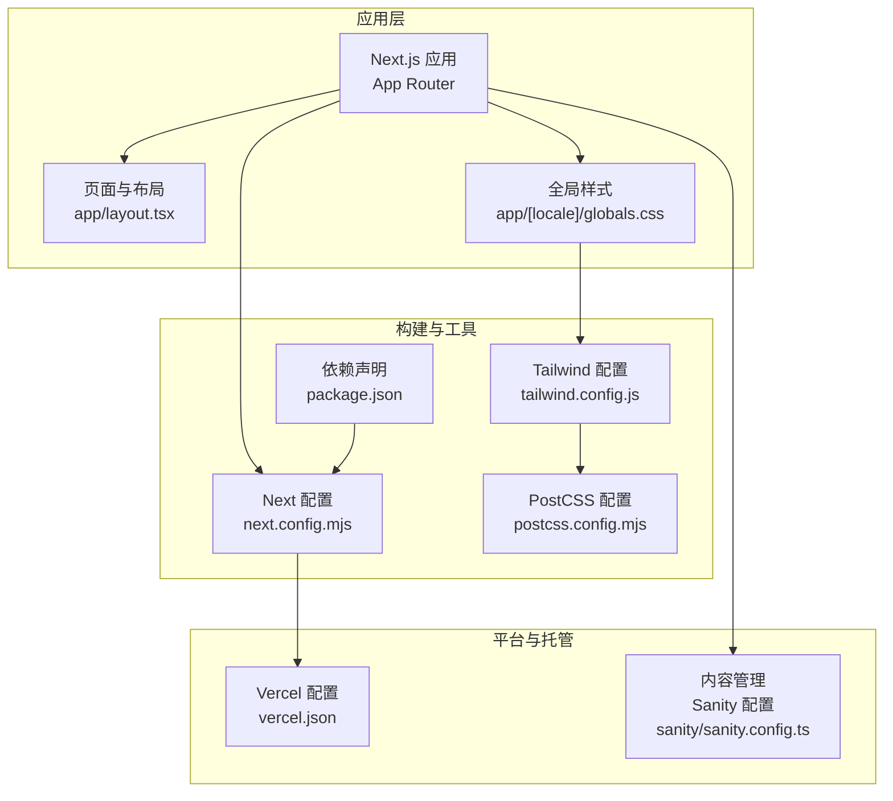
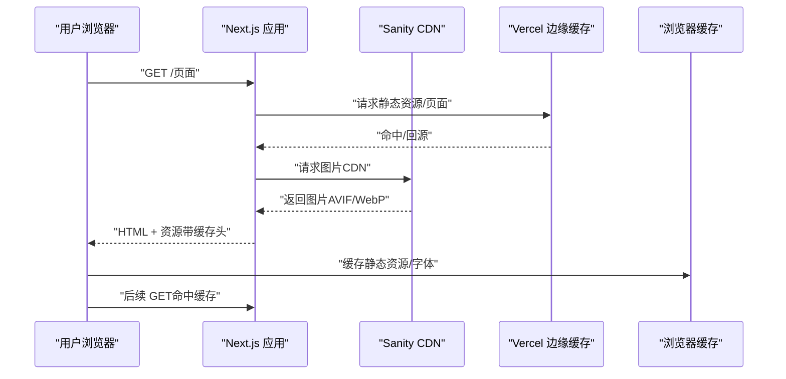
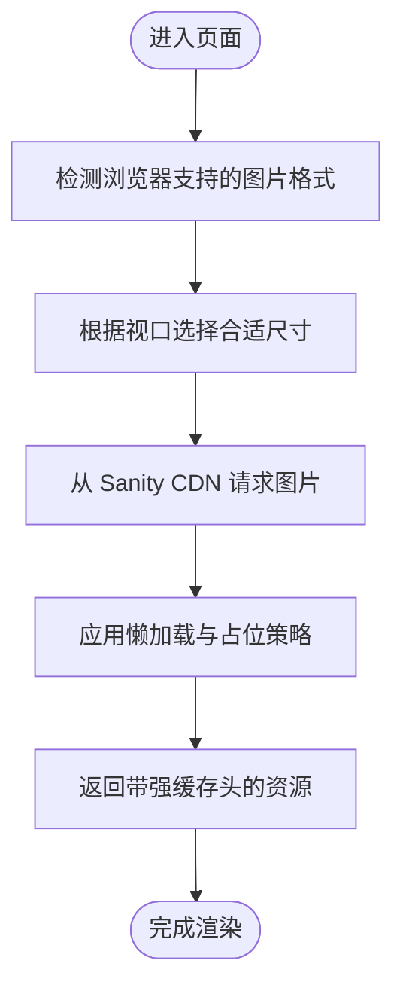
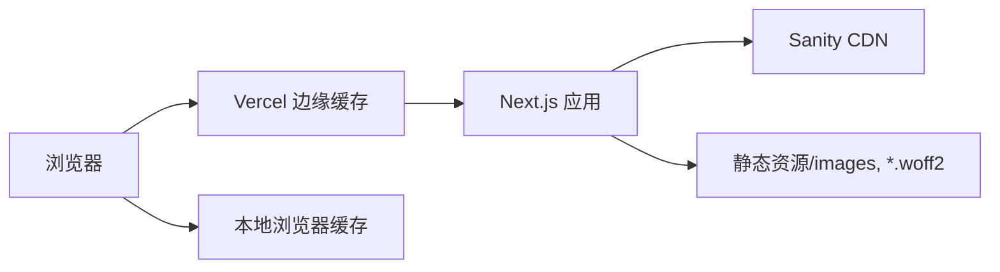
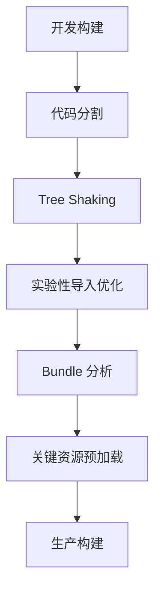
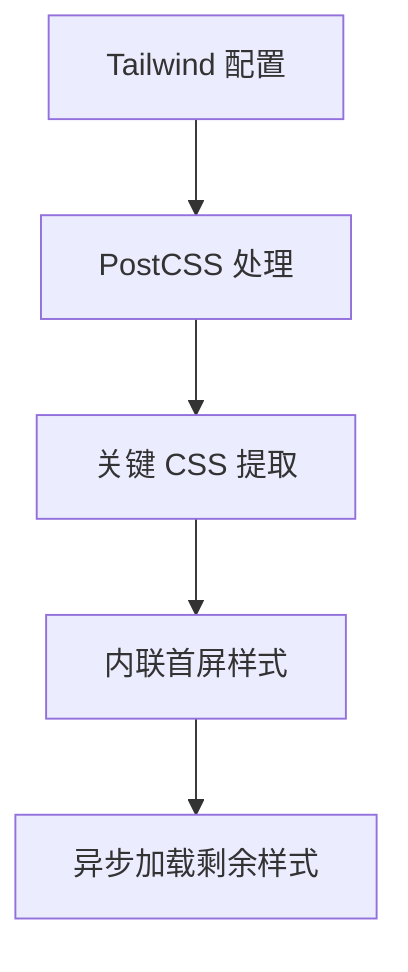
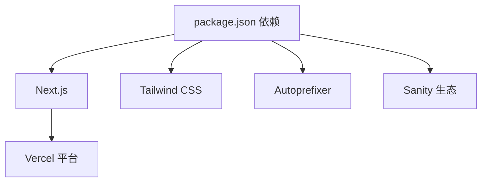

# 性能优化

<cite>
**本文引用的文件**
- [next.config.mjs](file://next.config.mjs)
- [tailwind.config.js](file://tailwind.config.js)
- [postcss.config.mjs](file://postcss.config.mjs)
- [package.json](file://package.json)
- [vercel.json](file://vercel.json)
- [app/layout.tsx](file://app/layout.tsx)
- [app/[locale]/globals.css](file://app/[locale]/globals.css)
- [sanity/sanity.config.ts](file://sanity/sanity.config.ts)
</cite>

## 目录
1. [简介](#简介)
2. [项目结构](#项目结构)
3. [核心组件](#核心组件)
4. [架构总览](#架构总览)
5. [详细组件分析](#详细组件分析)
6. [依赖分析](#依赖分析)
7. [性能考量](#性能考量)
8. [故障排查指南](#故障排查指南)
9. [结论](#结论)
10. [附录](#附录)

## 简介
本文件面向 GoPro Trade 网站的性能优化，围绕图片优化（Sanity CDN 集成、响应式图片、懒加载、现代图片格式）、缓存策略（浏览器缓存、CDN 缓存、API 缓存、静态资源缓存）、构建优化（代码分割、Tree Shaking、Bundle 分析、预加载策略）、CSS 优化（Tailwind 配置、CSS 压缩、关键 CSS 提取）、性能监控与分析（Lighthouse 报告、Core Web Vitals 监控、性能指标跟踪）、移动端与离线策略、性能测试与基准测试方法论进行系统化梳理，并结合仓库现有配置给出可落地的建议与改进方向。

## 项目结构
该 Next.js 项目采用 App Router 结构，前端样式通过 Tailwind CSS + PostCSS 构建，图片与缓存由 Next.js 配置与 Vercel 平台共同控制，内容管理通过 Sanity 驱动。

图示来源
- [next.config.mjs:1-65](file://next.config.mjs#L1-L65)
- [tailwind.config.js:1-18](file://tailwind.config.js#L1-L18)
- [postcss.config.mjs:1-9](file://postcss.config.mjs#L1-L9)
- [package.json:1-45](file://package.json#L1-L45)
- [vercel.json:1-44](file://vercel.json#L1-L44)
- [app/layout.tsx:1-19](file://app/layout.tsx#L1-L19)
- [app/[locale]/globals.css:1-77](file://app/[locale]/globals.css#L1-L77)
- [sanity/sanity.config.ts:1-33](file://sanity/sanity.config.ts#L1-L33)

章节来源
- [next.config.mjs:1-65](file://next.config.mjs#L1-L65)
- [tailwind.config.js:1-18](file://tailwind.config.js#L1-L18)
- [postcss.config.mjs:1-9](file://postcss.config.mjs#L1-L9)
- [package.json:1-45](file://package.json#L1-L45)
- [vercel.json:1-44](file://vercel.json#L1-L44)
- [app/layout.tsx:1-19](file://app/layout.tsx#L1-L19)
- [app/[locale]/globals.css:1-77](file://app/[locale]/globals.css#L1-L77)
- [sanity/sanity.config.ts:1-33](file://sanity/sanity.config.ts#L1-L33)

## 核心组件
- 图片与缓存配置：Next.js 图片优化、现代图片格式、CDN 远程模式、响应式尺寸、最小缓存时长；同时通过 headers 设置静态资源与字体的长期缓存与安全头。
- 样式体系：Tailwind + PostCSS，content 范围明确，主题扩展颜色，自动前缀。
- 构建与打包：Next.js 内置的 Tree Shaking、代码分割、实验性优化导入；Vercel 平台侧的构建命令与安全头。
- 内容来源：Sanity 驱动，支持 CDN 加速与图片处理能力。

章节来源
- [next.config.mjs:1-65](file://next.config.mjs#L1-L65)
- [tailwind.config.js:1-18](file://tailwind.config.js#L1-L18)
- [postcss.config.mjs:1-9](file://postcss.config.mjs#L1-L9)
- [package.json:1-45](file://package.json#L1-L45)
- [vercel.json:1-44](file://vercel.json#L1-L44)
- [sanity/sanity.config.ts:1-33](file://sanity/sanity.config.ts#L1-L33)

## 架构总览
下图展示从用户请求到页面渲染的关键路径，涵盖图片加载、缓存策略、CDN 与安全头设置：

图示来源
- [next.config.mjs:34-61](file://next.config.mjs#L34-L61)
- [vercel.json:1-44](file://vercel.json#L1-L44)
- [sanity/sanity.config.ts:1-33](file://sanity/sanity.config.ts#L1-L33)

## 详细组件分析

### 图片优化与 CDN 集成
- 现代图片格式：开启 AVIF 与 WebP，提升传输效率与 Core Web Vitals 指标。
- 响应式尺寸：定义 deviceSizes 与 imageSizes，配合 Next/Image 使用合适分辨率。
- CDN 远程模式：允许从 https://cdn.sanity.io 加载图片，确保图片处理与分发由 Sanity CDN 承担。
- 懒加载与缓存：通过 content-visibility 与 minimumCacheTTL 实现懒加载与较长缓存周期。
- 安全与缓存头：对 /images 与字体文件设置长期缓存与 immutable 标记，降低带宽与延迟。

图示来源
- [next.config.mjs:4-17](file://next.config.mjs#L4-L17)
- [app/[locale]/globals.css:29-33](file://app/[locale]/globals.css#L29-L33)

章节来源
- [next.config.mjs:4-17](file://next.config.mjs#L4-L17)
- [app/[locale]/globals.css:29-33](file://app/[locale]/globals.css#L29-L33)

### 缓存策略（多层级）
- 浏览器缓存：对 /images 与字体设置 long-term immutable 缓存，显著降低重复访问成本。
- CDN 缓存：Vercel 边缘节点缓存页面与静态资源，减少回源压力。
- API 缓存：当前未见显式 API 缓存配置，建议对不频繁变动的数据接口增加 Cache-Control 或边缘缓存策略。
- 静态资源缓存：通过 headers 对特定路径设置强缓存与版本化策略。

图示来源
- [next.config.mjs:34-61](file://next.config.mjs#L34-L61)
- [vercel.json:1-44](file://vercel.json#L1-L44)

章节来源
- [next.config.mjs:34-61](file://next.config.mjs#L34-L61)
- [vercel.json:1-44](file://vercel.json#L1-L44)

### 构建优化
- 代码分割与 Tree Shaking：Next.js 默认启用，按路由与动态导入自动拆分包。
- 实验性优化：optimizePackageImports 对 lucide-react 与 @sanity/client 进行按需导入优化。
- Bundle 分析：建议使用 next bundle-analyzer 或第三方工具进行体积分析与热点定位。
- 预加载策略：对关键路由与首屏资源使用 next/link 的 prefetch 与 rel="preload" 策略（需在页面中手动配置）。

图示来源
- [next.config.mjs:28-32](file://next.config.mjs#L28-L32)
- [package.json:1-45](file://package.json#L1-L45)

章节来源
- [next.config.mjs:28-32](file://next.config.mjs#L28-L32)
- [package.json:1-45](file://package.json#L1-L45)

### CSS 优化
- Tailwind 配置：content 覆盖 app 与 components、lib 目录，确保按需生成样式；主题扩展品牌色。
- PostCSS：启用 tailwindcss 与 autoprefixer，自动前缀与最小化。
- 关键 CSS 提取：建议对首屏关键 CSS 进行内联，其余样式异步加载；可通过自定义 Document 或插件实现。
- 全局样式优化：使用 content-visibility 与 aspect-ratio 工具类减少布局抖动与重排。

图示来源
- [tailwind.config.js:1-18](file://tailwind.config.js#L1-L18)
- [postcss.config.mjs:1-9](file://postcss.config.mjs#L1-L9)
- [app/[locale]/globals.css:1-77](file://app/[locale]/globals.css#L1-L77)

章节来源
- [tailwind.config.js:1-18](file://tailwind.config.js#L1-L18)
- [postcss.config.mjs:1-9](file://postcss.config.mjs#L1-L9)
- [app/[locale]/globals.css:1-77](file://app/[locale]/globals.css#L1-L77)

### 性能监控与分析
- Lighthouse 报告：定期运行 Lighthouse（CI/本地），关注 Largest Contentful Paint、Cumulative Layout Shift、First Input Delay 等指标。
- Core Web Vitals 监控：在生产环境集成 Web Vitals 上报（如使用 @web-vitals/reporter 或自定义埋点）。
- 性能指标跟踪：记录 TTFB、FCP、LCP、CLS、INP 等，建立基线与阈值告警。
- 日志与追踪：结合浏览器性能面板与网络面板，定位阻塞资源与慢加载脚本。

（本节为通用实践说明，无需具体文件引用）

### 移动端性能优化与离线策略
- 移动端优化：优先使用 WebP/AVIF；合理设置图片尺寸与 DPR；减少主线程工作；启用服务端渲染与静态生成。
- 离线策略：基于 Workbox 或 Next.js App Router 的 offline fallback，结合 Service Worker 缓存关键资源与页面骨架。

（本节为通用实践说明，无需具体文件引用）

## 依赖分析
- Next.js 版本与生态：使用较新版本，具备内置性能优化能力。
- 样式与工具链：Tailwind + PostCSS，满足按需生成与自动前缀需求。
- 内容系统：Sanity 提供 CDN 与图片处理能力，需在 Next 配置中允许远程图片来源。

图示来源
- [package.json:1-45](file://package.json#L1-L45)
- [next.config.mjs:1-65](file://next.config.mjs#L1-L65)
- [vercel.json:1-44](file://vercel.json#L1-L44)

章节来源
- [package.json:1-45](file://package.json#L1-L45)
- [next.config.mjs:1-65](file://next.config.mjs#L1-L65)
- [vercel.json:1-44](file://vercel.json#L1-L44)

## 性能考量
- 图片：继续完善响应式与懒加载策略，确保占位与尺寸计算一致；对首屏关键图片考虑内联或预加载。
- 缓存：对 API 接口增加合理的缓存策略；利用 ETag/Last-Modified 与边缘缓存协同。
- 构建：持续进行 Bundle 分析，识别大体积依赖与重复模块；按需引入第三方库。
- 样式：对非关键样式进行异步加载；避免全局样式爆炸。
- 监控：建立自动化性能监控与回归告警，持续跟踪 Core Web Vitals。

（本节为通用实践说明，无需具体文件引用）

## 故障排查指南
- 图片无法加载或跨域问题：检查 remotePatterns 是否包含 cdn.sanity.io；确认图片 URL 与 Sanity 项目 ID/数据集一致。
- 缓存不生效：核对 headers 中对 /images 与字体的缓存头是否正确下发；确认浏览器缓存策略与 Vercel 边缘缓存状态。
- 样式异常：检查 Tailwind content 路径是否覆盖到实际使用的组件；确认 PostCSS 插件顺序与版本兼容。
- 安全头冲突：next.config.mjs 与 vercel.json 的安全头可能重复，建议统一在一处维护，避免冲突。

章节来源
- [next.config.mjs:11-17](file://next.config.mjs#L11-L17)
- [next.config.mjs:34-61](file://next.config.mjs#L34-L61)
- [vercel.json:8-26](file://vercel.json#L8-L26)
- [tailwind.config.js:3-7](file://tailwind.config.js#L3-L7)
- [postcss.config.mjs:1-9](file://postcss.config.mjs#L1-L9)

## 结论
本项目已在图片格式、响应式尺寸、懒加载、长期缓存与安全头方面形成较为完善的性能基础。建议进一步完善 API 缓存策略、关键 CSS 提取、Bundle 分析与预加载配置，并建立持续的性能监控与回归告警机制，以全面提升 Core Web Vitals 与用户体验。

## 附录
- 性能测试与基准测试方法论
  - 基准测试：固定硬件与网络条件，使用 Lighthouse、WebPageTest、Pagespeed Insights 等工具进行对比。
  - 回归测试：在 CI 中集成性能阈值检查，对关键指标设置上限与告警。
  - A/B 实验：对不同缓存策略、图片格式、预加载方案进行对照实验，量化收益。
- 性能瓶颈识别
  - 使用浏览器性能面板定位长任务与阻塞资源；结合网络面板识别慢加载与重复请求；通过 Core Web Vitals 数据识别真实用户痛点。

（本节为通用实践说明，无需具体文件引用）