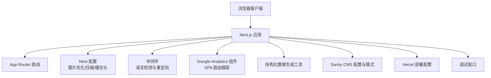
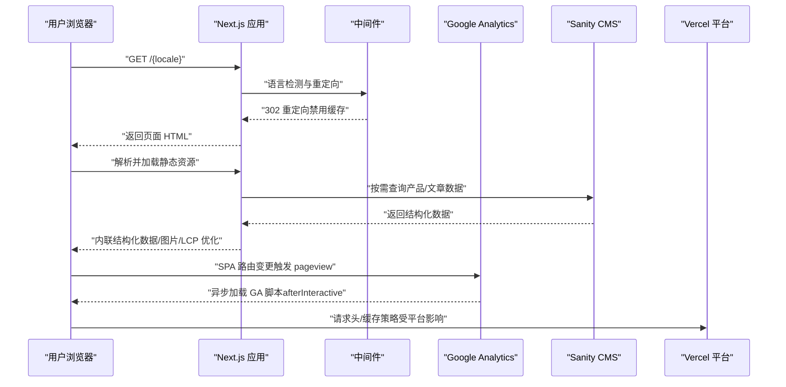
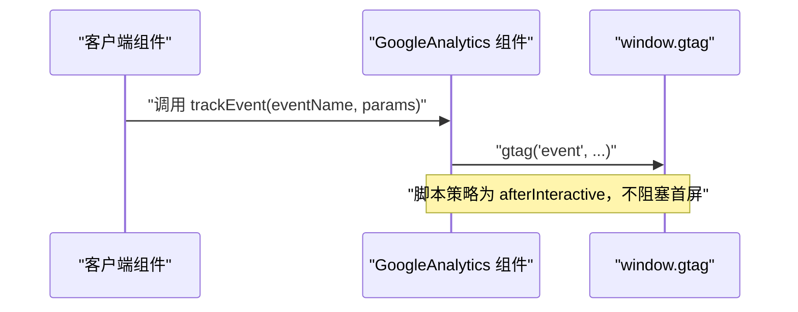
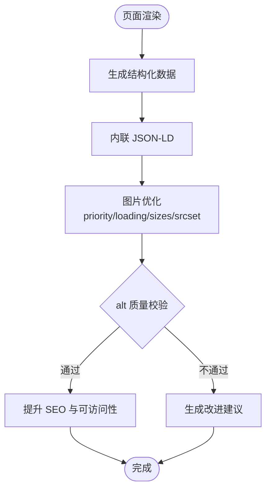
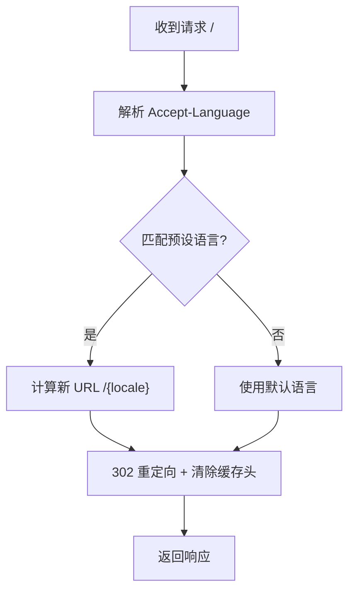
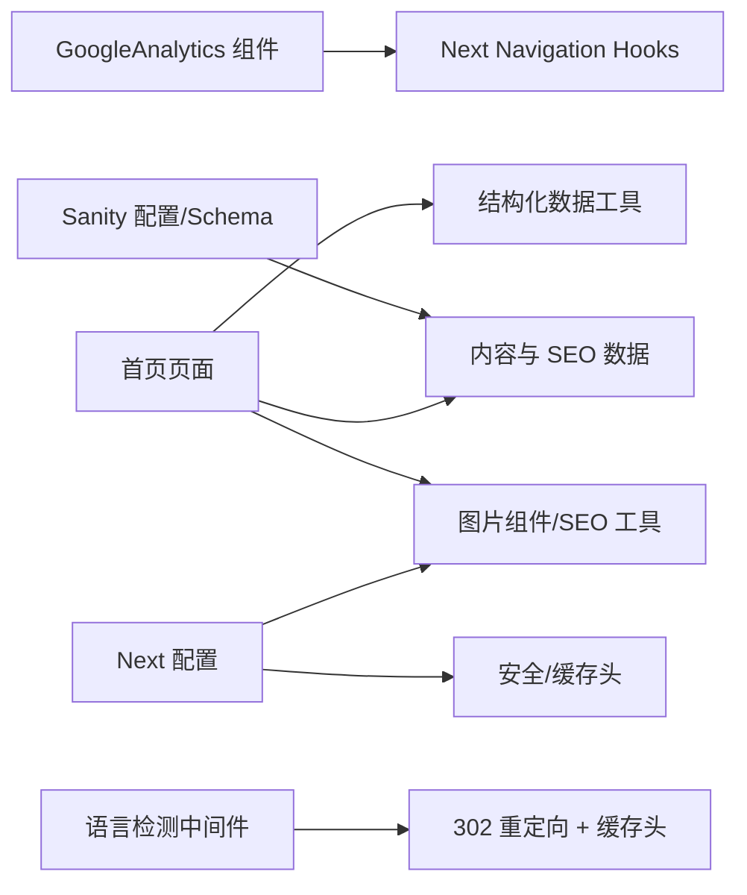

# 性能监控

<cite>
**本文引用的文件**
- [package.json](file://package.json)
- [next.config.mjs](file://next.config.mjs)
- [middleware.ts](file://middleware.ts)
- [app/layout.tsx](file://app/layout.tsx)
- [components/analytics/GoogleAnalytics.tsx](file://components/analytics/GoogleAnalytics.tsx)
- [lib/utils/structured-data.ts](file://lib/utils/structured-data.ts)
- [lib/utils/image-seo.ts](file://lib/utils/image-seo.ts)
- [app/[locale]/page.tsx](file://app/[locale]/page.tsx)
- [app/api/debug/route.ts](file://app/api/debug/route.ts)
- [vercel.json](file://vercel.json)
- [sanity/sanity.config.ts](file://sanity/sanity.config.ts)
- [sanity/schemas/article.ts](file://sanity/schemas/article.ts)
</cite>

## 目录
1. [简介](#简介)
2. [项目结构](#项目结构)
3. [核心组件](#核心组件)
4. [架构总览](#架构总览)
5. [详细组件分析](#详细组件分析)
6. [依赖关系分析](#依赖关系分析)
7. [性能考量](#性能考量)
8. [故障排查指南](#故障排查指南)
9. [结论](#结论)
10. [附录](#附录)

## 简介
本文件面向 GoPro Trade 网站的性能监控与优化，围绕以下目标展开：
- 性能指标监控体系：Core Web Vitals（LCP、FID、CLS）、页面加载时间、资源加载性能等
- 性能测试与基准：Lighthouse 自动化、PageSpeed Insights、手动测试
- 瓶颈识别与诊断：Chrome DevTools、性能分析、网络面板
- 实时监控：数据采集、异常告警、趋势分析
- 效果评估：A/B 测试、性能回归检测、用户体验指标
- 排查与解决：实践指南与最佳实践

## 项目结构
该 Next.js 应用采用 App Router，按功能分层组织，核心性能相关配置集中在构建与运行时配置中：
- 构建与运行时优化：Next 配置、Vercel 部署配置
- 客户端埋点与路由跟踪：Google Analytics 组件
- 内容与结构化数据：Sanity CMS 与结构化数据生成工具
- 国际化与语言检测中间件：根路径语言重定向
- 调试接口：输出请求头与上下文信息

图表来源
- [next.config.mjs:1-65](file://next.config.mjs#L1-L65)
- [middleware.ts:1-68](file://middleware.ts#L1-L68)
- [components/analytics/GoogleAnalytics.tsx:1-93](file://components/analytics/GoogleAnalytics.tsx#L1-L93)
- [lib/utils/structured-data.ts:1-383](file://lib/utils/structured-data.ts#L1-L383)
- [sanity/sanity.config.ts:1-33](file://sanity/sanity.config.ts#L1-L33)
- [vercel.json:1-44](file://vercel.json#L1-L44)
- [app/api/debug/route.ts:1-16](file://app/api/debug/route.ts#L1-L16)

章节来源
- [package.json:1-45](file://package.json#L1-L45)
- [next.config.mjs:1-65](file://next.config.mjs#L1-L65)
- [middleware.ts:1-68](file://middleware.ts#L1-L68)
- [vercel.json:1-44](file://vercel.json#L1-L44)

## 核心组件
- Next.js 构建与运行时优化：图片格式与尺寸、缓存策略、压缩、安全响应头、包导入优化
- Google Analytics：GA4 脚本加载策略、SPA 路由跟踪、自定义事件
- 结构化数据与图片 SEO：产品/组织/网站/FAQ/本地业务等 Schema 生成，图片 srcset 与 alt 质量校验
- 语言检测中间件：根路径语言识别与 302 重定向（禁用缓存）
- 调试接口：输出请求头、路径、时间戳，辅助定位网络与缓存问题

章节来源
- [next.config.mjs:1-65](file://next.config.mjs#L1-L65)
- [components/analytics/GoogleAnalytics.tsx:1-93](file://components/analytics/GoogleAnalytics.tsx#L1-L93)
- [lib/utils/structured-data.ts:1-383](file://lib/utils/structured-data.ts#L1-L383)
- [lib/utils/image-seo.ts:1-150](file://lib/utils/image-seo.ts#L1-L150)
- [middleware.ts:1-68](file://middleware.ts#L1-L68)
- [app/api/debug/route.ts:1-16](file://app/api/debug/route.ts#L1-L16)

## 架构总览
下图展示了性能相关的关键交互：客户端加载、Next.js 运行时优化、GA 事件上报、结构化数据注入、CMS 数据获取与缓存控制。

图表来源
- [middleware.ts:44-63](file://middleware.ts#L44-L63)
- [components/analytics/GoogleAnalytics.tsx:37-68](file://components/analytics/GoogleAnalytics.tsx#L37-L68)
- [lib/utils/structured-data.ts:25-99](file://lib/utils/structured-data.ts#L25-L99)
- [sanity/sanity.config.ts:11-21](file://sanity/sanity.config.ts#L11-L21)
- [vercel.json:8-26](file://vercel.json#L8-L26)

## 详细组件分析

### Next.js 构建与运行时优化
- 图片优化：支持现代格式（AVIF/WebP）、设备尺寸与图片尺寸集合、远程图片域名白名单、图片最小缓存期
- 压缩：开启 gzip 压缩
- 安全与缓存头：隐藏 X-Powered-By、设置安全响应头、静态资源与字体长期缓存
- 包导入优化：实验性优化特定包导入
- 适用指标：LCP（首屏图片优化）、CLS（布局稳定）、TTI/FCP（压缩与缓存）

章节来源
- [next.config.mjs:4-17](file://next.config.mjs#L4-L17)
- [next.config.mjs:22-32](file://next.config.mjs#L22-L32)
- [next.config.mjs:35-61](file://next.config.mjs#L35-L61)

### Google Analytics（GA4）集成与 SPA 路由跟踪
- 脚本加载策略：afterInteractive，避免阻塞首屏
- 路由跟踪：基于 usePathname/useSearchParams 的 SPA pageview 上报
- 自定义事件：trackEvent 工具函数，便于转化追踪
- 合规：匿名化 IP、隐私保护

图表来源
- [components/analytics/GoogleAnalytics.tsx:37-68](file://components/analytics/GoogleAnalytics.tsx#L37-L68)
- [components/analytics/GoogleAnalytics.tsx:78-84](file://components/analytics/GoogleAnalytics.tsx#L78-L84)

章节来源
- [components/analytics/GoogleAnalytics.tsx:1-93](file://components/analytics/GoogleAnalytics.tsx#L1-L93)

### 结构化数据与图片 SEO
- 产品/组织/网站/FAQ/本地业务/视频/文章等 Schema 生成，提升 AI 搜索与 SERP 表现
- 图片 SEO：srcset 生成、alt 文本质量评分、图片结构化数据
- 适用指标：LCP（首屏图片优先加载）、CLS（图片尺寸与占位）、SEO 相关的 UX 指标

图表来源
- [lib/utils/structured-data.ts:25-99](file://lib/utils/structured-data.ts#L25-L99)
- [lib/utils/image-seo.ts:95-100](file://lib/utils/image-seo.ts#L95-L100)
- [lib/utils/image-seo.ts:106-149](file://lib/utils/image-seo.ts#L106-L149)

章节来源
- [lib/utils/structured-data.ts:1-383](file://lib/utils/structured-data.ts#L1-L383)
- [lib/utils/image-seo.ts:1-150](file://lib/utils/image-seo.ts#L1-L150)

### 语言检测中间件与缓存控制
- 根路径语言检测：解析 Accept-Language，匹配预设语言映射
- 重定向：302 临时重定向，设置 no-store/no-cache/must-revalidate
- 适用指标：首次访问体验（减少不必要的缓存与重定向）

图表来源
- [middleware.ts:21-42](file://middleware.ts#L21-L42)
- [middleware.ts:44-63](file://middleware.ts#L44-L63)

章节来源
- [middleware.ts:1-68](file://middleware.ts#L1-L68)

### 调试接口与部署配置
- 调试接口：输出请求头、路径、时间戳，辅助排查缓存与网络问题
- Vercel 配置：安全头、重写 sitemap、Cron 调度

章节来源
- [app/api/debug/route.ts:1-16](file://app/api/debug/route.ts#L1-L16)
- [vercel.json:8-26](file://vercel.json#L8-L26)
- [vercel.json:33-42](file://vercel.json#L33-L42)

## 依赖关系分析
- 组件耦合
  - GoogleAnalytics 与 Next Navigation Hook（usePathname/useSearchParams）耦合，用于 SPA 路由跟踪
  - 结构化数据工具与页面渲染强耦合，内联 JSON-LD 提升 SEO 与可访问性
  - 中间件与语言检测配置耦合，影响根路径首屏体验
- 外部依赖
  - Next.js 图片优化与 CDN 缓存策略影响 LCP/CLS
  - Vercel 安全头与缓存策略影响整体性能与安全性
  - Sanity CMS 提供内容与 SEO 数据，影响页面渲染与结构化数据

图表来源
- [components/analytics/GoogleAnalytics.tsx:12-26](file://components/analytics/GoogleAnalytics.tsx#L12-L26)
- [lib/utils/structured-data.ts:25-99](file://lib/utils/structured-data.ts#L25-L99)
- [lib/utils/image-seo.ts:95-100](file://lib/utils/image-seo.ts#L95-L100)
- [middleware.ts:44-63](file://middleware.ts#L44-L63)
- [next.config.mjs:4-17](file://next.config.mjs#L4-L17)
- [next.config.mjs:35-61](file://next.config.mjs#L35-L61)
- [sanity/sanity.config.ts:11-21](file://sanity/sanity.config.ts#L11-L21)

章节来源
- [components/analytics/GoogleAnalytics.tsx:1-93](file://components/analytics/GoogleAnalytics.tsx#L1-L93)
- [lib/utils/structured-data.ts:1-383](file://lib/utils/structured-data.ts#L1-L383)
- [lib/utils/image-seo.ts:1-150](file://lib/utils/image-seo.ts#L1-L150)
- [middleware.ts:1-68](file://middleware.ts#L1-L68)
- [next.config.mjs:1-65](file://next.config.mjs#L1-L65)
- [sanity/sanity.config.ts:1-33](file://sanity/sanity.config.ts#L1-L33)

## 性能考量
- Core Web Vitals
  - LCP：优先加载首屏图片（priority/eager）、现代图片格式（AVIF/WebP）、合理 sizes 与 srcset
  - FID：脚本加载策略 afterInteractive、减少首屏 JS 体积、启用压缩
  - CLS：图片尺寸占位、避免动态插入大元素、结构化数据内联减少布局抖动
- 页面加载时间
  - 长期缓存静态资源与字体、隐藏 X-Powered-By、安全头减少指纹暴露
  - ISR/revalidate 策略（示例：首页 revalidate=3600）平衡新鲜度与缓存命中
- 资源加载性能
  - 图片懒加载与优先级、设备尺寸集合、远程图片域名白名单
  - 包导入优化与 gzip 压缩
- SEO 与 UX 指标
  - 结构化数据内联、图片 alt 质量校验、srcset 生成
  - 语言检测中间件减少无效重定向与缓存污染

章节来源
- [next.config.mjs:4-17](file://next.config.mjs#L4-L17)
- [next.config.mjs:22-32](file://next.config.mjs#L22-L32)
- [next.config.mjs:35-61](file://next.config.mjs#L35-L61)
- [app/[locale]/page.tsx:300-305](file://app/[locale]/page.tsx#L300-L305)
- [lib/utils/image-seo.ts:95-100](file://lib/utils/image-seo.ts#L95-L100)
- [lib/utils/image-seo.ts:106-149](file://lib/utils/image-seo.ts#L106-L149)
- [middleware.ts:56-60](file://middleware.ts#L56-L60)
- [app/[locale]/page.tsx:149-150](file://app/[locale]/page.tsx#L149-L150)

## 故障排查指南
- 缓存与重定向问题
  - 使用调试接口查看请求头与路径，确认缓存控制是否生效
  - 根路径语言检测中间件设置 no-store/no-cache/must-revalidate，避免缓存污染
- 图片加载与 LCP 异常
  - 检查图片是否使用 priority/eager、sizes 与 srcset 是否合理
  - 确认现代图片格式可用且缓存头正确
- GA 事件未上报
  - 确认 NEXT_PUBLIC_GA_ID 已配置，脚本策略为 afterInteractive
  - SPA 路由变更是否触发 pageview（Suspense 包裹）
- 结构化数据缺失
  - 确认页面内联 JSON-LD 是否存在，字段是否完整
- 部署与安全头
  - 查看 Vercel 安全头与重写规则，确认 sitemap 重写与 Cron 调度

章节来源
- [app/api/debug/route.ts:1-16](file://app/api/debug/route.ts#L1-L16)
- [middleware.ts:56-60](file://middleware.ts#L56-L60)
- [app/[locale]/page.tsx:300-305](file://app/[locale]/page.tsx#L300-L305)
- [next.config.mjs:35-61](file://next.config.mjs#L35-L61)
- [components/analytics/GoogleAnalytics.tsx:37-68](file://components/analytics/GoogleAnalytics.tsx#L37-L68)
- [vercel.json:8-26](file://vercel.json#L8-L26)
- [vercel.json:27-32](file://vercel.json#L27-L32)
- [vercel.json:33-42](file://vercel.json#L33-L42)

## 结论
本项目在构建与运行时层面已具备完善的性能基础：现代图片格式、压缩、长期缓存、安全头与包导入优化显著改善了 LCP/CLS/FID 等关键指标。结合 GA4 SPA 路由跟踪与结构化数据内联，可进一步完善用户体验指标与 SEO 表现。建议在现有基础上补充自动化性能测试（Lighthouse/PageSpeed Insights）、实时监控与告警、A/B 测试与回归检测流程，以持续优化与保障性能表现。

## 附录
- 性能测试与基准
  - Lighthouse：本地与 CI 自动化执行，关注 LCP/FID/CLS/TTI/TTBP
  - PageSpeed Insights：移动端与桌面端对比分析
  - 手动测试：DevTools Performance/Network 面板、Core Web Vitals 面板
- 实时监控与告警
  - 基于 GA4/自定义事件的实时指标采集
  - 基于日志与监控平台的趋势分析与阈值告警
- 优化效果评估
  - A/B 测试：不同图片格式/尺寸策略对比
  - 性能回归检测：CI 中加入 Lighthouse 基线检查
  - 用户体验指标：点击到交互时间、滚动流畅度、错误率