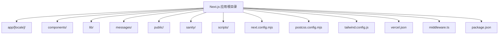
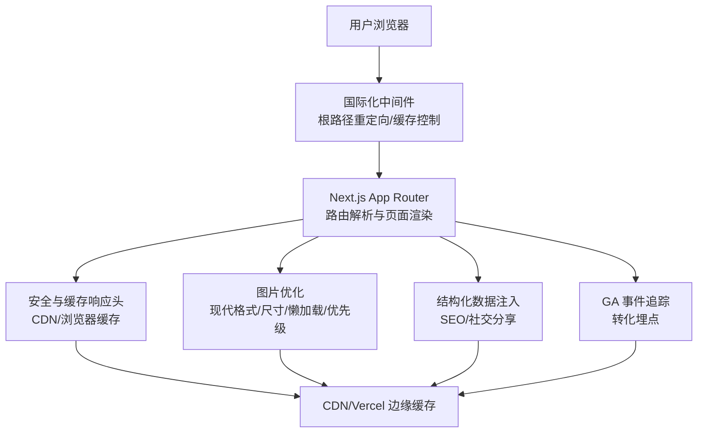
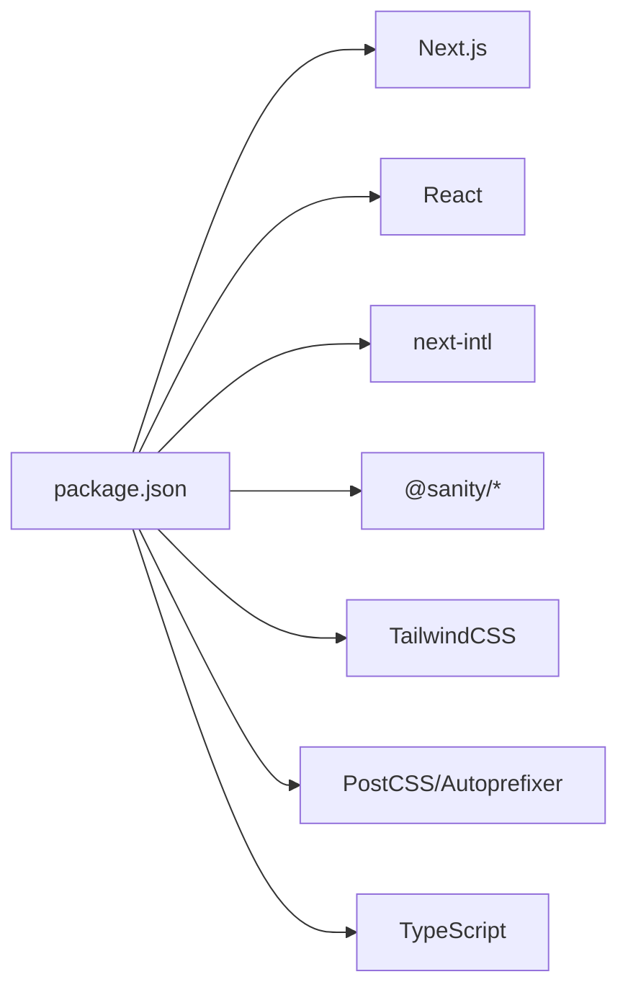

# 构建优化

<cite>
**本文引用的文件**
- [next.config.mjs](file://next.config.mjs)
- [postcss.config.mjs](file://postcss.config.mjs)
- [package.json](file://package.json)
- [tailwind.config.js](file://tailwind.config.js)
- [vercel.json](file://vercel.json)
- [middleware.ts](file://middleware.ts)
- [app/[locale]/page.tsx](file://app/[locale]/page.tsx)
- [components/layout/navbar.tsx](file://components/layout/navbar.tsx)
- [components/forms/InquiryForm.tsx](file://components/forms/InquiryForm.tsx)
- [lib/i18n/config.ts](file://lib/i18n/config.ts)
</cite>

## 目录
1. [简介](#简介)
2. [项目结构](#项目结构)
3. [核心组件](#核心组件)
4. [架构总览](#架构总览)
5. [详细组件分析](#详细组件分析)
6. [依赖分析](#依赖分析)
7. [性能考量](#性能考量)
8. [故障排查指南](#故障排查指南)
9. [结论](#结论)
10. [附录](#附录)

## 简介
本文件聚焦于 GoPro Trade 网站的构建与运行时优化，围绕以下主题展开：
- 代码分割策略：动态导入、路由级代码分割、第三方库按需加载
- Tree Shaking 优化：无用代码删除、模块化打包、依赖分析
- Bundle 分析与优化：包大小分析、依赖关系优化、重复代码消除
- 预加载与预取策略：关键资源预加载、智能预取、资源优先级管理
- PostCSS 配置优化：CSS 压缩、Autoprefixer 配置、样式优化
- 构建性能监控与持续优化方法论

目标是在不改变功能的前提下，系统性地降低首屏加载时间、减少网络传输体积、提升缓存命中率与可维护性。

## 项目结构
该仓库采用 Next.js App Router 结构，页面按语言分目录组织，静态资源与国际化消息分离，构建配置集中在 Next.js 与 PostCSS 配置文件中。整体布局如下：

图表来源
- [next.config.mjs](file://next.config.mjs)
- [postcss.config.mjs](file://postcss.config.mjs)
- [tailwind.config.js](file://tailwind.config.js)
- [vercel.json](file://vercel.json)
- [middleware.ts](file://middleware.ts)
- [package.json](file://package.json)

章节来源
- [next.config.mjs](file://next.config.mjs)
- [postcss.config.mjs](file://postcss.config.mjs)
- [tailwind.config.js](file://tailwind.config.js)
- [vercel.json](file://vercel.json)
- [middleware.ts](file://middleware.ts)
- [package.json](file://package.json)

## 核心组件
- Next.js 构建配置：图片格式与尺寸优化、压缩、安全响应头、实验性优化、HTTP 缓存头
- PostCSS/Tailwind：自动前缀与工具类扫描范围
- 国际化中间件：基于浏览器语言的根路径重定向与缓存控制
- 首页页面：结构化数据注入、图片优先级与懒加载、SEO 元数据生成
- 导航栏组件：客户端交互、语言切换、本地化链接生成
- 表单组件：客户端状态管理、GA 事件追踪、异步提交

章节来源
- [next.config.mjs](file://next.config.mjs)
- [postcss.config.mjs](file://postcss.config.mjs)
- [tailwind.config.js](file://tailwind.config.js)
- [middleware.ts](file://middleware.ts)
- [app/[locale]/page.tsx](file://app/[locale]/page.tsx)
- [components/layout/navbar.tsx](file://components/layout/navbar.tsx)
- [components/forms/InquiryForm.tsx](file://components/forms/InquiryForm.tsx)

## 架构总览
下图展示了从请求到渲染的关键路径，以及构建期与运行时的优化点：

图表来源
- [middleware.ts](file://middleware.ts)
- [app/[locale]/page.tsx](file://app/[locale]/page.tsx)
- [next.config.mjs](file://next.config.mjs)

## 详细组件分析

### 代码分割与动态导入
- 路由级代码分割
  - App Router 默认按路由拆分页面包，结合 revalidate 与 ISR，可减少不必要的全量重建。
  - 首页页面导出 revalidate 常量，用于增量更新与缓存策略配合。
- 动态导入
  - 组件内部如需延迟加载重型模块，建议使用 React.lazy 与 Suspense 包裹，避免阻塞首屏。
  - 对于非关键路径的组件（如弹窗、富文本编辑器、图表库），采用动态导入可显著降低首屏体积。
- 第三方库按需加载
  - Next.js 实验性优化已对部分库进行按需导入优化，建议保持依赖树精简，避免引入整包。
  - Tailwind 工具类仅在 content 扫描范围内生效，减少未使用样式的打包体积。

章节来源
- [app/[locale]/page.tsx](file://app/[locale]/page.tsx)
- [next.config.mjs](file://next.config.mjs)
- [tailwind.config.js](file://tailwind.config.js)

### Tree Shaking 优化
- 无用代码删除
  - 使用 ES Module 导出/导入，避免默认导出导致的命名冲突与打包器难以分析。
  - 将工具函数拆分为独立模块，仅导出必要项，减少副作用。
- 模块化打包
  - 将大型依赖（如图标库、UI 组件）拆分为独立包或子模块，便于按需引入。
  - 在 lib/utils 中集中导出复用逻辑，避免重复打包。
- 依赖分析
  - 定期使用可视化工具（如 webpack-bundle-analyzer 或 Vercel 分析）检查依赖树，识别超大依赖与重复模块。

章节来源
- [lib/i18n/config.ts](file://lib/i18n/config.ts)
- [package.json](file://package.json)

### Bundle 分析与优化
- 包大小分析
  - 在本地与 CI 中开启分析报告，对比主包、页面包、第三方包占比。
  - 关注 vendor 与公共依赖是否被正确提取与缓存。
- 依赖关系优化
  - 合并相似依赖，剔除重复版本，统一使用单一语义化版本。
  - 对于多语言消息与图片资源，采用按需加载与 CDN 缓存策略。
- 重复代码消除
  - 抽象通用组件与工具函数，避免在多个页面重复定义。
  - 利用 Next.js 的 App Router 结构，共享布局与通用组件。

章节来源
- [package.json](file://package.json)
- [vercel.json](file://vercel.json)

### 预加载与预取策略
- 关键资源预加载
  - 首屏关键图片设置 priority 与 eager，确保 LCP 最优表现。
  - 首页图片使用 sizes 与现代格式（AVIF/WebP），提升加载速度与体积效率。
- 智能预取
  - 导航至“产品”“新闻”等高概率后续页面时，利用 next/link 的预取能力。
  - 对于语言切换后的页面，预取对应语言的消息与图片资源。
- 资源优先级管理
  - 通过 HTTP 响应头与 CDN 缓存策略，为图片与字体设置长期缓存与 immutable 标记。
  - 移除不必要的缓存控制头，避免中间层干扰。

章节来源
- [app/[locale]/page.tsx](file://app/[locale]/page.tsx)
- [next.config.mjs](file://next.config.mjs)
- [vercel.json](file://vercel.json)

### PostCSS 配置优化
- CSS 压缩
  - 生产环境由 Next.js 自动处理，建议保持 PostCSS 插件最小化以减少构建时间。
- Autoprefixer 配置
  - 与 Tailwind 协同工作，确保浏览器兼容性与工具类可用性。
- 样式优化
  - Tailwind content 扫描范围精确到 app 与 components、lib，避免收集未使用样式。
  - 使用原子化样式减少样式体积，避免全局样式污染。

章节来源
- [postcss.config.mjs](file://postcss.config.mjs)
- [tailwind.config.js](file://tailwind.config.js)

### 国际化与缓存策略
- 国际化中间件
  - 根路径仅做一次语言检测与重定向，避免重复跳转。
  - 设置严格的缓存控制头，防止缓存污染。
- 缓存头与安全头
  - 图片与字体设置长期缓存与 immutable，提升二次访问性能。
  - 页面安全头统一设置，增强 XSS 与点击劫持防护。

章节来源
- [middleware.ts](file://middleware.ts)
- [next.config.mjs](file://next.config.mjs)
- [vercel.json](file://vercel.json)

### 首页渲染与 SEO
- 结构化数据
  - 首页注入组织、网站、FAQ、本地业务等结构化数据，提升搜索可见性。
- SEO 元数据
  - 多语言元标题与描述动态生成，生成 canonical 与 alternate 语言链接。
- 图片优化
  - 首张产品图优先加载，其余懒加载；sizes 与现代格式提升 LCP 与体积效率。

章节来源
- [app/[locale]/page.tsx](file://app/[locale]/page.tsx)
- [next.config.mjs](file://next.config.mjs)

### 表单与事件追踪
- 表单组件
  - 客户端状态管理与异步提交，提交成功后触发 GA 事件，记录转化指标。
- 事件追踪
  - 将关键业务行为（如询盘提交）纳入 GA4 事件体系，便于后续分析与优化。

章节来源
- [components/forms/InquiryForm.tsx](file://components/forms/InquiryForm.tsx)

## 依赖分析
- 运行时依赖
  - Next.js、React、next-intl、@sanity/* 等为核心框架与内容管理依赖。
- 开发依赖
  - Tailwind、PostCSS、Autoprefixer、TypeScript 等用于样式与构建。
- 优化要点
  - 保持依赖版本一致，避免重复打包。
  - 通过 content 扫描范围控制样式体积，减少未使用类名。

图表来源
- [package.json](file://package.json)

章节来源
- [package.json](file://package.json)
- [tailwind.config.js](file://tailwind.config.js)

## 性能考量
- 构建性能
  - 减少 PostCSS 插件数量，缩短构建时间。
  - 控制 Tailwind content 扫描范围，避免遍历无关目录。
- 运行时性能
  - 图片懒加载与优先级策略，结合现代格式与尺寸优化。
  - 长期缓存与安全头配置，减少重复下载与安全风险。
- 可观测性
  - 引入性能指标（LCP、FID、CLS）与日志埋点，持续监控与回归测试。

## 故障排查指南
- 图片加载异常
  - 检查 remotePatterns 与 formats 配置，确认域名与格式支持。
  - 验证 sizes 与 priority 设置是否合理。
- 国际化重定向问题
  - 确认中间件匹配路径与缓存头设置，避免缓存导致的语言错乱。
- 缓存与安全头冲突
  - 校验 next.config.mjs 与 vercel.json 的响应头配置一致性。
- 构建体积异常
  - 使用分析工具定位超大依赖与重复模块，调整依赖树与按需加载策略。

章节来源
- [next.config.mjs](file://next.config.mjs)
- [vercel.json](file://vercel.json)
- [middleware.ts](file://middleware.ts)

## 结论
通过合理的代码分割、Tree Shaking、Bundle 分析、预加载与预取策略、PostCSS 优化以及缓存与安全头配置，GoPro Trade 网站在保证功能完整性的同时，实现了更优的加载性能与可维护性。建议持续引入性能监控与分析工具，形成闭环优化流程。

## 附录
- 术语说明
  - LCP：最大内容绘制，衡量首屏关键元素加载速度
  - FID：首次输入延迟，衡量页面交互响应速度
  - CLS：累积布局偏移，衡量页面稳定性
- 推荐工具
  - 构建分析：webpack-bundle-analyzer、Vercel 分析
  - 性能监控：Web Vitals、GA4
  - 样式优化：Tailwind Play、PostCSS 插件对比