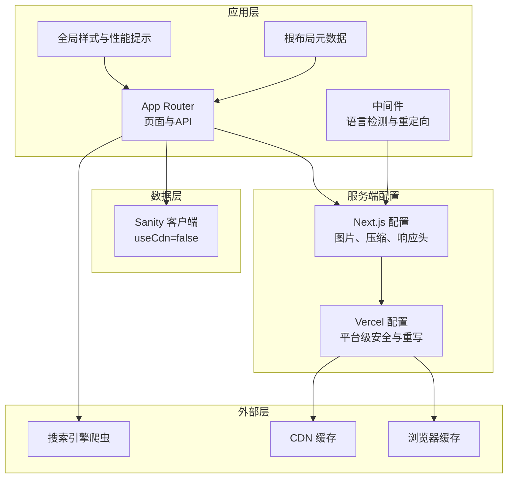
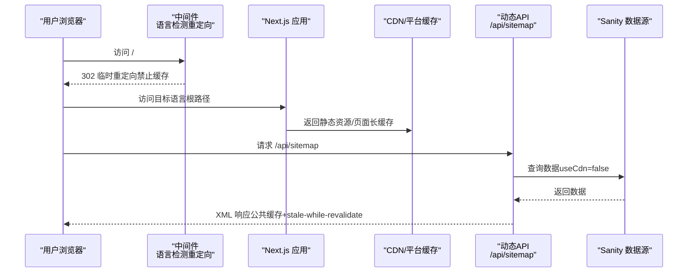
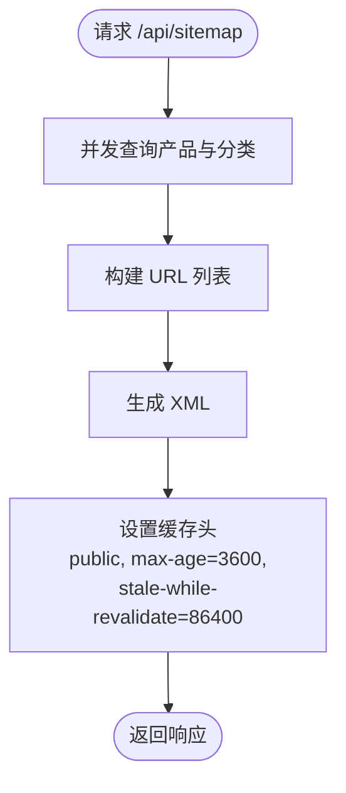
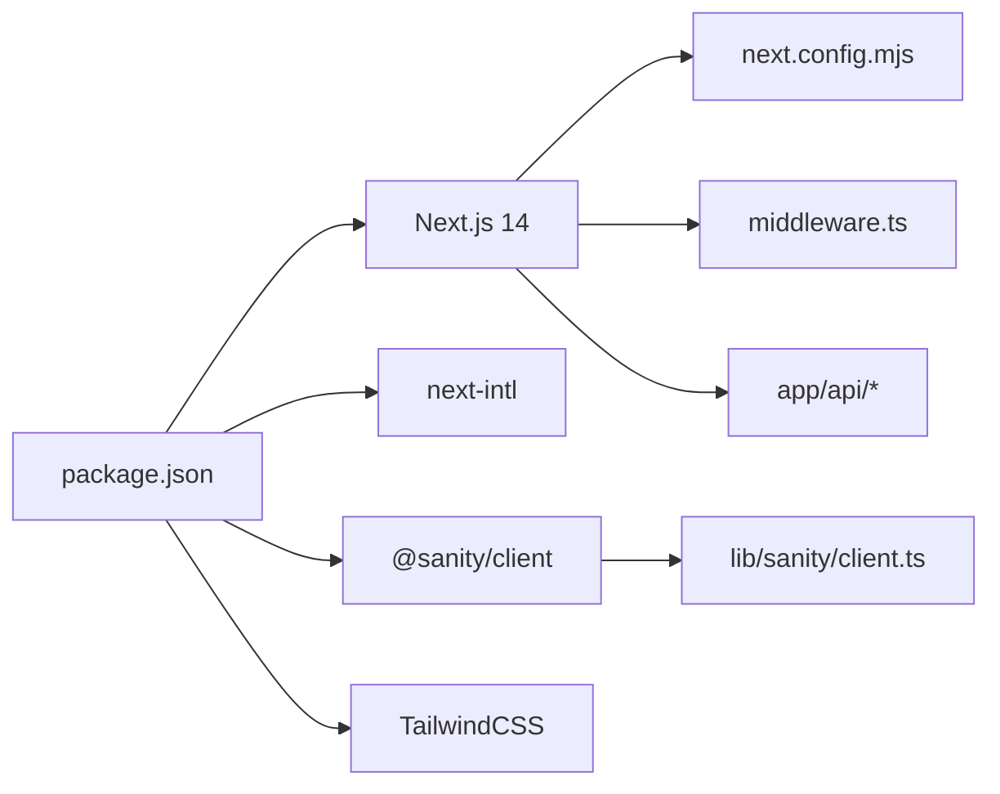

# 缓存策略

<cite>
**本文引用的文件**
- [next.config.mjs](file://next.config.mjs)
- [middleware.ts](file://middleware.ts)
- [vercel.json](file://vercel.json)
- [app/layout.tsx](file://app/layout.tsx)
- [app/[locale]/globals.css](file://app/[locale]/globals.css)
- [app/api/sitemap/route.ts](file://app/api/sitemap/route.ts)
- [app/api/cron/news/route.ts](file://app/api/cron/news/route.ts)
- [lib/sanity/client.ts](file://lib/sanity/client.ts)
- [lib/i18n/config.ts](file://lib/i18n/config.ts)
- [app/robots.ts](file://app/robots.ts)
- [package.json](file://package.json)
</cite>

## 目录
1. [简介](#简介)
2. [项目结构](#项目结构)
3. [核心组件](#核心组件)
4. [架构总览](#架构总览)
5. [详细组件分析](#详细组件分析)
6. [依赖关系分析](#依赖关系分析)
7. [性能考量](#性能考量)
8. [故障排查指南](#故障排查指南)
9. [结论](#结论)
10. [附录](#附录)

## 简介
本文件系统化梳理 GoPro Trade 网站的多层级缓存策略与实现，覆盖浏览器缓存、CDN 缓存、API 缓存、静态资源缓存等；深入解析 HTTP 响应头缓存控制（含 Cache-Control、immutable 策略、字体缓存等）；文档化 Next.js 内置缓存机制（ISR、静态生成缓存、Server Components 缓存等）；说明缓存失效与更新机制（预热、清理、优先级）；并提供缓存性能监控与调试方法。

## 项目结构
该网站采用 Next.js App Router 架构，核心缓存相关配置集中在以下位置：
- Next.js 构建与运行时配置：next.config.mjs
- 全局中间件与重定向缓存控制：middleware.ts
- 平台级安全与缓存头：vercel.json
- 动态 API（带缓存控制）：app/api/sitemap/route.ts、app/api/cron/news/route.ts
- 数据源客户端（Sanity）：lib/sanity/client.ts
- 国际化配置：lib/i18n/config.ts
- 站点地图与爬虫规则：app/robots.ts
- 样式与性能提示：app/[locale]/globals.css
- 根布局元数据：app/layout.tsx
- 依赖与框架版本：package.json

图表来源
- [next.config.mjs:34-61](file://next.config.mjs#L34-L61)
- [middleware.ts:44-63](file://middleware.ts#L44-L63)
- [vercel.json:1-44](file://vercel.json#L1-L44)
- [lib/sanity/client.ts:9-15](file://lib/sanity/client.ts#L9-L15)

章节来源
- [next.config.mjs:1-65](file://next.config.mjs#L1-L65)
- [middleware.ts:1-68](file://middleware.ts#L1-L68)
- [vercel.json:1-44](file://vercel.json#L1-L44)
- [app/layout.tsx:1-19](file://app/layout.tsx#L1-L19)
- [app/[locale]/globals.css:1-77](file://app/[locale]/globals.css#L1-L77)
- [lib/sanity/client.ts:1-30](file://lib/sanity/client.ts#L1-L30)
- [lib/i18n/config.ts:1-16](file://lib/i18n/config.ts#L1-L16)
- [app/robots.ts:1-27](file://app/robots.ts#L1-L27)
- [package.json:1-45](file://package.json#L1-L45)

## 核心组件
- Next.js 构建与运行时缓存控制
  - 图片优化与缓存：现代图片格式、设备尺寸、最小缓存周期
  - 压缩与安全头：gzip 压缩、隐藏 X-Powered-By、页面安全头
  - 静态资源与字体缓存：长期缓存、immutable
- 中间件与重定向缓存控制
  - 根路径语言检测重定向：禁止缓存（no-store/no-cache）
- 平台级缓存与安全
  - Vercel 安全头：X-Content-Type-Options、X-Frame-Options、X-XSS-Protection
  - 重写规则：sitemap.xml -> /api/sitemap
- 动态 API 缓存
  - 站点地图：公共缓存、最大年龄、stale-while-revalidate
  - 定时任务：受保护的 Cron 接口
- 数据源客户端
  - Sanity 客户端：useCdn=false，确保实时一致性
- 国际化与站点地图
  - 多语言配置与 robots 规则，指向 /api/sitemap

章节来源
- [next.config.mjs:4-26](file://next.config.mjs#L4-L26)
- [next.config.mjs:34-61](file://next.config.mjs#L34-L61)
- [middleware.ts:44-63](file://middleware.ts#L44-L63)
- [vercel.json:8-26](file://vercel.json#L8-L26)
- [app/api/sitemap/route.ts:16-99](file://app/api/sitemap/route.ts#L16-L99)
- [app/api/cron/news/route.ts:5-51](file://app/api/cron/news/route.ts#L5-L51)
- [lib/sanity/client.ts:9-15](file://lib/sanity/client.ts#L9-L15)
- [lib/i18n/config.ts:1-16](file://lib/i18n/config.ts#L1-L16)
- [app/robots.ts:3-26](file://app/robots.ts#L3-L26)

## 架构总览
下图展示从浏览器到平台、再到数据源的多层级缓存交互：

图表来源
- [middleware.ts:44-63](file://middleware.ts#L44-L63)
- [next.config.mjs:34-61](file://next.config.mjs#L34-L61)
- [app/api/sitemap/route.ts:16-99](file://app/api/sitemap/route.ts#L16-L99)
- [lib/sanity/client.ts:9-15](file://lib/sanity/client.ts#L9-L15)

## 详细组件分析

### 浏览器缓存与静态资源缓存
- 静态图片与字体缓存策略
  - 图片：通过 Next.js 图片优化与最小缓存周期，结合 CDN 实现长期缓存
  - 字体：woff2 文件设置长期缓存与 immutable，确保跨域字体可缓存
- 页面安全头
  - 设置 X-Content-Type-Options、X-Frame-Options、Referrer-Policy，提升安全性
- 压缩与头部
  - 启用 gzip 压缩，隐藏 X-Powered-By，降低传输体积与指纹暴露风险

章节来源
- [next.config.mjs:4-26](file://next.config.mjs#L4-L26)
- [next.config.mjs:34-61](file://next.config.mjs#L34-L61)

### CDN 缓存与平台级缓存
- Vercel 安全头
  - 在所有请求上设置安全相关响应头，统一防护策略
- 重写规则
  - 将 /sitemap.xml 重写到 /api/sitemap，便于缓存控制与维护
- 区域与部署
  - 指定部署区域，有助于就近缓存与边缘分发

章节来源
- [vercel.json:8-26](file://vercel.json#L8-L26)
- [vercel.json:27-32](file://vercel.json#L27-L32)
- [vercel.json:7](file://vercel.json#L7)

### API 缓存与动态内容
- 站点地图缓存
  - 使用公共缓存与较长的最大年龄，并启用 stale-while-revalidate，兼顾新鲜度与性能
- 定时任务接口
  - 通过 Authorization Bearer 校验，限制 Cron 访问，保证安全

图表来源
- [app/api/sitemap/route.ts:16-99](file://app/api/sitemap/route.ts#L16-L99)

章节来源
- [app/api/sitemap/route.ts:16-99](file://app/api/sitemap/route.ts#L16-L99)
- [app/api/cron/news/route.ts:5-51](file://app/api/cron/news/route.ts#L5-L51)

### 中间件与重定向缓存控制
- 根路径语言检测重定向
  - 302 临时重定向，明确设置禁止缓存，避免错误语言缓存影响后续请求

章节来源
- [middleware.ts:44-63](file://middleware.ts#L44-L63)

### 数据源缓存与一致性
- Sanity 客户端
  - useCdn=false，确保读取最新数据，适合需要强一致性的场景
- 与图片优化配合
  - 图片懒加载与现代格式提升首屏性能，同时保持 CDN 缓存收益

章节来源
- [lib/sanity/client.ts:9-15](file://lib/sanity/client.ts#L9-L15)
- [next.config.mjs:4-17](file://next.config.mjs#L4-L17)

### 国际化与站点地图
- 多语言与 robots
  - robots 指向 /api/sitemap，确保搜索引擎抓取最新站点地图
- 站点地图生成
  - 动态生成静态页面、分类与产品详情链接，统一设置最后修改时间与优先级

章节来源
- [lib/i18n/config.ts:1-16](file://lib/i18n/config.ts#L1-L16)
- [app/robots.ts:3-26](file://app/robots.ts#L3-L26)
- [app/api/sitemap/route.ts:8-74](file://app/api/sitemap/route.ts#L8-L74)

### Next.js 内置缓存机制
- 静态生成与 ISR
  - App Router 默认按需生成页面；可通过 revalidate 控制增量静态再生（ISR）
  - 本仓库未显式配置 ISR，建议在需要时效性的页面中引入 revalidate
- Server Components 缓存
  - 服务器组件天然受益于 Next.js 的缓存与流式渲染，减少客户端负担
- 图片与字体缓存
  - 图片最小缓存周期与字体 immutable 策略，结合 CDN 达成稳定缓存

章节来源
- [next.config.mjs:4-17](file://next.config.mjs#L4-L17)
- [next.config.mjs:34-61](file://next.config.mjs#L34-L61)

## 依赖关系分析
- Next.js 版本与依赖
  - 使用 Next.js 14，配合中间件、App Router、API 路由等能力
- 关键依赖
  - @sanity/client：数据源客户端，useCdn=false
  - next-intl：国际化支持
  - TailwindCSS：样式与性能提示

图表来源
- [package.json:12-29](file://package.json#L12-L29)
- [next.config.mjs:1-65](file://next.config.mjs#L1-L65)
- [middleware.ts:1-68](file://middleware.ts#L1-L68)
- [lib/sanity/client.ts:1-30](file://lib/sanity/client.ts#L1-L30)

章节来源
- [package.json:1-45](file://package.json#L1-L45)

## 性能考量
- 长期缓存与 immutable
  - 静态资源与字体采用长期缓存与 immutable，显著降低重复请求与带宽消耗
- stale-while-revalidate
  - 站点地图启用 stale-while-revalidate，在缓存过期后仍可快速返回旧数据，后台异步刷新
- 禁止缓存的重定向
  - 语言检测重定向明确禁止缓存，避免错误语言缓存导致的二次跳转
- 图片优化与懒加载
  - 现代图片格式与懒加载提升首屏性能，结合 CDN 缓存提升回访体验
- 压缩与安全头
  - gzip 压缩降低传输体积，安全头提升整体安全性

章节来源
- [next.config.mjs:34-61](file://next.config.mjs#L34-L61)
- [app/api/sitemap/route.ts:93-98](file://app/api/sitemap/route.ts#L93-L98)
- [middleware.ts:56-60](file://middleware.ts#L56-L60)
- [app/[locale]/globals.css:24-33](file://app/[locale]/globals.css#L24-L33)

## 故障排查指南
- 站点地图未更新
  - 检查 /api/sitemap 的缓存头与 stale-while-revalidate 配置
  - 确认 Sanity 数据可用性与查询逻辑
- 语言检测重定向异常
  - 确认中间件对根路径的匹配与禁止缓存头设置
- CDN 缓存不生效
  - 检查静态资源路径与缓存头配置，确认 CDN 是否正确识别 immutable 与 max-age
- Cron 任务未执行
  - 校验 Authorization Bearer 与 Cron Secret 配置，查看日志输出

章节来源
- [app/api/sitemap/route.ts:16-99](file://app/api/sitemap/route.ts#L16-L99)
- [middleware.ts:44-63](file://middleware.ts#L44-L63)
- [vercel.json:33-42](file://vercel.json#L33-L42)
- [app/api/cron/news/route.ts:5-51](file://app/api/cron/news/route.ts#L5-L51)

## 结论
本项目通过 Next.js 配置、中间件与平台级配置，实现了从浏览器到 CDN 的多层级缓存体系；通过动态 API 的缓存头与 Sanity 的 useCdn=false，平衡了性能与一致性；建议在需要时效性的页面引入 ISR 以进一步优化缓存与更新效率。

## 附录
- 建议的缓存优先级
  - 静态资源与字体：immutable 长期缓存
  - 站点地图：公共缓存 + stale-while-revalidate
  - 动态 API：按业务需求设置公共/私有缓存
  - 重定向与登录相关：禁止缓存
- 缓存预热与清理
  - 预热：在 CDN 或平台层面主动请求热点资源
  - 清理：通过版本化文件名或缓存标签失效策略
- 监控与评估
  - 使用缓存命中率、TTFB、首次内容绘制等指标评估缓存效果
  - 结合平台日志与 APM 工具进行持续观测