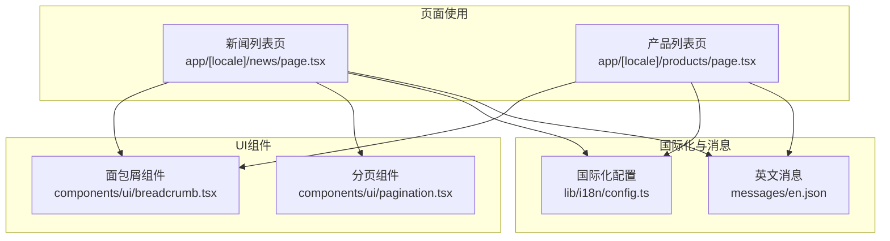
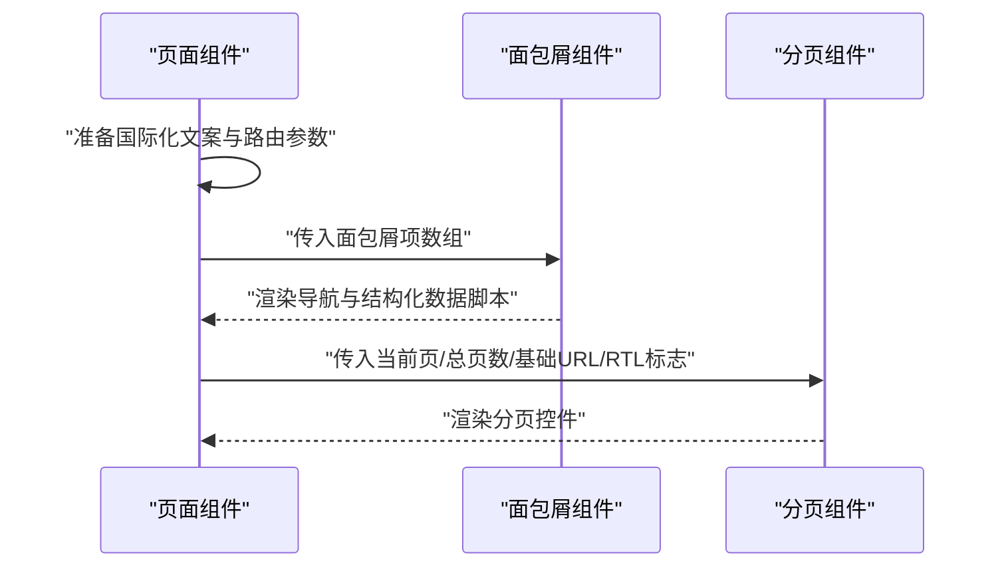
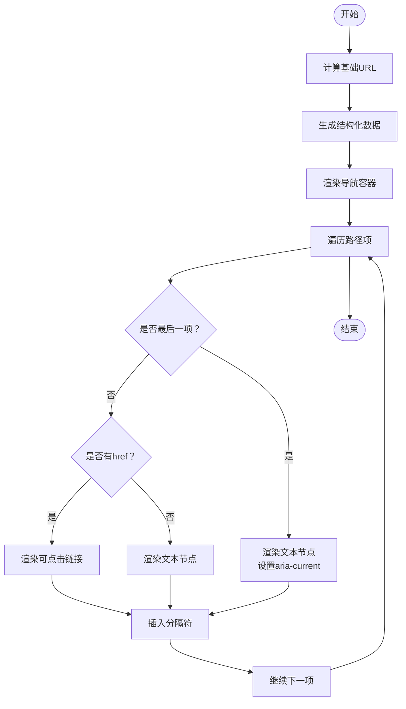
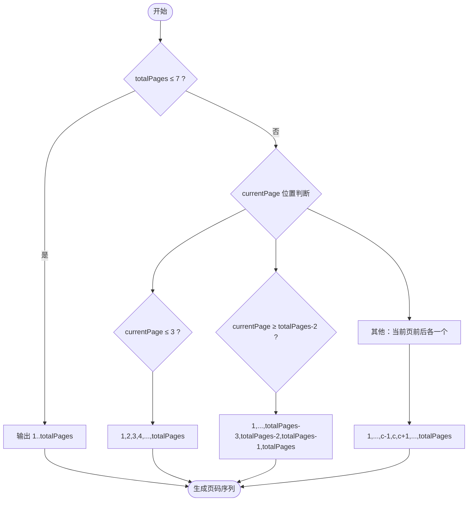
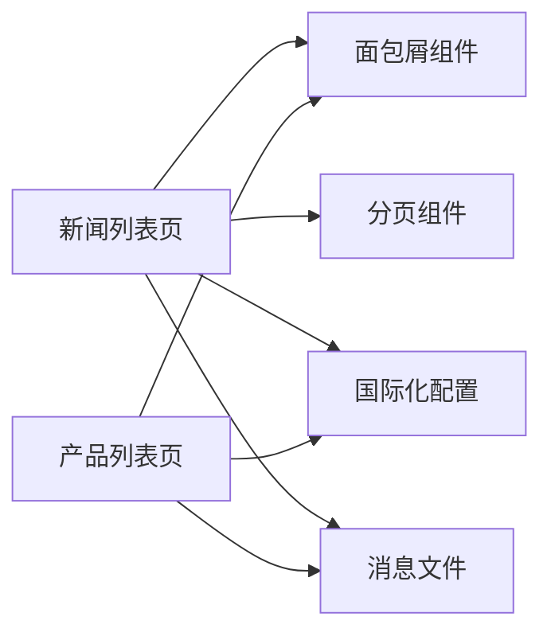

# UI辅助组件

<cite>
**本文引用的文件**
- [components/ui/breadcrumb.tsx](file://components/ui/breadcrumb.tsx)
- [components/ui/pagination.tsx](file://components/ui/pagination.tsx)
- [app/[locale]/news/page.tsx](file://app/[locale]/news/page.tsx)
- [app/[locale]/products/page.tsx](file://app/[locale]/products/page.tsx)
- [lib/i18n/config.ts](file://lib/i18n/config.ts)
- [messages/en.json](file://messages/en.json)
- [app/layout.tsx](file://app/layout.tsx)
</cite>

## 目录
1. [简介](#简介)
2. [项目结构](#项目结构)
3. [核心组件](#核心组件)
4. [架构总览](#架构总览)
5. [详细组件分析](#详细组件分析)
6. [依赖关系分析](#依赖关系分析)
7. [性能考量](#性能考量)
8. [故障排查指南](#故障排查指南)
9. [结论](#结论)
10. [附录](#附录)

## 简介
本文件面向GoPro Trade网站的UI辅助组件，聚焦于“面包屑导航”与“分页”两大组件的实现与使用。内容涵盖：
- 面包屑导航：路径解析、动态生成、SEO结构化数据、样式与RTL支持
- 分页组件：分页策略、URL构建、跳转逻辑、RTL适配
- 组件在用户体验中的作用：导航便利性、信息层级清晰度
- Props接口、事件与状态管理、样式定制、响应式与无障碍支持
- 使用示例与集成最佳实践

## 项目结构
这两个组件位于应用的UI层，分别用于页面导航与列表分页；页面通过Next.js路由与国际化配置驱动组件渲染。

图表来源
- [components/ui/breadcrumb.tsx:1-87](file://components/ui/breadcrumb.tsx#L1-L87)
- [components/ui/pagination.tsx:1-83](file://components/ui/pagination.tsx#L1-L83)
- [app/[locale]/news/page.tsx](file://app/[locale]/news/page.tsx#L1-L200)
- [app/[locale]/products/page.tsx](file://app/[locale]/products/page.tsx#L1-L200)
- [lib/i18n/config.ts:1-16](file://lib/i18n/config.ts#L1-L16)
- [messages/en.json:1-200](file://messages/en.json#L1-L200)

章节来源
- [components/ui/breadcrumb.tsx:1-87](file://components/ui/breadcrumb.tsx#L1-L87)
- [components/ui/pagination.tsx:1-83](file://components/ui/pagination.tsx#L1-L83)
- [app/[locale]/news/page.tsx:1-200](file://app/[locale]/news/page.tsx#L1-L200)
- [app/[locale]/products/page.tsx:1-200](file://app/[locale]/products/page.tsx#L1-L200)
- [lib/i18n/config.ts:1-16](file://lib/i18n/config.ts#L1-L16)
- [messages/en.json:1-200](file://messages/en.json#L1-L200)

## 核心组件
- 面包屑导航组件：接收路径项数组，自动生成结构化数据，渲染可访问的导航条，支持最后项不可点击与RTL布局。
- 分页组件：根据总页数与当前页生成页码序列，支持RTL翻页方向与省略号占位，提供上一页/下一页与页码跳转。

章节来源
- [components/ui/breadcrumb.tsx:10-34](file://components/ui/breadcrumb.tsx#L10-L34)
- [components/ui/pagination.tsx:5-16](file://components/ui/pagination.tsx#L5-L16)

## 架构总览
组件在页面中以函数式组件形式被调用，页面负责准备数据与国际化文案，并将必要参数传递给组件。

图表来源
- [app/[locale]/news/page.tsx:129-137](file://app/[locale]/news/page.tsx#L129-L137)
- [app/[locale]/news/page.tsx:260-267](file://app/[locale]/news/page.tsx#L260-L267)
- [app/[locale]/products/page.tsx:118-125](file://app/[locale]/products/page.tsx#L118-L125)
- [components/ui/breadcrumb.tsx:21-85](file://components/ui/breadcrumb.tsx#L21-L85)
- [components/ui/pagination.tsx:12-81](file://components/ui/pagination.tsx#L12-L81)

## 详细组件分析

### 面包屑导航组件
- 功能要点
  - 接收路径项数组，最后一项作为当前页文本不生成链接
  - 自动注入JSON-LD结构化数据，提升SEO
  - 支持RTL布局下的视觉顺序调整
  - 可通过className扩展样式
- 数据模型与处理
  - 输入：路径项数组（label必填，href可选）
  - 输出：导航UI与结构化数据脚本
- 处理流程
  - 计算站点基础URL
  - 生成结构化数据对象
  - 渲染导航列表，按索引插入分隔符
  - 最后一项设置aria-current标识

图表来源
- [components/ui/breadcrumb.tsx:21-85](file://components/ui/breadcrumb.tsx#L21-L85)

章节来源
- [components/ui/breadcrumb.tsx:5-13](file://components/ui/breadcrumb.tsx#L5-L13)
- [components/ui/breadcrumb.tsx:21-34](file://components/ui/breadcrumb.tsx#L21-L34)
- [components/ui/breadcrumb.tsx:44-84](file://components/ui/breadcrumb.tsx#L44-L84)

#### 在页面中的使用
- 新闻列表页：构造两级面包屑（首页与新闻），并传入国际化文案
- 产品列表页：构造两级面包屑（首页与产品）

章节来源
- [app/[locale]/news/page.tsx:129-137](file://app/[locale]/news/page.tsx#L129-L137)
- [app/[locale]/products/page.tsx:118-125](file://app/[locale]/products/page.tsx#L118-L125)

### 分页组件
- 功能要点
  - 根据总页数与当前页生成页码序列，超过一定数量时使用省略号
  - 上一页/下一页按钮仅在可跳转时显示
  - RTL模式下旋转箭头方向
  - 通过baseUrl与查询参数拼接目标URL
- 分页策略
  - 总页数≤7：直接展示全部页码
  - 总页数>7：根据当前页位置在两端或中间插入省略号
- 处理流程

图表来源
- [components/ui/pagination.tsx:18-33](file://components/ui/pagination.tsx#L18-L33)

章节来源
- [components/ui/pagination.tsx:5-16](file://components/ui/pagination.tsx#L5-L16)
- [components/ui/pagination.tsx:12-81](file://components/ui/pagination.tsx#L12-L81)

#### 在页面中的使用
- 新闻列表页：基于searchParams解析当前页，计算总页数，传入baseUrl与isRtl

章节来源
- [app/[locale]/news/page.tsx:93-106](file://app/[locale]/news/page.tsx#L93-L106)
- [app/[locale]/news/page.tsx:260-267](file://app/[locale]/news/page.tsx#L260-L267)

### 国际化与RTL支持
- 国际化配置：定义可用语言、默认语言、语言名映射、RTL语言集合
- 页面侧：根据当前locale决定RTL布局类名与文本方向
- 组件侧：面包屑与分页均支持通过布尔标志控制RTL方向

章节来源
- [lib/i18n/config.ts:1-16](file://lib/i18n/config.ts#L1-L16)
- [app/[locale]/news/page.tsx:93](file://app/[locale]/news/page.tsx#L93)
- [app/[locale]/products/page.tsx:103](file://app/[locale]/products/page.tsx#L103)
- [components/ui/pagination.tsx:36](file://components/ui/pagination.tsx#L36)

## 依赖关系分析
- 组件依赖
  - 面包屑：Next.js Link、结构化数据生成
  - 分页：Next.js Link、URL参数拼接
- 页面依赖
  - 新闻/产品列表页：从国际化消息与路由参数准备面包屑与分页所需数据
- 外部依赖
  - 国际化配置与消息文件

图表来源
- [app/[locale]/news/page.tsx:1-L200](file://app/[locale]/news/page.tsx#L1-L200)
- [app/[locale]/products/page.tsx:1-L200](file://app/[locale]/products/page.tsx#L1-L200)
- [lib/i18n/config.ts:1-16](file://lib/i18n/config.ts#L1-L16)
- [messages/en.json:1-200](file://messages/en.json#L1-L200)

章节来源
- [app/[locale]/news/page.tsx:1-L200](file://app/[locale]/news/page.tsx#L1-L200)
- [app/[locale]/products/page.tsx:1-L200](file://app/[locale]/products/page.tsx#L1-L200)
- [lib/i18n/config.ts:1-16](file://lib/i18n/config.ts#L1-L16)
- [messages/en.json:1-200](file://messages/en.json#L1-L200)

## 性能考量
- 面包屑
  - 结构化数据为静态生成，无运行时开销
  - 列表项数量有限，渲染成本低
- 分页
  - 页码序列长度受策略限制，复杂度与页数线性增长但常量较小
  - URL拼接为纯字符串操作，性能开销极低
- 页面侧
  - 新闻/产品列表页采用服务端异步加载与缓存策略，减少重复请求

## 故障排查指南
- 面包屑不显示链接
  - 检查路径项是否正确传入href字段
  - 确认最后一项不应传href
- 结构化数据缺失
  - 确保组件已渲染结构化数据脚本标签
- 分页省略号不出现
  - 确认totalPages大于7且currentPage处于中间区域
- RTL方向异常
  - 检查页面是否正确传递isRtl标志
  - 确认页面根元素或容器具备对应布局类名

## 结论
面包屑与分页组件在GoPro Trade网站中承担了导航与信息层级的关键职责。前者通过结构化数据增强SEO，后者通过智能省略策略提升长列表的可读性与可访问性。二者均具备良好的国际化与RTL支持能力，配合页面的数据准备与国际化配置，形成完整的用户体验闭环。

## 附录

### 组件Props与接口说明
- 面包屑组件
  - items: 路径项数组，每项包含label与可选href
  - className: 可选样式类名
  - 行为：最后一项不可点击，自动注入结构化数据
- 分页组件
  - currentPage: 当前页码（数字）
  - totalPages: 总页数（数字）
  - baseUrl: 基础URL（含查询参数时会追加page参数）
  - isRtl: 是否RTL布局（布尔，默认false）

章节来源
- [components/ui/breadcrumb.tsx:10-13](file://components/ui/breadcrumb.tsx#L10-L13)
- [components/ui/pagination.tsx:5-10](file://components/ui/pagination.tsx#L5-L10)

### 事件与状态管理
- 面包屑：无交互事件，仅渲染
- 分页：通过Next.js Link进行页面跳转，无需额外状态管理
- 页面侧：新闻/产品列表页维护当前页码与分类筛选状态

章节来源
- [components/ui/pagination.tsx:12-81](file://components/ui/pagination.tsx#L12-L81)
- [app/[locale]/news/page.tsx:93-L106](file://app/[locale]/news/page.tsx#L93-L106)

### 样式定制指南
- 面包屑
  - 通过className扩展容器样式
  - 文本截断与最大宽度可通过Tailwind类控制
  - 分隔符与当前页高亮颜色可按主题调整
- 分页
  - 容器与按钮间距、圆角、边框、悬停与激活态颜色均可定制
  - RTL模式下箭头方向自动旋转
- 响应式适配
  - 组件内使用flex与gap实现自适应布局
  - 页面侧结合容器宽度与网格布局实现整体响应式
- 无障碍支持
  - 面包屑容器设置aria-label
  - 当前页项设置aria-current
  - 链接与图标提供可访问语义

章节来源
- [components/ui/breadcrumb.tsx:44-84](file://components/ui/breadcrumb.tsx#L44-L84)
- [components/ui/pagination.tsx:35-80](file://components/ui/pagination.tsx#L35-L80)

### 使用示例与集成最佳实践
- 面包屑
  - 在页面顶部容器中渲染，传入由国际化消息与路由生成的路径项
  - 保持最后一项为当前页面文本，不传href
- 分页
  - 在列表底部容器中渲染，传入currentPage、totalPages、baseUrl与isRtl
  - baseUrl建议包含现有查询参数，避免覆盖
- 国际化与RTL
  - 页面根据locale设置RTL布局类名
  - 组件通过isRtl参数控制方向与箭头旋转

章节来源
- [app/[locale]/news/page.tsx:129-L137](file://app/[locale]/news/page.tsx#L129-L137)
- [app/[locale]/news/page.tsx:260-L267](file://app/[locale]/news/page.tsx#L260-L267)
- [app/[locale]/products/page.tsx:118-L125](file://app/[locale]/products/page.tsx#L118-L125)