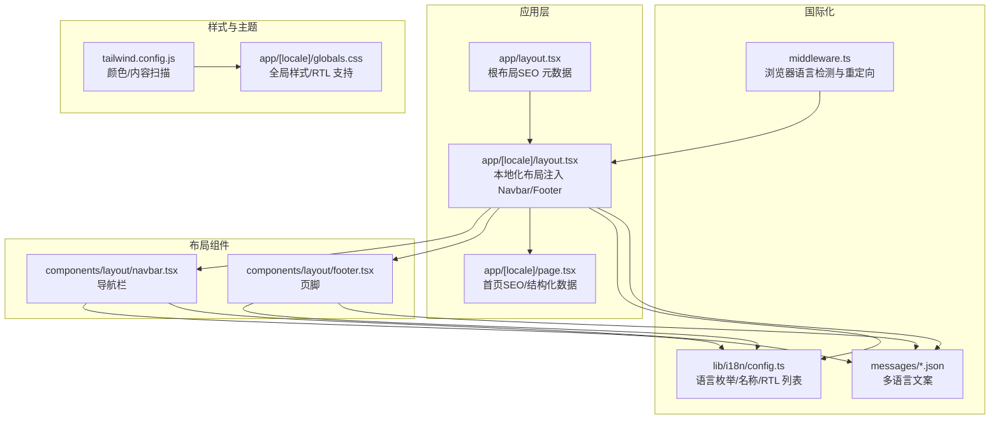
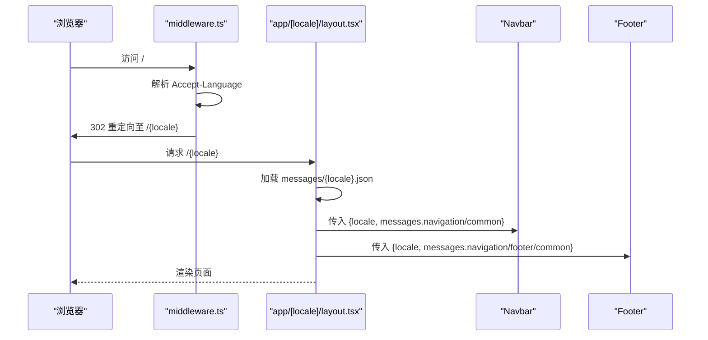
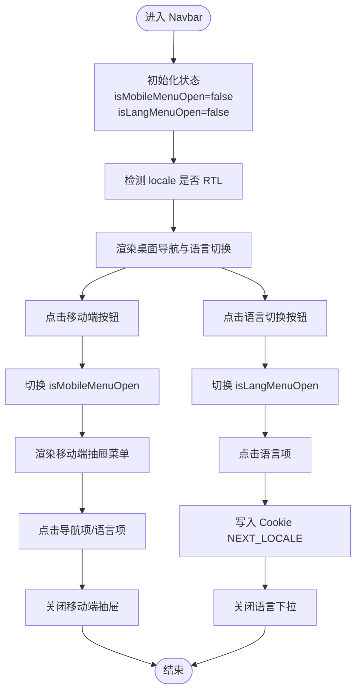
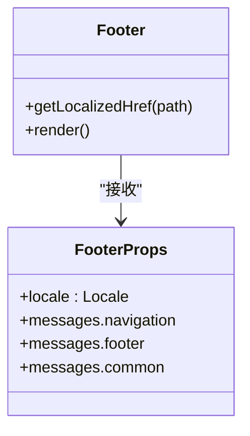
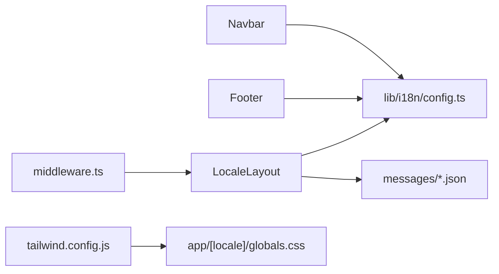

# 布局组件

<cite>
**本文引用的文件**
- [components/layout/navbar.tsx](file://components/layout/navbar.tsx)
- [components/layout/footer.tsx](file://components/layout/footer.tsx)
- [app/[locale]/layout.tsx](file://app/[locale]/layout.tsx)
- [app/layout.tsx](file://app/layout.tsx)
- [lib/i18n/config.ts](file://lib/i18n/config.ts)
- [middleware.ts](file://middleware.ts)
- [messages/en.json](file://messages/en.json)
- [messages/id.json](file://messages/id.json)
- [messages/th.json](file://messages/th.json)
- [tailwind.config.js](file://tailwind.config.js)
- [app/[locale]/globals.css](file://app/[locale]/globals.css)
- [app/[locale]/page.tsx](file://app/[locale]/page.tsx)
</cite>

## 目录
1. [简介](#简介)
2. [项目结构](#项目结构)
3. [核心组件](#核心组件)
4. [架构总览](#架构总览)
5. [详细组件分析](#详细组件分析)
6. [依赖关系分析](#依赖关系分析)
7. [性能考量](#性能考量)
8. [故障排查指南](#故障排查指南)
9. [结论](#结论)
10. [附录](#附录)

## 简介
本文件面向 GoPro Trade 网站的布局组件，重点解析以下内容：
- 导航栏组件的完整实现：多语言支持、响应式设计、移动端菜单交互、语言切换机制
- 页脚组件的结构设计：版权信息、社交媒体链接、快速导航与联系方式
- 根布局组件的作用与配置：国际化支持、全局样式、SEO 元数据
- 组件 props 接口、事件处理与状态管理
- 响应式断点、RTL 语言支持、无障碍访问优化
- 组件使用示例与自定义配置指南

## 项目结构
该网站采用 Next.js App Router 的多语言路由结构，布局组件位于 app/[locale] 下，国际化配置集中于 lib/i18n，UI 组件位于 components/layout。

图表来源
- [app/layout.tsx:1-19](file://app/layout.tsx#L1-L19)
- [app/[locale]/layout.tsx:1-71](file://app/[locale]/layout.tsx#L1-L71)
- [lib/i18n/config.ts:1-16](file://lib/i18n/config.ts#L1-L16)
- [middleware.ts:1-68](file://middleware.ts#L1-L68)
- [components/layout/navbar.tsx:1-215](file://components/layout/navbar.tsx#L1-L215)
- [components/layout/footer.tsx:1-170](file://components/layout/footer.tsx#L1-L170)
- [tailwind.config.js:1-18](file://tailwind.config.js#L1-L18)
- [app/[locale]/globals.css:1-77](file://app/[locale]/globals.css#L1-L77)

章节来源
- [app/[locale]/layout.tsx:1-71](file://app/[locale]/layout.tsx#L1-L71)
- [lib/i18n/config.ts:1-16](file://lib/i18n/config.ts#L1-L16)
- [middleware.ts:1-68](file://middleware.ts#L1-L68)

## 核心组件
- 导航栏组件（Navbar）
  - 功能：桌面端与移动端导航、语言切换、CTA 跳转
  - 关键特性：基于 locale 的链接生成、RTL 方向支持、移动端抽屉菜单、语言下拉菜单
- 页脚组件（Footer）
  - 功能：公司信息、快速链接、联系方式、社交媒体、证书徽章、底部版权与隐私条款
  - 关键特性：按 locale 生成本地化链接、RTL 方向支持
- 根布局组件（RootLayout）
  - 功能：设置页面标题与描述、根 html lang 属性
- 本地化布局（LocaleLayout）
  - 功能：注入 Navbar/Footer、生成 hreflang、加载对应语言消息、设置 dir=ltr/rtl

章节来源
- [components/layout/navbar.tsx:1-215](file://components/layout/navbar.tsx#L1-L215)
- [components/layout/footer.tsx:1-170](file://components/layout/footer.tsx#L1-L170)
- [app/layout.tsx:1-19](file://app/layout.tsx#L1-L19)
- [app/[locale]/layout.tsx:1-71](file://app/[locale]/layout.tsx#L1-L71)

## 架构总览
导航栏与页脚均接收 locale 与 messages 作为 props，由 LocaleLayout 注入。国际化配置来自 lib/i18n/config.ts，浏览器语言检测在 middleware.ts 中完成，最终通过 app/[locale]/layout.tsx 渲染。

图表来源
- [middleware.ts:44-63](file://middleware.ts#L44-L63)
- [app/[locale]/layout.tsx:34-70](file://app/[locale]/layout.tsx#L34-L70)
- [components/layout/navbar.tsx:28-215](file://components/layout/navbar.tsx#L28-L215)
- [components/layout/footer.tsx:36-170](file://components/layout/footer.tsx#L36-L170)

## 详细组件分析

### 导航栏组件（Navbar）
- 组件职责
  - 渲染品牌标识与主导航项（Home/Products/News/About/Contact）
  - 提供语言切换下拉菜单（根据 locales 列表动态生成）
  - 移动端抽屉菜单，包含导航与语言切换
  - CTA 按钮跳转至联系页面
- Props 接口
  - locale: Locale（从 lib/i18n/config.ts 导出）
  - messages.navigation: 包含 home/products/news/about/contact/inquiry/language/news 等键
  - messages.common.language: 通用语言键
- 事件与状态
  - isMobileMenuOpen: 控制移动端菜单开关
  - isLangMenuOpen: 控制语言下拉菜单开关
  - handleLanguageChange: 切换语言时写入 Cookie（NEXT_LOCALE）
- 路由与本地化
  - getPathWithoutLocale: 去除 locale 前缀以判断当前路径
  - getLocalizedHref: 为链接添加 locale 前缀
- 响应式与交互
  - 桌面端：水平导航 + 语言切换 + CTA
  - 移动端：汉堡菜单 + 抽屉内导航/语言切换/CTA
  - 语言切换：点击按钮展开下拉，点击任一语言写入 Cookie 并关闭下拉
- RTL 支持
  - 通过 rtlLocales 判断是否为 RTL 语言（如 ar），为外层 nav 添加 rtl/ltr 类名
- 可访问性
  - 使用语义化 Link 组件与适当的类名，保持键盘可访问性
  - 移动端菜单通过按钮控制，关闭时更新状态

图表来源
- [components/layout/navbar.tsx:28-215](file://components/layout/navbar.tsx#L28-L215)
- [lib/i18n/config.ts:1-16](file://lib/i18n/config.ts#L1-L16)

章节来源
- [components/layout/navbar.tsx:1-215](file://components/layout/navbar.tsx#L1-L215)
- [lib/i18n/config.ts:1-16](file://lib/i18n/config.ts#L1-L16)

### 页脚组件（Footer）
- 组件职责
  - 公司信息与品牌展示
  - 快速导航链接（Home/Products/Solutions/About/Support）
  - 联系方式（地址、邮箱）
  - 社交媒体图标链接占位
  - 证书徽章展示
  - 底部版权与隐私政策/使用条款
- Props 接口
  - locale: Locale
  - messages.navigation: 快速导航文案
  - messages.footer: 版权/快速链接/联系/描述/隐私/条款等
  - messages.common.language: 通用语言键
- 本地化与链接
  - getLocalizedHref: 为所有内部链接添加 locale 前缀
  - 当前年份动态生成版权文本
- RTL 支持
  - 仅对特定 locale（如 ar）启用 RTL 方向
- 设计要点
  - 使用网格布局适配不同屏幕尺寸
  - 图标与文字结合展示联系方式
  - 证书徽章使用圆角背景提升可读性

图表来源
- [components/layout/footer.tsx:4-34](file://components/layout/footer.tsx#L4-L34)
- [components/layout/footer.tsx:36-170](file://components/layout/footer.tsx#L36-L170)

章节来源
- [components/layout/footer.tsx:1-170](file://components/layout/footer.tsx#L1-L170)

### 根布局组件（RootLayout）
- 作用
  - 设置页面标题与描述（Metadata）
  - 固定 html lang="en"
- 适用场景
  - 适用于非本地化页面或默认语言页面
- 注意
  - 若需多语言 SEO，建议在 app/[locale]/layout.tsx 中统一生成

章节来源
- [app/layout.tsx:1-19](file://app/layout.tsx#L1-L19)

### 本地化布局（LocaleLayout）
- 作用
  - 注入 Navbar 与 Footer，并传入 locale 与 messages
  - 生成 hreflang 与 canonical（SEO）
  - 根据 locale 设置 dir=ltr/rtl
  - 加载对应语言的消息文件
- 生成静态参数
  - generateStaticParams: 为每个 locale 生成静态路由参数
- 生成元数据
  - generateMetadata: 为每种语言生成 alternates.languages 与 canonical
- 语言消息加载
  - getMessages(locale): 动态导入 messages/{locale}.json
- 渲染流程
  - 校验 locale 合法性
  - 加载消息
  - 渲染 html[dir]、Navbar、children、Footer

章节来源
- [app/[locale]/layout.tsx:1-71](file://app/[locale]/layout.tsx#L1-L71)

## 依赖关系分析
- 组件间依赖
  - Navbar/ Footer 依赖 lib/i18n/config.ts 的 locales/localeNames/rtlLocales
  - LocaleLayout 依赖 messages/*.json 的文案
- 外部依赖
  - Next.js Link/Navigation 工具
  - Tailwind CSS（颜色/工具类）
- 中间件与国际化
  - middleware.ts 基于 Accept-Language 进行浏览器语言检测与重定向
  - LocaleLayout 在服务端加载对应语言消息

图表来源
- [components/layout/navbar.tsx:6](file://components/layout/navbar.tsx#L6)
- [components/layout/footer.tsx:2](file://components/layout/footer.tsx#L2)
- [app/[locale]/layout.tsx:3-6](file://app/[locale]/layout.tsx#L3-L6)
- [middleware.ts:3](file://middleware.ts#L3)
- [tailwind.config.js:1-18](file://tailwind.config.js#L1-L18)
- [app/[locale]/globals.css:1-77](file://app/[locale]/globals.css#L1-L77)

章节来源
- [lib/i18n/config.ts:1-16](file://lib/i18n/config.ts#L1-L16)
- [middleware.ts:1-68](file://middleware.ts#L1-L68)
- [app/[locale]/layout.tsx:1-71](file://app/[locale]/layout.tsx#L1-L71)

## 性能考量
- 图片懒加载与首屏优化
  - 全局 CSS 中启用 content-visibility 以减少布局偏移
  - 首个产品图片使用 priority 提升 LCP
- 字体与渲染
  - 全局字体栈避免网络字体加载延迟
  - Tailwind 内容扫描范围明确，避免无用样式
- 国际化加载
  - LocaleLayout 异步加载对应语言消息，避免阻塞主线程
- 分析与 SEO
  - LocaleLayout 生成 hreflang 与 canonical，提升多语言 SEO
  - 首页 page.tsx 生成结构化数据（组织、网站、FAQ、本地业务）

章节来源
- [app/[locale]/globals.css:24-33](file://app/[locale]/globals.css#L24-L33)
- [app/[locale]/page.tsx:150-201](file://app/[locale]/page.tsx#L150-L201)
- [app/[locale]/layout.tsx:15-31](file://app/[locale]/layout.tsx#L15-L31)

## 故障排查指南
- 语言切换无效
  - 检查 handleLanguageChange 是否正确写入 Cookie NEXT_LOCALE
  - 确认浏览器未禁用 Cookie
- 语言列表不完整
  - 检查 lib/i18n/config.ts 中 locales 是否包含目标语言
  - 确认 messages/{locale}.json 是否存在对应文件
- RTL 显示异常
  - 确认 rtlLocales 是否包含当前 locale
  - 检查 app/[locale]/globals.css 中 .rtl/.ltr 样式是否生效
- 浏览器语言重定向问题
  - 检查 middleware.ts 中 browserLocaleMap 是否包含目标语言代码
  - 确认请求头 Accept-Language 是否正确传递
- SEO 链接缺失
  - 检查 LocaleLayout.generateMetadata 是否返回 alternates.languages 与 canonical

章节来源
- [components/layout/navbar.tsx:36-40](file://components/layout/navbar.tsx#L36-L40)
- [lib/i18n/config.ts:1-16](file://lib/i18n/config.ts#L1-L16)
- [middleware.ts:6-19](file://middleware.ts#L6-L19)
- [app/[locale]/layout.tsx:15-31](file://app/[locale]/layout.tsx#L15-L31)

## 结论
该布局体系通过清晰的组件分层与国际化配置，实现了：
- 多语言支持与本地化链接生成
- 响应式设计与移动端交互体验
- RTL 语言支持与无障碍访问基础
- SEO 友好的 hreflang/canonical 与结构化数据
建议在后续迭代中进一步完善：
- 为 Navbar/Footers 提供更细粒度的可定制能力（主题色、图标、布局）
- 增强语言切换后的页面过渡与状态同步
- 补充社交链接与隐私条款的实际链接

## 附录

### 组件 Props 接口说明
- NavbarProps
  - locale: Locale
  - messages.navigation: 包含 home/products/news/about/contact/inquiry/language/news 等键
  - messages.common: 包含 language 键
- FooterProps
  - locale: Locale
  - messages.navigation: 快速导航文案
  - messages.footer: 版权/快速链接/联系/描述/隐私/条款等
  - messages.common: 通用语言键

章节来源
- [components/layout/navbar.tsx:8-26](file://components/layout/navbar.tsx#L8-L26)
- [components/layout/footer.tsx:4-34](file://components/layout/footer.tsx#L4-L34)

### 事件处理与状态管理
- Navbar
  - 状态：isMobileMenuOpen、isLangMenuOpen
  - 事件：点击移动端按钮切换 isMobileMenuOpen；点击语言按钮切换 isLangMenuOpen；点击语言项写入 Cookie 并关闭下拉
- Footer
  - 事件：点击快速链接跳转至本地化路径

章节来源
- [components/layout/navbar.tsx:28-215](file://components/layout/navbar.tsx#L28-L215)
- [components/layout/footer.tsx:36-170](file://components/layout/footer.tsx#L36-L170)

### 响应式断点与设计策略
- 断点策略
  - 桌面端：md（≥768px）显示水平导航与语言切换
  - 移动端：<md 显示汉堡菜单与抽屉
- 设计要点
  - 使用 Tailwind 工具类实现响应式网格与间距
  - 全局 CSS 提供 .rtl/.ltr 与图片懒加载优化

章节来源
- [components/layout/navbar.tsx:82-157](file://components/layout/navbar.tsx#L82-L157)
- [components/layout/footer.tsx:52-148](file://components/layout/footer.tsx#L52-L148)
- [tailwind.config.js:1-18](file://tailwind.config.js#L1-L18)
- [app/[locale]/globals.css:36-58](file://app/[locale]/globals.css#L36-L58)

### RTL 语言支持与无障碍访问
- RTL 支持
  - 通过 rtlLocales 列表判断是否启用 RTL
  - LocaleLayout 设置 html dir 属性
  - 全局 CSS 提供 .rtl/.ltr 样式
- 无障碍访问
  - 使用语义化 Link 组件与键盘可访问性
  - 移动端菜单通过按钮控制，关闭时更新状态

章节来源
- [lib/i18n/config.ts:15](file://lib/i18n/config.ts#L15)
- [app/[locale]/layout.tsx:58-59](file://app/[locale]/layout.tsx#L58-L59)
- [app/[locale]/globals.css:36-43](file://app/[locale]/globals.css#L36-L43)

### 组件使用示例与自定义配置
- 在页面中使用
  - LocaleLayout 已内置 Navbar 与 Footer，直接渲染 children 即可
- 自定义语言列表
  - 修改 lib/i18n/config.ts 中 locales、localeNames、rtlLocales
- 新增语言文案
  - 在 messages/ 下新增 {lang}.json，并在 LocaleLayout 中加载
- 自定义样式
  - 在 app/[locale]/globals.css 中扩展 Tailwind 层或添加自定义样式
- SEO 配置
  - 在 LocaleLayout.generateMetadata 中调整 alternates.languages 与 canonical

章节来源
- [app/[locale]/layout.tsx:34-70](file://app/[locale]/layout.tsx#L34-L70)
- [lib/i18n/config.ts:1-16](file://lib/i18n/config.ts#L1-L16)
- [messages/en.json:1-200](file://messages/en.json#L1-L200)