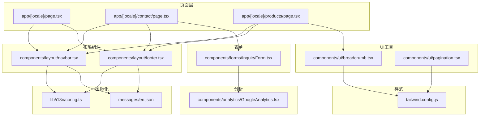
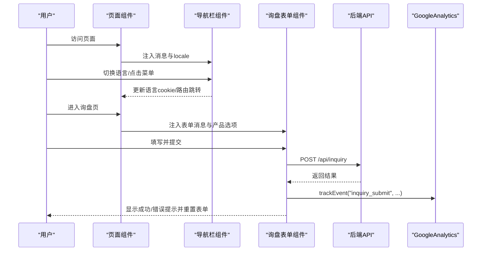
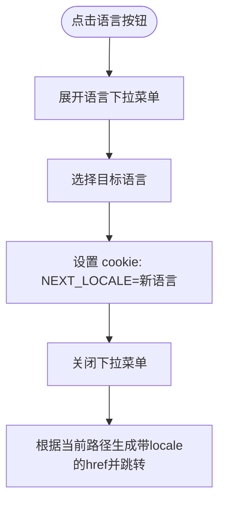
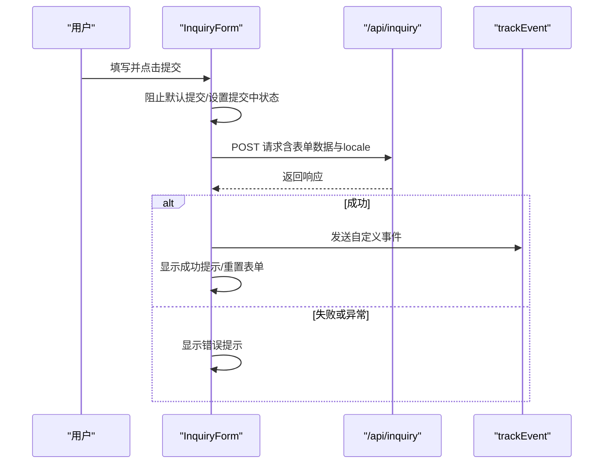
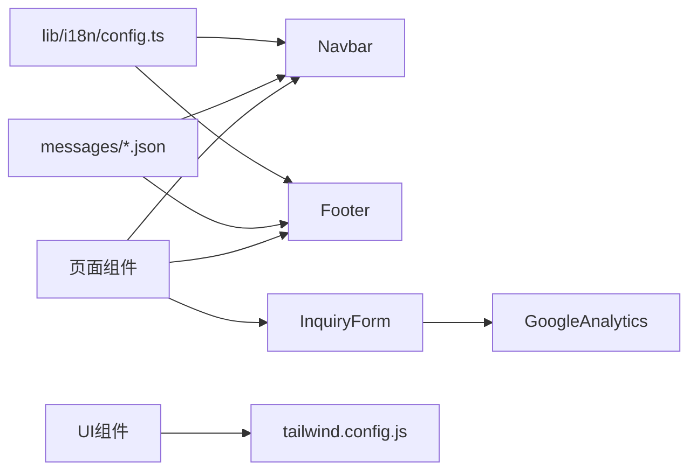

# 用户界面组件

<cite>
**本文引用的文件**
- [components/layout/navbar.tsx](file://components/layout/navbar.tsx)
- [components/layout/footer.tsx](file://components/layout/footer.tsx)
- [components/forms/InquiryForm.tsx](file://components/forms/InquiryForm.tsx)
- [components/ui/breadcrumb.tsx](file://components/ui/breadcrumb.tsx)
- [components/ui/pagination.tsx](file://components/ui/pagination.tsx)
- [components/analytics/GoogleAnalytics.tsx](file://components/analytics/GoogleAnalytics.tsx)
- [lib/i18n/config.ts](file://lib/i18n/config.ts)
- [messages/en.json](file://messages/en.json)
- [tailwind.config.js](file://tailwind.config.js)
- [app/[locale]/page.tsx](file://app/[locale]/page.tsx)
- [app/[locale]/contact/page.tsx](file://app/[locale]/contact/page.tsx)
- [app/[locale]/products/page.tsx](file://app/[locale]/products/page.tsx)
</cite>

## 目录
1. [简介](#简介)
2. [项目结构](#项目结构)
3. [核心组件](#核心组件)
4. [架构总览](#架构总览)
5. [组件详解](#组件详解)
6. [依赖关系分析](#依赖关系分析)
7. [性能考量](#性能考量)
8. [故障排查指南](#故障排查指南)
9. [结论](#结论)
10. [附录](#附录)

## 简介
本文件为 GoPro Trade 网站的用户界面组件综合文档，聚焦于可复用组件库的组织与职责、组件间通信与状态管理策略、导航栏与页脚的国际化与响应式实现、表单组件（尤其是询盘表单）的校验与提交流程、UI 工具组件（面包屑、分页）的实现与定制、以及样式系统（Tailwind CSS）与主题、响应式断点的使用规范。文档同时提供组件使用示例与最佳实践，帮助开发者与设计师高效协作。

## 项目结构
组件层位于 components 目录下，按功能域划分：
- layout：布局级组件（导航栏、页脚）
- ui：通用 UI 工具组件（面包屑、分页）
- forms：业务表单组件（询盘表单）
- analytics：分析埋点集成（Google Analytics）

页面层位于 app/[locale] 下，采用多语言路由与静态参数生成，页面内组合使用上述组件完成完整页面体验。

图表来源
- [app/[locale]/page.tsx](file://app/[locale]/page.tsx#L1-L334)
- [app/[locale]/contact/page.tsx](file://app/[locale]/contact/page.tsx#L1-L227)
- [app/[locale]/products/page.tsx](file://app/[locale]/products/page.tsx#L1-L295)
- [components/layout/navbar.tsx:1-215](file://components/layout/navbar.tsx#L1-L215)
- [components/layout/footer.tsx:1-170](file://components/layout/footer.tsx#L1-L170)
- [components/forms/InquiryForm.tsx:1-298](file://components/forms/InquiryForm.tsx#L1-L298)
- [components/ui/breadcrumb.tsx:1-87](file://components/ui/breadcrumb.tsx#L1-L87)
- [components/ui/pagination.tsx:1-83](file://components/ui/pagination.tsx#L1-L83)
- [components/analytics/GoogleAnalytics.tsx:1-93](file://components/analytics/GoogleAnalytics.tsx#L1-L93)
- [lib/i18n/config.ts:1-16](file://lib/i18n/config.ts#L1-L16)
- [messages/en.json:1-200](file://messages/en.json#L1-L200)
- [tailwind.config.js:1-18](file://tailwind.config.js#L1-L18)

章节来源
- [app/[locale]/page.tsx](file://app/[locale]/page.tsx#L1-L334)
- [app/[locale]/contact/page.tsx](file://app/[locale]/contact/page.tsx#L1-L227)
- [app/[locale]/products/page.tsx](file://app/[locale]/products/page.tsx#L1-L295)

## 核心组件
- 导航栏组件：负责站点主导航、语言切换、移动端菜单、CTA 按钮与当前路径高亮。
- 页脚组件：提供公司信息、快速链接、联系方式、社交图标、版权与法律条款。
- 询盘表单：收集公司、联系人、邮箱、电话、国家、感兴趣产品、数量范围、备注，并提交到后端 API。
- 面包屑组件：生成结构化数据与可访问的导航序列。
- 分页组件：支持页码省略与 RTL 布局适配。

章节来源
- [components/layout/navbar.tsx:1-215](file://components/layout/navbar.tsx#L1-L215)
- [components/layout/footer.tsx:1-170](file://components/layout/footer.tsx#L1-L170)
- [components/forms/InquiryForm.tsx:1-298](file://components/forms/InquiryForm.tsx#L1-L298)
- [components/ui/breadcrumb.tsx:1-87](file://components/ui/breadcrumb.tsx#L1-L87)
- [components/ui/pagination.tsx:1-83](file://components/ui/pagination.tsx#L1-L83)

## 架构总览
组件间通信与状态管理策略：
- 组件间通信：通过 props 向子组件传递消息与国际化键值；页面层负责聚合翻译与数据，再注入到组件。
- 状态管理：导航栏与表单使用 React 本地状态；面包屑与分页为纯展示组件，无内部状态。
- 国际化：统一从 lib/i18n/config.ts 读取可用语言与方向性；页面层按 locale 选择对应 messages 文件。
- 分析埋点：询盘表单提交成功后触发 GA4 自定义事件，页面切换通过 GoogleAnalytics 组件自动上报。

图表来源
- [app/[locale]/contact/page.tsx](file://app/[locale]/contact/page.tsx#L1-L227)
- [components/layout/navbar.tsx:1-215](file://components/layout/navbar.tsx#L1-L215)
- [components/forms/InquiryForm.tsx:1-298](file://components/forms/InquiryForm.tsx#L1-L298)
- [components/analytics/GoogleAnalytics.tsx:1-93](file://components/analytics/GoogleAnalytics.tsx#L1-L93)

## 组件详解

### 导航栏组件（Navbar）
职责与特性：
- 多语言支持：基于 locale 生成本地化链接与语言名称映射，支持 cookie 记忆语言偏好。
- 响应式设计：桌面端水平导航与语言切换下拉，移动端三线按钮展开菜单，含移动端语言切换与 CTA。
- 当前路径高亮：根据去除 locale 的路径进行高亮匹配。
- RTL 适配：根据语言方向动态添加类名以影响布局。

交互流程（语言切换）：

图表来源
- [components/layout/navbar.tsx:36-59](file://components/layout/navbar.tsx#L36-L59)
- [lib/i18n/config.ts:1-16](file://lib/i18n/config.ts#L1-L16)

章节来源
- [components/layout/navbar.tsx:1-215](file://components/layout/navbar.tsx#L1-L215)
- [lib/i18n/config.ts:1-16](file://lib/i18n/config.ts#L1-L16)

### 页脚组件（Footer）
职责与特性：
- 公司信息与描述：品牌标识与企业简介。
- 快速导航：首页、产品、方案、关于、支持等常用链接。
- 联系方式：地址与邮箱展示，支持多语言地址值切换。
- 社交媒体：占位链接与 SVG 图标。
- 版权与法律条款：隐私政策与使用条款链接。
- RTL 适配：针对特定语言（如阿拉伯语）调整布局方向。

章节来源
- [components/layout/footer.tsx:1-170](file://components/layout/footer.tsx#L1-L170)

### 询盘表单（InquiryForm）
职责与特性：
- 字段覆盖：公司名称、联系人、邮箱、电话、国家、感兴趣产品（多选）、数量范围、备注。
- 提交流程：阻止默认提交，构造请求体，调用 /api/inquiry，依据响应更新状态。
- 成功与错误反馈：显示绿色/红色提示框，成功后重置表单。
- GA4 转化跟踪：成功提交后触发自定义事件，上报 locale、产品数量、数量范围、国家等维度。
- 国际化：所有文案来自传入的消息对象，支持多语言占位符与选项文案。

提交流程时序：

图表来源
- [components/forms/InquiryForm.tsx:73-117](file://components/forms/InquiryForm.tsx#L73-L117)
- [components/analytics/GoogleAnalytics.tsx:78-84](file://components/analytics/GoogleAnalytics.tsx#L78-L84)

章节来源
- [components/forms/InquiryForm.tsx:1-298](file://components/forms/InquiryForm.tsx#L1-L298)
- [components/analytics/GoogleAnalytics.tsx:1-93](file://components/analytics/GoogleAnalytics.tsx#L1-L93)

### 面包屑组件（Breadcrumb）
职责与特性：
- 结构化数据：自动生成 JSON-LD BreadcrumbList，提升 SEO。
- 可访问性：最后一项标注当前页，其余项为可点击链接。
- RTL 支持：通过容器类名控制布局方向。
- 动态链接：基于站点基址与传入项生成完整 URL。

实现要点：
- 生成 BreadcrumbList 结构化数据脚本节点。
- 渲染可见的面包屑导航，最后一个项无链接。
- 支持 RTL 布局与可访问属性。

章节来源
- [components/ui/breadcrumb.tsx:1-87](file://components/ui/breadcrumb.tsx#L1-L87)

### 分页组件（Pagination）
职责与特性：
- 简化分页逻辑：当总页数不超过 7 时直接显示全部页码；否则在首尾与当前页周围省略中间页码。
- URL 构造：根据基础 URL 与查询参数拼接页码链接，自动处理已有查询串的连接符。
- RTL 适配：通过容器类名反转箭头方向，配合布局镜像。
- 禁用状态：当前页为第一页或最后一页时禁用上一页/下一页按钮。

章节来源
- [components/ui/pagination.tsx:1-83](file://components/ui/pagination.tsx#L1-L83)

### 页面中的组件使用示例
- 首页（[app/[locale]/page.tsx](file://app/[locale]/page.tsx#L1-L334)）：在页面中组合导航栏、页脚、结构化数据与内容区块。
- 产品页（[app/[locale]/products/page.tsx](file://app/[locale]/products/page.tsx#L1-L295)）：引入面包屑组件，构建分类侧边栏与产品网格。
- 询盘页（[app/[locale]/contact/page.tsx](file://app/[locale]/contact/page.tsx#L1-L227)）：注入表单所需消息与产品选项，右侧展示联系信息与快捷链接。

章节来源
- [app/[locale]/page.tsx](file://app/[locale]/page.tsx#L1-L334)
- [app/[locale]/products/page.tsx](file://app/[locale]/products/page.tsx#L1-L295)
- [app/[locale]/contact/page.tsx](file://app/[locale]/contact/page.tsx#L1-L227)

## 依赖关系分析
- 组件依赖国际化配置：Navbar 与 Footer 依赖 lib/i18n/config.ts 的语言列表与方向性。
- 页面依赖消息文件：各页面按 locale 选择 messages 文件，向组件注入文案。
- 表单依赖分析埋点：InquiryForm 依赖 GoogleAnalytics 的 trackEvent 工具。
- UI 组件依赖 Tailwind：面包屑与分页使用 Tailwind 类名与主题颜色。

图表来源
- [lib/i18n/config.ts:1-16](file://lib/i18n/config.ts#L1-L16)
- [messages/en.json:1-200](file://messages/en.json#L1-L200)
- [components/layout/navbar.tsx:1-215](file://components/layout/navbar.tsx#L1-L215)
- [components/layout/footer.tsx:1-170](file://components/layout/footer.tsx#L1-L170)
- [components/forms/InquiryForm.tsx:1-298](file://components/forms/InquiryForm.tsx#L1-L298)
- [components/analytics/GoogleAnalytics.tsx:1-93](file://components/analytics/GoogleAnalytics.tsx#L1-L93)
- [tailwind.config.js:1-18](file://tailwind.config.js#L1-L18)

章节来源
- [lib/i18n/config.ts:1-16](file://lib/i18n/config.ts#L1-L16)
- [messages/en.json:1-200](file://messages/en.json#L1-L200)
- [tailwind.config.js:1-18](file://tailwind.config.js#L1-L18)

## 性能考量
- 图片优化：产品页对首屏图片使用优先加载策略，其余图片懒加载，合理设置 sizes 与填充容器，减少主线程阻塞。
- 组件懒加载：页面按需加载，避免不必要的初始渲染。
- 分页省略：分页组件在页数较多时省略中间页码，降低 DOM 节点数量。
- 分析脚本策略：Google Analytics 使用 afterInteractive 策略，避免阻塞首包渲染。

章节来源
- [app/[locale]/products/page.tsx](file://app/[locale]/products/page.tsx#L230-L304)
- [components/analytics/GoogleAnalytics.tsx:43-67](file://components/analytics/GoogleAnalytics.tsx#L43-L67)

## 故障排查指南
- 语言切换无效：检查语言 cookie 设置与 getLocalizedHref 生成的链接是否正确，确认 locale 是否在可用列表中。
- 询盘提交失败：查看网络面板与后端返回状态，确认 /api/inquiry 接口可达；前端会显示错误提示并保持表单状态。
- 面包屑不生效：确认结构化数据脚本已注入，且 items 数组包含至少两项；检查最后一项是否为当前页。
- 分页链接异常：检查 baseUrl 是否包含查询参数，确保连接符拼接正确；RTL 模式下箭头方向是否反转。
- 分析埋点未上报：确认 NEXT_PUBLIC_GA_ID 环境变量存在，且页面已引入 GoogleAnalytics 组件。

章节来源
- [components/layout/navbar.tsx:36-59](file://components/layout/navbar.tsx#L36-L59)
- [components/forms/InquiryForm.tsx:73-117](file://components/forms/InquiryForm.tsx#L73-L117)
- [components/ui/breadcrumb.tsx:24-42](file://components/ui/breadcrumb.tsx#L24-L42)
- [components/ui/pagination.tsx:13-16](file://components/ui/pagination.tsx#L13-L16)
- [components/analytics/GoogleAnalytics.tsx:37-67](file://components/analytics/GoogleAnalytics.tsx#L37-L67)

## 结论
该组件体系以清晰的职责分离与可复用性为核心，结合国际化与响应式设计，提供了良好的用户体验与可维护性。导航栏与页脚承担统一的品牌与导航职责，表单与 UI 工具组件分别聚焦业务与通用展示，分析埋点贯穿关键转化路径。建议在后续迭代中持续关注性能指标与可访问性，进一步完善 RTL 与多语言的边界场景。

## 附录

### 组件样式系统与主题
- Tailwind 配置：content 覆盖 app 与 components 目录，确保样式扫描与按需生成。
- 主题扩展：新增 gopro-blue 与 gopro-cyan 两色，用于品牌一致性的色彩体系。
- 响应式断点：组件广泛使用 sm/md/lg/xl 等断点类名，确保在不同设备上的良好表现。

章节来源
- [tailwind.config.js:1-18](file://tailwind.config.js#L1-L18)

### 组件使用最佳实践
- 导航栏
  - 保持语言切换与路径高亮的一致性，避免重复渲染。
  - 移动端菜单与桌面端菜单的状态独立管理，避免相互干扰。
- 页脚
  - 快速链接与法律条款保持与导航栏一致的命名与顺序。
  - 社交链接占位符需在上线前替换为真实链接。
- 询盘表单
  - 表单字段必填与类型校验需与后端接口一致，避免无效提交。
  - 成功提交后及时重置表单并清空多选状态。
- 面包屑与分页
  - 面包屑最后一项不生成链接，避免重复路径。
  - 分页在 RTL 模式下需同步调整布局与箭头方向。