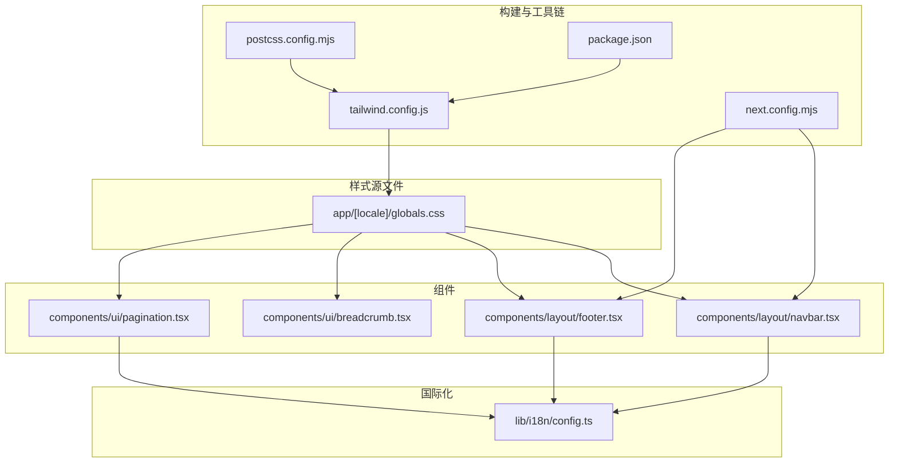
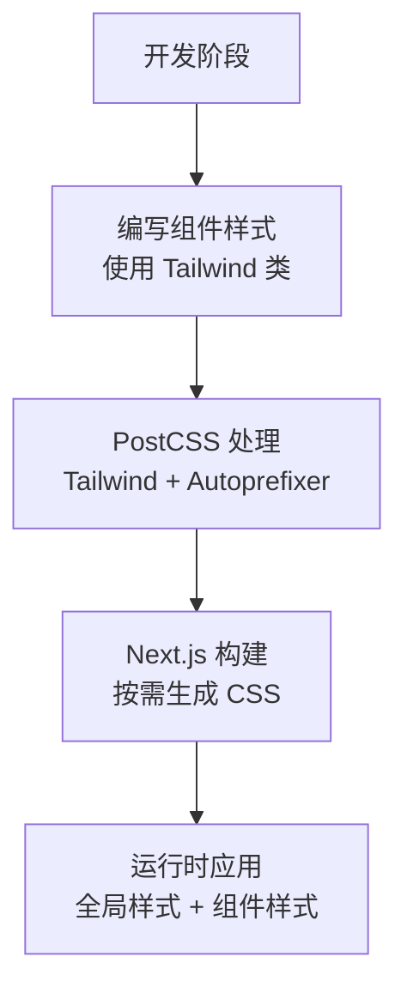
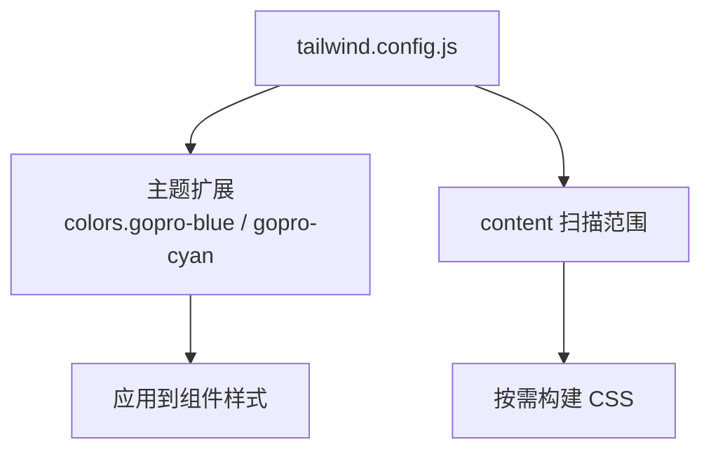
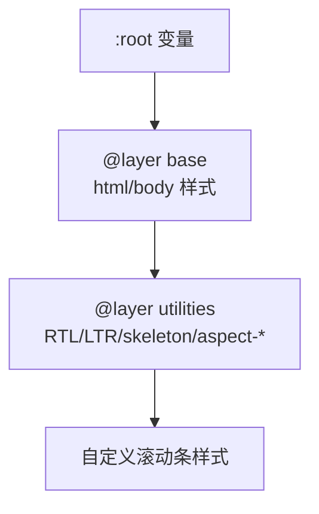
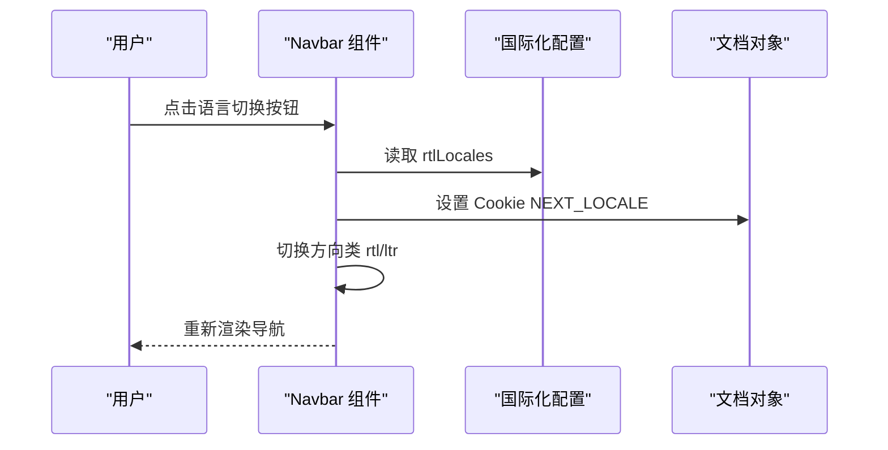
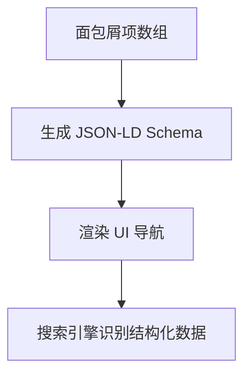
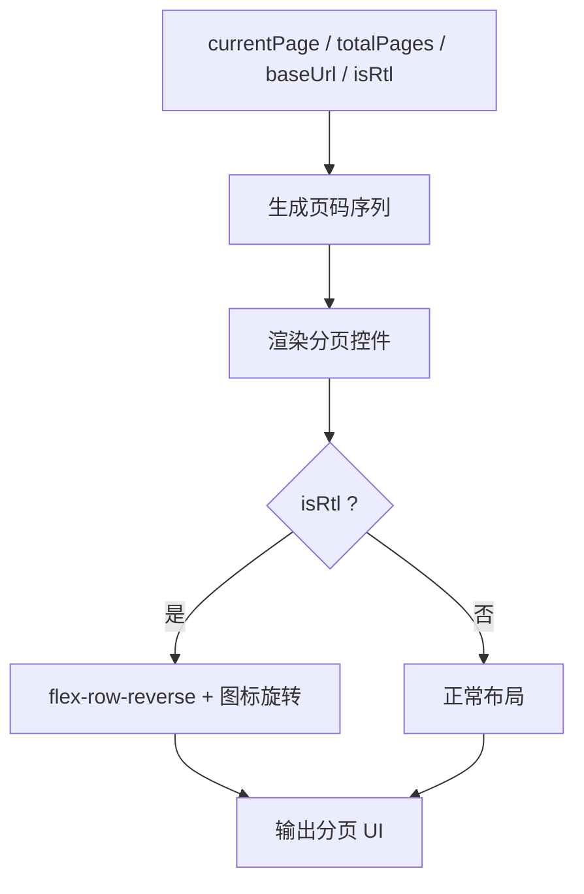
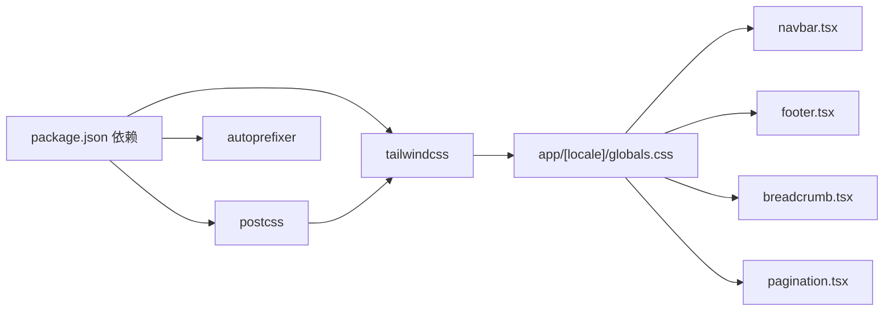

# 组件样式系统

<cite>
**本文引用的文件**
- [tailwind.config.js](file://tailwind.config.js)
- [postcss.config.mjs](file://postcss.config.mjs)
- [next.config.mjs](file://next.config.mjs)
- [package.json](file://package.json)
- [app/[locale]/globals.css](file://app/[locale]/globals.css)
- [components/layout/navbar.tsx](file://components/layout/navbar.tsx)
- [components/layout/footer.tsx](file://components/layout/footer.tsx)
- [components/ui/breadcrumb.tsx](file://components/ui/breadcrumb.tsx)
- [components/ui/pagination.tsx](file://components/ui/pagination.tsx)
- [lib/i18n/config.ts](file://lib/i18n/config.ts)
</cite>

## 目录
1. [简介](#简介)
2. [项目结构](#项目结构)
3. [核心组件](#核心组件)
4. [架构总览](#架构总览)
5. [详细组件分析](#详细组件分析)
6. [依赖关系分析](#依赖关系分析)
7. [性能考量](#性能考量)
8. [故障排查指南](#故障排查指南)
9. [结论](#结论)
10. [附录](#附录)

## 简介
本文件系统性梳理 GoPro Trade 网站的组件样式体系，重点围绕 Tailwind CSS 在项目中的配置与使用展开，涵盖自定义颜色主题、全局样式组织、组件级样式实现（含条件样式、主题切换、RTL 支持）、样式定制指南、性能优化策略以及调试与兼容性建议。文档旨在帮助开发者快速理解并高效维护样式系统。

## 项目结构
样式系统由以下层次构成：
- 构建与工具链层：PostCSS、Tailwind CSS、Next.js 配置
- 样式源文件层：全局样式、组件样式
- 组件层：导航栏、页脚、面包屑、分页等 UI 组件
- 国际化与方向性层：语言列表、RTL 列表、方向类名

**图表来源**
- [postcss.config.mjs](file://postcss.config.mjs)
- [tailwind.config.js](file://tailwind.config.js)
- [next.config.mjs](file://next.config.mjs)
- [package.json](file://package.json)
- [app/[locale]/globals.css](file://app/[locale]/globals.css)
- [components/layout/navbar.tsx](file://components/layout/navbar.tsx)
- [components/layout/footer.tsx](file://components/layout/footer.tsx)
- [components/ui/breadcrumb.tsx](file://components/ui/breadcrumb.tsx)
- [components/ui/pagination.tsx](file://components/ui/pagination.tsx)
- [lib/i18n/config.ts](file://lib/i18n/config.ts)

**章节来源**
- [postcss.config.mjs](file://postcss.config.mjs)
- [tailwind.config.js](file://tailwind.config.js)
- [next.config.mjs](file://next.config.mjs)
- [package.json](file://package.json)
- [app/[locale]/globals.css](file://app/[locale]/globals.css)
- [lib/i18n/config.ts](file://lib/i18n/config.ts)

## 核心组件
- Tailwind 配置：内容扫描范围、主题扩展（颜色）、插件
- PostCSS：Tailwind 与 Autoprefixer 集成
- 全局样式：基础层、工具层、RTL 类、骨架屏、滚动条
- 导航栏：条件样式（激活态、悬停态）、RTL 方向类、语言切换
- 页脚：背景色、方向类、链接样式
- 面包屑：结构化数据（JSON-LD）、可访问性标签、RTL 分隔符
- 分页：页码生成、RTL 翻转、方向图标旋转

**章节来源**
- [tailwind.config.js](file://tailwind.config.js)
- [postcss.config.mjs](file://postcss.config.mjs)
- [app/[locale]/globals.css](file://app/[locale]/globals.css)
- [components/layout/navbar.tsx](file://components/layout/navbar.tsx)
- [components/layout/footer.tsx](file://components/layout/footer.tsx)
- [components/ui/breadcrumb.tsx](file://components/ui/breadcrumb.tsx)
- [components/ui/pagination.tsx](file://components/ui/pagination.tsx)
- [lib/i18n/config.ts](file://lib/i18n/config.ts)

## 架构总览
Tailwind 在本项目中采用“按需扫描 + 自定义主题 + 全局工具类”的模式：
- 内容扫描：仅扫描 app 与 components、lib 目录，确保样式体积可控
- 主题扩展：新增品牌色（蓝色、青色），通过语义化命名复用
- 全局工具类：提供 RTL 方向类、骨架屏、宽高比等通用能力
- 组件样式：在组件内使用 Tailwind 类，结合国际化配置实现方向切换

[此图为概念性流程图，无需图表来源]

## 详细组件分析

### Tailwind 配置与主题
- 内容扫描范围：限制在 app、components、lib，避免无关文件参与编译
- 主题扩展：新增 gopro-blue、gopro-cyan 两个品牌色，用于导航、按钮、强调元素
- 插件：当前未启用额外插件，保持最小依赖

**图表来源**
- [tailwind.config.js](file://tailwind.config.js)

**章节来源**
- [tailwind.config.js](file://tailwind.config.js)

### 全局样式组织
- 基础层（base）：平滑滚动、字体栈（多语言零延迟）、图片懒加载占位
- 工具层（utilities）：RTL/LTR 方向类、骨架屏动画、视频/方形宽高比
- 自定义滚动条：统一跨浏览器滚动条外观

**图表来源**
- [app/[locale]/globals.css](file://app/[locale]/globals.css)

**章节来源**
- [app/[locale]/globals.css](file://app/[locale]/globals.css)

### 导航栏样式与主题切换
- 条件样式：根据当前路由高亮导航项；悬停态过渡；移动端菜单状态管理
- 主题切换：使用品牌色（蓝色、青色）作为主色调与强调色
- RTL 支持：根据语言判断是否应用 rtl/ltr 类，影响整体布局方向
- 无障碍：下拉菜单使用按钮控制，键盘可达；移动端菜单开关使用语义化 SVG

**图表来源**
- [components/layout/navbar.tsx](file://components/layout/navbar.tsx)
- [lib/i18n/config.ts](file://lib/i18n/config.ts)

**章节来源**
- [components/layout/navbar.tsx](file://components/layout/navbar.tsx)
- [lib/i18n/config.ts](file://lib/i18n/config.ts)

### 页脚样式与方向性
- 背景色：深灰背景，白色文字，强调对比度
- 方向类：根据语言应用 rtl/ltr，保证阿拉伯语等从右到左布局
- 链接样式：悬停变色，统一字体大小与间距

**章节来源**
- [components/layout/footer.tsx](file://components/layout/footer.tsx)
- [lib/i18n/config.ts](file://lib/i18n/config.ts)

### 面包屑样式与 SEO
- 结构化数据：生成 JSON-LD BreadcrumbList，提升 SEO
- 可访问性：nav 标签与 aria-label；当前页使用 aria-current
- RTL 支持：分隔符方向随语言变化

**图表来源**
- [components/ui/breadcrumb.tsx](file://components/ui/breadcrumb.tsx)

**章节来源**
- [components/ui/breadcrumb.tsx](file://components/ui/breadcrumb.tsx)

### 分页样式与 RTL 翻转
- 页码生成：根据当前页与总页数生成页码序列，包含省略号
- RTL 翻转：通过 flex-direction-reverse 与图标旋转适配阿拉伯语等
- 交互反馈：当前页高亮，其他页悬停高亮

**图表来源**
- [components/ui/pagination.tsx](file://components/ui/pagination.tsx)

**章节来源**
- [components/ui/pagination.tsx](file://components/ui/pagination.tsx)

## 依赖关系分析
- 构建依赖：Tailwind CSS、PostCSS、Autoprefixer 通过 package.json 管理
- 运行时依赖：Next.js 控制构建与缓存策略，PostCSS 驱动 Tailwind 编译
- 样式依赖：全局样式被所有组件共享；组件样式依赖全局工具类与主题色

**图表来源**
- [package.json](file://package.json)
- [postcss.config.mjs](file://postcss.config.mjs)
- [tailwind.config.js](file://tailwind.config.js)
- [app/[locale]/globals.css](file://app/[locale]/globals.css)
- [components/layout/navbar.tsx](file://components/layout/navbar.tsx)
- [components/layout/footer.tsx](file://components/layout/footer.tsx)
- [components/ui/breadcrumb.tsx](file://components/ui/breadcrumb.tsx)
- [components/ui/pagination.tsx](file://components/ui/pagination.tsx)

**章节来源**
- [package.json](file://package.json)
- [postcss.config.mjs](file://postcss.config.mjs)
- [tailwind.config.js](file://tailwind.config.js)
- [app/[locale]/globals.css](file://app/[locale]/globals.css)
- [components/layout/navbar.tsx](file://components/layout/navbar.tsx)
- [components/layout/footer.tsx](file://components/layout/footer.tsx)
- [components/ui/breadcrumb.tsx](file://components/ui/breadcrumb.tsx)
- [components/ui/pagination.tsx](file://components/ui/pagination.tsx)

## 性能考量
- 按需构建：Tailwind 内容扫描限制在 app、components、lib，避免无用样式进入产物
- 样式压缩：Next.js 启用 gzip 压缩，减少传输体积
- 缓存策略：静态资源与字体文件长期缓存，降低重复加载成本
- 图片优化：现代图片格式（AVIF/WebP）与懒加载占位，改善 CLS 与 LCP
- PostCSS：Autoprefixer 自动补全前缀，减少手动维护成本

**章节来源**
- [tailwind.config.js](file://tailwind.config.js)
- [next.config.mjs](file://next.config.mjs)
- [postcss.config.mjs](file://postcss.config.mjs)

## 故障排查指南
- 样式未生效
  - 检查 Tailwind 内容扫描路径是否包含目标组件
  - 确认全局样式已正确引入（@tailwind 指令）
- RTL 布局异常
  - 确认语言在 rtlLocales 列表中，并正确应用 rtl/ltr 类
  - 检查 flex-row-reverse 与图标旋转是否按需启用
- 骨架屏与布局抖动
  - 使用 aspect-* 工具类为图片容器预留比例
  - 骨架屏类名需与 @apply 一致
- 构建体积过大
  - 确保 content 扫描范围合理，避免扫描 node_modules 或未使用的目录
  - 清理未使用类名，合并重复样式

**章节来源**
- [tailwind.config.js](file://tailwind.config.js)
- [app/[locale]/globals.css](file://app/[locale]/globals.css)
- [lib/i18n/config.ts](file://lib/i18n/config.ts)

## 结论
本项目的样式系统以 Tailwind CSS 为核心，通过精简的内容扫描范围、品牌色主题扩展与全局工具类，实现了简洁高效的组件样式组织。配合 Next.js 的构建优化与缓存策略，整体具备良好的性能与可维护性。组件层面的条件样式、主题切换与 RTL 支持，满足了多语言与无障碍需求。

## 附录
- 样式定制指南
  - 主题色：在 tailwind.config.js 的 colors 下新增或修改品牌色，统一替换组件中的具体色值
  - 字体：在 globals.css 的字体栈中增加本地化字体，确保多语言显示效果
  - 间距：优先使用 Tailwind 的空间与间距工具类，避免硬编码像素值
- 调试技巧
  - 使用浏览器开发者工具查看元素类名，确认是否应用了预期的工具类
  - 对于 RTL 布局问题，检查方向类是否正确注入，以及 flex-row-reverse 是否生效
- 兼容性与无障碍
  - 保持 Autoprefixer 开启，自动处理浏览器前缀
  - 为交互元素提供明确的焦点样式与键盘可达性
  - 使用语义化标签与 aria 属性增强可访问性